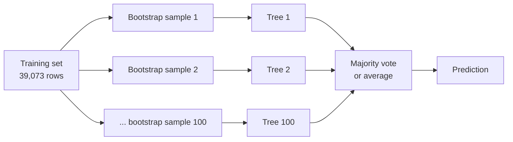

> **Learning objectives:** After this lesson, you will understand why combining hundreds of unstable trees yields a stable model, distinguish the two ways of combining them - bagging/random forest (grown in parallel, then voting) and boosting (grown in sequence, each tree correcting the errors of the previous one) - read out-of-bag and feature importance without being misled, run `RandomForestClassifier` and `HistGradientBoostingClassifier` on `adult`, and know why tree models still tend to win on tabular data.

## 1. 787 people guess the weight of an ox

A livestock fair in Plymouth (England). An ox is brought out, and anyone who wants to take part writes down their estimate of its weight *after slaughter*. Francis Galton borrowed the 787 valid tickets, sorted them and took the middle number: **1,207 pounds**. The true weight: **1,198 pounds** - off by less than 1%. He published the result in the journal *Nature* on 7 March 1907 under the title "Vox Populi" (the voice of the people).

Most of the guessers were not experts. Each individual was wrong - some guessed too high, some too low - but combined, the errors in opposite directions partly *cancel out*. The implicit condition: the estimates must be **different enough**; if 787 people all copy the same answer, combining them is no better than one person.

That is the idea of an **ensemble (a combined model)**: many models, each wrong in its own way, combined into something better than any member. Lesson 06 ended right at this point: decision trees are *unstable* - change 20% of the training data and the root question changes. In the target-shooting picture of Foundations · Lesson 14, a deep tree is a **low-bias, high-variance** model: the shots are around the center but scattered; the average of many scattered shots clusters together. The remaining question: where do you get "787 different trees" when you only have one training set?

> 🔧 **Try it now:** three people guess independently, each right 70% of the time. What is the probability that the *majority* (at least 2 of 3) is right?
> All three right: $0.7^3 = 0.343$; exactly two right: $3 \times 0.7^2 \times 0.3 = 0.441$. Sum: **0.784** - higher than each person's 0.7. With 11 people: ≈ 0.92; with 101 people: ≈ 1.00. The word "independently" is the crux - sections 2 and 3 are about how to create that independence.

## 2. Bagging: 100 training sets from one training set

If you don't have 100 training sets, *create* them. **Bootstrap**: from the 39,073 training rows of `adult`, randomly draw 39,073 rows **with replacement** - one row can be drawn two or three times, another not at all. Repeat 100 times and you get 100 training sets that are "similar but different". On each set grow a fully deep tree, then predict by **majority vote** (classification) or by **averaging** (regression). This technique is called **bagging** (bootstrap aggregating).



A surprising number: each bootstrap sample contains only about **63.2%** of the original rows; the remaining 36.8% are never drawn. The rows left out are called **out-of-bag (OOB)** - and they are a free test set: for each row, only the trees that have *never seen* that row get to vote, and the result is compared with the true label. On `adult`, the OOB accuracy of bagging is ≈ 85.1%, while the real test set gives ≈ 85.9% - two close estimates, and OOB costs no extra data. *An Introduction to Statistical Learning* notes that with a large enough number of trees, the OOB error is almost equivalent to leave-one-out cross-validation.

> 🔧 **Try it now:** why 63.2%? The probability that a specific row is *not* drawn in one draw is $1 - 1/n$; not drawn in all $n$ draws is $(1 - 1/n)^n$. Compute the probability of *being present* $1 - (1 - 1/n)^n$ for $n = 10$, $1{,}000$, $39{,}073$.
> Answer: ≈ **0.651; 0.632; 0.632** - converging to $1 - 1/e \approx 0.632$. Simulating with `numpy` (`rng.choice(n, n, replace=True)`, seed 42) on 39,073 rows: 63.3% of rows appear.

## 3. Random forest: forcing the trees to "disagree"

Run bagging on `adult` with 100 trees, each tree allowed to see all 105 columns after one-hot encoding. A problem shows up immediately: the columns that split most "sweetly" - marital status, capital gain (Lesson 06) - are chosen at the root of almost *every* tree. 100 similar trees, similar votes. *An Introduction to Statistical Learning* says it plainly: averaging many *highly correlated* quantities does not reduce variance by much. Exactly the scene of 787 people copying the same answer.

**Random forest** - Breiman, 2001 - fixes this with one small change: at **every split**, the tree may only consider a randomly chosen subset of columns, typically $m \approx \sqrt{p}$. On `adult`, `max_features="sqrt"` (the default of `RandomForestClassifier`) means each split looks at only **10 of the 105 columns**. It sounds like tying your own hands, but this forces the trees to use different columns - the book calls it *decorrelating* - and their average becomes more trustworthy. A bonus: fitting is faster (1.8 seconds versus 8.2 seconds for bagging).

Using the same preprocessing pipeline as Lessons 03 and 06 (impute missing values, one-hot; 80/20 split, `random_state=42`), on the 9,769 test rows:

| Model | Accuracy | F1 (class >50K) | ROC-AUC | Train accuracy |
|---|---|---|---|---|
| Logistic regression (Lesson 03) | ≈ 85.2% | ≈ 0.656 | ≈ 0.904 | 85.2% |
| Single tree, unlimited (Lesson 06) | ≈ 81.5% | ≈ 0.616 | ≈ 0.749 | 99.99% |
| Single tree, `max_depth=8` (Lesson 06) | ≈ 85.8% | ≈ 0.652 | ≈ 0.904 | 86.2% |
| Bagging, 100 trees | ≈ 85.9% | ≈ 0.681 | ≈ 0.904 | 99.99% |
| Random forest, 100 trees | ≈ 86.0% | ≈ 0.685 | ≈ 0.904 | 99.98% |
| Gradient boosting (section 4) | ≈ 87.5% | ≈ 0.715 | ≈ 0.929 | 88.3% |

Reading the table: 100 unlimited trees - the kind of tree that alone only reaches 81.5% - combine into 86.0%, better than the pruned tree and better than logistic regression on F1. Train accuracy is still 99.98%, yet test does not collapse: the variance has been averaged away. The number of trees is not a sensitive knob: 10 trees 85.4%, 30 trees 85.7%, 100 trees 86.0%, 300 trees 85.9% - the book notes that bagging and random forest **do not overfit as you add trees**; it just takes longer. Slightly shallower trees (`min_samples_leaf=5`) even edge up to 86.6%, AUC 0.917.

```python
import pandas as pd
from sklearn.datasets import fetch_openml
from sklearn.model_selection import train_test_split
from sklearn.compose import ColumnTransformer
from sklearn.impute import SimpleImputer
from sklearn.pipeline import make_pipeline
from sklearn.preprocessing import OneHotEncoder
from sklearn.ensemble import RandomForestClassifier, HistGradientBoostingClassifier
from sklearn.metrics import accuracy_score, f1_score, roc_auc_score
from sklearn.inspection import permutation_importance

adult = fetch_openml("adult", version=2, as_frame=True)
X, y = adult.data, (adult.target == ">50K").astype(int)                   # label 1 = income > 50K (Lesson 03)
X_train, X_test, y_train, y_test = train_test_split(X, y, test_size=0.2, random_state=42, stratify=y)
num = X.select_dtypes("number").columns;  cat = X.select_dtypes(exclude="number").columns
pre = ColumnTransformer([("num", SimpleImputer(strategy="median"), num),   # trees need no scaling (Lesson 06)
                         ("cat", make_pipeline(SimpleImputer(strategy="most_frequent"),
                                               OneHotEncoder(handle_unknown="ignore", sparse_output=False)), cat)])
rf  = make_pipeline(pre, RandomForestClassifier(n_estimators=100, oob_score=True, random_state=42, n_jobs=-1))
hgb = make_pipeline(pre, HistGradientBoostingClassifier(random_state=42))
for model_name, m in [("random forest", rf), ("gradient boosting", hgb)]:
    m.fit(X_train, y_train); p = m.predict(X_test); probabilities = m.predict_proba(X_test)[:, 1]
    print(model_name, round(accuracy_score(y_test, p), 3), round(f1_score(y_test, p), 3), round(roc_auc_score(y_test, probabilities), 3))
print("OOB:", round(rf[-1].oob_score_, 3))                                  # 0.85
imp = permutation_importance(rf, X_test, y_test, n_repeats=5, random_state=42, n_jobs=-1)   # shuffle each original column
print(pd.Series(imp.importances_mean, index=X_test.columns).sort_values(ascending=False).head(5).round(3))
# capital-gain 0.043, marital-status 0.019, occupation 0.017, age 0.015, hours-per-week 0.012
```

In exchange, a forest of 100 trees can no longer be read as a diagram; what remains is **feature importance** - and two ways of computing it give two different answers. The first, `feature_importances_`: sum the total Gini decrease each column contributes across every split of every tree. On the forest just trained, the top column is `fnlwgt` (0.171), then `age` (0.152). But `fnlwgt` is a *survey weight* - the number of people a row represents, almost meaningless for income - and it has 28,523 distinct values. The second, **permutation importance**: randomly shuffle *one* column on the test set and see how much accuracy drops. Result: `capital-gain` −4.3 points, `marital-status` −1.9, `occupation` −1.7, `age` −1.5, `hours-per-week` −1.2; `fnlwgt` only −0.3, 10th out of 14 columns.

> ⚠️ **A small note:** the scikit-learn documentation warns that `feature_importances_` (based on impurity decrease) has two flaws: it is computed on the *training set*, so it also reflects overfitting, and it is **biased toward columns with many distinct values** - a continuous numeric column has tens of thousands of thresholds to "try", so it is more likely to be chosen for a split than a 0/1 column even if it is no more useful. That is exactly why `fnlwgt` comes out on top. Permutation importance (`sklearn.inspection.permutation_importance`) is computed on unseen data and does not suffer from this flaw; Lessons 11 and 12 will use it again.

## 4. Boosting: each tree learns from the previous tree's mistakes

Binh in Foundations · Lesson 04 has a habit different from An's: do one practice exam, grade it, then *review only the questions they got wrong*, and move on to the next exam. **Boosting** grows trees in exactly that spirit. No bootstrap, no parallelism: tree 1 learns the data; compute what is still wrong (the **residual**); tree 2 learns *that remaining error*; add it on; compute the residual again; tree 3... Each tree is small (a few levels) and is only added **partially** - multiplied by the **learning rate** $\lambda$ (the book calls it *shrinkage*, typically 0.01-0.1) - so the model "learns slowly", like the person descending a mountain in fog in Foundations · Lesson 11: one short step at a time.

```mermaid
flowchart LR
    F0["Initial prediction<br/>(mean, or class proportion)"] --> R1["Residual = remaining error"]
    R1 --> T1["Tree 1 learns the residual"]
    T1 -- "times learning rate" --> F1["New prediction =<br/>old prediction + λ × tree 1"]
    F1 --> R2["New residual<br/>(already smaller)"]
    R2 --> T2["Tree 2 learns the new residual"]
    T2 -- "times learning rate" --> F2["New prediction =<br/>old prediction + λ × tree 2"]
    F2 --> M["... trees 3, 4, ..., B"]
```



By hand, for a house whose true price is 10 (arbitrary units), with an initial prediction equal to the mean, 6. Residual 4. Tree 1 learns that residual exactly and proposes "+4"; with $\lambda = 0.1$ we add only 0.4 → 6.4. The residual is now 3.6 → tree 2 proposes +3.6, we add 0.36 → 6.76. After 10 trees: ≈ 8.61; the remaining error shrinks to $4 \times 0.9^{10} \approx 1.39$. Slow - but that is the intent: each tree fixes only a little, leaving room for the next tree to fix things in a different way. *An Introduction to Statistical Learning* sums it up: methods that *learn slowly* tend to generalize well.

**Gradient boosting** - Friedman, 2001 - is the general version: for any loss function (log loss for classification, MSE for regression), the new tree learns the **negative gradient of the loss** with respect to the current prediction - literally descending the mountain, except that each step down is a tree. Three knobs: the number of trees $B$, the learning rate $\lambda$, and the depth of each tree. And one big difference from random forest: **boosting can overfit with too many trees**. On `adult` with $\lambda = 0.1$: 10 trees 85.4%, 50 trees 87.4%, 100 trees 87.5%, 300 trees 87.5% (train 90.1%), 1,000 trees drop to 86.9% (train 94.7%). Changing $\lambda$ with 100 trees: 0.01 has not learned enough (85.2%), 1.0 takes steps that are too long (84.8%).

scikit-learn's `HistGradientBoostingClassifier` - "Hist" because it bins each numeric column into at most 255 buckets (a histogram) to find split thresholds very fast, an approach inspired by LightGBM - defaults to 100 trees, $\lambda = 0.1$, and **stops early automatically** when the data has more than 10,000 rows: it carves 10% of train off as validation and stops when the score no longer improves - exactly how An & Binh kept a separate set of exams aside to know when to stop revising (Foundations · Lesson 04), now handled by the machine. On `adult` it reaches 87.5%, AUC 0.929, fitting in 1 second: the top of the table in section 3, 2.2 accuracy points and 0.06 F1 above logistic regression. 5-fold cross-validation on train gives the same ranking: logistic 85.1%, random forest 85.1%, gradient boosting 87.3%.

> 🔧 **Try it now:** feed `HistGradientBoostingClassifier(random_state=42)` the raw `X_train` *without* going through `pre` - no imputation, no one-hot.
> Answer: it runs, accuracy ≈ **0.877**, AUC ≈ 0.929, fit ≈ 0.3 seconds, stopping early at 80 trees (`hgb.n_iter_`). This class handles `NaN` and pandas `category` columns natively: for missing cells, each split learns on its own which branch to send them to. In this lesson we still use the shared `pre` for a fair comparison with the other models.

The same **GBDT (gradient-boosted decision trees)** family also includes XGBoost (Chen & Guestrin, 2016), LightGBM (Microsoft) and CatBoost (Yandex) - they differ in speed, handling of text columns and a few regularization techniques, but share the same core idea. For learning and for most medium-sized problems, scikit-learn's class is enough.

> ⚠️ **A small note:** the worked example above is the *regression* version, for ease of visualization. For classification, the "residual" is the gradient of the log loss with respect to the current score (log-odds), and the final prediction goes through a sigmoid as in Lesson 03 - the mechanism of adding up trees one by one stays exactly the same. Learning rate and number of trees pull against each other: the scikit-learn documentation states clearly that a smaller $\lambda$ needs more trees to keep the same training error; let early stopping choose the number of trees instead of guessing.

## 5. Why tree models tend to win on tabular data

In 2015, of the 29 winning solutions published on the Kaggle blog, **17** used XGBoost - a count made by the XGBoost authors themselves (Chen & Guestrin, KDD 2016). Seven years later, when deep learning had taken over images and text, Grinsztajn, Oyallon and Varoquaux (NeurIPS 2022, Datasets and Benchmarks) asked directly: *what about tabular data?* They built 45 medium-sized tabular datasets (around 10,000 rows), tuned both sides carefully, and concluded: tree-based models (random forest, GBDT) still lead on that benchmark, not counting their speed advantage.

The three reasons they found are quite "down to earth": neural networks favor *smooth* functions, whereas relationships in tabular data are often *jagged* (an income threshold, an age cutoff) - exactly what trees do with a split; neural networks are hurt more than trees by **uninformative columns**; and trees split *one column at a time*, so they preserve the meaning of each column instead of mixing them together.

Real applications of the "crowd of trees" predate the deep learning wave: the Xbox Kinect sensor recognizes 31 body parts from depth images using a random forest that classifies each pixel, running at 200 frames per second (Shotton et al., CVPR 2011). In Vietnam, a study from the Foreign Trade University published on the Economic - Financial Research portal of the Ministry of Finance (2026) used XGBoost to predict default for 1,462 small and medium-sized enterprises from accounting data, e-invoices and bank statements, reaching an AUC ≈ 0.86 - the most important feature was the ratio of cash inflows to the value of invoices issued.

Lesson 03 already explained why banks still often choose logistic regression: regulators need reasons. Forests and boosting trade the ability to read a diagram for accuracy; permutation importance makes up for part of that, and Lesson 12 will use it to explain the final model. Wrapping up the two ways of combining trees in the bias-variance language of Foundations · Lesson 14:

| | Bagging / Random forest | Gradient boosting |
|---|---|---|
| Member trees | Deep, grown independently, in parallel | Shallow, grown in sequence |
| Source of "disagreement" | Bootstrap + random column selection | Each tree learns what the previous one still got wrong |
| Main effect | Reduces the **variance** of deep trees | Pulls the **bias** of shallow trees down step by step |
| Keep adding trees | The error usually levels off; what grows is the cost | Can overfit → early stopping |
| Main knobs | `n_estimators`, `max_features`, `min_samples_leaf` | `learning_rate`, `max_iter`, `max_depth` / `max_leaf_nodes` |

## Lesson summary

- Ensemble = combining many models that are wrong *in different ways*; the middle number of the 787 estimates in Galton's example was off by less than 1%. Three people right 70% of the time voting independently → 78.4%; the condition is "disagreement".
- Bagging creates 100 training sets by bootstrap (each sample contains ≈ 63.2% of the original rows), grows deep trees and then votes/averages; the 36.8% out-of-bag rows give a free test estimate (85.1% versus 85.9% on the real test set).
- Random forest adds randomness at every split (`max_features="sqrt"`: 10/105 columns) so the trees are less correlated; on `adult`, 100 trees reach 86.0%, F1 0.685 - the pruned single tree 85.8%, logistic 85.2%; adding trees usually makes the error level off rather than get worse, and what grows is mainly the computational cost.
- `feature_importances_` is biased toward columns with many values (`fnlwgt` comes out on top even though it is the survey's sampling weight, not an attribute of the person surveyed); permutation importance on test puts `capital-gain`, `marital-status`, `occupation` at the top.
- Boosting grows trees in sequence, each tree learning the remaining error (the gradient of the loss), added up with a learning rate; too many trees overfit (1,000 trees: 86.9% versus 87.5% at 100 trees) → early stopping.
- `HistGradientBoostingClassifier` reaches 87.5%, F1 0.715, AUC 0.929 in 1 second, handles `NaN` and text columns by itself; same family as XGBoost, LightGBM, CatBoost.
- Bagging reduces variance, boosting reduces bias; on medium-sized tabular data, tree models still lead the 45-dataset benchmark of Grinsztajn et al. (2022).

## Self-check questions

1. Why do 787 people guessing the weight of an ox combine into a good result, while 100 bagging trees that "copy the same root question" gain little from being combined? How does random forest fix that?
2. **By hand:** with $n = 4$ rows, what is the probability that a specific row is present in a bootstrap sample? (Answer for self-checking: $1 - (3/4)^4 \approx 0.684$.) Why is OOB a valid error estimate without holding out a validation set?
3. Random forest on `adult` has train accuracy 99.98% but test 86.0%, and it does not drop when adding up to 300 trees. Boosting with 1,000 trees has train 94.7%, test dropping to 86.9%. Explain the difference in terms of bias-variance.
4. **By hand:** boosting with learning rate 0.5, true price 10, initial prediction 6, each tree learning the residual exactly. What is the prediction after 3 trees? Compared with $\lambda = 0.1$ in section 4, why do people still prefer a small $\lambda$?
5. Your boss looks at `feature_importances_` and concludes "`fnlwgt` is the deciding factor for income". How do you push back, and what do you propose computing instead?
6. You have a table of 8,000 rows and 40 mixed numeric and text columns, and you need an accurate model within an afternoon. What do you try, in what order, and why should you still run logistic regression as a baseline?

## Further reading

**Foundational sources for this lesson:**

| Source | Which part to read |
|---|---|
| **An Introduction to Statistical Learning (ISLP)** | Chapter 8, section 8.2.1 - bagging, out-of-bag, variable importance (Heart data); 8.2.2 - random forest and $m \approx \sqrt{p}$; 8.2.3 - boosting, Algorithm 8.2, the three parameters $B$, $\lambda$, $d$; 8.2.5 - summary of tree ensemble methods; 8.3.3-8.3.4 - lab with `RandomForestRegressor`, `GradientBoostingRegressor` |
| **scikit-learn User Guide** | Section 1.11 *Ensembles* - random forest (`max_features`, `oob_score`), gradient boosting (`learning_rate`, early stopping), the warning about impurity-based importance; section 5.2 *Permutation feature importance* |

**Additional online sources (free):**

- [Permutation Importance vs Random Forest Feature Importance (MDI) - scikit-learn](https://scikit-learn.org/stable/auto_examples/inspection/plot_permutation_importance.html) - the official example: a random numeric column is "more important" than real columns when using impurity.
- [HistGradientBoostingClassifier - scikit-learn](https://scikit-learn.org/stable/modules/generated/sklearn.ensemble.HistGradientBoostingClassifier.html) - the `learning_rate`, `max_iter`, `early_stopping`, `categorical_features` parameters.
- [Grinsztajn, Oyallon, Varoquaux - Why do tree-based models still outperform deep learning on typical tabular data? (NeurIPS 2022)](https://arxiv.org/abs/2207.08815) - the 45-dataset benchmark and three reasons about inductive bias.
- [Chen & Guestrin - XGBoost: A Scalable Tree Boosting System (KDD 2016)](https://arxiv.org/abs/1603.02754) - the original paper, with the 17/29 Kaggle 2015 solutions count.
- [Breiman - Random Forests (Machine Learning, 2001)](https://link.springer.com/article/10.1023/A:1010933404324) - the original paper, introducing out-of-bag and variable importance.
- [Galton - Vox Populi (Nature, 1907)](https://www.nature.com/articles/075450a0) - two pages, easy to read, on the 787 ox-weight tickets.
- [Shotton et al. - Real-Time Human Pose Recognition in Parts from Single Depth Images (CVPR 2011)](https://web.cs.ucdavis.edu/~yjlee/teaching/ecs289h-fall2014/kinect.pdf) - the random forest inside Kinect.
- [Nguyễn Đức Duy, Nguyễn Việt Dũng - Ứng dụng Machine Learning trong dự báo vỡ nợ doanh nghiệp nhỏ và vừa tại Việt Nam (Applying Machine Learning to Predict Default of Small and Medium-sized Enterprises in Vietnam; Economic - Financial Research portal, Ministry of Finance, 2026)](https://nghiencuu.tapchikinhtetaichinh.vn/ung-dung-machine-learning-trong-du-bao-vo-no-doanh-nghiep-nho-va-vua-tai-viet-nam-155417.html) - XGBoost on 1,462 Vietnamese enterprises.

> **Next lesson:** [SVM: Finding the Widest Margin](../svm-finding-the-widest-boundary/) - a forest wins by numbers; the next lesson is a model that wins by *geometry* - among the countless lines that separate two classes, pick the one with the widest margin, and only a few points right at the margin decide it.
