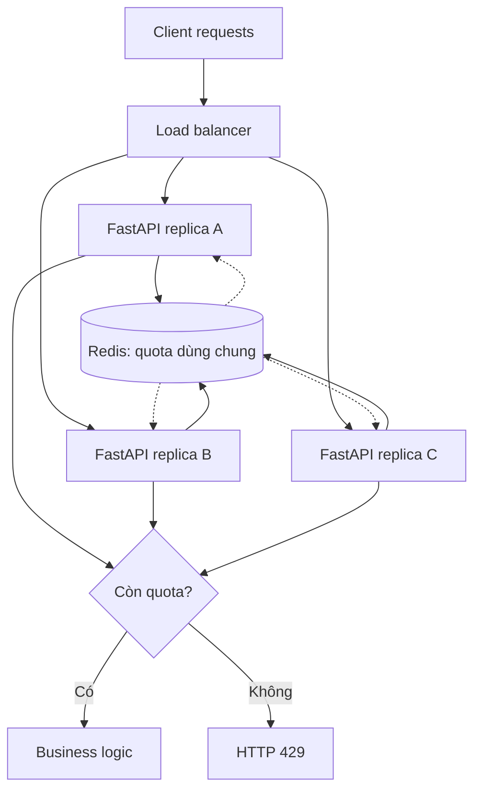
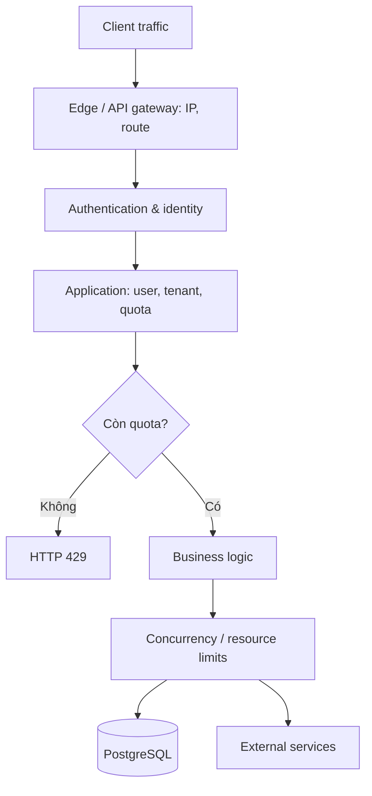

*Một API chạy ổn định ở vài trăm request mỗi giây. Nhưng khi một client gửi hàng nghìn request liên tục, latency tăng, PostgreSQL quá tải và người dùng khác cũng bị ảnh hưởng. Làm sao kiểm soát traffic mà không chặn nhầm những đợt truy cập hợp lệ?*

## 1. Khi một client có thể làm chậm cả hệ thống

Giả sử một nền tảng thương mại điện tử dùng FastAPI, PostgreSQL và Redis. Một client bị lỗi retry liên tục gọi `POST /api/orders` sau mỗi vài mili giây. Nó không nhất thiết đang tấn công, nhưng mỗi request vẫn có thể cần xác thực, kiểm tra tồn kho, đọc database và xử lý đơn hàng. PostgreSQL connection pool bắt đầu xếp hàng; khách hàng khác phải chờ.

Ta muốn đặt một quy tắc như "mỗi người dùng chỉ được gửi một số request nhất định trong một khoảng thời gian, nhưng vẫn có thể tạo những đợt truy cập ngắn hợp lý". Đó là **rate limiting**. Vấn đề là "100 request mỗi phút" có thể được triển khai theo nhiều thuật toán với hành vi rất khác nhau.

## 2. Rate limiting thực sự kiểm soát điều gì?

Rate limiting giới hạn tốc độ hoặc số thao tác mà một IP, user, API key hay tenant được phép thực hiện. Nó giúp bảo vệ tài nguyên, giữ **fairness** giữa các client và kiểm soát quota hoặc chi phí. Ví dụ: 60 request mỗi phút cho một API key; số lần thử đăng nhập; hoặc số tác vụ đắt tiền mà một tenant được phép khởi tạo.

Đây không phải giải pháp đầy đủ cho mọi kiểu tấn công từ chối dịch vụ. Traffic volumetric ở tầng mạng có thể cần CDN, WAF và bảo vệ trước khi request tới ứng dụng. Rate limiting cũng không thay thế authentication, authorization hay transaction trong database. Nó là một lớp kiểm soát trong kiến trúc rộng hơn.

## 3. Fixed window: dễ triển khai, nhưng có ranh giới

Với giới hạn 100 request/phút, **fixed window** chia thời gian thành các khoảng cố định, chẳng hạn 12:00:00-12:00:59 và 12:01:00-12:01:59. Mỗi user có một counter cho từng khoảng. Request thứ 101 trong cùng window bị từ chối; sang window mới, counter bắt đầu lại.

| Thời điểm | Counter trong window | Quyết định |
| :--- | ---: | :--- |
| 12:00:10 | 1 | Cho phép |
| 12:00:50 | 100 | Cho phép |
| 12:00:51 | 101 | Từ chối |
| 12:01:00 | 1 | Cho phép |

Một key Redis có thể gồm user và window, chẳng hạn `rl:user:123:minute:202611301200`; counter tăng bằng `INCR` và được dọn bằng TTL. Khi triển khai, thao tác tăng counter và đặt TTL cho key mới cần được phối hợp đúng để không vô tình tạo key tồn tại mãi.

Điểm yếu là **boundary burst**: client gửi 100 request lúc 12:00:59 rồi thêm 100 request lúc 12:01:00. Cả hai nhóm hợp lệ theo từng window, dù 200 request vừa xuất hiện trong vài giây. Fixed window không phải giới hạn chính xác cho *mọi* khoảng 60 giây liên tiếp.

## 4. Sliding window: nhìn vào khoảng thời gian vừa trôi qua

Với giới hạn 100 request trong 60 giây, **sliding window** kiểm tra 60 giây ngay trước request hiện tại. Request đến lúc 12:01:15 sẽ được so với traffic từ 12:00:15 tới lúc đó, tránh bước nhảy ở ranh giới phút.

**Sliding window log** lưu timestamp của từng request được chấp nhận, chẳng hạn trong Redis sorted set. Mỗi lần kiểm tra, ứng dụng xóa timestamp cũ, đếm entry còn lại và thêm timestamp mới nếu còn quota. `ZREMRANGEBYSCORE`, `ZCARD` và `ZADD` là những thao tác liên quan. Cách này có thể thực thi rolling window khá chính xác, nhưng bộ nhớ tăng theo số request cần lưu; các bước kiểm tra và thêm phải được phối hợp atomic khi nhiều request đến đồng thời.

**Sliding window counter** chỉ giữ counter của window hiện tại và window trước, rồi ước lượng số request trong rolling window:

```text
estimated = current_count + previous_count × (1 - elapsed_fraction)
```

Nếu 25% window hiện tại đã trôi qua, phần đóng góp ước lượng từ window trước là 75%. Cách này tiết kiệm bộ nhớ hơn, nhưng không chính xác như log vì nó giả định traffic ở window trước phân bố tương đối đều. **Độ chính xác và chi phí lưu trạng thái là một đánh đổi.**

## 5. Token bucket: cho phép burst có kiểm soát

Một ứng dụng di động có thể gửi nhiều request ngay khi người dùng mở app, rồi im lặng trong lúc họ đọc. **Token bucket** phù hợp với traffic không đều: mỗi user có bucket tối đa 10 token, hệ thống nạp thêm 2 token/giây, mỗi request tiêu thụ 1 token. Nếu bucket đã đầy, 10 request gần như đồng thời có thể được chấp nhận; sau đó phải chờ token mới.

```text
Capacity:     10 token
Refill rate:  2 token/giây
Cost:         1 token/request
```

Sau một khoảng không hoạt động, token được nạp theo `new_tokens = min(capacity, old_tokens + elapsed_seconds × refill_rate)`. **Capacity** quyết định burst tối đa; **refill rate** quyết định tốc độ dài hạn. Bucket này không đồng nghĩa với giới hạn cứng 120 request trong *mọi* rolling window 60 giây: token tích lũy chính là thứ cho phép những burst ngắn.

## 6. Chọn thuật toán theo yêu cầu

| Thuật toán | Điểm mạnh | Đánh đổi | Khi nào phù hợp |
| :--- | :--- | :--- | :--- |
| Fixed window | Đơn giản, ít bộ nhớ | Burst ở ranh giới window | Quota API cơ bản |
| Sliding window log | Rolling window chính xác hơn | Lưu trạng thái theo từng request | Quota cần kiểm soát chặt |
| Sliding window counter | Ít bộ nhớ hơn log | Chỉ là ước lượng | API thông thường |
| Token bucket | Cho phép burst hợp lệ | Không phải hard rolling-window quota | Traffic theo từng đợt |
| Leaky bucket | Có thể làm mượt tốc độ | Có thể cần queue hoặc delay | Downstream cần nhịp đều |

Với leaky bucket, *policing* có thể từ chối request vượt giới hạn, còn *shaping* có thể trì hoãn trong một queue có sức chứa hữu hạn. Không có thuật toán tốt nhất cho mọi endpoint. Phần dưới dùng token bucket để thấy rõ các vấn đề của rate limiting phân tán.

## 7. Vì sao counter trong Python không đủ khi có nhiều replica?

Một dictionary trong process chỉ đếm request đi qua process đó. Nếu ba FastAPI replica cùng đặt giới hạn 100 request nhưng giữ counter riêng, cùng một user có thể được cấp quota tại cả ba nơi. Muốn thực thi một quota chung, các replica cần dùng trạng thái chia sẻ, chẳng hạn Redis.



Sơ đồ mô tả quyết định logic: Redis trả kết quả cho replica đang xử lý, và **replica** mới tiếp tục nghiệp vụ hoặc trả 429. Shared state giải quyết việc quota bị nhân theo số replica, nhưng còn phải giải quyết request đồng thời.

## 8. Atomicity: vì sao `GET` rồi `SET` chưa đủ?

Giả sử bucket còn 1 token. Hai replica cùng `GET`, đều thấy 1, đều cho phép request rồi cùng `SET` thành 0. Hai request đã dùng một token. Đây là race condition.

Cần thực hiện chuỗi **đọc -> refill -> kiểm tra -> tiêu thụ -> cập nhật** như một quyết định atomic. Redis Lua script qua `EVAL`/`EVALSHA` (hoặc Redis Functions phù hợp) có thể thực hiện các lệnh đó mà request khác không xen vào giữa. Script chạy trên hot path phải ngắn: Redis không phục vụ lệnh khác trong lúc script đang thực thi.

## 9. Token bucket bằng Redis và Lua

Cho `POST /api/orders`, giả sử mỗi user có bucket 10 token, nạp 2 token/giây. Redis hash `rl:v1:orders:user:123` giữ `tokens` và `ts` (Unix milliseconds). Script minh họa:

```lua
local key = KEYS[1]
local capacity = tonumber(ARGV[1])
local rate = tonumber(ARGV[2])

-- Dùng đồng hồ của Redis thay vì đồng hồ từng replica.
local t = redis.call("TIME")
local now = tonumber(t[1]) * 1000
          + math.floor(tonumber(t[2]) / 1000)

local state = redis.call("HMGET", key, "tokens", "ts")
local tokens = tonumber(state[1]) or capacity
local last = tonumber(state[2]) or now
local elapsed = math.max(0, now - last)
tokens = math.min(capacity, tokens + elapsed * rate / 1000)

local allowed = 0
local retry_ms = 0
if tokens >= 1 then
    tokens = tokens - 1
    allowed = 1
else
    retry_ms = math.ceil((1 - tokens) * 1000 / rate)
end

redis.call("HSET", key, "tokens", tostring(tokens), "ts", now)
-- Dọn bucket không hoạt động sau khi đủ thời gian nạp đầy.
local ttl_ms = math.ceil(capacity * 2000 / rate)
redis.call("PEXPIRE", key, ttl_ms)
return {allowed, retry_ms}
```

Code giả định `capacity` và `rate` là số dương đã được xác thực, mỗi request tốn một token. Việc dùng `TIME` tránh lệch đồng hồ giữa các replica. TTL giúp dọn bucket không hoạt động; script này vẫn chỉ là phần lõi, chưa gồm script loading, xác thực, Redis errors và monitoring.

Trong FastAPI, một hàm kiểm tra có thể gọi script từ Redis client được tạo trong application lifespan:

```python
import math
from fastapi import HTTPException, Request


async def enforce_order_rate_limit(request: Request, user_id: str):
    redis_client = request.app.state.redis
    key = f"rl:v1:orders:user:{user_id}"

    allowed, retry_ms = await redis_client.eval(
        TOKEN_BUCKET_SCRIPT, 1, key,
        10,  # capacity
        2,   # tokens per second
    )
    if allowed == 0:
        retry_after = max(1, math.ceil(retry_ms / 1000))
        raise HTTPException(
            status_code=429,
            detail="Too many requests",
            headers={"Retry-After": str(retry_after)},
        )
```

`user_id` phải lấy từ danh tính đã xác thực, không phải giá trị client tùy ý gửi. Ví dụ cố ý tách logic limiter khỏi endpoint để dễ đọc. Trong ứng dụng thật, có thể đóng gói thành dependency, middleware hoặc service.

**Atomic trên Redis không tạo exactly-once semantics cho toàn bộ HTTP request.** Redis có thể đã trừ token nhưng kết nối đứt trước khi backend nhận phản hồi. Request được cho phép cũng chưa chắc nghiệp vụ phía sau thành công. Rate limiting kiểm soát tốc độ; **idempotency** giúp tránh tác động nghiệp vụ lặp ngoài ý muốn. API đặt hàng có thể cần cả hai.

## 10. HTTP 429: từ chối request rõ ràng

Khi vượt giới hạn, trả `429 Too Many Requests`, không phải lỗi 500 chung chung. Một response có thể là:

```http
HTTP/1.1 429 Too Many Requests
Content-Type: application/json
Retry-After: 3

{"error":"rate_limit_exceeded","message":"Try again later."}
```

`Retry-After` có thể là số giây hoặc HTTP-date. Với token bucket, ta có thể ước lượng thời gian nạp đủ token. Nhưng đó **không phải lời hứa** request tiếp theo chắc chắn thành công: client khác có thể dùng cùng quota hoặc có nhiều policy cùng áp dụng.

Client nên tôn trọng `Retry-After`, dùng backoff và jitter thay vì retry ngay hàng loạt. Với `POST` làm thay đổi dữ liệu, còn phải xem xét idempotency key và trạng thái request trước đó.

## 11. Giới hạn theo IP, user hay tenant?

Ta phải quyết định **ai** đang tiêu thụ quota. IP hữu ích cho traffic chưa xác thực, nhưng nhiều người có thể dùng chung IP qua NAT, còn một client có thể dùng nhiều IP. Authenticated user ID phù hợp cho tài khoản; API key phù hợp cho integration; SaaS thường cần thêm quota tenant.

| Phạm vi | Chính sách minh họa |
| :--- | :--- |
| IP chưa xác thực | 30 request/phút |
| User | 120 request/phút |
| Tenant | 2.000 request/phút |
| API đặt hàng | Bucket riêng |

Các giới hạn có thể áp dụng đồng thời. Nếu trừ token của user trước rồi mới biết tenant đã hết quota, user mất token dù request bị từ chối. Nếu cần quyết định all-or-nothing trên nhiều bucket, các bước kiểm tra/cập nhật phải được điều phối atomic. Với Redis Cluster, những key được một Lua script truy cập phải phù hợp quy tắc cùng hash slot; chọn hash tag còn phải tránh dồn mọi quota vào một shard nóng.

## 12. Rate limit không phải concurrency limit

Một endpoint nhận 10 request/giây, nhưng mỗi request mất 5 giây. Ở trạng thái ổn định tương ứng, số request đang xử lý trung bình có thể xấp xỉ `10 × 5 = 50` theo Little's Law. Giới hạn tốc độ nhận việc **không tự giới hạn số việc đang chạy cùng lúc**.

Rate limiting kiểm soát tốc độ công việc được chấp nhận; concurrency limiting kiểm soát số công việc đang xử lý. Semaphore, connection pool và backpressure có thể bảo vệ tài nguyên phía sau. Queue giúp hấp thụ burst, nhưng nếu tốc độ nhận việc liên tục vượt tốc độ xử lý, queue vẫn tăng. Các cơ chế này bổ sung chứ không thay thế nhau.

## 13. Redis lỗi: fail-open hay fail-closed?

Khi không kiểm tra được quota vì Redis timeout, **fail-open** cho request đi tiếp để giữ availability, nhưng có thể bỏ bảo vệ tài nguyên. **Fail-closed** từ chối request để giữ giới hạn nghiêm ngặt, nhưng cũng chặn người dùng hợp lệ. API đọc công khai có thể chấp nhận fail-open có kiểm soát; API đắt tiền hoặc quota nghiêm ngặt có thể cần fail-closed hoặc fallback hẹp hơn.

Một phương án trung gian là **emergency local limits** ở từng instance khi Redis lỗi. Chúng chỉ giới hạn rủi ro trong chế độ suy giảm, không tạo quota toàn cục chính xác. Failure policy cần được chọn *trước* sự cố, không để một exception handler tình cờ quyết định.

Redis eviction cũng quan trọng: nếu bucket state bị evict sớm, bucket có thể được khởi tạo lại ở trạng thái đầy, cho phép dùng quá quota dự kiến. Capacity, TTL và eviction policy của Redis giữ security-sensitive quota state cần được thiết kế khác một cache thông thường.

## 14. Limiter nên đặt ở đâu?

**Gateway/reverse proxy** có thể chặn sớm theo IP, API key hoặc route. **Application** có ngữ cảnh nghiệp vụ để xét user, tenant, gói dịch vụ và quota units. **Downstream service** có thể tự bảo vệ một tài nguyên đắt tiền. Các lớp này có thể cùng tồn tại:



Tránh các policy chồng chéo mà không biết policy nào đã từ chối request. Nếu dùng `X-Forwarded-For` để suy ra IP, chỉ tin header do reverse proxy *được cấu hình tin cậy* cung cấp, không tin giá trị client tự đặt. NGINX là một ví dụ gateway có module `limit_req` dựa trên leaky bucket.

## 15. Observability: nhiều 429 là tốt hay xấu?

Chỉ đếm 429 chưa đủ. Cần biết policy nào từ chối, ở endpoint nào, ai bị ảnh hưởng và hệ thống phía sau có thực sự khỏe hơn không.

| Metric | Mục đích |
| :--- | :--- |
| Allowed/rejected requests theo policy | Xem ai bị giới hạn và vì sao. |
| Limiter check latency, Redis errors | Đo chi phí và độ tin cậy của limiter. |
| Quota utilization | Phát hiện policy quá chặt hoặc quá lỏng. |
| API p95/p99 và retry traffic | Đo tác động lên trải nghiệm và tải lặp lại. |
| PostgreSQL/downstream load | Kiểm tra tài nguyên được bảo vệ. |
| State keys và memory | Kiểm soát chi phí lưu quota. |

429 tăng trong khi latency của request hợp lệ ổn định có thể là dấu hiệu limiter đang giúp. Nhưng nếu nhiều user hợp lệ bị chặn khi hệ thống còn capacity, policy có thể quá chặt. Đừng log nguyên API key hay access token chỉ để debug; dùng định danh nội bộ, policy ID và request trace thích hợp.

## 16. Benchmark cả correctness lẫn hiệu năng

Một limiter đúng khi gửi request tuần tự vẫn có thể sai khi có concurrency. Bộ test nên gồm:

1. **Giới hạn cơ bản:** kiểm tra vượt quota, ranh giới fixed window, refill và burst capacity.
2. **Request đồng thời:** bucket còn một token, nhiều replica cùng truy cập; chỉ một request được dùng token đó nếu chưa kịp refill thêm.
3. **Nhiều replica:** thêm instance không làm quota user tăng ngoài ý muốn.
4. **Redis lỗi:** xác nhận fail-open, fail-closed hoặc emergency limit đúng chính sách; đo tải downstream.
5. **Nhiều key:** đo memory và chi phí khi có rất nhiều user/API key.
6. **Fairness:** một tenant bận không tiêu thụ nhầm quota tenant khác; lưu ý quota isolation không tự bảo đảm latency isolation ở database chung.

Đo p50/p95/p99 của bước kiểm tra quota, HTTP latency, Redis operations/giây, số key, memory, quyết định sai so với mô hình tham chiếu và tải downstream. Với token bucket, nên dùng test case có thời gian được kiểm soát và mô hình tham chiếu (virtual clock) để bắt lỗi ở ranh giới refill; load test ngẫu nhiên không thay thế được correctness test.

## 17. Những sai lầm thường gặp

- Dùng counter cục bộ trong hệ thống nhiều replica rồi kỳ vọng quota toàn cục.
- Dùng `GET` rồi `SET` mà không bảo đảm atomicity.
- Chọn fixed window nhưng kỳ vọng hard rolling-window limit.
- Đồng nhất rate limit với giới hạn số request đang xử lý.
- Chỉ giới hạn theo IP, hoặc tin IP từ header không đáng tin.
- Không có failure policy khi Redis lỗi hay state bị evict.
- Trả 429 nhưng client retry ngay liên tục.
- Nghĩ limiter thay thế transaction, idempotency hay các business invariants.
- Chỉ đo số request bị từ chối, không đo tác động lên user hợp lệ.
- Thiết kế một distributed limiter quá phức tạp khi gateway limit đơn giản đã đủ.

## 18. Kết luận

Rate limiting không chỉ là đếm request rồi từ chối khi vượt một con số. Fixed window đơn giản nhưng có boundary burst; sliding window đổi chi phí lấy độ chính xác; token bucket cho phép burst ngắn nhưng giữ tốc độ dài hạn. Với nhiều replica, quota cần state dùng chung và thao tác atomic. Bên cạnh thuật toán, ta còn phải chọn danh tính, phạm vi quota, phản hồi 429, failure policy, concurrency limit và cách đo fairness.

**Limiter tốt không phải limiter từ chối nhiều nhất. Nó kiểm soát công việc đi vào, bảo vệ tài nguyên và giữ chất lượng phục vụ cho người dùng hợp lệ.** Trước khi chọn thuật toán, hãy hỏi: đang bảo vệ tài nguyên nào, traffic có được burst không, quota cần chính xác tới đâu và khi Redis lỗi thì availability hay việc thực thi giới hạn quan trọng hơn?

## References và tài liệu đọc thêm

- [Redis: Rate Limiter](https://redis.io/docs/latest/develop/use-cases/rate-limiter/)
- [Redis: Build 5 Rate Limiters with Redis](https://redis.io/tutorials/howtos/ratelimiting/)
- [Redis: Token Bucket Rate Limiter with redis-py](https://redis.io/docs/latest/develop/use-cases/rate-limiter/redis-py/)
- [Redis: Programmability](https://redis.io/docs/latest/develop/programmability/)
- [Redis: EVAL Command](https://redis.io/docs/latest/commands/eval/)
- [Redis: INCR Command](https://redis.io/docs/latest/commands/incr/)
- [Redis: Sorted Sets](https://redis.io/docs/latest/develop/data-types/sorted-sets/)
- [RFC 6585: Additional HTTP Status Codes](https://www.rfc-editor.org/rfc/rfc6585)
- [NGINX: ngx_http_limit_req_module](https://nginx.org/en/docs/http/ngx_http_limit_req_module.html)
- [NGINX: Limiting Access to Proxied HTTP Resources](https://docs.nginx.com/nginx/admin-guide/security-controls/controlling-access-proxied-http)
