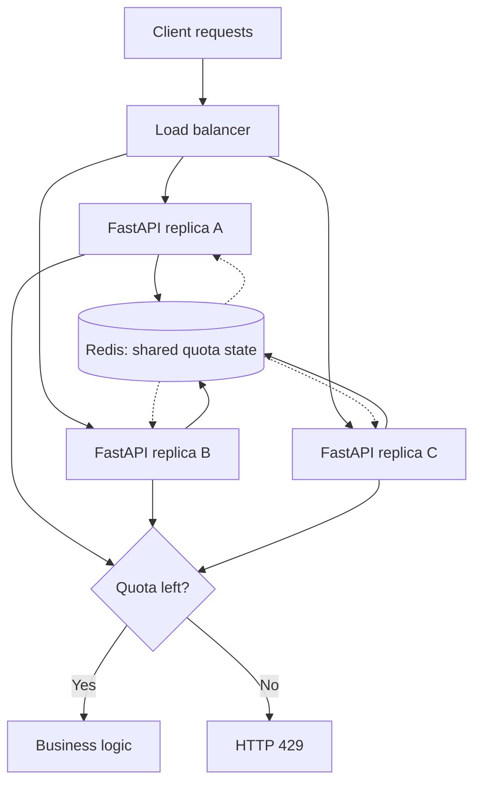
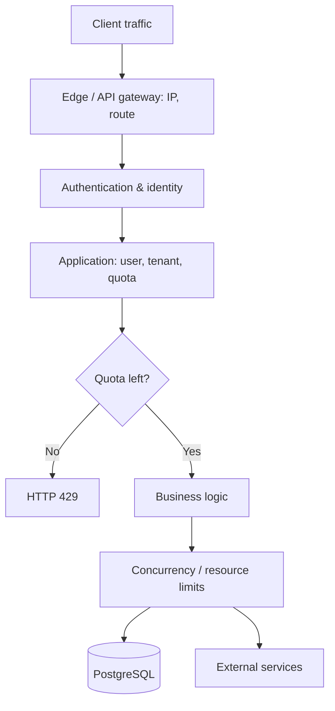

*An API runs smoothly at a few hundred requests per second. Then one client sends thousands of requests continuously. Latency climbs, PostgreSQL struggles, and everyone else feels it. How can we control traffic without blocking legitimate bursts?*

## 1. When one client can slow down everyone

Imagine an e-commerce platform using FastAPI, PostgreSQL, and Redis. A client with a broken retry loop calls `POST /api/orders` every few milliseconds. It may not be attacking the service, but each request can still require authentication, stock checks, database reads, and order processing. The PostgreSQL connection pool starts to queue; other customers wait.

We want a rule such as "each user may send a limited number of requests in a period, while short reasonable bursts are still allowed." That is **rate limiting**. The catch is that "100 requests per minute" can be implemented by several algorithms with quite different behavior.

## 2. What does rate limiting control?

Rate limiting controls the rate or number of operations allowed for an IP, user, API key, or tenant. It protects finite resources, promotes **fairness** between clients, and controls quotas or cost. Examples include 60 requests per minute for an API key, limiting login attempts, or limiting expensive tasks a tenant may start.

It is not a complete defense against every denial-of-service attack. Volumetric network traffic may require a CDN, WAF, or protection before requests reach the application. Rate limiting also does not replace authentication, authorization, or database transactions. It is one control in a broader architecture.

## 3. Fixed window: simple, with a sharp boundary

For a 100-requests-per-minute policy, a **fixed window** splits time into intervals such as 12:00:00-12:00:59 and 12:01:00-12:01:59. Each user has a counter per interval. The 101st request in one window is rejected; the count restarts in the next.

| Time | Counter in this window | Decision |
| :--- | ---: | :--- |
| 12:00:10 | 1 | Allow |
| 12:00:50 | 100 | Allow |
| 12:00:51 | 101 | Reject |
| 12:01:00 | 1 | Allow |

A Redis key might encode both user and window, such as `rl:user:123:minute:202611301200`. `INCR` updates the counter, and a TTL cleans up the key. In an implementation, coordinate the increment and first expiry correctly so a new key does not accidentally live forever.

The weakness is a **boundary burst**: a client sends 100 requests at 12:00:59 and another 100 at 12:01:00. Both batches are valid in their respective windows, although 200 requests arrived within seconds. A fixed window is not an exact limit for *every* consecutive 60-second period.

## 4. Sliding window: look back from each request

With a limit of 100 requests in 60 seconds, a **sliding window** examines the 60 seconds immediately before the current request. A request at 12:01:15 is compared with traffic since 12:00:15, avoiding the abrupt minute boundary.

A **sliding window log** saves a timestamp for each accepted request, for example in a Redis sorted set. At each check, remove old timestamps, count what remains, and add a new timestamp if there is room. Relevant commands include `ZREMRANGEBYSCORE`, `ZCARD`, and `ZADD`. The resulting rolling-window limit can be quite precise, but memory grows with the number of stored requests; the check and insert must also be coordinated atomically under concurrent load.

A **sliding window counter** keeps just the current and previous window counters and estimates the rolling total:

```text
estimated = current_count + previous_count × (1 - elapsed_fraction)
```

If 25% of the current window has elapsed, the previous window contributes an estimated 75%. This uses much less memory, but it assumes traffic was spread somewhat evenly in the previous window and is not as exact as a log. **Accuracy and state cost trade off against each other.**

## 5. Token bucket: allow controlled bursts

A mobile app may send several requests as it opens and then remain quiet while the user reads. A **token bucket** fits uneven traffic: each user has a bucket holding at most 10 tokens, the system refills it at 2 tokens per second, and each request spends one token. If the bucket is full, ten nearly simultaneous requests may pass; afterward the client must wait for new tokens.

```text
Capacity:     10 tokens
Refill rate:  2 tokens/second
Cost:         1 token/request
```

After idle time, refill follows `new_tokens = min(capacity, old_tokens + elapsed_seconds × refill_rate)`. **Capacity** sets the maximum burst; **refill rate** sets the long-run pace. This bucket does not mean a hard ceiling of 120 requests in *every* rolling 60-second window: accumulating tokens is precisely what permits short bursts.

## 6. Choose an algorithm for the requirement

| Algorithm | Strength | Tradeoff | Good fit |
| :--- | :--- | :--- | :--- |
| Fixed window | Simple, little state | Bursts at boundaries | Basic API quota |
| Sliding window log | More exact rolling window | State per request | Tighter quota |
| Sliding window counter | Less state than a log | Estimated count | General API traffic |
| Token bucket | Allows legitimate bursts | Not a hard rolling-window quota | Uneven traffic |
| Leaky bucket | Can smooth processing rate | May need a queue or delay | Downstream prefers steady work |

With leaky bucket, *policing* may reject requests over the limit, while *shaping* can delay them in a bounded queue. There is no universal best algorithm. We will use token bucket below because it makes the challenges of distributed rate limiting concrete.

## 7. Why an in-memory Python counter fails across replicas

A dictionary in one process counts only requests passing through that process. If three FastAPI replicas each enforce 100 requests using independent counters, the same user may receive a quota in all three. To enforce one shared quota, replicas need shared state, such as Redis.



The diagram shows the logical decision: Redis returns a result to the handling replica, and **that replica** continues or returns 429. Shared state prevents quota from multiplying by replica count, but simultaneous requests still need coordination.

## 8. Atomicity: why `GET` then `SET` is not enough

Suppose a bucket has one token left. Two replicas both `GET`, both see one, both allow a request, then both `SET` the balance to zero. Two requests spent one token. This is a race.

The whole **read -> refill -> check -> consume -> update** sequence needs to be one atomic decision. A Redis Lua script via `EVAL`/`EVALSHA` (or a suitable Redis Function) can execute those commands without another request interleaving. Keep hot-path scripts short: Redis does not serve other commands while a script is running.

## 9. A token bucket with Redis and Lua

For `POST /api/orders`, suppose each user gets a 10-token bucket refilling at two tokens per second. A Redis hash `rl:v1:orders:user:123` stores `tokens` and `ts` (Unix milliseconds). Here is an illustrative script:

```lua
local key = KEYS[1]
local capacity = tonumber(ARGV[1])
local rate = tonumber(ARGV[2])

-- Use Redis time rather than each replica's clock.
local t = redis.call("TIME")
local now = tonumber(t[1]) * 1000
          + math.floor(tonumber(t[2]) / 1000)

local state = redis.call("HMGET", key, "tokens", "ts")
local tokens = tonumber(state[1]) or capacity
local last = tonumber(state[2]) or now
local elapsed = math.max(0, now - last)
tokens = math.min(capacity, tokens + elapsed * rate / 1000)

local allowed = 0
local retry_ms = 0
if tokens >= 1 then
    tokens = tokens - 1
    allowed = 1
else
    retry_ms = math.ceil((1 - tokens) * 1000 / rate)
end

redis.call("HSET", key, "tokens", tostring(tokens), "ts", now)
-- Clean up inactive buckets after enough time to refill.
local ttl_ms = math.ceil(capacity * 2000 / rate)
redis.call("PEXPIRE", key, ttl_ms)
return {allowed, retry_ms}
```

This assumes `capacity` and `rate` have been validated as positive, and each request costs one token. Redis `TIME` avoids disagreement between replica clocks. TTL cleans up inactive buckets. The script is still only the core; script loading, authentication, Redis errors, and monitoring remain production concerns.

In FastAPI, a check can call the script through the Redis client created in the application lifespan:

```python
import math
from fastapi import HTTPException, Request


async def enforce_order_rate_limit(request: Request, user_id: str):
    redis_client = request.app.state.redis
    key = f"rl:v1:orders:user:{user_id}"

    allowed, retry_ms = await redis_client.eval(
        TOKEN_BUCKET_SCRIPT, 1, key,
        10,  # capacity
        2,   # tokens per second
    )
    if allowed == 0:
        retry_after = max(1, math.ceil(retry_ms / 1000))
        raise HTTPException(
            status_code=429,
            detail="Too many requests",
            headers={"Retry-After": str(retry_after)},
        )
```

`user_id` must come from an authenticated identity, not an arbitrary client-supplied value. The limiter is intentionally separate from the endpoint for clarity; real apps may package it as a dependency, middleware, or service.

**An atomic Redis decision does not provide exactly-once semantics for the entire HTTP request.** Redis may have spent the token before the connection fails and the backend receives no reply. Permission to proceed also does not mean the business operation succeeds. Rate limiting controls pace; **idempotency** helps avoid unintended repeated business effects. An order API may need both.

## 10. HTTP 429: reject clearly

When the limit is exceeded, return `429 Too Many Requests`, not a generic 500. For example:

```http
HTTP/1.1 429 Too Many Requests
Content-Type: application/json
Retry-After: 3

{"error":"rate_limit_exceeded","message":"Try again later."}
```

`Retry-After` may be a delay in seconds or an HTTP-date. With token bucket, the missing tokens and refill rate can provide an estimate. It is **not a promise** that the next attempt will succeed: another client may share the quota, and multiple policies may apply.

Clients should honor `Retry-After` and use appropriate backoff and jitter instead of immediately retrying in a loop. For state-changing `POST` requests, consider idempotency keys and the actual status of the earlier request too.

## 11. Limit by IP, user, or tenant?

We must decide **who** consumes the quota. IP can be useful for unauthenticated traffic, but many users can share a public IP through NAT while one client can use many IPs. Authenticated user IDs work for accounts, API keys for integrations, and SaaS products may also need tenant quotas.

| Scope | Illustrative policy |
| :--- | :--- |
| Unauthenticated IP | 30 requests/minute |
| User | 120 requests/minute |
| Tenant | 2,000 requests/minute |
| Order API | Separate token bucket |

These limits can all apply to one request. If the user token is spent before the system finds the tenant has no quota, the user loses a token for a rejected request. If a decision must be all-or-nothing across several buckets, checks and updates need an atomic coordination strategy. In Redis Cluster, keys accessed within a Lua script must satisfy the same-hash-slot rules; choosing a hash tag must also avoid concentrating every quota on one hot shard.

## 12. Rate limiting is not concurrency limiting

Suppose an endpoint accepts 10 requests per second, but each request takes five seconds. Under corresponding steady-state conditions, the average number in progress can be about `10 × 5 = 50` by Little's Law. Limiting arrivals **does not automatically limit work already running**.

Rate limiting controls accepted work per unit time; concurrency limiting controls work in progress. Semaphores, connection pools, and backpressure can protect downstream resources. A queue can absorb a burst, but it still grows if arrivals continuously exceed processing capacity. These mechanisms complement one another.

## 13. Redis fails: fail-open or fail-closed?

If a Redis timeout prevents a quota check, **fail-open** allows the request through to preserve availability but may remove resource protection. **Fail-closed** rejects it to enforce a strict limit but also blocks legitimate users. A public read API might allow controlled fail-open; a costly or strictly metered API may need fail-closed or a narrower fallback.

One middle ground is an **emergency local limit** on each instance during a Redis outage. It reduces risk in degraded mode, but it is not an exact global quota. Choose a failure policy *before* the incident rather than letting an exception handler accidentally decide it.

Redis eviction matters too: if bucket state is evicted early, it may be recreated full, granting extra tokens. Memory capacity, TTL, and eviction policy for security-sensitive quota state need different consideration from an ordinary performance cache.

## 14. Where should the limiter live?

An **API gateway or reverse proxy** can reject traffic early by IP, API key, or route. The **application** knows business context such as user, tenant, subscription tier, and quota units. A **downstream service** can protect its own expensive resource. These layers can work together:



Avoid overlapping policies whose rejection reason cannot be explained. When deriving an IP from `X-Forwarded-For`, trust only headers set and validated by configured trusted proxies, not arbitrary client input. NGINX's `limit_req` is an example of a gateway control based on a leaky-bucket approach.

## 15. Observability: are more 429s good or bad?

A 429 count alone is ambiguous. We need to know which policy rejected requests, where, who was affected, and whether downstream systems became healthier.

| Metric | What it reveals |
| :--- | :--- |
| Allowed/rejected requests by policy | Who is limited and why. |
| Limiter check latency, Redis errors | The limiter's cost and reliability. |
| Quota utilization | Whether policies are too strict or loose. |
| API p95/p99 and retry traffic | User experience and retry amplification. |
| PostgreSQL/downstream load | Whether protected resources benefit. |
| State keys and memory | Cost of maintaining quota state. |

More 429s with stable latency for valid traffic may mean the limiter is helping. But frequent rejection of legitimate users while capacity remains may mean the policy is too strict. Do not log raw API keys or access tokens just to debug limits; use appropriate internal identifiers, policy IDs, and request traces.

## 16. Benchmark correctness and performance

A limiter can work in a sequential test but fail under concurrency. A useful suite includes:

1. **Basic limit:** exceed quota, test fixed-window boundaries, token refill, and burst capacity.
2. **Concurrent requests:** with one token left, send requests to several replicas; only one should spend that token unless more refill during the test.
3. **Multiple replicas:** adding instances must not unintentionally multiply a user's quota.
4. **Redis failure:** confirm the chosen failure policy and measure downstream load.
5. **High-cardinality keys:** measure memory and algorithm cost with many users/API keys.
6. **Fairness:** one busy tenant must not consume another's quota; quota isolation alone does not guarantee latency isolation on a shared database.

Measure p50/p95/p99 of the quota check, HTTP latency, Redis operations per second, key count and memory, incorrect decisions against a reference model, and downstream load. For token bucket, use controlled-time test cases and a reference model with a virtual clock to catch refill-boundary errors; random load tests do not replace correctness tests.

## 17. Common mistakes

- Use local counters across replicas and expect one global quota.
- Use `GET` then `SET` without atomicity.
- Choose fixed window but expect an exact rolling-window ceiling.
- Confuse request rate with the number currently in progress.
- Limit only by IP, or trust an unverified forwarded-IP header.
- Omit a failure policy for Redis errors or evicted state.
- Return 429 while clients retry immediately and repeatedly.
- Assume rate limiting replaces transactions, idempotency, or business invariants.
- Count rejections without checking the impact on legitimate users.
- Build a complex distributed limiter when a simple gateway limit would suffice.

## 18. Conclusion

Rate limiting is more than counting requests and rejecting them above a number. Fixed windows are simple but permit boundary bursts; sliding windows trade state cost for precision; token buckets allow short bursts while controlling the long-run pace. Across replicas, quota needs shared state and atomic updates. The algorithm is only part of the design: identity, quota scope, 429 responses, failure policy, concurrency limits, and fairness all matter.

**A good limiter is not the one rejecting the most requests. It controls incoming work, protects resources, and preserves service for legitimate users.** Before selecting an algorithm, ask what resource needs protection, whether bursts are acceptable, how precise quotas must be, and whether availability or strict enforcement matters more when Redis fails.

## References and further reading

- [Redis: Rate Limiter](https://redis.io/docs/latest/develop/use-cases/rate-limiter/)
- [Redis: Build 5 Rate Limiters with Redis](https://redis.io/tutorials/howtos/ratelimiting/)
- [Redis: Token Bucket Rate Limiter with redis-py](https://redis.io/docs/latest/develop/use-cases/rate-limiter/redis-py/)
- [Redis: Programmability](https://redis.io/docs/latest/develop/programmability/)
- [Redis: EVAL Command](https://redis.io/docs/latest/commands/eval/)
- [Redis: INCR Command](https://redis.io/docs/latest/commands/incr/)
- [Redis: Sorted Sets](https://redis.io/docs/latest/develop/data-types/sorted-sets/)
- [RFC 6585: Additional HTTP Status Codes](https://www.rfc-editor.org/rfc/rfc6585)
- [NGINX: ngx_http_limit_req_module](https://nginx.org/en/docs/http/ngx_http_limit_req_module.html)
- [NGINX: Limiting Access to Proxied HTTP Resources](https://docs.nginx.com/nginx/admin-guide/security-controls/controlling-access-proxied-http)
