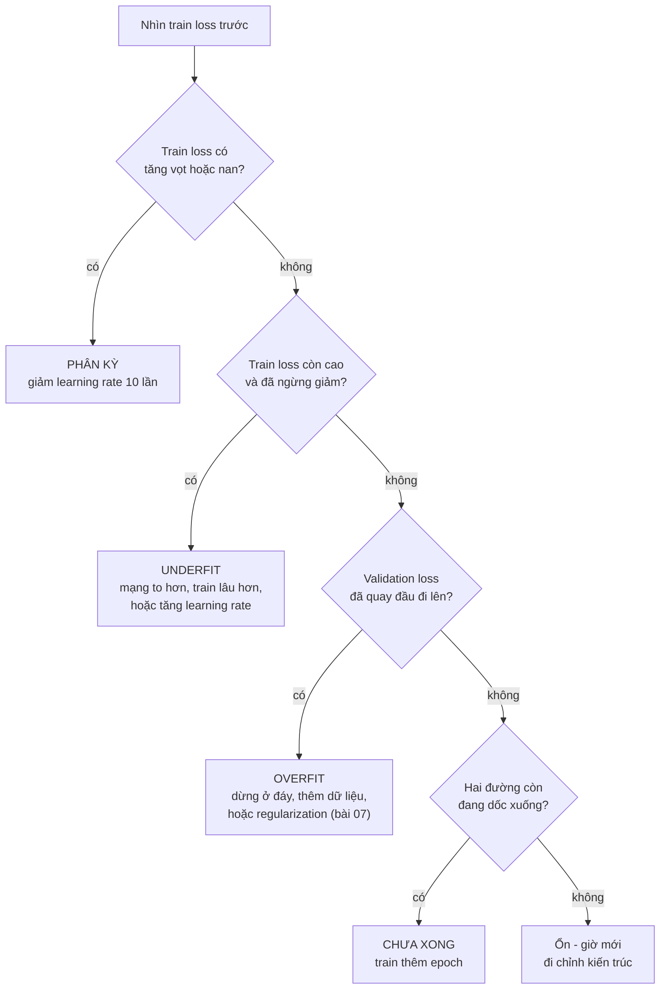

> **Mục tiêu bài học:** Sau bài này, bạn sẽ chẩn đoán được một mạng đang học sai kiểu gì chỉ bằng hai đường cong loss, nhận ra bốn chứng bệnh thường gặp qua dấu hiệu riêng của từng cái, và biết vì sao validation loss và validation accuracy có thể nói hai điều khác nhau.

## 1. Con số cuối cùng không nói cho bạn biết phải sửa gì

Bài 05 kết thúc bằng một con số: accuracy 0,8528. Nếu con số ấy không như ý, bạn làm gì tiếp?

Đây là chỗ deep learning khác hẳn chương Machine Learning. Với `LogisticRegression` hay `RandomForestClassifier`, bạn gọi `fit`, nhận kết quả, và phần lớn thời gian không cần biết bên trong xảy ra chuyện gì. Với mạng nơ-ron, `fit` là một quá trình kéo dài hàng chục vòng, và **hình dạng của quá trình ấy** mới là thứ cho biết phải sửa gì. Hai mô hình cùng đạt accuracy 0,80 có thể cần hai cách chữa ngược nhau.

Công cụ chẩn đoán là hai đường cong vẽ chung một trục: **train loss** và **validation loss** theo từng epoch. Foundations · Bài 14 đã dựng cách đọc chúng trên lý thuyết - cặp (train loss, validation loss) và đường cong chữ U. Bài này đọc chúng trên một mạng thật, nơi đường cong có nhiễu và không đẹp như hình vẽ.

> ⚠️ **Nhắc lại từ bài 05:** đường cong thứ hai vẽ trên **10.000 ảnh validation** - tập mà FashionMNIST đặt tên là *test* nhưng ở đây được dùng đúng vai trò validation, vì cả bài này chỉ làm mỗi việc nhìn nó để chẩn đoán và quyết định. Chính vì đã nhìn nhiều lần như vậy mà bài 12 không dùng lại nó làm con số báo cáo. Đây không phải chi tiết thủ tục: **mọi quyết định trong bài này đều dựa trên validation**, và nếu bạn thay chỗ đó bằng tập test dành để báo cáo thì con số cuối cùng của bạn hỏng ngay, dù mọi hình vẽ vẫn trông y hệt.

Sáu lần chạy dưới đây đều trên FashionMNIST, chỉ đổi một thứ mỗi lần.

## 2. Bốn chứng bệnh, bốn dấu hiệu

| Lần chạy | Thay đổi | train loss cuối | validation accuracy |
|---|---|---|---|
| **A** | learning rate = 0,001 | 1,0752 | 0,6564 |
| **B** | learning rate = 0,1 | 0,3363 | **0,8622** |
| **C** | learning rate = 2,0 | 2,3041 | 0,1000 |
| **D** | tầng ẩn chỉ 8 nơ-ron | 0,4379 | 0,8125 |

**B là ca khỏe mạnh** - mốc để so.

**C là ca dễ chẩn đoán nhất: phân kỳ.** Accuracy 0,1000 trên 10 lớp đúng bằng đoán bừa. Và train loss 2,3041 không phải con số ngẫu nhiên: $\ln(10) = 2{,}3026$ chính là cross-entropy khi mô hình chia đều xác suất cho cả 10 lớp - nó không còn phân biệt gì nữa. Bản thân con số ấy chỉ nói *mô hình đã sập về mức đoán bừa*, chưa nói nguyên nhân: một mạng chết vì ReLU tắt hết hay một mạng bị nối sai nhãn cũng dừng ở đúng chỗ đó. Điều chỉ đích danh phân kỳ là **diễn biến**: loss vọt lên rất cao ở vài chục bước đầu rồi mới nằm lì, và ở đây thủ phạm lộ ngay vì lần chạy này chỉ khác lần B đúng một thứ là learning rate. Learning rate quá lớn khiến mỗi bước vọt qua đáy sang sườn bên kia rồi văng ra xa hơn, đúng hình ảnh người xuống núi bước quá dài của Foundations · Bài 11.

> **Dấu hiệu:** loss tăng vọt trong vài chục bước đầu rồi nằm lì ở đúng $\ln(\text{số lớp})$, hoặc thành `nan`. **Chữa:** chia learning rate cho 10, chạy lại.

**A là ca dễ bị bỏ qua: học quá chậm.** Không có gì hỏng cả - loss vẫn giảm, không báo lỗi, đường cong vẫn đi xuống. Nó chỉ đi xuống chậm đến mức sau 15 epoch mới tới 1,0752, chỗ mà lần chạy B đi qua ngay trong epoch đầu.

> **Dấu hiệu:** cả hai đường cong đều còn đang giảm đều khi hết epoch, và còn cao. **Chữa:** tăng learning rate, hoặc train lâu hơn. Nhìn *độ dốc cuối đường cong*: còn dốc nghĩa là còn chỗ để đi.

**D là ca tinh vi nhất: mô hình quá nhỏ.** Train loss dừng ở 0,4379 và không xuống nữa, dù dữ liệu có 60.000 mẫu và bạn cứ để nó chạy. Tám nơ-ron ở tầng ẩn không đủ chỗ chứa quy luật cần học - đây là **underfitting**, và Foundations · Bài 13 gọi nguyên nhân của nó là capacity thấp.

> **Dấu hiệu quyết định:** **train loss** cao và không giảm nữa. Đây là dấu hiệu phân biệt quan trọng nhất trong cả bài - nếu mô hình còn không học nổi dữ liệu nó *đã nhìn thấy*, thì thêm dữ liệu hay thêm regularization đều vô ích. **Chữa:** mạng to hơn, train lâu hơn, hoặc đặc trưng tốt hơn.

## 3. Ca thứ năm: overfitting, nhìn từ một đường cong thật

Ba ca trên đều lộ ra ngay ở train loss. Ca này thì ngược lại - train loss trông *rất đẹp*.

Cố tình dựng điều kiện xấu nhất: chỉ **1.000 mẫu** train (thay vì 60.000), mạng **hai tầng ẩn 1.024 nơ-ron** (2,9 triệu tham số cho 1.000 mẫu), Adam, 60 epoch.

| Epoch | 1 | 3 | **6** | 10 | 20 | 40 | 60 |
|---|---|---|---|---|---|---|---|
| train loss | 1,3681 | 0,6179 | ~0,44 | 0,2512 | 0,1274 | 0,0284 | **0,0487** |
| validation loss | 0,8964 | 0,7124 | **0,6475** | 0,6534 | 0,8095 | 1,0009 | **0,9973** |

```
loss
 1.4 ┤*                                    ← train
     │ ╲
 1.0 ┤  ╲        ○─────○──────○────○───○   ← validation (lên!)
     │   ╲      ╱
 0.6 ┤ ○──○────○  ← đáy ở epoch 6
     │    ╲
 0.2 ┤     ╲___________________________    ← train vẫn xuống
 0.0 ┼────┬────┬────┬────┬────┬────┬────
     1    6   10   20   30   40   60  epoch
```

Đây là chữ U của Foundations · Bài 14, lần này bằng số thật. Validation loss chạm đáy **0,6475 tại epoch 6** rồi leo ngược lên 0,9973 - tệ hơn cả lúc mới bắt đầu ở epoch 2. Trong khi đó train loss vẫn tụt đều xuống 0,0487, tức mô hình gần như thuộc lòng 1.000 mẫu đó.

Khoảng cách giữa hai đường là thước đo trực tiếp: **0,26 ở epoch 6, lên 0,95 ở epoch 60**.

> **Dấu hiệu:** train loss giảm, validation loss chạm đáy rồi **quay đầu đi lên**, khoảng cách giữa hai đường ngày càng rộng. **Chữa:** dừng ở đáy của đường validation (early stopping), thêm dữ liệu, hoặc các kỹ thuật của bài 07.

> ⚠️ **Lưu ý nhỏ:** đường cong thật không mượt như hình vẽ trong sách. Ở lần chạy này, validation loss ở epoch 30 là 0,9737 rồi epoch 40 lên 1,0009 nhưng epoch 60 lại xuống 0,9973 - nhấp nhô quanh xu hướng. Đừng phản ứng với một epoch đơn lẻ. Cách làm quen thuộc là chỉ dừng khi validation loss **không cải thiện suốt $k$ epoch liên tiếp** (thường $k = 5$ đến 10), thay vì dừng ngay lần đầu thấy nó nhích lên - và giữ lại bản trọng số ở epoch tốt nhất, chứ không phải bản ở epoch cuối.

## 4. Khi loss và accuracy nói hai điều khác nhau

Cũng lần chạy đó, nhưng nhìn thêm cột accuracy:

| Epoch | 6 | 10 | 20 | 40 | **49** | 60 |
|---|---|---|---|---|---|---|
| validation loss | **0,6475** ← đáy | 0,6534 | 0,8095 | 1,0009 | - | 0,9973 |
| validation accuracy | ~0,78 | 0,7973 | 0,7918 | 0,8035 | **0,8093** ← đỉnh | 0,7962 |

Loss bảo "dừng ở epoch 6". Accuracy bảo "epoch 49 mới là tốt nhất". Hai chỉ số cùng đo trên cùng một tập validation lại chỉ về hai chỗ cách nhau 43 epoch.

Không cái nào sai - chúng đo hai thứ khác nhau. **Accuracy** chỉ hỏi lớp có điểm cao nhất có đúng không; nó không quan tâm mô hình tự tin đến đâu. **Cross-entropy** thì phạt rất nặng những ca mô hình vừa sai vừa chắc chắn. Khi train tiếp, mô hình trở nên *quá tự tin*: những ca nó vốn đoán đúng thì càng đoán đúng chắc hơn (accuracy giữ nguyên), nhưng những ca nó đoán sai thì cũng sai một cách tự tin hơn, và loss vọt lên.

Bài học thực hành: **chọn chỉ số để dừng theo thứ bạn thực sự cần**. Nếu chỉ cần nhãn dự đoán, theo dõi accuracy. Nếu cần *xác suất* dùng được - để chọn ngưỡng theo chi phí như chương Machine Learning · Bài 12, hay để xếp hạng - thì loss mới là chỉ số đúng, và một mô hình quá tự tin là mô hình đã hỏng dù accuracy còn đẹp.

Đây cũng chính là chuyện hiệu chỉnh xác suất mà chương Machine Learning · Bài 12 đã đo trên gradient boosting, nay gặp lại ở mạng nơ-ron.

## 5. Quy trình chẩn đoán

Gộp cả bài thành một cây quyết định:



Thứ tự trong sơ đồ có lý do: **luôn nhìn train loss trước**. Nếu mô hình còn chưa học nổi dữ liệu nó đã thấy, thì mọi kỹ thuật chống overfitting đều đang chữa sai bệnh - bạn sẽ làm một mô hình vốn đã quá yếu trở nên yếu hơn.

> 🔧 **Thử ngay:** train loss 0,05 và validation loss 0,95, cả hai đều đã phẳng. Bệnh gì, và bạn thử gì đầu tiên?
> Train loss rất thấp nghĩa là mô hình thừa sức học dữ liệu - không phải underfit. Validation loss cao gấp 19 lần và khoảng cách rộng: **overfit**. Việc đầu tiên nên thử là kiếm thêm dữ liệu, vì đó là cách chữa hiệu quả nhất và không đánh đổi gì; nếu không có thêm dữ liệu thì mới sang các kỹ thuật của bài 07. Đây đúng là ca lần chạy ở mục 3, nơi 1.000 mẫu cho 2,9 triệu tham số.

## Tóm tắt bài học

- Với mạng nơ-ron, con số cuối cùng không đủ để biết phải sửa gì; hình dạng của hai đường cong train loss và validation loss mới là công cụ chẩn đoán.
- **Phân kỳ**: loss tăng vọt rồi nằm lì ở $\ln(\text{số lớp})$ - lr = 2,0 cho train loss 2,3041 và accuracy 0,1000, đúng mức đoán bừa. Chữa bằng giảm learning rate.
- **Học quá chậm**: mọi thứ vẫn đúng, chỉ là lr quá nhỏ - lr = 0,001 sau 15 epoch mới tới chỗ lr = 0,1 đi qua trong epoch đầu.
- **Underfit**: train loss cao và đã ngừng giảm (8 nơ-ron ẩn dừng ở 0,4379). Đây là dấu hiệu quan trọng nhất: mô hình chưa học nổi dữ liệu đã thấy thì thêm dữ liệu hay regularization đều vô ích.
- **Overfit**: train loss vẫn giảm nhưng validation loss chạm đáy rồi đi lên - 1.000 mẫu cho mạng 2,9 triệu tham số làm validation loss chạm đáy 0,6475 ở epoch 6 rồi leo lên 0,9973, khoảng cách hai đường từ 0,26 lên 0,95.
- Validation loss và validation accuracy có thể chỉ về hai epoch khác nhau (6 và 49) vì loss phạt sự tự tin sai còn accuracy thì không; chọn chỉ số dừng theo thứ bạn thực sự cần.
- Luôn đọc train loss trước, rồi mới tới validation loss - thứ tự này quyết định bạn chữa đúng bệnh hay sai bệnh.
- Mọi đường cong dùng để *quyết định* phải là validation; tập test chỉ đem ra đánh giá sau khi mọi lựa chọn đã khóa - bài 12 làm đúng như vậy.

## Câu hỏi tự kiểm tra

1. Train loss của bạn dừng ở đúng 2,30 trên bài toán 10 lớp và không nhúc nhích. Chuyện gì đã xảy ra, và con số 2,30 từ đâu ra?
2. Hai mô hình cùng đạt accuracy 0,80. Một cái có train loss 0,05, cái kia 0,75. Chúng mắc bệnh gì, và cách chữa khác nhau ra sao?
3. Vì sao phải nhìn train loss trước validation loss? Nêu hậu quả cụ thể của việc làm ngược lại.
4. Validation loss ở epoch 20 là 0,80, epoch 21 là 0,82. Bạn có dừng ngay không? Vì sao?
5. Validation loss đạt đáy ở epoch 6 nhưng validation accuracy đạt đỉnh ở epoch 49. Giải thích hiện tượng, và cho biết bạn chọn checkpoint nào nếu đầu ra được dùng để xếp hạng theo xác suất.
6. Cả train loss lẫn validation loss đều đang giảm đều khi hết 15 epoch. Đây là bệnh hay không phải bệnh, và bạn làm gì?

## Đọc thêm

**Nguồn nền tảng của bài:**

| Nguồn | Đọc phần nào |
|---|---|
| **Foundations · Bài 14** | Mục 2 *Chẩn đoán bằng cặp (train loss, validation loss)* và mục 3 *Đường cong chữ U* - bài này là chính hai mục đó, đo trên một mạng thật |
| **Foundations · Bài 11** | Mục 3 *Learning rate: cỡ bước chân quyết định thành bại* - nguồn của ba lần chạy A, B, C |
| **Foundations · Bài 13** | Capacity - nguồn của lần chạy D |
| **Dive into Deep Learning (d2l.ai)** | Chương 3.6 *Generalization* - underfitting, overfitting và độ phức tạp mô hình, kèm đồ thị tương ứng |

**Nguồn online bổ sung (miễn phí):**

- [Karpathy - A Recipe for Training Neural Networks](https://karpathy.github.io/2019/04/25/recipe/) - quy trình chẩn đoán và gỡ lỗi khi train mạng, viết từ kinh nghiệm thực chiến; mục "overfit a single batch" là bài kiểm tra đầu tiên nên làm.
- [Google - Testing and Debugging in Machine Learning](https://developers.google.com/machine-learning/testing-debugging) - chương về đọc đường cong loss và các mẫu hỏng thường gặp.
- [TensorBoard với PyTorch](https://pytorch.org/tutorials/intermediate/tensorboard_tutorial.html) - công cụ vẽ và so sánh nhiều lần chạy, thay cho việc in số ra màn hình như trong bài.
- [Prechelt - Early Stopping, But When? (1998)](https://link.springer.com/chapter/10.1007/978-3-642-35289-8_5) - nghiên cứu về đúng câu hỏi ở mục 3: chờ bao nhiêu epoch trước khi kết luận validation loss đã quay đầu.

> **Bài tiếp theo:** [Regularization cho mạng sâu](../regularization-for-deep-networks-vi/) - bài này chẩn đoán ra overfitting rồi bảo "xem bài 07". Bài sau bật từng công cụ chống overfitting lên và đo xem mỗi cái đáng bao nhiêu điểm - bốn cái tên mà Foundations · Bài 14 mới chỉ kịp giới thiệu.
