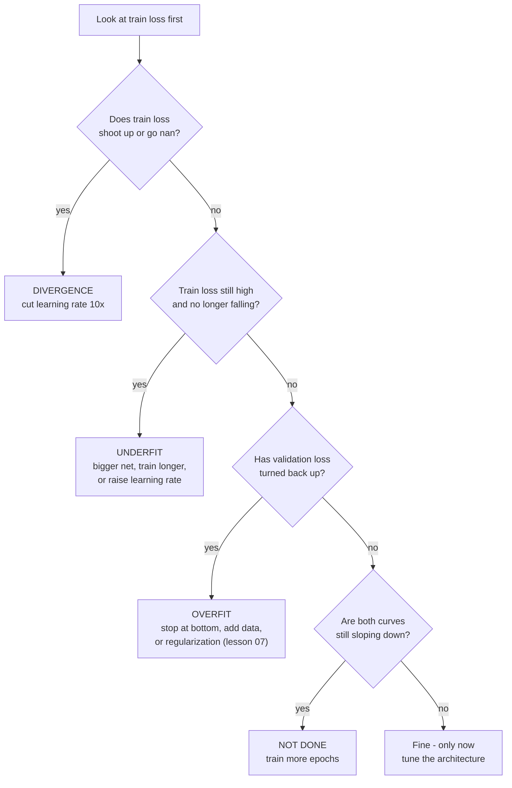

> **Learning objectives:** After this lesson, you will be able to diagnose what kind of trouble a network is having from its two loss curves alone, recognize four common problems by the signature of each one, and know why validation loss and validation accuracy can tell two different stories.

## 1. The final number does not tell you what to fix

Lesson 05 ended with a number: accuracy 0.8528. If that number is not what you hoped for, what do you do next?

This is where deep learning differs sharply from the Machine Learning chapter. With `LogisticRegression` or `RandomForestClassifier`, you call `fit`, get a result, and most of the time you do not need to know what happened inside. With a neural network, `fit` is a process lasting dozens of passes, and **the shape of that process** is what tells you what to fix. Two models that both reach 0.80 accuracy may need opposite fixes.

The diagnostic tool is two curves drawn on the same axes: **training loss** and **validation loss** per epoch. Foundations · Lesson 14 built the theory for reading them - the (train loss, validation loss) pair and the U-shaped curve. This lesson reads them on a real network, where the curves are noisy and not as neat as in the drawings.

> ⚠️ **A reminder from lesson 05:** the second curve is drawn on the **10,000 validation images** - the set FashionMNIST names *test* but that here is used in exactly the validation role, since this whole lesson does nothing but look at it to diagnose and decide. Precisely because it has been looked at so many times, lesson 12 does not reuse it as the reported number. This is not a procedural detail: **every decision in this lesson is based on validation**, and if you swap in the test set reserved for reporting, your final number is ruined at once, even though every plot looks exactly the same.

The six runs below are all on FashionMNIST, changing only one thing each time.

## 2. Four ailments, four signatures

| Run | Change | Final train loss | Validation accuracy |
|---|---|---|---|
| **A** | learning rate = 0.001 | 1.0752 | 0.6564 |
| **B** | learning rate = 0.1 | 0.3363 | **0.8622** |
| **C** | learning rate = 2.0 | 2.3041 | 0.1000 |
| **D** | hidden layer with only 8 neurons | 0.4379 | 0.8125 |

**B is the healthy case** - the reference point for comparison.

**C is the easiest case to diagnose: divergence.** An accuracy of 0.1000 on 10 classes is exactly random guessing. And a training loss of 2.3041 is not a random number: $\ln(10) = 2.3026$ is exactly the cross-entropy when the model spreads its probability evenly over all 10 classes - it no longer tells anything apart. By itself that number only says *the model has collapsed to the level of random guessing*, not why: a network killed by all its ReLUs switching off, or one wired to the wrong labels, also stops at exactly that spot. What pins it on divergence is **how it unfolds**: the loss shoots up very high in the first few dozen steps and only then flatlines, and here the culprit is obvious because this run differs from run B in exactly one thing, the learning rate. A learning rate that is too large makes each step overshoot the bottom onto the opposite slope and fly off even farther, exactly the picture of the hiker taking steps that are too long in Foundations · Lesson 11.

> **Signature:** the loss shoots up in the first few dozen steps and then flatlines at exactly $\ln(\text{number of classes})$, or becomes `nan`. **Fix:** divide the learning rate by 10 and run again.

**A is the case that is easy to miss: learning too slowly.** Nothing is broken - the loss still falls, there is no error, and the curve still goes down. It just goes down so slowly that after 15 epochs it only reaches 1.0752, a point run B passed within its first epoch.

> **Signature:** both curves are still falling steadily when the epochs run out, and are still high. **Fix:** increase the learning rate, or train longer. Look at *the slope at the end of the curve*: still steep means there is still room to go.

**D is the subtlest case: the model is too small.** The training loss stops at 0.4379 and goes no lower, even though the data has 60,000 samples and you keep letting it run. Eight neurons in the hidden layer do not have enough room to hold the patterns to be learned - this is **underfitting**, and Foundations · Lesson 13 calls its cause low capacity.

> **Decisive signature:** **training loss** is high and no longer falling. This is the most important distinguishing sign in the whole lesson - if the model cannot even learn the data it *has already seen*, then more data or more regularization is useless. **Fix:** a bigger network, longer training, or better features.

## 3. The fifth case: overfitting, seen on a real curve

The three cases above all show up immediately in the training loss. This one is the opposite - the training loss looks *very good*.

We deliberately set up the worst conditions: only **1,000 training samples** (instead of 60,000), a network with **two hidden layers of 1,024 neurons** (2.9 million parameters for 1,000 samples), Adam, 60 epochs.

| Epoch | 1 | 3 | **6** | 10 | 20 | 40 | 60 |
|---|---|---|---|---|---|---|---|
| train loss | 1.3681 | 0.6179 | ~0.44 | 0.2512 | 0.1274 | 0.0284 | **0.0487** |
| validation loss | 0.8964 | 0.7124 | **0.6475** | 0.6534 | 0.8095 | 1.0009 | **0.9973** |

```
loss
 1.4 ┤*                                    ← train
     │ ╲
 1.0 ┤  ╲        ○─────○──────○────○───○   ← validation (rising!)
     │   ╲      ╱
 0.6 ┤ ○──○────○  ← bottom at epoch 6
     │    ╲
 0.2 ┤     ╲___________________________    ← train still falling
 0.0 ┼────┬────┬────┬────┬────┬────┬────
     1    6   10   20   30   40   60  epoch
```

This is the U shape of Foundations · Lesson 14, this time with real numbers. Validation loss hits its bottom of **0.6475 at epoch 6** and then climbs back up to 0.9973 - worse even than at the start in epoch 2. Meanwhile the training loss keeps dropping steadily to 0.0487, meaning the model has nearly memorized those 1,000 samples.

The gap between the two curves is a direct measure: **0.26 at epoch 6, growing to 0.95 at epoch 60**.

> **Signature:** training loss falls, validation loss hits a bottom and then **turns back up**, and the gap between the two curves keeps widening. **Fix:** stop at the bottom of the validation curve (early stopping), add data, or use the techniques of lesson 07.

> ⚠️ **A small note:** real curves are not as smooth as the drawings in textbooks. In this run, validation loss was 0.9737 at epoch 30, rose to 1.0009 at epoch 40, but came back down to 0.9973 at epoch 60 - bobbing around the trend. Do not react to a single epoch. The usual approach is to stop only when validation loss **has not improved for $k$ consecutive epochs** (typically $k = 5$ to 10), rather than stopping the first time you see it tick up - and to keep the weights from the best epoch, not those from the last epoch.

## 4. When loss and accuracy tell different stories

The same run, but now also looking at the accuracy column:

| Epoch | 6 | 10 | 20 | 40 | **49** | 60 |
|---|---|---|---|---|---|---|
| validation loss | **0.6475** ← bottom | 0.6534 | 0.8095 | 1.0009 | - | 0.9973 |
| validation accuracy | ~0.78 | 0.7973 | 0.7918 | 0.8035 | **0.8093** ← peak | 0.7962 |

Loss says "stop at epoch 6". Accuracy says "epoch 49 is the best". Two metrics measured on the same validation set point to two places 43 epochs apart.

Neither is wrong - they measure two different things. **Accuracy** only asks whether the highest-scoring class is correct; it does not care how confident the model is. **Cross-entropy** penalizes very heavily the cases where the model is both wrong and confident. As training continues, the model becomes *overconfident*: the cases it already got right it gets right with more certainty (accuracy stays the same), but the cases it gets wrong it also gets wrong more confidently, and the loss shoots up.

The practical lesson: **choose the stopping metric according to what you actually need**. If you only need predicted labels, track accuracy. If you need usable *probabilities* - to choose a cost-based threshold as in Machine Learning · Lesson 12, or for ranking - then loss is the right metric, and an overconfident model is a broken model even if its accuracy still looks good.

This is also the same probability calibration issue that Machine Learning · Lesson 12 measured on gradient boosting, now met again in neural networks.

## 5. The diagnostic procedure

The whole lesson condensed into one decision tree:



The order in the diagram has a reason: **always look at training loss first**. If the model cannot yet learn the data it has seen, then every anti-overfitting technique treats the wrong ailment - you will make a model that is already too weak even weaker.

> 🔧 **Try it now:** training loss 0.05 and validation loss 0.95, both already flat. What is the ailment, and what do you try first?
> A very low training loss means the model has more than enough capacity to learn the data - not underfitting. Validation loss is 19 times higher and the gap is wide: **overfitting**. The first thing to try is getting more data, because it is the most effective fix and costs no trade-off; only if no more data is available do you move on to the techniques of lesson 07. This is exactly the run in section 3, with 1,000 samples for 2.9 million parameters.

## Lesson summary

- With neural networks, the final number is not enough to know what to fix; the shape of the two curves, training loss and validation loss, is the diagnostic tool.
- **Divergence**: the loss shoots up and then flatlines at $\ln(\text{number of classes})$ - lr = 2.0 gives a training loss of 2.3041 and accuracy of 0.1000, exactly the level of random guessing. Fix it by lowering the learning rate.
- **Learning too slowly**: everything is still correct, the lr is just too small - lr = 0.001 takes 15 epochs to reach the point lr = 0.1 passes within the first epoch.
- **Underfitting**: training loss is high and has stopped falling (8 hidden neurons stall at 0.4379). This is the most important sign: if the model cannot yet learn the data it has seen, more data or regularization is useless.
- **Overfitting**: training loss keeps falling but validation loss hits a bottom and then rises - 1,000 samples for a 2.9-million-parameter network makes validation loss bottom out at 0.6475 at epoch 6 and climb to 0.9973, with the gap between the curves growing from 0.26 to 0.95.
- Validation loss and validation accuracy can point to two different epochs (6 and 49) because loss penalizes confident mistakes while accuracy does not; choose the stopping metric according to what you actually need.
- Always read training loss first, then validation loss - this order decides whether you treat the right ailment or the wrong one.
- Every curve used to *make decisions* must be validation; the test set is brought out for evaluation only after every choice is locked in - lesson 12 does exactly that.

## Self-check questions

1. Your training loss stops at exactly 2.30 on a 10-class problem and does not budge. What happened, and where does the number 2.30 come from?
2. Two models both reach 0.80 accuracy. One has a training loss of 0.05, the other 0.75. What ailment does each have, and how do the fixes differ?
3. Why must you look at training loss before validation loss? State a concrete consequence of doing it the other way around.
4. Validation loss is 0.80 at epoch 20 and 0.82 at epoch 21. Do you stop right away? Why?
5. Validation loss reaches its bottom at epoch 6 but validation accuracy peaks at epoch 49. Explain the phenomenon, and say which checkpoint you would pick if the output is used for ranking by probability.
6. Both training loss and validation loss are still falling steadily when 15 epochs run out. Is this an ailment or not, and what do you do?

## Further reading

**Core sources for this lesson:**

| Source | What to read |
|---|---|
| **Foundations · Lesson 14** | Section 2 *Diagnosis with the pair (train loss, validation loss)* and section 3 *The U-shaped curve* - this lesson is those two sections, measured on a real network |
| **Foundations · Lesson 11** | Section 3 *Learning rate: the step size decides success or failure* - the source of the three runs A, B, C |
| **Foundations · Lesson 13** | Capacity - the source of run D |
| **Dive into Deep Learning (d2l.ai)** | Chapter 3.6 *Generalization* - underfitting, overfitting and model complexity, with the corresponding plots |

**Additional online sources (free):**

- [Karpathy - A Recipe for Training Neural Networks](https://karpathy.github.io/2019/04/25/recipe/) - a procedure for diagnosing and debugging network training, written from hands-on experience; the "overfit a single batch" section is the first test you should run.
- [Google - Testing and Debugging in Machine Learning](https://developers.google.com/machine-learning/testing-debugging) - a course on reading loss curves and common failure patterns.
- [TensorBoard with PyTorch](https://pytorch.org/tutorials/intermediate/tensorboard_tutorial.html) - a tool for plotting and comparing many runs, instead of printing numbers to the screen as in this lesson.
- [Prechelt - Early Stopping, But When? (1998)](https://link.springer.com/chapter/10.1007/978-3-642-35289-8_5) - research on exactly the question in section 3: how many epochs to wait before concluding that validation loss has turned back up.

> **Next lesson:** [Regularization for Deep Networks](../regularization-for-deep-networks/) - this lesson diagnoses overfitting and then says "see lesson 07". The next lesson switches on each anti-overfitting tool one at a time and measures how many points each is worth - four names that Foundations · Lesson 14 only had time to introduce.
