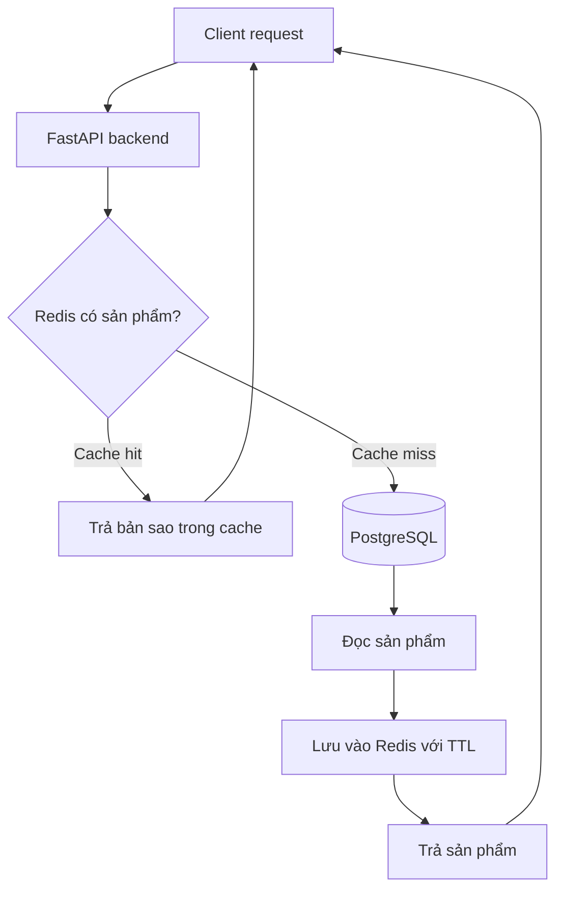
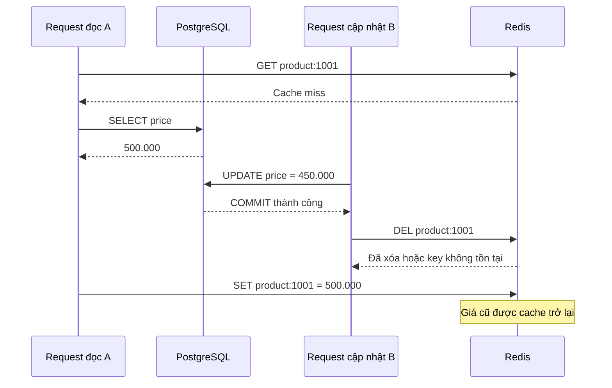

*Một API mất 150 ms để đọc PostgreSQL. Thêm Redis giúp phản hồi nhanh hơn, nhưng một ngày người dùng vẫn thấy giá cũ dù database đã cập nhật. Redis không lỗi, PostgreSQL cũng không lỗi. Vấn đề nằm ở đâu?*

## 1. Khi tối ưu hiệu năng tạo ra một vấn đề mới

Giả sử backend FastAPI phục vụ trang chi tiết sản phẩm. Câu truy vấn theo primary key đã được tối ưu:

```sql
SELECT id, name, price, category_id, description
FROM products
WHERE id = 1001;
```

Khi một sản phẩm được quảng bá, hàng nghìn request có thể đọc gần như cùng một dữ liệu. Team đặt Redis trước PostgreSQL: cache hit thì trả ngay; cache miss thì đọc database rồi lưu kết quả để dùng lại. Latency và số query giảm. Sau đó, bộ phận vận hành đổi giá từ 500.000 đồng xuống 450.000 đồng. PostgreSQL lưu giá mới, nhưng Redis vẫn giữ bản sao 500.000 đồng.

Đây là **stale data**: dữ liệu ứng dụng trả về không còn phản ánh trạng thái mới nhất của nguồn. Cả hai hệ thống đều hoạt động đúng theo thiết kế; phần thiếu là cách quản lý bản sao giữa chúng. **Ngay khi tạo cache, ta cũng nhận trách nhiệm quyết định bản sao đó sống bao lâu và bị loại bỏ khi nào.**

## 2. Cache là gì, và vì sao dùng Redis?

Caching lưu kết quả có thể tái sử dụng để tránh lặp lại một thao tác tốn kém như đọc database, gọi API ngoài hoặc tính toán response. Redis phù hợp với nhiều workload dạng này vì cung cấp key-value store trong bộ nhớ, TTL và nhiều cấu trúc dữ liệu. Tuy nhiên, **Redis là data store đa mục đích; caching chỉ là một cách sử dụng nó**. Redis còn có thể dùng cho session, counter, rate limit hoặc stream.

Trong bài này, PostgreSQL là **source of truth**, còn Redis là cache layer cho dữ liệu sản phẩm:



Đây là **cache-aside**: ứng dụng đọc cache trước và tự nạp cache khi cần.

## 3. Cache-aside hoạt động thế nào?

Giả sử key cho sản phẩm là `shop:v1:product:1001`. Request đầu tiên chưa thấy key, nên đọc PostgreSQL và lưu kết quả:

```text
SET shop:v1:product:1001 '{"id":1001,"name":"Wireless Headphones","price":500000}' EX 60
```

`EX 60` đặt TTL 60 giây. Những request sau có thể đọc trực tiếp từ Redis cho tới khi key hết hạn hoặc bị xóa.

| Trường hợp | Ứng dụng làm gì? |
| :--- | :--- |
| Cache hit | Redis có entry hợp lệ; trả bản sao. |
| Cache miss | Key chưa có hoặc đã hết hạn; đọc nguồn dữ liệu. |
| Expiration | Key hết TTL và không còn được trả như entry hợp lệ. |
| Invalidation | Ứng dụng chủ động loại bỏ hoặc vô hiệu hóa entry. |

Nếu cache biến mất, về nguyên tắc có thể xây lại nó từ PostgreSQL. Nhưng database phải chịu được tải khi nhiều request đồng loạt miss. Cũng không nên cache mọi thứ: dữ liệu hiển thị có thể chấp nhận một độ trễ nhất định, còn số dư ví, quyền truy cập hiện hành hay quyết định cho phép giao dịch cần cơ chế bảo đảm đúng đắn phù hợp.

**Chỉ cache khi có lợi ích tái sử dụng rõ ràng và đã xác định độ cũ có thể chấp nhận.**

## 4. Một ví dụ FastAPI và `redis.asyncio`

Ví dụ rút gọn sau minh họa đường đọc cache-aside:

```python
import json

from redis.asyncio import Redis
from redis.exceptions import RedisError
from sqlalchemy.ext.asyncio import AsyncSession


async def get_product(
    product_id: int,
    db: AsyncSession,
    cache: Redis,
) -> dict | None:
    cache_key = f"shop:v1:product:{product_id}"

    try:
        cached = await cache.get(cache_key)
        if cached is not None:
            return json.loads(cached)
    except RedisError:
        # Lỗi cache không nhất thiết làm API đọc bị ngừng.
        pass

    product = await db.get(Product, product_id)
    if product is None:
        return None

    data = {
        "id": product.id,
        "name": product.name,
        "price": product.price,
    }

    try:
        await cache.set(cache_key, json.dumps(data), ex=60)
    except RedisError:
        pass

    return data
```

Ví dụ giả định `Product` và database session đã tồn tại, `price` có thể chuyển sang JSON, đồng thời chưa giải quyết các race condition phía dưới. Trong production, cần ghi nhận lỗi cache, cấu hình timeout và giới hạn đường fallback thay vì chỉ `pass` như code minh họa.

Đừng tạo Redis client mới cho từng request. `redis-py` quản lý connection pool bên trong client; một worker có thể tạo client lúc startup, dùng lại và gọi `aclose()` lúc shutdown. Bên cạnh PostgreSQL pool, giờ ứng dụng còn phải quản lý cả Redis connections.

Hàm trên cũng chưa cache kết quả không tìm thấy. Nếu nhiều request hỏi cùng một ID không tồn tại, PostgreSQL vẫn bị đọc lặp lại. **Negative caching** có thể lưu sentinel "not found" với TTL ngắn, nhưng phải phân biệt kết quả không tồn tại với lỗi database tạm thời, và tính tới khả năng sản phẩm được tạo ngay sau đó.

## 5. TTL: dữ liệu được phép cũ bao lâu?

`TTL` là thời gian sống còn lại của key; có thể kiểm tra bằng `TTL shop:v1:product:1001`. Xét dòng thời gian:

| Thời điểm | Sự kiện |
| :--- | :--- |
| 10:00:00 | PostgreSQL có giá 500.000 đồng. |
| 10:00:01 | Ứng dụng cache giá đó với TTL 60 giây. |
| 10:00:10 | Quản trị viên đổi giá thành 450.000 đồng. |
| 10:00:20 | Người dùng vẫn nhận giá cũ từ Redis. |
| 10:01:01 | Key hết hạn; lần đọc sau có thể lấy giá mới. |

TTL ngắn giảm thời gian giữ bản sao cũ nhưng tăng số lần đọc nguồn. TTL dài tăng hit rate nhưng có thể kéo dài stale window. Không dùng TTL thì phải có chiến lược invalidation và quản lý bộ nhớ thật rõ.

TTL cũng **không luôn là giới hạn tuyệt đối cho tuổi dữ liệu** so với source of truth: một request đọc chậm có thể ghi lại giá trị cũ *sau* khi dữ liệu nguồn đã thay đổi, bắt đầu một TTL mới trên bản cũ. Vì thế, TTL phải đi cùng chiến lược consistency phù hợp.

## 6. Invalidation: khi dữ liệu nguồn thay đổi

Với cache-aside, một quy trình cập nhật phổ biến là:

```text
1. UPDATE sản phẩm trong PostgreSQL
2. COMMIT transaction
3. DEL key sản phẩm trong Redis
```

Lần đọc kế tiếp sẽ cache miss, đọc giá mới và nạp lại cache. Vì sao xóa *sau* commit? Nếu xóa trước, request khác có thể miss rồi đọc giá cũ khi transaction chưa commit, sau đó đưa giá cũ trở lại Redis.

Nhưng xóa sau commit vẫn chưa bảo đảm nhất quán tuyệt đối. Nếu commit thành công mà lệnh `DEL` thất bại, PostgreSQL có giá mới còn Redis có thể giữ giá cũ. Có thể dựa vào TTL như một lớp phục hồi cho dữ liệu chấp nhận eventual consistency, đồng thời giám sát lỗi invalidation. Khi cần cơ chế tin cậy hơn, có thể phát sự kiện sau commit qua transactional outbox; vẫn phải xử lý thứ tự sự kiện và các request đọc đang chạy song song.

## 7. Race condition: giá cũ quay lại sau khi đã xóa cache

Một request A miss cache và đọc giá cũ 500.000 đồng từ PostgreSQL, nhưng chưa kịp ghi vào Redis. Request B cập nhật giá thành 450.000 đồng, commit rồi xóa key. Cuối cùng A mới ghi 500.000 đồng vào Redis:



**Invalidate sau commit không tự loại bỏ mọi khả năng ghi lại dữ liệu cũ.** Với dữ liệu ít quan trọng và TTL ngắn, một stale window có thể chấp nhận được. Khi cần bảo đảm cao hơn, có thể dùng version cho cache entry, versioned key gắn với generation hiện hành, điều phối việc nạp cache với cập nhật dữ liệu, hoặc bỏ qua cache ở đường đọc yêu cầu dữ liệu mới nhất. Version chỉ có ích khi quy tắc xác định và so sánh version được thiết kế tin cậy; thêm một field `version` mà không kiểm tra trước khi ghi không giải quyết race.

Câu hỏi cần trả lời không phải chỉ là "TTL bao nhiêu?", mà là: **Một response được phép cũ trong bao lâu, và hậu quả nếu người dùng hành động dựa trên nó là gì?**

## 8. Đừng để bản sao quyết định giao dịch quan trọng

Trang sản phẩm có thể hiển thị tồn kho và giá lấy từ cache. Nhưng khi người dùng bấm đặt mua, backend không nên chỉ dựa vào `available_stock` đã cache: tồn kho có thể thay đổi từ lúc bản sao được tạo. PostgreSQL có thể bảo vệ bước trừ tồn kho bằng một lệnh cập nhật có điều kiện:

```sql
UPDATE inventory
SET available_stock = available_stock - 1
WHERE product_id = 1001
  AND available_stock > 0
RETURNING available_stock;
```

Việc tạo đơn hàng và các thay đổi liên quan vẫn cần được phối hợp trong transaction phù hợp. Tương tự, giá thanh toán phải được xác nhận theo nguồn giá và chính sách có thẩm quyền tại thời điểm giao dịch. Nếu doanh nghiệp muốn giữ giá trong một khoảng thời gian, đó phải là business rule rõ ràng, không phải tác dụng tình cờ của TTL.

**Cache có thể giúp hiển thị nhanh; quyết định thay đổi trạng thái nghiệp vụ cần cơ chế correctness riêng.**

## 9. Cache stampede: một hot key hết hạn

Một sản phẩm phổ biến có hàng nghìn người xem. Khi key hết hạn đúng lúc hàng trăm request tới, tất cả đều miss và cùng truy vấn PostgreSQL. Đây là **cache stampede**. Query tăng đột biến có thể làm PostgreSQL pool xếp hàng, API chậm, timeout rồi retries càng tăng tải.

Ba nhóm giải pháp thường gặp:

- **TTL jitter:** thêm một khoảng ngẫu nhiên nhỏ để nhiều key không đồng loạt hết hạn. Ví dụ `60 + random.randint(0, 15)` giây. Cách này không giải quyết stampede của *một* hot key.
- **Single-flight:** chỉ một request nạp một key, các request khác chờ kết quả. Lock trong một process không phối hợp được nhiều worker hay replica. Với Redis, có thể dùng `SET lock:product:1001 unique-token NX PX 5000`. Khi nhả lock, phải kiểm tra token chủ sở hữu một cách atomic; xóa bừa bằng `DEL` có thể xóa lock mà worker khác vừa lấy. Lock TTL hết trước khi loader hoàn thành cũng cần được tính đến.
- **Stale-while-revalidate:** tạm trả bản cũ trong một khoảng cho phép, đồng thời refresh ở background. Hữu ích với mô tả sản phẩm ít thay đổi, nhưng không phù hợp nếu thao tác đòi hỏi giá hoặc trạng thái mới nhất.

Chọn cách chống stampede theo workload **và** yêu cầu về freshness, không chỉ theo latency.

## 10. Cache penetration và cache avalanche

**Cache penetration** xảy ra khi nhiều request hỏi những ID không tồn tại: request nào cũng miss rồi đọc PostgreSQL. Negative caching bằng sentinel "not found" và TTL ngắn có thể giảm tải, nhưng phải bảo đảm key tách đúng tenant/quyền truy cập. Một kết quả "không thấy" vì thiếu quyền không nên được chia sẻ như thể dữ liệu không tồn tại với mọi người.

**Cache avalanche** là nhiều entry cùng không còn dùng được trong thời gian ngắn, chẳng hạn hết hạn đồng loạt hoặc Redis gặp sự cố. Lượng đọc dồn về PostgreSQL có thể quá sức nguồn. TTL jitter, stampede protection, giới hạn concurrency, graceful degradation và capacity dự phòng giúp giảm rủi ro.

**Cache không làm biến mất công việc; nó chỉ tránh làm lại công việc đó khi bản sao còn dùng được.**

## 11. Redis lỗi thì API có tiếp tục chạy?

Nếu Redis chỉ là performance cache cho trang sản phẩm, ta có thể thiết kế **fail-open**: khi cache không khả dụng, đọc trực tiếp PostgreSQL. Nhưng mọi traffic chuyển về database cùng lúc có thể kéo theo sự cố thứ hai. Cần timeout ngắn phù hợp cho Redis và giới hạn fallback bằng connection limits, throttling hoặc circuit breaker tùy dịch vụ.

Không áp dụng fail-open một cách máy móc. Nếu Redis giữ session, điều phối nghiệp vụ hay rate limit cho API nhạy cảm, bỏ qua Redis có thể vi phạm yêu cầu bảo mật hoặc correctness. Failure policy phải dựa trên **vai trò thực tế** của Redis. Theo dõi Redis latency, timeout rate và tải PostgreSQL khi cache suy giảm.

## 12. Eviction khác expiration

TTL khiến key hết hạn. **Eviction** xảy ra khi Redis cần giải phóng bộ nhớ theo `maxmemory` và `maxmemory-policy`; key vẫn còn TTL có thể bị evict trước thời điểm hết hạn.

| Policy | Hành vi chính |
| :--- | :--- |
| `noeviction` | Không loại key để nhường chỗ; các lệnh ghi bị ảnh hưởng có thể lỗi. |
| `allkeys-lru` | Ưu tiên loại key ít được sử dụng gần đây. |
| `allkeys-lfu` | Ưu tiên loại key ít được truy cập thường xuyên. |
| `volatile-lru` | Chỉ xét các key có TTL theo tiêu chí LRU. |
| `volatile-ttl` | Ưu tiên key có TTL còn lại ngắn. |

Redis dùng cơ chế ước lượng cho LRU/LFU, không phải lịch sử chính xác tuyệt đối của mọi lần truy cập. Khi hot keys liên tục bị evict, hit rate giảm và PostgreSQL lại chịu tải. Hãy đo memory usage, kích thước entry, eviction count và query rate thay vì chỉ nhìn tổng số key.

## 13. Thiết kế cache key đúng phạm vi dữ liệu

Nếu nhiều cửa hàng có giá khác nhau, key `product:1001` có thể quá rộng. Một key như `shop:v1:tenant:42:product:1001` tách dữ liệu theo tenant. Tùy response, key còn có thể cần language, currency, nhóm giá khách hàng, filter, sort hoặc pagination. Thiếu tham số làm lẫn dữ liệu; thêm tham số không cần thiết tạo quá nhiều key và giảm hit rate.

**Cache không thay thế authorization.** Backend vẫn phải kiểm tra quyền trước khi trả dữ liệu, và không được dùng một key chung chứa nội dung riêng tư của user hoặc tenant khác.

Trong `shop:v1:product:1001`, `v1` có thể là phiên bản *format* của dữ liệu cache. Đổi sang `v2` khi schema response thay đổi giúp tránh đọc JSON cũ, nhưng **schema version khác data version**. Đổi namespace lúc deploy không tự giải quyết race condition giữa đọc và cập nhật dữ liệu.

## 14. Đo cache có thực sự hiệu quả không

Một metric cơ bản là **cache hit rate = số hit / (số hit + số miss)**. Nếu 800 trong 1.000 lượt đọc là hit, hit rate là 80%. Với giả định mỗi miss tạo đúng một lần đọc nguồn và không có đọc phụ, số lượt đọc PostgreSQL của endpoint có thể giảm từ khoảng 1.000 xuống 200. Đây là phép minh họa, không phải kết quả benchmark; hệ thống thật còn refresh, stampede, cache errors và query khác.

| Metric | Câu hỏi cần trả lời |
| :--- | :--- |
| Hit/miss rate | Bao nhiêu lượt được tái sử dụng, bao nhiêu lượt phải đọc nguồn? |
| Redis latency/error rate | Cache có nhanh và sẵn sàng không? |
| PostgreSQL query rate | Tải thực sự giảm bao nhiêu? |
| API p50/p95/p99 | Người dùng thấy latency thế nào dưới tải? |
| Memory/evicted keys | Hot keys có bị loại vì thiếu bộ nhớ không? |
| Stale reads | Dữ liệu trả về có còn đúng theo yêu cầu nghiệp vụ không? |
| Stampede events | Hot key hết hạn có gây đợt đọc nguồn đồng thời không? |

Hit rate cao không đủ nếu những miss còn lại đánh sập database, hoặc cache liên tục trả giá cũ. Hãy benchmark ba trạng thái trên cùng dataset và phân bố truy cập: không cache, cache-aside với TTL/invalidation, và cache-aside có stampede protection. Thử cả cache lạnh, cache đã warm, hot key hết hạn, cập nhật giá khi đang có lượt đọc, Redis lỗi, PostgreSQL chậm và nhiều replica. So sánh latency, tải database, error rate **và tính đúng đắn** của response.

## 15. Quy trình triển khai thực tế

1. Đo workload trước khi cache: tìm endpoint đọc nhiều và lặp lại cùng dữ liệu.
2. Xác định source of truth, độ cũ chấp nhận được và hậu quả khi trả bản cũ.
3. Thiết kế cache key, serialization và phạm vi authorization.
4. Thêm cache-aside với TTL phù hợp.
5. Invalidate sau khi dữ liệu nguồn commit; giám sát khi invalidation thất bại.
6. Kiểm thử đọc/ghi đồng thời, stale repopulation và stampede.
7. Quyết định failure policy và giới hạn tải fallback khi Redis lỗi.
8. Benchmark và theo dõi hit rate, stale reads, bộ nhớ Redis cùng tải PostgreSQL.

Các quyết định này quan trọng hơn vài dòng `redis.get()` và `redis.set()`: chúng biến cache thành tối ưu ổn định thay vì một nguồn lỗi mới.

## 16. Những sai lầm thường gặp

- Cache mọi dữ liệu mà chưa xác định dữ liệu nào có thể cũ.
- Dùng TTL như thể nó bảo đảm người dùng thấy thay đổi ngay sau commit.
- Xóa cache trước commit, để request khác nạp lại giá cũ.
- Nghĩ xóa sau commit loại bỏ mọi race condition.
- Kéo dài TTL chỉ để tăng hit rate, bỏ qua stale window.
- Không chống stampede cho hot keys và không giới hạn fallback khi Redis lỗi.
- Không theo dõi memory/eviction nên hot keys liên tục phải đọc lại nguồn.
- Dùng cache key chung cho dữ liệu khác tenant hoặc khác quyền truy cập.
- Chỉ đo tốc độ của một cache hit trong điều kiện thuận lợi.

## 17. Kết luận

Redis có thể giảm nhiều lượt đọc lặp lại trên PostgreSQL và giúp API phản hồi nhanh. Cache-aside là điểm khởi đầu dễ hiểu: đọc cache trước, đọc nguồn khi miss và lưu lại kết quả. Nhưng một khi đã có bản sao, cần quản lý TTL, invalidation, concurrency, stampede, eviction và đường xử lý khi cache lỗi.

Trước khi hỏi "Đặt TTL bao nhiêu giây để nhanh nhất?", hãy hỏi: **Dữ liệu nào đáng cache, độ cũ nào có thể chấp nhận, và hệ thống phải làm gì khi bản sao không còn đúng?** Một cache layer tốt cải thiện hiệu năng mà vẫn giữ mức độ đúng đắn, ổn định mà nghiệp vụ yêu cầu. Response nhanh nhưng sai không phải lúc nào cũng là cải thiện.

## References và tài liệu đọc thêm

- [Redis: Cache-Aside Pattern](https://redis.io/docs/latest/develop/use-cases/cache-aside/)
- [Redis: Cache-Aside with redis-py](https://redis.io/docs/latest/develop/use-cases/cache-aside/redis-py/)
- [Redis: Asynchronous Operations with redis-py](https://redis.io/docs/latest/develop/clients/redis-py/async/)
- [Redis: SET Command](https://redis.io/docs/latest/commands/set/)
- [Redis: EXPIRE Command](https://redis.io/docs/latest/commands/expire/)
- [Redis: Keyspace](https://redis.io/docs/latest/develop/using-commands/keyspace/)
- [Redis: Key Eviction](https://redis.io/docs/latest/develop/reference/eviction/)
- [Redis: UNLINK Command](https://redis.io/docs/latest/commands/unlink/)
- [Redis: Cache-Aside with node-redis](https://redis.io/docs/latest/develop/use-cases/cache-aside/nodejs/)
- [Redis: Prefetch Cache](https://redis.io/docs/latest/develop/use-cases/prefetch-cache/)
