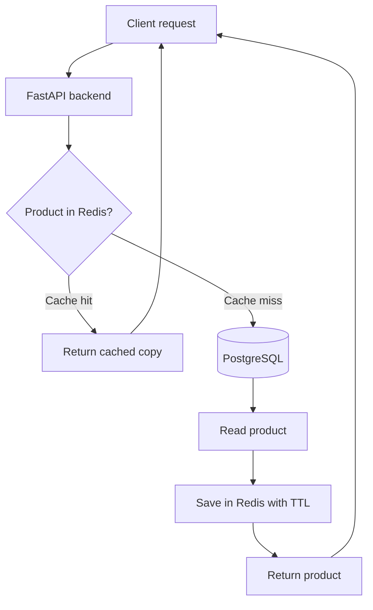
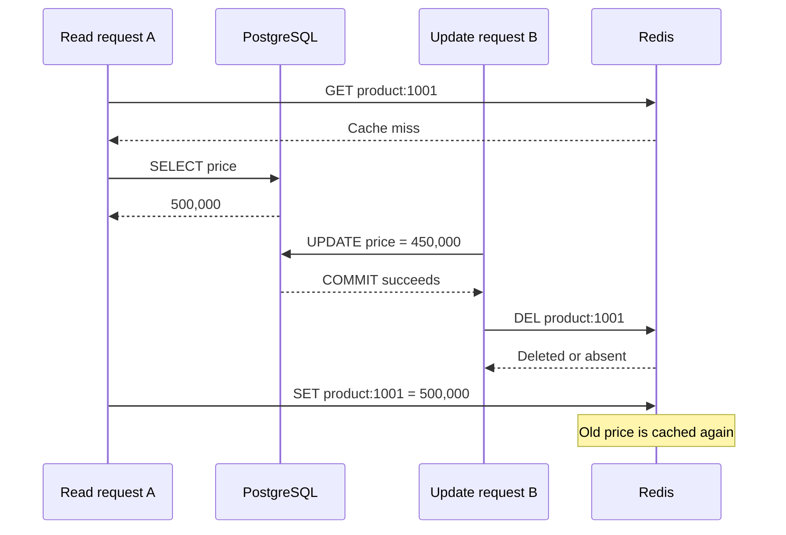

*An API takes 150 ms to read from PostgreSQL. Adding Redis makes it much faster, but one day users still see the old price after the database has been updated. Neither Redis nor PostgreSQL is broken. What went wrong?*

## 1. When a performance improvement creates a new problem

Imagine a FastAPI backend serving product pages. Its primary-key query is already efficient:

```sql
SELECT id, name, price, category_id, description
FROM products
WHERE id = 1001;
```

When a product is promoted, thousands of requests may read almost identical data. The team puts Redis in front of PostgreSQL: return a cached value on a hit; otherwise read the database and save a copy. Latency and query volume fall. Then an operator changes the price from 500,000 to 450,000 VND. PostgreSQL has the new price, but Redis still holds the 500,000 VND copy.

That is **stale data**: the value served by the application no longer reflects the current state of its source. Both systems are doing what they were designed to do. The missing piece is how to manage the copy between them. **Creating a cache also creates the responsibility to decide how long that copy lives and when it must be removed.**

## 2. What is a cache, and why Redis?

Caching stores reusable results so an expensive operation does not have to repeat. The operation might be a database read, an external API call, or building a response. Redis suits many caching workloads because it is an in-memory key-value data store with TTLs and several data structures. But **Redis is a general-purpose data store; caching is only one use case**. It can also support sessions, counters, rate limits, and streams.

Here PostgreSQL remains the **source of truth**, and Redis is a cache layer for product reads:



This is **cache-aside**: the application checks the cache first and populates it on demand.

## 3. How cache-aside works

Suppose a product uses the key `shop:v1:product:1001`. The first request does not find it, reads PostgreSQL, and saves the result:

```text
SET shop:v1:product:1001 '{"id":1001,"name":"Wireless Headphones","price":500000}' EX 60
```

`EX 60` sets a 60-second TTL. Later requests can read Redis until the key expires or is deleted.

| Case | Application behavior |
| :--- | :--- |
| Cache hit | Redis has a valid entry; return the copy. |
| Cache miss | The key is absent or expired; read the source. |
| Expiration | The TTL has elapsed; the entry is no longer returned as valid. |
| Invalidation | The application actively removes or disables the entry. |

If the cache disappears, it can in principle be rebuilt from PostgreSQL. But the database must handle a surge of misses. Not everything should be cached either: display data may tolerate some staleness, while wallet balances, current permissions, and transaction decisions need the appropriate correctness guarantees.

**Cache data when reuse has clear value and the acceptable staleness is known in advance.**

## 4. A FastAPI and `redis.asyncio` example

This simplified read path illustrates cache-aside:

```python
import json

from redis.asyncio import Redis
from redis.exceptions import RedisError
from sqlalchemy.ext.asyncio import AsyncSession


async def get_product(
    product_id: int,
    db: AsyncSession,
    cache: Redis,
) -> dict | None:
    cache_key = f"shop:v1:product:{product_id}"

    try:
        cached = await cache.get(cache_key)
        if cached is not None:
            return json.loads(cached)
    except RedisError:
        # A cache failure need not take down the read API.
        pass

    product = await db.get(Product, product_id)
    if product is None:
        return None

    data = {
        "id": product.id,
        "name": product.name,
        "price": product.price,
    }

    try:
        await cache.set(cache_key, json.dumps(data), ex=60)
    except RedisError:
        pass

    return data
```

The example assumes an existing `Product` model and database session, a JSON-serializable `price`, and no solution yet to the races below. In production, record cache errors, configure timeouts, and bound fallback load instead of silently using `pass` as this teaching snippet does.

Do not construct a Redis client per request. `redis-py` manages a connection pool within the client; a worker can create one at startup, share it, and call `aclose()` at shutdown. The backend now has both PostgreSQL and Redis connections to manage.

This function does not cache a missing product. Repeated requests for a nonexistent ID will keep reaching PostgreSQL. **Negative caching** can store a short-lived "not found" sentinel, but it must distinguish a genuinely absent product from a temporary database error and account for a product being created soon afterward.

## 5. TTL: how stale may the data be?

`TTL` reports a key's remaining lifetime; for example, `TTL shop:v1:product:1001`. Consider this timeline:

| Time | Event |
| :--- | :--- |
| 10:00:00 | PostgreSQL stores 500,000 VND. |
| 10:00:01 | The application caches that price for 60 seconds. |
| 10:00:10 | An operator changes the price to 450,000 VND. |
| 10:00:20 | A user still receives the old cached price. |
| 10:01:01 | The key expires; a later read can fetch the new price. |

A short TTL reduces the time an old copy remains but increases source reads. A long TTL improves hit rate but can lengthen the stale window. With no TTL, invalidation and memory management need to be especially clear.

A TTL is **not always an absolute bound on the data's age** relative to the source of truth: a slow reader can write an old value *after* the source changed, starting a fresh TTL on stale data. TTL therefore needs a consistency strategy alongside it.

## 6. Invalidation when the source changes

A common cache-aside write sequence is:

```text
1. UPDATE product in PostgreSQL
2. COMMIT transaction
3. DEL product key in Redis
```

The next read misses, fetches the new price, and repopulates the cache. Why delete *after* commit? If the key is deleted first, another request can miss, read the old price before the transaction commits, and put that old price back into Redis.

Deletion after commit still does not guarantee perfect consistency. If the database commit succeeds but `DEL` fails, PostgreSQL has the new price and Redis may keep the old one. A system accepting eventual consistency can use TTL as a recovery bound and monitor failed invalidations. Stronger delivery may call for a transactional outbox or another reliable post-commit event mechanism; event ordering and concurrent reads still need attention.

## 7. A race: the old price returns after invalidation

Read request A misses the cache and gets 500,000 VND from PostgreSQL, but has not yet written to Redis. Write request B updates the price to 450,000 VND, commits, and deletes the key. Then A writes 500,000 VND into Redis:



**Invalidating after commit does not remove every stale-write race.** For low-risk data with a short TTL, a small stale window may be acceptable. For stricter needs, options include versioned cache entries, versioned keys tied to a current generation, coordinating cache population with writes, or bypassing the cache for reads that demand fresh data. A version helps only if the rule for obtaining and checking it is reliable; adding a `version` field without checking it before writes changes nothing.

The real question is not just "How long should the TTL be?" It is: **How stale may a response be, and what happens if a user acts on it?**

## 8. Do not let a copy decide a critical transaction

A product page can display cached stock and price. But when someone places an order, the backend should not approve it solely because cached `available_stock` says one item remains. Stock may have changed since the copy was made. PostgreSQL can protect the decrement with a conditional update:

```sql
UPDATE inventory
SET available_stock = available_stock - 1
WHERE product_id = 1001
  AND available_stock > 0
RETURNING available_stock;
```

Order creation and related changes still need a suitable transaction. The checkout price likewise needs confirmation against the authoritative price and business policy at purchase time. If a price is deliberately held for a period, that must be an explicit business rule, not an accidental consequence of cache TTL.

**A cache can speed up display; decisions that change business state require their own correctness controls.**

## 9. Cache stampede: a hot key expires

Thousands of people view a popular product. When its key expires as hundreds of requests arrive, they all miss and query PostgreSQL. This is a **cache stampede**. The burst can queue at the PostgreSQL connection pool, raise API latency, cause timeouts, and make retries amplify the load.

Three common approaches are:

- **TTL jitter:** add a small random interval so many keys do not expire together, such as `60 + random.randint(0, 15)` seconds. This does not fix a stampede on *one* hot key.
- **Single-flight:** let only one request load a key while others await its result. An in-process lock cannot coordinate multiple workers or replicas. Redis can be used with `SET lock:product:1001 unique-token NX PX 5000`. Release must atomically check the owner's token; a blind `DEL` might erase another worker's new lock. Also account for a loader running longer than the lock TTL.
- **Stale-while-revalidate:** temporarily serve an old value within an allowed window while a background worker refreshes it. This can suit rarely changed product descriptions but not a checkout path requiring an up-to-date price or state.

Choose stampede protection based on **both** workload and freshness requirements, not latency alone.

## 10. Cache penetration and cache avalanche

**Cache penetration** happens when many requests ask for nonexistent IDs: every lookup misses and reaches PostgreSQL. A short-lived negative-cache sentinel can reduce this load, but keys must reflect tenant and permission scope. A "not found" result caused by missing access rights should not be shared as if the object does not exist for everyone.

**Cache avalanche** describes many entries becoming unavailable in a short interval, for example simultaneous expiry or a Redis outage. Source reads surge and may overwhelm PostgreSQL. TTL jitter, stampede protection, bounded concurrency, graceful degradation, and source capacity planning all help.

**Caching does not eliminate work; it avoids repeating that work while a usable copy exists.**

## 11. Should the API keep working when Redis fails?

If Redis is only a performance cache for product pages, **fail-open** may be appropriate: read PostgreSQL when Redis is unavailable. But sending all traffic to the database at once can create a second outage. Redis needs suitable short timeouts, and fallback needs limits such as connection caps, throttling, or a circuit breaker where appropriate.

Do not apply fail-open mechanically. If Redis stores sessions, coordinates business operations, or enforces a rate limit on a sensitive API, bypassing it may violate security or correctness requirements. The failure policy depends on Redis's **actual role**. Monitor Redis latency and timeouts as well as PostgreSQL load when cache health degrades.

## 12. Eviction is different from expiration

A TTL causes **expiration**. **Eviction** happens when Redis frees memory under `maxmemory` and `maxmemory-policy`; a key with a long remaining TTL can be evicted early.

| Policy | Main behavior |
| :--- | :--- |
| `noeviction` | Does not evict to make room; affected writes may fail. |
| `allkeys-lru` | Prefers keys used least recently. |
| `allkeys-lfu` | Prefers keys accessed least frequently. |
| `volatile-lru` | Applies LRU selection only among keys with TTLs. |
| `volatile-ttl` | Prefers keys with the shortest remaining TTL. |

Redis uses approximations for LRU/LFU, not a perfect history of every access. If hot keys are repeatedly evicted, hit rate falls and PostgreSQL takes the traffic again. Measure memory, entry sizes, evictions, and query rate instead of only counting keys.

## 13. Design cache keys for the right data scope

If stores can have different prices, `product:1001` may be too broad. `shop:v1:tenant:42:product:1001` separates tenant data. Depending on the response, the key may also need language, currency, customer pricing group, filters, sort order, or pagination. Missing a relevant dimension mixes results; including irrelevant dimensions creates too many keys and hurts hit rate.

**Caching does not replace authorization.** The backend must still check who may see the data and must not return user- or tenant-private content from a shared key.

In `shop:v1:product:1001`, `v1` might identify the cached *format*. Changing to `v2` after a response-schema change avoids reading incompatible JSON, but **schema versioning is not data versioning**. Changing namespaces at deploy does not automatically prevent read-write cache races.

## 14. Measure whether the cache actually helps

A basic metric is **cache hit rate = hits / (hits + misses)**. If 800 of 1,000 reads are hits, the hit rate is 80%. Assuming each miss causes exactly one source read and there are no extra reads, this endpoint's PostgreSQL reads could fall from roughly 1,000 to 200. That is an illustration, not a benchmark result; real systems also refresh entries, mitigate stampedes, experience cache errors, and run other queries.

| Metric | Question to answer |
| :--- | :--- |
| Hit/miss rate | How often is data reused versus fetched from the source? |
| Redis latency/error rate | Is the cache fast and available? |
| PostgreSQL query rate | How much source load is actually removed? |
| API p50/p95/p99 | What latency do users see under load? |
| Memory/evicted keys | Are hot keys evicted because memory is short? |
| Stale reads | Are responses fresh enough for the business requirement? |
| Stampede events | Does hot-key expiry cause concurrent source reads? |

A high hit rate is not enough if the remaining misses overload the database or the cache serves old prices too long. Benchmark three configurations with the same dataset and access distribution: no cache, cache-aside with TTL/invalidation, and cache-aside with stampede protection. Exercise cold and warm caches, hot-key expiry, price updates during reads, Redis failure, slow PostgreSQL, and multiple replicas. Compare latency, database load, error rate, **and response correctness**.

## 15. A practical rollout sequence

1. Measure the workload before caching; find repeated reads of relatively stable data.
2. Define the source of truth, acceptable staleness, and the impact of stale responses.
3. Design cache keys, serialization, and authorization scope.
4. Add cache-aside with a suitable TTL.
5. Invalidate after the source commits, and monitor failed invalidations.
6. Test concurrent reads and writes, stale repopulation, and stampedes.
7. Define a failure policy and bound fallback load when Redis fails.
8. Benchmark and monitor hit rate, stale reads, Redis memory, and PostgreSQL load.

These decisions matter more than a few lines of `redis.get()` and `redis.set()`: they turn caching into a stable optimization instead of a new source of bugs.

## 16. Common mistakes

- Cache everything without deciding which data may be stale.
- Treat TTL as a guarantee that users see changes immediately after commit.
- Delete before commit, allowing another reader to refill the old value.
- Assume deletion after commit eliminates every race.
- Extend TTL only to increase hit rate, ignoring the stale window.
- Leave hot keys unprotected from stampedes or fallback unbounded during a Redis outage.
- Ignore memory and evictions while hot keys repeatedly miss.
- Use shared cache keys across tenants or authorization scopes.
- Evaluate caching only by the speed of a favorable cache hit.

## 17. Conclusion

Redis can remove repeated PostgreSQL reads and make APIs faster. Cache-aside is a straightforward starting point: read the cache first, read the source on a miss, and save the result. But once a copy exists, its TTL, invalidation, concurrency, stampedes, eviction, and failure path all need deliberate handling.

Before asking "What TTL makes this fastest?", ask: **Which data is worth caching, how stale may it be, and what must happen when the copy is no longer correct?** A good cache layer improves performance while meeting the business's correctness and reliability requirements. A fast but wrong response is not always an improvement.

## References and further reading

- [Redis: Cache-Aside Pattern](https://redis.io/docs/latest/develop/use-cases/cache-aside/)
- [Redis: Cache-Aside with redis-py](https://redis.io/docs/latest/develop/use-cases/cache-aside/redis-py/)
- [Redis: Asynchronous Operations with redis-py](https://redis.io/docs/latest/develop/clients/redis-py/async/)
- [Redis: SET Command](https://redis.io/docs/latest/commands/set/)
- [Redis: EXPIRE Command](https://redis.io/docs/latest/commands/expire/)
- [Redis: Keyspace](https://redis.io/docs/latest/develop/using-commands/keyspace/)
- [Redis: Key Eviction](https://redis.io/docs/latest/develop/reference/eviction/)
- [Redis: UNLINK Command](https://redis.io/docs/latest/commands/unlink/)
- [Redis: Cache-Aside with node-redis](https://redis.io/docs/latest/develop/use-cases/cache-aside/nodejs/)
- [Redis: Prefetch Cache](https://redis.io/docs/latest/develop/use-cases/prefetch-cache/)
