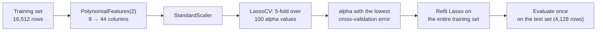

> **Learning objectives:** After this lesson, you will understand why a model with many features relative to the number of data rows overfits so easily, how to restrain it with a penalty on large coefficients - Ridge (L2) shrinks evenly, Lasso (L1) cuts all the way to 0, ElasticNet blends the two - why you must scale before penalizing, and how to choose the penalty strength `alpha` with cross-validation on real data.

## 1. 1,000 columns, 200 rows: when a "perfect fit" is a bad sign

A biomedical research group has 200 patients; for each one, the sequencer returns thousands of gene measurements, and they want to predict drug response from those. *An Introduction to Statistical Learning* gives two real examples of this kind of problem: about 200 patients with 500,000 gene variants (SNPs) each; or the NCI60 dataset you will meet in Lesson 10 - 64 cancer cell lines, 6,830 genes per line. In the usual notation: $n$ rows, $p$ columns, and here $p \gg n$.

What happens if you feed this straight into linear regression (Lesson 02)? Recall the degree-9 polynomial in Foundations · Lesson 13: 10 coefficients for 8 data points threads through *every single point*, training error is 0, and the predictions wiggle absurdly. With 1,000 knobs for 200 rows, exactly the same thing happens: least squares finds a set of coefficients that fits the training set *perfectly* - and the book stresses that this happens **regardless** of whether the features are genuinely related to the label. Figure 6.23 in the book, with $n = 20$: keep adding meaningless noise features and the training $R^2$ climbs to 1, training MSE drops to 0, while test MSE shoots up.

> 🔧 **Try it now:** reproduce this with synthetic data - 1,000 columns, only 10 of which are genuinely related to $y$, 200 training rows:
> ```python
> from sklearn.datasets import make_regression
> from sklearn.linear_model import LinearRegression, LassoCV
> from sklearn.metrics import root_mean_squared_error as rmse
> X, y = make_regression(n_samples=300, n_features=1000, n_informative=10, noise=10, random_state=42)
> X_tr, X_te, y_tr, y_te = X[:200], X[200:], y[:200], y[200:]        # 200 train rows, 100 test rows
> lin = LinearRegression().fit(X_tr, y_tr)
> print(rmse(y_tr, lin.predict(X_tr)), rmse(y_te, lin.predict(X_te)))  # train ≈ 0.0 | test ≈ 182
> las = LassoCV(cv=5, random_state=42, max_iter=20000).fit(X_tr, y_tr)
> print(rmse(y_te, las.predict(X_te)), (las.coef_ != 0).sum())          # test ≈ 12.5 | 120/1,000 coefficients left
> ```
> Least squares: training error **0.0** - "perfect" - and test error **≈ 182**, close to the standard deviation of $y$ (≈ 213), i.e. barely better than guessing the mean. Lasso (section 3) sets 880 coefficients to exactly 0, and the test error drops to **≈ 12.5**, right at the noise level of 10 built into the data.

Beyond biomedicine, finance is a major playground for "many columns, few rows" problems: researchers have proposed hundreds of "factors" to explain stock returns, while the number of months of data is limited. Feng, Giglio and Xiu (*Journal of Finance*, 2020) used a Lasso-based method to "tame that factor zoo", and concluded that most new factors are redundant relative to the ones already known.

## 2. Penalizing large coefficients: adding a term to the loss function

Overfitted models leave a common fingerprint: **extreme coefficients** - a wiggly curve needs large coefficients that cancel each other out. On California Housing with degree-2 features added (section 5), least squares has a largest coefficient of 35 in absolute value and a total absolute coefficient sum of 358; the restrained model on the same data has a total of just 3.4. Foundations · Lesson 14 promised to "penalize large weights" - here is the concrete way to do it: **add to the loss function a penalty that grows with the size of the coefficients**.

$$\text{New loss} = \text{MSE} + \alpha \times \text{(the "size" of the coefficients)}$$

Two common ways of measuring "size" give rise to two models:

| | **Ridge** (L2 penalty) | **Lasso** (L1 penalty) |
|---|---|---|
| Penalty | $\alpha \sum_j b_j^2$ (sum of squares) | $\alpha \sum_j \lvert b_j \rvert$ (sum of absolute values) |
| With $b = (3;\ -0.5;\ 2)$ | $9 + 0.25 + 4 = 13.25$ | $3 + 0.5 + 2 = 5.5$ |
| With $b = (1;\ -0.5;\ 1)$ | $2.25$ | $2.5$ |
| Effect on coefficients | shrinks evenly towards 0, but has no mechanism forcing them to exactly 0 | shrinks and **sets many coefficients to exactly 0** |
| Origin | Hoerl & Kennard, 1970 | Tibshirani, 1996 - *least absolute shrinkage and selection operator* |

$\alpha$ (*An Introduction to Statistical Learning* writes $\lambda$; scikit-learn writes `alpha`) is a **hyperparameter** - a knob you choose, not something the model learns by itself (Foundations · Lesson 13). $\alpha = 0$: back to least squares; $\alpha \to \infty$: every coefficient goes to 0, leaving only the intercept - which is exactly the "guess the mean" of `DummyRegressor` in Lesson 01. The intercept $b_0$ is not penalized: it is the baseline level of $y$, not "complexity".

Why does penalizing improve prediction? Foundations · Lesson 14: accept a slight rise in bias to pull variance down. The book simulates with $p = 45$, $n = 50$ (figure 6.5): as $\lambda$ rises from 0 to about 10, variance drops quickly while bias has barely moved, so test MSE falls clearly; the lowest point is at $\lambda \approx 30$. *Dive into Deep Learning* puts the intuition of the L2 penalty (which the deep learning community calls **weight decay**) more compactly: among all functions, the function $f = 0$ is the simplest, so one can measure a model's complexity by the distance of its parameters from 0.

> 🔧 **Try it now:** two models with the same training MSE = 1.0. Model A has coefficients $(4;\ 0;\ 0)$, model B has $(2;\ 2;\ 0)$. With $\alpha = 0.5$, which model does Ridge prefer? Which does Lasso prefer?
> Ridge: A is penalized $0.5 \times 16 = 8$, B is penalized $0.5 \times 8 = 4$ → picks **B** (coefficients spread evenly). Lasso: A $0.5 \times 4 = 2$, B $0.5 \times 4 = 2$ → a **tie**. L1 does not "hate" one large coefficient the way squaring does, so it is happy to concentrate everything in a few columns and send the rest to 0.

## 3. Ridge shrinks evenly, Lasso cuts clean: why they differ

*An Introduction to Statistical Learning* has a special case you can compute by hand ($n = p$, orthogonal columns): let $\hat b$ be the least-squares coefficient. Ridge gives $\hat b/(1 + \lambda)$ - shrinking by a *proportion*, so every coefficient keeps a part. Lasso subtracts a *fixed amount* $\lambda/2$, and any coefficient smaller than $\lambda/2$ goes to **exactly 0** (the book calls this *soft-thresholding*). With $\lambda = 1$:

| $\hat b$ (least squares) | Ridge | Lasso |
|---|---|---|
| 3.0 | 1.5 | 2.5 |
| 0.4 | 0.2 | **0** |
| −2.0 | −1.0 | −1.5 |

The geometry of this (figure 6.7 in the book): the set of allowed coefficients for Lasso is a **diamond** whose corners sit exactly on the coordinate axes; for Ridge it is a **circle**. The MSE contour ellipses keep spreading outwards: when they meet the diamond, they tend to touch it exactly at a *corner* - where one coefficient is 0; when they meet the circle, the point of contact almost never lands on an axis:

```
   LASSO: |b1| + |b2| ≤ s                    RIDGE: b1² + b2² ≤ s
             b2                                       b2
              │                                        │
              ◆ ← corner sits EXACTLY on the axis:    ╭─┴─╮
             ╱ ╲   the MSE ellipse tends to touch     ╱  │  ╲ ← no corners: the contact point
   ─────────◆───◆────────── b1               ───────┤   │   ├─────── b1   usually lies off the axis
             ╲ ╱   here → b1 = 0                     ╲  │  ╱     → both b1 and b2 are non-zero
              ◆                                       ╰─┬─╯
              │                                        │
```

Running it for real on the 8 original columns of California Housing (scaled, the training set from Lesson 01) and gradually raising `alpha` - each cell is the coefficient magnitude of one column:

```
Lasso - |coefficient| by alpha:

            alpha = 0 (no penalty)   alpha = 0.03        alpha = 0.1        alpha = 0.3
MedInc      █████████ 0.85          ███████▍ 0.74       ███████ 0.71       █████ 0.50
Latitude    █████████ 0.90          █████▌ 0.55         ▏0.01              · 0
Longitude   ████████▋ 0.87          █████ 0.50          · 0                · 0
AveBedrms   ███▍ 0.34               ▏0.02               · 0                · 0
AveRooms    ███ 0.29                · 0                 · 0                · 0
HouseAge    █▏ 0.12                 █▍ 0.13             █ 0.11             · 0
AveOccup    ▍ 0.04                  ▏0.01               · 0                · 0
Population  ▏ 0.00                  · 0                 · 0                · 0
Columns left:     8                       6                  3                  1
```

Weak columns (Population, AveRooms) drop out first, strong ones (MedInc) hold on to the end; at `alpha = 1` they are all gone. Ridge on the same data with `alpha = 10,000`: the largest coefficient is still 0.49, the smallest 0.001 - shrunk very hard, but **not a single coefficient is exactly 0**. That is why *Lasso does feature selection for you*: the final model contains only a subset of the columns - the book calls this a **sparse** model.

**ElasticNet** blends the two penalties in the proportion `l1_ratio` (1 = pure Lasso, 0 = pure Ridge). Which to choose? The book sums up two simulations: when only a few columns truly matter, Lasso wins; when many columns each contribute a small part, Ridge wins - if you do not know in advance which kind your data is, let cross-validation decide (section 5).

> ⚠️ **A small note:** when many columns are strongly correlated (genes expressed together, financial indicators that rise and fall together), Lasso tends to keep *one* column from the group and drop the rest - and which one it keeps can change when the training data changes slightly; ElasticNet tends to keep the whole group. *An Introduction to Statistical Learning* gives a separate warning for $p > n$: multicollinearity is at its most extreme, so you cannot conclude that "the 17 selected genes are the 17 decisive genes" - they are merely *one of many* models that predict well.

## 4. Scale first, penalize second - otherwise the penalty depends on the unit of measurement

An income column measured in **dong** gets a coefficient of 0.000002; switch to **millions of dong** and the coefficient becomes 2 - the same relationship, only the unit changed. But the L2 penalty on this one coefficient jumps from $4 \times 10^{-12}$ to $4$: Ridge will restrain the "millions of dong" version trillions of times harder. *An Introduction to Statistical Learning* says least squares is *scale-invariant*, while Ridge and Lasso are not - so the book advises standardizing every column to standard deviation 1 before penalizing (formula 6.6), i.e. the `StandardScaler` of Foundations · Lesson 12.

Checking on the 8 California columns: Population has a standard deviation of ≈ 1,137, MedInc ≈ 1.9. With the same `alpha = 0.03`: with scaling, AveRooms and Population go to 0; without scaling, a completely different set of columns is dropped and the MedInc coefficient is 0.38 instead of 0.74 - two different models purely because of the units. In a `Pipeline`, the order is always *create features → scale → penalized model*, and all three steps are fit on the training set only.

> 🔧 **Try it now:** an "area" column measured in m² has a coefficient of 0.05. If you switch to units of "tens of m²", what does the coefficient become, and by how many times does the L2 penalty on that one coefficient grow?
> The coefficient becomes **0.5**; the penalty goes from $0.05^2 = 0.0025$ to $0.5^2 = 0.25$ - **100 times larger**, even though the model has not changed in substance at all.

## 5. Choosing alpha with cross-validation - and reading the real results

`alpha` is a knob you choose: try a range of values, compare the error on data the model has not seen, and take the value with the lowest error - exactly the k-fold cross-validation of Foundations · Lesson 04. *An Introduction to Statistical Learning* illustrates this (figure 6.13): with $p = 45$, $n = 50$ and only 2 columns carrying real signal, Lasso combined with 10-fold cross-validation picks out exactly those 2 columns, with the rest at 0. scikit-learn packages this as `LassoCV` (5-fold by default, automatically generating 100 `alpha` values) and `RidgeCV` (you pass a list of `alpha` values, and it uses a very fast leave-one-out computation); once chosen, both refit on the entire training set.



```python
from sklearn.datasets import fetch_california_housing
from sklearn.model_selection import train_test_split
from sklearn.pipeline import make_pipeline
from sklearn.preprocessing import PolynomialFeatures, StandardScaler
from sklearn.linear_model import LinearRegression, LassoCV
from sklearn.metrics import root_mean_squared_error

X, y = fetch_california_housing(return_X_y=True, as_frame=True)
X_train, X_test, y_train, y_test = train_test_split(X, y, test_size=0.2, random_state=42)

# Add degree-2 features (squares and pairwise products): 8 columns → 44 columns
lin = make_pipeline(PolynomialFeatures(degree=2, include_bias=False),
                    StandardScaler(), LinearRegression()).fit(X_train, y_train)
lasso = make_pipeline(PolynomialFeatures(degree=2, include_bias=False),
                      StandardScaler(),
                      LassoCV(cv=5, random_state=42, max_iter=20000)).fit(X_train, y_train)

print("RMSE test - Linear+poly2:", root_mean_squared_error(y_test, lin.predict(X_test)))
print("RMSE test - LassoCV+poly2:", root_mean_squared_error(y_test, lasso.predict(X_test)))
coefficients = lasso[-1].coef_
print("chosen alpha:", lasso[-1].alpha_, "| number of coefficients = 0:", (coefficients == 0).sum(), "/", len(coefficients))
```

| Model (price unit: hundreds of thousands of USD) | Columns | Coefficients = 0 | RMSE train | RMSE test |
|---|---|---|---|---|
| `LinearRegression`, 8 original columns (Lesson 01) | 8 | 0 | ≈ 0.720 | ≈ 0.746 |
| `LinearRegression` + degree 2 | 44 | 0 | ≈ 0.649 | ≈ 0.681 |
| `RidgeCV` + degree 2 (chose `alpha` = 1,000) | 44 | 0 | ≈ 0.715 | ≈ 0.748 |
| `LassoCV` + degree 2 (chose `alpha` ≈ 0.007) | 44 | **27** | ≈ 0.713 | ≈ 0.747 |

Reading this honestly: Lasso sets 27/44 coefficients to exactly 0, keeps 17 columns (Latitude, Longitude and the MedInc×Longitude product leading), and its RMSE matches the 8-column original model - but it *loses* to least squares on the same 44 columns (0.747 versus 0.681). There is no contradiction: with 16,512 rows for 44 columns, least squares is not overfitting at all (train 0.649, test 0.681), so there is no variance to trade away; `LassoCV` "knows" this too - it chose an `alpha` right at the bottom of its grid, i.e. "penalize as little as possible". The book runs into exactly this situation with Ridge on the `Credit` dataset (figure 6.12) and comments: when the bottom of the cross-validation curve is not pronounced, you might as well use least squares. A double lesson: regularization is a tool for the *few rows, many columns* situation (section 1), not something that helps just by being added; but when you need a compact model to explain, Lasso is still worth it - 17 coefficients instead of 44, with the same error as the original model.

<details>
<summary><b>Going deeper: trimming the training data to see when regularization pays off</b></summary>

Still the 44 degree-2 columns, using only the first $n$ rows of the training set, evaluated on the same test set - test RMSE (actual runs):

| $n$ training rows | `LinearRegression` | `LassoCV` | Lasso coefficients = 0 |
|---|---|---|---|
| 100 | ≈ 103 | ≈ 0.91 | 38/44 |
| 200 | ≈ 19.0 | ≈ 0.95 | 32/44 |
| 500 | ≈ 2.93 | ≈ 2.40 | 28/44 |
| 2,000 | ≈ 4.44 | ≈ 3.37 | 24/44 |
| 16,512 | ≈ 0.68 | ≈ 0.75 | 27/44 |

With 100-200 rows, least squares "blows up" (RMSE 19-103, while guessing the mean is only off by 1.14) whereas Lasso holds at around 0.9. At 500-2,000 rows, *both* are still worse than guessing the mean - the test set contains 8 outlier houses (AveOccup > 30 or AveRooms > 30), and the degree-2 features inflate their values enormously; drop those 8 rows and both models return to 0.66-0.70. Regularization limits the damage but does not handle outliers for you (Foundations · Lesson 12).

</details>

> ⚠️ **A small note:** the `alpha` of `Ridge` and the `alpha` of `Lasso` in scikit-learn are **not on the same scale**: Lasso divides the sum of squared errors by $2n$ before adding the penalty, Ridge adds it directly - so Ridge's `alpha = 1,000` in the table above is not "140,000 times stronger" than Lasso's `alpha ≈ 0.007`; penalty strengths must be compared through cross-validation results. The default `LassoCV` grid only searches from `alpha_max` down to `alpha_max/1000`; if it picks a value right at the bottom, widen the grid or treat it as a signal that "there is enough data, the penalty is unnecessary".

## 6. Regularization is not just for linear regression

The idea of "adding a penalty to the loss" runs through this whole series. `LogisticRegression` in Lesson 03 uses an L2 penalty by default with `C` playing the role of $1/\alpha$ - a small `C` is a strong penalty; SVM (Lesson 08) has a `C` parameter in the same spirit. Decision trees and tree ensembles (Lessons 06-07) do not penalize coefficients but restrain via depth, number of leaves and learning rate. Neural networks call the L2 penalty weight decay, and add dropout and early stopping (Foundations · Lesson 14). Different names, one shared idea: sacrifice a little fit on the training set in exchange for generalization.

## Lesson summary

- When the number of columns $p$ is large relative to the number of rows $n$ (and the design matrix has full enough rank), least squares can fit the training set perfectly **regardless** of whether the features are meaningful - a training error of 0 is a bad sign (1,000 columns / 200 rows: test RMSE ≈ 182, versus ≈ 12.5 after restraining).
- **Regularization** = adding to the loss function a penalty on coefficient size; `alpha` is a hyperparameter, `alpha = 0` is least squares, `alpha` → ∞ is guessing the mean; the intercept is not penalized.
- **Ridge (L2)** shrinks all coefficients evenly towards 0 but does not force them to exactly 0; **Lasso (L1)**, in contrast, can send many coefficients to **exactly 0** - doing feature selection along the way; **ElasticNet** blends the two, useful when many columns are correlated.
- The underlying mechanism is the bias-variance trade-off (Foundations · Lesson 14): the penalty makes variance fall faster than bias rises - but only when the model *has* variance to reduce.
- **Scale before penalizing**: the penalty depends on the unit of measurement; wrap `PolynomialFeatures → StandardScaler → Lasso` in a `Pipeline`, fit on the training set only.
- Choose `alpha` with cross-validation (`LassoCV`, `RidgeCV`). On California Housing (16,512 rows, 44 columns), cross-validation chose a very light penalty and least squares still predicts better (0.681 versus 0.747) - regularization is a tool for when data is scarce.
- The same idea appears in logistic regression (`C`), SVM (`C`), trees (depth), neural networks (weight decay, dropout).

## Self-check questions

1. A colleague boasts that their linear regression model reaches $R^2 = 1.0$ on the training set with 300 features and 150 rows of data. Why does this number tell you nothing? What check would you suggest next?
2. **By hand:** the least-squares coefficients are $(2.0;\ 0.3;\ -1.0)$. In the book's special case with $\lambda = 1$, what coefficients do Ridge and Lasso produce? Which coefficient does Lasso send to 0?
3. Explain geometrically (diamond and circle) why Lasso produces coefficients exactly equal to 0 while Ridge does not.
4. You fit Lasso on unscaled data in which the "ward population" column is measured in people and the "income" column in billions of dong. Which column is at risk of being wrongly dropped, why, and how do you fix it?
5. On a dataset of 20,000 rows and 44 columns, `LassoCV` picks an `alpha` right at the bottom of the grid and the test RMSE is still slightly worse than `LinearRegression`. What do you conclude about the role of regularization in this problem, and in what situation would that conclusion reverse?
6. A recommender system uses logistic regression with 5,000 one-hot features but only 3,000 training rows. Which parameter of `LogisticRegression` would you adjust, in which direction, and how would you choose its value?

## Further reading

**Foundational sources for this lesson:**

| Source | Which part to read |
|---|---|
| **An Introduction to Statistical Learning (ISLP)** | Chapter 6, section 6.2 - *Shrinkage Methods*: 6.2.1 Ridge (figures 6.4-6.5, standardization via formula 6.6), 6.2.2 Lasso (figures 6.6-6.7, soft-thresholding in figure 6.10), 6.2.3 choosing $\lambda$ with cross-validation (figures 6.12-6.13) |
| **An Introduction to Statistical Learning (ISLP)** | Chapter 6, section 6.4 - *Considerations in High Dimensions*: $p > n$, figures 6.23-6.24, warnings about interpreting results |
| **Dive into Deep Learning (d2l.ai)** | Chapter 3 (Linear Neural Networks for Regression) - section *Weight Decay*: the L2 penalty from a deep learning viewpoint, a demo with 200 features and 20 training samples |

**Additional online sources (free):**

- [Linear Models - scikit-learn User Guide](https://scikit-learn.org/stable/modules/linear_model.html) - the exact objective functions of `Ridge`, `Lasso`, `ElasticNet`; notes that `RidgeCV` uses leave-one-out.
- [Lasso model selection: AIC-BIC / cross-validation - scikit-learn](https://scikit-learn.org/stable/auto_examples/linear_model/plot_lasso_model_selection.html) - the official example comparing ways of choosing `alpha`.
- [Least Absolute Shrinkage and Selection Operator (LASSO) - Columbia Mailman School of Public Health](https://www.publichealth.columbia.edu/research/population-health-methods/least-absolute-shrinkage-and-selection-operator-lasso) - an overview of Lasso, citing Tibshirani (1996).
- [Ridge Regression: Biased Estimation for Nonorthogonal Problems - Hoerl & Kennard, Technometrics 1970](https://www.tandfonline.com/doi/abs/10.1080/00401706.1970.10488634) - the original Ridge paper.
- [Taming the Factor Zoo: A Test of New Factors - Feng, Giglio & Xiu (NBER)](https://www.nber.org/papers/w25481) - an application of Lasso in finance to screen hundreds of factors.
- [Overfitting - Machine Learning cơ bản](https://machinelearningcoban.com/2017/03/04/overfitting/) - section 3 "Regularization", in Vietnamese: L2, L1, Elastic Net.

> **Next lesson:** [k-Nearest Neighbors: Learning from the Neighbors](../k-nearest-neighbors-learning-from-neighbors/) - leave the models with coefficients behind to meet a model that "learns" nothing at training time - it just memorizes the data and asks its neighbours; there, what needs restraining is not the coefficients but the number of neighbours $k$.
