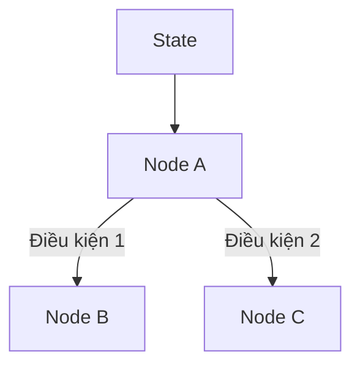

Các thư viện Agent dựa trên graph có thể trông rất phức tạp vì đưa ra nhiều tính năng production cùng lúc. Nhưng nếu bỏ các lớp bổ sung đi, phần runtime cốt lõi khá nhỏ.

## Graph giải quyết vấn đề gì?

Một workflow Agent có các bước, state dùng chung và quyết định bước thực thi tiếp theo.



Graph làm **luồng điều khiển** trở nên tường minh, thay vì giấu nó trong một vòng lặp prompt lớn.

## Mức trừu tượng tối thiểu

Một runtime nhỏ chỉ cần vài khái niệm:

```python
class Graph:
    nodes: dict[str, Callable]
    edges: dict[str, list[str]]
    router: Callable[[str, dict], str]

    async def run(self, start, state):
        current = start
        while current != "END":
            patch = await self.nodes[current](state)
            state.update(patch)
            current = self.router(current, state)
        return state
```

Framework thực tế còn có lưu trạng thái, retry, streaming, tạm dừng, tracing, xử lý đồng thời và phê duyệt của con người. Những tính năng này rất quan trọng trong production, nhưng là các lớp bao quanh ý tưởng thực thi ở trên.

## Vì sao state là trung tâm?

Node thường chỉ là hàm thông thường. Edge thường chỉ là quyết định chuyển bước. Phần khó là định nghĩa state sao cho nó có thể phát triển mà không biến thành một túi dữ liệu không kiểu, chứa mọi thứ hệ thống từng thấy.

Một schema state hữu ích trả lời ba câu hỏi:

- Node tiếp theo thực sự cần gì?
- Trường nào là nguồn thông tin có thẩm quyền?
- Trường nào chỉ tạm thời, trường nào cần tồn tại lâu dài?

## Khi sự trừu tượng bắt đầu lộ giới hạn

Graph framework bớt "thần kỳ" khi việc chọn đường phụ thuộc vào phán đoán mơ hồ của model, state tăng trưởng thiếu kỷ luật, hoặc node nào cũng có thể sửa mọi trường.

Khi đó ta nhìn thấy graph, nhưng ý nghĩa thực sự của những bước bên trong vẫn bị che khuất.

## Khi nào nên dùng?

Hãy dùng graph khi luồng thực thi thật sự có nhánh, checkpoint có thể tiếp tục, điểm tạm dừng để con người can thiệp, hoặc nhiều tool cần được điều phối rõ ràng.

Với pipeline xác định chỉ có hai bước, graph có thể là thêm một lớp trừu tượng mà chưa đem lại giá trị kiến trúc.
