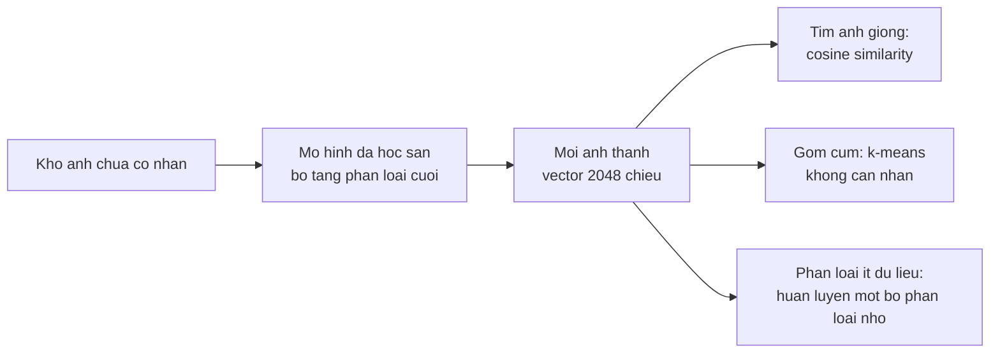

> **Mục tiêu bài học:** Sau bài này, bạn sẽ lấy được vector biểu diễn từ một mạng đã huấn luyện và dùng nó để tìm ảnh giống, gom cụm không cần nhãn, rồi phân loại **không cần huấn luyện gì cả** bằng CLIP - và biết đọc những con số ấy cho đúng thay vì kết luận quá tay.

## 1. Giới hạn của một mô hình có 1.000 ngăn

Mười bài trước đều kết bằng cùng một hình dạng: ảnh vào, ra một nhãn trong danh sách cố định. ResNet-50 có 1.000 ngăn, DeepLabV3 có 21, Faster R-CNN có 80.

Cách làm ấy vấp ngay khi gặp việc thật:

- Khách hàng cần phân biệt 12 loại lỗi sản phẩm - không lớp nào nằm trong 1.000 lớp ImageNet
- Cần tìm "những ảnh trông giống ảnh này" trong kho 200.000 tấm - không có nhãn nào diễn tả được "giống"
- Cần gom kho ảnh thành nhóm để xem có những gì trong đó - chưa ai gán nhãn cả

Trường hợp đầu **vẫn là phân loại** - chỉ là tập nhãn bạn cần không nằm trong 1.000 nhãn có sẵn, nên cái đầu phân loại của mô hình vô dụng dù phần thân thì không. Hai trường hợp sau thì không còn là phân loại nữa: không có tập nhãn nào để chọn.

Cả ba đều giải được nếu ta lấy ra thứ mà mạng tính được **trước khi** nó ép mọi thứ vào 1.000 ngăn.

## 2. Vector biểu diễn: lấy ở đâu và nó tốt cỡ nào

Chương Deep Learning · Bài 11 đã chỉ chỗ: bỏ tầng phân loại cuối, phần còn lại của ResNet-50 biến mỗi ảnh thành **2.048 con số**. Lấy nó bằng một hook đúng như bài 04:

```python
feat = {}
model.avgpool.register_forward_hook(lambda m, i, o: feat.__setitem__("v", o.flatten(1).detach()))
with torch.no_grad():
    model(batch)
X = feat["v"]                      # (batch, 2048)
X = torch.nn.functional.normalize(X, dim=1)     # chuẩn hóa để dùng cosine
```

Lấy 600 ảnh Imagenette (10 lớp, chọn ngẫu nhiên cố định seed 42), rồi với mỗi ảnh tìm ảnh **giống nhất** theo cosine similarity - đúng phép đo của Foundations · Bài 07. Để so, làm y hệt trên **pixel thô** đã duỗi thành vector:

| Cách biểu diễn ảnh | Số chiều | Ảnh giống nhất cùng lớp | Top-5 cùng lớp |
|---|---|---|---|
| Pixel thô | 150.528 | 0,3400 | - |
| Vector từ ResNet-50 | **2.048** | **0,9950** | 0,9887 |

Vector đặc trưng **nhỏ hơn 73 lần** mà tìm đúng lớp trong 99,5% số lần, so với 34% của pixel thô. Đây là cùng một luận điểm của chương Deep Learning · Bài 01 - pixel thô không phải cách biểu diễn có ích - nhưng lần này đo bằng một bài toán mà không mô hình phân loại nào giải được.

Nhìn thẳng vào khoảng cách giữa các lớp thì rõ hơn nữa:

| Cặp ảnh | Cosine similarity trung bình |
|---|---|
| Cùng lớp | **0,4996** |
| Khác lớp | 0,1035 |

Không gian 2.048 chiều ấy đã tự sắp xếp: ảnh cùng loại nằm gần nhau, khác loại nằm xa. Mô hình chưa hề được dạy trực tiếp bằng một hàm mục tiêu kiểu "kéo hai ảnh giống nhau lại gần" - nó chỉ được dạy phân biệt 1.000 lớp ImageNet. Nhưng chính sức ép phân biệt lớp ấy đã đủ tạo ra một không gian mà khoảng cách mang nghĩa, và cấu trúc ấy rơi ra như sản phẩm phụ.

## 3. Gom cụm: dùng lại đúng hai bài đã học

Nếu không gian ấy thực sự có cấu trúc, thì một thuật toán gom cụm **không hề biết nhãn** cũng phải tìm ra được 10 nhóm. Chạy k-means của chương Machine Learning · Bài 09 với $k = 10$ lên chính 600 vector đó:

| Chỉ số | Giá trị |
|---|---|
| ARI (adjusted Rand index) | **0,9448** |
| NMI (normalized mutual information) | **0,9562** |

Hai chỉ số này đo mức trùng khớp giữa cụm tìm được và nhãn thật, và cả hai bằng **1** khi hai cách chia trùng khít. Nhưng **mốc dưới của chúng khác nhau**, và chỗ này rất dễ đọc sai.

**ARI đã được hiệu chỉnh theo ngẫu nhiên**: gán nhãn hoàn toàn ngẫu nhiên cho kỳ vọng gần 0, và con số có thể **âm** khi kết quả còn lệch hơn cả mức ngẫu nhiên. **NMI thì không**: nó nằm trong khoảng [0, 1] nhưng gán nhãn ngẫu nhiên trên một tập hữu hạn vẫn cho giá trị dương đáng kể, và giá trị ấy **phình lên khi số cụm tăng**. Đo thử trên 600 mẫu, gán nhãn hoàn toàn ngẫu nhiên:

| Số cụm | ARI trung bình | NMI trung bình |
|---|---|---|
| 10 | +0,0002 | **0,0313** |
| 30 | +0,0001 | **0,0895** |

Nên "NMI = 0,09" nghe như *có chút cấu trúc* nhưng có thể chỉ là sản phẩm của việc chia thành nhiều cụm. Muốn một chỉ số họ mutual information mà mốc ngẫu nhiên nằm ở 0 thì dùng **AMI** - bản đã hiệu chỉnh - thay vì NMI.

Với ngần ấy lưu ý, hai con số 0,9448 và 0,9562 ở đây vẫn là cao thật: k-means gần như dựng lại đúng 10 lớp - **mà không nhìn một nhãn nào**.

Ghép lại thì đây là một quy trình dùng được ngay cho kho ảnh chưa gán nhãn:



Nhánh thứ ba chính là **cách B của chương Deep Learning · Bài 11** - đóng băng phần thân, chỉ train tầng cuối. Nhìn từ góc này thì nó không phải một mẹo tiết kiệm, mà là hệ quả tự nhiên: nếu không gian vector đã tách lớp tốt như bảng ở mục 2, thì một bộ phân loại tuyến tính trên đó là đủ.

## 4. CLIP: bỏ luôn cả danh sách lớp cố định

Mọi thứ ở trên vẫn dựa vào một mô hình đã học 1.000 lớp ImageNet. **CLIP** đi xa hơn một bước: nó học từ hàng trăm triệu cặp *(ảnh, câu mô tả)* lấy trên mạng, và huấn luyện **hai** bộ mã hóa - một cho ảnh, một cho chữ - sao cho ảnh và câu mô tả đúng của nó nằm gần nhau trong cùng một không gian vector.

Hệ quả rất lớn: **muốn phân loại theo lớp nào thì viết lớp ấy ra bằng chữ**, không cần huấn luyện gì cả.

```python
import open_clip, torch.nn.functional as F
model, _, preprocess = open_clip.create_model_and_transforms(
    'ViT-B-32', pretrained='laion2b_s34b_b79k')
tok = open_clip.get_tokenizer('ViT-B-32')

prompts = [f"a photo of a {class_name}" for class_name in class_names]
with torch.no_grad():
    t = F.normalize(model.encode_text(tok(prompts)).float(), dim=1)
    v = F.normalize(model.encode_image(batch).float(), dim=1)
predictions = (v @ t.T).argmax(1)          # lớp có mô tả gần ảnh nhất
```

Chạy trên đúng 600 ảnh ấy, với mười câu mô tả dạng `"a photo of a {tên lớp}"`:

| Cách làm | Top-1 | Cần huấn luyện? |
|---|---|---|
| CLIP zero-shot | **0,9933** | **Không** |

Chuẩn hóa vector trước khi nhân là bắt buộc chứ không phải tùy chọn: CLIP được huấn luyện với các vector đã chuẩn hóa, và bỏ bước ấy thì độ dài vector chen vào điểm số, làm kết quả lệch.

> ⚠️ **Lưu ý nhỏ:** đừng đặt 0,9933 cạnh con số 0,8718 của bài 01 rồi kết luận "CLIP mạnh hơn ResNet-50". Hai con số ấy trả lời hai câu hỏi khác nhau, đúng như quy ước ba loại con số ở bài 01 cảnh báo. ResNet-50 phải chọn trong **1.000** lớp; CLIP ở đây chỉ chọn trong **10** câu mô tả tôi đưa cho nó. Phép so công bằng là đặt cạnh con số ResNet-50 khi cũng chỉ được chọn trong 10 lớp - mà bài 01 đã đo: **0,9985**. Nói cách khác, mô hình có giám sát vẫn nhỉnh hơn một chút trên chính bộ dữ liệu trích từ ImageNet mà nó được huấn luyện. Cái đáng kinh ngạc của CLIP không phải con số cao hơn, mà là nó đạt gần bằng **mà không hề được huấn luyện cho mười lớp này**, và ngày mai bạn đổi sang mười lớp khác thì vẫn dùng được ngay.

Điểm mạnh thật của cách làm này nằm chỗ khác:

**Đổi tập lớp là đổi một dòng chữ.** Không dữ liệu gán nhãn, không vòng huấn luyện, không đợi.

**Mô tả có thể tinh vi hơn một cái tên.** `"a photo of a damaged package"` và `"a photo of an intact package"` là hai lớp hợp lệ, dù không bộ dữ liệu nào có hai nhãn ấy.

**Tìm ảnh bằng câu chữ.** Vì ảnh và chữ nằm chung một không gian, gõ một câu rồi tìm ảnh gần nó nhất là chuyện làm được ngay - đó chính là tìm kiếm ảnh bằng ngôn ngữ tự nhiên.

> 🔧 **Thử ngay:** CLIP zero-shot đạt 0,9933 trên Imagenette. Bạn có nên dùng nó cho bài toán phân loại 12 loại lỗi sản phẩm trong nhà máy không?
> Phải thử chứ đừng suy ra. Imagenette gồm mười lớp rất khác nhau (cá, chó, nhà thờ, dù, đàn kèn) và đều là những khái niệm phổ biến trên Internet - nơi CLIP học. Lỗi sản phẩm trong nhà máy thì ngược lại: các lớp rất giống nhau và khác biệt nằm ở chi tiết nhỏ. Dữ liệu huấn luyện của CLIP lấy từ web ở quy mô hàng trăm triệu cặp, nên **không ai biết chắc trong đó có gì** - nhưng không nên giả định rằng nó chứa đủ mô tả chính xác để phân biệt những khác biệt tinh vi của một dây chuyền cụ thể. Cách làm hợp lý là dùng CLIP hoặc ResNet như **bộ rút đặc trưng**, rồi huấn luyện một bộ phân loại nhỏ trên vài trăm ảnh có nhãn - nhánh thứ ba của sơ đồ mục 3, và cũng là điều bài 06 đã đo. Zero-shot đáng thử trước vì rẻ, nhưng đáng đo chứ không đáng tin sẵn.

## 5. Vì sao phần lý thuyết dừng ở đây

Mười bài trước đi theo một mạch: ảnh vào, mô hình trả về một nhãn, một hộp, hay một mặt nạ - luôn là một câu trả lời trong một danh sách định sẵn.

Bài này đổi hình dạng câu trả lời: mô hình biến ảnh thành một **vector**, và vector ấy dùng được cho những việc chưa ai định nghĩa lúc huấn luyện - tìm kiếm, gom cụm, phân loại tập lớp mới, ghép ảnh với chữ. Đó là chỗ thị giác máy tính hiện đại đang đứng, và cũng là cây cầu sang chương Generative AI, nơi cùng ý tưởng ấy - biểu diễn mọi thứ bằng vector trong một không gian chung - được đẩy đi xa hơn nhiều.

## Tóm tắt bài học

- Mô hình phân loại bị khóa trong một danh sách lớp cố định. Có bài toán vẫn là phân loại nhưng cần **tập nhãn mới**; có bài toán - tìm ảnh giống, gom cụm - không còn là phân loại nữa.
- Bỏ tầng phân loại cuối, ResNet-50 biến mỗi ảnh thành **2.048 con số**. Vector ấy nhỏ hơn pixel thô **73 lần** mà tìm ảnh cùng lớp đúng **99,5%** so với 34% của pixel thô.
- Không gian ấy tự có cấu trúc: cosine trung bình 0,4996 giữa ảnh cùng lớp so với 0,1035 giữa ảnh khác lớp - dù mô hình chưa hề được dạy bằng một hàm mục tiêu nào về khoảng cách. Sức ép phân biệt 1.000 lớp ImageNet là đủ để cấu trúc ấy xuất hiện như sản phẩm phụ.
- **k-means không nhìn nhãn** dựng lại gần đúng 10 lớp: ARI 0,9448 và NMI 0,9562. Cả hai bằng 1 khi trùng khít, nhưng **chỉ ARI được hiệu chỉnh theo ngẫu nhiên** (kỳ vọng gần 0, có thể âm); NMI của phép gán ngẫu nhiên vẫn dương và phình theo số cụm - muốn bản đã hiệu chỉnh thì dùng AMI.
- **CLIP** học từ cặp (ảnh, mô tả) nên phân loại được bằng cách viết tên lớp ra chữ: **0,9933** zero-shot, không huấn luyện gì.
- Nhưng đừng so 0,9933 với 0,8718 của bài 01: CLIP chọn trong 10 mô tả còn ResNet-50 chọn trong 1.000 lớp. So công bằng thì ResNet-50 giới hạn 10 lớp được 0,9985 - vẫn nhỉnh hơn. Cái đáng giá của CLIP là **không cần huấn luyện**, không phải con số cao hơn.
- Chuẩn hóa vector trước khi nhân là bắt buộc với CLIP, vì nó được huấn luyện như vậy.

## Câu hỏi tự kiểm tra

1. Vector 2.048 chiều nhỏ hơn pixel thô 73 lần mà kết quả truy hồi tốt hơn gần ba lần. Điều đó nói gì về "thông tin" trong pixel thô?
2. Cosine trung bình cùng lớp là 0,4996, khác lớp là 0,1035. Vì sao con số cùng lớp không gần 1,0 hơn?
3. k-means đạt ARI 0,9448 mà không dùng nhãn. Nó có thực sự "học" được 10 lớp không, hay chỉ tận dụng thứ có sẵn? ARI âm nghĩa là gì, và vì sao không hỏi được câu tương tự với NMI?
4. Vì sao không được đặt 0,9933 của CLIP cạnh 0,8718 của bài 01 để so? Con số nào mới đúng để so, và vì sao?
5. Nêu hai bài toán mà zero-shot của CLIP nhiều khả năng làm tốt, và hai bài toán nhiều khả năng làm tệ. Dựa vào đâu để đoán?
6. Vì sao phải chuẩn hóa vector trước khi tính tích vô hướng với CLIP?
7. Bạn có kho 200.000 ảnh sản phẩm chưa gán nhãn và cần biết trong đó có những gì. Mô tả quy trình dùng bài này, và nêu chỗ bạn vẫn cần con người tham gia.

## Đọc thêm

**Nguồn nền tảng của bài:**

| Nguồn | Đọc phần nào |
|---|---|
| **Foundations · Bài 07** | Cosine similarity - phép đo dùng suốt bài này |
| **Chương Machine Learning · Bài 09** | k-means, và cách đọc ARI/NMI |
| **Chương Machine Learning · Bài 10** | PCA - cách khác để nén biểu diễn, tiện đối chiếu |
| **Chương Deep Learning · Bài 11** | Đóng băng phần thân và train tầng cuối - nhánh thứ ba của sơ đồ mục 3 |

**Nguồn online bổ sung (miễn phí):**

- [Radford và cộng sự - Learning Transferable Visual Models From Natural Language Supervision (CLIP, 2021)](https://arxiv.org/abs/2103.00020) - bài báo gốc; mục 3.1 giải thích cách phân loại zero-shot bằng câu mô tả.
- [OpenCLIP](https://github.com/mlfoundations/open_clip) - thư viện dùng ở mục 4, kèm bảng các bộ trọng số và điểm số công bố của chúng.
- [Chen và cộng sự - SimCLR (ICML 2020)](https://arxiv.org/abs/2002.05709) - học biểu diễn **không cần nhãn nào cả**, hướng bổ sung cho cách lấy đặc trưng từ mô hình có giám sát ở mục 2.
- [FAISS](https://github.com/facebookresearch/faiss) - thư viện tìm vector gần nhất ở quy mô hàng triệu, thứ bạn cần khi kho ảnh lớn hơn 600 tấm.
- [Adjusted Rand index và NMI - tài liệu scikit-learn](https://scikit-learn.org/stable/modules/clustering.html#clustering-performance-evaluation) - định nghĩa và cách đọc hai chỉ số ở mục 3.

> **Bài tiếp theo:** [Project end-to-end: đọc hóa đơn từ ảnh](../end-to-end-project-reading-invoices-from-photos-vi/) - mười một bài đã dựng đủ mảnh, mỗi mảnh giải một bài toán riêng. Bài cuối ghép chúng lại thành một hệ thật - dò vùng chữ, cắt, nhận dạng, gộp dòng, hậu xử lý, xuất dữ liệu có cấu trúc - và cho thấy phần khó nhất của một hệ thị giác thường không nằm ở mô hình.
