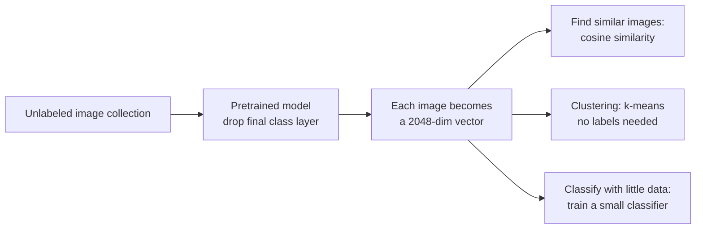

> **Learning objectives:** After this lesson, you will be able to pull representation vectors out of a trained network and use them to find similar images, cluster without labels, and then classify **with no training at all** using CLIP - and know how to read those numbers correctly instead of over-claiming.

## 1. The limit of a model with 1,000 slots

The previous ten lessons all ended in the same shape: an image goes in, and out comes a label from a fixed list. ResNet-50 has 1,000 slots, DeepLabV3 has 21, Faster R-CNN has 80.

That approach stumbles as soon as it meets real work:

- A client needs to distinguish 12 types of product defect - none of them is among the 1,000 ImageNet classes
- You need to find "images that look like this one" in a collection of 200,000 - no label can express "similar"
- You need to group an image collection to see what is in it - nobody has labeled anything yet

The first case **is still classification** - it is just that the label set you need is not among the 1,000 available labels, so the model's classification head is useless even though its body is not. The other two cases are no longer classification at all: there is no label set to choose from.

All three can be solved if we take out what the network computes **before** it squeezes everything into 1,000 slots.

## 2. Representation vectors: where to get them and how good they are

Deep Learning · Lesson 11 already pointed to the spot: remove the final classification layer, and the rest of ResNet-50 turns each image into **2,048 numbers**. Grab it with a hook, exactly as in Lesson 04:

```python
feat = {}
model.avgpool.register_forward_hook(lambda m, i, o: feat.__setitem__("v", o.flatten(1).detach()))
with torch.no_grad():
    model(batch)
X = feat["v"]                      # (batch, 2048)
X = torch.nn.functional.normalize(X, dim=1)     # normalize so we can use cosine
```

Take 600 Imagenette images (10 classes, chosen at random with fixed seed 42), then for each image find the **most similar** image by cosine similarity - exactly the measure from Foundations · Lesson 07. For comparison, do exactly the same on **raw pixels** flattened into a vector:

| Image representation | Dimensions | Most similar image in same class | Top-5 in same class |
|---|---|---|---|
| Raw pixels | 150,528 | 0.3400 | - |
| ResNet-50 vector | **2,048** | **0.9950** | 0.9887 |

The feature vector is **73 times smaller** yet finds the right class 99.5% of the time, versus 34% for raw pixels. This is the same point made in Deep Learning · Lesson 01 - raw pixels are not a useful representation - but this time measured on a task that no classification model can solve.

Looking directly at the distances between classes makes it even clearer:

| Image pairs | Average cosine similarity |
|---|---|
| Same class | **0.4996** |
| Different class | 0.1035 |

That 2,048-dimensional space has organized itself: images of the same kind lie close together, different kinds lie far apart. The model was never taught directly with an objective like "pull two similar images closer" - it was only taught to distinguish the 1,000 ImageNet classes. But that pressure to distinguish classes was enough to create a space in which distance carries meaning, and that structure falls out as a byproduct.

## 3. Clustering: reusing exactly two lessons you have already learned

If that space really has structure, then a clustering algorithm that **knows nothing about labels** should also be able to find the 10 groups. Run the k-means of Machine Learning · Lesson 09 with $k = 10$ on those same 600 vectors:

| Metric | Value |
|---|---|
| ARI (adjusted Rand index) | **0.9448** |
| NMI (normalized mutual information) | **0.9562** |

These two metrics measure how well the clusters found agree with the ground-truth labels, and both equal **1** when the two partitions match exactly. But **their lower baselines differ**, and this is very easy to misread.

**ARI is adjusted for chance**: completely random labeling has an expected value near 0, and the number can be **negative** when the result is even worse than chance. **NMI is not**: it lies in the range [0, 1], but random labeling on a finite set still gives a noticeably positive value, and that value **inflates as the number of clusters grows**. Measured on 600 samples with completely random labeling:

| Number of clusters | Average ARI | Average NMI |
|---|---|---|
| 10 | +0.0002 | **0.0313** |
| 30 | +0.0001 | **0.0895** |

So "NMI = 0.09" sounds like *a bit of structure* but may just be an artifact of splitting into many clusters. If you want a mutual-information metric whose chance baseline sits at 0, use **AMI** - the adjusted version - instead of NMI.

With all those caveats, the two numbers 0.9448 and 0.9562 here are still genuinely high: k-means nearly rebuilds the 10 classes exactly - **without looking at a single label**.

Put together, this is a process you can use right away on an unlabeled image collection:



The third branch is exactly **approach B of Deep Learning · Lesson 11** - freeze the body, train only the last layer. Seen from this angle it is not a cost-saving trick but a natural consequence: if the vector space already separates classes as well as the table in section 2 shows, then a linear classifier on top of it is enough.

## 4. CLIP: dropping even the fixed list of classes

Everything above still relies on a model that learned the 1,000 ImageNet classes. **CLIP** goes one step further: it learns from hundreds of millions of *(image, caption)* pairs taken from the web, and trains **two** encoders - one for images, one for text - so that an image and its correct caption lie close together in the same vector space.

The consequence is huge: **to classify by some class, write that class out in words**, with no training at all.

```python
import open_clip, torch.nn.functional as F
model, _, preprocess = open_clip.create_model_and_transforms(
    'ViT-B-32', pretrained='laion2b_s34b_b79k')
tok = open_clip.get_tokenizer('ViT-B-32')

prompts = [f"a photo of a {class_name}" for class_name in class_names]
with torch.no_grad():
    t = F.normalize(model.encode_text(tok(prompts)).float(), dim=1)
    v = F.normalize(model.encode_image(batch).float(), dim=1)
predictions = (v @ t.T).argmax(1)          # class whose caption is closest to the image
```

Run on those same 600 images, with ten captions of the form `"a photo of a {class name}"`:

| Approach | Top-1 | Training needed? |
|---|---|---|
| CLIP zero-shot | **0.9933** | **No** |

Normalizing the vectors before multiplying is mandatory, not optional: CLIP was trained with normalized vectors, and skipping that step lets vector length creep into the score, skewing the result.

> ⚠️ **A small note:** do not put 0.9933 next to the 0.8718 of Lesson 01 and conclude "CLIP is stronger than ResNet-50". Those two numbers answer two different questions, exactly as the three-kinds-of-numbers convention of Lesson 01 warns. ResNet-50 has to choose among **1,000** classes; CLIP here only chooses among the **10** captions I gave it. The fair comparison is against ResNet-50 when it too may only choose among 10 classes - which Lesson 01 measured: **0.9985**. In other words, the supervised model is still slightly ahead on a dataset drawn from the very ImageNet it was trained on. What is astonishing about CLIP is not a higher number, but that it comes close **without ever being trained for these ten classes**, and if tomorrow you switch to ten different classes it still works immediately.

The real strength of this approach lies elsewhere:

**Changing the class set means changing a line of text.** No labeled data, no training loop, no waiting.

**A description can be more subtle than a name.** `"a photo of a damaged package"` and `"a photo of an intact package"` are two valid classes, even though no dataset has those two labels.

**Searching images with text.** Because images and text live in the same space, typing a sentence and finding the images closest to it is possible right away - that is image search with natural language.

> 🔧 **Try it now:** CLIP zero-shot reaches 0.9933 on Imagenette. Should you use it to classify 12 types of product defect in a factory?
> You have to test it rather than infer it. Imagenette consists of ten very different classes (fish, dogs, churches, parachutes, horns), all of them common concepts on the Internet - where CLIP learned. Product defects in a factory are the opposite: the classes are very similar and the differences lie in small details. CLIP's training data comes from the web at the scale of hundreds of millions of pairs, so **nobody knows for sure what is in it** - but you should not assume it contains enough precise descriptions to distinguish the subtle differences of one specific production line. The sensible approach is to use CLIP or ResNet as a **feature extractor**, then train a small classifier on a few hundred labeled images - the third branch of the diagram in section 3, and also what Lesson 06 measured. Zero-shot is worth trying first because it is cheap, but it is worth measuring, not trusting in advance.

## 5. Why the theory stops here

The previous ten lessons followed one thread: an image goes in, the model returns a label, a box, or a mask - always an answer from a predefined list.

This lesson changes the shape of the answer: the model turns an image into a **vector**, and that vector can be used for things nobody defined at training time - search, clustering, classifying a new set of classes, matching images with text. That is where modern computer vision stands, and it is also the bridge to the Generative AI chapter, where the same idea - representing everything as vectors in a shared space - is pushed much further.

## Lesson summary

- A classification model is locked into a fixed list of classes. Some problems are still classification but need a **new label set**; some problems - finding similar images, clustering - are no longer classification at all.
- Remove the final classification layer, and ResNet-50 turns each image into **2,048 numbers**. That vector is **73 times** smaller than raw pixels yet finds a same-class image **99.5%** of the time, versus 34% for raw pixels.
- That space has its own structure: average cosine 0.4996 between same-class images versus 0.1035 between different-class images - even though the model was never taught with any objective about distance. The pressure of distinguishing the 1,000 ImageNet classes is enough for that structure to emerge as a byproduct.
- **k-means without looking at labels** rebuilds the 10 classes almost exactly: ARI 0.9448 and NMI 0.9562. Both equal 1 on an exact match, but **only ARI is adjusted for chance** (expected value near 0, can be negative); the NMI of random assignment is still positive and inflates with the number of clusters - if you want the adjusted version, use AMI.
- **CLIP** learns from (image, caption) pairs, so it can classify by writing class names out as text: **0.9933** zero-shot, no training at all.
- But do not compare 0.9933 with the 0.8718 of Lesson 01: CLIP chooses among 10 captions while ResNet-50 chooses among 1,000 classes. In a fair comparison, ResNet-50 restricted to 10 classes gets 0.9985 - still slightly ahead. CLIP's value is that it **needs no training**, not a higher number.
- Normalizing vectors before multiplying is mandatory with CLIP, because that is how it was trained.

## Self-check questions

1. The 2,048-dimensional vector is 73 times smaller than raw pixels yet its retrieval result is nearly three times better. What does that say about the "information" in raw pixels?
2. The average same-class cosine is 0.4996 and the different-class cosine is 0.1035. Why is the same-class number not closer to 1.0?
3. k-means reaches ARI 0.9448 without using labels. Did it really "learn" the 10 classes, or just exploit something already there? What does a negative ARI mean, and why can you not ask the same question about NMI?
4. Why must you not put CLIP's 0.9933 next to the 0.8718 of Lesson 01 to compare them? Which number is the right one to compare against, and why?
5. Name two problems that CLIP zero-shot will likely do well on, and two it will likely do badly on. What do you base that guess on?
6. Why do you have to normalize the vectors before computing the dot product with CLIP?
7. You have a collection of 200,000 unlabeled product images and need to know what is in it. Describe a process using this lesson, and point out where you still need human involvement.

## Further reading

**Foundational sources for this lesson:**

| Source | Which part to read |
|---|---|
| **Foundations · Lesson 07** | Cosine similarity - the measure used throughout this lesson |
| **Machine Learning · Lesson 09** | k-means, and how to read ARI/NMI |
| **Machine Learning · Lesson 10** | PCA - another way to compress representations, handy for comparison |
| **Deep Learning · Lesson 11** | Freezing the body and training the last layer - the third branch of the diagram in section 3 |

**Additional online sources (free):**

- [Radford et al. - Learning Transferable Visual Models From Natural Language Supervision (CLIP, 2021)](https://arxiv.org/abs/2103.00020) - the original paper; section 3.1 explains zero-shot classification with captions.
- [OpenCLIP](https://github.com/mlfoundations/open_clip) - the library used in section 4, with a table of weight sets and their published scores.
- [Chen et al. - SimCLR (ICML 2020)](https://arxiv.org/abs/2002.05709) - representation learning **with no labels at all**, a complementary direction to extracting features from a supervised model as in section 2.
- [FAISS](https://github.com/facebookresearch/faiss) - a library for nearest-vector search at the scale of millions, which you need once your image collection is larger than 600 images.
- [Adjusted Rand index and NMI - scikit-learn documentation](https://scikit-learn.org/stable/modules/clustering.html#clustering-performance-evaluation) - definitions and how to read the two metrics in section 3.

> **Next lesson:** [End-to-End Project: Reading Invoices from Photos](../end-to-end-project-reading-invoices-from-photos/) - eleven lessons have built all the pieces, each piece solving its own problem. The final lesson assembles them into a real system - detecting text regions, cropping, recognizing, merging lines, post-processing, exporting structured data - and shows that the hardest part of a vision system usually does not lie in the model.
