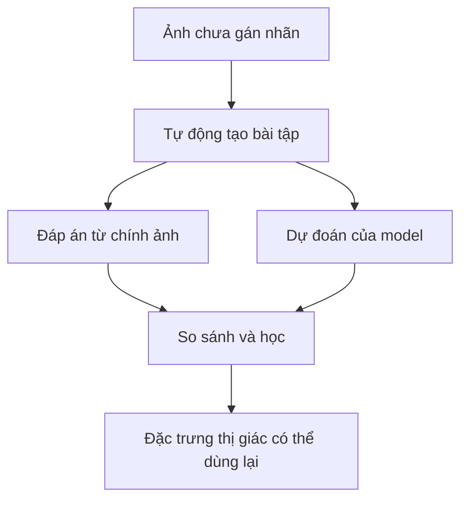
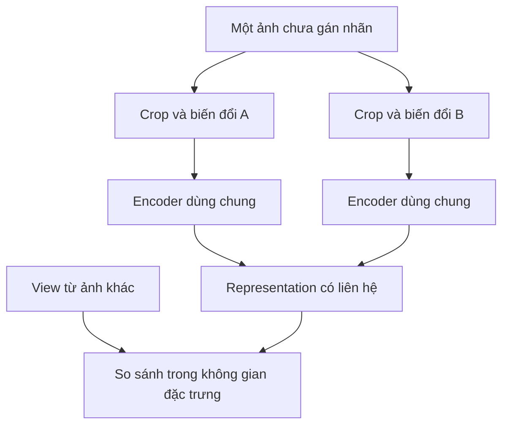
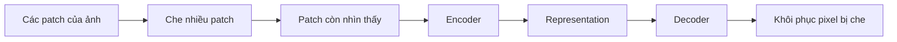
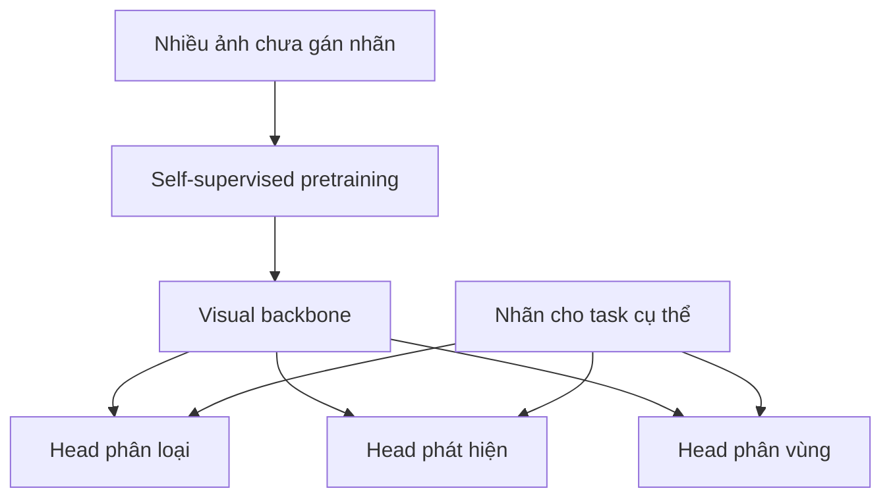

Internet, camera và cảm biến tạo ra lượng ảnh khổng lồ mỗi ngày. Nhưng gần như chẳng ai có thời gian ngồi ghi "đây là mèo", "đây là vết nứt" hay "đây là pallet" cho từng ảnh. **Self-Supervised Learning (SSL)** đặt một câu hỏi khác: dữ liệu có thể tự tạo ra bài tập để AI học, trước khi con người gán nhãn từng ví dụ, hay không?

Hãy tưởng tượng một nhà máy có **10 triệu ảnh** từ camera nhưng chỉ **20.000 ảnh được gán nhãn** normal, scratch, crack hoặc deformation. Đây là số liệu minh họa. Nếu chỉ dùng supervised learning, phần lớn kho ảnh không trực tiếp dạy được model phân loại lỗi. Thuê chuyên gia gắn nhãn từng frame có thể còn tốn hơn cả việc train model.

[Bài trước về Synthetic Data](../synthetic-data-training-rare-cases-vi/) hỏi làm sao tạo thêm ví dụ cho những tình huống ta **chưa có**. Bài này hỏi làm sao học từ những ảnh ta **đã có**, nhưng chưa gán nhãn.

## 1. "Self-supervised" không có nghĩa là "học mà không có bài tập"

Trong supervised learning quen thuộc, con người cung cấp đáp án: ảnh → "sản phẩm lỗi". Model dự đoán rồi so với nhãn do người đặt.

SSL vẫn cần một mục tiêu học hoặc một quan hệ cần học. Khác biệt là tín hiệu ấy được **tạo tự động từ chính dữ liệu**. Ví dụ, ta tạo hai góc nhìn của cùng một ảnh rồi yêu cầu model liên hệ chúng; hoặc che vài vùng và yêu cầu model khôi phục. Không ai phải ghi "con chó" hay "xe nâng" trên từng ảnh để tạo ra những bài tập ấy.

Mục tiêu thường không phải để model trở thành chuyên gia ở bài tập nhân tạo. Ta muốn nó học một **representation**: đặc trưng hữu ích cho classification, segmentation, detection hoặc task thật khác về sau.

## 2. SimCLR: hai góc nhìn của cùng một ảnh

Lấy một ảnh rồi tạo hai phiên bản bằng crop hoặc thay đổi ánh sáng. Pixel khác nhau, nhưng cả hai đến từ cùng ảnh gốc. Trong **contrastive learning**, model được train để đưa representation của hai view liên quan lại gần nhau, đồng thời phân biệt chúng với view của những ảnh khác.

[SimCLR](https://proceedings.mlr.press/v119/chen20j.html) là một ví dụ nổi tiếng. Nhóm tác giả cho thấy cách chọn và kết hợp augmentation ảnh hưởng rất mạnh tới chất lượng representation học được.

Bài tập này ngầm quy định model nên bỏ qua điều gì. Nếu hai view khác độ sáng vẫn được xem là liên quan, model được khuyến khích đừng quá phụ thuộc vào brightness. Điều đó có thể hữu ích trước [thay đổi ánh sáng ở bài Domain Shift](../domain-shift-when-production-looks-different-vi/).

Nhưng invariant cũng có thể sai. Nếu nhà máy cần phân biệt linh kiện đỏ và xanh, color jitter quá mạnh có thể dạy model rằng màu sắc không quan trọng, trong khi màu chính là tín hiệu của task. Crop cũng có thể cắt mất một vết lỗi rất nhỏ. Thiết kế bài tập SSL vẫn cần hiểu domain.

## 3. MAE: học bằng cách lấp chỗ trống

Một hướng khác là che một phần ảnh. **Masked Autoencoder (MAE)** chia ảnh thành các patch, che nhiều patch, rồi train decoder khôi phục pixel bị thiếu từ phần còn nhìn thấy.

Trong [paper MAE gốc](https://openaccess.thecvf.com/content/CVPR2022/html/He_Masked_Autoencoders_Are_Scalable_Vision_Learners_CVPR_2022_paper.html), nhóm tác giả dùng tỷ lệ che rất cao, khoảng **75%**. Encoder chỉ xử lý các patch còn nhìn thấy; decoder nhẹ cố tái tạo phần bị che.

Để làm tốt, encoder có thể học một phần về hình dạng, texture và cấu trúc không gian. Nhưng **khôi phục ảnh tốt không tự động đồng nghĩa phát hiện lỗi tốt**. Một vết đổi màu 2 mm có thể cực kỳ quan trọng với nhà máy nhưng đóng góp rất nhỏ vào objective khôi phục ảnh. Cần đánh giá downstream để biết representation có giữ được tín hiệu đó không.

## 4. DINO: student học từ teacher được tạo trong quá trình train

Một cách khác là **self-distillation**. Các view khác nhau của cùng ảnh được đưa qua student và teacher; student học để tạo output phù hợp với teacher. Trong [paper DINO gốc](https://openaccess.thecvf.com/content/ICCV2021/papers/Caron_Emerging_Properties_in_Self-Supervised_Vision_Transformers_ICCV_2021_paper.pdf), teacher không phải chuyên gia đã được train bằng nhãn từ trước. Nó được cập nhật từ những trạng thái trước đó của student trong lúc train.

Các nghiên cứu sau mở rộng family này. [DINOv2](https://arxiv.org/abs/2304.07193) nhấn mạnh một tập ảnh lớn, đa dạng và **được tuyển chọn**, để học đặc trưng thị giác có thể dùng lại. [Theo công bố của Meta, DINOv3](https://ai.meta.com/blog/dinov3-self-supervised-vision-model/) scale pretraining lên khoảng **1,7 tỷ ảnh** và model tới **7 tỷ tham số**, rồi dùng backbone giữ nguyên weights cho nhiều downstream task. Đây là thông tin về công trình của Meta, không phải công thức mọi team cần sao chép.

Mẫu chung có thể hình dung như sau:

Backbone biến ảnh thành đặc trưng để các thành phần khác dùng. Team có thể giữ nguyên backbone rồi train một head nhỏ, hoặc fine-tune thêm nếu task đòi hỏi. "Có thể dùng lại" không có nghĩa "tốt ngang nhau cho mọi task".

## 5. Quay lại nhà máy: học từ ảnh chưa nhãn, rồi dạy đúng công việc

Với kho ảnh nhà máy giả định, một workflow có thể là:

1. Tuyển chọn ảnh chưa nhãn: bỏ file hỏng, ảnh gần trùng và camera không liên quan.
2. Bắt đầu từ backbone đã pretrain phù hợp, hoặc pretrain trên ảnh nhà máy nếu lợi ích kỳ vọng đáng với chi phí compute và công sức.
3. Dùng **20.000 ảnh đã gán nhãn** để train hoặc fine-tune task phát hiện lỗi.
4. Đánh giá trên ảnh thật giữ riêng, trải qua nhiều camera, phiên bản sản phẩm, ánh sáng và loại lỗi.

Ảnh chưa nhãn có thể dạy encoder "thế giới thị giác của nhà máy này trông thế nào". Ảnh có nhãn dạy nó sự khác biệt nào được gọi là scratch hay crack trong công việc cụ thể. Đây là mental model hữu ích, **không phải bảo đảm** SSL sẽ thắng một supervised baseline mạnh.

Trước khi tự pretrain từ đầu trên 10 triệu ảnh, hãy so với một backbone SSL đã có. Dùng lại model có thể tiết kiệm rất nhiều; pretraining theo domain chỉ đáng làm nếu giúp task thực tế đủ nhiều để bù chi phí.

## 6. SSL không xóa nhu cầu về nhãn hoặc chất lượng dữ liệu

SSL có thể giảm phụ thuộc vào nhãn người **ở bước pretraining**. Nhưng validation và test vẫn cần ground truth. Muốn nói detector đạt recall hay tỷ lệ báo động nhầm bao nhiêu, ta cần nhãn đáng tin. Với một vết lỗi nhỏ và hiếm, hãy đánh giá riêng vết lỗi ấy thay vì chỉ nhìn điểm chung của visual backbone.

Dữ liệu chưa nhãn vẫn cần tuyển chọn. Mười triệu frame gần như giống hệt nhau có thể ít biến thể hữu ích hơn một tập nhỏ nhưng đa dạng. Ảnh trùng, lỗi camera, ảnh không liên quan và độ bao phủ lệch sẽ ảnh hưởng điều backbone học. Nhóm DINOv2 cũng mô tả việc xây tập ảnh đa dạng, có chọn lọc thay vì chỉ dùng một web crawl không lọc.

SSL thậm chí có thể học một invariant không phù hợp. Nếu bài tập pretraining khuyến khích bỏ qua màu trong khi defect là thay đổi màu rất nhỏ, feature học được có thể che mất đúng tín hiệu downstream detector cần. Bài test quyết định vẫn là task và điều kiện deploy dự kiến.

## 7. Synthetic data và SSL xử lý hai điểm nghẽn khác nhau

| Câu hỏi | Hướng xử lý phù hợp |
| --- | --- |
| "Chúng ta gần như không có ví dụ cho cảnh nguy hiểm hoặc hiếm này." | Thu thập hoặc tạo ví dụ đúng mục tiêu; cân nhắc [synthetic data](../synthetic-data-training-rare-cases-vi/). |
| "Chúng ta có hàng triệu ảnh nhưng hầu như không có nhãn." | Học đặc trưng từ ảnh chưa nhãn bằng SSL. |
| "Ngân sách gán nhãn rất ít." | Dùng nhãn có chủ đích cho task và evaluation đáng tin. |

Hai hướng có thể kết hợp. Ảnh thật chưa nhãn và ảnh synthetic đã kiểm tra kỹ có thể đóng góp cho pretraining, rồi một tập nhãn nhỏ hơn dạy task cụ thể. Nhưng synthetic data không sửa được objective SSL thiết kế sai; SSL cũng không biến ảnh synthetic phi thực tế thành đại diện tốt cho đời thật.

## Bước chuyển quan trọng: học trước, gán nhãn có chọn lọc sau

9,98 triệu ảnh chưa nhãn của nhà máy không tự động trở thành dataset tốt. Nhưng chúng cũng không chỉ là những file chờ con người gán nhãn từng cái. SSL đưa ra nhiều cách biến cấu trúc sẵn có của dữ liệu thành tín hiệu học, xây representation thị giác rồi dành công gán nhãn cho nơi đáng giá nhất.

Câu hỏi thay đổi từ **"Ai sẽ gắn nhãn cho mọi ảnh?"** thành **"Những ảnh này dạy được gì trước khi ta hỏi con người, và ta vẫn cần những nhãn nào để kiểm chứng kết quả?"**

## Nguồn tham khảo

- [A Simple Framework for Contrastive Learning of Visual Representations (SimCLR) - ICML/PMLR](https://proceedings.mlr.press/v119/chen20j.html)
- [Masked Autoencoders Are Scalable Vision Learners - CVPR/CVF](https://openaccess.thecvf.com/content/CVPR2022/html/He_Masked_Autoencoders_Are_Scalable_Vision_Learners_CVPR_2022_paper.html)
- [Emerging Properties in Self-Supervised Vision Transformers (DINO) - ICCV/CVF](https://openaccess.thecvf.com/content/ICCV2021/papers/Caron_Emerging_Properties_in_Self-Supervised_Vision_Transformers_ICCV_2021_paper.pdf)
- [DINOv2: Learning Robust Visual Features without Supervision - arXiv](https://arxiv.org/abs/2304.07193)
- [DINOv3: Self-supervised learning for vision at unprecedented scale - Meta AI](https://ai.meta.com/blog/dinov3-self-supervised-vision-model/)
