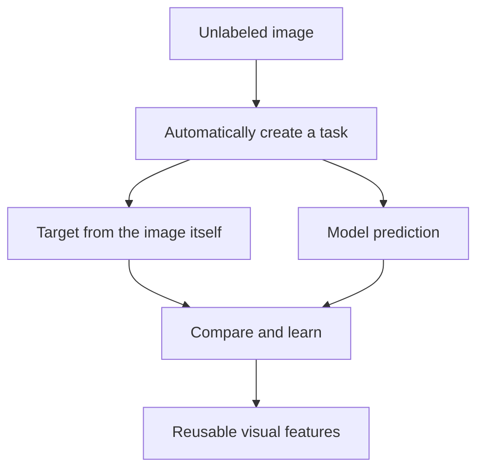
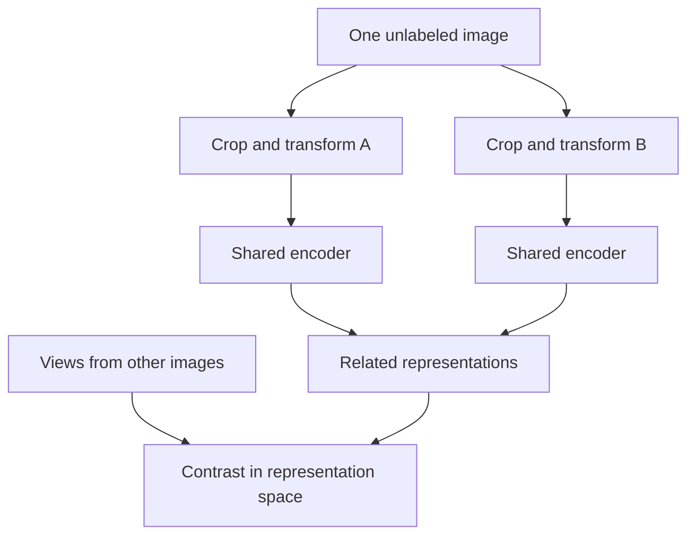
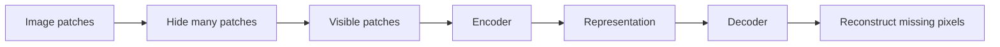
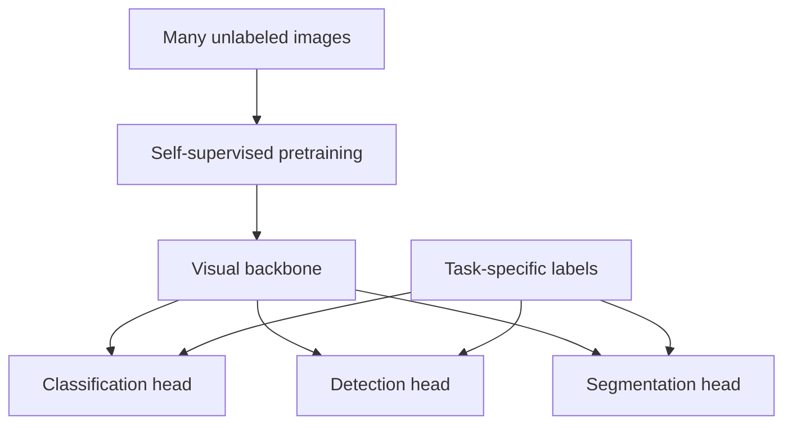

The internet, cameras, and sensors produce enormous numbers of images. Almost nobody has time to write "cat," "crack," or "pallet" on every one. **Self-supervised learning (SSL)** asks a different question: can the data itself provide a learning task before humans label individual examples?

Imagine a factory with **10 million images** from its cameras but only **20,000 labeled images** marked as normal, scratch, crack, or deformation. These are illustrative numbers. In a purely supervised workflow, most of the archive cannot directly teach a defect classifier. Hiring specialists to label every frame might cost more than training the model.

The [previous article](../synthetic-data-training-rare-cases/) asked how to create examples of situations we do **not** have. This one asks how to learn from the images we **already** have but have not labeled.

## 1. "Self-supervised" does not mean "learning without a task"

In ordinary supervised learning, a person supplies the target: image → "defective." The model predicts it and compares the prediction with the human label.

SSL still needs a target or relationship to learn. The difference is that it is **derived automatically from the data**. For example, we can make two views of the same image and ask a model to relate them, or hide parts of an image and ask it to reconstruct them. No person needs to label every image as "dog" or "forklift" for those exercises.

The aim is usually not to make the model an expert at the artificial exercise. It is to learn a **representation**: features that later help with classification, segmentation, detection, or another real task.

## 2. SimCLR: two views of the same image

Take one photo and create two altered views, perhaps with different crops and lighting. They have different pixels but come from the same original image. In **contrastive learning**, the model is trained to bring representations of related views together and distinguish them from views of other images.

[SimCLR](https://proceedings.mlr.press/v119/chen20j.html) is a well-known example. Its authors show that the choice and combination of augmentations strongly affect the quality of learned representations.

The exercise quietly defines what the model should ignore. If two views differ in brightness but are treated as related, the model is encouraged not to depend heavily on brightness. That may help with the [lighting changes discussed in the Domain Shift article](../domain-shift-when-production-looks-different/).

But invariance can also be wrong. If a factory distinguishes a red component from a green one, aggressive color changes may teach the model that color does not matter, even though color is the task. Crops can also remove a tiny defect. Designing the SSL exercise still requires domain knowledge.

## 3. MAE: learn by filling in missing patches

Another family hides parts of an image. A **Masked Autoencoder (MAE)** divides an image into patches, masks many of them, and trains a decoder to reconstruct the missing pixels from the visible patches.

In the [original MAE paper](https://openaccess.thecvf.com/content/CVPR2022/html/He_Masked_Autoencoders_Are_Scalable_Vision_Learners_CVPR_2022_paper.html), the authors use a high masking ratio, around **75%**. The encoder processes only visible patches, while a lightweight decoder reconstructs missing content.

To do this well, the encoder can learn information about shape, texture, and spatial structure. But **good reconstruction does not automatically mean good defect detection**. A two-millimeter discoloration may matter enormously to the factory while contributing little to an image-reconstruction objective. Downstream testing must settle that question.

## 4. DINO: a student learns from a teacher built during training

A third approach is **self-distillation**. Different views of the same image go through a student and a teacher network; the student learns to match the teacher's output. In the original [DINO paper](https://openaccess.thecvf.com/content/ICCV2021/papers/Caron_Emerging_Properties_in_Self-Supervised_Vision_Transformers_ICCV_2021_paper.pdf), the teacher is not a pre-labeled expert provided in advance. It is updated from earlier states of the student during training.

Later work scaled this family of methods. [DINOv2](https://arxiv.org/abs/2304.07193) emphasizes a large, diverse, **curated** image dataset for learning reusable visual features. [Meta reports that DINOv3](https://ai.meta.com/blog/dinov3-self-supervised-vision-model/) scales pretraining to about **1.7 billion images** and models up to **7 billion parameters**, with frozen visual backbones used across downstream tasks. Those are properties of Meta's published work, not a recipe every team must reproduce.

The broader pattern is:

A backbone turns an image into features that other components can use. A team can freeze it and train a small task-specific head, or fine-tune more of it if the task requires. "Reusable" does not mean "equally good for every task."

## 5. Back at the factory: use unlabeled data, then teach the task

For the hypothetical factory archive, one possible workflow is:

1. Curate unlabeled images: remove corrupt files, near-duplicates, and irrelevant camera feeds.
2. Start with a suitable pretrained backbone, or pretrain on factory images if the expected benefit justifies the compute and engineering cost.
3. Use the **20,000 labeled images** to train or fine-tune the defect task.
4. Evaluate on held-out real images across cameras, product versions, lighting conditions, and defect types.

The unlabeled images may teach the encoder what the factory's visual world looks like. The labeled images teach it which differences count as "scratch" or "crack" for this business. This is a useful mental model, not a guarantee that SSL pretraining will outperform a strong supervised baseline.

Before training from scratch on 10 million images, compare against an available SSL backbone. Reusing one may be far cheaper; domain-specific pretraining is worth it only if it improves the actual task enough to justify its cost.

## 6. SSL does not eliminate labels or data quality work

SSL can reduce the dependence on human labels **during pretraining**. It does not remove the need for labeled validation and test data. To claim a defect detector has a certain recall or false-alarm rate, you need trustworthy ground truth. For a small, rare defect, inspect performance specifically on that defect rather than relying on a general feature benchmark.

Unlabeled data also needs curation. Ten million almost-identical frames may contain less useful variation than a smaller, diverse collection. Duplicates, camera artifacts, irrelevant images, and uneven coverage can shape what the backbone learns. DINOv2's authors explicitly describe curating a diverse dataset instead of simply using an unfiltered image crawl.

SSL may even learn an unhelpful invariance. If the pretraining task encourages color invariance but the defect is a subtle color change, the resulting features may hide the very signal a downstream detector needs. The right test is always on the intended task and deployment conditions.

## 7. Synthetic data and SSL solve different bottlenecks

| Question | Useful direction |
| --- | --- |
| "We barely have examples of this dangerous or rare scene." | Generate or collect targeted examples; consider [synthetic data](../synthetic-data-training-rare-cases/). |
| "We have millions of images, but almost no labels." | Learn features from unlabeled images with SSL. |
| "We have a small annotation budget." | Use labels strategically for task training and reliable evaluation. |

They can be combined. Real unlabeled images and carefully validated synthetic images can contribute to pretraining, followed by a smaller labeled set for the task. But synthetic images do not fix a poorly chosen SSL objective, and SSL does not make unrealistic synthetic images representative of reality.

## The useful shift is from labeling everything to learning first

The factory's 9.98 million unlabeled images are not automatically a good dataset. Yet they are also not merely files waiting for humans to annotate them one by one. SSL offers ways to turn their internal structure into a training signal, build a visual representation, and spend scarce labels where they matter most.

The key question changes from **"Who will label every image?"** to **"What can these images teach us before we ask a person, and which labels do we still need to verify the result?"**

## References

- [A Simple Framework for Contrastive Learning of Visual Representations (SimCLR) - ICML/PMLR](https://proceedings.mlr.press/v119/chen20j.html)
- [Masked Autoencoders Are Scalable Vision Learners - CVPR/CVF](https://openaccess.thecvf.com/content/CVPR2022/html/He_Masked_Autoencoders_Are_Scalable_Vision_Learners_CVPR_2022_paper.html)
- [Emerging Properties in Self-Supervised Vision Transformers (DINO) - ICCV/CVF](https://openaccess.thecvf.com/content/ICCV2021/papers/Caron_Emerging_Properties_in_Self-Supervised_Vision_Transformers_ICCV_2021_paper.pdf)
- [DINOv2: Learning Robust Visual Features without Supervision - arXiv](https://arxiv.org/abs/2304.07193)
- [DINOv3: Self-supervised learning for vision at unprecedented scale - Meta AI](https://ai.meta.com/blog/dinov3-self-supervised-vision-model/)
