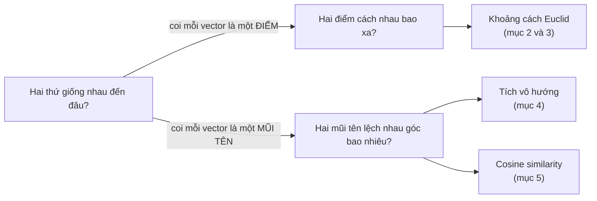

> **Mục tiêu bài học:** Sau bài này, bạn sẽ biết cách đo **khoảng cách** và **độ tương đồng** giữa hai vector - bằng khoảng cách Euclid, tích vô hướng và cosine similarity - hiểu khi nào dùng thước đo nào, và thấy được các thước đo này chạy ngầm bên trong gợi ý phim, tìm kiếm ảnh và embedding.

## 1. "Hai thứ giống nhau đến đâu?" - câu hỏi phía sau gợi ý phim, tìm ảnh, gom cụm

Bạn vừa xem xong một bộ phim, Netflix lập tức gợi ý *"phim tương tự"*. Bạn chụp một chiếc ghế ngoài quán cà phê, ứng dụng mua sắm tìm ra đúng mẫu ghế đó trong kho hàng. Bài toán gom cụm ở Bài 05 xếp hai khách hàng vào cùng nhóm vì họ "giống nhau" hơn phần còn lại. Ba tính năng, một câu hỏi chung: **hai thứ này giống nhau đến đâu?**

Máy tính không có khái niệm "giống". Nó chỉ có các vector từ Bài 06: mỗi phim, mỗi ảnh, mỗi khách hàng là một dãy số - như mỗi căn nhà trong bảng 6 căn nhà mini của Bài 02 và Bài 03 là một hàng số. Nhưng khi mọi thứ đã thành vector, câu hỏi mơ hồ kia tách thành hai câu hỏi hình học đo đếm được:



Cả bài hôm nay là học cách trả lời hai câu hỏi đó bằng con số - với ba công cụ: khoảng cách Euclid, tích vô hướng và cosine similarity. Mục 6 cho thấy ba công cụ ấy chạy ngầm trong k-NN, gom cụm và embedding; mục 7 gói tất cả vào vài dòng NumPy.

## 2. Khoảng cách Euclid: đo bằng "đường chim bay"

Hai điểm A = (1, 2) và B = (4, 6) trên giấy kẻ ô - cách nhau bao xa? Cách tự nhiên nhất là căng một sợi dây từ A đến B rồi đo. Đó là **khoảng cách Euclid (Euclidean distance)**: độ dài đoạn thẳng nối hai điểm, "đường chim bay". Với 2 chiều, nó chính là định lý Pythagoras bạn học từ cấp hai:

```
 trục 2
   6 ┤            B (4, 6)
     │           ╱│
     │      d  ╱  │ 6−2 = 4
     │       ╱    │
   2 ┤  A (1, 2)──┘
     │      4−1 = 3
     └───┬────────┬──── trục 1
         1        4

 d(A, B) = √(3² + 4²) = √25 = 5
```

Công thức tổng quát chỉ là bản mở rộng: bình phương từng chênh lệch theo mỗi chiều, cộng hết lại, lấy căn. Điều đáng giá nhất: công thức **không quan tâm có bao nhiêu chiều**. Hai căn nhà mô tả bằng vài cột số? Hai khách hàng mô tả bằng 20 features? Vẫn tính y hệt - cộng 20 bình phương chênh lệch rồi lấy căn. Ta mất khả năng vẽ, nhưng không mất khả năng đo.

Ngoài đường chim bay còn có cách đo của taxi trong khu phố bàn cờ - chỉ đi ngang và dọc: **khoảng cách Manhattan** = tổng độ chênh tuyệt đối theo từng trục. Giữa A và B ở trên: 3 + 4 = 7. Bài này tập trung vào Euclid - kiểu đo mặc định trong phần lớn tài liệu nhập môn.

> 🔧 **Thử ngay:** hai điểm P = (2, 3) và Q = (8, 11). Chênh lệch theo hai trục là 6 và 8. Khoảng cách Euclid = √(6² + 8²) = √100 = **10**; khoảng cách Manhattan = 6 + 8 = **14**. Taxi luôn đi xa hơn (hoặc bằng) chim bay - bạn có thấy vì sao không?

## 3. Norm: độ dài của một vector

Mục 2 đo khoảng cách giữa hai điểm. Giờ hỏi một câu đơn giản hơn: một vector - một mũi tên xuất phát từ gốc tọa độ - **dài bao nhiêu**? Con số đó gọi là **chuẩn (norm)** của vector, ký hiệu $\|x\|$. Norm Euclid (còn gọi là norm $\ell_2$) tính đúng kiểu Pythagoras:

```
x = [3, −4]   →   ‖x‖ = √(3² + (−4)²) = √25 = 5
```

Có norm rồi thì khoảng cách chỉ là chuyện "khuyến mãi": **khoảng cách giữa hai vector = norm của vector hiệu**. Với A = (1, 2), B = (4, 6): hiệu B − A = (3, 4), và ‖(3, 4)‖ = 5 - đúng đáp số mục 2. Một công cụ, hai công dụng.

Vì sao ML quan tâm đến norm? Vì rất nhiều mục tiêu huấn luyện được phát biểu bằng norm và khoảng cách: *giảm khoảng cách giữa dự đoán và đáp án thật*; *kéo vector của hai ảnh cùng một người lại gần nhau, đẩy vector của hai người khác nhau ra xa*. Khi gặp hàm mất mát ở Bài 10, bạn sẽ thấy bóng dáng norm ngay trong công thức.

<details>
<summary>Chi tiết thêm: ba tính chất định nghĩa một norm</summary>

Theo sách *Mathematics for Machine Learning* (mục 3.1), một hàm đo độ dài được gọi là norm khi thỏa ba tính chất:

1. **Co giãn tuyệt đối:** nhân vector với số λ thì độ dài nhân với |λ| - kéo mũi tên dài gấp đôi thì độ dài gấp đôi.
2. **Bất đẳng thức tam giác:** ‖x + y‖ ≤ ‖x‖ + ‖y‖ - đi thẳng không bao giờ xa hơn đi vòng.
3. **Xác định dương:** độ dài không âm, và chỉ bằng 0 khi vector là vector 0.

Norm Manhattan ($\ell_1$ - tổng trị tuyệt đối các phần tử, ví dụ ‖[3, −4]‖₁ = 7) cũng thỏa cả ba tính chất, nên nó là một norm hợp lệ - chỉ là một "cây thước" khác.

</details>

## 4. Tích vô hướng (dot product): con số đo độ "cùng hướng"

Hai khách hàng có vector sở thích [2, 1] và [3, 1] - chẳng hạn số phim hành động và số phim hài mỗi người đã xem. Họ có "chung gu" không? Mục 2 chỉ trả lời được "cách nhau bao xa". Câu hỏi "cùng hướng cỡ nào" cần một phép tính khác - nhân vật chính của bài.

**Tích vô hướng (dot product)** của hai vector cùng số chiều: **nhân từng cặp phần tử rồi cộng hết lại**. Kết quả là *một con số* (nên mới gọi là "vô hướng"):

```
[2, 1] · [3, 1] = 2×3 + 1×1 = 7
```

Bạn đã gặp phép này ở Bài 06 mà không gọi tên: mỗi phần tử trong kết quả của phép nhân ma trận-vector chính là một tích vô hướng giữa một hàng của ma trận và vector đó; "tổng có trọng số" cũng là tích vô hướng giữa vector giá trị và vector trọng số. Cùng một động tác "nhân từng cặp, cộng dồn" xuất hiện ở khắp nơi.

Điều làm tích vô hướng đặc biệt là **ý nghĩa hình học**: dấu của kết quả kể cho ta nghe về **góc** giữa hai mũi tên:

```
   góc nhọn (< 90°)       vuông góc (90°)        góc tù (> 90°)
      ↗  ↗                  ↑                     ←   →
                            └─→
    a · b > 0            a · b = 0              a · b < 0
  có thành phần        trực giao -            có xu hướng
  cùng hướng           "không chung hướng"    đối hướng
```

Kiểm chứng bằng số nhỏ với a = [2, 1]:

| b | a · b | Nhận xét |
|---|---|---|
| [3, 1] | 2×3 + 1×1 = **7** | góc giữa b và a nhọn (< 90°) → dương |
| [−1, 2] | 2×(−1) + 1×2 = **0** | b vuông góc với a → bằng 0 |
| [−2, −1] | 2×(−2) + 1×(−1) = **−5** | b ngược hướng hẳn với a (góc 180°) → âm |

Hai vector có tích vô hướng bằng 0 được gọi là **trực giao (orthogonal)** - vuông góc với nhau, "không chung chút hướng nào". Hệ quả nhỏ mà lạ: vector 0 trực giao với *mọi* vector, vì nhân với 0 thì tích nào cũng bằng 0.

Chú ý chữ "góc nhọn" chứ không phải "cùng hướng": dấu dương chỉ cho biết góc nhỏ hơn 90°, còn nhỏ đến đâu thì dấu không nói. Box dưới đây có một cặp vector trông rất "lệch" nhau mà tích vô hướng vẫn dương.

> 🔧 **Thử ngay:** lấy a = [1, 3]. Tính a · b với ba vector b sau và đoán góc:
> - b = [2, 1] → 1×2 + 3×1 = **5** → dương, góc nhọn.
> - b = [3, −1] → 3 − 3 = **0** → trực giao.
> - b = [−2, 1] → −2 + 3 = **1** → vẫn dương! Hai mũi tên trông gần như ngược nhau, nhưng góc giữa chúng chỉ khoảng 82° - vẫn nhọn. Dấu dương nói "dưới 90°", không nói "cùng hướng".

Tích vô hướng còn "tặng kèm" hai thứ: **norm** (độ dài của x là căn của x · x - thử với [3, −4]: căn của 9 + 16 = 5) và **góc chính xác** giữa hai vector, qua công thức cosine ngay mục sau. Và một nhận xét đáng nhớ về quan hệ giữa các thước đo: với các vector có **độ dài tương đương nhau**, hai vector càng giống nhau thì **tích vô hướng càng lớn** còn **khoảng cách càng nhỏ** - hai phép đo chạy ngược chiều, nhưng cùng nói lên một điều.

> ⚠️ **Lưu ý nhỏ:** điều kiện "độ dài tương đương" ở trên là bắt buộc. Tích vô hướng phình theo độ dài vector, nên khi không kiểm soát độ dài, con số lớn chưa chắc đã có nghĩa là hai vector giống nhau. Đó chính là lý do mục 5 tồn tại.

## 5. Cosine similarity: chỉ đo góc, bỏ qua độ dài

Quay lại hai khách hàng ở mục 4, nhưng giờ một người xem gấp mười lần người kia: [2, 1] và [20, 10]. Gu hệt nhau (cùng tỷ lệ hành động : hài), vậy mà tích vô hướng vọt lên 2×20 + 1×10 = 50, còn khoảng cách Euclid giữa họ cũng lớn (≈ 20). Cả hai thước đo đều bị **độ dài** đánh lừa.

Muốn một thước đo **thuần về hướng**, ta chia tích vô hướng cho tích hai độ dài:

$$\text{cosine}(x, y) = \frac{x \cdot y}{\|x\| \, \|y\|}$$

Kết quả là **cosine của góc** giữa hai vector - gọi là **độ tương đồng cosine (cosine similarity)** - luôn nằm trong khoảng từ −1 đến 1:

| cosine | Ý nghĩa |
|---|---|
| 1 | cùng hướng tuyệt đối (góc 0°) |
| gần 1 | góc nhỏ - rất "cùng gu" |
| 0 | vuông góc - không chung chút hướng nào |
| −1 | ngược hướng hoàn toàn (góc 180°) |

Ví dụ tính tay (lấy từ sách *Mathematics for Machine Learning*, ví dụ 3.6): x = [1, 1] và y = [1, 2] có x · y = 3, ‖x‖ = √2, ‖y‖ = √5, nên cosine = 3/√10 ≈ 0,95 - góc khoảng 18°, hai vector khá "cùng gu".

> 🔧 **Thử ngay:** a = [3, 4], b = [4, 3]. Tích vô hướng = 12 + 12 = **24**; ‖a‖ = ‖b‖ = 5; cosine = 24/25 = **0,96** (góc ≈ 16°). Giờ nhân đôi b thành [8, 6]: tích vô hướng tăng gấp đôi thành **48**, nhưng cosine = 48/(5 × 10) vẫn là **0,96**. Đó chính là "sở trường" của cosine: đổi độ dài, không đổi kết quả.

**Khi nào cần cosine thay vì Euclid?** Tình huống kinh điển là **văn bản dài ngắn khác nhau**. Biểu diễn văn bản bằng vector đếm từ (mỗi chiều đếm một từ). Một câu ngắn nhắc "AI" 1 lần, "dữ liệu" 1 lần; một đoạn dài cùng chủ đề nhắc mỗi từ 4 lần:

```
  câu ngắn:   u = [1, 1]
  đoạn dài:   v = [4, 4]      (= 4 × u, cùng hướng, chỉ dài hơn)

  Euclid:  d(u, v) = √(3² + 3²) ≈ 4,24   → "xa nhau"  (chỉ vì độ dài!)
  Cosine:  cos(u, v) = 8 / (√2 × √32) = 1 → "giống hệt" (đúng bản chất)
```

Độ dài văn bản làm vector **dài ra** nhưng không đổi **hướng** - mà chủ đề nằm ở hướng. Euclid bị độ dài đánh lừa; cosine thì không. Đây là lý do cosine similarity được dùng rộng rãi khi so sánh văn bản và embedding (mục 6).

Ngược lại, khi các con số đo trên **cùng thang đo và độ lớn mang thông tin thật** - tọa độ trên bản đồ phẳng hay tọa độ pixel, số đo cơ thể, chỉ số xét nghiệm - thì độ lớn chính là thứ cần so, và Euclid là lựa chọn tự nhiên.

| Tình huống | Thước đo phù hợp |
|---|---|
| Độ lớn mang thông tin (tọa độ, số đo cùng thang) | Khoảng cách Euclid |
| Chỉ quan tâm "hướng"/chủ đề, kích cỡ mẫu lệch nhau (văn bản dài ngắn) | Cosine similarity |
| Vector đã chuẩn hóa về độ dài 1 | Hai cách xếp hạng tương đương nhau |

Dòng cuối là mẹo đáng nhớ: sau khi chuẩn hóa hai vector về độ dài 1, tích vô hướng của chúng chính là cosine của góc.

> ⚠️ **Lưu ý nhỏ:** cosine similarity không xác định khi một trong hai vector là vector 0 - độ dài bằng 0 thì không có "hướng" nào để so (và công thức sẽ chia cho 0). Vector đếm từ ở trên cũng là kiểu biểu diễn thô sơ, chỉ đủ để thấy vấn đề; embedding ở mục 6 là cách biểu diễn tinh hơn.

## 6. Ba ứng dụng: k-nearest neighbors, gom cụm và embedding

Một khách hàng mới nộp hồ sơ vay. Ngân hàng chưa biết gì về họ ngoài vài con số: tuổi, thu nhập, số năm làm việc... Có cách đoán nào đơn giản hơn là **tìm 5 khách hàng cũ giống họ nhất và xem 5 người đó đã trả nợ ra sao**?

**k-nearest neighbors (k-NN - k hàng xóm gần nhất).** Cách đoán đó chính là k-NN, có lẽ là thuật toán phân loại dễ giải thích nhất (nối tiếp bài toán phân loại của Bài 05): muốn dán nhãn một điểm mới, tìm **k điểm gần nó nhất** trong dữ liệu đã có nhãn, rồi **lấy nhãn theo đa số**. Nếu 4 trong 5 hàng xóm từng vay và trả đúng hạn, ta đoán khách mới cũng vậy. Toàn bộ "trí thông minh" của k-NN nằm ở chữ *gần* - tức là ở thước đo khoảng cách bạn vừa học.

Còn chọn k bằng bao nhiêu - 1, 5 hay 100 - là chuyện của Bài 13. Điều bất ngờ ở một thuật toán đơn giản đến vậy: trong ví dụ mô phỏng của sách *An Introduction to Statistical Learning* (chương 2), k-NN với k = 10 đạt tỷ lệ lỗi trên dữ liệu mới 13,6% - rất gần mức lỗi thấp nhất có thể về lý thuyết cho bộ dữ liệu đó, 13,0%.

**Gom cụm (clustering).** Bài toán học không giám sát của Bài 05 - tự gom khách hàng thành nhóm - cũng dựa trên khoảng cách: thuật toán gom những điểm **gần nhau** vào một cụm và tách các cụm **xa nhau** ra. Đổi thước đo là đổi luôn kết quả gom cụm.

**Embedding - biểu diễn vạn vật thành vector.** Đây là ý tưởng lớn nhất của mục này. Vector đếm từ ở mục 5 do ta *tự đặt*; **embedding** là vector được *học ra* cho mỗi từ, mỗi sản phẩm, mỗi người dùng... - mỗi tọa độ là một núm vặn được huấn luyện - sao cho **những thứ giống nhau về ý nghĩa có vector gần nhau**. Khi đó "đo độ giống về nghĩa", việc máy tính không biết làm, biến thành "đo khoảng cách hoặc góc giữa hai vector" - việc bạn vừa học xong.

Không gian embedding học được còn có thể chứa cả **quan hệ** giữa các khái niệm dưới dạng phép cộng trừ vector. Ví dụ kinh điển (quan sát được trong một số không gian embedding từ vựng, nổi tiếng nhất là word2vec):

```
vector("Rome") − vector("Italy") + vector("France") ≈ vector("Paris")
```

Tức là "hướng đi" từ một quốc gia đến thủ đô của nó gần như là **cùng một mũi tên** cho các cặp khác nhau. Gợi ý phim "tương tự", tìm kiếm theo ngữ nghĩa, chatbot tra cứu tài liệu - phía sau đều là một kho vector embedding cộng với một phép đo tương đồng (cosine là một lựa chọn rất thông dụng).

> ⚠️ **Lưu ý nhỏ:** phép "Rome − Italy + France ≈ Paris" là hiện tượng quan sát được ở một số mô hình embedding, không phải tính chất bảo đảm của mọi mô hình.

## 7. Tự tính bằng NumPy

Mọi phép đo trong bài gói gọn trong vài dòng NumPy:

```python
import numpy as np

a = np.array([1, 2])
b = np.array([4, 6])

np.linalg.norm(a)              # 2.236... - độ dài (norm l2) của a
np.linalg.norm(b - a)          # 5.0     - khoảng cách Euclid giữa a và b

a @ b                          # 16      - tích vô hướng: 1×4 + 2×6

def cosine(u, v):
    return (u @ v) / (np.linalg.norm(u) * np.linalg.norm(v))

cosine(np.array([1, 1]), np.array([4, 4]))    # 1.0  - cùng hướng tuyệt đối
cosine(np.array([2, 1]), np.array([-1, 2]))   # 0.0  - vuông góc
cosine(np.array([8, 2]), np.array([2, 8]))    # ~0.47 - góc khá lớn
```

Thử nghịch thêm: nhân đôi một vector (`cosine(u, 2*v)`) và xem cosine có đổi không - rồi làm điều tương tự với `np.linalg.norm(2*v - u)` để thấy Euclid đổi ra sao. Bạn sẽ "sờ" được đúng điểm khác biệt giữa hai thước đo.

## Tóm tắt bài học

- Rất nhiều bài toán ML - gợi ý, tìm kiếm, gom cụm, phân loại kiểu k-NN - quy về câu hỏi **"hai vector giống nhau đến đâu?"**, trả lời được bằng **khoảng cách** hoặc **góc**.
- **Khoảng cách Euclid** là đường chim bay, tính bằng định lý Pythagoras và hoạt động y hệt ở số chiều bất kỳ; **khoảng cách Manhattan** là phương án "đi theo lưới phố".
- **Norm** là độ dài của một vector; **khoảng cách giữa hai vector = norm của vector hiệu**. Nhiều mục tiêu huấn luyện ML được phát biểu bằng norm và khoảng cách.
- **Tích vô hướng** = nhân từng cặp, cộng dồn. Dấu của nó nói lên quan hệ về góc: góc nhọn → dương, vuông góc (trực giao) → 0, góc tù → âm; độ lớn của nó phụ thuộc cả góc lẫn độ dài hai vector.
- **Cosine similarity** = tích vô hướng chia tích hai độ dài - chỉ đo góc, miễn nhiễm với độ dài vector; phù hợp khi so văn bản/embedding có kích cỡ lệch nhau, trong khi Euclid phù hợp khi độ lớn số liệu mang thông tin.
- **Embedding** biến từ, sản phẩm, người dùng thành vector sao cho "giống nghĩa = gần nhau" - ví dụ Rome − Italy + France ≈ Paris trong sách *Dive into Deep Learning* - và biến bài toán ngữ nghĩa thành bài toán hình học.

## Câu hỏi tự kiểm tra

1. Tính tay khoảng cách Euclid giữa hai điểm (1, 1) và (4, 5). Khoảng cách Manhattan giữa chúng là bao nhiêu?
2. Tính tay tích vô hướng [2, 3] · [−3, 2]. Kết quả cho bạn kết luận gì về góc giữa hai vector? Cosine similarity của chúng bằng bao nhiêu (không cần tính norm vẫn trả lời được)?
3. Norm $\ell_2$ của vector [6, 8] là bao nhiêu? Vector duy nhất có norm bằng 0 là vector nào?
4. Hai bài đánh giá phim có vector đếm từ u = [10, 0, 5] và v = [2, 0, 1]. Nhận xét quan hệ giữa u và v, từ đó suy ra cosine similarity của chúng mà không cần bấm máy. Khoảng cách Euclid giữa chúng có nhỏ không? Hai thước đo đang "kể" hai câu chuyện gì?
5. Mô tả bằng lời cách k-NN với k = 5 quyết định nhãn cho một khách hàng mới. Trước khi chạy k-NN, bạn phải chọn trước điều gì liên quan đến bài học hôm nay?
6. Vì sao cosine similarity phù hợp để so hai văn bản dài ngắn khác nhau? Ngược lại, hãy nêu một tình huống mà độ lớn của vector mang thông tin quan trọng, khiến Euclid là lựa chọn hợp lý hơn.

## Đọc thêm

**Nguồn nền tảng của bài:**

| Nguồn | Đọc phần nào |
|---|---|
| **Sách *Mathematics for Machine Learning*** | Chương 3 - *Analytic Geometry*: mục 3.1 (norms), 3.2 (inner products), 3.3 (lengths & distances), 3.4 (angles & orthogonality) |
| **Sách *Dive into Deep Learning* (d2l.ai)** | Chương 2, mục 2.3 *Linear Algebra*: phần *Dot Products* và *Norms*; chương 1 *Introduction*: ví dụ embedding "Rome − Italy + France = Paris" |
| **Sách *An Introduction to Statistical Learning*** | Chương 2, mục 2.2.3: ví dụ k-NN với k = 1, 10 và 100 trên dữ liệu mô phỏng - thấy rõ vai trò của chữ "gần" và của việc chọn k |

**Nguồn online bổ sung (miễn phí):**

- [Essence of Linear Algebra - 3Blue1Brown](https://www.3blue1brown.com/topics/linear-algebra) - chương "Dot products and duality" trong chuỗi video này minh họa ý nghĩa hình học của tích vô hướng bằng hình động.
- [Vector similarity explained - Redis blog](https://redis.io/blog/vector-similarity/) - giải thích các thước đo tương đồng vector (Euclid, cosine, dot product) trong bối cảnh tìm kiếm ngữ nghĩa và hệ gợi ý.
- [Measuring Similarity and Distance between Embeddings - Dataquest](https://www.dataquest.io/blog/measuring-similarity-and-distance-between-embeddings/) - bài thực hành so sánh các thước đo trên embedding thật.

> **Bài tiếp theo:** [Xác suất và thống kê cho AI](../probability-statistics-for-ai-vi/) - rời hình học sang xác suất - ngôn ngữ để mô hình nói "tôi chắc 90% đây là mèo", và nền móng của gần như mọi hàm mất mát bạn sẽ gặp.
