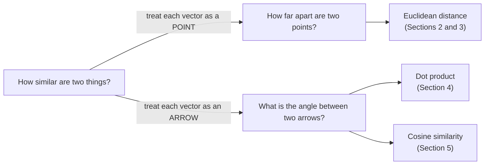

> **Learning objectives:** After this lesson, you will know how to measure **distance** and **similarity** between two vectors - with Euclidean distance, the dot product and cosine similarity - understand when to use which measure, and see how these measures run under the hood of movie recommendations, image search and embeddings.

## 1. "How similar are these two things?" - the question behind movie recommendations, image search and clustering

You have just finished a movie, and Netflix immediately suggests *"similar movies"*. You snap a photo of a chair at a coffee shop, and a shopping app finds that exact chair model in its catalog. The clustering problem in Lesson 05 put two customers in the same group because they were "more alike" than the rest. Three features, one shared question: **how similar are these two things?**

A computer has no concept of "alike". It only has the vectors from Lesson 06: every movie, every image, every customer is a list of numbers - just as every house in the mini table of 6 houses from Lesson 02 and Lesson 03 was a row of numbers. But once everything has become a vector, that fuzzy question splits into two geometric questions that can actually be measured:



Today's whole lesson is about learning to answer those two questions with numbers - using three tools: Euclidean distance, the dot product and cosine similarity. Section 6 shows those three tools running under the hood of k-NN, clustering and embeddings; Section 7 packs everything into a few lines of NumPy.

## 2. Euclidean distance: measuring "as the crow flies"

Two points A = (1, 2) and B = (4, 6) on graph paper - how far apart are they? The most natural approach is to stretch a string from A to B and measure it. That is **Euclidean distance**: the length of the straight segment joining the two points, "as the crow flies". In 2 dimensions, it is exactly the Pythagorean theorem you learned in middle school:

```
 axis 2
   6 ┤            B (4, 6)
     │           ╱│
     │      d  ╱  │ 6−2 = 4
     │       ╱    │
   2 ┤  A (1, 2)──┘
     │      4−1 = 3
     └───┬────────┬──── axis 1
         1        4

 d(A, B) = √(3² + 4²) = √25 = 5
```

The general formula is just an extension: square the difference along each dimension, add them all up, take the square root. The most valuable part: the formula **does not care how many dimensions there are**. Two houses described by a few numeric columns? Two customers described by 20 features? Computed exactly the same way - add up 20 squared differences and take the root. We lose the ability to draw, but not the ability to measure.

Besides the crow's flight, there is also the taxi's way of measuring in a grid-like city - only moving horizontally and vertically: **Manhattan distance** = the sum of absolute differences along each axis. Between A and B above: 3 + 4 = 7. This lesson focuses on Euclidean distance - the default measure in most introductory material.

> 🔧 **Try it now:** two points P = (2, 3) and Q = (8, 11). The differences along the two axes are 6 and 8. Euclidean distance = √(6² + 8²) = √100 = **10**; Manhattan distance = 6 + 8 = **14**. The taxi always travels farther than (or the same as) the crow - can you see why?

## 3. Norm: the length of a vector

Section 2 measured the distance between two points. Now ask a simpler question: a vector - an arrow starting at the origin - **how long is it**? That number is called the **norm** of the vector, written $\|x\|$. The Euclidean norm (also called the $\ell_2$ norm) is computed exactly the Pythagorean way:

```
x = [3, −4]   →   ‖x‖ = √(3² + (−4)²) = √25 = 5
```

Once you have the norm, distance comes as a "free bonus": **the distance between two vectors = the norm of their difference vector**. With A = (1, 2), B = (4, 6): the difference B − A = (3, 4), and ‖(3, 4)‖ = 5 - exactly the answer from Section 2. One tool, two uses.

Why does ML care about norms? Because a great many training objectives are stated in terms of norms and distances: *reduce the distance between the prediction and the true answer*; *pull the vectors of two photos of the same person closer together, push the vectors of two different people apart*. When you meet loss functions in Lesson 10, you will spot norms right there in the formulas.

<details>
<summary>More detail: the three properties that define a norm</summary>

According to *Mathematics for Machine Learning* (Section 3.1), a function that measures length is called a norm when it satisfies three properties:

1. **Absolute homogeneity:** multiply the vector by a number λ and the length is multiplied by |λ| - stretch the arrow to twice its length and its length doubles.
2. **Triangle inequality:** ‖x + y‖ ≤ ‖x‖ + ‖y‖ - going straight is never longer than taking a detour.
3. **Positive definiteness:** length is non-negative, and equals 0 only when the vector is the zero vector.

The Manhattan norm ($\ell_1$ - the sum of the absolute values of the entries, e.g. ‖[3, −4]‖₁ = 7) also satisfies all three properties, so it is a valid norm - just a different "ruler".

</details>

## 4. The dot product: a number that measures "how aligned"

Two customers have preference vectors [2, 1] and [3, 1] - say, the number of action movies and the number of comedies each has watched. Do they share the same taste? Section 2 can only answer "how far apart". The question "how aligned are they" needs a different computation - the star of this lesson.

The **dot product** of two vectors with the same number of dimensions: **multiply each pair of entries, then add everything up**. The result is *a single number* (hence "scalar"):

```
[2, 1] · [3, 1] = 2×3 + 1×1 = 7
```

You already met this operation in Lesson 06 without naming it: each entry of a matrix-vector product is exactly a dot product between one row and the vector; a "weighted sum" is also a dot product between the vector of values and the vector of weights. The same "multiply pairwise, add up" motion shows up everywhere.

What makes the dot product special is its **geometric meaning**: the sign of the result tells us about the **angle** between the two arrows:

```
   acute (< 90°)          right angle (90°)      obtuse (> 90°)
      ↗  ↗                  ↑                     ←   →
                            └─→
    a · b > 0            a · b = 0              a · b < 0
  share a component     orthogonal -           tend to point
  in the same direction "no shared direction"  in opposite directions
```

Check with small numbers using a = [2, 1]:

| b | a · b | Observation |
|---|---|---|
| [3, 1] | 2×3 + 1×1 = **7** | the angle between b and a is acute (< 90°) → positive |
| [−1, 2] | 2×(−1) + 1×2 = **0** | b is perpendicular to a → zero |
| [−2, −1] | 2×(−2) + 1×(−1) = **−5** | b points exactly opposite to a (angle 180°) → negative |

Two vectors whose dot product is 0 are called **orthogonal** - perpendicular to each other, "sharing no direction at all". A small, odd consequence: the zero vector is orthogonal to *every* vector, because multiplying by 0 makes every product 0.

Note the words "acute angle" rather than "same direction": a positive sign only tells you the angle is less than 90°; how much less, the sign does not say. The box below has a pair of vectors that look very "misaligned" yet still have a positive dot product.

> 🔧 **Try it now:** take a = [1, 3]. Compute a · b for the three vectors b below and guess the angle:
> - b = [2, 1] → 1×2 + 3×1 = **5** → positive, acute angle.
> - b = [3, −1] → 3 − 3 = **0** → orthogonal.
> - b = [−2, 1] → −2 + 3 = **1** → still positive! The two arrows look almost opposite, but the angle between them is only about 82° - still acute. A positive sign says "under 90°", not "same direction".

The dot product also "throws in" two extras: the **norm** (the length of x is the square root of x · x - try it with [3, −4]: the square root of 9 + 16 is 5) and the **exact angle** between two vectors, via the cosine formula in the next section. And one observation worth remembering about how the measures relate: for vectors of **comparable length**, the more similar two vectors are, the **larger their dot product** and the **smaller their distance** - the two measures run in opposite directions, but tell the same story.

> ⚠️ **A small note:** the "comparable length" condition above is mandatory. The dot product swells with vector length, so when length is not controlled, a large number does not necessarily mean similar. That is exactly why Section 5 exists.

## 5. Cosine similarity: measure only the angle, ignore the length

Back to the two customers from Section 4, but now one of them watches ten times as much as the other: [2, 1] and [20, 10]. Identical taste (the same action : comedy ratio), yet the dot product jumps to 2×20 + 1×10 = 50, and the Euclidean distance between them is also large (≈ 20). Both measures are fooled by **length**.

To get a measure that is **purely about direction**, divide the dot product by the product of the two lengths:

$$\text{cosine}(x, y) = \frac{x \cdot y}{\|x\| \, \|y\|}$$

The result is the **cosine of the angle** between the two vectors - called **cosine similarity** - and it always lies between −1 and 1:

| cosine | Meaning |
|---|---|
| 1 | exactly the same direction (angle 0°) |
| close to 1 | small angle - very "same taste" |
| 0 | perpendicular - sharing no direction at all |
| −1 | exactly opposite directions (angle 180°) |

A worked example by hand (taken from *Mathematics for Machine Learning*, Example 3.6): x = [1, 1] and y = [1, 2] have x · y = 3, ‖x‖ = √2, ‖y‖ = √5, so cosine = 3/√10 ≈ 0.95 - an angle of about 18°, two vectors with quite "similar taste".

> 🔧 **Try it now:** a = [3, 4], b = [4, 3]. Dot product = 12 + 12 = **24**; ‖a‖ = ‖b‖ = 5; cosine = 24/25 = **0.96** (angle ≈ 16°). Now double b to [8, 6]: the dot product doubles to **48**, but cosine = 48/(5 × 10) is still **0.96**. That is exactly cosine's "specialty": change the length, the result does not change.

**When do you need cosine instead of Euclidean?** The classic situation is **texts of different lengths**. Represent a text as a word-count vector (each dimension counts one word). A short sentence mentions "AI" once and "data" once; a long passage on the same topic mentions each word 4 times:

```
  short sentence:   u = [1, 1]
  long passage:     v = [4, 4]      (= 4 × u, same direction, just longer)

  Euclidean:  d(u, v) = √(3² + 3²) ≈ 4.24   → "far apart"  (only because of length!)
  Cosine:     cos(u, v) = 8 / (√2 × √32) = 1 → "identical" (the true picture)
```

Text length makes the vector **longer** but does not change its **direction** - and the topic lives in the direction. Euclidean distance is fooled by length; cosine is not. This is why cosine similarity is widely used when comparing texts and embeddings (Section 6).

Conversely, when the numbers are measured on **the same scale and magnitude carries real information** - coordinates on a flat map or pixel coordinates, body measurements, lab test values - then magnitude is exactly what needs comparing, and Euclidean distance is the natural choice.

| Situation | Suitable measure |
|---|---|
| Magnitude carries information (coordinates, measurements on the same scale) | Euclidean distance |
| Only "direction"/topic matters, sample sizes differ (short vs. long texts) | Cosine similarity |
| Vectors already normalized to length 1 | The two rankings are equivalent |

The last row is a tip worth remembering: after normalizing two vectors to length 1, their dot product is exactly the cosine of the angle.

> ⚠️ **A small note:** cosine similarity is undefined when one of the two vectors is the zero vector - with length 0 there is no "direction" to compare (and the formula would divide by 0). The word-count vector above is also a crude representation, just enough to see the problem; embeddings in Section 6 are a more refined representation.

## 6. Three applications: k-nearest neighbors, clustering and embeddings

A new customer submits a loan application. The bank knows nothing about them beyond a few numbers: age, income, years of employment... Is there a simpler way to guess than **finding the 5 past customers most similar to them and seeing how those 5 repaid**?

**k-nearest neighbors (k-NN).** That is exactly k-NN, perhaps the easiest classification algorithm to explain (continuing the classification problem of Lesson 05): to label a new point, find the **k points closest to it** in the labeled data, then **take the majority label**. If 4 of the 5 neighbors borrowed and repaid on time, we guess the new customer will too. All of k-NN's "intelligence" lives in the word *closest* - that is, in the distance measure you just learned.

As for what value of k to choose - 1, 5 or 100 - that is a matter for Lesson 13. What is surprising for such a simple algorithm: in the simulated example in *An Introduction to Statistical Learning* (chapter 2), k-NN with k = 10 achieves an error rate on new data of 13.6% - very close to the lowest theoretically possible level for that dataset, 13.0%.

**Clustering.** The unsupervised learning problem of Lesson 05 - automatically grouping customers - also stands on distance: the algorithm gathers points that are **close together** into one cluster and separates clusters that are **far apart**. Change the measure and you change the clustering result.

**Embeddings - representing everything as vectors.** This is the biggest idea in this section. The word-count vector in Section 5 was something we *designed ourselves*; an **embedding** is a vector that is *learned* for each word, each product, each user... - each coordinate is a trained knob - such that **things with similar meaning have vectors close together**. Then "measuring similarity of meaning" - something a computer cannot do - turns into "measuring the distance/angle between two vectors" - something you have just learned.

A learned embedding space can even contain **relationships** between concepts in the form of vector addition and subtraction. The classic example (observed in some word embedding spaces, most famously word2vec):

```
vector("Rome") − vector("Italy") + vector("France") ≈ vector("Paris")
```

That is, the "direction" from a country to its capital is almost **the same arrow** across different pairs. "Similar" movie recommendations, semantic search, chatbots that look up documents - behind all of them is a store of embedding vectors plus a similarity measure (cosine is a very common choice).

> ⚠️ **A small note:** the "Rome − Italy + France ≈ Paris" arithmetic is a phenomenon observed in some embedding models, not a guaranteed property of every model.

## 7. Compute it yourself with NumPy

Every measure in this lesson fits into a few lines of NumPy:

```python
import numpy as np

a = np.array([1, 2])
b = np.array([4, 6])

np.linalg.norm(a)              # 2.236... - length (l2 norm) of a
np.linalg.norm(b - a)          # 5.0     - Euclidean distance between a and b

a @ b                          # 16      - dot product: 1×4 + 2×6

def cosine(u, v):
    return (u @ v) / (np.linalg.norm(u) * np.linalg.norm(v))

cosine(np.array([1, 1]), np.array([4, 4]))    # 1.0  - exactly the same direction
cosine(np.array([2, 1]), np.array([-1, 2]))   # 0.0  - perpendicular
cosine(np.array([8, 2]), np.array([2, 8]))    # ~0.47 - a fairly large angle
```

Play around further: double a vector (`cosine(u, 2*v)`) and see whether the cosine changes - then do the same with `np.linalg.norm(2*v - u)` to see how Euclidean distance changes. You will "feel" exactly where the two measures differ.

## Lesson summary

- A great many ML problems - recommendation, search, clustering, k-NN-style classification - reduce to the question **"how similar are two vectors?"**, answered by **distance** or **angle**.
- **Euclidean distance** is the crow's flight, computed with the Pythagorean theorem and working identically in any number of dimensions; **Manhattan distance** is the "follow the street grid" alternative.
- **Norm** is the length of a vector; **the distance between two vectors = the norm of their difference**. Many ML training objectives are stated in terms of norms and distances.
- **Dot product** = multiply pairwise, add up. Its sign tells you about the angle: acute → positive, perpendicular (orthogonal) → 0, obtuse → negative; its magnitude depends on both the angle and the lengths of the two vectors.
- **Cosine similarity** = dot product divided by the product of the two lengths - measures only the angle, immune to vector length; suitable for comparing texts/embeddings of differing sizes, while Euclidean distance is suitable when the magnitude of the data carries information.
- **Embeddings** turn words, products, users into vectors such that "similar meaning = close together" - for example Rome − Italy + France ≈ Paris in *Dive into Deep Learning* - and turn a semantic problem into a geometric one.

## Self-check questions

1. Compute by hand the Euclidean distance between the two points (1, 1) and (4, 5). What is the Manhattan distance between them?
2. Compute by hand the dot product [2, 3] · [−3, 2]. What does the result tell you about the angle between the two vectors? What is their cosine similarity (you can answer without computing any norms)?
3. What is the $\ell_2$ norm of the vector [6, 8]? Which is the only vector with norm 0?
4. Two movie reviews have word-count vectors u = [10, 0, 5] and v = [2, 0, 1]. Describe the relationship between u and v, and from that deduce their cosine similarity without a calculator. Is the Euclidean distance between them small? What two "stories" are the two measures telling?
5. Describe in words how k-NN with k = 5 decides the label for a new customer. Before running k-NN, what must you choose in advance that relates to today's lesson?
6. Why is cosine similarity suitable for comparing two texts of different lengths? Conversely, give a situation in which the magnitude of the vector carries important information, making Euclidean distance the more sensible choice.

## Further reading

**Primary sources for this lesson:**

| Source | Which part to read |
|---|---|
| ***Mathematics for Machine Learning*** | Chapter 3 - *Analytic Geometry*: Sections 3.1 (norms), 3.2 (inner products), 3.3 (lengths & distances), 3.4 (angles & orthogonality) |
| ***Dive into Deep Learning* (d2l.ai)** | Chapter 2, Section 2.3 *Linear Algebra*: the *Dot Products* and *Norms* parts; chapter 1 *Introduction*: the embedding example "Rome − Italy + France = Paris" |
| ***An Introduction to Statistical Learning*** | Chapter 2, Section 2.2.3: the k-NN example with k = 1, 10 and 100 on simulated data - clearly shows the role of the word "close" and of choosing k |

**Additional free online sources:**

- [Essence of Linear Algebra - 3Blue1Brown](https://www.3blue1brown.com/topics/linear-algebra) - the chapter "Dot products and duality" in this video series illustrates the geometric meaning of the dot product with animation.
- [Vector similarity explained - Redis blog](https://redis.io/blog/vector-similarity/) - explains vector similarity measures (Euclidean, cosine, dot product) in the context of semantic search and recommender systems.
- [Measuring Similarity and Distance between Embeddings - Dataquest](https://www.dataquest.io/blog/measuring-similarity-and-distance-between-embeddings/) - a hands-on article comparing the measures on real embeddings.

> **Next lesson:** [Probability & Statistics for AI](../probability-statistics-for-ai/) - leaving geometry for probability - the language that lets a model say "I'm 90% sure this is a cat", and the foundation of nearly every loss function you will meet.
