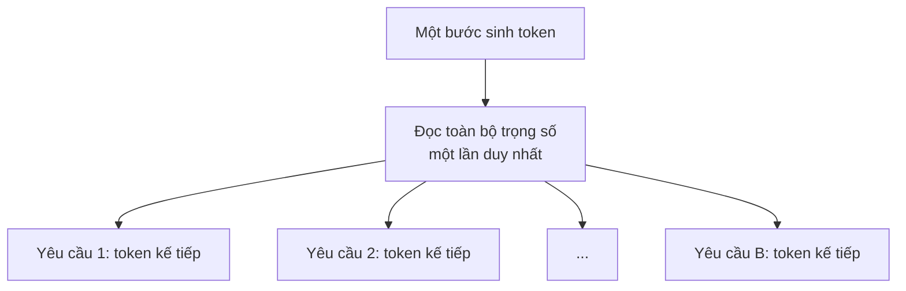

> **Mục tiêu bài học:** Sau bài này, bạn sẽ giải thích được vì sao chạy nhiều yêu cầu cùng lúc làm thông lượng tăng gần như miễn phí - cho tới một vùng ước lượng trước được - đo được cái giá của nó bằng độ trễ và bộ nhớ, và thấy vì sao cách gộp lô đơn giản nhất lại lãng phí gần một nửa công sức khi các yêu cầu dài ngắn khác nhau.

Bài 01 để lại một con số khó chịu: khi sinh token ở batch 1, card chạy ở **0,65% khả năng tính toán**. Nó không bận tính - nó bận khiêng 3,087 GB trọng số từ bộ nhớ về, 58 lần mỗi giây.

Nếu đằng nào cũng phải khiêng trọng số về, sao không dùng mỗi chuyến khiêng cho nhiều người?

## 1. Một chuyến khiêng, nhiều người dùng chung

Khi sinh token cho **một** yêu cầu, mỗi bước phải đọc toàn bộ trọng số để làm $2P$ phép toán. Khi sinh cho **$B$** yêu cầu cùng lúc, mỗi bước **vẫn đọc trọng số đúng một lần** - vì cả $B$ yêu cầu dùng chung một bộ trọng số - nhưng làm $2PB$ phép toán.



Nên mật độ tính toán ở bài 01 đổi từ $1$ thành xấp xỉ $B$:

$$\text{mật độ khi sinh ở batch } B \approx \frac{2PB}{2P} = B \text{ FLOP/byte}$$

Và bài 01 đã đo điểm cân bằng của card này: **86,8 FLOP/byte**. Vậy mô hình đường trần bậc một cho một dự đoán kiểm được: **quanh vùng batch 87 là chỗ chuyển tiếp - dưới vùng ấy, mỗi bước sinh tốn gần như cùng một thời gian**, vì nút thắt là đọc trọng số chứ không phải tính. Vượt quá mức ấy thì phần tính toán mới bắt đầu đáng kể, và mỗi bước phải chậm đi.

Phép tính trên bỏ qua một khoản: mỗi yêu cầu còn phải đọc **KV cache của chính nó**, khoản này tăng theo $B$. Script đo tính cả khoản đó vào số byte.

## 2. Đo: quét batch từ 1 tới 128

Cùng mô hình và cùng card với bài 01 - Qwen2.5-1.5B-Instruct, bfloat16, RTX 3060 - để hai bảng so thẳng được với nhau. Mỗi yêu cầu có prompt 128 token, sinh 128 token. Các prompt khác nhau nhưng **cùng độ dài**, nên không phải đệm.

Một thay đổi so với bài 01: mỗi lượt chạy xuôi chỉ tính logits cho **vị trí cuối cùng** (`logits_to_keep=1`). Đó chính là bài học ở bài 02 - logits cho mọi vị trí lớn gấp 10,6 lần KV cache - áp vào thực tế.

| Batch | TTFT (s) | TPOT (ms) | Tốc độ mỗi yêu cầu (tok/s) | **Thông lượng (tok/s)** | VRAM đỉnh (GiB) | Mật độ ước lượng (FLOP/byte) | % trần tính toán | % trần băng thông, ước lượng |
|---|---|---|---|---|---|---|---|---|
| 1 | 0,044 | 20,57 | 48,6 | **48,6** | 2,90 | 1,0 | 0,54% | 47,2% |
| 2 | 0,040 | 18,14 | 55,1 | **110,3** | 2,91 | 2,0 | 1,23% | 53,7% |
| 4 | 0,071 | 18,51 | 54,0 | **216,1** | 2,93 | 4,0 | 2,41% | 52,8% |
| 8 | 0,133 | 18,07 | 55,4 | **442,8** | 2,98 | 7,9 | 4,95% | 54,5% |
| 16 | 0,285 | 19,28 | 51,9 | **830,0** | 3,07 | 15,6 | 9,27% | 51,8% |
| 32 | 0,511 | 20,83 | 48,0 | **1.536,1** | 3,25 | 30,3 | 17,16% | 49,2% |
| 64 | 1,007 | 22,59 | 44,3 | **2.832,9** | 3,61 | 57,4 | 31,66% | 47,8% |
| 128 | 2,010 | **33,06** | 30,3 | **3.872,3** | 4,33 | **104,2** | 43,27% | 36,0% |

Dạng đường cong, thông lượng theo batch (mỗi ô ≈ 200 tok/s):

```
batch   thông lượng (tok/s)                    TPOT (ms)
   1    ▏                        49            20,6
   2    ▌                       110            18,1
   4    █                       216            18,5
   8    ██                      443            18,1
  16    ████                    830            19,3
  32    ████████              1.536            20,8
  64    ██████████████        2.833            22,6
 128    ███████████████████   3.872            33,1   ← TPOT nhảy
```

> ⚠️ **Hai cột phần trăm trần là ước lượng bậc một**, như ở bài 01: tính từ số phép toán và số byte trọng số cộng KV cache, không phải bộ đếm phần cứng.

> ⚠️ **Điều kiện đo.** GPU dùng để đo chỉ có tiến trình của bài này. Nhưng máy chủ dùng chung, và trong lúc đo có một tiến trình khác chiếm khoảng 19 trên 20 nhân CPU. Vòng lặp sinh token ở đây quay lại Python sau mỗi bước, nên nó nhạy với CPU bận: TPOT ở batch 1 là **20,57 ms**, chậm hơn con số **17,2-17,8 ms** ở bài 01 trên cùng card, và batch 1 còn chậm hơn batch 2. Tôi đọc bảng này theo **hình dạng** và **tỉ lệ giữa các dòng**, không đọc theo số mili-giây tuyệt đối.

## 3. Ba vùng của đường cong

**Vùng một, batch 1 tới 64: gần như miễn phí.** Thông lượng tăng **58 lần**, từ 48,6 lên 2.832,9 tok/s. Trong khi đó TPOT chỉ tăng từ khoảng 18 lên 22,6 ms. Phần trăm trần băng thông gần như đứng yên quanh 48-54% - card vẫn đang bận đúng một việc là đọc trọng số, chỉ có điều giờ mỗi lần đọc phục vụ được 64 người thay vì một.

**Vùng hai, quanh batch 128: đường cong gãy.** Ở batch 128, mật độ tính toán lên **104,2 FLOP/byte** - lần đầu tiên **vượt** điểm cân bằng 86,8 mà bài 01 đo được. Và đúng ở chỗ ấy:

- TPOT nhảy từ **22,6 lên 33,1 ms** - tăng 46% chỉ trong một lần nhân đôi batch, trong khi sáu lần nhân đôi trước đó cộng lại chỉ tăng khoảng 10%.
- Phần trăm trần băng thông **tụt** từ 47,8% xuống 36,0%, còn phần trăm trần tính toán **lên** 43,3%.

Bài 01 kết thúc bằng lời hứa: *"batch lớn đẩy cả pha sinh token vượt qua chính ranh giới này, lúc ấy mọi trực giác từ bài này phải đo lại."* Đây là chỗ nó xảy ra, và nó xảy ra **trong vùng mà điểm cân bằng dự đoán** - giữa 64 và 128. Mô hình đường trần dự đoán đúng **vùng**, không phải một batch chính xác: nó bỏ qua lưu lượng KV, hoạt hóa và chi phí của vòng lặp.

Nói cho chặt: 43,3% trần tính toán **chưa** phải là chạm trần. Điều bảng cho thấy là pha sinh token đã **ra khỏi vùng chỉ bị băng thông chi phối** - phần tính toán giờ đủ lớn để kéo dài mỗi bước. Không phải "giờ nó nghẽn tính toán" theo nghĩa tuyệt đối.

**Vùng ba, sau đó: lợi suất giảm dần.** Từ batch 64 lên 128, số yêu cầu gấp đôi nhưng thông lượng chỉ tăng **37%**, từ 2.833 lên 3.872. Bạn trả giá gấp đôi về độ trễ nạp prompt và bộ nhớ để lấy thêm hơn một phần ba.

> 🔧 **Thử ngay:** trước khi đo, bạn có đoán được batch nào sẽ làm TPOT bắt đầu tăng rõ không?
> Được, nếu có hai con số: điểm cân bằng của card và mật độ tính toán theo batch. Với card này điểm cân bằng là 86,8 FLOP/byte, còn mật độ khi sinh token xấp xỉ bằng batch - nên mô hình đường trần ước lượng vùng chuyển tiếp quanh batch 87. Bảng cho thấy TPOT còn gần phẳng ở 64 và nhảy ở 128. Một phép chia hai con số đo ở bài 01 đã khoanh được vùng mà một lần quét tám điểm mới xác nhận. Trên card có điểm cân bằng khác - ví dụ CPU ở bài 01, chỉ 21,6 FLOP/byte - chỗ gãy sẽ đến sớm hơn nhiều.

## 4. Cái giá: độ trễ và bộ nhớ

Thông lượng tăng không phải là quà. Nó được trả bằng hai thứ.

**Độ trễ tới token đầu tăng tuyến tính theo batch.** TTFT đi từ **0,044 giây** ở batch 1 lên **2,01 giây** ở batch 128. Lý do: ở gộp lô tĩnh, cả lô được nạp prompt **cùng lúc**, nên pha nạp phải xử lý $B \times 128$ token trước khi bất kỳ ai nhận được chữ đầu tiên. Người dùng ở batch 128 nhìn màn hình trống hai giây.

**Tốc độ gõ chữ của từng người giảm.** Mỗi yêu cầu nhận **55 tok/s** ở batch 8 nhưng chỉ **30,3 tok/s** ở batch 128. Thông lượng của **hệ** tăng, trải nghiệm của **từng người** giảm. Hai con số này không mâu thuẫn - chúng đo hai thứ khác nhau, và bài 07 sẽ dựng cả một bài về việc chọn giữa chúng.

**Bộ nhớ tăng, nhưng ít hơn bạn tưởng.** VRAM đỉnh chỉ đi từ 2,90 lên 4,33 GiB khi batch tăng 128 lần. Hai lý do. Một, trọng số - phần lớn nhất - không nhân theo batch. Hai, lượt chạy xuôi chỉ giữ logits của vị trí cuối: nếu giữ logits cho mọi vị trí như ở bài 02, riêng khoản ấy ở batch 128 với prompt 128 token đã là $128 \times 128 \times 296{,}8$ KiB ≈ **4,6 GiB**, gấp đôi toàn bộ phần tăng thêm trong bảng. Phần tăng thật chủ yếu là **KV cache**, đúng công thức bài 02: $128$ yêu cầu $\times$ $256$ token $\times$ $28$ KiB ≈ **0,9 GiB** ở cuối lượt sinh.

## 5. Yêu cầu chậm nhất giữ cả lô lại

Tới đây mọi yêu cầu đều sinh đúng 128 token. Thực tế thì không: người hỏi "thủ đô Pháp là gì" cần 5 token, người nhờ viết email cần 500.

Gộp lô tĩnh có một quy tắc: **thành phần lô cố định từ đầu tới cuối** - chỗ của một yêu cầu đã xong không được trao cho yêu cầu mới cho tới khi cả lô kết thúc. Yêu cầu nào xong sớm thì ô của nó cứ chạy không, sinh ra token vứt đi. Bộ gộp lô tự viết của bài này còn thêm một chính sách nữa: **trả kết quả cả lô một lượt khi lô xong**. Chính sách thứ hai không bắt buộc - một bộ gộp lô tĩnh có thể trả sớm kết quả của yêu cầu đã xong - nhưng nó hay gặp ở cách viết đơn giản, và phép đo dưới đây chịu cả hai.

Đo trực tiếp: một lô 16 yêu cầu, **8 yêu cầu cần 32 token** và **8 yêu cầu cần 256 token**.

| | Giá trị |
|---|---|
| Token thực sự cần | 8 × 32 + 8 × 256 = **2.304** |
| Ô tính toán đã dùng | 16 × 256 = **4.096** |
| **Lãng phí** | **43,8%** |
| E2E của một yêu cầu ngắn **trong lô tĩnh** | **5,722 s** |
| E2E của cùng yêu cầu ấy **nếu 8 yêu cầu ngắn chạy riêng một lô** | **0,817 s** |
| Yêu cầu ngắn bị chậm đi | **7,0 lần** |

Gần một nửa công sức của card đi vào những ô không ai cần. Và với chính sách trả cả lô ở cuối, người hỏi câu ngắn phải chờ gấp **bảy lần** thời gian cần thiết, chỉ vì họ tình cờ nằm cùng lô với người hỏi câu dài. Nếu bộ gộp lô trả sớm, con số bảy lần sẽ nhỏ đi - nhưng ô bỏ không vẫn nguyên đó: chỗ đã trống không được dùng cho ai tới hết lô.

Phép đo này có một khe hở cần nói ra: con số 43,8% phụ thuộc hoàn toàn vào **tỉ lệ dài ngắn** của tải. Tải thật có thể lãng phí ít hơn nhiều hoặc nhiều hơn nhiều. Điều không phụ thuộc vào tải là **cơ chế**: chừng nào chỗ trống trong lô không được tái sử dụng cho tới khi thành viên chậm nhất xong, thì mọi chênh lệch độ dài đều thành ô bỏ không.

Cách chữa hiển nhiên là: **yêu cầu nào xong thì cho ra ngay, rồi nhét yêu cầu mới vào chỗ trống, ngay giữa chừng.** Đó là bài 06.

## 6. Chọn batch thế nào

Bảng ở mục 2 dễ dẫn tới một kết luận sai: "batch 128 cho thông lượng cao nhất, vậy dùng 128."

Kết luận ấy đúng nếu thước đo duy nhất là **token trên giây trên mỗi đồng tiền phần cứng** - ví dụ một tác vụ chạy đêm, xử lý hàng loạt tài liệu, không ai ngồi chờ. Nó sai nếu có người ngồi trước màn hình: ở batch 128, người ấy chờ **2 giây** cho chữ đầu tiên và nhận **30 tok/s** sau đó.

Nên câu hỏi đúng không phải "batch nào nhanh nhất", mà là **"trong giới hạn độ trễ mà người dùng chấp nhận, batch lớn nhất là bao nhiêu"**. Nếu yêu cầu là TTFT dưới 0,5 giây, bảng này cho phép batch khoảng 32 - và bạn nhận 1.536 tok/s, chứ không phải 3.872. Đây cùng tinh thần với chương Machine Learning · Bài 12: chọn **điểm vận hành** theo chi phí của từng loại sai, thay vì tối ưu một con số.

> 🔧 **Thử ngay:** nhóm của bạn đặt batch 128 để "tận dụng GPU", và người dùng phàn nàn trợ lý "đơ" lúc đầu mỗi câu. Bạn giải thích và đề xuất gì?
> Họ đang gặp đúng cột TTFT: ở gộp lô tĩnh, cả lô 128 yêu cầu phải nạp prompt xong mới ai nhận được chữ đầu, nên TTFT là 2 giây. GPU không chậm - nó đang làm đúng việc được giao. Đề xuất có hai tầng. Ngắn hạn: hạ batch xuống mức mà TTFT còn nằm trong giới hạn chấp nhận, chấp nhận thông lượng thấp hơn. Dài hạn: bỏ gộp lô tĩnh - vì vấn đề thật không phải con số 128 mà là việc cả lô phải đi cùng nhau, cả lúc nạp lẫn lúc chờ thằng chậm nhất.

## Tóm tắt bài học

- Gộp $B$ yêu cầu vào một bước sinh token thì trọng số **vẫn chỉ đọc một lần** cho cả $B$ người, nên mật độ tính toán tăng từ 1 lên xấp xỉ $B$ FLOP/byte.
- Kết hợp với điểm cân bằng 86,8 FLOP/byte của card (bài 01), điều đó cho một **dự đoán kiểm được**: TPOT gần như phẳng tới khoảng batch 87, rồi mới tăng rõ.
- Đo trên Qwen2.5-1.5B / RTX 3060: thông lượng tăng **58 lần** từ batch 1 tới 64 (48,6 → 2.832,9 tok/s) trong khi TPOT chỉ tăng khoảng 10%. Ở batch **128**, mật độ lên **104,2 FLOP/byte** - vượt điểm cân bằng - và TPOT nhảy **46%** (22,6 → 33,1 ms). Dự đoán đúng vùng - giữa 64 và 128 - không phải một batch chính xác.
- Vượt điểm cân bằng nghĩa là **ra khỏi vùng chỉ bị băng thông chi phối**, chưa phải chạm trần tính toán: ở batch 128 card mới dùng 43,3% trần tính toán.
- Lợi suất giảm dần: batch 64 → 128 gấp đôi số yêu cầu nhưng chỉ thêm **37%** thông lượng.
- Cái giá: TTFT tăng **tuyến tính** theo batch (0,044 → 2,01 s), và tốc độ mỗi người giảm (55 → 30,3 tok/s). Thông lượng của **hệ** và trải nghiệm của **từng người** là hai thước đo khác nhau.
- Bộ nhớ tăng ít (2,90 → 4,33 GiB) nhờ chỉ giữ logits vị trí cuối - nếu không, riêng logits ở batch 128 đã khoảng 4,6 GiB.
- Gộp lô tĩnh **không tái dùng chỗ trống cho tới hết lô**: với 8 yêu cầu 32 token và 8 yêu cầu 256 token, **43,8%** ô tính toán bị bỏ không, và với chính sách trả cả lô ở cuối của bài, yêu cầu ngắn chậm đi **7,0 lần**. Con số lãng phí phụ thuộc tải; cơ chế thì không.
- Chọn batch theo **giới hạn độ trễ chấp nhận được**, không theo thông lượng cao nhất.

## Câu hỏi tự kiểm tra

1. Vì sao gộp nhiều yêu cầu vào một bước sinh token không làm số byte trọng số phải đọc tăng lên?
2. Card A có điểm cân bằng 50 FLOP/byte, card B là 200 FLOP/byte. Trên card nào thì gộp lô "miễn phí" được lâu hơn, và vì sao?
3. Ở batch 128, mật độ tính toán vượt điểm cân bằng nhưng card mới dùng 43,3% trần tính toán. Giải thích vì sao hai điều này không mâu thuẫn.
4. Vì sao TTFT tăng tuyến tính theo batch ở gộp lô tĩnh? Đề xuất một cách tổ chức pha nạp prompt để người dùng đầu tiên trong lô không phải chờ cả lô.
5. Nếu lượt chạy xuôi giữ logits cho mọi vị trí, bộ nhớ ở batch 128 thay đổi thế nào? Tính ra con số và so với bảng mục 2.
6. Một lô tĩnh 32 yêu cầu có 30 yêu cầu cần 20 token và 2 yêu cầu cần 1.000 token. Tính tỉ lệ ô tính toán bị lãng phí, và nói yêu cầu ngắn bị chậm đi khoảng bao nhiêu lần nếu lô chỉ trả kết quả khi xong cả lô.
7. Một tác vụ tóm tắt 1 triệu tài liệu chạy qua đêm và một trợ lý hỏi đáp có người ngồi chờ. Bạn chọn batch cho hai trường hợp theo tiêu chí nào?
8. TPOT ở batch 1 trong bài này chậm hơn bài 01 trên cùng card. Nêu nguyên nhân hợp lý mà bài đưa ra, và một phép đo để kiểm chứng nó.

## Đọc thêm

**Nguồn nền tảng của bài:**

| Nguồn | Đọc phần nào |
|---|---|
| **Bài 01 của chương này** | Mật độ tính toán, điểm cân bằng 86,8 FLOP/byte, và lời hứa về batch lớn |
| **Bài 02 của chương này** | Logits lớn gấp 10,6 lần KV cache - lý do dùng `logits_to_keep=1` |
| **Chương Machine Learning · Bài 12** | Chọn điểm vận hành theo chi phí thay vì tối ưu một con số |

**Đi sâu hơn:**

- [Pope et al. - Efficiently Scaling Transformer Inference (MLSys 2023)](https://arxiv.org/abs/2211.05102) - phân tích đánh đổi giữa độ trễ và thông lượng theo batch ở quy mô lớn.
- [Yu et al. - Orca: A Distributed Serving System for Transformer-Based Generative Models (OSDI 2022)](https://www.usenix.org/conference/osdi22/presentation/yu) - bài báo nêu vấn đề "cả lô chờ thằng chậm nhất" và đề xuất lập lịch theo từng bước; nền cho bài 06.
- [Williams, Waterman & Patterson - Roofline (CACM 2009)](https://dl.acm.org/doi/10.1145/1498765.1498785) - mô hình đường trần dùng để ước lượng vùng chuyển tiếp ở mục 3.

**Mã nguồn của bài:** [`code/b05_golo.py`](../../code/ai-systems/b05_golo.py) - quét batch, tính phần trăm trần, và đo lãng phí của thằng chậm nhất.

> **Bài tiếp theo:** [Gộp lô liên tục và KV cache dạng trang](../continuous-batching-and-paged-kv-memory-vi/) - yêu cầu ngắn chậm đi 7 lần vì phải chờ yêu cầu dài trong cùng lô. Bài sau thay luật "cả lô đi cùng nhau" bằng luật "ai xong thì ra, chỗ trống thì nhét người mới vào ngay", cho chạy cùng một tải qua vLLM - và tách cẩn thận xem bao nhiêu phần chênh lệch đến từ cách lập lịch, bao nhiêu đến từ những thứ khác trong bộ máy.
