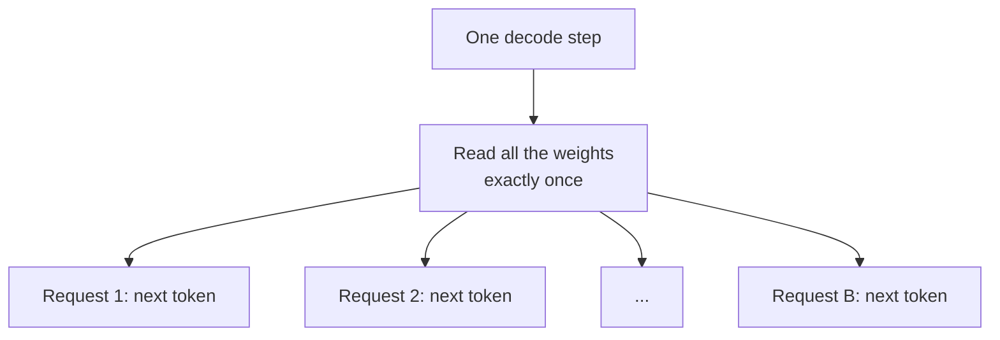

> **Learning objectives:** After this lesson, you will be able to explain why running many requests at once raises throughput almost for free - up to a region you can estimate in advance - measure its price in latency and memory, and see why the simplest form of batching wastes nearly half its work when requests differ in length.

Lesson 01 left us with an uncomfortable number: when generating tokens at batch 1, the card runs at **0.65% of its compute capacity**. It is not busy computing - it is busy hauling 3.087 GB of weights out of memory, 58 times per second.

If the weights have to be hauled in anyway, why not let each trip serve many people?

## 1. One trip, shared by many users

When generating tokens for **one** request, each step has to read all the weights to perform $2P$ operations. When generating for **$B$** requests at once, each step **still reads the weights exactly once** - because all $B$ requests share one set of weights - but performs $2PB$ operations.



So the arithmetic intensity from lesson 01 changes from $1$ to roughly $B$:

$$\text{intensity when decoding at batch } B \approx \frac{2PB}{2P} = B \text{ FLOP/byte}$$

And lesson 01 already measured this card's balance point: **86.8 FLOP/byte**. So the first-order roofline model gives a testable prediction: **the transition sits around batch 87 - below that region, each decode step takes almost the same time**, because the bottleneck is reading weights, not computing. Beyond that, the compute part starts to matter, and each step has to get slower.

The calculation above leaves out one item: each request also has to read **its own KV cache**, and that grows with $B$. The measurement script includes it in the byte count.

## 2. Measuring: sweeping batch from 1 to 128

Same model and same card as lesson 01 - Qwen2.5-1.5B-Instruct, bfloat16, RTX 3060 - so the two tables can be compared directly. Each request has a 128-token prompt and generates 128 tokens. The prompts are different but have **the same length**, so no padding is needed.

One change from lesson 01: each forward pass computes logits only for **the last position** (`logits_to_keep=1`). That is exactly the lesson of lesson 02 - logits for every position are 10.6 times larger than the KV cache - put into practice.

| Batch | TTFT (s) | TPOT (ms) | Speed per request (tok/s) | **Throughput (tok/s)** | Peak VRAM (GiB) | Estimated intensity (FLOP/byte) | % of compute ceiling | % of bandwidth ceiling, estimated |
|---|---|---|---|---|---|---|---|---|
| 1 | 0.044 | 20.57 | 48.6 | **48.6** | 2.90 | 1.0 | 0.54% | 47.2% |
| 2 | 0.040 | 18.14 | 55.1 | **110.3** | 2.91 | 2.0 | 1.23% | 53.7% |
| 4 | 0.071 | 18.51 | 54.0 | **216.1** | 2.93 | 4.0 | 2.41% | 52.8% |
| 8 | 0.133 | 18.07 | 55.4 | **442.8** | 2.98 | 7.9 | 4.95% | 54.5% |
| 16 | 0.285 | 19.28 | 51.9 | **830.0** | 3.07 | 15.6 | 9.27% | 51.8% |
| 32 | 0.511 | 20.83 | 48.0 | **1,536.1** | 3.25 | 30.3 | 17.16% | 49.2% |
| 64 | 1.007 | 22.59 | 44.3 | **2,832.9** | 3.61 | 57.4 | 31.66% | 47.8% |
| 128 | 2.010 | **33.06** | 30.3 | **3,872.3** | 4.33 | **104.2** | 43.27% | 36.0% |

As a curve, throughput by batch (each block ≈ 200 tok/s):

```
batch   throughput (tok/s)                     TPOT (ms)
   1    ▏                        49            20.6
   2    ▌                       110            18.1
   4    █                       216            18.5
   8    ██                      443            18.1
  16    ████                    830            19.3
  32    ████████              1,536            20.8
  64    ██████████████        2,833            22.6
 128    ███████████████████   3,872            33.1   ← TPOT jumps
```

> ⚠️ **The two ceiling-percentage columns are first-order estimates**, as in lesson 01: they are computed from the operation count and the bytes of weights plus KV cache, not from hardware counters.

> ⚠️ **Measurement conditions.** The GPU used for measurement ran only this lesson's process. But the server is shared, and during the measurement another process was using about 19 of the 20 CPU cores. The decode loop here returns to Python after every step, so it is sensitive to a busy CPU: TPOT at batch 1 is **20.57 ms**, slower than the **17.2-17.8 ms** in lesson 01 on the same card, and batch 1 is even slower than batch 2. I read this table by its **shape** and the **ratios between rows**, not by absolute milliseconds.

## 3. Three regions of the curve

**Region one, batch 1 to 64: almost free.** Throughput rises **58 times**, from 48.6 to 2,832.9 tok/s. Meanwhile TPOT only rises from about 18 to 22.6 ms. The bandwidth-ceiling percentage barely moves, staying around 48-54% - the card is still busy with exactly one job, reading weights, except that now each read serves 64 people instead of one.

**Region two, around batch 128: the curve bends.** At batch 128, arithmetic intensity reaches **104.2 FLOP/byte** - for the first time **exceeding** the balance point of 86.8 that lesson 01 measured. And right at that spot:

- TPOT jumps from **22.6 to 33.1 ms** - a 46% increase in a single doubling of the batch, whereas the six previous doublings combined added only about 10%.
- The bandwidth-ceiling percentage **drops** from 47.8% to 36.0%, while the compute-ceiling percentage **rises** to 43.3%.

Lesson 01 ended with a promise: *"a large batch pushes the decode phase past this very boundary, and then every intuition from this lesson has to be measured again."* This is where it happens, and it happens **within the region the balance point predicts** - between 64 and 128. The roofline model predicts the **region** correctly, not an exact batch: it ignores KV traffic, activations and the cost of the loop.

To be precise: 43.3% of the compute ceiling is **not yet** hitting the ceiling. What the table shows is that the decode phase has **left the region governed only by bandwidth** - the compute part is now large enough to lengthen each step. It is not "now it is compute-bound" in an absolute sense.

**Region three, beyond that: diminishing returns.** From batch 64 to 128, the number of requests doubles but throughput rises only **37%**, from 2,833 to 3,872. You pay double in prefill latency and memory to gain a little more than a third.

> 🔧 **Try it now:** before measuring, can you guess which batch will make TPOT start rising noticeably?
> Yes, if you have two numbers: the card's balance point and the arithmetic intensity as a function of batch. For this card the balance point is 86.8 FLOP/byte, and decode intensity is roughly equal to the batch - so the roofline model puts the transition around batch 87. The table shows TPOT still nearly flat at 64 and jumping at 128. One division of two numbers measured in lesson 01 already narrowed down the region that an eight-point sweep then confirmed. On a card with a different balance point - for example the CPU in lesson 01, only 21.6 FLOP/byte - the bend would come much earlier.

## 4. The price: latency and memory

Higher throughput is not a gift. It is paid for with two things.

**Time to first token grows linearly with batch.** TTFT goes from **0.044 seconds** at batch 1 to **2.01 seconds** at batch 128. The reason: in static batching, the whole batch is prefilled **at the same time**, so the prefill phase has to process $B \times 128$ tokens before anyone receives the first word. A user at batch 128 stares at a blank screen for two seconds.

**Each person's typing speed drops.** Each request gets **55 tok/s** at batch 8 but only **30.3 tok/s** at batch 128. The **system's** throughput rises, while **each person's** experience worsens. These two numbers do not contradict each other - they measure two different things, and lesson 07 builds a whole lesson around choosing between them.

**Memory grows, but less than you might think.** Peak VRAM only goes from 2.90 to 4.33 GiB while the batch grows 128 times. Two reasons. First, the weights - the largest part - do not multiply with batch. Second, the forward pass keeps only the logits of the last position: if it kept logits for every position as in lesson 02, that item alone at batch 128 with 128-token prompts would be $128 \times 128 \times 296.8$ KiB ≈ **4.6 GiB**, twice the entire increase in the table. The real increase is mostly the **KV cache**, exactly per the formula from lesson 02: $128$ requests $\times$ $256$ tokens $\times$ $28$ KiB ≈ **0.9 GiB** at the end of generation.

## 5. The slowest request holds up the whole batch

So far every request has generated exactly 128 tokens. Reality is different: someone asking "what is the capital of France" needs 5 tokens, someone asking for an email needs 500.

Static batching has one rule: **the batch's membership is fixed from start to finish** - the slot of a finished request is not given to a new request until the whole batch ends. A request that finishes early keeps its slot running idle, producing tokens that get thrown away. The hand-written batcher in this lesson adds one more policy: **return results for the whole batch at once when the batch is done**. The second policy is not mandatory - a static batcher could return results of finished requests early - but it is common in simple implementations, and the measurement below is subject to both.

Measured directly: a batch of 16 requests, **8 requests needing 32 tokens** and **8 requests needing 256 tokens**.

| | Value |
|---|---|
| Tokens actually needed | 8 × 32 + 8 × 256 = **2,304** |
| Compute slots used | 16 × 256 = **4,096** |
| **Waste** | **43.8%** |
| E2E of a short request **in the static batch** | **5.722 s** |
| E2E of the same request **if the 8 short requests ran as their own batch** | **0.817 s** |
| Slowdown of the short request | **7.0 times** |

Nearly half of the card's work goes into slots nobody needs. And with the policy of returning the whole batch at the end, the person asking a short question waits **seven times** as long as necessary, just because they happened to land in the same batch as someone asking a long one. If the batcher returned results early, the factor of seven would shrink - but the idle slots would remain: a freed slot is not used by anyone until the batch ends.

This measurement has a gap worth stating: the 43.8% figure depends entirely on the **mix of long and short requests** in the load. Real load could waste far less or far more. What does not depend on the load is the **mechanism**: as long as free slots in a batch are not reused until the slowest member finishes, every difference in length turns into idle slots.

The obvious fix: **let each request leave as soon as it finishes, then slot a new request into the gap, right in the middle.** That is lesson 06.

## 6. How to choose the batch

The table in section 2 easily leads to a wrong conclusion: "batch 128 gives the highest throughput, so use 128."

That conclusion is right if the only metric is **tokens per second per unit of hardware cost** - for example an overnight job processing documents in bulk, with nobody waiting. It is wrong if someone is sitting in front of a screen: at batch 128, that person waits **2 seconds** for the first word and receives **30 tok/s** after that.

So the right question is not "which batch is fastest", but **"within the latency limit users accept, what is the largest batch"**. If the requirement is TTFT under 0.5 seconds, this table allows a batch of about 32 - and you get 1,536 tok/s, not 3,872. This is the same spirit as Machine Learning · Lesson 12: choose an **operating point** based on the cost of each kind of error, instead of optimizing a single number.

> 🔧 **Try it now:** your team sets batch 128 to "make full use of the GPU", and users complain that the assistant "freezes" at the start of every answer. What do you explain and propose?
> They are running into exactly the TTFT column: in static batching, all 128 requests in the batch must finish prefill before anyone receives the first word, so TTFT is 2 seconds. The GPU is not slow - it is doing exactly the job it was given. The proposal has two levels. Short term: lower the batch to a level where TTFT stays within the acceptable limit, accepting lower throughput. Long term: drop static batching - because the real problem is not the number 128 but the fact that the whole batch has to move together, both during prefill and while waiting for the slowest member.

## Lesson summary

- Batching $B$ requests into one decode step means the weights are **still read only once** for all $B$ people, so arithmetic intensity rises from 1 to roughly $B$ FLOP/byte.
- Combined with the card's balance point of 86.8 FLOP/byte (lesson 01), this gives a **testable prediction**: TPOT stays nearly flat up to about batch 87, and only then rises noticeably.
- Measured on Qwen2.5-1.5B / RTX 3060: throughput rises **58 times** from batch 1 to 64 (48.6 → 2,832.9 tok/s) while TPOT rises only about 10%. At batch **128**, intensity reaches **104.2 FLOP/byte** - past the balance point - and TPOT jumps **46%** (22.6 → 33.1 ms). The prediction gets the region right - between 64 and 128 - not an exact batch.
- Passing the balance point means **leaving the region governed only by bandwidth**, not hitting the compute ceiling: at batch 128 the card uses only 43.3% of its compute ceiling.
- Diminishing returns: batch 64 → 128 doubles the number of requests but adds only **37%** throughput.
- The price: TTFT grows **linearly** with batch (0.044 → 2.01 s), and per-person speed drops (55 → 30.3 tok/s). **System** throughput and **individual** experience are two different metrics.
- Memory grows only a little (2.90 → 4.33 GiB) thanks to keeping only last-position logits - otherwise, logits alone at batch 128 would be about 4.6 GiB.
- Static batching **does not reuse free slots until the batch ends**: with 8 requests of 32 tokens and 8 requests of 256 tokens, **43.8%** of compute slots sit idle, and with this lesson's policy of returning the whole batch at the end, short requests are slowed **7.0 times**. The waste figure depends on the load; the mechanism does not.
- Choose the batch by the **acceptable latency limit**, not by the highest throughput.

## Self-check questions

1. Why does batching several requests into one decode step not increase the number of weight bytes that must be read?
2. Card A has a balance point of 50 FLOP/byte, card B 200 FLOP/byte. On which card does batching stay "free" for longer, and why?
3. At batch 128, arithmetic intensity exceeds the balance point but the card uses only 43.3% of its compute ceiling. Explain why these two facts do not contradict each other.
4. Why does TTFT grow linearly with batch in static batching? Propose a way to organize the prefill phase so the first user in the batch does not have to wait for the whole batch.
5. If the forward pass kept logits for every position, how would memory at batch 128 change? Compute the number and compare it with the table in section 2.
6. A static batch of 32 requests has 30 requests needing 20 tokens and 2 requests needing 1,000 tokens. Compute the fraction of wasted compute slots, and say roughly how many times slower the short requests become if the batch returns results only when the whole batch is done.
7. An overnight job summarizing 1 million documents and a Q&A assistant with someone waiting. By what criterion do you choose the batch in each case?
8. TPOT at batch 1 in this lesson is slower than in lesson 01 on the same card. State the plausible cause the lesson gives, and a measurement to verify it.

## Further reading

**Foundational sources for this lesson:**

| Source | What to read |
|---|---|
| **Lesson 01 of this chapter** | Arithmetic intensity, the balance point of 86.8 FLOP/byte, and the promise about large batches |
| **Lesson 02 of this chapter** | Logits are 10.6 times larger than the KV cache - the reason for `logits_to_keep=1` |
| **Machine Learning chapter · Lesson 12** | Choosing an operating point by cost instead of optimizing a single number |

**Going further:**

- [Pope et al. - Efficiently Scaling Transformer Inference (MLSys 2023)](https://arxiv.org/abs/2211.05102) - analysis of the latency-throughput trade-off by batch at large scale.
- [Yu et al. - Orca: A Distributed Serving System for Transformer-Based Generative Models (OSDI 2022)](https://www.usenix.org/conference/osdi22/presentation/yu) - the paper that raises the "whole batch waits for the slowest member" problem and proposes per-step scheduling; the basis for lesson 06.
- [Williams, Waterman & Patterson - Roofline (CACM 2009)](https://dl.acm.org/doi/10.1145/1498765.1498785) - the roofline model used to estimate the transition region in section 3.

**Source code for this lesson:** [`code/b05_golo.py`](../../code/ai-systems/b05_golo.py) - sweeps the batch, computes ceiling percentages, and measures the waste caused by the slowest member.

> **Next lesson:** [Continuous Batching and Paged KV Cache](../continuous-batching-and-paged-kv-memory/) - short requests are slowed 7 times because they wait for long requests in the same batch. The next lesson replaces the rule "the whole batch moves together" with "whoever finishes leaves, and a free slot is filled with a new request right away", runs the same load through vLLM - and carefully separates how much of the gap comes from scheduling and how much from other parts of the machinery.
