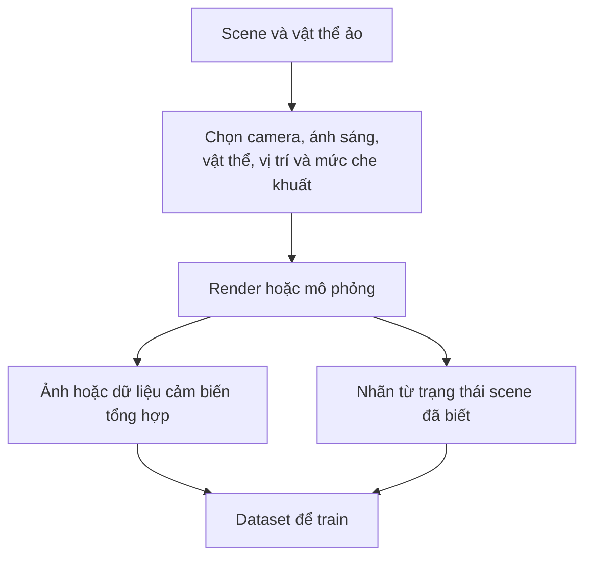
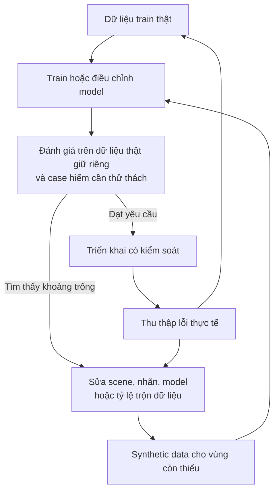

Một model cần học những tình huống hiếm, nhưng chính vì chúng hiếm nên gần như không có dữ liệu để train. **Synthetic data** đảo ngược câu hỏi: thay vì chờ thế giới tạo đủ ví dụ, liệu ta có thể chủ động tạo ra một phần những tình huống model cần được nhìn thấy?

Giả sử bạn xây hệ thống phát hiện lỗi pin. Ảnh sản phẩm bình thường thì rất nhiều. Nhưng pin nứt nghiêm trọng, biến dạng, góc camera lạ hay bị che một phần lại hiếm. Điều đó tốt cho nhà máy, nhưng trớ trêu với machine learning: những case quan trọng nhất đôi khi có ít ví dụ nhất.

[Bài Domain Shift trước](../domain-shift-when-production-looks-different-vi/) cho thấy production có thể khác xa test set sạch đẹp. Synthetic data là một cách mở rộng những điều kiện model thấy khi phát triển. Bản thân nó không xóa được khoảng cách ấy.

## 1. Synthetic data là gì?

Synthetic data là dữ liệu được tạo nhân tạo, thay vì thu trực tiếp từ quá trình ngoài đời mà hệ thống sẽ phục vụ. Trong bài này, ta tập trung vào ảnh, video và dữ liệu cảm biến hoặc robot. Dữ liệu có thể đến từ trình dựng 3D, physics simulator, game engine hoặc generative model.

Ví dụ, ta đặt một chiếc forklift ảo trong nhà kho ảo rồi quan sát bằng camera ảo. Thay đổi ánh sáng, góc camera, vị trí forklift, background và mức che khuất sẽ tạo ra những scene mà ngoài đời có thể mất nhiều tháng mới thu được, hoặc không nên cố dựng vì nguy hiểm. [NVIDIA Isaac Sim](https://developer.nvidia.com/isaac/sim/) là một nền tảng hỗ trợ mô phỏng và tạo synthetic data có kiểm soát cho robotics.

Điểm hay không chỉ là "có thêm ảnh", mà là có thể chỉ định **điều kiện nào** những ảnh mới phải bao phủ.

## 2. Nó khác data augmentation ở đâu?

**Augmentation** thường biến đổi một mẫu ảnh thật đã có: crop, blur, xoay hoặc chỉnh độ sáng. **Synthetic generation** có thể dựng một scene mới, chẳng hạn forklift bị pallet che một phần, dưới một camera gắn ở độ cao khác.

| Cách làm | Bắt đầu từ | Kết quả thường gặp |
| --- | --- | --- |
| Augmentation | Ảnh thật đã có | Phiên bản biến đổi của ảnh đó |
| Synthetic generation | Scene, mô phỏng hoặc generative model | Mẫu dữ liệu mới được tạo ra |

Ranh giới không tuyệt đối. Một vết lỗi được tạo bằng AI rồi ghép vào ảnh thật kết hợp cả hai ý tưởng. Điểm thực tế là phương pháp ấy có giúp bao phủ **tình huống còn thiếu**, thay vì chỉ đổi pixel trên ảnh cũ, hay không.

## 3. Mô phỏng có thể tạo cả nhãn

Với ảnh thật, con người có thể phải vẽ bounding box hoặc segmentation mask. Trong simulator, hệ thống đã biết vật thể nào ở đâu. Nhờ vậy, một scene có thể tạo đồng thời ảnh cùng bounding box, mask, depth hoặc tư thế vật thể.

[Tài liệu Isaac Sim](https://developer.nvidia.com/isaac/sim/) liệt kê các annotator cho RGB, bounding box, instance segmentation và semantic segmentation, với khả năng export theo format như COCO và KITTI. Điều này giảm công gán nhãn thủ công, nhưng scene và nhãn tạo ra vẫn cần kiểm tra. Một mô hình 3D sai, góc camera sai hoặc mapping class sai có thể tạo ra hàng loạt nhãn sai giống nhau.

## 4. Giá trị lớn nhất thường nằm ở những ô dữ liệu còn thiếu

Giả sử camera an toàn trong nhà kho đã ghi hàng triệu frame vận hành bình thường nhưng chỉ có rất ít ví dụ công nhân đứng gần forklift đang lùi. Mô phỏng có thể thay đổi vị trí người, tốc độ forklift, ánh sáng, góc camera và mức che khuất mà không phải dàn dựng tình huống nguy hiểm với người thật.

Điều đó **không có nghĩa** train trên tình huống suýt va chạm trong mô phỏng là đủ để hệ thống an toàn khi deploy. Nó cho team thêm các case thử thách và ví dụ train tiềm năng vốn khó thu thập. Hệ thống vẫn cần validation ngoài đời và các lớp bảo vệ an toàn.

[NVIDIA từng công bố một demo nhận biết forklift](https://developer.nvidia.com/blog/generating-synthetic-datasets-isaac-sim-data-replicator/) tạo hơn 90.000 ảnh tổng hợp bằng cách thay đổi mẫu forklift, ánh sáng, vị trí camera và các vật thể khác trong scene. Bài học hữu ích là khả năng kiểm soát độ bao phủ, **không phải** 90.000 là con số chuẩn hay một demo đủ chứng minh độ tin cậy trong mọi nhà kho.

## 5. Synthetic data có thể tạo ra một domain shift mới

Simulator có thể có hình học sạch, ánh sáng lý tưởng và vật liệu dễ đoán. Nhà kho thật có vết xước, bụi, motion blur, phản chiếu, nhiễu cảm biến và hành vi con người mà simulator chưa nghĩ tới.

Vì vậy model có thể đạt điểm cao trên ảnh synthetic rồi thất bại trên ảnh thật. Đó là **sim-to-real gap**, một dạng của [bài toán domain shift](../domain-shift-when-production-looks-different-vi/) ở bài trước. Trong một [nghiên cứu về robot điều hướng của Google Research](https://research.google/pubs/sim-to-real-transfer-for-vision-and-language-navigation/), tỷ lệ thành công trong mô phỏng khác robot thật; domain randomization giúp giảm khác biệt thị giác, nhưng việc chuyển sang thực tế vẫn khó ở cấu hình khắt khe nhất.

Một cách ứng phó là **domain randomization**: thay đổi texture, ánh sáng, vị trí vật thể, thiết lập camera hoặc tham số vật lý để model không bám vào một thế giới ảo quá hoàn hảo. Tăng độ giống ảnh thật cũng có thể giúp, nhưng vẻ đẹp hình ảnh không phải mục tiêu cuối. Một vết nứt được tạo trông rất thật vẫn vô ích nếu kiểu nứt ấy không thể xuất hiện trên dây chuyền.

Cần phân biệt **trông giống ảnh thật** với **đại diện đúng điều kiện cần triển khai**. Hiểu biết của kỹ sư về vị trí lỗi, hình dạng, tần suất và những tổ hợp khả thi về mặt vật lý quan trọng không kém chất lượng render.

## 6. Generative model mở thêm lựa chọn, nhưng cũng tăng việc kiểm tra

Không phải synthetic data nào cũng đến từ 3D simulation. Generative model tạo ảnh hoặc video có thể sinh thêm biến thể bề mặt, lỗi sản phẩm, background và tình huống. Nó có thể hữu ích khi chưa có đủ asset 3D chi tiết.

Tuy nhiên, ảnh sinh ra có thể thuyết phục bằng mắt nhưng sai quy luật vật lý hoặc quy trình sản xuất. Vết lỗi có thể sai hình dạng, vị trí hay nhãn. Camera mô phỏng có thể thiếu một loại nhiễu quan trọng của camera thật. Với dữ liệu sinh, team phải kiểm tra **cả scene lẫn nhãn**, chứ không chỉ hỏi ảnh có "trông thật" không.

Điều này đặc biệt quan trọng khi tạo dữ liệu cho class hiếm. Hàng nghìn ảnh "lỗi" không giống lỗi ngoài đời có thể dạy model ranh giới sai một cách rất hiệu quả.

## 7. Dữ liệu thật vẫn phải là mốc kiểm chứng

Cách làm thực tế thường kết hợp dữ liệu train thật và synthetic, rồi đánh giá trên **test set thật được giữ riêng**, phản ánh điều kiện deploy dự kiến. Nên có các lát cắt thử thách cho case hiếm, đồng thời đo cả tần suất bình thường của production: cố ý tăng số tình huống nguy hiểm trong training không được khiến báo động nhầm trở nên quá nhiều khi vận hành thường ngày.

Nếu camera thật tạo ra một nhiễu mà simulator chưa có, failure đó rất có giá trị. Nó vừa trở thành một ví dụ thật mới, vừa mô tả thứ generator đang thiếu. Thế giới thật không chỉ cấp ảnh để train; nó còn là tín hiệu giúp sửa lại thế giới synthetic.

## 8. Thiết kế độ bao phủ, không chạy theo số lượng

Nếu đã có một triệu ảnh bình thường, thêm một triệu ảnh synthetic cũng bình thường có thể không giúp nhiều. Vài nghìn ảnh về lỗi hiếm dưới ánh sáng yếu có thể giá trị hơn, miễn là chúng giống case thật và giúp cải thiện kết quả đánh giá ngoài đời.

Hãy bắt đầu bằng một ma trận độ bao phủ:

| Tình huống | Sáng | Tối | Bị che một phần |
| --- | --- | --- | --- |
| Sản phẩm A, lỗi thường | Đã có | Đã có | Đã có |
| Sản phẩm B, lỗi thường | Đã có | Thiếu | Thiếu |
| Lỗi hiếm | Đã có | Thiếu | Thiếu |

Sau đó quyết định mỗi ô thiếu nên được **thu thập, tạo tổng hợp hay dùng cả hai**. Ghi lại tham số sinh dữ liệu và phiên bản dataset để biết điều gì đã thay đổi. Train xong, test đúng những lát cắt cần cải thiện, đồng thời kiểm tra các lát cắt cũ để tránh làm chúng kém đi.

Synthetic data đáng cân nhắc khi dữ liệu thật hiếm, nguy hiểm hoặc tốn kém để thu, nhãn quá đắt, hay cần thay đổi scene một cách có kiểm soát. Nó có thể không đáng nếu dữ liệu thật đã bao phủ tốt môi trường deploy và dựng scene đủ tin cậy lại tốn hơn việc thu thập thêm.

## Điều cần tạo là một bản đồ thế giới tốt hơn

Synthetic data không phải đường tắt thay thế thực tế. Nó cho kỹ sư khả năng **thiết kế một phần phân phối dữ liệu train**, thay vì chỉ ghi lại điều tình cờ xảy ra. Quyền kiểm soát ấy rất mạnh, nhưng đi kèm trách nhiệm: nếu thiết kế sai thế giới synthetic, model có thể trở nên xuất sắc ở một bài toán sai.

Vòng lặp hữu ích rất đơn giản: tìm nơi model thất bại, xác định điều kiện còn thiếu, tạo hoặc thu thập ví dụ cho điều kiện đó, rồi test lại trên dữ liệu thật. Câu hỏi không phải **"Ta tạo được bao nhiêu ảnh?"** mà là **"Model còn cần học những phần nào của thế giới?"**

## Nguồn tham khảo

- [NVIDIA Isaac Sim: Robotics Simulation and Synthetic Data Generation - NVIDIA Developer](https://developer.nvidia.com/isaac/sim/)
- [NVIDIA Omniverse Replicator Generates Synthetic Training Data for Robots - NVIDIA Developer](https://developer.nvidia.com/blog/generating-synthetic-datasets-isaac-sim-data-replicator/)
- [Sim-to-Real Transfer for Vision-and-Language Navigation - Google Research](https://research.google/pubs/sim-to-real-transfer-for-vision-and-language-navigation/)
- [Robot Learning From Randomized Simulations: A Review - Frontiers in Robotics and AI](https://www.frontiersin.org/journals/robotics-and-ai/articles/10.3389/frobt.2022.799893/full)
