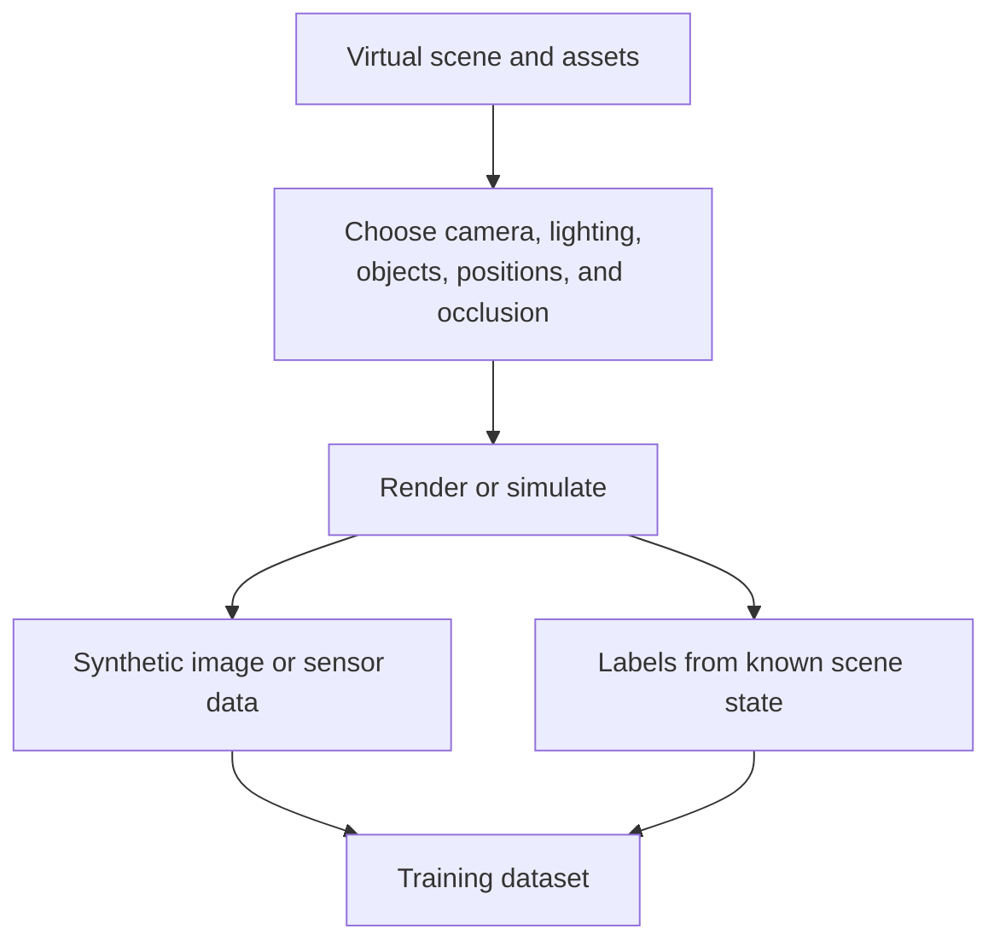
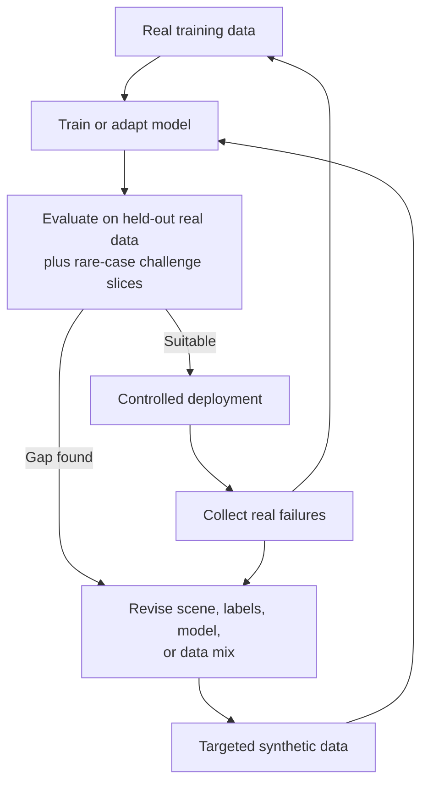

A model needs examples of rare events, but their rarity makes those examples hard to collect. **Synthetic data** changes the question: instead of waiting for the world to provide every training case, can we deliberately create some of the cases a model needs to see?

Imagine a battery inspection system. Images of normal products are plentiful. Severe cracks, deformations, unusual camera angles, and partial occlusion are much rarer. That is good news for the factory, but awkward for machine learning: the cases that matter most may be the cases with the fewest examples.

The [previous article on domain shift](../domain-shift-when-production-looks-different/) showed why production can look unlike a clean test set. Synthetic data is one way to widen the conditions seen during development. It does not make the gap disappear by itself.

## 1. What counts as synthetic data?

Synthetic data is artificially generated rather than captured directly from the target real-world process. In this article, we focus on images, video, and robot or sensor data. A team might create it with a 3D renderer, physics simulator, game engine, or generative model.

For example, a virtual forklift can be placed in a virtual warehouse and viewed by virtual cameras. By changing lighting, camera angle, forklift position, background, and occlusion, the team can create scenes that would be slow or dangerous to collect in reality. [NVIDIA Isaac Sim](https://developer.nvidia.com/isaac/sim/) is one system that supports simulation and controllable synthetic-data generation for robotics.

This is not simply "more images." It is the ability to specify **which conditions** the new images should cover.

## 2. How is it different from augmentation?

**Augmentation** usually transforms a real sample you already have: crop, blur, rotate, or change its brightness. **Synthetic generation** can build a new scene, such as a forklift partly hidden behind a pallet under a camera mounted at a different height.

| Approach | Starting point | Typical result |
| --- | --- | --- |
| Augmentation | An existing real image | A modified version of that image |
| Synthetic generation | A scene, simulation, or generative model | A newly created sample |

The boundary is not absolute. A generated defect pasted into a real photo combines both ideas. The practical distinction is whether the method can cover a **missing situation**, not just vary pixels in an existing one.

## 3. A simulated scene can provide labels, too

For a real image, a person may need to draw boxes or segmentation masks. In a simulator, the scene already records which object is where. That can make it possible to generate an image together with bounding boxes, masks, depth, or object pose.

Isaac Sim's [documented annotators](https://developer.nvidia.com/isaac/sim/) include RGB, bounding boxes, instance segmentation, and semantic segmentation, with exports to formats such as COCO and KITTI. This can reduce manual annotation work, though scene assets and generated labels still need quality checks. A wrong 3D object, camera setup, or class mapping can create many consistently wrong labels.

## 4. The strongest use case is often a missing slice

Suppose a safety camera sees millions of frames of ordinary warehouse operation but few examples of a worker near a reversing forklift. Simulation can vary worker position, forklift speed, lighting, camera viewpoint, and occlusion without staging dangerous events with real people.

That does **not** mean training on simulated near-collisions makes a safety system ready to deploy. It means the team can create challenge cases and candidate training examples that would otherwise be hard to obtain. The system still needs real-world validation and safety controls.

[NVIDIA reported a forklift-perception demonstration](https://developer.nvidia.com/blog/generating-synthetic-datasets-isaac-sim-data-replicator/) that generated more than 90,000 synthetic images by varying forklift models, lighting, camera poses, and other scene objects. The useful lesson is the control over scene coverage, not that 90,000 is a universal target or that one demonstration proves general reliability.

## 5. Synthetic data can create a new domain shift

A simulator may contain clean geometry, ideal lighting, and predictable materials. The real warehouse has scratches, dust, motion blur, reflections, sensor noise, and human behavior the simulator did not anticipate.

So a model can score well on synthetic test images and still fail on real ones. This is the **sim-to-real gap**, a form of the [domain-shift problem](../domain-shift-when-production-looks-different/) from the previous article. In a [Google Research study of robot navigation](https://research.google/pubs/sim-to-real-transfer-for-vision-and-language-navigation/), success differed between simulation and the physical robot; domain randomization helped address visual differences, but transfer remained challenging in the hardest setting.

One response is **domain randomization**: vary textures, lighting, object poses, camera settings, or physical parameters so the model does not overfit one perfect virtual world. More photorealism can also help, but visual realism alone is not the goal. A beautiful generated crack is not useful if that type of crack cannot occur on the real production line.

The key distinction is **photorealistic** versus **representative of the target conditions**. Domain knowledge about where defects occur, their geometry, how often they appear, and which combinations are physically possible matters as much as rendering quality.

## 6. Generative models widen the toolbox, and the validation burden

Not all synthetic data comes from 3D simulation. Generative image or video models can create variations of surfaces, defects, backgrounds, and events. They may help when detailed 3D assets are unavailable.

But generated images can be visually convincing while violating physical or business rules. A generated defect may have the wrong shape, location, or label. A simulated camera may omit a real sensor artifact. With generative data, the team must validate **both the scene and its annotation**, not just ask whether the image looks plausible.

This is especially important if synthetic samples are used for a rare class. Producing thousands of "defects" that do not resemble real defects may teach the model the wrong boundary more efficiently.

## 7. Real data should remain the anchor

A practical setup often combines real and synthetic training data, then evaluates on a **held-out real-world test set** that reflects intended deployment conditions. Keep challenge slices for rare cases, but also measure normal production prevalence: oversampling synthetic hazards in training must not make false alarms unacceptable in normal operation.

If a real camera shows an artifact absent from simulation, that failure is valuable. It can become a new real example **and** a specification for what the generator is missing. The real world is not just a source of training images; it is the feedback that corrects the synthetic world.

## 8. Design coverage, not volume

If you already have a million normal images, another million normal synthetic images may add little. A few thousand examples of a rare defect under low light might be much more useful, provided they resemble real cases and improve real-world evaluation.

Start with a coverage matrix:

| Situation | Bright | Dark | Partly occluded |
| --- | --- | --- | --- |
| Product A, common defect | Covered | Covered | Covered |
| Product B, common defect | Covered | Missing | Missing |
| Rare defect | Covered | Missing | Missing |

Then decide whether each missing cell should be **collected, generated, or both**. Track generation parameters and dataset versions so you know what changed. After training, test the specific slices you intended to improve, plus the old slices you do not want to regress.

Synthetic data is especially worth considering when real examples are rare, dangerous or costly to collect, annotation is expensive, or controlled scene variation is important. It may be unnecessary when real data already covers the deployment environment well and generating credible scenes would cost more than collecting them.

## The point is a better map of the world

Synthetic data is not a shortcut that replaces reality. It gives engineers a way to **design parts of the training distribution** instead of only recording what happened by chance. That control is powerful, but it also creates responsibility: if we design the wrong synthetic world, a model can become excellent at the wrong task.

The useful loop is simple: find where the model fails, identify the missing condition, create or collect examples for it, and test again on real data. The question is not **"How many images can we generate?"** It is **"Which parts of the world does the model still need to learn?"**

## References

- [NVIDIA Isaac Sim: Robotics Simulation and Synthetic Data Generation - NVIDIA Developer](https://developer.nvidia.com/isaac/sim/)
- [NVIDIA Omniverse Replicator Generates Synthetic Training Data for Robots - NVIDIA Developer](https://developer.nvidia.com/blog/generating-synthetic-datasets-isaac-sim-data-replicator/)
- [Sim-to-Real Transfer for Vision-and-Language Navigation - Google Research](https://research.google/pubs/sim-to-real-transfer-for-vision-and-language-navigation/)
- [Robot Learning From Randomized Simulations: A Review - Frontiers in Robotics and AI](https://www.frontiersin.org/journals/robotics-and-ai/articles/10.3389/frobt.2022.799893/full)
