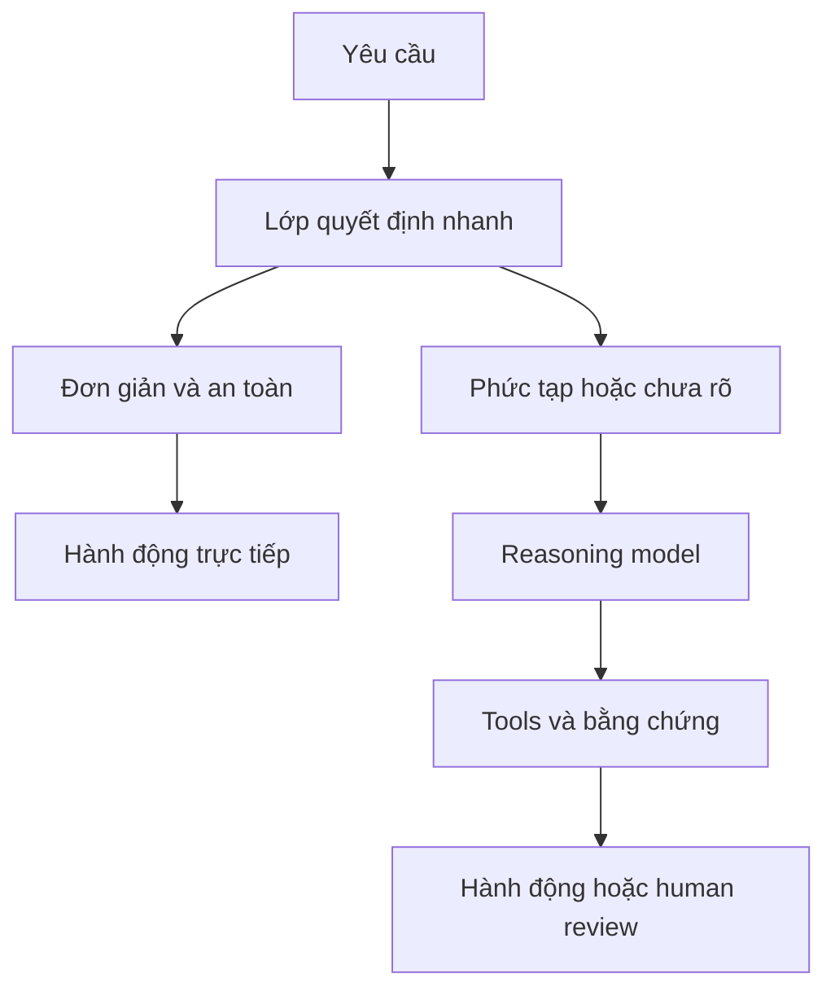

Trong vài năm gần đây, AI ngày càng được nhắc đến cùng khả năng **reasoning - suy luận**.

Thay vì trả lời ngay, một reasoning model có thể dành thêm tài nguyên để phân tích vấn đề, cân nhắc nhiều khả năng, lập kế hoạch rồi mới đưa ra câu trả lời. Cách xử lý này rất hữu ích với những công việc khó như gỡ lỗi phần mềm, nghiên cứu hoặc hoàn thành một nhiệm vụ nhiều bước.

Nhưng từ đó xuất hiện một câu hỏi quan trọng:

> **Mọi quyết định của AI có thật sự cần suy luận sâu không?**

Nếu chúng ta chỉ muốn biết một email có phải spam hay không, liệu có cần một model mạnh phân tích qua nhiều bước? Nếu một hệ thống xử lý hàng triệu giao dịch và chỉ cần xác định giao dịch nào đáng ngờ, có lẽ lời giải thích sâu nhất chưa chắc là ưu tiên hàng đầu.

Đôi khi, quyết định chỉ cần **đủ chính xác, đủ nhanh và đủ rõ để hệ thống hành động**.

Đây là lúc cách phân biệt giữa System 1 và System 2 trở nên hữu ích.

## 1. System 1 và System 2 là gì?

Daniel Kahneman đã phổ biến rộng rãi hai khái niệm này qua cuốn *Thinking, Fast and Slow*.

Hãy thử hai phép tính.

**2 + 2 bằng bao nhiêu?**

Gần như ngay lập tức, số **4** xuất hiện trong đầu bạn. Bạn không cần viết ra giấy hay chủ động suy nghĩ qua nhiều bước. Đây là kiểu xử lý Kahneman gắn với **System 1**: nhanh, tự động và gần như không cần nỗ lực.

Bây giờ hãy thử:

**17 x 24 bằng bao nhiêu?**

Lần này, bạn có thể phải dừng lại:

```text
17 x 20 = 340
17 x 4  = 68
340 + 68 = 408
```

Bạn phải tập trung và thực hiện một chuỗi phép tính. Cách này gần với **System 2** hơn: chậm hơn, có chủ đích và phù hợp với những vấn đề cần phân tích.

System 1 và System 2 không phải hai "bộ phận" riêng biệt trong não. Có thể hiểu chúng giống như hai nhân vật trong một câu chuyện, được dùng để giúp chúng ta hình dung hai cách xử lý thông tin khác nhau.

Khi mang phép so sánh này sang AI, điều đó càng cần được nhấn mạnh:

> **"System-1-like" và "System-2-like" chỉ là cách mô tả hai kiểu xử lý công việc khác nhau. Điều đó không có nghĩa AI suy nghĩ giống con người.**

## 2. Có việc AI chỉ cần đánh giá nhanh, có việc cần điều tra

Giả sử bạn đang xây dựng một hệ thống AI chăm sóc khách hàng. Một khách hàng gửi:

> Tôi đã thanh toán nhưng hệ thống vẫn báo hóa đơn chưa được trả.

Nếu nhiệm vụ chỉ là:

> **Đây có phải vấn đề liên quan đến thanh toán không?**

đầu ra hữu ích có thể chỉ là một kết quả phân loại hẹp:

```text
Payment issue: 98%
```

Đây là workload System-1-like. Câu hỏi có phạm vi rõ, tập đầu ra đã biết trước và kết quả có thể được dùng ngay để route ticket.

Bây giờ hãy thay đổi yêu cầu:

> Kiểm tra lịch sử giao dịch và chính sách hoàn tiền, xác định nguyên nhân có khả năng nhất rồi đề xuất cách xử lý tiếp theo.

Hệ thống lúc này phải tìm thông tin, liên kết bằng chứng, so sánh nhiều khả năng, có thể gọi thêm công cụ rồi giải thích đề xuất. Đây là workload gần với System-2-like hơn.

Các API reasoning hiện đại thể hiện rõ sự đánh đổi này. Ví dụ, [reasoning effort của OpenAI](https://developers.openai.com/api/docs/guides/reasoning#reasoning-effort) cho phép nhà phát triển ưu tiên độ trễ và lượng token thấp hơn ở mức effort thấp, hoặc dành nhiều tài nguyên hơn cho suy luận ở mức effort cao.

Lựa chọn đúng phụ thuộc vào hình dạng của nhiệm vụ:

| Nhiệm vụ | Điểm bắt đầu phù hợp hơn | Lý do |
| --- | --- | --- |
| Phát hiện spam | System-1-like | Bài toán phân loại hẹp với tập đầu ra đã biết |
| Route ticket hỗ trợ | System-1-like | Quyết định nhanh, lặp lại với số lượng lớn |
| Chấm điểm rủi ro giao dịch | System-1-like | Một score có giới hạn được đưa vào rule của phần mềm |
| Điều tra một giao dịch thanh toán lỗi | System-2-like | Cần bằng chứng, context và nhiều bước xử lý |
| Gỡ một lỗi production không ổn định | System-2-like | Cần giả thuyết, công cụ và bước xác minh |
| Lập kế hoạch chuyển đổi hệ thống | System-2-like | Có nhiều phụ thuộc, đánh đổi và kế hoạch dài hạn |

Ranh giới này không cố định. Một nhiệm vụ trông đơn giản có thể trở nên khó khi đầu vào mơ hồ, hậu quả của sai sót lớn hoặc quyết định không thể hoàn tác.

## 3. Model mạnh nhất chưa chắc là model phù hợp nhất

Hãy tưởng tượng một sàn thương mại điện tử xử lý hàng triệu đơn hàng. Với mỗi đơn, hệ thống cần đánh giá:

> Giao dịch này có nguy cơ gian lận cao không?

Nếu phần mềm chỉ cần kết quả:

```text
Risk: HIGH
```

thì một reasoning model lớn vẫn có thể trả lời tốt. Nhưng ở quy mô production, ba biến số khác cũng rất quan trọng:

- **Độ trễ:** mỗi quyết định làm chậm workflow bao lâu?
- **Chi phí:** điều gì xảy ra khi lời gọi được lặp lại hàng triệu lần?
- **Thông lượng:** hệ thống xử lý được bao nhiêu quyết định khi tải tăng cao?

Dùng reasoning model mạnh nhất cho mọi quyết định nhỏ giống như thuê một giáo sư toán đứng ở quầy tính tiền vì công việc thỉnh thoảng cần cộng 2 + 2. Giáo sư chắc chắn làm được. Câu hỏi là nhiệm vụ có thật sự cần đến mức năng lực ấy hay không.

Vì vậy, chất lượng model không phải một bảng xếp hạng một chiều. Một model chỉ thật sự tốt khi phù hợp với workload, ràng buộc và hậu quả xung quanh nó.

## 4. Jev nằm ở đâu trong bức tranh này?

Đây là điểm nối trực tiếp với [bài trước về Jev](../jev-system-one-model-vi/).

Ngày 15/9/2026, TypeSafe AI giới thiệu Jev là model công khai đầu tiên thuộc nhóm mà công ty gọi là **System One Models**. Thay vì tập trung vào sinh văn bản tự do, Jev được thiết kế cho những quyết định hẹp, có cấu trúc để phần mềm có thể sử dụng trực tiếp.

Về mặt ý tưởng, giao diện của nó giống như sau:

```text
state + typed questions
          |
          v
typed decisions + probabilities + confidence
```

Ví dụ, thay vì trả về một đoạn văn phân tích ticket, lớp ra quyết định có thể trả về:

```json
{
  "urgent": true,
  "probability": 0.99,
  "confidence": 0.96
}
```

Code xung quanh sau đó áp dụng một rule rõ ràng:

```text
if probability > 0.90 and confidence > 0.90
    chuyển sang hàng ưu tiên
else
    yêu cầu review
```

LangChain cũng minh họa đúng mô hình này qua integration dành cho Jev. `TypeSafeClassifier` nhận state và questions, sau đó trả về kết quả classification thay vì một câu trả lời hội thoại. LangChain còn giới thiệu middleware dùng Jev cho [model routing và an toàn của agent](https://www.langchain.com/blog/building-a-harness-with-jev): một thành phần chọn model dựa trên request, thành phần còn lại kiểm tra các tool call có khả năng rủi ro và có thể chặn chúng trước khi thực thi.

Điểm thú vị không phải Jev "thông minh hơn LLM". Nó được chuyên biệt cho một giao diện khác và một nhóm công việc khác.

Cũng cần tách tên sản phẩm khỏi một tiêu chuẩn chung. **System One Model** hiện là cách TypeSafe AI gọi nhóm model của họ, chưa phải một định nghĩa kỹ thuật được toàn ngành thống nhất. Jev vẫn đang ở giai đoạn early access khi bài này được xuất bản, vì vậy hành vi thực tế của nó cần được đánh giá độc lập trên từng workload.

## 5. System 1 có tốt hơn System 2 không?

Không. Chúng giải quyết những vấn đề khác nhau.

Một model ra quyết định nhanh phù hợp tự nhiên với các câu hỏi như:

- Đây có phải spam không?
- Trường hợp này có cần escalate không?
- Rủi ro cao hay thấp?
- Request nên được route sang hàng đợi nào?

Nhưng hãy xem một câu hỏi khác:

> Công ty nên xử lý khiếu nại này thế nào, xét đến hợp đồng, lịch sử khách hàng, rủi ro pháp lý và ảnh hưởng có thể có đến thương hiệu?

Bài toán đó cần nhiều context, khả năng phán đoán và phân tích nhiều bước. Nén nó quá sớm thành một quyết định nhị phân có thể che mất những phần quan trọng nhất.

Quyết định nhanh cũng có những dạng lỗi quen thuộc:

- Các nhãn có thể được định nghĩa chưa tốt.
- State có thể thiếu context quan trọng.
- Confidence có thể bị lệch khi gặp dữ liệu mới.
- Một lỗi có độ trễ thấp vẫn rất đắt nếu bị lặp lại ở quy mô lớn.

Đầu ra có cấu trúc chỉ đảm bảo **hình dạng** của câu trả lời, không đảm bảo **tính đúng đắn**. Mọi lớp ra quyết định vẫn cần eval theo đúng tác vụ, monitoring, threshold và một đường lui an toàn để con người review.

## 6. Kiến trúc hữu ích là System 1 + System 2

Tương lai thực tế có lẽ không phải "System 1 hay System 2". Đó sẽ là một hệ thống biết dùng cả hai:



Lớp nhanh có thể phân loại, chấm điểm, route hoặc xác định khi nào cần escalate. Lớp reasoning chỉ được gọi khi vấn đề thật sự cần lập kế hoạch, dùng công cụ, giải thích hoặc đưa ra phán đoán.

Cách này khá giống một công ty. CEO không duyệt từng email, nhưng quyết định chiến lược cũng không nên được giao cho bất kỳ ai tình cờ nhìn thấy nó đầu tiên. Mỗi tầng xử lý nhóm quyết định phù hợp với vai trò của mình.

Bản thân router cũng phải được xem là một model thật sự, không phải phần hạ tầng vô hình. Nếu router gửi một ca khó vào nhánh "đơn giản", model mạnh hơn sẽ không có cơ hội sửa sai. Độ chính xác khi route, ngưỡng uncertainty và fallback đều cần eval riêng.

## 7. Cách chọn đúng hướng xử lý

Trước khi chọn model, hãy đặt năm câu hỏi.

### Tập đầu ra có giới hạn rõ không?

Phân loại, scoring, routing và quyết định yes/no là ứng viên tốt cho một lớp xử lý nhanh. Phân tích mở thường cần khả năng reasoning linh hoạt hơn.

### Cần kết nối bao nhiêu context?

Nếu câu trả lời phụ thuộc vào nhiều tài liệu, lịch sử giao dịch, policy và kết quả từ công cụ, một workflow sâu hơn có thể là lựa chọn cần thiết.

### Chi phí của một quyết định sai là bao nhiêu?

Một gợi ý sai nhưng được con người review khác hoàn toàn một hành động tài chính không thể hoàn tác. Bài toán có rủi ro cao cần xác minh chặt hơn ngay cả khi câu hỏi trông có vẻ đơn giản.

### Quyết định sẽ được chạy bao nhiêu lần?

Một phần kém hiệu quả rất nhỏ có thể trở thành hóa đơn lớn sau hàng triệu lời gọi. Các bước có lưu lượng cao xứng đáng được tối ưu riêng.

### Ca không chắc chắn có thể được escalate không?

Một hệ thống đáng tin cậy không ép mọi đầu vào vào automation. Nó biết khi nào nên gọi model mạnh hơn, yêu cầu thêm thông tin hoặc chuyển cho con người.

Năm câu hỏi này dẫn đến một quy trình thiết kế tốt hơn việc chỉ chọn model có điểm benchmark cao nhất.

## Câu hỏi tốt hơn

Cuộc đua AI thường được diễn đạt bằng câu hỏi:

> Model nào thông minh nhất?

Khi AI ngày càng đi sâu vào phần mềm và automation, một câu hỏi hữu ích hơn là:

> **Nhiệm vụ cụ thể này thật sự cần bao nhiêu trí thông minh?**

Có công việc cần reasoning sâu. Có công việc cần một quyết định trong vài mili giây. Phần lớn hệ thống production sẽ cần sự kết hợp có chủ đích của cả hai.

Đôi khi, một model không cần "nghĩ quá nhiều" lại là lựa chọn tốt hơn, không phải vì nó thông minh hơn, mà vì nó là đúng công cụ cho đúng công việc.

## Nguồn tham khảo

- [Daniel Kahneman - *Thinking, Fast and Slow*](https://www.penguinrandomhouse.com/books/89308/thinking-fast-and-slow-by-daniel-kahneman/)
- [OpenAI - Reasoning models và reasoning effort](https://developers.openai.com/api/docs/guides/reasoning)
- [TypeSafe AI - Introducing System One Models & Jev](https://typesafe.ai/blog/introducing-system-one-models-and-jev)
- [TypeSafe AI - Tài liệu Jev](https://docs.typesafe.ai/introduction)
- [LangChain - Building a Harness with Jev](https://www.langchain.com/blog/building-a-harness-with-jev)
