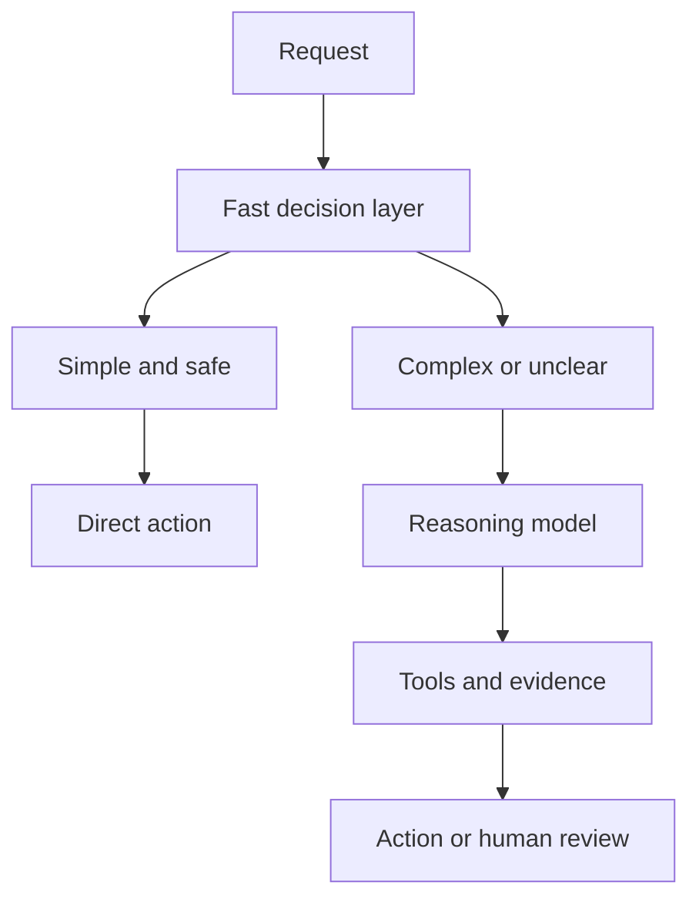

In the last few years, AI has become increasingly associated with **reasoning**.

Instead of answering immediately, a reasoning model can spend more compute analyzing a problem, considering alternatives, planning, and then producing a response. That is valuable for difficult work such as debugging software, conducting research, or completing a multi-step task.

But it raises an important question:

> **Does every AI decision need deep reasoning?**

If all we need to know is whether an email is spam, should a powerful model analyze the message through several steps? If a system processes millions of transactions and only needs to decide whether one looks suspicious, perhaps the priority is not the deepest possible explanation.

Perhaps the decision only needs to be **accurate enough, fast enough, and clear enough to act on**.

This is where the distinction between System 1 and System 2 becomes useful.

## 1. What are System 1 and System 2?

Daniel Kahneman popularized these terms in *Thinking, Fast and Slow*.

Try these two calculations.

**What is 2 + 2?**

The answer, **4**, probably appeared almost immediately. You did not need to write anything down or deliberately work through several steps. This is the kind of processing Kahneman associates with **System 1**: fast, automatic, and low-effort.

Now try:

**What is 17 x 24?**

This time, you may need to pause:

```text
17 x 20 = 340
17 x 4  = 68
340 + 68 = 408
```

You have to focus and perform a sequence of operations. That is closer to **System 2**: slower, deliberate, and suited to problems that require analysis.

These names do not describe two literal organs or isolated mechanisms in the brain. They are characters in a useful story about two modes of processing information.

The same caveat matters even more when we borrow the idea for AI.

> **"System-1-like" and "System-2-like" are analogies for workloads. They do not mean that a model thinks like a human.**

## 2. Some AI tasks need a quick judgment; others need an investigation

Imagine that you are building an AI system for customer support. A customer writes:

> I paid already, but the system still says the invoice is unpaid.

If the task is only:

> **Is this a payment issue?**

the useful output might be a narrow classification:

```text
Payment issue: 98%
```

That is a System-1-like workload. The question is constrained, the set of outputs is known, and the result can be used immediately for routing.

Now change the request:

> Review the transaction history and refund policy, identify the likely cause, and recommend the next action.

The system now has to retrieve information, connect evidence, compare possibilities, perhaps call tools, and explain a recommendation. This is much closer to a System-2-like workload.

Modern reasoning APIs make this tradeoff explicit. For example, OpenAI's [reasoning effort setting](https://developers.openai.com/api/docs/guides/reasoning#reasoning-effort) lets developers favor lower latency and token use at lower effort, or more thorough reasoning at higher effort.

The right choice depends on the shape of the task:

| Task | Better starting point | Why |
| --- | --- | --- |
| Detect spam | System-1-like | Narrow classification with known outputs |
| Route a support ticket | System-1-like | Fast decision repeated at high volume |
| Score transaction risk | System-1-like | A bounded score feeds a software rule |
| Investigate a failed payment | System-2-like | Requires evidence, context, and multiple steps |
| Debug an intermittent production failure | System-2-like | Requires hypotheses, tools, and verification |
| Plan a system migration | System-2-like | Involves dependencies, tradeoffs, and long-horizon planning |

The boundary is not fixed. A task that looks simple can become difficult when the inputs are ambiguous, the cost of a mistake is high, or the decision cannot be reversed.

## 3. The strongest model is not always the best model

Suppose an e-commerce platform processes millions of orders. For each order, it asks:

> Is there a high risk of fraud?

If the software only needs this result:

```text
Risk: HIGH
```

a large reasoning model may still answer correctly. But at production scale, three other variables matter:

- **Latency:** how long does each decision delay the workflow?
- **Cost:** what happens when the call is repeated millions of times?
- **Throughput:** how many decisions can the system make under load?

Using the most capable reasoning model for every small decision is like hiring a mathematics professor to operate a checkout counter because the job occasionally requires adding 2 + 2. The professor can certainly do it. The question is whether the task needs that level of capability.

Model quality is therefore not a one-dimensional leaderboard. A production model is good only in relation to the workload, constraints, and consequences around it.

## 4. Where Jev fits into this picture

This connects directly to the [previous article about Jev](../jev-system-one-model/).

On September 15, 2026, TypeSafe AI introduced Jev as the first public model in a category the company calls **System One Models**. Instead of focusing on free-form text generation, Jev is designed for narrow, structured decisions that software can consume directly.

Conceptually, the interface looks like this:

```text
state + typed questions
          |
          v
typed decisions + probabilities + confidence
```

For example, rather than returning a paragraph about a ticket, a decision layer could return:

```json
{
  "urgent": true,
  "probability": 0.99,
  "confidence": 0.96
}
```

The surrounding code can then apply an explicit rule:

```text
if probability > 0.90 and confidence > 0.90
    route to the priority queue
else
    request review
```

LangChain demonstrates the same pattern through its Jev integration. Its `TypeSafeClassifier` accepts state and questions, then returns classification results rather than a chat response. LangChain also documents Jev-based middleware for [model routing and agent safety](https://www.langchain.com/blog/building-a-harness-with-jev): one component selects a model based on the request, while another checks potentially risky tool calls and can block them before execution.

The interesting point is not that Jev is "smarter than an LLM." It is specialized for a different interface and a different class of work.

It is also important to separate a product name from a general standard. **System One Model** is currently TypeSafe AI's term for its model category, not an industry-wide technical definition. Jev was also in early access when this article was published, so its production behavior should be evaluated independently on each real workload.

## 5. Is System 1 better than System 2?

No. They solve different problems.

A fast decision model is a natural fit for questions such as:

- Is this spam?
- Should this case be escalated?
- Is the risk high or low?
- Which queue should receive this request?

But consider a different question:

> How should the company resolve this complaint, given the contract, customer history, legal risk, and possible effect on the brand?

That problem needs more context, judgment, and multi-step analysis. Compressing it too early into a binary decision can hide the most important parts of the problem.

Fast decisions also have familiar failure modes:

- The categories may be defined poorly.
- Important context may be missing from the state.
- A confidence score can be miscalibrated on new data.
- A low-latency mistake can still be expensive when repeated at scale.

Structured output guarantees the **shape** of an answer, not its **correctness**. Every decision layer still needs task-specific evaluation, monitoring, thresholds, and a safe path to human review.

## 6. The useful architecture is System 1 + System 2

The more practical future is probably not "System 1 or System 2." It is a system that uses both:



The fast layer can classify, score, route, or decide whether escalation is necessary. The reasoning layer is used when the problem genuinely needs planning, tool use, explanation, or judgment.

This resembles how an organization works. A CEO does not approve every email, but a strategic decision should not be made by whichever employee happens to see it first. Each layer handles the class of decisions appropriate to its role.

The router itself must be treated as a real model, not invisible plumbing. If it sends a difficult case down the "simple" path, the more capable model never gets a chance to recover. Routing accuracy, uncertainty thresholds, and fallback behavior all need their own evaluations.

## 7. How to choose the right path

Before selecting a model, ask five questions.

### Is the output space bounded?

Classification, scoring, routing, and yes/no decisions are good candidates for a fast decision layer. Open-ended analysis usually needs more flexible reasoning.

### How much context must be connected?

If the answer depends on several documents, a transaction history, policy rules, and tool results, a deeper workflow is likely necessary.

### What is the cost of being wrong?

A wrong recommendation that a person reviews is different from an irreversible financial action. Higher stakes require stronger verification even when the question appears simple.

### How often will the decision run?

A small inefficiency becomes a large bill at millions of calls. High-volume steps deserve separate optimization.

### Can uncertain cases be escalated?

A reliable system does not force every input into automation. It knows when to call a stronger model, request more information, or involve a human.

These questions lead to a better design process than simply choosing the model with the highest benchmark score.

## The better question

The AI race is often framed as:

> Which model is the smartest?

As AI becomes part of real software and automation, a more useful question is:

> **How much intelligence does this particular task require?**

Some work needs deep reasoning. Some work needs a decision in a few milliseconds. Most production systems will need a deliberate combination of both.

Sometimes a model that does not need to "think so much" is the better choice, not because it is more intelligent, but because it is the right tool for the job.

## References

- [Daniel Kahneman - *Thinking, Fast and Slow*](https://www.penguinrandomhouse.com/books/89308/thinking-fast-and-slow-by-daniel-kahneman/)
- [OpenAI - Reasoning models and reasoning effort](https://developers.openai.com/api/docs/guides/reasoning)
- [TypeSafe AI - Introducing System One Models & Jev](https://typesafe.ai/blog/introducing-system-one-models-and-jev)
- [TypeSafe AI - Jev documentation](https://docs.typesafe.ai/introduction)
- [LangChain - Building a Harness with Jev](https://www.langchain.com/blog/building-a-harness-with-jev)
