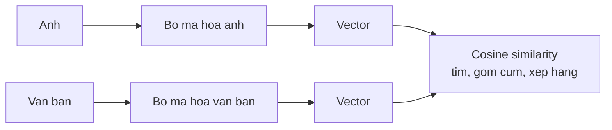

> **Mục tiêu bài học:** Sau bài này, bạn sẽ phân biệt được hai thứ cùng tên "embedding" nhưng dùng vào hai việc khác hẳn nhau, dựng được một hệ tìm kiếm theo ngữ nghĩa trên tài liệu tiếng Việt, và thấy bằng số cái bẫy nguy hiểm nhất của cách cài đặt truy hồi thông thường: một phép `topk` thuần **luôn trả về $k$ kết quả**, kể cả khi kho tài liệu không chứa câu trả lời nào.

## 1. Hai thứ cùng tên, khác việc

Bài 04 đã dựng bước đầu tiên của mọi mô hình ngôn ngữ: mỗi token được tra thành một vector. Nên đến bài này, khi nghe "embedding văn bản", rất dễ tưởng đó là cùng một thứ.

Không phải. Và nhầm chỗ này dẫn tới một hệ tìm kiếm chạy được nhưng vô dụng.

**Token embedding - thứ nằm bên trong mô hình ngôn ngữ.** Nó là một bảng tra: mỗi token trong từ vựng có đúng một vector. Với Qwen2.5-0.5B, bảng ấy có kích thước bằng `config.vocab_size` nhân số chiều:

```
151.936 × 896
```

Tức 151.936 token, mỗi token 896 con số. Điểm cốt yếu: **vector này cố định, chưa nhìn ngữ cảnh.** Token `ngân` có cùng một vector dù nó nằm trong "ngân hàng" hay "ngân nga". Chỉ sau khi đi qua các tầng attention của bài 03 và 04, biểu diễn mới trở nên phụ thuộc ngữ cảnh.

**Sentence embedding - thứ dùng để tìm kiếm.** Nó biến **cả một đoạn văn** thành **một** vector duy nhất, và được huấn luyện sao cho cosine similarity giữa hai vector phản ánh mức *gần nghĩa* của hai đoạn.

Đây là hai bài toán khác nhau, nên người ta huấn luyện chúng bằng hai cách khác nhau. Lấy token embedding của một mô hình ngôn ngữ rồi cộng trung bình lại để đi tìm kiếm là chuyện làm được - nhưng kết quả kém hơn hẳn một mô hình được huấn luyện đúng cho việc ấy.

Bài này dùng `intfloat/multilingual-e5-small` - một mô hình embedding đa ngữ hỗ trợ tiếng Việt, cho ra vector **384 chiều**.

| | Token embedding (Qwen2.5-0.5B) | Sentence embedding (e5-small) |
|---|---|---|
| Đầu vào | một token | cả một đoạn văn |
| Đầu ra | vector 896 chiều | vector **384 chiều** |
| Phụ thuộc ngữ cảnh | **không** | có |
| Dùng để | làm đầu vào cho các tầng phía sau | đo mức gần nghĩa giữa hai đoạn |

> ⚠️ **Lưu ý nhỏ:** vector nhỏ hơn không có nghĩa là kém hơn. 896 chiều của Qwen phải mang đủ thông tin cho mọi việc mà mô hình ngôn ngữ làm; 384 chiều của e5 chỉ cần mang đủ thông tin để *so hai đoạn văn với nhau*. Bài toán hẹp hơn thì cần ít chiều hơn - đúng tinh thần chương Machine Learning · Bài 10 khi bàn về giảm chiều.

## 2. Cosine similarity trên tiếng Việt

Lấy bốn câu, hai câu về học máy và hai câu về phở, rồi đo cosine similarity từng cặp - đúng phép đo của Foundations · Bài 07:

| | Học máy 1 | Học máy 2 | Phở 1 | Phở 2 |
|---|---|---|---|---|
| **Mô hình học máy cần dữ liệu để học.** | 1,000 | **0,926** | 0,807 | 0,823 |
| **Thuật toán cần dữ liệu huấn luyện mới hoạt động được.** | **0,926** | 1,000 | 0,808 | 0,821 |
| **Hôm nay tôi ăn phở bò ở Hà Nội.** | 0,807 | 0,808 | 1,000 | **0,905** |
| **Bữa sáng của tôi là một bát phở.** | 0,823 | 0,821 | **0,905** | 1,000 |

Cấu trúc hiện ra rõ: hai câu học máy gần nhau **0,926**, hai câu phở gần nhau **0,905**, còn chéo nhóm chỉ khoảng 0,81. Và chú ý cặp học máy: chúng **không dùng chung một từ nào** ngoài "cần" và "dữ liệu" - "mô hình" so với "thuật toán", "học" so với "huấn luyện". Tìm bằng từ khóa sẽ trượt; tìm bằng vector thì không.

Nhưng bảng này cũng lộ ra một điều phải biết trước khi dùng: **sàn tương đồng rất cao.** Hai câu chẳng liên quan gì tới nhau - một câu về học máy, một câu về phở - vẫn được 0,807. Một ngưỡng kiểu "chỉ nhận kết quả trên 0,8" nghe rất hợp lý với người quen nghĩ cosine chạy từ 0 tới 1, nhưng ở đây nó **nhận tất**.

Chú ý cho kỹ: bảng này **không** chứng minh ngưỡng là vô dụng. Ngược lại - với đúng bốn câu này, một ngưỡng quanh **0,85** tách sạch: hai cặp cùng chủ đề (0,926 và 0,905) nằm trên, bốn cặp chéo nhóm (0,807-0,823) nằm dưới. Điều bảng chứng minh là chuyện khác và quan trọng hơn: **thang cosine của mô hình này cao hơn hẳn trực giác**, nên một ngưỡng chọn bằng cảm giác sẽ sai. Mục 4 sẽ cho thấy vì sao việc ngưỡng 0,85 tiếp tục chia đúng vài truy vấn thật vẫn chưa đủ để tin rằng nó tổng quát.

## 3. Dựng một hệ truy hồi trên 51 bài

Corpus là chính bốn chương đã viết của loạt bài này: Foundations, Machine Learning, Deep Learning, Computer Vision. Cắt theo mục (`##`) rồi bỏ các đoạn quá ngắn, được **507 đoạn**.

```python
import torch, torch.nn.functional as F
from transformers import AutoTokenizer, AutoModel

tok = AutoTokenizer.from_pretrained("intfloat/multilingual-e5-small")
mdl = AutoModel.from_pretrained("intfloat/multilingual-e5-small").eval()

def encode(texts, prefix):                 # e5 cần tiền tố "query: " hoặc "passage: "
    e = tok([prefix + t for t in texts], padding=True, truncation=True,
            max_length=512, return_tensors="pt")
    with torch.no_grad():
        out = mdl(**e).last_hidden_state
    mask = e["attention_mask"].unsqueeze(-1).float()
    pooled_embeddings = (out * mask).sum(1) / mask.sum(1)      # bỏ qua phần đệm
    return F.normalize(pooled_embeddings, dim=1)               # chuẩn hóa để dùng cosine

corpus_embeddings = encode([d["noi_dung"] for d in docs], "passage: ")
query_embedding = encode(["IoU được tính như thế nào?"], "query: ")[0]
scores = corpus_embeddings @ query_embedding                                    # cosine với mọi đoạn
```

Ba chi tiết trong đoạn code này đều là chỗ hay sai:

**Tiền tố `query:` và `passage:`.** Mô hình e5 được huấn luyện với hai tiền tố ấy để phân biệt "đây là câu hỏi" với "đây là tài liệu". Bỏ chúng đi thì mô hình vẫn chạy và vẫn trả về kết quả - chỉ kém hơn. Đây đúng kiểu lỗi âm thầm mà chương Computer Vision · Bài 01 đã gặp với phép tiền xử lý ảnh.

**Lấy trung bình có mặt nạ.** Các đoạn dài ngắn khác nhau nên phải đệm cho bằng nhau; nếu lấy trung bình cả phần đệm thì đoạn ngắn bị pha loãng.

**Chuẩn hóa trước khi nhân.** Sau `F.normalize`, tích vô hướng chính là cosine. Quên bước này thì độ dài vector chen vào điểm số - cùng cái bẫy của CLIP ở chương Computer Vision · Bài 11.

Kết quả trên bốn câu hỏi:

| Câu hỏi | Đoạn đứng đầu | Điểm |
|---|---|---|
| Vì sao phải chia dữ liệu thành train, validation và test? | Foundations · Bài 04 | 0,907 |
| IoU được tính như thế nào? | Computer Vision · Bài 07 | 0,861 |
| Kết nối tắt của ResNet giúp gì? | Computer Vision · Bài 03 | 0,883 |
| Tokenizer làm tiếng Việt tốn bao nhiêu token? | Foundations · Bài 01 | **0,849** |

Ba câu đầu trúng đúng bài. Câu thứ tư thì không - và nó là câu đáng giá nhất bảng.

## 4. Phép `topk` vẫn trả kết quả khi kho không có đáp án

Câu "Tokenizer làm tiếng Việt tốn bao nhiêu token?" có đáp án ở **bài 02 của chính chương này** - bài mà lúc chạy thí nghiệm chưa nằm trong corpus. Nghĩa là **kho tài liệu không hề chứa câu trả lời**.

Bộ truy hồi vẫn trả về một đoạn, từ Foundations · Bài 01, với điểm **0,849**. Con số ấy thấp hơn 0,861 của câu hỏi IoU vốn trúng đích - nhưng chỉ thấp hơn **0,012**, trong khi hai lần tìm ấy khác nhau một trời một vực: một lần trúng đúng bài, một lần kho không hề chứa câu trả lời. Để thấy 0,012 mỏng cỡ nào, hãy so với chính ba câu trúng đích: chúng chênh nhau tới **0,046** (0,861 đến 0,907). Nghĩa là khoảng cách giữa *có đáp án* và *không có đáp án* còn nhỏ hơn khoảng dao động giữa các lần trúng đích với nhau.

Ngưỡng 0,85 của mục 2 ở đây *vẫn* chia đúng: 0,861 nằm trên, 0,849 nằm dưới. Nhưng ba truy vấn có đáp án và một truy vấn không có đáp án là **quá ít** để nói được gì về độ ổn định hay khả năng tổng quát của ngưỡng ấy. Biên 0,012 - mỏng hơn cả chênh lệch giữa các câu trúng đích với nhau - là lý do để thận trọng, chứ tự nó chưa chứng minh ngưỡng sẽ hỏng ở lần sau. Muốn dùng ngưỡng trong một hệ thật thì phải hiệu chỉnh nó trên một tập ví dụ đúng và ví dụ sai **đủ lớn**, và đúng phân bố truy vấn-đoạn mà hệ sẽ gặp - chứ không phải trên vài cặp câu ngắn, vì hình dạng dữ liệu ở hai bên khác hẳn nhau.

Lý do nằm ở chính phép tìm mà ta viết: `topk` **luôn** trả về $k$ phần tử. Nó không có khái niệm "không tìm thấy" - nó xếp hạng 507 đoạn theo độ gần rồi đưa ra đoạn gần nhất, kể cả khi đoạn gần nhất ấy chẳng liên quan gì.

Đây là giới hạn của **cách cài đặt**, không phải của ý tưởng truy hồi. Một hệ truy hồi hoàn toàn có thể được thiết kế để **trả về rỗng** - bằng ngưỡng đã hiệu chỉnh, bằng một bộ xếp hạng lại, hoặc bằng một bước hỏi riêng "đoạn này có chứa câu trả lời không". Nhưng nếu bạn chỉ gọi `topk` thì bạn sẽ không bao giờ nhận được câu trả lời "không có".

Ba hệ quả cho việc thật:

**Đừng chọn ngưỡng cosine bằng trực giác, và đừng mang ngưỡng từ bộ này sang bộ khác.** Mục 2 cho thấy sàn tương đồng ở khoảng 0,81 ngay cả giữa hai câu chẳng dính dáng gì, nên 0,8 sẽ nhận tất. Mục 4 cho thấy chuyện tinh vi hơn: ngưỡng 0,85 mang từ bốn câu đồ chơi sang truy vấn thật vẫn chia đúng, nhưng chỉ với biên 0,012 trên một dải điểm rộng có 0,058 - bốn lần đo với một biên mỏng như vậy chưa đủ cơ sở để tin ngưỡng ấy sẽ giữ được ở quy mô thật. **Ngưỡng phải được hiệu chỉnh trên dữ liệu có nhãn của chính lĩnh vực bạn và trên đúng loại cặp mà hệ thật sẽ so** - truy vấn đọ với đoạn, chứ không phải câu đọ với câu - bằng một tập ví dụ đúng và ví dụ sai, đúng cách chương Machine Learning · Bài 12 chọn ngưỡng theo chi phí.

**Điểm cao không có nghĩa là đúng.** Đây là chuyện đã gặp ba lần trong loạt bài này - Computer Vision · Bài 01 với "wall clock 1,000", Computer Vision · Bài 12 với "Trẩn" ở độ tin cậy 1,000, và giờ là điểm truy hồi 0,849 cho một câu hỏi không có đáp án. Nguyên tắc chung: **điểm số do chính hệ thống tự chấm không phải bằng chứng về tính đúng.**

**Phải đo truy hồi tách khỏi phần sinh.** Nếu chỉ nhìn câu trả lời cuối cùng của một hệ RAG, bạn không phân biệt được "mô hình bịa" với "mô hình được đưa nhầm tài liệu". Bài 12 vì thế đánh giá hai tầng riêng biệt. Thước đo đúng cho tầng truy hồi là **Recall@k ở mức đoạn** - nhưng nó đòi nhãn nói rõ *đoạn nào* chứa câu trả lời. Nhãn của bài 12 chỉ nói *bài nào*, nên nó đo **article hit@k**; bài 12 nói rõ chỗ ấy và giải thích điều đó che mất kiểu thất bại nào.

> 🔧 **Thử ngay:** hệ tìm kiếm nội bộ của công ty bạn trả về kết quả trông hợp lý cho mọi câu hỏi, kể cả câu hỏi về những thứ công ty chưa bao giờ làm. Bạn kiểm tra thế nào?
> Dựng một bộ câu hỏi **có nhãn**: một nửa là câu bạn biết chắc tài liệu nào chứa đáp án, một nửa là câu bạn biết chắc **không** có trong kho. Với nửa đầu, đo tỉ lệ số lần đoạn đúng nằm trong $k$ kết quả đầu - Recall@k nếu bạn gán nhãn tới mức đoạn, article hit@k nếu nhãn chỉ tới mức tài liệu. Với nửa sau, xem hệ có cách nào báo "không có" hay không; nếu nó luôn trả về gì đó với điểm tương đương nửa đầu, thì bản thân điểm số không dùng để lọc được và bạn cần một tầng khác - chẳng hạn để mô hình ngôn ngữ đọc đoạn được truy hồi rồi tự phán đoạn ấy có chứa câu trả lời không, đúng cách bài 12 làm.

## 5. Cùng một ý tưởng, đổi loại dữ liệu

Nếu phần này nghe quen thì đúng là bạn đã gặp rồi. Chương Computer Vision · Bài 11 làm y hệt, chỉ khác chỗ đầu vào là ảnh:



Ba việc mà chương ấy làm với ảnh - tìm ảnh giống, gom cụm không cần nhãn, phân loại tập lớp mới - đều làm được với văn bản, bằng đúng những dòng code của mục 3.

Và CLIP ở bài ấy đi thêm một bước nữa: nó đặt **ảnh và chữ vào cùng một không gian**, nên tìm ảnh bằng câu mô tả là chuyện tự nhiên. Nhìn từ đây thì CLIP không phải một kỹ thuật riêng của thị giác máy tính - nó là cùng ý tưởng của bài này, mở rộng cho hai loại dữ liệu.

Bài 12 lấy hệ truy hồi vừa dựng làm nửa đầu của một hệ hỏi đáp: tìm đoạn liên quan trước, rồi mới đưa cho mô hình ngôn ngữ trả lời dựa trên chúng.

## Tóm tắt bài học

- **Token embedding** (bảng 151.936 × 896 của Qwen2.5-0.5B) cho mỗi token một vector **cố định, chưa nhìn ngữ cảnh**; nó là đầu vào cho các tầng phía sau, không phải công cụ tìm kiếm.
- **Sentence embedding** biến cả đoạn văn thành **một** vector (384 chiều với e5-small) được huấn luyện sao cho cosine mang nghĩa gần nghĩa.
- Trên tiếng Việt, hai câu cùng chủ đề mà **dùng những từ khóa hoàn toàn khác nhau** - "mô hình"/"thuật toán", "học"/"huấn luyện" - vẫn đạt cosine 0,926, trong khi hai câu khác chủ đề chỉ 0,807. Tìm bằng từ khóa sẽ trượt chỗ này.
- Nhưng **sàn tương đồng rất cao** (0,807 giữa hai câu chẳng liên quan), nên **không thể chọn ngưỡng bằng trực giác** - một con số nghe hợp lý như 0,8 sẽ nhận tất. Ngưỡng không phải vô dụng: quanh 0,85 tách sạch đúng bốn câu ở mục 2. Vấn đề là **không nên giả định nó mang nguyên xi sang bộ khác** - ở mục 4 cùng ngưỡng ấy vẫn chia đúng, nhưng chỉ hơn kém **0,012**, mỏng hơn cả chênh lệch 0,046 giữa chính các câu trúng đích, và bốn truy vấn thì quá ít để kết luận gì về độ ổn định. Muốn dùng ngưỡng thì phải hiệu chỉnh bằng dữ liệu có nhãn của chính lĩnh vực mình, trên đúng loại cặp hệ thật sẽ so.
- Ba chỗ hay sai khi cài đặt: quên tiền tố `query:`/`passage:`, lấy trung bình cả phần đệm, và quên chuẩn hóa trước khi nhân.
- **Phép `topk` luôn trả về $k$ kết quả, kể cả khi kho không chứa câu trả lời** - một câu hỏi không có đáp án trong corpus vẫn nhận điểm **0,849**, chỉ kém 0,012 so với câu trúng đích thấp điểm nhất - trong khi ba câu trúng đích chênh nhau tới 0,046. Với chừng ấy điểm đo thì chưa thể biết bản thân điểm số có tách được hai tình huống ấy một cách ổn định hay không.
- Vì thế phải **đo truy hồi tách khỏi phần sinh**, bằng bộ câu hỏi biết trước đáp án nằm ở đâu.
- Đây là cùng ý tưởng của chương Computer Vision · Bài 11, chỉ đổi ảnh thành văn bản; CLIP là bước mở rộng đặt cả hai vào chung một không gian.

## Câu hỏi tự kiểm tra

1. Phân biệt token embedding với sentence embedding theo ba tiêu chí: đầu vào, có phụ thuộc ngữ cảnh không, và dùng để làm gì.
2. Vì sao không thể lấy token embedding của một mô hình ngôn ngữ, cộng trung bình lại, rồi dùng để tìm kiếm ngữ nghĩa?
3. Hai câu "Mô hình học máy cần dữ liệu" và "Thuật toán cần dữ liệu huấn luyện" đạt cosine 0,926 dù các từ khóa chính hoàn toàn khác nhau. Điều đó nói gì về khác biệt giữa tìm theo từ khóa và tìm theo vector?
4. Ngưỡng 0,85 tách sạch bốn câu ở mục 2, và ở mục 4 nó vẫn chia đúng - nhưng chỉ với biên 0,012. Vì sao bốn điểm đo ấy chưa đủ để tin vào ngưỡng? Nêu cách hiệu chỉnh ngưỡng cho đúng.
5. Vì sao quên tiền tố `query:`/`passage:` là loại lỗi nguy hiểm? Liên hệ với chương Computer Vision · Bài 01.
6. Câu hỏi không có đáp án trong corpus vẫn nhận điểm 0,849, chỉ kém 0,012 so với câu trúng đích thấp điểm nhất. Giải thích nguyên nhân từ chính định nghĩa của phép `topk`, và nêu cách thiết kế một hệ truy hồi **có thể trả về rỗng**.
7. Bạn có một hệ RAG trả lời sai. Nêu hai nguyên nhân hoàn toàn khác nhau, và cách thiết kế phép đo để biết nguyên nhân nào.

## Đọc thêm

**Nguồn nền tảng của bài:**

| Nguồn | Đọc phần nào |
|---|---|
| **Foundations · Bài 07** | Cosine similarity - phép đo dùng suốt bài |
| **Chương Computer Vision · Bài 11** | Học biểu diễn với ảnh: truy hồi, gom cụm, và CLIP |
| **Bài 04 của chương này** | Token embedding nằm ở đâu trong một Transformer |
| **Chương Machine Learning · Bài 10** | PCA và ý tưởng nén biểu diễn xuống ít chiều |

**Nguồn online bổ sung (miễn phí):**

- [Wang và cộng sự - Text Embeddings by Weakly-Supervised Contrastive Pre-training (E5, 2022)](https://arxiv.org/abs/2212.03533) - mô hình dùng trong bài, và lý do có tiền tố `query:`/`passage:`.
- [Reimers & Gurevych - Sentence-BERT (EMNLP 2019)](https://arxiv.org/abs/1908.10084) - bài đặt nền cho sentence embedding, giải thích vì sao lấy trung bình token embedding của BERT thô lại kém.
- [Massive Text Embedding Benchmark (MTEB)](https://huggingface.co/spaces/mteb/leaderboard) - bảng so sánh các mô hình embedding, có phần đa ngữ để đối chiếu khi bạn chọn mô hình cho tiếng Việt.
- [FAISS](https://github.com/facebookresearch/faiss) - thư viện tìm vector gần nhất ở quy mô hàng triệu; với 507 đoạn thì một phép nhân ma trận là đủ, nhưng kho lớn thì cần nó.
- [`sentence-transformers`](https://www.sbert.net/) - thư viện gói gọn toàn bộ đoạn code ở mục 3, tiện khi bạn không cần kiểm soát từng bước.

> **Bài tiếp theo:** [Mô hình khuếch tán: sinh ảnh từ nhiễu](../image-generation-models-vi/) - mười bài đầu đều sinh ra **văn bản**, từng token một, theo thứ tự trái sang phải. Bài sau đổi hẳn cách sinh: bắt đầu từ một khung hình toàn nhiễu rồi gỡ nhiễu dần - và ta sẽ tự huấn luyện một mô hình khuếch tán nhỏ để thấy cơ chế ấy chạy thật.
