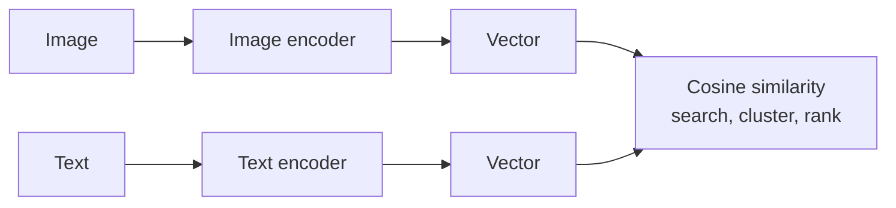

> **Learning objectives:** After this lesson, you will be able to tell apart two things that share the name "embedding" but serve completely different purposes, build a semantic search system over Vietnamese documents, and see in numbers the most dangerous trap of the usual way retrieval is implemented: a plain `topk` **always returns $k$ results**, even when the document collection contains no answer at all.

## 1. Two things with the same name, different jobs

Lesson 04 built the first step of every language model: each token is looked up as a vector. So by this lesson, when you hear "text embedding", it is very easy to assume it is the same thing.

It is not. And confusing the two leads to a search system that runs but is useless.

**Token embedding - the thing inside a language model.** It is a lookup table: each token in the vocabulary has exactly one vector. For Qwen2.5-0.5B, that table has size `config.vocab_size` times the number of dimensions:

```
151.936 × 896
```

That is 151,936 tokens, 896 numbers each. The key point: **this vector is fixed and has not seen any context.** The token `ngân` has the same vector whether it appears in "ngân hàng" (bank) or "ngân nga" (to hum). Only after passing through the attention layers of lessons 03 and 04 does the representation become context-dependent.

**Sentence embedding - the thing used for search.** It turns **an entire passage** into **a single** vector, and it is trained so that the cosine similarity between two vectors reflects how *close in meaning* the two passages are.

These are two different problems, so they are trained in two different ways. Taking a language model's token embeddings and averaging them for search is possible - but the results are much worse than a model trained specifically for the job.

This lesson uses `intfloat/multilingual-e5-small` - a multilingual embedding model that supports Vietnamese and produces **384-dimensional** vectors.

| | Token embedding (Qwen2.5-0.5B) | Sentence embedding (e5-small) |
|---|---|---|
| Input | one token | an entire passage |
| Output | 896-dimensional vector | **384-dimensional** vector |
| Context-dependent | **no** | yes |
| Used for | input to the later layers | measuring closeness in meaning between two passages |

> ⚠️ **A small note:** a smaller vector does not mean a worse one. Qwen's 896 dimensions must carry enough information for everything a language model does; e5's 384 dimensions only need to carry enough information to *compare two passages with each other*. A narrower problem needs fewer dimensions - in the same spirit as Machine Learning · Lesson 10 on dimensionality reduction.

## 2. Cosine similarity on Vietnamese

Take four sentences, two about machine learning and two about phở, and measure the cosine similarity of every pair - exactly the measure from Foundations · Lesson 07:

| | ML 1 | ML 2 | Phở 1 | Phở 2 |
|---|---|---|---|---|
| **Mô hình học máy cần dữ liệu để học.** (ML models need data to learn.) | 1.000 | **0.926** | 0.807 | 0.823 |
| **Thuật toán cần dữ liệu huấn luyện mới hoạt động được.** (Algorithms need training data to work.) | **0.926** | 1.000 | 0.808 | 0.821 |
| **Hôm nay tôi ăn phở bò ở Hà Nội.** (Today I ate beef phở in Hà Nội.) | 0.807 | 0.808 | 1.000 | **0.905** |
| **Bữa sáng của tôi là một bát phở.** (My breakfast is a bowl of phở.) | 0.823 | 0.821 | **0.905** | 1.000 |

The structure is clear: the two machine learning sentences are close at **0.926**, the two phở sentences at **0.905**, while cross-group pairs are only around 0.81. And look at the machine learning pair: they **share no words at all** apart from "cần" (need) and "dữ liệu" (data) - "mô hình" (model) versus "thuật toán" (algorithm), "học" (learn) versus "huấn luyện" (train). Keyword search would miss this; vector search does not.

But this table also reveals something you must know before using it: **the similarity floor is very high.** Two sentences with nothing to do with each other - one about machine learning, one about phở - still get 0.807. A threshold like "only accept results above 0.8" sounds very reasonable to anyone used to thinking of cosine as running from 0 to 1, but here it **accepts everything**.

Read this carefully: the table does **not** prove that thresholds are useless. On the contrary - for exactly these four sentences, a threshold around **0.85** separates them cleanly: the two same-topic pairs (0.926 and 0.905) are above, the four cross-group pairs (0.807-0.823) are below. What the table proves is something different and more important: **this model's cosine scale sits much higher than intuition suggests**, so a threshold chosen by feel will be wrong. Section 4 will show why the fact that 0.85 still splits a few real queries correctly is not enough to trust that it generalizes.

## 3. Building a retrieval system over 51 lessons

The corpus is the four chapters of this series already written: Foundations, Machine Learning, Deep Learning, Computer Vision. Splitting by section (`##`) and dropping passages that are too short gives **507 passages**.

```python
import torch, torch.nn.functional as F
from transformers import AutoTokenizer, AutoModel

tok = AutoTokenizer.from_pretrained("intfloat/multilingual-e5-small")
mdl = AutoModel.from_pretrained("intfloat/multilingual-e5-small").eval()

def encode(texts, prefix):                 # e5 needs the prefix "query: " or "passage: "
    e = tok([prefix + t for t in texts], padding=True, truncation=True,
            max_length=512, return_tensors="pt")
    with torch.no_grad():
        out = mdl(**e).last_hidden_state
    mask = e["attention_mask"].unsqueeze(-1).float()
    pooled_embeddings = (out * mask).sum(1) / mask.sum(1)      # ignore the padding
    return F.normalize(pooled_embeddings, dim=1)               # normalize so we can use cosine

corpus_embeddings = encode([d["noi_dung"] for d in docs], "passage: ")
query_embedding = encode(["IoU được tính như thế nào?"], "query: ")[0]
scores = corpus_embeddings @ query_embedding                                    # cosine with every passage
```

Three details in this code are all common places to go wrong:

**The `query:` and `passage:` prefixes.** The e5 model was trained with these two prefixes to distinguish "this is a question" from "this is a document". Drop them and the model still runs and still returns results - just worse ones. This is exactly the kind of silent error that Computer Vision · Lesson 01 ran into with image preprocessing.

**Masked averaging.** Passages have different lengths, so they must be padded to the same length; if you average over the padding too, short passages get diluted.

**Normalizing before multiplying.** After `F.normalize`, the dot product is exactly the cosine. Forget this step and the vector length creeps into the score - the same trap as CLIP in Computer Vision · Lesson 11.

Results on four questions:

| Question | Top passage | Score |
|---|---|---|
| Vì sao phải chia dữ liệu thành train, validation và test? (why split data into train, validation and test?) | Foundations · Lesson 04 | 0.907 |
| IoU được tính như thế nào? (how is IoU computed?) | Computer Vision · Lesson 07 | 0.861 |
| Kết nối tắt của ResNet giúp gì? (what do ResNet's skip connections help with?) | Computer Vision · Lesson 03 | 0.883 |
| Tokenizer làm tiếng Việt tốn bao nhiêu token? (how many tokens does a tokenizer cost Vietnamese?) | Foundations · Lesson 01 | **0.849** |

The first three hit exactly the right lesson. The fourth does not - and it is the most valuable row in the table.

## 4. `topk` still returns results when the store has no answer

The question "Tokenizer làm tiếng Việt tốn bao nhiêu token?" (how many tokens does a tokenizer cost Vietnamese?) is answered in **lesson 02 of this very chapter** - a lesson that was not yet in the corpus when the experiment ran. That means **the document collection does not contain the answer at all**.

The retriever still returns a passage, from Foundations · Lesson 01, with a score of **0.849**. That number is lower than the 0.861 of the IoU question that hit its target - but only lower by **0.012**, while those two searches are worlds apart: one hit exactly the right lesson, the other had no answer in the collection at all. To see how thin 0.012 is, compare it with the three hits themselves: they differ from each other by as much as **0.046** (0.861 to 0.907). In other words, the gap between *has an answer* and *has no answer* is smaller than the spread among the hits themselves.

The 0.85 threshold from section 2 *still* splits correctly here: 0.861 is above, 0.849 is below. But three queries with answers and one without are **far too few** to say anything about the stability or generalization of that threshold. A margin of 0.012 - thinner than the differences among the hits themselves - is a reason for caution, but on its own it does not prove the threshold will fail next time. To use a threshold in a real system, you have to calibrate it on a **large enough** set of positive and negative examples, with exactly the query-passage distribution the system will face - not on a few pairs of short sentences, because the shape of the data on the two sides is completely different.

The reason lies in the search operation we wrote: `topk` **always** returns $k$ elements. It has no notion of "not found" - it ranks the 507 passages by closeness and hands over the closest one, even when that closest passage is irrelevant.

This is a limitation of **the implementation**, not of the idea of retrieval. A retrieval system can absolutely be designed to **return nothing** - with a calibrated threshold, with a reranker, or with a separate step asking "does this passage contain the answer?". But if all you do is call `topk`, you will never get the answer "there is none".

Three consequences for real work:

**Do not pick a cosine threshold by intuition, and do not carry a threshold over from one dataset to another.** Section 2 showed a similarity floor around 0.81 even between two completely unrelated sentences, so 0.8 would accept everything. Section 4 shows something subtler: the 0.85 threshold carried from four toy sentences to real queries still splits correctly, but only with a margin of 0.012 on a score range just 0.058 wide - four measurements with a margin that thin are not enough grounds to trust that the threshold will hold at real scale. **The threshold must be calibrated on labeled data from your own domain and on exactly the kind of pairs the real system will compare** - query against passage, not sentence against sentence - using a set of positive and negative examples, just as Machine Learning · Lesson 12 chooses a threshold by cost.

**A high score does not mean correct.** We have met this three times in the series - Computer Vision · Lesson 01 with "wall clock 1.000", Computer Vision · Lesson 12 with "Trẩn" at confidence 1.000, and now a retrieval score of 0.849 for a question with no answer. The general principle: **a score the system assigns itself is not evidence of correctness.**

**Retrieval must be measured separately from generation.** If you only look at the final answer of a RAG system, you cannot distinguish "the model made it up" from "the model was given the wrong documents". Lesson 12 therefore evaluates the two layers separately. The right metric for the retrieval layer is **passage-level Recall@k** - but it requires labels that say exactly *which passage* contains the answer. Lesson 12's labels only say *which lesson*, so it measures **article hit@k**; lesson 12 states this explicitly and explains which kind of failure it hides.

> 🔧 **Try it now:** your company's internal search system returns plausible-looking results for every question, including questions about things the company has never done. How do you check it?
> Build a **labeled** question set: half are questions where you know for certain which document contains the answer, half are questions you know for certain are **not** in the collection. For the first half, measure how often the correct passage is among the top $k$ results - Recall@k if you label down to the passage level, article hit@k if the labels only go down to the document level. For the second half, see whether the system has any way to say "there is none"; if it always returns something with scores comparable to the first half, then the score itself cannot be used as a filter and you need another layer - for instance, having the language model read the retrieved passage and judge whether it contains the answer, exactly as lesson 12 does.

## 5. The same idea, a different kind of data

If this part sounds familiar, that is because you have seen it before. Computer Vision · Lesson 11 does exactly the same thing, except that the input is images:



The three things that chapter did with images - finding similar images, clustering without labels, classifying into a new set of classes - all work for text, with exactly the lines of code from section 3.

And CLIP in that lesson goes one step further: it puts **images and text into the same space**, so searching for images with a text description comes naturally. Seen from here, CLIP is not a technique specific to computer vision - it is the same idea as this lesson, extended to two kinds of data.

Lesson 12 takes the retrieval system just built as the first half of a question answering system: find the relevant passages first, then hand them to a language model to answer based on them.

## Lesson summary

- **Token embedding** (Qwen2.5-0.5B's 151,936 × 896 table) gives each token a **fixed, context-free** vector; it is the input to the later layers, not a search tool.
- **Sentence embedding** turns an entire passage into **one** vector (384 dimensions with e5-small), trained so that cosine carries closeness in meaning.
- On Vietnamese, two sentences on the same topic that **use completely different keywords** - "mô hình"/"thuật toán" (model/algorithm), "học"/"huấn luyện" (learn/train) - still reach a cosine of 0.926, while two sentences on different topics get only 0.807. Keyword search would miss this.
- But **the similarity floor is very high** (0.807 between two unrelated sentences), so **you cannot choose a threshold by intuition** - a reasonable-sounding number like 0.8 accepts everything. Thresholds are not useless: around 0.85 cleanly separates exactly the four sentences in section 2. The problem is that **you should not assume it carries over unchanged to another dataset** - in section 4 the same threshold still splits correctly, but only by **0.012**, thinner than the 0.046 spread among the hits themselves, and four queries are far too few to conclude anything about stability. To use a threshold, calibrate it on labeled data from your own domain, on exactly the kind of pairs the real system will compare.
- Three common implementation mistakes: forgetting the `query:`/`passage:` prefixes, averaging over the padding, and forgetting to normalize before multiplying.
- **`topk` always returns $k$ results, even when the collection contains no answer** - a question with no answer in the corpus still gets a score of **0.849**, only 0.012 below the lowest-scoring hit - while the three hits differ by as much as 0.046. With this few measurements, we cannot yet know whether the score itself can reliably separate those two situations.
- That is why **retrieval must be measured separately from generation**, with a question set where you know in advance where the answers are.
- This is the same idea as Computer Vision · Lesson 11, with images swapped for text; CLIP is the extension that puts both into one shared space.

## Self-check questions

1. Distinguish token embedding from sentence embedding on three criteria: input, whether it is context-dependent, and what it is used for.
2. Why can you not take a language model's token embeddings, average them, and use them for semantic search?
3. The two sentences "Mô hình học máy cần dữ liệu" and "Thuật toán cần dữ liệu huấn luyện" (ML models need data / algorithms need training data) reach a cosine of 0.926 even though their main keywords are completely different. What does that say about the difference between keyword search and vector search?
4. The 0.85 threshold cleanly separates the four sentences in section 2, and in section 4 it still splits correctly - but only with a margin of 0.012. Why are those four measurements not enough to trust the threshold? Describe how to calibrate a threshold properly.
5. Why is forgetting the `query:`/`passage:` prefixes a dangerous kind of error? Relate it to Computer Vision · Lesson 01.
6. A question with no answer in the corpus still gets a score of 0.849, only 0.012 below the lowest-scoring hit. Explain the cause from the very definition of `topk`, and describe how to design a retrieval system that **can return nothing**.
7. You have a RAG system that answers wrongly. Name two completely different causes, and how to design a measurement that tells you which one it is.

## Further reading

**Foundational sources for this lesson:**

| Source | What to read |
|---|---|
| **Foundations · Lesson 07** | Cosine similarity - the measure used throughout this lesson |
| **Computer Vision · Lesson 11** | Representation learning with images: retrieval, clustering, and CLIP |
| **Lesson 04 of this chapter** | Where token embeddings sit inside a Transformer |
| **Machine Learning · Lesson 10** | PCA and the idea of compressing a representation into fewer dimensions |

**Additional online sources (free):**

- [Wang et al. - Text Embeddings by Weakly-Supervised Contrastive Pre-training (E5, 2022)](https://arxiv.org/abs/2212.03533) - the model used in this lesson, and the reason for the `query:`/`passage:` prefixes.
- [Reimers & Gurevych - Sentence-BERT (EMNLP 2019)](https://arxiv.org/abs/1908.10084) - the foundational paper for sentence embeddings, explaining why averaging raw BERT token embeddings works poorly.
- [Massive Text Embedding Benchmark (MTEB)](https://huggingface.co/spaces/mteb/leaderboard) - a leaderboard comparing embedding models, with a multilingual section to consult when choosing a model for Vietnamese.
- [FAISS](https://github.com/facebookresearch/faiss) - a library for nearest-vector search at the scale of millions; for 507 passages a matrix multiplication is enough, but a large collection needs it.
- [`sentence-transformers`](https://www.sbert.net/) - a library that wraps all of the code in section 3, convenient when you do not need control over every step.

> **Next lesson:** [Diffusion Models: Generating Images from Noise](../image-generation-models/) - the first ten lessons all generate **text**, one token at a time, from left to right. The next lesson changes the way of generating entirely: start from a frame of pure noise and remove the noise step by step - and we will train a small diffusion model ourselves to see that mechanism actually work.
