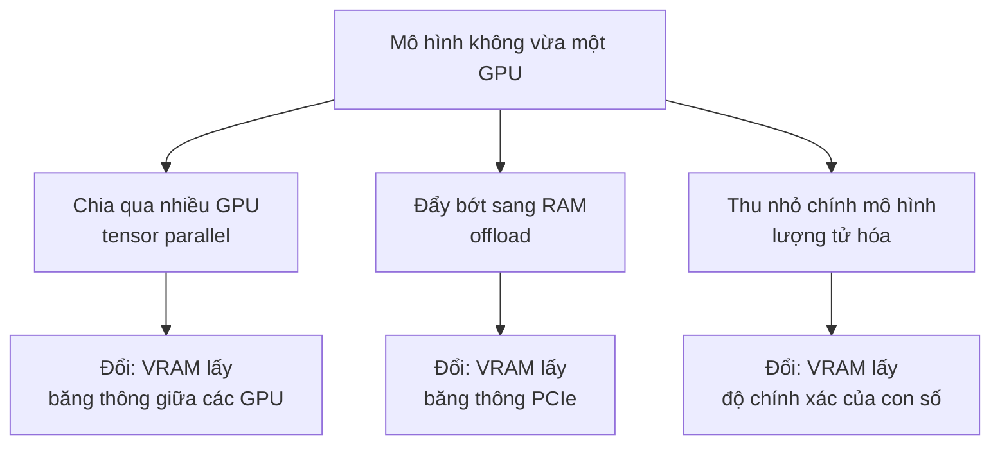

> **Mục tiêu bài học:** Sau bài này, bạn sẽ biết ba lối thoát khi mô hình lớn hơn card - chia qua nhiều GPU, đẩy bớt sang RAM, thu nhỏ chính mô hình - đo được cái giá của từng lối trên đúng phần cứng này, hiểu vì sao với lượng tử hóa thì **nhân tính toán** quan trọng không kém số bit, và quét được biên bộ nhớ của bản 7B sau khi nó đã vừa - kể cả loại biên làm bộ máy sập hẳn.

Bài 03 kết thúc bằng một phép trừ: trọng số bản 7B là **15,23 GB**, card là **12,49 GB**, thiếu **2,74 GB** trước khi có bất kỳ người dùng nào.

Thiếu chỗ thì có ba lối ra. Chương này đặt mục tiêu chạy trên **một** card, nên cuối cùng sẽ chọn một lối - nhưng trước khi chọn, đo cả ba.

## 1. Ba lối thoát



Mỗi lối **đổi** một thứ khan hiếm lấy một thứ khác. Chọn lối nào tùy vào thứ bạn có dư: có thêm GPU tốt thì chia; có RAM mà không vội thì đẩy; chỉ có đúng một card thì thu nhỏ.

## 2. Lối thứ nhất: chia qua hai card

Máy này có hai RTX 3060. Chia đôi trọng số là 7,6 GB mỗi card - vừa. Bộ máy phục vụ ở bài 08 hỗ trợ sẵn cách chia này: mỗi lớp được cắt đôi theo chiều ngang, mỗi card tính một nửa, rồi hai card **cộng kết quả với nhau** sau mỗi khối attention và mỗi khối MLP.

Chữ in đậm là chỗ phải hỏi trước khi đo tốc độ: **hai card nói chuyện với nhau qua đường nào, nhanh bao nhiêu?**

| Kiểm | Kết quả trên máy này |
|---|---|
| `nvidia-smi topo -m` | **PHB** - hai card nối qua cầu PCIe của CPU, không có cầu nối trực tiếp |
| `nvidia-smi topo -p2p r` | **CNS** - *chipset not supported*: không cho hai card đọc bộ nhớ của nhau |
| `torch.cuda.can_device_access_peer(0, 1)` | **False** |
| Chép 512 MiB từ card 0 sang card 1 | **2,79 GB/s** - vì phải vòng qua RAM |

Bộ máy cũng tự nhận ra điều này và ghi vào log: *"Custom allreduce is disabled because your platform lacks GPU P2P capability."*

Mỗi token, mỗi lớp cần hai lần cộng kết quả giữa hai card; mỗi lần gửi một vector 3.584 chiều ở 16-bit, tức 7 KiB. Với 28 lớp là khoảng **392 KiB mỗi token**. Ở 2,79 GB/s, khoảng ấy mất cỡ **0,14 ms** mỗi token nếu chỉ tính băng thông - nhỏ so với 15-17 ms mỗi token của pha sinh. Nhưng đó là **ước lượng**, và nó bỏ qua độ trễ của 56 lần gửi nhỏ mỗi token, mỗi lần phải vòng qua CPU. Bài này **không đo được** con số thật - lý do ở ngay dưới.

**Lần thử thứ nhất:** bộ máy nạp được **7,12 GiB** trọng số lên mỗi card trong 60,4 giây, dựng xong vùng KV cho **100.256 token** - gần gấp rưỡi một card - rồi **hết bộ nhớ** ở bước chuẩn bị nhân tính toán ngay sau đó, và treo luôn trong khi vẫn giữ khoảng 11,5 GB trên **cả hai** card.

**Lần thử thứ hai không chạy.** Card 0 của máy này đang chạy một dịch vụ của người khác. Lần treo ở trên đã giữ bộ nhớ của card ấy khoảng 4 phút trước khi được dừng; kiểm lại sau đó thì dịch vụ kia không bị ảnh hưởng, nhưng chạy lại là lặp lại rủi ro ấy trên tài nguyên không phải của mình, nên cần sự đồng ý của người quản lý máy trước.

Nên phần này kết luận được đúng ba điều. Một, về bộ nhớ thì chia hai **vừa**. Hai, đường liên lạc giữa hai card trên máy này **đi vòng qua RAM ở 2,79 GB/s**, không có đường tắt. Ba, thông lượng thật của cách chia này **chưa đo**. Điều không kết luận được là "chậm vì không có cầu nối trực tiếp" - ước lượng ở trên cho thấy ở batch nhỏ, băng thông có thể không phải vấn đề chính.

Còn một bài học rộng hơn mà cả phần này minh họa: **thêm GPU không miễn phí**. Nó đòi đường liên lạc tốt giữa các card, đòi bộ máy dựng được mà không hết bộ nhớ, và đòi **card ấy phải là của bạn**.

## 3. Lối thứ hai: đẩy bớt sang RAM

Ý tưởng: giữ trên GPU những gì vừa, phần còn lại để ở RAM, và **chép qua PCIe từng lớp một** mỗi khi cần tính tới lớp ấy.

Bố trí trên card 12 GB: bảng embedding, lớp chuẩn hóa cuối và lớp đầu ra (**2,18 GB**) cộng **13 trong 28 lớp** ở lại GPU; **15 lớp** còn lại, mỗi lớp **0,466 GB**, nằm trong RAM. Mỗi token sinh ra phải chép **6,99 GB** qua PCIe.

Trước khi đo tốc độ sinh, đo đường ống:

| | Giá trị |
|---|---|
| PCIe, RAM → GPU, bộ nhớ ghim (*pinned*) | **3,26 GB/s** |
| PCIe, RAM → GPU, bộ nhớ thường | 2,84 GB/s |

Dự đoán: nếu chép là việc duy nhất tốn thời gian thì trần tốc độ là $3{,}26 \div 6{,}99 \approx$ **0,47 token/s**.

Đo thật: **0,46 token/s** - TPOT **2.191 ms**, TTFT 2,19 s, VRAM thường trú 7,69 GiB, đỉnh 8,14 GiB.

Dự đoán khớp số đo tới 2%. Đây là cùng lối lập luận của bài 01 - pha sinh token bị chặn bởi việc đọc trọng số - chỉ khác là giờ "bộ nhớ" phải đọc là RAM ở đầu kia sợi PCIe, chậm hơn VRAM gần trăm lần. Biết một con số băng thông là đoán được tốc độ.

Con số 3,26 GB/s thấp hơn nhiều so với mức lý thuyết của một khe PCIe đời mới đầy đủ làn. Đó là thứ khe cắm và cách đấu nối của máy này cho ra; bài không đi tìm nguyên nhân, chỉ ghi nhận: **trên máy này, đẩy sang RAM đắt gấp khoảng 147 lần** so với lối thứ ba ở mục 4 (0,46 so với 67,7 token/s).

Lối này có một chỗ dùng được: **gộp lô**. Mỗi lần chép trọng số qua PCIe phục vụ được bao nhiêu chuỗi cũng được - y hệt lý do gộp lô có lợi ở bài 05. Chạy 60 câu hỏi của mục 4 thành **một lô** qua đúng cách này mất **57,9 giây** cho cả 60 câu - khoảng 1 giây mỗi câu, trong khi chạy từng câu một thì riêng **mỗi token** đã tốn 2,2 giây. Mỗi bước vẫn chậm y như cũ; chỉ là giờ mỗi bước phục vụ 60 chuỗi. Không dùng được cho người ngồi chờ, nhưng dùng được cho một việc xử lý hàng loạt chạy qua đêm.

## 4. Lối thứ ba: thu nhỏ mô hình

**Lượng tử hóa** (*quantization*) lưu trọng số bằng ít bit hơn - ở đây 4 bit thay vì 16 - kèm các hệ số tỉ lệ để khôi phục gần đúng giá trị gốc khi tính. Bản `Qwen2.5-7B-Instruct-AWQ` tải về chỉ **5,57 GB**; nạp lên GPU chiếm **5,2 GiB**, vừa một card và còn chỗ cho KV cache.

### Nhân tính toán quan trọng không kém số bit

Lần chạy đầu tiên của tôi cho **6,5 token/s** ở batch 1 - chậm hơn cả bản 1.5B ở bài 01. Lý do nằm ngay trong log của bộ máy:

```
Detected that the model can run with awq_marlin, however you specified
quantization=awq explicitly, so forcing awq. Use quantization=awq_marlin
for faster inference
```

Tôi đã truyền `quantization="awq"` một cách tường minh, và bộ máy làm đúng lời: dùng nhân tính toán AWQ cũ thay vì nhân **Marlin** mới hơn. Cùng một checkpoint, chỉ đổi một chữ trong cấu hình:

| Nhân tính toán | Batch 1 (tok/s) | Batch 32 (tok/s) | Chất lượng (60 việc) |
|---|---|---|---|
| `awq` - ép tường minh | 6,5 | 203,9 | 57 / 60 |
| `awq_marlin` | **67,7** | **1.146,0** | 57 / 60 |

**Nhanh hơn 10,4 lần ở batch 1 và 5,6 lần ở batch 32.** Và 60 trên 60 câu trả lời **giống hệt nhau từng ký tự** giữa hai nhân - cùng trọng số, cùng giải mã tất định, nên nhân chỉ đổi tốc độ, không đổi một chữ nào của đầu ra. Hai nhân sai đúng cùng ba phép nhân: 71 × 86 ra 6126 thay vì 6106, 89 × 21 ra 1849 thay vì 1869, 74 × 65 ra 4710 thay vì 4810.

Bài học: "đã lượng tử hóa 4 bit" chưa nói gì về tốc độ. Phải hỏi **chạy bằng nhân nào**, và phải **đọc log** của bộ máy - nó thường biết trước bạn.

### Ba cấu hình triển khai

Giờ so bản đã thu nhỏ với bản gốc. Bộ việc là **60 câu có đáp án**: 30 phép cộng ba chữ số, 20 phép nhân hai chữ số, 10 câu hỏi sự thật. Chấm tự động, bỏ dấu tiếng Việt trước khi so.

| Cấu hình | Cách chạy | Trọng số trên GPU | Batch 1 (tok/s) | Batch 32 (tok/s) | Đúng / 60 | Cộng / 30 | Nhân / 20 | Sự thật / 10 |
|---|---|---|---|---|---|---|---|---|
| **bf16** - bản gốc | `transformers`, đẩy sang RAM | 7,69 GiB, cộng 7 GB trong RAM | 0,46 | - | **58** | 29 | **19** | 10 |
| **AWQ** 4-bit | vLLM, nhân Marlin | 5,2 GiB | 67,7 | 1.146,0 | 57 | **30** | 17 | 10 |
| **GPTQ** 4-bit | vLLM, nhân Marlin | 5,18 GiB | **68,8** | **1.312,1** | 55 | 29 | 16 | 10 |

Trên 60 câu này, ba cấu hình chênh nhau **một tới ba câu**. Bộ đánh giá nhỏ và hẹp - phép cộng, phép nhân, câu hỏi sự thật ngắn - nên chưa đủ để xếp hạng ba cấu hình **nói chung**.

Nhìn vào từng câu còn rõ hơn. Bản bf16 và bản AWQ cho câu trả lời **giống hệt nhau ở 55 trên 60 câu**. Ở ba câu mà một bên đúng một bên sai, **không phải lúc nào bf16 cũng là bên đúng**: AWQ sai hai phép nhân mà bf16 làm đúng (89 × 21 và 74 × 65), nhưng bf16 lại trả lời 205 + 695 là **800** - sai - trong khi AWQ ra đúng 900. Khác biệt đi theo **cả hai hướng**. Nên không thể quy mọi lỗi của bản 4-bit cho lượng tử hóa - chính bản gốc cũng sai số học - nhưng cũng không thể nói lượng tử hóa không tạo ra khác biệt: hai phép nhân mà bản gốc làm đúng còn AWQ làm sai cho thấy cấu hình lượng tử hóa **có thể** tạo ra khác biệt hành vi - nhưng phép so này không cô lập được thành phần nào gây ra chúng: việc làm tròn trọng số, quy trình lượng tử hóa, nhân tính toán, hay chính việc hai bản chạy qua hai bộ máy khác nhau.

Nên kết luận được là: **trên bộ việc này, không thấy dấu hiệu bản 4-bit kém đi đáng kể**. Kết luận **không** được là "4-bit không mất gì": 60 câu ngắn không đo được những chỗ lượng tử hóa hay làm hỏng - suy luận nhiều bước, kiến thức hiếm, văn bản dài. Muốn biết thì phải đo trên đúng loại việc hệ của bạn sẽ làm.

GPTQ nhanh hơn AWQ **14%** ở batch 32 và kém hai câu - một lần chạy, một bộ việc nhỏ. Cả hai đều dùng được; chương này giữ AWQ vì nó là cấu hình đã đo kỹ nhất ở các bài trước.

> ⚠️ **Gọi đúng tên phép so sánh này.** Đây là **so ba cấu hình triển khai**, không phải thí nghiệm "4 bit mất bao nhiêu so với 16 bit". AWQ và GPTQ khác nhau ở thuật toán lượng tử hóa, ở dữ liệu dùng để hiệu chỉnh, ở cỡ nhóm trọng số chung một hệ số tỉ lệ, và ở nhân tính toán; bản bf16 lại chạy qua một bộ máy khác (`transformers` với offload) so với hai bản kia (vLLM). Muốn đo riêng tác động của **số bit** thì phải tự lượng tử hóa cùng một mô hình bằng cùng một quy trình ở nhiều mức bit - việc bài này không làm. Và 60 câu là một bộ nhỏ: chênh một tới ba câu chưa đủ để kết luận thứ hạng tổng quát.

## 5. Giờ mới quét được biên bộ nhớ

Bài 03 cố tình không quét `batch × độ dài` vì mô hình chưa nạp nổi. Giờ bản AWQ đã vừa, quét được - và việc quét lộ ra **hai loại biên** khác hẳn nhau.

### Loại thứ nhất: bộ máy sập

Lần quét đầu dùng mức mặc định `gpu_memory_utilization = 0.9`. Điểm đầu tiên - 4 yêu cầu, ngữ cảnh 2.048 - chạy tốt. Điểm thứ hai - **8 yêu cầu × 1.920 token nạp cùng lúc** - **hết bộ nhớ và bộ máy chết**.

Không phải vì thiếu chỗ KV: bộ máy vừa báo có chỗ cho 76.208 token, còn 8 × 2.048 chỉ là 16.384. Nó chết vì **hoạt hóa tạm thời** của một lượt nạp prompt lớn không vừa phần bộ nhớ nằm ngoài ngân sách 90% mà bộ máy tự dành. Chính log khởi động đã cảnh báo trước: phiên bản này **chưa tính bộ nhớ của đồ thị tính toán dựng sẵn** vào ngân sách.

Chương này gặp đúng kiểu lỗi ấy thêm hai lần ở các bài sau - bài 09 khi nạp 8 prompt dài cùng lúc, và bài 11 khi 193 yêu cầu chạy đồng thời làm một tensor tạm cỡ logits ở bước lấy mẫu vượt quá chỗ còn lại. Ba lần, cùng một bài học: **ngân sách bộ nhớ của bộ máy cũng có thể sai**, và trên một card nhỏ, để dư một khoảng là việc bắt buộc.

### Loại thứ hai: bộ máy xoay xở, thông lượng sập

Hạ xuống **0,8**, bộ máy báo có chỗ cho **56.192 token** KV. Vậy biên dự đoán là: $\text{số yêu cầu} \times \text{ngữ cảnh} = 56.192$. Mỗi yêu cầu sinh 128 token.

| Ngữ cảnh | Yêu cầu đồng thời | Token KV cần | Đẩy ra rồi tính lại | Token ra / giây | Thời gian (s) |
|---|---|---|---|---|---|
| 2.048 | 16 | 32.768 | 0 | 181,7 | 11,3 |
| 2.048 | **24** | 49.152 | **0** | **245,7** | 12,5 |
| 2.048 | **32** | 65.536 | **2** | 247,0 | 16,6 |
| 2.048 | 48 | 98.304 | 2 | **103,2** | 59,5 |
| 4.096 | **8** | 32.768 | **0** | **139,9** | 7,3 |
| 4.096 | **16** | 65.536 | **1** | 112,0 | 18,3 |
| 4.096 | 24 | 98.304 | 1 | **50,8** | 60,5 |
| 4.096 | 48 | 196.608 | 3 | 50,8 | 120,9 |

Biên dự đoán nằm ở khoảng **27 yêu cầu** với ngữ cảnh 2.048 và **13,7 yêu cầu** với ngữ cảnh 4.096. Việc **đẩy yêu cầu ra rồi tính lại** (*preemption*) bắt đầu **đúng giữa hai điểm quét bao quanh biên ấy**, ở cả hai độ dài. Một con số engine tự báo, một phép chia - và biên hiện ra đúng chỗ.

Vượt biên, bộ máy không sập. Nó không nhận thêm yêu cầu khi hết chỗ KV, và khi các yêu cầu đang chạy dài ra mà hết chỗ thì đẩy bớt một yêu cầu ra để tính lại sau. Kết quả là **thông lượng sập**: ở ngữ cảnh 4.096, từ 139,9 xuống khoảng **50** token mỗi giây, tức mất **64%**, và nhiều yêu cầu hơn gấp ba lần thì mất gấp tám lần thời gian.

Hai loại biên đòi hai cách phòng khác nhau. Biên loại một là **sự cố** - dịch vụ chết - phòng bằng cách để dư bộ nhớ. Biên loại hai là **vực hiệu năng** - dịch vụ sống nhưng chậm hẳn - phòng bằng cách giới hạn số yêu cầu đồng thời theo đúng phép chia ở trên, và theo dõi mức dùng KV cache như bài 11 sẽ làm.

## 6. Chọn lối nào

| Lối | Được | Mất | Hợp khi |
|---|---|---|---|
| Chia qua nhiều GPU | Giữ nguyên độ chính xác | Cần card thứ hai, đường liên lạc tốt, và bộ máy dựng thành công | Bạn sở hữu nhiều GPU nối với nhau tốt |
| Đẩy sang RAM | Chạy được mô hình lớn hơn card rất nhiều | Chậm khoảng 147 lần trên máy này | Xử lý hàng loạt, gộp lô lớn, không ai ngồi chờ |
| Lượng tử hóa | Vừa một card, nhanh | Độ chính xác của con số, và phải chọn đúng nhân | Mục tiêu một card, có người ngồi chờ |

Mục tiêu của chương là một card, có người dùng thật đang chờ - nên từ đây trở đi, mọi bài chạy **bản AWQ với nhân Marlin**.

## Tóm tắt bài học

- Mô hình không vừa card có **ba lối**: chia qua nhiều GPU, đẩy bớt sang RAM, thu nhỏ bằng lượng tử hóa. Mỗi lối đổi VRAM lấy một thứ khác - băng thông giữa các GPU, băng thông PCIe, độ chính xác của con số.
- **Chia qua hai card**: về bộ nhớ thì vừa (7,12 GiB mỗi card). Nhưng trên máy này hai card **không đọc được bộ nhớ của nhau** (`CNS`, `can_device_access_peer = False`), mọi liên lạc vòng qua RAM ở **2,79 GB/s**. Lần thử đầu hết bộ nhớ ở bước chuẩn bị nhân tính toán; lần thử hai không chạy vì card còn lại đang phục vụ người khác. Thông lượng thật **chưa đo** - và không được suy ra "chậm vì thiếu cầu nối" từ những gì đã có.
- **Đẩy sang RAM**: 15 lớp nằm trong RAM, **6,99 GB** phải qua PCIe cho mỗi token. PCIe đo được **3,26 GB/s** nên dự đoán **0,47 token/s**; đo thật **0,46**. Chậm hơn lượng tử hóa khoảng **147 lần**, nhưng gộp lô lớn thì dùng được cho việc chạy nền.
- **Lượng tử hóa**: bản AWQ 4-bit nạp chiếm **5,2 GiB**. **Nhân tính toán đổi tốc độ 10,4 lần** mà không đổi chữ nào của đầu ra: `awq` 6,5 tok/s, `awq_marlin` **67,7 tok/s** ở batch 1, cả hai 57/60 và giống hệt 60/60. Đọc log của bộ máy - nó đã cảnh báo trước.
- **Ba cấu hình** trên 60 việc: bf16 **58**, AWQ **57**, GPTQ **55** - chênh một tới ba câu trên một bộ nhỏ và hẹp, chưa đủ để xếp hạng nói chung; bf16 và AWQ giống hệt 55/60 câu, và khác biệt đi theo cả hai hướng. Không thấy dấu hiệu 4-bit kém đi đáng kể **trên bộ việc này** - không có nghĩa là không mất gì. Đây là **so ba cấu hình triển khai**, không phải đo riêng tác động của số bit.
- **Hai loại biên bộ nhớ**: ở mức 0,9, lượt nạp 8 × 1.920 token làm **bộ máy chết** vì hoạt hóa tạm thời vượt phần nằm ngoài ngân sách - ngân sách của bộ máy cũng có thể sai. Ở 0,8, bộ máy có chỗ cho **56.192 token** KV, và việc đẩy ra rồi tính lại bắt đầu **đúng tại** biên dự đoán `số yêu cầu × ngữ cảnh = 56.192`; vượt biên thì thông lượng mất tới **64%**.
- Từ bài này trở đi, chương dùng **bản AWQ với nhân Marlin** trên một card.

## Câu hỏi tự kiểm tra

1. Mỗi lối trong ba lối đổi VRAM lấy thứ gì? Với mỗi lối, nêu một tình huống nó là lựa chọn đúng.
2. Trước khi đo tốc độ của cách chia mô hình qua hai GPU, bạn nên kiểm những gì về đường liên lạc giữa hai card? Nêu lệnh cụ thể.
3. Ước lượng ở mục 2 cho thấy băng thông giữa hai card chỉ tốn khoảng 0,14 ms mỗi token ở batch 1. Vì sao ước lượng ấy vẫn chưa đủ để kết luận cách chia này nhanh?
4. Với cách đẩy sang RAM, bạn dự đoán được tốc độ sinh từ đúng một con số đo. Đó là con số nào, và vì sao dự đoán lại khớp tới 2%?
5. Vì sao gộp lô lớn làm cách đẩy sang RAM trở nên dùng được cho việc chạy nền, dù mỗi bước vẫn chậm y như cũ?
6. Hai nhân `awq` và `awq_marlin` cho đầu ra giống hệt 60/60 nhưng tốc độ chênh 10 lần. Giải thích vì sao hai điều này không mâu thuẫn.
7. Vì sao so bf16, AWQ và GPTQ trong bài chỉ được gọi là "so ba cấu hình triển khai"? Thiết kế một thí nghiệm đo riêng tác động của số bit.
8. Phân biệt hai loại biên bộ nhớ ở mục 5: mỗi loại trông thế nào khi xảy ra, và phòng bằng cách nào?
9. Với ngữ cảnh 3.000 token và vùng KV 56.192 token, bạn nên giới hạn số yêu cầu đồng thời ở khoảng bao nhiêu? Vì sao nên để thấp hơn con số tính ra?

## Đọc thêm

**Nguồn nền tảng của bài:**

| Nguồn | Đọc phần nào |
|---|---|
| **Bài 03 của chương này** | Phép trừ 15,23 − 12,49 GB, và giải phẫu bộ nhớ bốn khoản |
| **Bài 01 của chương này** | Pha sinh token bị chặn bởi việc đọc trọng số - cùng lập luận dự đoán tốc độ ở mục 3 |
| **Bài 02 của chương này** | Công thức KV cache 56 KiB/token dùng để kiểm con số engine báo |

**Đi sâu hơn:**

- [Lin et al. - AWQ: Activation-aware Weight Quantization for LLM Compression and Acceleration (MLSys 2024)](https://arxiv.org/abs/2306.00978) - thuật toán lượng tử hóa của checkpoint chính trong bài.
- [Frantar et al. - GPTQ: Accurate Post-Training Quantization for Generative Pre-trained Transformers (ICLR 2023)](https://arxiv.org/abs/2210.17323) - thuật toán của cấu hình thứ ba.
- [Frantar et al. - MARLIN: Mixed-Precision Auto-Regressive Parallel Inference on Large Language Models (2024)](https://arxiv.org/abs/2408.11743) - nhân tính toán làm bản AWQ nhanh lên 10 lần ở mục 4.
- [Shoeybi et al. - Megatron-LM: Training Multi-Billion Parameter Language Models Using Model Parallelism (2019)](https://arxiv.org/abs/1909.08053) - cách chia từng lớp qua nhiều GPU ở mục 2, và vì sao mỗi lớp cần cộng kết quả giữa các card.

**Mã nguồn của bài:** [`code/b04_vllm.py`](../../code/ai-systems/b04_vllm.py) - một cấu hình qua vLLM: bộ nhớ, tốc độ, chất lượng; [`code/b04_offload.py`](../../code/ai-systems/b04_offload.py) - đẩy lớp sang RAM, dự đoán rồi đo; [`code/b04_p2p.py`](../../code/ai-systems/b04_p2p.py) - kiểm đường liên lạc giữa hai GPU; [`code/b04_bien.py`](../../code/ai-systems/b04_bien.py) - quét biên bộ nhớ; [`code/b04_chatluong_bf16.py`](../../code/ai-systems/b04_chatluong_bf16.py) - mốc chất lượng của bản bf16.

> **Bài tiếp theo:** [Gộp lô tĩnh](../static-batching-vi/) - bản 7B đã vừa một card. Bài sau hỏi câu tiếp theo: một card phục vụ được bao nhiêu người cùng lúc - và vì sao chạy nhiều yêu cầu một lượt làm thông lượng tăng gần như miễn phí, cho tới một vùng ước lượng trước được.
