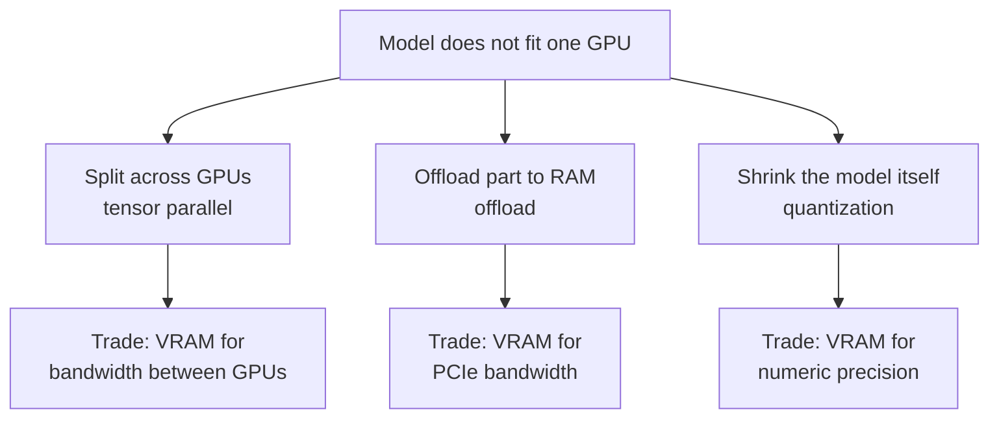

> **Learning objectives:** After this lesson, you will know three ways out when a model is bigger than the GPU - splitting across GPUs, offloading part of it to RAM, shrinking the model itself - be able to measure the cost of each on this same hardware, understand why with quantization the **compute kernel** matters as much as the bit width, and be able to sweep the memory boundary of the 7B model once it fits - including the kind of boundary that crashes the engine outright.

Lesson 03 ended with a subtraction: the 7B model's weights are **15.23 GB**, the GPU is **12.49 GB**, **2.74 GB** short before there is any user at all.

When space runs out there are three ways out. This chapter sets the goal of running on **one** GPU, so in the end it will pick one way - but before picking, it measures all three.

## 1. Three ways out



Each way **trades** one scarce resource for another. Which one you choose depends on what you have in surplus: more good GPUs, then split; RAM and no rush, then offload; exactly one GPU, then shrink.

## 2. The first way: splitting across two GPUs

This machine has two RTX 3060s. Splitting the weights in half gives 7.6 GB per GPU - it fits. The serving engine in lesson 08 supports this kind of split out of the box: each layer is cut in half horizontally, each GPU computes one half, and then the two GPUs **sum their results together** after every attention block and every MLP block.

The bold text is what you must ask before measuring speed: **what path do the two GPUs talk to each other over, and how fast is it?**

| Check | Result on this machine |
|---|---|
| `nvidia-smi topo -m` | **PHB** - the two GPUs connect through the CPU's PCIe bridge, no direct bridge |
| `nvidia-smi topo -p2p r` | **CNS** - *chipset not supported*: the two GPUs are not allowed to read each other's memory |
| `torch.cuda.can_device_access_peer(0, 1)` | **False** |
| Copy 512 MiB from GPU 0 to GPU 1 | **2.79 GB/s** - because it has to detour through RAM |

The engine also detects this by itself and writes it to the log: *"Custom allreduce is disabled because your platform lacks GPU P2P capability."*

For each token, each layer needs two result sums between the two GPUs; each one sends a 3,584-dimensional vector at 16-bit, which is 7 KiB. With 28 layers that is about **392 KiB per token**. At 2.79 GB/s, that takes about **0.14 ms** per token if you count only bandwidth - small compared with the 15-17 ms per token of decode. But that is an **estimate**, and it ignores the latency of 56 small sends per token, each of which has to detour through the CPU. This lesson **could not measure** the real number - the reason is right below.

**The first attempt:** the engine loaded **7.12 GiB** of weights onto each GPU in 60.4 seconds, built the KV region for **100,256 tokens** - nearly one and a half times that of a single GPU - then **ran out of memory** at the compute kernel preparation step right after, and hung while still holding about 11.5 GB on **both** GPUs.

**The second attempt did not run.** GPU 0 on this machine is running someone else's service. The hang above held that GPU's memory for about 4 minutes before it was stopped; checking afterwards, the other service was not affected, but running again would repeat that risk on resources that are not mine, so the machine administrator's permission is needed first.

So this section can conclude exactly three things. One, in terms of memory, splitting in two **fits**. Two, the communication path between the two GPUs on this machine **detours through RAM at 2.79 GB/s**, with no shortcut. Three, the real throughput of this split **has not been measured**. What cannot be concluded is "slow because there is no direct bridge" - the estimate above shows that at small batch sizes, bandwidth may not be the main problem.

There is a broader lesson this whole section illustrates: **adding GPUs is not free**. It requires a good communication path between the GPUs, requires an engine that can be built without running out of memory, and requires **the GPU to be yours**.

## 3. The second way: offloading to RAM

The idea: keep on the GPU whatever fits, leave the rest in RAM, and **copy it over PCIe one layer at a time** whenever computation reaches that layer.

The layout on the 12 GB GPU: the embedding table, the final normalization layer and the output layer (**2.18 GB**) plus **13 of the 28 layers** stay on the GPU; the remaining **15 layers**, each **0.466 GB**, sit in RAM. Every generated token has to copy **6.99 GB** over PCIe.

Before measuring decode speed, measure the pipe:

| | Value |
|---|---|
| PCIe, RAM → GPU, pinned memory | **3.26 GB/s** |
| PCIe, RAM → GPU, regular memory | 2.84 GB/s |

Prediction: if copying is the only thing that takes time, the speed ceiling is $3.26 \div 6.99 \approx$ **0.47 tokens/s**.

Measured: **0.46 tokens/s** - TPOT **2,191 ms**, TTFT 2.19 s, resident VRAM 7.69 GiB, peak 8.14 GiB.

The prediction matches the measurement to within 2%. This is the same line of reasoning as lesson 01 - decode is limited by reading weights - except that now the "memory" to read is RAM at the other end of the PCIe link, nearly a hundred times slower than VRAM. Know one bandwidth number and you can predict the speed.

The 3.26 GB/s figure is much lower than the theoretical rate of a modern full-lane PCIe slot. That is what this machine's slots and wiring deliver; the lesson does not look for the cause, it just records it: **on this machine, offloading to RAM is about 147 times more expensive** than the third way in section 4 (0.46 versus 67.7 tokens/s).

This way has one use: **batching**. Each weight copy over PCIe can serve any number of sequences - exactly the reason batching pays off in lesson 05. Running the 60 questions from section 4 as **one batch** this same way takes **57.9 seconds** for all 60 - about 1 second per question, whereas running one question at a time costs 2.2 seconds for **each token** alone. Each step is just as slow as before; it is just that now each step serves 60 sequences. Not usable for someone sitting and waiting, but usable for a batch processing job running overnight.

## 4. The third way: shrinking the model

**Quantization** stores weights with fewer bits - here 4 bits instead of 16 - together with scale factors to approximately restore the original values during computation. The `Qwen2.5-7B-Instruct-AWQ` model downloads at only **5.57 GB**; loaded onto the GPU it takes **5.2 GiB**, fitting one GPU with room left for the KV cache.

### The compute kernel matters as much as the bit width

My first run gave **6.5 tokens/s** at batch 1 - slower even than the 1.5B model in lesson 01. The reason was right there in the engine's log:

```
Detected that the model can run with awq_marlin, however you specified
quantization=awq explicitly, so forcing awq. Use quantization=awq_marlin
for faster inference
```

I had passed `quantization="awq"` explicitly, and the engine did exactly as told: it used the old AWQ compute kernel instead of the newer **Marlin** kernel. Same checkpoint, changing only one word in the config:

| Compute kernel | Batch 1 (tok/s) | Batch 32 (tok/s) | Quality (60 tasks) |
|---|---|---|---|
| `awq` - forced explicitly | 6.5 | 203.9 | 57 / 60 |
| `awq_marlin` | **67.7** | **1,146.0** | 57 / 60 |

**10.4 times faster at batch 1 and 5.6 times faster at batch 32.** And 60 out of 60 answers are **identical character for character** between the two kernels - same weights, same deterministic decoding, so the kernel only changes speed, not a single character of output. Both kernels get the same three multiplications wrong: 71 × 86 gives 6126 instead of 6106, 89 × 21 gives 1849 instead of 1869, 74 × 65 gives 4710 instead of 4810.

The lesson: "quantized to 4 bits" says nothing yet about speed. You have to ask **which kernel it runs on**, and you have to **read the engine's log** - it often knows before you do.

### Three deployment configurations

Now compare the shrunk model with the original. The task set is **60 questions with known answers**: 30 three-digit additions, 20 two-digit multiplications, 10 factual questions. Graded automatically, stripping Vietnamese diacritics before comparing.

| Configuration | How it runs | Weights on GPU | Batch 1 (tok/s) | Batch 32 (tok/s) | Correct / 60 | Add / 30 | Multiply / 20 | Facts / 10 |
|---|---|---|---|---|---|---|---|---|
| **bf16** - original | `transformers`, offloading to RAM | 7.69 GiB, plus 7 GB in RAM | 0.46 | - | **58** | 29 | **19** | 10 |
| **AWQ** 4-bit | vLLM, Marlin kernel | 5.2 GiB | 67.7 | 1,146.0 | 57 | **30** | 17 | 10 |
| **GPTQ** 4-bit | vLLM, Marlin kernel | 5.18 GiB | **68.8** | **1,312.1** | 55 | 29 | 16 | 10 |

On these 60 questions, the three configurations differ by **one to three questions**. The evaluation set is small and narrow - addition, multiplication, short factual questions - so it is not enough to rank the three configurations **in general**.

Looking at individual questions makes it clearer. The bf16 and AWQ models give **identical answers on 55 of the 60 questions**. On the three questions where one side is right and the other wrong, **bf16 is not always the side that is right**: AWQ gets two multiplications wrong that bf16 gets right (89 × 21 and 74 × 65), but bf16 answers 205 + 695 as **800** - wrong - while AWQ correctly gives 900. The differences go **both ways**. So you cannot blame every error of the 4-bit model on quantization - the original model gets arithmetic wrong too - but you also cannot say quantization makes no difference: the two multiplications that the original gets right and AWQ gets wrong show that a quantized configuration **can** produce behavioral differences - but this comparison cannot isolate which component causes them: rounding the weights, the quantization procedure, the compute kernel, or simply the fact that the two models run through two different engines.

So what can be concluded is: **on this task set, there is no sign that the 4-bit model is significantly worse**. What **cannot** be concluded is "4-bit loses nothing": 60 short questions do not measure the places where quantization tends to cause damage - multi-step reasoning, rare knowledge, long text. To know, you have to measure on exactly the kind of work your system will do.

GPTQ is **14%** faster than AWQ at batch 32 and two questions worse - one run, one small task set. Both are usable; this chapter keeps AWQ because it is the configuration measured most thoroughly in the earlier lessons.

> ⚠️ **Name this comparison correctly.** This is **a comparison of three deployment configurations**, not an experiment on "how much 4 bits loses compared with 16 bits". AWQ and GPTQ differ in the quantization algorithm, in the data used for calibration, in the size of the weight groups sharing one scale factor, and in the compute kernel; and the bf16 model runs through a different engine (`transformers` with offload) from the other two (vLLM). To measure the effect of **bit width** alone, you would have to quantize the same model yourself with the same procedure at several bit widths - something this lesson does not do. And 60 questions is a small set: a difference of one to three questions is not enough to conclude a general ranking.

## 5. Now the memory boundary can be swept

Lesson 03 deliberately did not sweep `batch × length` because the model could not be loaded yet. Now the AWQ model fits, so it can be swept - and the sweep reveals **two kinds of boundary** that are completely different.

### The first kind: the engine crashes

The first sweep used the default `gpu_memory_utilization = 0.9`. The first point - 4 requests, a 2,048 context - ran fine. The second point - **8 requests × 1,920 tokens prefilled at once** - **ran out of memory and the engine died**.

Not for lack of KV space: the engine had just reported room for 76,208 tokens, and 8 × 2,048 is only 16,384. It died because the **temporary activations** of a large prefill pass did not fit in the memory lying outside the 90% budget the engine reserves for itself. The startup log itself had warned in advance: this version **does not yet count the memory of the pre-built computational graph** in the budget.

This chapter meets exactly that kind of error two more times in later lessons - lesson 09 when prefilling 8 long prompts at once, and lesson 11 when 193 concurrent requests make a logits-sized temporary tensor in the sampling step exceed the remaining space. Three times, the same lesson: **the engine's memory budget can be wrong too**, and on a small GPU, leaving a margin is mandatory.

### The second kind: the engine copes, throughput collapses

Lowering to **0.8**, the engine reports room for **56,192 tokens** of KV. So the predicted boundary is: $\text{number of requests} \times \text{context} = 56{,}192$. Each request generates 128 tokens.

| Context | Concurrent requests | KV tokens needed | Preempted and recomputed | Output tokens / second | Time (s) |
|---|---|---|---|---|---|
| 2,048 | 16 | 32,768 | 0 | 181.7 | 11.3 |
| 2,048 | **24** | 49,152 | **0** | **245.7** | 12.5 |
| 2,048 | **32** | 65,536 | **2** | 247.0 | 16.6 |
| 2,048 | 48 | 98,304 | 2 | **103.2** | 59.5 |
| 4,096 | **8** | 32,768 | **0** | **139.9** | 7.3 |
| 4,096 | **16** | 65,536 | **1** | 112.0 | 18.3 |
| 4,096 | 24 | 98,304 | 1 | **50.8** | 60.5 |
| 4,096 | 48 | 196,608 | 3 | 50.8 | 120.9 |

The predicted boundary is at about **27 requests** with a 2,048 context and **13.7 requests** with a 4,096 context. **Preempting requests and recomputing them** (*preemption*) begins **right between the two sweep points that bracket that boundary**, at both lengths. One number the engine reports, one division - and the boundary shows up exactly where expected.

Past the boundary, the engine does not crash. It stops admitting new requests when KV space runs out, and when running requests grow longer and space runs out, it preempts a request to recompute it later. The result is that **throughput collapses**: at a 4,096 context, from 139.9 down to about **50** tokens per second, a loss of **64%**, and three times as many requests take eight times as long.

The two kinds of boundary call for two different defenses. A kind-one boundary is an **incident** - the service dies - defended against by leaving memory headroom. A kind-two boundary is a **performance cliff** - the service lives but becomes much slower - defended against by limiting concurrent requests according to exactly the division above, and by monitoring KV cache usage as lesson 11 will do.

## 6. Which way to choose

| Way | Gain | Loss | Suitable when |
|---|---|---|---|
| Splitting across GPUs | Keeps full precision | Needs a second GPU, a good communication path, and an engine that builds successfully | You own several well-connected GPUs |
| Offloading to RAM | Runs models much larger than the GPU | About 147 times slower on this machine | Batch processing, large batches, nobody waiting |
| Quantization | Fits one GPU, fast | Numeric precision, and you must pick the right kernel | One-GPU goal, people waiting |

The chapter's goal is one GPU, with real users waiting - so from here on, every lesson runs **the AWQ model with the Marlin kernel**.

## Lesson summary

- A model that does not fit the GPU has **three ways out**: splitting across GPUs, offloading part to RAM, shrinking by quantization. Each way trades VRAM for something else - bandwidth between GPUs, PCIe bandwidth, numeric precision.
- **Splitting across two GPUs**: in terms of memory it fits (7.12 GiB per GPU). But on this machine the two GPUs **cannot read each other's memory** (`CNS`, `can_device_access_peer = False`), and all communication detours through RAM at **2.79 GB/s**. The first attempt ran out of memory at the compute kernel preparation step; the second attempt did not run because the other GPU is serving someone else. Real throughput is **not measured** - and "slow because there is no bridge" must not be inferred from what we have.
- **Offloading to RAM**: 15 layers sit in RAM, **6.99 GB** has to cross PCIe for every token. PCIe measured **3.26 GB/s**, so the prediction is **0.47 tokens/s**; the real measurement is **0.46**. About **147 times** slower than quantization, but with large batches it is usable for background jobs.
- **Quantization**: the AWQ 4-bit model takes **5.2 GiB** when loaded. **The compute kernel changes speed 10.4 times** without changing a single character of output: `awq` 6.5 tok/s, `awq_marlin` **67.7 tok/s** at batch 1, both 57/60 and identical on 60/60. Read the engine's log - it had already warned you.
- **Three configurations** on 60 tasks: bf16 **58**, AWQ **57**, GPTQ **55** - a difference of one to three questions on a small, narrow set, not enough for a general ranking; bf16 and AWQ are identical on 55/60 questions, and the differences go both ways. No sign that 4-bit is significantly worse **on this task set** - which does not mean nothing is lost. This is **a comparison of three deployment configurations**, not a measurement of the effect of bit width alone.
- **Two kinds of memory boundary**: at 0.9, a prefill of 8 × 1,920 tokens makes **the engine die** because temporary activations exceed the part outside the budget - the engine's budget can be wrong too. At 0.8, the engine has room for **56,192 tokens** of KV, and preemption and recomputation begin **right at** the predicted boundary `number of requests × context = 56,192`; past the boundary, throughput loses up to **64%**.
- From this lesson on, the chapter uses **the AWQ model with the Marlin kernel** on one GPU.

## Self-check questions

1. What does each of the three ways trade VRAM for? For each way, give one situation in which it is the right choice.
2. Before measuring the speed of splitting a model across two GPUs, what should you check about the communication path between the two GPUs? Give specific commands.
3. The estimate in section 2 shows that bandwidth between the two GPUs costs only about 0.14 ms per token at batch 1. Why is that estimate still not enough to conclude that this split is fast?
4. With offloading to RAM, you can predict decode speed from exactly one measured number. Which number is it, and why does the prediction match to within 2%?
5. Why do large batches make offloading to RAM usable for background jobs, even though each step is just as slow as before?
6. The `awq` and `awq_marlin` kernels give identical output on 60/60 but differ in speed by 10 times. Explain why these two facts do not contradict each other.
7. Why can the comparison of bf16, AWQ and GPTQ in this lesson only be called "a comparison of three deployment configurations"? Design an experiment that measures the effect of bit width alone.
8. Distinguish the two kinds of memory boundary in section 5: what does each look like when it happens, and how do you defend against it?
9. With a 3,000-token context and a KV region of 56,192 tokens, roughly what should you limit concurrent requests to? Why should you set it lower than the computed number?

## Further reading

**Foundational sources for this lesson:**

| Source | What to read |
|---|---|
| **Lesson 03 of this chapter** | The subtraction 15.23 − 12.49 GB, and the four-item memory anatomy |
| **Lesson 01 of this chapter** | Decode is limited by reading weights - the same reasoning that predicts speed in section 3 |
| **Lesson 02 of this chapter** | The 56 KiB/token KV cache formula used to check the number the engine reports |

**Going further:**

- [Lin et al. - AWQ: Activation-aware Weight Quantization for LLM Compression and Acceleration (MLSys 2024)](https://arxiv.org/abs/2306.00978) - the quantization algorithm of the main checkpoint in this lesson.
- [Frantar et al. - GPTQ: Accurate Post-Training Quantization for Generative Pre-trained Transformers (ICLR 2023)](https://arxiv.org/abs/2210.17323) - the algorithm of the third configuration.
- [Frantar et al. - MARLIN: Mixed-Precision Auto-Regressive Parallel Inference on Large Language Models (2024)](https://arxiv.org/abs/2408.11743) - the compute kernel that makes the AWQ model 10 times faster in section 4.
- [Shoeybi et al. - Megatron-LM: Training Multi-Billion Parameter Language Models Using Model Parallelism (2019)](https://arxiv.org/abs/1909.08053) - how to split each layer across GPUs as in section 2, and why each layer needs results summed between the GPUs.

**Source code for this lesson:** [`code/b04_vllm.py`](../../code/ai-systems/b04_vllm.py) - one configuration through vLLM: memory, speed, quality; [`code/b04_offload.py`](../../code/ai-systems/b04_offload.py) - offloading layers to RAM, predicting then measuring; [`code/b04_p2p.py`](../../code/ai-systems/b04_p2p.py) - checks the communication path between two GPUs; [`code/b04_bien.py`](../../code/ai-systems/b04_bien.py) - sweeps the memory boundary; [`code/b04_chatluong_bf16.py`](../../code/ai-systems/b04_chatluong_bf16.py) - the quality baseline of the bf16 model.

> **Next lesson:** [Static Batching](../static-batching/) - the 7B model now fits one GPU. The next lesson asks the next question: how many people can one GPU serve at once - and why running many requests in one pass makes throughput rise almost for free, up to a region that can be estimated in advance.
