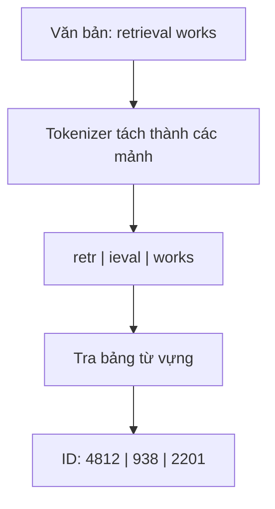

Model ngôn ngữ không trực tiếp đọc từ hay ký tự như con người. Nó xử lý một chuỗi **ID token** rời rạc.

Tokenization là lớp chuyển đổi giữa văn bản của con người và các ký hiệu mà model được huấn luyện để xử lý.

## Vì sao không dùng nguyên từng từ?

Một bộ từ vựng chứa mọi từ có thể có sẽ rất lớn, nhưng vẫn không xử lý tốt tên mới, lỗi gõ, code và văn bản đa ngôn ngữ.

Xử lý ở cấp ký tự tránh được từ chưa biết, nhưng khiến chuỗi dài hơn nhiều.

**Subword tokenization** là cách dung hòa: những mẫu phổ biến được biểu diễn gọn, còn chuỗi hiếm có thể tách thành các phần nhỏ hơn.

## Văn bản được đổi thành ID

Một pipeline đơn giản hóa có thể trông như sau:

Sau đó, các ID được ánh xạ thành vector trước khi đi vào transformer.

Cách tách chính xác phụ thuộc vào tokenizer. **Đừng mặc định một token bằng một từ.**

## Ranh giới token ảnh hưởng chi phí và context

Context window của model và mức sử dụng API thường được đo bằng token. Hai văn bản dài bằng nhau nếu tính theo ký tự vẫn có thể tốn số token khác nhau.

Code, tên ít gặp và một số ngôn ngữ có thể được tách khác với văn xuôi tiếng Anh thông thường.

Điều này ảnh hưởng đến việc thiết kế:

- ngân sách prompt;
- kích thước chunk;
- chính sách cắt bớt context;
- cách nén memory;
- ước lượng chi phí.

## Token ảnh hưởng hành vi của model

Model học các quy luật thống kê trên chuỗi token. Nếu cách tách token không thuận lợi, việc xử lý chính tả chính xác, mã định danh hoặc phép toán có thể khó hơn vì ranh giới ký hiệu không trùng với đơn vị khái niệm mà con người nhìn thấy.

Một mã sản phẩm có thể bị tách thành nhiều mảnh. Một thuật ngữ tiếng Nhật hiếm có thể được biểu diễn rất khác một cụm từ phổ biến. Những chi tiết này có thể ảnh hưởng retrieval, generation và fine-tuning.

## Tokenizer được cố định khi huấn luyện model

Với một model đã pretrain, tokenizer là một phần của giao diện model. Không thể tùy tiện thay tokenizer mà vẫn mặc định embedding đã học và các tham số model còn tương ứng với ID token mới.

Fine-tuning thường giữ tokenizer gốc, trừ khi model được chủ đích điều chỉnh ở mức sâu hơn.

## Điều cần nhớ

Khi gỡ lỗi hệ thống LLM, hãy kiểm tra tokenization nếu:

- độ dài context khác dự kiến;
- model xử lý mã định danh chính xác không đáng tin;
- hành vi giữa các ngôn ngữ khác nhau;
- prompt tốn chi phí bất thường;
- việc cắt context làm mất thông tin hữu ích.

Token không chỉ là chi tiết triển khai. Chúng xác định các đơn vị mà model ngôn ngữ thực sự xử lý.
