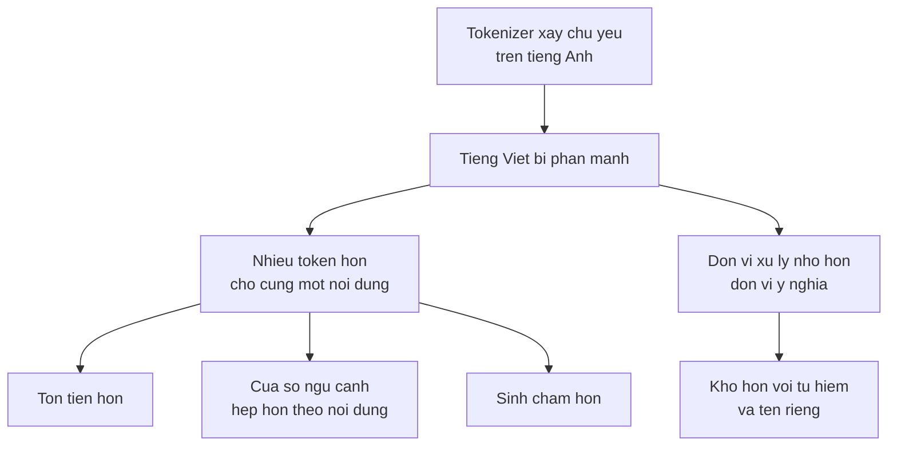

> **Mục tiêu bài học:** Sau bài này, bạn sẽ hiểu mô hình ngôn ngữ chia văn bản thành token như thế nào, biết vì sao tokenizer **không làm mất thông tin** dù nhìn đầu ra tưởng như hỏng, và đo được bằng số cái giá rất cụ thể mà người dùng tiếng Việt phải trả - cùng một nội dung, tiếng Việt tốn gấp mấy lần token so với tiếng Anh.

## 1. Vì sao không dùng ký tự, cũng không dùng từ

Bài 01 dùng cách chia đơn giản nhất: mỗi ký tự một ký hiệu. Cách ấy có hai cái giá. Chuỗi trở nên rất dài - một câu 60 ký tự là 60 bước dự đoán - và mô hình phải tự học chính tả từ đầu.

Còn cách ngược lại, mỗi từ một ký hiệu, thì vấp chỗ khác: từ vựng phình vô hạn. Tên riêng, từ mới, lỗi chính tả, mã sản phẩm - đều là những thứ không có trong danh sách, và mô hình phải trả về `<unk>`, tức mất thông tin vĩnh viễn.

**BPE (byte pair encoding)** đi giữa. Ý tưởng: bắt đầu từ các đơn vị nhỏ nhất, rồi **học từ dữ liệu** xem cặp nào hay đi cùng nhau để ghép lại thành một token:

```
b, ạ, n  →  thấy "bạn" xuất hiện rất nhiều  →  ghép thành một token "bạn"
```

Lặp lại vài chục nghìn lần, ta có một bảng từ vựng gồm: các ký tự lẻ, các mảnh từ hay gặp, và các từ trọn vẹn rất phổ biến. Từ hiếm vẫn biểu diễn được - chỉ là tốn nhiều token hơn.

Điểm cốt yếu, và cũng là chỗ quyết định cả bài này: **những cặp nào được ghép là do dữ liệu huấn luyện tokenizer quyết định.** Tokenizer học trên văn bản chủ yếu tiếng Anh sẽ ghép rất nhiều mảnh tiếng Anh, và rất ít mảnh tiếng Việt.

## 2. Chuyện `�` - và vì sao nó không phải lỗi

Thử tách một câu tiếng Việt bằng tokenizer của GPT-2 rồi in từng token một:

```python
from transformers import AutoTokenizer
tok = AutoTokenizer.from_pretrained("gpt2")
S = "Hôm nay trời đẹp, tôi uống cà phê ở Hà Nội."
ids = tok.encode(S)
print([tok.decode([i]) for i in ids][:14])
```

```
['H', 'ô', 'm', ' n', 'ay', ' tr', '�', '�', '�', 'i', ' �', '�', '�', '�']
```

Nhìn cái này rất dễ kết luận "GPT-2 làm hỏng tiếng Việt". Kết luận ấy **sai**, và kiểm được trong một dòng:

```python
print(tok.decode(ids) == S)      # → True
```

Chuỗi khôi phục **trùng khớp tuyệt đối** với chuỗi gốc. Kiểm trên cả 40 câu tiếng Việt của bài này: đúng cả 40.

Vậy `�` từ đâu ra? GPT-2 dùng **byte-level BPE** - nó không làm việc trên ký tự Unicode mà trên **byte**. Chữ `ờ` trong UTF-8 là ba byte, và ba byte ấy có thể rơi vào ba token khác nhau. Khi ta gọi `decode` cho **riêng một token**, hàm ấy nhận được một mảnh byte không tạo thành ký tự Unicode hoàn chỉnh, nên trả về ký tự thay thế `�`.

Ghép cả dãy lại thì mọi byte về đúng chỗ, và chuỗi gốc hiện ra nguyên vẹn.

Đây cũng là lý do byte-level BPE được ưa dùng: vì mọi văn bản đều là byte, **không bao giờ cần token `<unk>`**. Kiểm lại: trong 40 token của câu trên, không có token unknown nào.

> ⚠️ **Lưu ý nhỏ:** bài học ở đây rộng hơn chuyện tokenizer. Cách bạn *nhìn* một đối tượng có thể tạo ra hiện tượng không có trong bản thân đối tượng ấy. Decode từng token là một phép nhìn sai đơn vị - giống như đọc một byte của tệp JPEG rồi kết luận ảnh hỏng. Trước khi kết luận công cụ có lỗi, hãy kiểm bằng phép thử vòng tròn: đưa vào rồi lấy ra, có khớp không.

## 3. Cái giá thật: phân mảnh

Tokenizer không mất thông tin. Nhưng nó tốn **số token** rất khác nhau tùy ngôn ngữ, và đó là cái giá thật.

Lấy **40 cặp câu Việt-Anh có nội dung tương đương** - cùng ý, cùng độ dài thông tin - rồi đếm token của cả hai phía:

| Tokenizer | Từ vựng | Tổng token VI | Tổng token EN | Tỉ lệ trung bình | Trung vị | p10 - p90 | Min - Max |
|---|---|---|---|---|---|---|---|
| **GPT-2** | 50.257 | **1.323** | 331 | **4,11×** | 4,00× | 3,08 - 5,50 | 2,75 - 6,80 |
| **Qwen2.5** | 151.643 | **427** | 325 | **1,34×** | 1,25× | 1,10 - 1,71 | 0,92 - 1,83 |

(Cột từ vựng ở đây là `tokenizer.vocab_size` - số token BPE học được. Bảng embedding của mô hình lớn hơn một chút, `config.vocab_size = 151.936`, vì nó chừa chỗ cho các token đặc biệt và cho kích thước tròn tiện phần cứng. Bài 10 dùng con số thứ hai khi nói về bảng embedding.)

Đọc bảng này cho đúng.

**Với GPT-2, cùng một nội dung tốn gấp khoảng bốn lần token khi viết bằng tiếng Việt.** Trung vị 4,00× nghĩa là một nửa số câu tốn từ bốn lần trở lên. Khoảng p10-p90 là 3,08-5,50, tức đây không phải hiện tượng của vài câu cá biệt mà đúng đều khắp bộ.

**Với Qwen2.5 thì chỉ 1,34×**, và câu tốt nhất còn xuống dưới 1 - tức có câu tiếng Việt tốn *ít* token hơn bản tiếng Anh. Từ vựng của nó lớn gấp ba GPT-2 và được xây trên dữ liệu đa ngữ, nên nó có sẵn nhiều mảnh tiếng Việt.

Nhìn ở mức từ đơn thì rõ nguyên nhân:

| Từ | GPT-2 | Qwen2.5 |
|---|---|---|
| `người` | **7 token** | 2 |
| `đẹp` | 6 | 3 |
| `Nguyễn` | 6 | 3 |
| `thuyền` | 6 | 2 |
| `trời` | 5 | 2 |
| `nghiêng` | 5 | 4 |
| `phở` | 4 | 2 |
| `không` | 3 | 2 |

Từ `người` - một trong những từ phổ biến nhất tiếng Việt - tốn **bảy token** với GPT-2. Bảy. Trong khi một từ tiếng Anh thông dụng thường là một token.

> ⚠️ **Lưu ý nhỏ:** con số 4,11× là **đo trên bộ 40 câu này**, theo quy ước ba loại con số của chương Computer Vision · Bài 01. Nó sẽ khác với văn bản thuộc lĩnh vực khác - văn bản kỹ thuật đầy thuật ngữ tiếng Anh sẽ có tỉ lệ thấp hơn, văn nói đầy từ thuần Việt sẽ cao hơn. Điều ổn định là *thứ tự độ lớn*: với tokenizer xây chủ yếu trên tiếng Anh, tiếng Việt tốn gấp mấy lần chứ không phải gấp rưỡi.

## 4. Số token ấy đi vào đâu

Phân mảnh không phải chuyện thẩm mỹ. Nó chạm vào bốn thứ rất cụ thể.

**Tiền.** Hầu hết dịch vụ mô hình ngôn ngữ tính phí theo token. Cùng một tài liệu, cùng một câu hỏi, phiên bản tiếng Việt tốn gấp bốn lần nếu mô hình dùng tokenizer kiểu GPT-2.

**Cửa sổ ngữ cảnh.** Mô hình có giới hạn cứng về số token xử lý được một lần. Nếu trên loại nội dung này GPT-2 cần khoảng 4× token cho bản tiếng Việt, thì cùng một cửa sổ token chỉ chứa được **khoảng một phần tư lượng nội dung tương đương**. Cùng một mô hình, người dùng tiếng Việt có cửa sổ **hẹp hơn nhiều lần** tính theo nội dung. (Đừng quy thẳng thành một số từ cố định: bảng ở mục 3 đo token-trên-token giữa hai bản dịch, không đo token-trên-từ, mà tiếng Việt với tiếng Anh cũng không dùng cùng số "từ" cho cùng một ý.)

**Tốc độ.** Chỗ này cần nói chính xác, vì hai nửa của một lần gọi mô hình hành xử rất khác nhau. Phần **đọc prompt** được tính song song trên toàn bộ token cùng lúc, nên thêm token ở đây làm tăng chi phí tính toán nhưng không nhân thời gian chờ lên theo tỉ lệ. Phần **sinh câu trả lời** thì đúng là tuần tự - mỗi token một lượt gọi mạng, như bài 01 đã mô tả - nên một câu trả lời tiếng Việt cần gấp bốn lần token sẽ mất khoảng gấp bốn lần thời gian. Tóm lại: phân mảnh làm **câu trả lời** chậm hơn nhiều, còn **prompt dài** thì chủ yếu tốn tiền và tốn cửa sổ ngữ cảnh.

**Chất lượng.** Đây là chỗ tinh vi nhất. Khi `người` bị cắt thành bảy mảnh, mô hình phải học rằng bảy mảnh ấy ghép lại mới thành một khái niệm - thay vì nhận nó như một đơn vị. Với từ hiếm thì điều đó đặc biệt hại: tên riêng tiếng Việt bị băm vụn, và mô hình khó giữ được chúng nguyên vẹn khi sinh lại. Đây là một trong những lý do khiến chương Computer Vision · Bài 12 thấy OCR đọc "Trần" thành "Trẩn" - không cùng cơ chế, nhưng cùng một họ vấn đề: **đơn vị xử lý nhỏ hơn đơn vị ý nghĩa**.



> 🔧 **Thử ngay:** bạn xây một trợ lý hỏi đáp nội bộ bằng tiếng Việt và thấy chi phí gấp ba lần dự toán. Kiểm gì đầu tiên?
> Đếm token thật của chính dữ liệu của bạn, đừng ước lượng theo số từ. Chạy `len(tok.encode(text))` trên vài chục tài liệu đại diện rồi so với số từ - nếu tỉ lệ token/từ cao bất thường thì tokenizer của mô hình bạn chọn không hợp với tiếng Việt. Sau đó có ba hướng: **đổi mô hình** sang loại có tokenizer đa ngữ (bảng mục 3 cho thấy chênh lệch là ba lần chứ không phải vài phần trăm); **cắt bớt ngữ cảnh gửi đi**, vì với tỉ lệ 4× thì cửa sổ thực tế của bạn hẹp hơn nhiều so với con số ghi trên giấy; hoặc **rút gọn tài liệu trước khi gửi**, chẳng hạn chỉ gửi các đoạn đã truy hồi thay vì cả văn bản - đúng cách bài 12 làm.

## 5. Chọn tokenizer là chọn trước khi huấn luyện

Một điều đáng biết: **tokenizer được quyết định trước khi huấn luyện mô hình, và không thay riêng nó mà giữ nguyên mô hình được.** Toàn bộ trọng số, đặc biệt bảng token embedding mà bài 10 sẽ mở ra, đều gắn với đúng từ vựng ấy. Đổi từ vựng thì tối thiểu phải dựng lại bảng embedding cùng tầng đầu ra rồi huấn luyện tiếp cho mô hình thích nghi - không phải một thao tác cấu hình.

Nên khi bạn đọc thông số một mô hình, **từ vựng bao nhiêu và xây trên dữ liệu gì** là thông tin quan trọng không kém số tham số - nhất là nếu bạn làm việc với tiếng Việt. Qwen2.5 có 151.643 token so với 50.257 của GPT-2. Nhưng đừng quy công cho riêng con số ấy: kích thước từ vựng một mình không quyết định hiệu suất token. Cái quyết định là **ngân sách token và merge ấy được chia cho những ngôn ngữ nào**, và tokenizer được học trên dữ liệu gì. Từ vựng lớn hơn *cộng với* dữ liệu đa ngữ mới là thứ cho Qwen nhiều mảnh tiếng Việt dùng được.

Bài 04 sẽ cho thấy từ vựng lớn phải trả giá ở đâu: bảng embedding và tầng đầu ra đều tỉ lệ với kích thước từ vựng, nên từ vựng gấp ba thì hai phần ấy cũng nặng gấp ba.

## Tóm tắt bài học

- **BPE** học từ dữ liệu xem cặp ký hiệu nào hay đi cùng nhau rồi ghép lại, nên từ vựng gồm cả ký tự lẻ, mảnh từ và từ trọn vẹn. Những cặp được ghép phụ thuộc **dữ liệu huấn luyện tokenizer**.
- Ký tự `�` khi in từng token **không phải lỗi**: GPT-2 dùng byte-level BPE, một ký tự Unicode có thể trải trên nhiều token, và decode riêng một mảnh byte thì không dựng nổi ký tự. `decode(encode(x)) == x` đúng trên cả 40 câu thử.
- Byte-level BPE **không bao giờ cần `<unk>`**, vì mọi văn bản đều biểu diễn được bằng byte.
- Cái giá thật là **phân mảnh**. Trên 40 cặp câu Việt-Anh tương đương: GPT-2 tốn **4,11× trung bình** (trung vị 4,00×, p10-p90 là 3,08-5,50), còn Qwen2.5 chỉ **1,34×**.
- Ở mức từ đơn, GPT-2 cần **7 token cho chữ `người`**, trong khi Qwen2.5 cần 2.
- Phân mảnh chạm vào bốn thứ: **tiền**, **cửa sổ ngữ cảnh tính theo nội dung**, **tốc độ sinh câu trả lời** (phần đọc prompt tính song song nên không chậm theo tỉ lệ), và **chất lượng với từ hiếm cùng tên riêng**.
- Tokenizer được chọn **trước khi huấn luyện** và gắn chặt với trọng số, nên kích thước và nguồn gốc từ vựng là thông tin đáng đọc không kém số tham số.

## Câu hỏi tự kiểm tra

1. Nêu một nhược điểm của cách chia theo ký tự và một nhược điểm của cách chia theo từ. BPE giải quyết từng cái ra sao?
2. Bạn thấy `['H', 'ô', 'm', ' tr', '�', '�']` khi in từng token. Viết một dòng code chứng minh tokenizer không làm mất thông tin.
3. Vì sao byte-level BPE không cần token `<unk>`?
4. Tỉ lệ token VI/EN của GPT-2 có trung bình 4,11 và trung vị 4,00. Vì sao báo cả hai con số lại tốt hơn chỉ báo một?
5. Nếu cùng một nội dung bằng tiếng Việt cần khoảng 4× token so với bản tiếng Anh, thì một cửa sổ 8.000 token đổi thế nào về **lượng nội dung tương đương** chứa được? Vì sao không được quy thẳng con số ấy thành một số từ cố định? Hệ quả với một hệ hỏi đáp tài liệu là gì?
6. Vì sao phân mảnh làm **câu trả lời** chậm hơn nhiều nhưng không làm việc **đọc prompt** chậm theo cùng tỉ lệ?
7. Vì sao phân mảnh làm mô hình khó xử lý tên riêng tiếng Việt hơn?
8. Từ vựng của Qwen2.5 lớn gấp ba GPT-2. Nêu một cái lợi và một cái giá của việc đó.
9. Bạn đo được tỉ lệ token/từ trên dữ liệu của mình cao bất thường. Nêu ba hướng xử lý và đánh đổi của từng hướng.

## Đọc thêm

**Nguồn nền tảng của bài:**

| Nguồn | Đọc phần nào |
|---|---|
| **Bài 01 của chương này** | Cách chia theo ký tự, và vì sao số ký hiệu quyết định số bước sinh |
| **Bài 04 của chương này** | Bảng token embedding và tầng đầu ra - hai chỗ chi phí tỉ lệ với kích thước từ vựng |
| **Chương Computer Vision · Bài 12** | Tên riêng tiếng Việt bị đọc sai trong OCR - cùng họ vấn đề, khác cơ chế |

**Nguồn online bổ sung (miễn phí):**

- [Sennrich, Haddow, Birch - Neural Machine Translation of Rare Words with Subword Units (ACL 2016)](https://arxiv.org/abs/1508.07909) - bài giới thiệu BPE cho mô hình ngôn ngữ.
- [Summary of the tokenizers - tài liệu Hugging Face](https://huggingface.co/docs/transformers/tokenizer_summary) - so sánh BPE, WordPiece, SentencePiece và Unigram.
- [Tiktokenizer](https://tiktokenizer.vercel.app/) - công cụ trực quan, dán một câu tiếng Việt vào rồi xem nó bị cắt thế nào ở từng mô hình.
- [Petrov và cộng sự - Language Model Tokenizers Introduce Unfairness Between Languages (NeurIPS 2023)](https://arxiv.org/abs/2305.15425) - đo chính hiện tượng ở mục 3 trên hơn 100 ngôn ngữ, và bàn về hệ quả chi phí.
- [Qwen2.5 - model card](https://huggingface.co/Qwen/Qwen2.5-0.5B-Instruct) - thông số mô hình dùng suốt chương này, gồm kích thước từ vựng.

> **Bài tiếp theo:** [Attention: truy vấn, khóa, giá trị](../attention-queries-keys-values-vi/) - hai bài đầu đã dựng xong phần đầu vào - văn bản thành token, token thành chuỗi số. Bài sau mở cơ chế mà chương Deep Learning và Computer Vision đều cố ý để lại: làm sao một vị trí trong chuỗi "nhìn" được các vị trí khác, và vì sao cơ chế ấy thay thế được mạng hồi quy.
