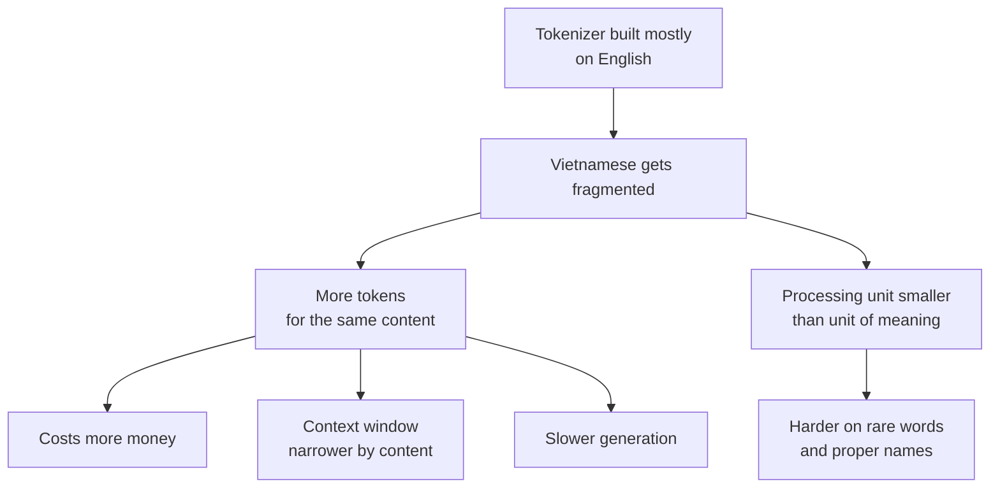

> **Learning objectives:** After this lesson, you will understand how a language model splits text into tokens, know why a tokenizer **loses no information** even when its output looks broken, and be able to put a number on the very concrete price Vietnamese users pay - for the same content, Vietnamese costs several times as many tokens as English.

## 1. Why neither characters nor words

Lesson 01 used the simplest split: one symbol per character. That split has two costs. Sequences become very long - a 60-character sentence is 60 prediction steps - and the model has to learn spelling from scratch.

The opposite approach, one symbol per word, stumbles elsewhere: the vocabulary grows without bound. Proper names, new words, typos, product codes - all are things that are not on the list, and the model has to return `<unk>`, which means the information is lost for good.

**BPE (byte pair encoding)** takes the middle road. The idea: start from the smallest units, then **learn from data** which pairs often go together and merge them into a single token:

```
b, ạ, n  →  thấy "bạn" xuất hiện rất nhiều  →  ghép thành một token "bạn"
```

(Here the letters of "bạn", "you/friend", are seen together very often, so they get merged into one token "bạn".) Repeating this tens of thousands of times gives a vocabulary made of: single characters, common word pieces, and very frequent whole words. Rare words can still be represented - they just cost more tokens.

The key point, and the one that decides this whole lesson: **which pairs get merged is decided by the data the tokenizer is trained on.** A tokenizer learned on mostly English text will merge a great many English pieces, and very few Vietnamese ones.

## 2. The case of `�` - and why it is not a bug

Let us split a Vietnamese sentence with the GPT-2 tokenizer and print the tokens one by one:

```python
from transformers import AutoTokenizer
tok = AutoTokenizer.from_pretrained("gpt2")
S = "Hôm nay trời đẹp, tôi uống cà phê ở Hà Nội."
ids = tok.encode(S)
print([tok.decode([i]) for i in ids][:14])
```

```
['H', 'ô', 'm', ' n', 'ay', ' tr', '�', '�', '�', 'i', ' �', '�', '�', '�']
```

(The sentence means "Today the weather is nice, I drink coffee in Hà Nội.") Looking at this, it is very easy to conclude that "GPT-2 breaks Vietnamese". That conclusion is **wrong**, and it can be checked in one line:

```python
print(tok.decode(ids) == S)      # → True
```

The recovered string **matches the original exactly**. Checked on all 40 Vietnamese sentences in this lesson: all 40 match.

So where does `�` come from? GPT-2 uses **byte-level BPE** - it does not work on Unicode characters but on **bytes**. The letter `ờ` is three bytes in UTF-8, and those three bytes can land in three different tokens. When we call `decode` on **a single token**, the function receives a fragment of bytes that does not form a complete Unicode character, so it returns the replacement character `�`.

Put the whole sequence back together and every byte returns to its place, and the original string reappears intact.

This is also why byte-level BPE is popular: since all text is bytes, **there is never any need for an `<unk>` token**. Checking again: among the 40 tokens of the sentence above, there is no unknown token.

> ⚠️ **A small note:** the lesson here is broader than tokenizers. The way you *look at* an object can create a phenomenon that is not in the object itself. Decoding tokens one at a time is looking at the wrong unit - like reading one byte of a JPEG file and concluding the image is broken. Before concluding a tool has a bug, check with a round trip: put it in, take it out, does it match.

## 3. The real cost: fragmentation

The tokenizer loses no information. But it spends very different **numbers of tokens** depending on the language, and that is the real cost.

Take **40 Vietnamese-English sentence pairs with equivalent content** - same meaning, same amount of information - and count the tokens on both sides:

| Tokenizer | Vocabulary | Total VI tokens | Total EN tokens | Mean ratio | Median | p10 - p90 | Min - Max |
|---|---|---|---|---|---|---|---|
| **GPT-2** | 50,257 | **1,323** | 331 | **4.11×** | 4.00× | 3.08 - 5.50 | 2.75 - 6.80 |
| **Qwen2.5** | 151,643 | **427** | 325 | **1.34×** | 1.25× | 1.10 - 1.71 | 0.92 - 1.83 |

(The vocabulary column here is `tokenizer.vocab_size` - the number of tokens BPE learned. The model's embedding table is slightly larger, `config.vocab_size = 151,936`, because it leaves room for special tokens and for a round size that suits the hardware. Lesson 10 uses the second number when talking about the embedding table.)

Let us read this table correctly.

**With GPT-2, the same content costs about four times as many tokens when written in Vietnamese.** A median of 4.00× means half the sentences cost four times or more. The p10-p90 range is 3.08-5.50, so this is not a phenomenon of a few odd sentences but holds evenly across the whole set.

**With Qwen2.5 it is only 1.34×**, and the best sentence even goes below 1 - that is, some Vietnamese sentences cost *fewer* tokens than their English versions. Its vocabulary is three times the size of GPT-2's and was built on multilingual data, so it already has many Vietnamese pieces.

Looking at single words makes the cause clear:

| Word | GPT-2 | Qwen2.5 |
|---|---|---|
| `người` | **7 tokens** | 2 |
| `đẹp` | 6 | 3 |
| `Nguyễn` | 6 | 3 |
| `thuyền` | 6 | 2 |
| `trời` | 5 | 2 |
| `nghiêng` | 5 | 4 |
| `phở` | 4 | 2 |
| `không` | 3 | 2 |

The word `người` ("person") - one of the most common words in Vietnamese - costs **seven tokens** with GPT-2. Seven. Whereas a common English word is usually a single token.

> ⚠️ **A small note:** the figure of 4.11× is **measured on this set of 40 sentences**, following the three-kinds-of-numbers convention of Computer Vision · Lesson 01. It will differ for text from other domains - technical text full of English terms will have a lower ratio, conversational text full of native Vietnamese words a higher one. What is stable is the *order of magnitude*: with a tokenizer built mostly on English, Vietnamese costs several times as much, not one and a half times.

## 4. Where those tokens go

Fragmentation is not a cosmetic issue. It touches four very concrete things.

**Money.** Most language model services charge per token. The same document, the same question, costs four times as much in its Vietnamese version if the model uses a GPT-2-style tokenizer.

**Context window.** A model has a hard limit on the number of tokens it can process at once. If on this kind of content GPT-2 needs about 4× the tokens for the Vietnamese version, then the same token window holds only **about a quarter of the equivalent content**. With the same model, Vietnamese users get a window that is **several times narrower** in terms of content. (Do not convert this directly into a fixed number of words: the table in section 3 measures tokens against tokens between two translations, not tokens per word, and Vietnamese and English do not use the same number of "words" for the same idea either.)

**Speed.** This needs to be stated precisely, because the two halves of a single model call behave very differently. **Reading the prompt** is computed in parallel over all tokens at once, so extra tokens here raise the compute cost but do not multiply the waiting time proportionally. **Generating the answer** really is sequential - one network call per token, as Lesson 01 described - so a Vietnamese answer needing four times the tokens will take about four times as long. In short: fragmentation makes **answers** much slower, while **long prompts** mainly cost money and context window.

**Quality.** This is the subtlest part. When `người` is cut into seven pieces, the model has to learn that those seven pieces together make one concept - instead of receiving it as a single unit. For rare words this is especially harmful: Vietnamese proper names get chopped up, and the model struggles to keep them intact when generating them again. This is one of the reasons Computer Vision · Lesson 12 saw OCR read "Trần" as "Trẩn" - not the same mechanism, but the same family of problems: **the processing unit is smaller than the unit of meaning**.



> 🔧 **Try it now:** you build an internal question-answering assistant in Vietnamese and find the cost is three times the estimate. What do you check first?
> Count the actual tokens of your own data, do not estimate from word counts. Run `len(tok.encode(text))` on a few dozen representative documents and compare with the word count - if the tokens-per-word ratio is unusually high, the tokenizer of the model you chose is a poor fit for Vietnamese. Then there are three directions: **switch models** to one with a multilingual tokenizer (the table in section 3 shows the gap is threefold, not a few percent); **cut down the context you send**, because at a 4× ratio your effective window is much narrower than the number on paper; or **shorten documents before sending**, for example sending only retrieved passages instead of the whole text - exactly what Lesson 12 does.

## 5. Choosing a tokenizer is a choice made before training

One thing worth knowing: **the tokenizer is decided before the model is trained, and it cannot be replaced on its own while keeping the model unchanged.** All the weights, especially the token embedding table that Lesson 10 will open up, are tied to exactly that vocabulary. Changing the vocabulary means at minimum rebuilding the embedding table and the output layer and then training further so the model adapts - it is not a configuration change.

So when you read a model's specifications, **how large the vocabulary is and what data it was built on** is information as important as the parameter count - especially if you work with Vietnamese. Qwen2.5 has 151,643 tokens compared with GPT-2's 50,257. But do not give that number all the credit: vocabulary size alone does not determine token efficiency. What decides it is **which languages that budget of tokens and merges is divided among**, and what data the tokenizer was learned on. A larger vocabulary *plus* multilingual data is what gives Qwen many usable Vietnamese pieces.

Lesson 04 will show where a large vocabulary has to pay: the embedding table and the output layer both scale with vocabulary size, so a vocabulary three times larger makes those two parts three times heavier too.

## Lesson summary

- **BPE** learns from data which pairs of symbols often go together and merges them, so the vocabulary contains single characters, word pieces and whole words. Which pairs get merged depends on **the data the tokenizer is trained on**.
- The `�` character when printing tokens one at a time **is not a bug**: GPT-2 uses byte-level BPE, one Unicode character can span several tokens, and decoding a lone fragment of bytes cannot rebuild the character. `decode(encode(x)) == x` holds on all 40 test sentences.
- Byte-level BPE **never needs `<unk>`**, because all text can be represented as bytes.
- The real cost is **fragmentation**. On 40 equivalent Vietnamese-English sentence pairs: GPT-2 costs **4.11× on average** (median 4.00×, p10-p90 of 3.08-5.50), while Qwen2.5 costs only **1.34×**.
- At the single-word level, GPT-2 needs **7 tokens for the word `người`**, while Qwen2.5 needs 2.
- Fragmentation touches four things: **money**, **context window measured in content**, **answer generation speed** (reading the prompt is computed in parallel so it does not slow down proportionally), and **quality on rare words and proper names**.
- The tokenizer is chosen **before training** and is tightly bound to the weights, so the size and origin of the vocabulary are as worth reading as the parameter count.

## Self-check questions

1. State one drawback of splitting by characters and one drawback of splitting by words. How does BPE address each?
2. You see `['H', 'ô', 'm', ' tr', '�', '�']` when printing tokens one at a time. Write one line of code proving the tokenizer loses no information.
3. Why does byte-level BPE not need an `<unk>` token?
4. GPT-2's VI/EN token ratio has a mean of 4.11 and a median of 4.00. Why is reporting both numbers better than reporting just one?
5. If the same content in Vietnamese needs about 4× the tokens of the English version, how does an 8,000-token window change in terms of **the amount of equivalent content** it holds? Why must that number not be converted directly into a fixed number of words? What is the consequence for a document question-answering system?
6. Why does fragmentation make **answers** much slower but not slow down **reading the prompt** by the same factor?
7. Why does fragmentation make it harder for a model to handle Vietnamese proper names?
8. Qwen2.5's vocabulary is three times the size of GPT-2's. State one benefit and one cost of that.
9. You measure an unusually high tokens-per-word ratio on your data. State three ways to deal with it and the trade-off of each.

## Further reading

**Foundational sources for this lesson:**

| Source | Which part to read |
|---|---|
| **Lesson 01 of this chapter** | Splitting by characters, and why the number of symbols determines the number of generation steps |
| **Lesson 04 of this chapter** | The token embedding table and the output layer - the two places whose cost scales with vocabulary size |
| **Computer Vision · Lesson 12** | Vietnamese proper names misread by OCR - the same family of problems, a different mechanism |

**Additional online sources (free):**

- [Sennrich, Haddow, Birch - Neural Machine Translation of Rare Words with Subword Units (ACL 2016)](https://arxiv.org/abs/1508.07909) - the paper that introduced BPE for language models.
- [Summary of the tokenizers - Hugging Face documentation](https://huggingface.co/docs/transformers/tokenizer_summary) - compares BPE, WordPiece, SentencePiece and Unigram.
- [Tiktokenizer](https://tiktokenizer.vercel.app/) - a visual tool: paste in a Vietnamese sentence and see how each model cuts it.
- [Petrov et al. - Language Model Tokenizers Introduce Unfairness Between Languages (NeurIPS 2023)](https://arxiv.org/abs/2305.15425) - measures the very phenomenon of section 3 across more than 100 languages, and discusses the cost consequences.
- [Qwen2.5 - model card](https://huggingface.co/Qwen/Qwen2.5-0.5B-Instruct) - specifications of the model used throughout this chapter, including vocabulary size.

> **Next lesson:** [Attention: Queries, Keys, Values](../attention-queries-keys-values/) - the first two lessons built the input side - text into tokens, tokens into a sequence of numbers. The next lesson opens the mechanism that the Deep Learning and Computer Vision chapters both deliberately left aside: how one position in a sequence "looks at" other positions, and why that mechanism can replace recurrent networks.
