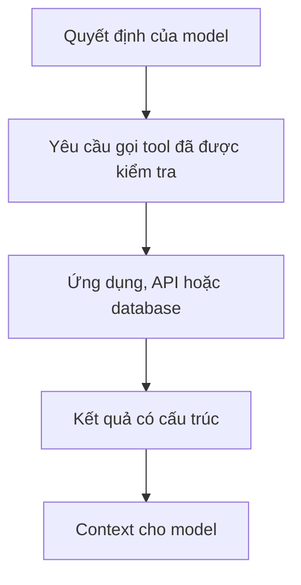
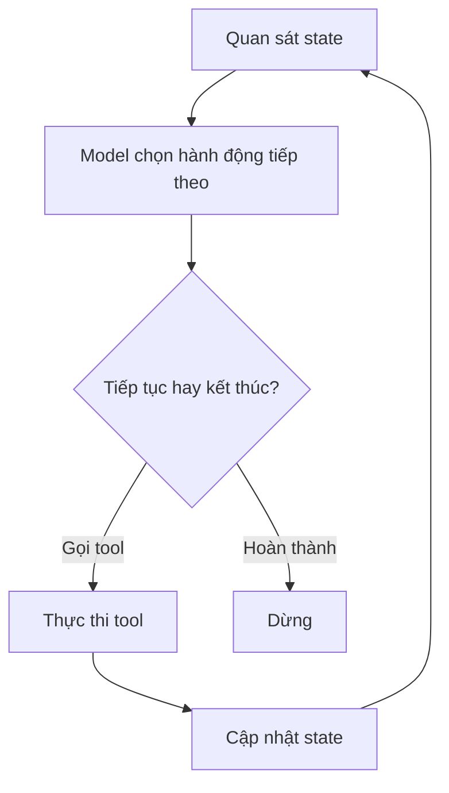

Model ngôn ngữ tạo ra văn bản. **Tool calling** mở rộng giao diện đó để model có thể yêu cầu hành động có cấu trúc, chẳng hạn tìm dữ liệu, chạy code hoặc gọi API.

Agent thường là một hệ thống lặp lại việc kết hợp quyết định của model với tools và state cho đến khi nhiệm vụ đạt điều kiện dừng.

## Tool là ranh giới khả năng rõ ràng

Một tool tốt có:

- tên và mục đích rõ ràng;
- đầu vào có kiểu dữ liệu cụ thể;
- đầu ra được giới hạn;
- kiểm tra quyền bằng code xác định;
- quá trình thực thi có thể quan sát.

Model **đề xuất** lời gọi. Code của ứng dụng quyết định lời gọi đó có được thực thi không và thực thi như thế nào.

Ranh giới này quan trọng đối với cả an toàn lẫn tính đúng đắn.

## Vòng lặp Agent tối thiểu

Framework có thể bổ sung retry, lưu trạng thái, streaming, phê duyệt của con người, tracing và chạy đồng thời. Những khả năng ấy quan trọng, nhưng đều bao quanh vòng điều khiển cốt lõi này.

## State nên được biểu diễn tường minh

Nếu nguồn sự thật duy nhất là toàn bộ bản ghi hội thoại, model phải liên tục suy lại state của workflow.

State tường minh có thể lưu:

- thực thể đã chọn;
- khoảng ngày đã xác nhận;
- bước đã hoàn thành;
- kết quả tool;
- số lần retry;
- yêu cầu phê duyệt đang chờ.

Nhờ vậy, ứng dụng giữ quyền kiểm soát xác định ở những nơi có thể.

## Việc chọn đường không chắc chắn khi để model quyết định

Một LLM router có thể phân loại sai ý định. Vì thế, thiết kế production nên tính đến độ tin cậy, khả năng phục hồi và giới hạn hậu quả của sai lầm, thay vì giả định router luôn đúng.

Những pattern hữu ích gồm:

- định tuyến bằng luật cho hành động có cấu trúc và rõ ràng;
- định tuyến bằng model cho tình huống ngữ nghĩa mơ hồ;
- hỏi xác nhận khi đi sai đường có thể gây hậu quả lớn;
- đường phục hồi khi tool thất bại;
- giới hạn số vòng để tránh lặp vô tận.

## Nhiều Agent hơn không đồng nghĩa thông minh hơn

Chia một nhiệm vụ cho nhiều vai trò model có thể làm tăng lượng context trùng lặp, latency và lỗi phối hợp.

Chỉ dùng nhiều Agent khi việc chia nhỏ tạo ra sự cô lập cần thiết hoặc giá trị chạy song song thật sự, không phải vì sơ đồ trông hoành tráng.

Trong nhiều trường hợp, một bộ điều phối với tools được thiết kế tốt và state rõ ràng sẽ dễ đánh giá, bảo trì hơn.

## Độ tin cậy còn nằm ngoài model

Bảo mật, tách biệt tenant, phân quyền, kiểm tra schema, idempotency và ranh giới đọc/ghi phải được thực thi bằng code.

Đừng yêu cầu model ngôn ngữ "ghi nhớ" những bất biến mà ứng dụng có thể đảm bảo một cách xác định.

## Một định nghĩa thực dụng

Thay vì tranh luận hệ thống có phải "Agent thật" hay không, hãy hỏi:

> Model được giao những quyết định nào, nó có thể thực hiện hành động gì, state nào được giữ lại, và ranh giới nào vẫn do code kiểm soát?

Mô tả ấy cho ta biết nhiều hơn về kiến trúc.
