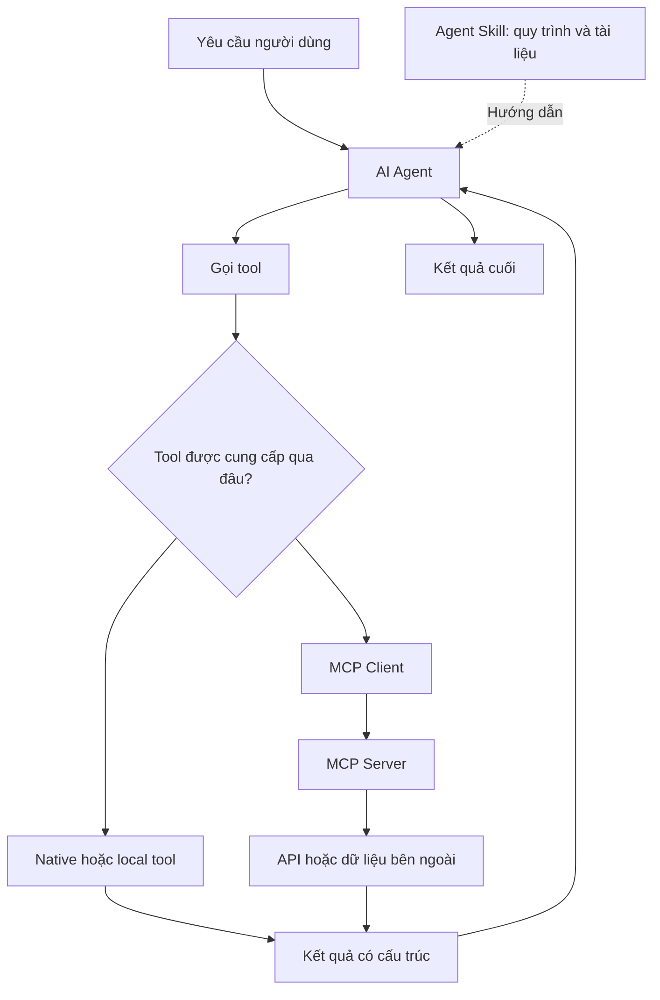
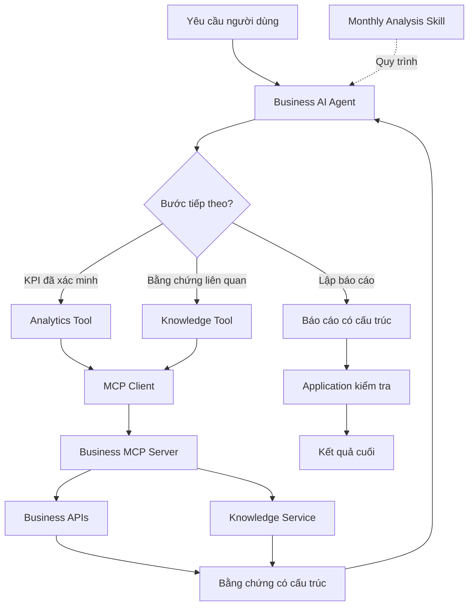
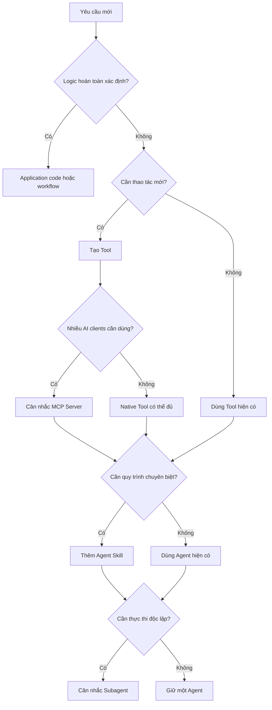

Một Agent có thể được trang bị hàng chục tools, nhiều Skills và kết nối tới nhiều MCP Servers. Nhưng nhiều khả năng hơn không nhất thiết giúp nó làm việc tốt hơn. Điều quan trọng là biết **cơ chế nào giải quyết vấn đề nào và trách nhiệm của nó dừng ở đâu**.

## 1. Khi một yêu cầu đơn giản trở thành bài toán kiến trúc

Giả sử chúng ta xây AI Assistant cho chuỗi cửa hàng bán lẻ. Ban đầu, hệ thống chỉ cần trả lời:

> "Doanh thu tháng 8 tăng bao nhiêu so với tháng 7?"

Một tool truy vấn dữ liệu là đủ. Agent gọi tool, nhận kết quả rồi giải thích con số.

Sau đó, yêu cầu mở rộng:

> "Hãy phân tích tình hình kinh doanh tháng 8, xác định những chỉ số bất thường, đối chiếu với tài liệu nghiệp vụ và tạo báo cáo tổng hợp."

Agent cần số liệu, phép tính KPI, tìm kiếm tài liệu, phân tích và định dạng báo cáo thống nhất. Ta có thể liên tục thêm `get_sales_data`, `calculate_kpi`, `search_documents` và `generate_report`. Nhưng ai quyết định thứ tự gọi, dữ liệu nào đã được xác minh và khi nào báo cáo hoàn thành?

Ta có thể viết system prompt dài, đóng gói một Skill, tạo Report Agent riêng hoặc công bố tools qua MCP. Những lựa chọn này không tương đương: chúng tổ chức **khả năng thực thi, hướng dẫn công việc, kết nối và quyền quyết định** ở những ranh giới khác nhau.

## 2. Bốn khái niệm không cùng một tầng kiến trúc

| Thành phần | Vai trò chính | Câu hỏi cần trả lời |
| :-- | :-- | :-- |
| Tool | Cung cấp thao tác có thể thực thi | Agent có thể làm gì? |
| Skill | Đóng gói hướng dẫn và tài nguyên cho nhiệm vụ | Nên làm việc này như thế nào? |
| MCP | Chuẩn hóa kết nối tới khả năng và dữ liệu bên ngoài | AI application kết nối bằng cách nào? |
| Agent hoặc Subagent | Chọn bước và chịu trách nhiệm thực hiện | Ai quyết định bước tiếp theo? |

`get_revenue_comparison` có thể là Tool. `monthly-business-analysis` có thể là Skill hướng dẫn xác minh KPI, tách dữ kiện khỏi giả thuyết và định dạng báo cáo. MCP Server có thể công bố tools bán hàng cho nhiều AI applications tương thích. Report Agent có thể phối hợp và tạo câu trả lời cuối.



*Hình 1. Skill hướng dẫn công việc, Tool thực thi thao tác, còn MCP có thể cung cấp đường kết nối tới khả năng bên ngoài.*

Skill không tự cấp quyền truy cập mới. Nó có thể hướng dẫn Agent gọi `get_sales_data`, nhưng runtime phải cung cấp tool đó và người dùng phải có quyền. MCP cung cấp kết nối, không tự quyết định toàn bộ quy trình nghiệp vụ.

## 3. Tool: Thiết kế hành động mà Agent dùng được đáng tin cậy

Bài [Tool Calling và Agent](../tool-calling-and-agents-vi/) ở phần Learn giải thích cách model yêu cầu chạy tool. Về mặt engineering, câu hỏi tiếp theo là **một Tool nên đảm nhận phạm vi lớn đến đâu?**

Một tool lấy doanh thu tháng có thể nhận mã cửa hàng và kỳ báo cáo, kiểm quyền rồi trả kết quả có cấu trúc. Nhưng nếu có quá nhiều tool vụn cho từng ngày, phép cộng tháng, phần trăm tăng trưởng và đổi đơn vị, Agent phải gọi nhiều bước không cần thiết. Ngược lại, `analyze_everything` che giấu quá nhiều trách nhiệm.

Một hướng cân bằng là đặt tool theo **thao tác có ý nghĩa rõ với Agent**, chẳng hạn `get_revenue_comparison`:

```json
{
  "store_id": "STORE_001",
  "comparison": {
    "previous_period": "2026-07",
    "current_period": "2026-08"
  },
  "previous_revenue": 200000000,
  "current_revenue": 230000000,
  "growth_percent": 15.0,
  "currency": "VND",
  "source_id": "sales_snapshot_v1"
}
```

Application thực hiện phép tính có tính xác định; Agent nhận số liệu, đơn vị, kỳ và nguồn. Đừng gộp những side effects không liên quan vào cùng một tool. Hủy đơn hoặc gửi báo cáo ra ngoài thường cần contract và kiểm soát riêng.

Tool production nên làm rõ input hợp lệ, authorization, phạm vi dữ liệu, metadata nguồn, cách báo lỗi và việc nó có thay đổi trạng thái hay không. [Hướng dẫn thiết kế tool của Anthropic](https://www.anthropic.com/engineering/writing-tools-for-agents) nhấn mạnh tên, mô tả và output phù hợp với nhiệm vụ của Agent. Một API có thể vượt hết unit tests mà Agent vẫn hay chọn sai vì giao diện mơ hồ. Hãy kiểm thử **khả năng Agent sử dụng tool**, không chỉ API chạy đúng.

## 4. Skill: Đóng gói cách thực hiện một nhiệm vụ

Có tools lấy KPI và tìm tài liệu chưa đảm bảo Agent sẽ lập báo cáo hợp lý. Nó có thể đề xuất cải thiện trước khi kiểm tra số liệu, hoặc khẳng định nguyên nhân khi thiếu bằng chứng. Hướng dẫn riêng cho loại nhiệm vụ này có thể đặt trong Skill thay vì kéo dài system prompt mãi.

Theo [Agent Skills open specification](https://agentskills.io/specification), một Skill là thư mục có `SKILL.md` bắt buộc; scripts, references và assets là tùy chọn:

```text
skills/
└── monthly-business-analysis/
    ├── SKILL.md
    ├── references/
    │   ├── kpi-definitions.md
    │   └── report-guidelines.md
    ├── scripts/
    │   └── validate_report.py
    └── assets/
        └── report-template.md
```

Một `SKILL.md` minh họa có thể viết:

```markdown
---
name: monthly-business-analysis
description: Analyze monthly performance using verified sales data.
  Use for monthly business analysis and reporting requests.
---

# Monthly Business Analysis

1. Xác định cửa hàng và kỳ báo cáo.
2. Lấy KPI đã xác minh và so với kỳ phù hợp.
3. Điều tra thay đổi đáng chú ý khi có bằng chứng.
4. Tách phát hiện đã xác minh khỏi giả thuyết.
5. Dùng mẫu báo cáo được duyệt và giữ source IDs.

Không tự tạo KPI còn thiếu hoặc khẳng định nguyên nhân chưa kiểm chứng.
Đọc references/kpi-definitions.md khi cần định nghĩa KPI.
Chỉ chạy scripts/validate_report.py nếu runtime cho phép.
```

Đây chỉ là ví dụ; không phải runtime nào cũng có quyền đọc file, chạy script hoặc gọi cùng một bộ tools. Tài nguyên hỗ trợ có thể được tải khi cần. Specification gọi đó là **progressive disclosure**: ban đầu nhìn metadata, khi kích hoạt mới đọc hướng dẫn, sau đó mới tải file bổ sung. Cách kích hoạt cụ thể tùy ứng dụng.

Skill không phải function hay API endpoint. Nó hướng dẫn một công việc có thể gồm nhiều bước. Nó có thể dùng native tools, MCP tools hoặc không cần tool. Nhưng quy tắc bắt buộc không nên chỉ nằm trong `SKILL.md`: quyền phê duyệt phải do application thực thi, còn công thức KPI quan trọng nên được tính và kiểm chứng bằng code. **Skill hướng dẫn Agent; code và business services thực thi các điều kiện bắt buộc.**

## 5. MCP: Khi nhiều AI applications cần cùng khả năng

Với một ứng dụng và vài service nội bộ, native tools có thể là đủ. Không có yêu cầu bắt buộc phải dùng MCP.

Nhưng nếu Business Intelligence Assistant, Customer Support Assistant, Internal Operations Assistant và coding assistant đều cần tra cứu đơn hàng, số liệu hoặc tài liệu nội bộ, mỗi ứng dụng tự viết integration sẽ dễ trùng lặp. [Kiến trúc MCP](https://modelcontextprotocol.io/docs/learn/architecture) cung cấp mô hình kết nối chung:

- **Host:** AI application quản lý trải nghiệm và các kết nối.
- **Client:** Thành phần trong host giao tiếp với MCP Server.
- **Server:** Công bố khả năng và dữ liệu, gồm tools, resources và prompts.

MCP không đồng nghĩa với tool calling. Tool calling là việc model yêu cầu thực hiện công cụ; MCP quy định cách ứng dụng tương thích khám phá và giao tiếp với khả năng từ bên ngoài. Agent vẫn có thể gọi native tools mà không dùng MCP.

MCP Server có thể bọc Sales API hiện có. Database, business service, REST API và kiểm quyền phía sau vẫn tồn tại. MCP bổ sung giao diện chuẩn cho AI client, không thay thế các lớp đó hay tự làm tool dễ dùng hơn. Công bố hàng trăm tools tên gần giống nhau có thể khiến Agent khó chọn hơn một tập nhỏ, rõ ràng.

## 6. Kết hợp Tool, Skill và MCP trong một nhiệm vụ

Giả sử người dùng muốn báo cáo kinh doanh tháng 8, phát hiện biến động bất thường và đưa ra đề xuất dựa trên bằng chứng:



*Hình 2. Một kiến trúc minh họa, không phải yêu cầu mọi Tool đều phải đi qua MCP.*

Agent xác định nhiệm vụ rồi kích hoạt Skill lập báo cáo nếu runtime hỗ trợ. Một số ứng dụng cho người dùng gọi Skill trực tiếp; slash command chỉ là quy ước của ứng dụng, không phải điều kiện bắt buộc của format. Agent gọi Analytics và Knowledge Tools, có thể được cung cấp qua MCP. Skill hướng dẫn tách dữ kiện đã kiểm chứng khỏi giả thuyết. Nếu thiếu chi tiết cơ cấu chi phí, Agent nên tìm thêm dữ liệu hoặc nêu giới hạn thay vì tự đoán nguyên nhân.

Cuối cùng, application có thể kiểm tra schema, nguồn bắt buộc và điều kiện nghiệp vụ. Lưu hay gửi báo cáo ra ngoài nên đi qua service có kiểm quyền. Không cần để model tự điều khiển mọi side effect.

## 7. Khi nào Skill chưa đủ và cần Subagent?

Skill phù hợp khi Agent hiện có cần một quy trình hoặc tiêu chuẩn chuyên biệt. Subagent có thể hợp lý nếu một phần việc cần context riêng, nhiều bước xử lý, state độc lập hoặc có thể chạy tách biệt.

Với hệ thống báo cáo nhỏ, một Agent có thể dùng Skills phân tích tháng, sản phẩm và trình bày kết quả. Với nhiệm vụ lớn hơn, Analytics Agent xử lý số liệu, Inventory Agent xem tồn kho, Report Agent tổng hợp. Cách chia này cũng làm tăng routing, handoff, latency, quản lý state và công kiểm thử end-to-end. Không nên tạo Subagent chỉ vì một nhiệm vụ có tên riêng.

**Skill đóng gói chuyên môn và quy trình; Subagent nhận trách nhiệm thực thi một phần công việc.** Subagent cũng có thể dùng Skills.

## 8. Khi nào chỉ cần code hoặc workflow?

Nếu input, công thức, thứ tự và output đã rõ, workflow có tính xác định thường phù hợp hơn. "Tính doanh thu và lợi nhuận cho cửa hàng, tháng này rồi lưu kết quả" không cần LLM quyết định từng bước. Nút "Xuất PDF" có thể gọi trực tiếp service tạo PDF.

**Đừng giao cho Agent những quyết định mà application code có thể xử lý xác định và đáng tin cậy hơn.** Agent hữu ích khi phải hiểu yêu cầu mở, chọn thông tin và thích nghi với tình huống không có đường đi cố định. Workflow và business service phù hợp khi bước và ràng buộc đã rõ.

Skill có thể hướng dẫn phần việc linh hoạt, nhưng không thay state machine hay process engine khi cần bảo đảm thực thi chặt chẽ. Agent có thể đề xuất hành động; application vẫn phải quyết định hành động đó có hợp lệ và được phép hay không.

## 9. Chọn kiến trúc từ yêu cầu thực tế



*Hình 3. Flow gợi ý quyết định; các công nghệ không phải lựa chọn loại trừ nhau.*

| Yêu cầu | Điểm bắt đầu thường hợp lý |
| :-- | :-- |
| Tính KPI theo công thức cố định | Application code hoặc Tool |
| Cho Agent tra cứu đơn hàng | Tool |
| Dùng chung integration cho nhiều AI clients | Cân nhắc MCP Server |
| Hướng dẫn lập báo cáo chuyên biệt | Skill |
| Công việc nhiều bước cần context riêng | Cân nhắc Subagent |
| Cập nhật dữ liệu với điều kiện chặt chẽ | Workflow hoặc business service |
| Hướng dẫn chuyên môn và lấy dữ liệu ngoài | Skill + Tools, có thể qua MCP |

Không có ngưỡng "năm tools thì cần Skill" hay "ba Skills thì cần Subagent". Hãy dựa vào trách nhiệm, ranh giới dữ liệu, yêu cầu thực thi và khả năng kiểm chứng.

## 10. Thêm khả năng cũng thêm ranh giới bảo mật

`get_order_status` là thao tác đọc; `cancel_order` thay đổi trạng thái. Skill có thể hướng dẫn Agent kiểm tra đơn trước khi hủy, nhưng service hủy đơn vẫn phải xác minh danh tính, quyền hạn, điều kiện hủy và phê duyệt nếu cần.

Không nên tự tin mọi mô tả và nội dung do MCP Server trả về là chỉ thị đáng tin. Hãy xử lý nội dung bên ngoài theo đúng ranh giới tin cậy. Skills cũng có thể chứa scripts: cần kiểm tra nguồn và giới hạn quyền đọc file, mạng, dữ liệu và tools của runtime.

**Tool là bề mặt thực thi. Skill có thể chứa hướng dẫn và mã. MCP là bề mặt kết nối. Cả ba đều cần kiểm quyền và cách ly phù hợp.** Giao thức chung không tự bảo đảm mọi hành động an toàn.

## 11. Đánh giá thiết kế Tool, Skill và MCP

Kiến trúc gọn hơn không tự động tạo Agent tốt hơn. Chuyển quy trình từ prompt dài sang Skill có thể giúp bảo trì nhưng chưa chắc tăng độ chính xác. Đưa native tool qua MCP có thể giúp tái sử dụng nhưng cũng thêm latency. Hãy đo đúng mục tiêu:

- **Tool:** Agent chọn đúng không, arguments có hợp lệ, output có đủ bằng chứng, tỷ lệ lỗi và gọi lặp ra sao?
- **Skill:** Yêu cầu phù hợp có kích hoạt không, yêu cầu khác có bị kích hoạt nhầm, Agent có tuân thủ điều kiện quan trọng khi thiếu dữ liệu hoặc tool lỗi?
- **MCP:** Discovery và schema có đúng, auth và thay đổi phiên bản có được xử lý, khi server ngừng hoạt động thì sao?
- **End-to-end:** Task success, chất lượng câu trả lời, latency, số tool calls và policy compliance có tốt hơn không?

Dùng cùng Golden Dataset và, khi có thể, chỉ thay một thành phần mỗi lần. Chẳng hạn giữ model và tools, so prompt dài với Skill. Hoặc giữ Agent, chỉ cải thiện tên, mô tả và schema của tool. Như vậy mới biết thay đổi kiến trúc có tạo giá trị thực, thay vì chỉ làm source code trông gọn hơn.

## 12. Những sai lầm thường gặp

- Một Tool cho mọi bước vụn khiến việc chọn và điều phối khó hơn.
- Skill quá dài làm mất lợi ích progressive disclosure và gây quá tải context.
- Skill không thay thế kiểm chứng nghiệp vụ bằng code.
- Không phải integration của một ứng dụng đều cần MCP Server.
- Một chức năng có tên riêng không tự động cần Subagent.
- Tool hay Skill tốt cũng vô ích nếu Agent hiếm khi chọn đúng lúc.

Chọn cơ chế theo nhiệm vụ thực tế, không chỉ vì framework có hỗ trợ.

## 13. Đúng khả năng, đúng ranh giới

Tool cung cấp hành động. Skill đóng gói hướng dẫn và tài nguyên chuyên biệt. MCP tạo cách chung cho AI applications kết nối với khả năng bên ngoài. Subagent nhận phần việc có thể xử lý độc lập. Code và workflow vẫn là nơi phù hợp cho xử lý xác định và quy tắc nghiệp vụ bắt buộc.

Các cơ chế này có thể phối hợp, nhưng không cái nào là câu trả lời chung cho mọi hệ thống. Một Agent, vài tools rõ ràng và một Skill tập trung có thể đã đủ. Nền tảng có nhiều AI clients hoặc công việc độc lập phức tạp có thể cần MCP và Subagents.

**Mục tiêu không phải trang bị cho Agent càng nhiều khả năng càng tốt, mà là trao đúng thao tác, đúng hướng dẫn và đúng quyền để hoàn thành nhiệm vụ đáng tin cậy.**

## Tài liệu tham khảo

1. [Anthropic - Equipping Agents for the Real World with Agent Skills](https://www.anthropic.com/engineering/equipping-agents-for-the-real-world-with-agent-skills) - cấu trúc Skill và progressive disclosure.
2. [Agent Skills - Open Specification](https://agentskills.io/specification) - `SKILL.md`, metadata, scripts, references và assets.
3. [MCP - Architecture Overview](https://modelcontextprotocol.io/docs/learn/architecture) và [Specification 2026-07-28](https://modelcontextprotocol.io/specification/2026-07-28) - host, client, server và các primitives.
4. [Anthropic - Writing Effective Tools for Agents](https://www.anthropic.com/engineering/writing-tools-for-agents) - thiết kế tool và đánh giá việc Agent sử dụng.
5. [OpenAI - Skills and MCP Servers](https://developers.openai.com/plugins/concepts/skills) và [Build Skills](https://developers.openai.com/plugins/build/skills) - hướng dẫn workflow, dữ liệu động và kiểm thử Skill.
6. [Anthropic - Skill Authoring Best Practices](https://platform.claude.com/docs/en/agents-and-tools/agent-skills/best-practices) - tổ chức context và tài nguyên hỗ trợ.
