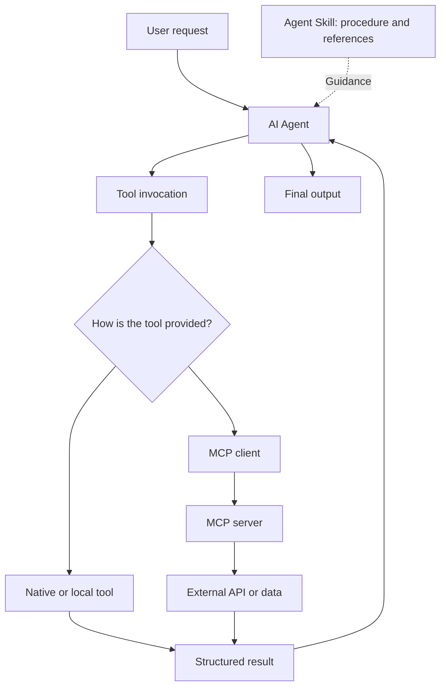
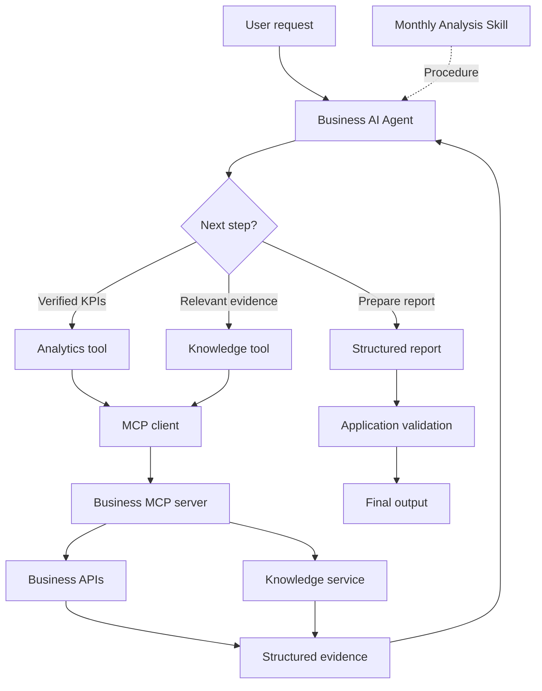
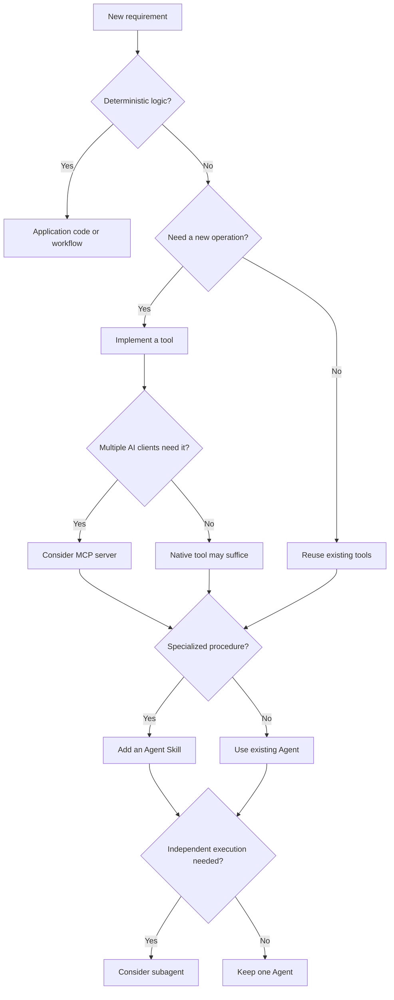

An Agent can have dozens of tools, many Skills, and connections to multiple MCP servers. More capabilities do not automatically make it more useful. What matters is knowing **which mechanism solves which problem and where its responsibility ends**.

## 1. When a simple request becomes an architecture problem

Imagine an AI Assistant for a retail chain. Initially, it only answers:

> "How much did August revenue grow compared with July?"

One data-query tool is enough. The Agent calls it, receives a result, and explains the figure.

Then the product requirement expands:

> "Analyze August business performance, identify unusual metrics, compare them with business documents, and produce a report."

Now the Agent needs sales data, KPI calculations, document search, analysis, and a consistent report format. We could keep adding tools such as `get_sales_data`, `calculate_kpi`, `search_documents`, and `generate_report`. But who decides their order, which evidence is verified, and when the report is complete?

We might add a long system prompt, write an Agent Skill, create a specialized reporting Agent, or expose services through MCP. These are not equivalent choices. They organize **execution, task guidance, connectivity, and decision-making** at different boundaries.

## 2. Four concepts at different layers

| Component | Main role | Question it answers |
| :-- | :-- | :-- |
| Tool | Provides an executable operation | What can the Agent do? |
| Skill | Packages task instructions and resources | How should it do this kind of work? |
| MCP | Standardizes access to external capabilities and data | How does an AI application connect? |
| Agent or subagent | Chooses steps and carries responsibility for a task | Who decides and executes the next step? |

`get_revenue_comparison` could be a tool. `monthly-business-analysis` could be a Skill that instructs an Agent to verify KPIs, distinguish facts from hypotheses, and format a report. An MCP server could expose sales tools to compatible AI applications. A Report Agent could coordinate the work and produce the final answer.



*Figure 1. Skills guide work, tools execute operations, and MCP can provide a connection to external capabilities.*

A Skill does not create new access rights. It may tell an Agent to call `get_sales_data`, but the runtime must actually provide the tool, and the user must be authorized. MCP provides a connection, not the whole business procedure.

## 3. Tool: an action the Agent can use reliably

The [Tool Calling and Agents lesson](../tool-calling-and-agents/) explains how a model requests tool execution. The engineering question is **how much work one tool should own**.

For example, a monthly-revenue tool could accept a store ID, year, and month, enforce access controls, and return structured data. But a dozen tiny tools for fetching each day, summing a month, calculating a percentage, and changing currency can make the Agent perform unnecessary calls. One `analyze_everything` tool hides too much responsibility.

A useful middle ground is an operation with a clear meaning for the Agent, such as `get_revenue_comparison`:

```json
{
  "store_id": "STORE_001",
  "comparison": {
    "previous_period": "2026-07",
    "current_period": "2026-08"
  },
  "previous_revenue": 200000000,
  "current_revenue": 230000000,
  "growth_percent": 15.0,
  "currency": "VND",
  "source_id": "sales_snapshot_v1"
}
```

The application performs a deterministic calculation, while the Agent receives figures, units, periods, and provenance. Do not combine unrelated side effects into the same operation. Canceling an order or sending a report needs its own contract and controls.

A production tool should define valid inputs, authorization, data scope, source metadata, error behavior, and whether it changes state. [Anthropic's tool-design guidance](https://www.anthropic.com/engineering/writing-tools-for-agents) emphasizes clear names, descriptions, and responses shaped for actual Agent tasks. A tool can pass every API unit test yet still be chosen or called incorrectly by an Agent if its interface is ambiguous. Test **Agent use**, not just API correctness.

## 4. Skill: package the way a task should be done

Tools for KPIs and document search do not guarantee a sound monthly report. An Agent might write a recommendation before validating figures or infer a root cause without enough evidence. Task-specific guidance can live in a Skill rather than an ever-growing system prompt.

The [Agent Skills open specification](https://agentskills.io/specification) defines a directory with a required `SKILL.md` and optional scripts, references, and assets:

```text
skills/
└── monthly-business-analysis/
    ├── SKILL.md
    ├── references/
    │   ├── kpi-definitions.md
    │   └── report-guidelines.md
    ├── scripts/
    │   └── validate_report.py
    └── assets/
        └── report-template.md
```

An illustrative `SKILL.md` could say:

```markdown
---
name: monthly-business-analysis
description: Analyze monthly performance using verified sales data.
  Use for monthly business analysis and reporting requests.
---

# Monthly Business Analysis

1. Identify the store and reporting period.
2. Retrieve verified KPIs and compare with the right baseline.
3. Investigate meaningful changes when evidence is available.
4. Separate verified findings from hypotheses.
5. Use the approved report template and preserve source IDs.

Do not invent missing KPI values or claim an unverified root cause.
Read references/kpi-definitions.md when KPI definitions are needed.
Run scripts/validate_report.py only if the runtime permits it.
```

This is an example, not a guarantee that every Agent runtime can read files, run scripts, or call the same tools. Supporting resources can be loaded only when relevant. The spec calls this **progressive disclosure**: discovery metadata first, Skill instructions on activation, then additional files as needed. Actual activation behavior depends on the application.

A Skill is not a function or API endpoint. It guides a potentially multi-step task. It can use native tools, MCP tools, or no tools at all. But mandatory rules cannot live only in `SKILL.md`: an approval requirement must be enforced by the application, and an important KPI formula should be implemented and checked in code. **Skills guide the Agent; code and business services enforce invariants.**

## 5. MCP: share capabilities across AI applications

For one application with a few internal services, native tools may be enough. MCP is not mandatory.

Now imagine that business intelligence, customer support, internal operations, and coding assistants all need access to order status, sales data, or internal documents. Separate integrations can duplicate work. [MCP's architecture](https://modelcontextprotocol.io/docs/learn/architecture) provides a common connection model:

- The **host** is the AI application managing the user experience and connections.
- A **client** inside the host communicates with an MCP server.
- The **server** exposes capabilities and data, including tools, resources, and prompts.

MCP is not synonymous with tool calling. Tool calling is the model requesting an operation; MCP defines how compatible applications discover and communicate with externally provided capabilities. An Agent can still call native tools without MCP.

An MCP server can wrap an existing Sales API. The database, business service, REST API, and authorization checks still matter. MCP adds a standardized AI-facing interface; it does not replace those layers or make a poorly designed tool easy to use. Exposing hundreds of similarly named tools may make selection harder than offering a small, clear set.

## 6. Put Tool, Skill, and MCP together

Suppose a user requests an August business report with unusual changes and evidence-based recommendations:



*Figure 2. One possible architecture, not a requirement that every tool must use MCP.*

The Agent identifies the task and activates the reporting Skill if the runtime supports it. Some applications also allow a user to trigger a Skill explicitly; a slash command is an application convention, not a requirement of the format. The Agent calls Analytics and Knowledge tools, which may be exposed through MCP. The Skill tells it to separate verified facts from hypotheses. If the cost breakdown is unavailable, the Agent asks for more evidence or states the limitation instead of inventing a cause.

Finally, application code can validate the report schema, required sources, and business conditions. Saving or sending the report can go through permission-checked services. The model need not control every side effect.

## 7. When is a Skill not enough, and when do we need a subagent?

A Skill is useful when an existing Agent needs a specialized procedure or standard. A subagent may be useful when a part of the work needs its own context, multiple execution steps, independent state, or can run separately.

For a small reporting system, one Agent could use Skills for monthly analysis, product analysis, and presentation. For a larger task, an Analytics Agent could handle figures, an Inventory Agent could inspect stock, and a Report Agent could combine findings. That division adds routing, handoffs, latency, state management, and end-to-end evaluation. A task does not need a subagent merely because it has a name.

**A Skill packages expertise and procedure; a subagent takes responsibility for executing a part of the work.** A subagent can itself use Skills.

## 8. When is ordinary code or a workflow enough?

If inputs, formula, execution order, and output are already defined, a deterministic workflow is often the right choice. "Calculate revenue and profit for this store and month, then save them" does not require an LLM to choose every step. A button that exports a PDF can call a PDF service directly.

**Do not delegate decisions to an Agent when application code can make them more deterministically and reliably.** Agents are useful for interpreting open-ended requests, choosing information, and adapting when no fixed path exists. Workflows and business services are useful when steps and constraints are explicit.

A Skill can guide an Agent through flexible work, but it does not replace a state machine or process engine when strict execution guarantees are needed. The Agent may suggest an action; the application still decides whether it is valid and authorized.

## 9. Choose an architecture from the requirement



*Figure 3. A decision aid, not a set of mutually exclusive technology choices.*

| Requirement | Usually a sensible starting point |
| :-- | :-- |
| Calculate a fixed KPI | Application code or tool |
| Let an Agent query orders | Tool |
| Reuse an integration across AI clients | Consider MCP server |
| Guide a specialized report | Skill |
| Separate multi-step work and context | Consider subagent |
| Strict data-update process | Workflow or business service |
| Combine task guidance and external data | Skill plus tools, possibly via MCP |

There is no magic threshold at five tools or three Skills. Choose based on responsibility, data boundaries, execution needs, and testability.

## 10. More capabilities mean more security boundaries

`get_order_status` is a read. `cancel_order` changes state. A Skill may instruct the Agent to check an order first, but the cancellation service must still validate identity, permissions, eligibility, and any required approval.

An MCP server's descriptions and returned content are not automatically trustworthy instructions. Treat external material according to its trust level. Skills may also contain executable scripts: inspect their source and constrain the runtime's file, network, and tool access.

**A tool is an execution surface. A Skill may supply instructions and code. MCP is a connection surface. Each needs appropriate authorization and isolation.** A common protocol alone does not make every action safe.

## 11. Evaluate Tool, Skill, and MCP design separately

A cleaner architecture is not automatically a better Agent. Moving a procedure from a long prompt to a Skill may improve maintenance without improving answers. Moving a native tool behind MCP may make reuse easier while adding integration latency. Measure the intended benefit.

- **Tool evaluation:** Was the right tool selected? Were arguments valid? Did it return sufficient evidence? How often did calls fail or repeat?
- **Skill evaluation:** Did relevant requests activate it, and unrelated requests leave it inactive? Did the Agent follow mandatory conditions when data was missing or a tool failed?
- **MCP evaluation:** Did capability discovery and schemas work? Were auth and version changes handled? What happened when the server was unavailable?
- **End-to-end evaluation:** Did task success, answer quality, latency, tool-call count, and policy compliance improve?

Use the same golden cases and, where possible, change one component at a time. For example, keep model and tools fixed while comparing a long system prompt with a Skill. Or keep the Agent fixed and improve only a tool's name, description, and schema. That reveals whether the architecture actually helps, rather than merely looking tidier.

## 12. Common overengineering mistakes

- A tool for every tiny step makes selection and orchestration harder.
- A huge Skill defeats progressive disclosure and overloads context.
- A Skill cannot replace code-level business validation.
- An MCP server is unnecessary for every single-app integration.
- A named function does not automatically deserve its own subagent.
- A good tool or Skill is not useful if the Agent rarely selects it at the right time.

Choose mechanisms for the task in front of you, not because a framework makes them available.

## 13. The right capability at the right boundary

Tools provide executable operations. Skills package specialized instructions and resources. MCP provides a common way for AI applications to connect to external capabilities. Subagents take on independent parts of a task. Application code and workflows remain the right place for deterministic processing and mandatory business rules.

These mechanisms can cooperate, but none is the universal answer. One Agent, a few well-designed tools, and a focused Skill may be enough. A platform with many AI clients or complex independent work may benefit from MCP and specialized subagents.

**The goal is not to give an Agent as many capabilities as possible. It is to give it the right operation, guidance, and authority to complete the task reliably.**

## References and further reading

1. [Anthropic - Equipping Agents for the Real World with Agent Skills](https://www.anthropic.com/engineering/equipping-agents-for-the-real-world-with-agent-skills) - Skill structure and progressive disclosure.
2. [Agent Skills - Open Specification](https://agentskills.io/specification) - `SKILL.md`, metadata, scripts, references, and assets.
3. [MCP - Architecture Overview](https://modelcontextprotocol.io/docs/learn/architecture) and [Specification 2026-07-28](https://modelcontextprotocol.io/specification/2026-07-28) - host, client, server, and protocol primitives.
4. [Anthropic - Writing Effective Tools for Agents](https://www.anthropic.com/engineering/writing-tools-for-agents) - tool interfaces and Agent-use evaluation.
5. [OpenAI - Skills and MCP Servers](https://developers.openai.com/plugins/concepts/skills) and [Build Skills](https://developers.openai.com/plugins/build/skills) - workflow guidance, live data, and Skill evaluation.
6. [Anthropic - Skill Authoring Best Practices](https://platform.claude.com/docs/en/agents-and-tools/agent-skills/best-practices) - context organization and supporting resources.
