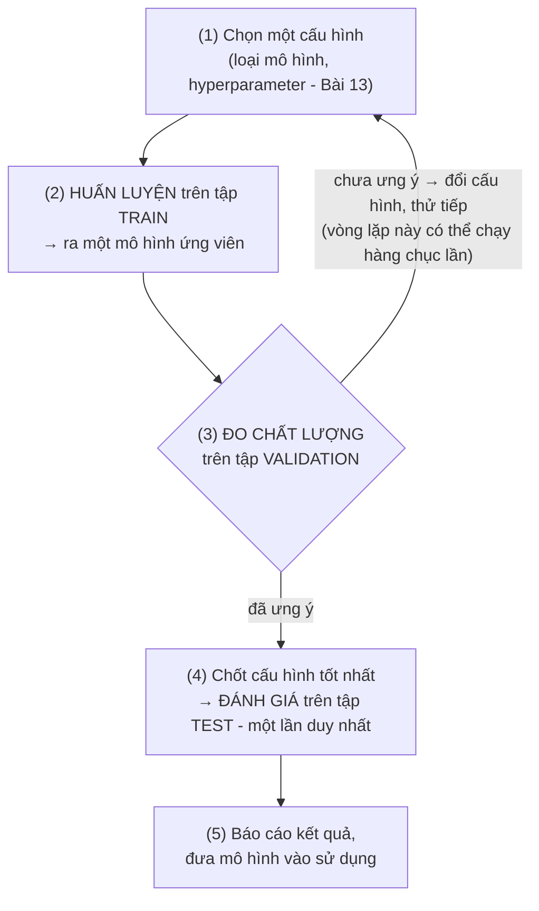

> **Mục tiêu bài học:** Sau bài này, bạn sẽ hiểu vì sao không được chấm điểm mô hình trên chính dữ liệu nó đã học, vai trò của ba tập dữ liệu train / validation / test, quy trình huấn luyện dạng vòng lặp, và kỹ thuật k-fold cross-validation khi dữ liệu ít.

## 1. An, Bình và cái bẫy "học thuộc đề"

Hai người bạn cùng ôn thi với một tập **10 đề mẫu có lời giải**:

- **An** làm đi làm lại cả 10 đề đến mức... thuộc lòng đáp án. Chấm thử trên 10 đề đó: An đạt **10/10**.
- **Bình** chỉ luyện 8 đề, còn **2 đề cất riêng, tuyệt đối không mở ra**. Thỉnh thoảng Bình lấy 2 đề đó ra tự thi thử: được **7/10**.

Kỳ thi thật dùng đề **hoàn toàn mới**. Bạn đặt cược vào ai?

Điểm 10/10 của An không nói lên điều gì cả: có thể An hiểu bài thật, nhưng cũng có thể An chỉ *nhớ* đáp án. Điểm 7/10 của Bình thấp hơn nhưng **đáng tin hơn nhiều**, vì nó được đo trên đề Bình chưa từng thấy. Hai người này sẽ đi cùng bạn suốt bài: An là "mô hình chấm trên dữ liệu đã học", Bình là "mô hình chấm trên dữ liệu cất riêng".

Ở Bài 01, học có giám sát (supervised learning) được ví như học sinh luyện đề có đáp án. Sách *Dive into Deep Learning* đẩy hình ảnh đó thêm một bước: một học sinh luyện đề lâu ngày có thể bắt đầu **ghi nhớ từng câu hỏi** - trông như đã nắm vững kiến thức, nhưng lúng túng trước những câu chưa gặp trong kỳ thi thật. Mô hình ML cũng vậy. Với hàng triệu "núm vặn" (tham số - Bài 13), nó hoàn toàn đủ sức **ghi nhớ gần như từng mẫu dữ liệu** thay vì học ra quy luật chung. Hiện tượng làm tốt trên dữ liệu đã học nhưng kém trên dữ liệu mới gọi là **overfitting (quá khớp)** - Bài 14 sẽ mổ xẻ kỹ; ở bài này, bạn chỉ cần nắm hệ quả thực hành của nó:

> 💡 **Nguyên tắc số 1 khi đánh giá mô hình:** điểm số chỉ có ý nghĩa khi được đo trên dữ liệu mà mô hình **chưa từng dùng để học**.

## 2. Sai số trên tập train là "điểm ảo"

Vì sao 10/10 của An lại "ảo"? Vì quá trình huấn luyện **cố tình** chỉnh tham số để mô hình khớp với dữ liệu train tốt nhất có thể. Sai số trên train thấp là *chuyện đương nhiên phải thế* - nó không phải bằng chứng mô hình giỏi, và **không có gì bảo đảm** mô hình có sai số train thấp nhất cũng sẽ có sai số thấp nhất trên dữ liệu mới.

Thử với bài toán dự đoán giá nhà từ diện tích, 20 căn nhà làm dữ liệu train:

| Mô hình | Sai số trên train | Sai số trên dữ liệu mới |
|---|---|---|
| Đường thẳng đơn giản | vừa phải | vừa phải |
| Đường cong "dẻo" hợp lý | thấp | **thấp nhất** |
| Đường cong uốn éo đi qua đúng cả 20 điểm | ≈ 0 | **rất lớn** |

Mô hình thứ ba đạt sai số train gần bằng 0 - nhưng nó chỉ đang "nối các chấm", ghi nhớ cả những dao động ngẫu nhiên (căn nhà bán đắt hơn vì chủ nhà khéo mặc cả chẳng hạn). Gặp căn nhà mới, những "quy luật" ngẫu nhiên đó phản chủ. Đó chính là An, phiên bản toán học.

Sách *An Introduction to Statistical Learning* tóm tắt hiện tượng này bằng một hình ảnh rất đáng nhớ: khi mô hình càng phức tạp (càng "dẻo"), sai số trên train **giảm đều đặn**, nhưng sai số trên dữ liệu mới lại đi theo **hình chữ U** - giảm đến một điểm rồi quay đầu tăng:

```
 Sai số
   ▲
   │ ●                                   ●   ● : trên dữ liệu MỚI (hình chữ U)
   │   ●                              ●      ○ : trên dữ liệu ĐÃ HỌC (thường giảm đều)
   │ ○   ●                         ●
   │   ○   ●                    ●
   │     ○    ●    ●    ●    ●
   │       ○           ▲
   │         ○ ○       │ vùng "vừa đủ tốt"
   │             ○ ○ ○ ○ ○ ○ ○ ○ ○ ○
   └───────────────────────────────────────►
        mô hình càng phức tạp / khớp train càng "kỹ"
```

Nhìn vào sai số train, bạn sẽ bị cám dỗ chọn mô hình phức tạp nhất - tức là chọn sai. Vậy nên cần dữ liệu riêng để đánh giá, như 2 đề Bình cất đi. Và hóa ra, một tập cất riêng vẫn... chưa đủ.

## 3. Ba tập dữ liệu, ba vai trò: train, validation, test

Bình cất 2 đề để thi thử. Giờ giả sử Bình dùng chính 2 đề đó để thử đủ mọi cách ôn - học theo chủ đề, học theo dạng bài, thức khuya hay dậy sớm - mỗi cách lại thi thử trên 2 đề ấy, cách nào cho điểm cao nhất thì giữ lại. Rồi Bình đem điểm cao nhất đó đi khoe là "năng lực thật". Bạn có tin không?

Xây một mô hình cũng vậy: bạn không huấn luyện một lần rồi xong, mà phải ra **hàng chục quyết định** - dùng loại mô hình nào? mạng nơ-ron mấy tầng? học nhanh hay chậm? Những lựa chọn "cấu hình" này gọi là **hyperparameter (siêu tham số)** - Bài 13 sẽ nói kỹ. Muốn so sánh các lựa chọn, bạn phải chấm điểm chúng trên dữ liệu ngoài tập train.

Điểm tinh tế: nếu dùng **cùng một tập dữ liệu** để vừa chọn cấu hình vừa báo cáo kết quả cuối, thì qua mỗi lần "chọn phương án tốt nhất", thông tin của tập đó đã **rò rỉ vào mô hình** - bạn đang gián tiếp khớp mô hình theo nó. Con số cuối cùng lại thành "điểm ảo" lần nữa, chỉ là ảo ít hơn so với chấm trên train.

Giải pháp: tách hẳn hai vai trò đó ra. Ba tập, ba nhiệm vụ:

| Tập | Tên gọi | Dùng để làm gì | Trong chuyện An & Bình |
|---|---|---|---|
| **Train** | tập huấn luyện | Học **tham số** (chỉnh các núm vặn của mô hình) | 8 đề Bình luyện - bài tập về nhà + sách giải |
| **Validation** | tập kiểm định | **Chọn cấu hình**: so sánh mô hình, chỉnh hyperparameter, quyết định dừng huấn luyện | 2 đề Bình cất riêng - các kỳ **thi thử**, làm nhiều lần để điều chỉnh cách ôn |
| **Test** | tập kiểm tra | **Chấm điểm cuối cùng**, ước lượng chất lượng thật - dùng **một lần** khi mọi thứ đã chốt | Kỳ **thi thật** - chỉ diễn ra một lần |

Tỷ lệ chia **thường gặp**: 70/15/15 hoặc 80/10/10 (tính theo phần trăm cho train/validation/test).

> 🔧 **Thử ngay:** Bạn có 2.000 bệnh án. Chia 80/10/10 thì mỗi tập được bao nhiêu mẫu? Chia 70/15/15 thì sao?
> Đáp: 80/10/10 → train 1.600, validation 200, test 200. 70/15/15 → 1.400 / 300 / 300.

Trước khi chia, thông thường ta **xáo trộn ngẫu nhiên** dữ liệu để ba tập có tính chất tương đồng. Ngoại lệ quan trọng: dữ liệu có yếu tố **thời gian** (giá cổ phiếu, doanh số theo ngày) thì nên chia theo mốc thời gian - train là quá khứ, test là tương lai - nếu không bạn sẽ vô tình cho mô hình "nhìn thấy tương lai". Đó là một dạng **rò rỉ dữ liệu (data leakage)** - kiểu "lộ đề" mà Bài 14 dành hẳn một mục.

> ⚠️ **Lưu ý nhỏ:** Các tỷ lệ trên là quy ước kinh nghiệm chứ không phải chân lý. Dữ liệu **rất lớn** (hàng triệu mẫu): validation và test có thể chiếm tỷ lệ nhỏ hơn nhiều, vì vài chục nghìn mẫu đã đủ cho một ước lượng ổn định. Dữ liệu **ít** (vài trăm đến vài nghìn mẫu): cắt hẳn 30% ra ngoài là khá "đau" - mục 5 sẽ đưa ra giải pháp.

## 4. Quy trình học là một vòng lặp

Ghép tất cả lại, quy trình phát triển một mô hình ML trông như sau:



Vài điểm đáng chú ý trong vòng lặp này:

- **Bước (2)** là nơi diễn ra việc "học" theo nghĩa hẹp: thuật toán tối ưu chỉnh tham số để giảm **hàm mất mát (loss function)** trên tập train - cơ chế cụ thể sẽ nói ở Bài 10 và Bài 11.
- **Bước (3)** dùng một **thước đo đánh giá (metric)** dễ diễn giải cho con người - ví dụ tỷ lệ đoán sai, hay sai số trung bình tính bằng tiền. Phân biệt theo *vai trò*: loss là thứ máy *tối ưu khi học*, còn metric là thứ ta *dùng để đánh giá và chọn lựa* - hai vai có họ hàng nhưng không phải một. Bài 15 dành riêng cho các metric.
- **Vòng lặp (1)→(3)** được phép chạy nhiều lần - validation sinh ra để dùng lặp lại, đúng như Bình thi thử nhiều lần. Còn **bước (4) chỉ chạy một lần**. Vì sao nghiêm ngặt vậy? Mục 6 sẽ trả lời.

> ⚠️ **Lưu ý nhỏ:** Càng đưa nhiều quyết định dựa trên cùng một tập validation, bạn càng có nguy cơ "khớp" dần vào chính tập đó. Nếu đã thử rất nhiều cấu hình, hãy cân nhắc làm mới nó - chia lại, hoặc dùng cross-validation ở mục 5.

## 5. Dữ liệu ít: k-fold cross-validation

Bạn chỉ có 1.000 mẫu dữ liệu bệnh án. Cắt 200 mẫu làm validation, bạn gặp hai vấn đề mà sách *An Introduction to Statistical Learning* phân tích rất rõ:

1. **Kết quả dao động mạnh theo cách chia.** Sách có một thí nghiệm minh họa: lặp lại việc chia ngẫu nhiên train/validation 10 lần trên cùng một bộ dữ liệu, thu được 10 đường cong sai số **khác nhau đáng kể** - may rủi nằm ở chỗ mẫu nào rơi vào tập nào.
2. **Lãng phí dữ liệu.** Mô hình chỉ được học trên 800 mẫu; với dữ liệu ít, mất 20% dữ liệu học sẽ khiến chất lượng mô hình sụt đi đáng kể.

**k-fold cross-validation (kiểm định chéo k phần)** giải quyết cả hai. Quay lại Bình: thay vì cất cố định 2 đề, Bình chia 10 đề thành 5 cặp. Lượt 1 cất cặp thứ nhất, luyện 4 cặp còn lại, thi thử trên cặp đã cất. Lượt 2 cất cặp thứ hai, luyện 4 cặp kia... Sau 5 lượt, **mỗi đề đều được luyện 4 lần và làm đề thi thử đúng 1 lần**. Với 1.000 mẫu chia thành 5 phần bằng nhau A-E, ta cho từng phần lần lượt làm "giám khảo", thay vì cố định một phần làm giám khảo:

| Lượt | Phần A | Phần B | Phần C | Phần D | Phần E | Kết quả |
|:---:|:---:|:---:|:---:|:---:|:---:|:---|
| 1 | **VALIDATION** | train | train | train | train | sai số 1 |
| 2 | train | **VALIDATION** | train | train | train | sai số 2 |
| 3 | train | train | **VALIDATION** | train | train | sai số 3 |
| 4 | train | train | train | **VALIDATION** | train | sai số 4 |
| 5 | train | train | train | train | **VALIDATION** | sai số 5 |

**Điểm cross-validation = trung bình (sai số 1 … sai số 5).**

Mỗi mẫu được dùng để học 4 lần và làm giám khảo đúng 1 lần - không mẫu nào bị lãng phí, và việc lấy trung bình 5 lượt cho kết quả **ổn định hơn hẳn** so với một lần chia duy nhất. Theo sách *An Introduction to Statistical Learning*, k = 5 hoặc k = 10 là các lựa chọn thường dùng trong thực hành, cho ước lượng cân bằng giữa độ chính xác và chi phí tính toán. Cái giá phải trả: huấn luyện k lần thay vì 1 lần.

> 🔧 **Thử ngay:** Vẫn 1.000 mẫu, nhưng dùng **10-fold** thay vì 5-fold: mỗi phần bao nhiêu mẫu? Mỗi lượt mô hình được học trên bao nhiêu mẫu? Huấn luyện tổng cộng mấy lần?
> Đáp: 100 mẫu mỗi phần; học trên 900 mẫu mỗi lượt; huấn luyện 10 lần (thay vì 5).

Sau khi dùng cross-validation để **chọn cấu hình tốt nhất**, thông lệ là huấn luyện lại mô hình với cấu hình đó trên **toàn bộ** dữ liệu train, rồi mới đánh giá trên test.

> ⚠️ **Lưu ý nhỏ:** Huấn luyện k lần với dữ liệu nhỏ thì thường chấp nhận được; với mô hình rất lớn, người ta hay quay về một lần chia train/validation đơn giản.

<details>
<summary><strong>Đào sâu (không bắt buộc): LOOCV và việc chọn k</strong></summary>

Trường hợp cực đoan k = n (n là số mẫu) gọi là **leave-one-out cross-validation (LOOCV)**: mỗi lượt chỉ để đúng **1 mẫu** làm giám khảo, huấn luyện trên n − 1 mẫu còn lại, lặp n lần - với 1.000 mẫu là 1.000 lần huấn luyện. Ưu điểm: tận dụng dữ liệu học tối đa và không phụ thuộc cách chia ngẫu nhiên (kết quả luôn như nhau). Nhược điểm: phải huấn luyện n lần (rất tốn với n lớn), và theo phân tích trong sách *An Introduction to Statistical Learning*, ước lượng của LOOCV có **phương sai cao hơn** so với k-fold khi k nhỏ - vì n mô hình con được huấn luyện trên các tập dữ liệu gần như trùng nhau nên cho ra kết quả rất giống nhau, lấy trung bình của chúng cũng không triệt tiêu được nhiễu bao nhiêu. Đó là một lý do nữa khiến k = 5 hoặc k = 10 được ưa chuộng: một điểm cân bằng giữa hai thái cực.

</details>

## 6. "Nhìn trộm" tập test - lỗi âm thầm nhưng tai hại

Kịch bản rất đời thường: bạn thử cấu hình thứ nhất, tiện tay chấm luôn trên test - 82%. Thử cấu hình thứ hai - 84%. Cứ thế 50 lần, rồi báo cáo con số đẹp nhất: 91%.

Vấn đề: **91% đó không còn đáng tin.** Bằng việc dùng test để chọn đi chọn lại, bạn đã biến test thành... một tập validation thứ hai. Trong 50 lần thử, thế nào cũng có vài cấu hình "ăn may" hợp với những đặc thù ngẫu nhiên của chính tập test đó - và quy trình của bạn chọn đúng những kẻ ăn may. Đó là An ở phiên bản tệ hơn: không chỉ học thuộc đề mẫu, mà còn lén thi thử 50 lần *trên chính đề thi thật* rồi lấy điểm cao nhất đi khoe. Điểm ấy đo độ may mắn nhiều hơn thực lực.

> 🔧 **Thử ngay:** Mô hình đồ chơi: giả sử mỗi cấu hình có 5% khả năng đạt điểm "đẹp" trên test *chỉ nhờ may mắn* (thực lực không hơn gì), và các lần thử độc lập nhau. Thử 50 cấu hình rồi lấy điểm cao nhất - xác suất có ít nhất một lần "ăn may" là bao nhiêu?
> Đáp: $1 - 0.95^{50} \approx 1 - 0.077 \approx 92\%$. Gần như chắc chắn con số bạn khoe là con số ăn may.

Hiện tượng này quen thuộc đến mức các cuộc thi ML trên nền tảng Kaggle phải thiết kế cách phòng ngừa: bảng xếp hạng công khai (public leaderboard) chỉ chấm trên **một phần** tập test, phần còn lại giữ kín để chấm chung cuộc. Cộng đồng Kaggle vẫn thường nhắc chuyện đội dẫn đầu bảng công khai bị tụt hạng khi chấm trên phần giữ kín: qua hàng trăm lần nộp bài, họ đã vô tình "khớp" mô hình theo phần test công khai.

Vài quy tắc thực hành để tự bảo vệ:

- **Khóa test trong két.** Mọi quyết định - chọn mô hình, chỉnh hyperparameter, quyết định dừng - chỉ dựa trên validation.
- Test dùng **một lần**, ở phút chót, cho con số báo cáo cuối cùng.
- Nếu vì lý do nào đó bạn buộc phải chạm vào test nhiều lần, hãy hiểu rằng con số thu được **lạc quan hơn thực tế**, và trung thực ghi chú điều đó khi báo cáo.
- Cảnh giác với các kiểu rò rỉ tinh vi hơn (chuẩn hóa dữ liệu trước khi chia, mẫu trùng lặp nằm ở cả hai tập...) - Bài 14 sẽ điểm danh chúng dưới tên gọi **data leakage**.

## Tóm tắt bài học

- Quá trình huấn luyện cố tình khớp mô hình với tập train, nên **sai số trên train là con số lạc quan** - nó không phải thước đo thực lực. Mô hình đủ phức tạp có thể "học thuộc lòng" dữ liệu như An thuộc đáp án đề mẫu.
- Khi mô hình càng phức tạp, sai số train **nhìn chung đi xuống**, còn sai số trên dữ liệu mới **thường đi theo hình chữ U** - hiện tượng overfitting (Bài 14).
- Ba tập dữ liệu, ba vai trò: **train** học tham số, **validation** chọn cấu hình và so sánh mô hình (dùng nhiều lần - 2 đề Bình cất riêng để thi thử), **test** đánh giá cuối cùng (dùng một lần - kỳ thi thật).
- Tỷ lệ chia **thường gặp** như 70/15/15 hay 80/10/10 chỉ là quy ước kinh nghiệm; dữ liệu càng nhiều, phần validation/test càng có thể chiếm tỷ lệ nhỏ.
- Quy trình học là **vòng lặp**: chọn cấu hình → huấn luyện trên train → đo trên validation → điều chỉnh → ... → chấm test một lần cuối.
- Dữ liệu ít thì dùng **k-fold cross-validation** (k = 5 hoặc 10 là lựa chọn thường dùng): mọi mẫu đều được dùng để học và được làm "giám khảo", kết quả ổn định hơn một lần chia.
- **Không nhìn trộm test.** Dùng test nhiều lần để chọn mô hình sẽ cho con số báo cáo đẹp hơn thực tế.

## Câu hỏi tự kiểm tra

1. Dùng câu chuyện "học thuộc đề", giải thích vì sao một mô hình đạt sai số gần 0 trên tập train vẫn có thể dự đoán tệ trên dữ liệu mới.
2. Validation và test cùng là "dữ liệu mô hình không được học" - vậy vì sao vẫn cần tách thành hai tập riêng? Điều gì xảy ra nếu gộp làm một?
3. Bạn có 800 mẫu dữ liệu bệnh án để xây mô hình dự đoán nguy cơ tái nhập viện. Bạn sẽ đánh giá mô hình bằng cách nào? Vì sao một lần chia train/validation đơn giản có thể không đủ tin cậy ở đây?
4. Đồng nghiệp của bạn thử 30 cấu hình mô hình, mỗi lần đều chấm điểm trên tập test, rồi đưa con số cao nhất vào báo cáo gửi khách hàng. Hãy chỉ ra vấn đề và đề xuất quy trình đúng.
5. Với 5-fold cross-validation trên 1.000 mẫu: mô hình được huấn luyện mấy lần? Mỗi mẫu dữ liệu được nằm trong tập validation mấy lần, tập train mấy lần?
6. Dữ liệu của bạn là doanh số bán hàng theo ngày trong 3 năm. Vì sao chia train/test bằng cách xáo trộn ngẫu nhiên lại là ý tồi? Nên chia thế nào?

## Đọc thêm

**Nguồn nền tảng của bài:**

| Nguồn | Đọc phần nào |
|---|---|
| **Sách *An Introduction to Statistical Learning*** | Chương 2, mục 2.2 *Assessing Model Accuracy* - training error vs. test error, đường cong chữ U; Chương 5, mục 5.1 *Cross-Validation* - validation set approach, LOOCV, k-fold |
| **Sách *Dive into Deep Learning*** | Chương 1, mục *Objective Functions* - train/test set và hình ảnh học sinh ghi nhớ đề luyện thi |

**Nguồn online bổ sung (miễn phí):**

- [Train, Test, and Validation Sets - MLU-Explain](https://mlu-explain.github.io/train-test-validation/) - bài giảng trực quan, tương tác của Machine Learning University (Amazon) về vai trò ba tập dữ liệu.
- [Cross-Validation - MLU-Explain](https://mlu-explain.github.io/cross-validation/) - minh họa k-fold cross-validation bằng hình động, rất dễ hình dung.
- [Cross-validation - scikit-learn User Guide](https://scikit-learn.org/stable/modules/cross_validation.html) - hướng dẫn thực hành chia dữ liệu và cross-validation bằng Python.

> **Bài tiếp theo:** [Hồi quy, phân loại và các kiểu học](../classification-regression-learning-paradigms-vi/) - đã biết cách đánh giá công bằng, giờ ta đi sâu vào từng *dạng bài toán* - hồi quy, phân loại và các "trường phái học" khác nhau của machine learning.
