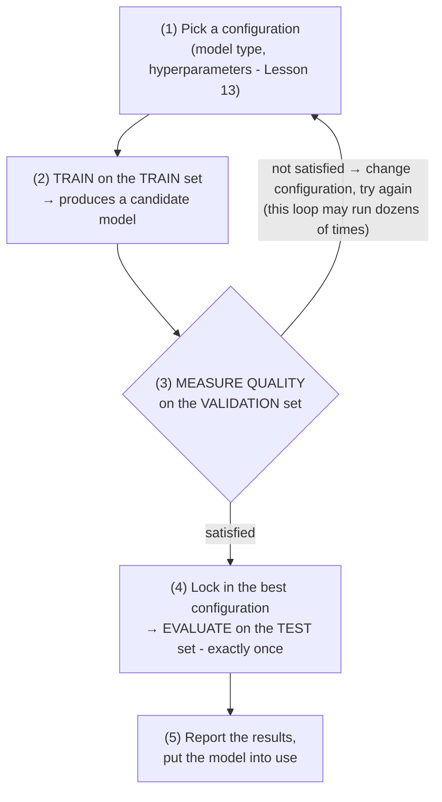

> **Learning objectives:** After this lesson, you will understand why a model must never be scored on the very data it learned from, the roles of the three data sets train / validation / test, the training process as a loop, and the k-fold cross-validation technique for when data is scarce.

## 1. An, Binh and the "memorizing the exam" trap

Two friends are preparing for an exam with the same set of **10 practice exams with worked solutions**:

- **An** works through all 10 again and again until... they know the answers by heart. Scored on those same 10 exams, An gets **10/10**.
- **Binh** practices on only 8, and **sets 2 aside, never opening them**. Every now and then Binh takes those 2 out for a mock exam: they get **7/10**.

The real exam uses **completely new** questions. Who do you bet on?

An's 10/10 tells you nothing: maybe An truly understands the material, but maybe they just *remember* the answers. Binh's 7/10 is lower but **far more trustworthy**, because it was measured on exams Binh had never seen. These two will accompany you throughout the lesson: An is "the model scored on the data it learned from", Binh is "the model scored on data set aside".

In Lesson 01, supervised learning was compared to a student practicing on exams with answer keys. The book *Dive into Deep Learning* pushes that image one step further: a student who drills on practice exams for long enough may start to **memorize each question** - looking as if they have mastered the material, yet fumbling on unseen questions in the real exam. ML models are the same. With millions of "knobs" (parameters - Lesson 13), a model is perfectly capable of **memorizing nearly every data sample** instead of learning the general rule. Doing well on the data it learned from but poorly on new data is called **overfitting** - Lesson 14 will dissect it in detail; in this lesson, you only need its practical consequence:

> 💡 **Rule number 1 when evaluating a model:** a score is only meaningful when measured on data the model **has never used to learn**.

## 2. Error on the training set is a "phantom score"

Why is An's 10/10 "phantom"? Because the training process **deliberately** adjusts the parameters to make the model fit the training data as well as it possibly can. Low error on train is *simply what must happen* - it is not evidence that the model is good, and there is **no guarantee** that the model with the lowest training error will also have the lowest error on new data.

Try it on the problem of predicting house prices from floor area, with 20 houses as training data:

| Model | Error on train | Error on new data |
|---|---|---|
| A simple straight line | moderate | moderate |
| A reasonably "flexible" curve | low | **lowest** |
| A wiggly curve passing exactly through all 20 points | ≈ 0 | **very large** |

The third model reaches a training error of nearly 0 - but it is only "connecting the dots", memorizing even the random fluctuations (a house that sold for more because the owner was a skilled negotiator, say). Faced with a new house, those random "rules" backfire. That is An, in mathematical form.

The book *An Introduction to Statistical Learning* sums up this phenomenon with a very memorable picture: as the model gets more complex (more "flexible"), the error on train **decreases steadily**, but the error on new data follows a **U shape** - it falls to a point and then turns back up:

```
 Error
   ▲
   │ ●                                   ●   ● : on NEW data (U shape)
   │   ●                              ●      ○ : on data ALREADY LEARNED (usually falls steadily)
   │ ○   ●                         ●
   │   ○   ●                    ●
   │     ○    ●    ●    ●    ●
   │       ○           ▲
   │         ○ ○       │ the "just good enough" zone
   │             ○ ○ ○ ○ ○ ○ ○ ○ ○ ○
   └───────────────────────────────────────►
        more complex model / fits train more "tightly"
```

Looking at training error, you will be tempted to pick the most complex model - that is, to pick wrong. So you need separate data for evaluation, like the 2 exams Binh set aside. And it turns out that one set held aside is... still not enough.

## 3. Three data sets, three roles: train, validation, test

Binh set 2 exams aside for mock tests. Now suppose Binh uses those same 2 exams to try every possible way of studying - by topic, by question type, staying up late or getting up early - and for each method takes a mock test on those 2 exams, keeping whichever method scores highest. Then Binh goes around showing off that highest score as their "true ability". Would you believe it?

Building a model works the same way: you do not train once and call it done; you have to make **dozens of decisions** - which kind of model? how many layers in the neural network? learn fast or slow? These "configuration" choices are called **hyperparameters** - Lesson 13 will cover them in detail. To compare the options, you must score them on data outside the training set.

The subtle point: if you use **the same data set** both to choose the configuration and to report the final result, then with every "pick the best option" step, information from that set has **leaked into the model** - you are indirectly fitting the model to it. The final number becomes a "phantom score" once again, just less phantom than scoring on train.

The solution: separate those two roles completely. Three sets, three jobs:

| Set | Name | What it is for | In the story of An & Binh |
|---|---|---|---|
| **Train** | training set | Learn the **parameters** (adjust the model's knobs) | The 8 exams Binh practices on - homework + the solutions book |
| **Validation** | validation set | **Choose the configuration**: compare models, tune hyperparameters, decide when to stop training | The 2 exams Binh set aside - the **mock exams**, taken many times to adjust how they study |
| **Test** | test set | **The final score**, an estimate of true quality - used **once**, when everything is settled | The **real exam** - happens only once |

**Common** split ratios: 70/15/15 or 80/10/10 (percentages for train/validation/test).

> 🔧 **Try it now:** You have 2,000 medical records. With an 80/10/10 split, how many samples does each set get? What about 70/15/15?
> Answer: 80/10/10 → train 1,600, validation 200, test 200. 70/15/15 → 1,400 / 300 / 300.

Before splitting, we usually **shuffle** the data randomly so that the three sets have similar characteristics. An important exception: data with a **time** component (stock prices, daily sales) should be split by a point in time - train is the past, test is the future - otherwise you will inadvertently let the model "see the future". That is a form of **data leakage** - the "leaked exam" kind that Lesson 14 devotes a whole section to.

> ⚠️ **A small note:** The ratios above are rules of thumb, not gospel. With **very large** data (millions of samples), validation and test can take a much smaller share, because a few tens of thousands of samples are already enough for a stable estimate. With **little** data (a few hundred to a few thousand samples), carving a full 30% out is quite "painful" - Section 5 will offer a solution.

## 4. The learning process is a loop

Putting it all together, the process of developing an ML model looks like this:



A few points worth noting in this loop:

- **Step (2)** is where "learning" in the narrow sense happens: the optimization algorithm adjusts the parameters to reduce the **loss function** on the training set - the concrete mechanism is covered in Lesson 10 and Lesson 11.
- **Step (3)** uses an **evaluation metric** that is easy for humans to interpret - for example the error rate, or the average error in money terms. Distinguish them by *role*: the loss is what the machine *optimizes while learning*, while the metric is what we *use to evaluate and choose* - the two are related but not the same. Lesson 15 is devoted to metrics.
- **The loop (1)→(3)** may run many times - validation exists to be used repeatedly, just as Binh takes mock exams many times. But **step (4) runs only once**. Why so strict? Section 6 will answer.

> ⚠️ **A small note:** The more decisions you base on the same validation set, the greater the risk of gradually "fitting" to that very set. If you have tried a great many configurations, consider refreshing it - re-splitting, or using cross-validation from Section 5.

## 5. Little data: k-fold cross-validation

You have only 1,000 samples of medical records. Carving out 200 samples for validation, you run into two problems that the book *An Introduction to Statistical Learning* analyzes very clearly:

1. **The result swings strongly depending on the split.** The book has an illustrative experiment: repeating the random train/validation split 10 times on the same data set yields 10 error curves that **differ considerably** - the luck lies in which samples land in which set.
2. **Wasted data.** The model only gets to learn from 800 samples; with little data, losing 20% of the learning data will make the model's quality drop considerably.

**k-fold cross-validation** solves both. Back to Binh: instead of setting 2 exams aside for good, Binh splits the 10 exams into 5 pairs. Round 1 sets the first pair aside, practices on the other 4 pairs, and takes a mock test on the pair set aside. Round 2 sets the second pair aside, practices on the other 4... After 5 rounds, **every exam has been practiced on 4 times and used as a mock test exactly once**. With 1,000 samples split into 5 equal parts A-E, each part takes its turn as the "examiner" instead of appointing one fixed examiner:

| Round | Part A | Part B | Part C | Part D | Part E | Result |
|:---:|:---:|:---:|:---:|:---:|:---:|:---|
| 1 | **VALIDATION** | train | train | train | train | error 1 |
| 2 | train | **VALIDATION** | train | train | train | error 2 |
| 3 | train | train | **VALIDATION** | train | train | error 3 |
| 4 | train | train | train | **VALIDATION** | train | error 4 |
| 5 | train | train | train | train | **VALIDATION** | error 5 |

**Cross-validation score = average (error 1 … error 5).**

Each sample is used for learning 4 times and serves as examiner exactly once - no sample is wasted, and averaging over 5 rounds makes the result **far more stable** than a single split. According to the book *An Introduction to Statistical Learning*, k = 5 or k = 10 are the common choices in practice, giving an estimate that balances accuracy against computational cost. The price you pay: training k times instead of once.

> 🔧 **Try it now:** Still 1,000 samples, but using **10-fold** instead of 5-fold: how many samples per part? How many samples does the model learn from in each round? How many times is it trained in total?
> Answer: 100 samples per part; learns from 900 samples each round; trained 10 times (instead of 5).

After using cross-validation to **choose the best configuration**, the usual practice is to retrain the model with that configuration on **all** of the training data, and only then evaluate on test.

> ⚠️ **A small note:** Training k times on small data is usually acceptable; with very large models, people often fall back to a single simple train/validation split.

<details>
<summary><strong>Going deeper (optional): LOOCV and choosing k</strong></summary>

The extreme case k = n (n being the number of samples) is called **leave-one-out cross-validation (LOOCV)**: each round leaves exactly **1 sample** as the examiner, trains on the remaining n − 1 samples, and repeats n times - with 1,000 samples that is 1,000 training runs. Advantages: it makes maximal use of the learning data and does not depend on a random split (the result is always the same). Disadvantages: it requires training n times (very costly for large n), and according to the analysis in the book *An Introduction to Statistical Learning*, the LOOCV estimate has **higher variance** than k-fold with a small k - because the n sub-models are trained on nearly identical data sets, they produce very similar results, so averaging them does not cancel out much of the noise. That is one more reason k = 5 or k = 10 is preferred: a balance point between the two extremes.

</details>

## 6. "Peeking" at the test set - a silent but harmful mistake

A very everyday scenario: you try the first configuration and, while you're at it, score it on test - 82%. Try the second - 84%. And so on 50 times, then report the prettiest number: 91%.

The problem: **that 91% is no longer trustworthy.** By using test to choose over and over, you have turned test into... a second validation set. Across 50 attempts, there are bound to be a few configurations that got "lucky" by matching the random quirks of that particular test set - and your process picks exactly those lucky ones. That is An in a worse version: not only memorizing the practice exams, but also secretly taking 50 mock tests *on the real exam itself* and showing off the highest score. That score measures luck more than ability.

> 🔧 **Try it now:** A toy model: suppose each configuration has a 5% chance of getting a "pretty" score on test *purely by luck* (no better in true ability), and the attempts are independent. Try 50 configurations and take the highest score - what is the probability of at least one "lucky" hit?
> Answer: $1 - 0.95^{50} \approx 1 - 0.077 \approx 92\%$. It is almost certain that the number you show off is a lucky one.

This phenomenon is so familiar that ML competitions on the Kaggle platform have to design safeguards: the public leaderboard scores only on **part** of the test set, with the rest held back for the final scoring. The Kaggle community still often recalls teams leading the public leaderboard dropping in rank when scored on the held-back part: over hundreds of submissions, they had inadvertently "fitted" their model to the public test part.

A few practical rules to protect yourself:

- **Lock test in the safe.** Every decision - choosing the model, tuning hyperparameters, deciding when to stop - is based only on validation.
- Use test **once**, at the very end, for the final reported number.
- If for some reason you are forced to touch test more than once, understand that the number you get is **more optimistic than reality**, and honestly note that when reporting.
- Watch out for subtler kinds of leakage (normalizing the data before splitting, duplicate samples appearing in both sets...) - Lesson 14 will call them out under the name **data leakage**.

## Lesson summary

- The training process deliberately fits the model to the training set, so **error on train is an optimistic number** - it is not a measure of true ability. A sufficiently complex model can "memorize" the data just as An memorized the answers to the practice exams.
- As the model gets more complex, training error **generally goes down**, while error on new data **usually follows a U shape** - the phenomenon of overfitting (Lesson 14).
- Three data sets, three roles: **train** learns the parameters, **validation** chooses the configuration and compares models (used many times - the 2 exams Binh set aside for mock tests), **test** gives the final evaluation (used once - the real exam).
- **Common** split ratios like 70/15/15 or 80/10/10 are only rules of thumb; the more data you have, the smaller the share validation/test can take.
- The learning process is a **loop**: pick a configuration → train on train → measure on validation → adjust → ... → score on test one final time.
- With little data, use **k-fold cross-validation** (k = 5 or 10 are the common choices): every sample gets to be learned from and to be the "examiner", and the result is more stable than a single split.
- **Do not peek at test.** Using test many times to choose a model gives a reported number prettier than reality.

## Self-check questions

1. Using the "memorizing the exam" story, explain why a model with near-zero error on the training set can still predict poorly on new data.
2. Validation and test are both "data the model does not learn from" - so why do they still need to be two separate sets? What happens if they are merged into one?
3. You have 800 medical records to build a model predicting the risk of hospital readmission. How would you evaluate the model? Why might a single simple train/validation split not be reliable enough here?
4. Your colleague tries 30 model configurations, scoring each one on the test set, then puts the highest number into a report sent to the client. Point out the problem and propose the correct procedure.
5. With 5-fold cross-validation on 1,000 samples: how many times is the model trained? How many times does each data sample sit in the validation set, and how many times in the training set?
6. Your data is daily sales over 3 years. Why is splitting train/test by random shuffling a bad idea? How should it be split?

## Further reading

**Primary sources for this lesson:**

| Source | Which part to read |
|---|---|
| **The book *An Introduction to Statistical Learning*** | Chapter 2, Section 2.2 *Assessing Model Accuracy* - training error vs. test error, the U-shaped curve; Chapter 5, Section 5.1 *Cross-Validation* - validation set approach, LOOCV, k-fold |
| **The book *Dive into Deep Learning*** | Chapter 1, the *Objective Functions* section - train/test set and the image of a student memorizing practice exams |

**Additional free online sources:**

- [Train, Test, and Validation Sets - MLU-Explain](https://mlu-explain.github.io/train-test-validation/) - a visual, interactive lecture from Machine Learning University (Amazon) on the roles of the three data sets.
- [Cross-Validation - MLU-Explain](https://mlu-explain.github.io/cross-validation/) - illustrates k-fold cross-validation with animations, very easy to picture.
- [Cross-validation - scikit-learn User Guide](https://scikit-learn.org/stable/modules/cross_validation.html) - a hands-on guide to splitting data and cross-validation in Python.

> **Next lesson:** [Classification, Regression & Learning Paradigms](../classification-regression-learning-paradigms/) - now that you know how to evaluate fairly, we dig into each *type of problem* - regression, classification and the different "schools of learning" in machine learning.
