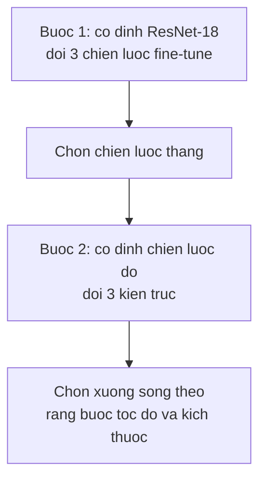

> **Mục tiêu bài học:** Sau bài này, bạn sẽ chọn được mức fine-tune hợp với lượng dữ liệu mình có thay vì mặc định mở hết, biết đọc bảng đánh đổi accuracy-tốc độ-kích thước để chọn xương sống, và hiểu vì sao cùng một câu hỏi lại có hai câu trả lời ngược nhau ở chương này và chương Deep Learning.

## 1. Thí nghiệm đổi một biến mỗi lần

Câu hỏi thực tế khi bắt đầu một dự án phân loại ảnh có hai phần, và chúng hay bị hỏi lẫn vào nhau:

1. **Fine-tune tới đâu?** Đóng băng hết chỉ train tầng cuối, mở vài tầng cuối, hay mở toàn bộ?
2. **Dùng xương sống nào?** ResNet-18, ResNet-50, hay một mô hình nhẹ cho điện thoại?

Hỏi cả hai cùng lúc thì cần chín thí nghiệm và không đọc được kết quả - chênh lệch đến từ chiến lược hay từ kiến trúc? Nên bài này hỏi tách làm hai bước, mỗi bước đổi đúng một biến:

**Bài toán:** Oxford-IIIT Pet - 37 giống chó mèo. Dùng **1.500 ảnh train** (lấy ngẫu nhiên cố định, seed 42) và **1.000 ảnh validation**, cố tình ít để giống tình huống thật, 3 epoch, Adam.

Gọi 1.000 ảnh ấy là *validation* chứ không phải *test* là chuyện có chủ đích: chúng được dùng để **chọn chiến lược rồi chọn kiến trúc**, tức đúng vai trò chọn lựa. Đây là quy ước mà chương Deep Learning · Bài 12 đã dựng, và chương này giữ nguyên.

> ⚠️ **Lưu ý nhỏ về cách đọc mọi con số dưới đây.** Chúng là **một lần chạy minh họa** trên **một tập validation**, không phải trung bình nhiều seed. Hai giới hạn đi kèm. Thứ nhất, mỗi cấu hình chỉ train một lần, nên chênh lệch nhỏ có thể chỉ là khác biệt giữa hai lần khởi tạo. Thứ hai, các mô hình được chấm trên **cùng 1.000 ảnh**, nên kết quả của chúng tương quan với nhau - một phép so đúng cách phải tính đến chuyện đó (bootstrap theo ảnh, hoặc kiểm định McNemar), chứ không thể lấy sai số của một tỉ lệ đơn lẻ làm ngưỡng. Vì thế bài này không đặt ra một ngưỡng "đáng tin" nào: chênh lệch dưới một điểm coi như **chưa phân biệt được**, chênh lệch vài điểm là **đáng điều tra tiếp**, và muốn khẳng định thì cần nhiều seed. Đây là đo trên máy này theo quy ước bài 01.

## 2. Fine-tune tới đâu

Ba chiến lược trên cùng ResNet-18 đã học ImageNet, cùng dữ liệu, cùng số epoch:

| Chiến lược | Tham số được train | Accuracy | Thời gian |
|---|---|---|---|
| **Đóng băng, chỉ train tầng cuối** | **18.981** | **0,844** | **152 s** |
| Mở thêm khối cuối | 8.412.709 | 0,843 | 186 s |
| Fine-tune toàn bộ | 11.195.493 | 0,836 | 292 s |

Đọc bảng này cho đúng là chỗ đáng dừng lại.

**Mở thêm 590 lần số tham số không mua được gì.** Từ 18.981 lên 11,2 triệu tham số được train, tốn gần gấp đôi thời gian, mà accuracy đi từ 0,844 xuống 0,836. Chênh lệch 0,8 điểm ấy quá nhỏ để đọc thành gì với một lần chạy - nên kết luận đúng là *"fine-tune toàn bộ không mua được gì ở đây"*, chứ **không phải** *"fine-tune toàn bộ tệ hơn"*.

Cái đọc được chắc chắn là chuyện khác, và nó rõ ràng: **chiến lược rẻ nhất cho kết quả ngang chiến lược đắt nhất.** Với ngần này dữ liệu, cách đơn giản nhất đã chạm trần.

**Vì sao lại thế.** 1.500 ảnh cho 37 lớp là khoảng 40 ảnh mỗi lớp. Mở 11,2 triệu tham số cho 1.500 mẫu là đúng công thức overfit của Foundations · Bài 14 - capacity cao, dữ liệu ít. Đóng băng phần thân là một cách hạn chế capacity rất mạnh, và ở đây nó không phải hy sinh gì cả.

## 3. Vì sao Deep Learning · Bài 11 cho kết quả ngược lại

Đến đây có một mâu thuẫn phải giải quyết. Chương Deep Learning · Bài 11 làm gần đúng thí nghiệm này và ra kết quả **ngược hẳn**:

| Bài | Dữ liệu | Đóng băng | Fine-tune toàn bộ |
|---|---|---|---|
| Deep Learning · Bài 11 | FashionMNIST, 2.000 ảnh | 0,7870 | **0,8990** |
| Bài này | Oxford Pet, 1.500 ảnh | **0,844** | 0,836 |

Cùng ResNet đã học ImageNet, cùng cỡ dữ liệu, hai kết luận trái ngược. Lượng dữ liệu không giải thích được, vì hai bên xấp xỉ nhau.

Thứ giải thích được là **khoảng cách giữa dữ liệu mới và dữ liệu mô hình đã học**:

- **FashionMNIST** là ảnh **xám 28×28** chụp quần áo trên nền trắng. ImageNet là ảnh màu chụp cảnh thật. Đặc trưng đóng băng của ResNet - vốn học từ ảnh màu độ phân giải cao - không hợp lắm, nên phải chỉnh mới dùng được.
- **Oxford Pet** là 37 giống chó mèo. ImageNet có sẵn **hơn một trăm lớp chó mèo** trong 1.000 lớp của nó. Đặc trưng đóng băng gần như đã sẵn sàng; chỉ cần một tầng tuyến tính đọc lại chúng.

Đây chính là dòng đầu tiên trong bảng quyết định mà chương Deep Learning · Bài 11 đưa ra - *"rất ít dữ liệu, giống ImageNet → đóng băng, chỉ train tầng cuối"* - giờ có số liệu ở cả hai phía để thấy nó không phải quy tắc suông.

Nên câu hỏi đúng khi bắt đầu một dự án không phải "tôi có bao nhiêu ảnh" mà là **hai câu hỏi cùng lúc**: tôi có bao nhiêu ảnh, và dữ liệu của tôi cách dữ liệu tiền huấn luyện bao xa.

> 🔧 **Thử ngay:** bạn có 800 ảnh chụp X-quang phổi và cần phân loại 4 loại bệnh. Chọn chiến lược nào?
> Không đoán được từ số lượng ảnh, vì phải hỏi câu thứ hai. Ảnh X-quang **xa ImageNet hơn cả FashionMNIST**: ảnh xám, kết cấu hoàn toàn khác, và thứ phân biệt các lớp là những mảng mờ chứ không phải hình dạng vật thể. Nên đây giống tình huống của chương Deep Learning · Bài 11 hơn, và fine-tune sâu hơn nhiều khả năng đáng công - nhưng 800 ảnh thì mở toàn bộ rất dễ overfit. Cách làm hợp lý là **thử cả ba như mục 2** với learning rate nhỏ cho phần thân, chấm bằng validation, rồi mới chốt. Bảng ở mục 2 tồn tại để bạn biết cách thử, không phải để chép kết quả.

## 4. Chọn xương sống

Giữ nguyên chiến lược thắng ở mục 2 - đóng băng, chỉ train tầng cuối - rồi đổi kiến trúc:

| Xương sống | Tổng tham số | Tham số được train | Accuracy | Thời gian |
|---|---|---|---|---|
| MobileNetV3-Small | **1.555.781** | 37.925 | 0,788 | **38 s** |
| ResNet-18 | 11.195.493 | 18.981 | 0,844 | 144 s |
| **ResNet-50** | 23.583.845 | 75.813 | **0,866** | 448 s |

Ba nhận xét, đọc theo mức đáng tin:

**MobileNetV3-Small kém 5,6 điểm so với ResNet-18** - khoảng cách đủ lớn để đáng tin cậy hơn hẳn hai dòng trên, dù vẫn nên xác nhận bằng vài seed trước khi đem đi quyết định. Đổi lại nó nhỏ hơn **7 lần** và nhanh hơn **gần 4 lần**. Đây là lựa chọn cho điện thoại và thiết bị nhúng, đúng mục đích nó sinh ra.

**ResNet-50 hơn ResNet-18 2,2 điểm** - đáng để điều tra tiếp, nhưng một lần chạy trên một tập validation thì chưa chốt được. Cái chắc chắn là nó chậm hơn **3,1 lần**.

**Không cột tham số nào dự báo được chất lượng.** ResNet-18 train ít tham số nhất (18.981) mà hơn MobileNet train nhiều gấp đôi - nên số tham số *được train* rõ ràng không nói lên gì. Nhưng cũng đừng vội thay nó bằng cột **tổng** tham số: cột ấy cho biết chi phí bộ nhớ và chi phí suy luận, không phải chất lượng đặc trưng. Một mô hình nhỏ hoàn toàn có thể cho đặc trưng tốt hơn một mô hình lớn trên một bài toán cụ thể - bài 10 sẽ gặp đúng một ca như vậy, nơi cùng một ResNet-50 với hai gói trọng số khác nhau cho kết quả chênh 17,8 điểm mà số tham số không đổi một chút nào.

Chất lượng đặc trưng **chỉ đo được bằng cách đem thử trên chính bài toán đích**, và bảng trên chính là phép đo ấy.

Quy trình chọn trong thực tế đi ngược thứ tự bảng: **bắt đầu từ ràng buộc, không phải từ accuracy.**

- Chạy trên máy chủ, không giới hạn thời gian → lấy mô hình lớn nhất chịu được
- Chạy trên điện thoại, cần dưới 100 ms → danh sách ứng viên chỉ còn họ MobileNet và tương đương, rồi mới so accuracy trong đó
- Chạy theo lô hàng triệu ảnh mỗi đêm → tính tiền máy trước, vì 3,1 lần thời gian là 3,1 lần hóa đơn

## 5. Ba mức của cùng một ý tưởng

Gộp cả bài lại, transfer learning có ba mức, xếp theo lượng dữ liệu bạn có:

| Mức | Làm gì | Hợp khi nào |
|---|---|---|
| **Trích đặc trưng** | Đóng băng, chỉ train tầng cuối | Rất ít dữ liệu, hoặc dữ liệu gần với dữ liệu tiền huấn luyện |
| **Fine-tune một phần** | Mở vài khối cuối, learning rate nhỏ | Dữ liệu vừa phải, hoặc hơi khác dữ liệu tiền huấn luyện |
| **Fine-tune toàn bộ** | Mở hết, learning rate rất nhỏ | Nhiều dữ liệu, hoặc dữ liệu khác hẳn |

Mức đầu tiên chính là thứ bài 11 sẽ nhìn lại dưới một cái tên khác: nếu bạn đóng băng phần thân, thì thực chất bạn đang dùng mạng như một **máy biến ảnh thành vector**, rồi huấn luyện một bộ phân loại tuyến tính trên vector ấy. Bảng ở mục 4 vì thế cũng là bảng đo *chất lượng của vector* mà mỗi xương sống tạo ra.

## Tóm tắt bài học

- Hỏi tách hai câu - chiến lược fine-tune trước, kiến trúc sau - cho phép đọc được kết quả; hỏi gộp thì không biết chênh lệch đến từ đâu.
- Trên 1.500 ảnh Oxford Pet, **đóng băng hoàn toàn (18.981 tham số) ngang với fine-tune toàn bộ (11,2 triệu tham số)**: 0,844 so với 0,836 - chênh lệch quá nhỏ để đọc thành gì với một lần chạy.
- Kết luận đúng là *"fine-tune toàn bộ không mua được gì ở đây"*, không phải *"nó tệ hơn"* - một lần chạy không nói được câu thứ hai.
- Chương Deep Learning · Bài 11 cho kết quả **ngược lại** (0,8990 khi fine-tune toàn bộ so với 0,7870 khi đóng băng). Lượng dữ liệu không giải thích được vì hai bên xấp xỉ nhau; **một lời giải thích khớp với cả hai kết quả là khoảng cách tới dữ liệu tiền huấn luyện** - FashionMNIST xa ImageNet, Oxford Pet thì rất gần. Hai thí nghiệm này chưa cô lập được yếu tố ấy, nên đó là giả thuyết đáng dùng để ra quyết định, không phải kết luận đã chứng minh.
- Câu hỏi đúng khi bắt đầu dự án là **hai câu cùng lúc**: có bao nhiêu ảnh, và dữ liệu cách dữ liệu tiền huấn luyện bao xa.
- Chọn xương sống: MobileNetV3-Small kém 5,6 điểm nhưng nhỏ hơn 7 lần và nhanh hơn gần 4 lần; ResNet-50 hơn ResNet-18 2,2 điểm nhưng chậm hơn 3,1 lần.
- **Không cột tham số nào dự báo chất lượng đặc trưng**: số tham số được train cho biết chi phí fine-tune, tổng tham số cho biết chi phí bộ nhớ và suy luận. Chất lượng đặc trưng chỉ đo được trên validation của bài toán đích.
- Chọn kiến trúc bắt đầu từ **ràng buộc triển khai**, rồi mới so accuracy trong số ứng viên còn lại.

## Câu hỏi tự kiểm tra

1. Vì sao bài này hỏi tách hai bước thay vì chạy cả chín tổ hợp?
2. Đóng băng cho 0,844 còn fine-tune toàn bộ cho 0,836. Vì sao không được kết luận đóng băng tốt hơn? Nêu hai nguồn bất định khác nhau khiến con số 0,8 điểm ấy không đọc được.
3. Cùng cỡ dữ liệu mà chương Deep Learning · Bài 11 và bài này ra kết luận ngược nhau. Giải thích, và nêu bạn kiểm chứng giả thuyết ấy bằng thí nghiệm nào.
4. ResNet-18 train ít tham số hơn MobileNetV3-Small mà accuracy cao hơn 5,6 điểm. Vì sao **cả hai** cột tham số đều không dùng để dự báo chất lượng đặc trưng được?
5. Bạn có 200 ảnh sản phẩm lỗi, ảnh chụp cận cảnh bề mặt kim loại. Chọn chiến lược nào và vì sao? Bạn cần biết thêm gì?
6. Vì sao khi fine-tune sâu người ta dùng learning rate nhỏ hơn hẳn so với khi chỉ train tầng cuối?
7. Ứng dụng của bạn phải chạy trên điện thoại trong 80 ms. Mô tả quy trình chọn mô hình, và nêu chỗ bảng ở mục 4 **không** giúp được gì.

## Đọc thêm

**Nguồn nền tảng của bài:**

| Nguồn | Đọc phần nào |
|---|---|
| **Chương Deep Learning · Bài 11** | Ba cách transfer learning và bảng quyết định - bài này đo lại ở phía dữ liệu gần ImageNet |
| **Foundations · Bài 13, 14** | Capacity và overfitting - nền để hiểu vì sao đóng băng lại đủ khi dữ liệu ít |
| **Bài 05 của chương này** | Augmentation - cách khác để bù dữ liệu ít, dùng chung với transfer learning |
| **Dive into Deep Learning (d2l.ai)** | Chương 14.2 *Fine-Tuning* - cài đặt và cách đặt learning rate khác nhau cho thân và đầu |

**Nguồn online bổ sung (miễn phí):**

- [Oxford-IIIT Pet Dataset](https://www.robots.ox.ac.uk/~vgg/data/pets/) - bộ dữ liệu dùng trong bài, 37 giống, kèm cả mặt nạ phân đoạn mà bài 09 dùng.
- [Yosinski và cộng sự - How transferable are features in deep neural networks? (NeurIPS 2014)](https://arxiv.org/abs/1411.1792) - đo mức dùng lại được của từng tầng, tức chính câu hỏi "mở tới đâu" ở mục 2.
- [Kornblith, Shlens, Le - Do Better ImageNet Models Transfer Better? (CVPR 2019)](https://arxiv.org/abs/1805.08974) - khảo sát trên nhiều bộ dữ liệu, đọc để thấy bảng mục 4 nằm ở đâu trong bức tranh lớn.
- [Howard và cộng sự - Searching for MobileNetV3 (ICCV 2019)](https://arxiv.org/abs/1905.02244) - kiến trúc nhẹ ở mục 4 và các đánh đổi nó chọn.
- [Transfer learning tutorial - PyTorch](https://pytorch.org/tutorials/beginner/transfer_learning_tutorial.html) - mã nguồn đầy đủ cho cả ba chiến lược, tiện để chạy lại.

> **Bài tiếp theo:** [Phát hiện vật thể I: từ bounding box tới mAP](../object-detection-bounding-boxes-to-map-vi/) - sáu bài đầu đều trả lời câu hỏi *"trong ảnh có gì"* bằng đúng một nhãn. Bài sau đổi câu hỏi thành *"có những gì, và mỗi thứ ở đâu"* - và câu hỏi mới ấy làm mọi thước đo đã dùng trở nên vô dụng, nên phải dựng lại từ đầu.
