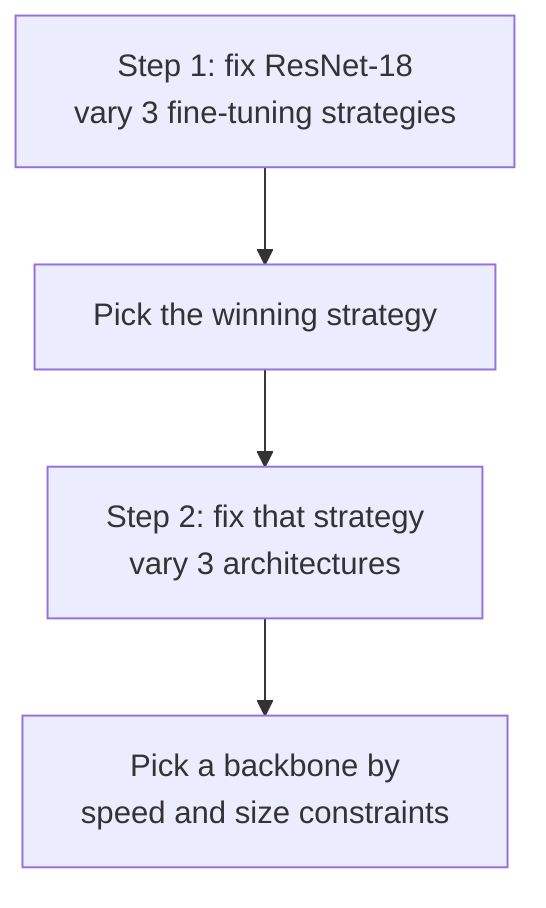

> **Learning objectives:** After this lesson, you will be able to choose a fine-tuning level that suits the amount of data you have instead of unfreezing everything by default, read the accuracy-speed-size trade-off table to choose a backbone, and understand why the same question gets two opposite answers in this chapter and in the Deep Learning chapter.

## 1. An experiment that changes one variable at a time

The practical question when starting an image classification project has two parts, and they often get asked as one:

1. **How far to fine-tune?** Freeze everything and train only the last layer, unfreeze the last few layers, or unfreeze all of it?
2. **Which backbone to use?** ResNet-18, ResNet-50, or a lightweight model for phones?

Asking both at once requires nine experiments and the results cannot be read - does a difference come from the strategy or from the architecture? So this lesson asks in two separate steps, each changing exactly one variable:

**The problem:** Oxford-IIIT Pet - 37 breeds of dogs and cats. We use **1,500 training images** (a fixed random sample, seed 42) and **1,000 validation images**, deliberately few to resemble a real situation, 3 epochs, Adam.

Calling those 1,000 images *validation* rather than *test* is intentional: they are used to **choose the strategy and then the architecture**, which is exactly the selection role. This is the convention set up in Deep Learning · Lesson 12, and this chapter keeps it.

> ⚠️ **A small note on how to read every number below.** They are **one illustrative run** on **one validation set**, not an average over several seeds. Two limitations come with that. First, each configuration is trained only once, so a small difference may just be the difference between two initializations. Second, the models are scored on **the same 1,000 images**, so their results are correlated - a proper comparison has to account for that (a per-image bootstrap, or a McNemar test), rather than using the standard error of a single proportion as a threshold. So this lesson sets no "reliable" threshold: a difference under one point is treated as **not yet distinguishable**, a difference of a few points is **worth investigating further**, and confirming it requires several seeds. These are measured on this machine following the convention of lesson 01.

## 2. How far to fine-tune

Three strategies on the same ImageNet-pretrained ResNet-18, the same data, the same number of epochs:

| Strategy | Trained parameters | Accuracy | Time |
|---|---|---|---|
| **Freeze, train only the last layer** | **18,981** | **0.844** | **152 s** |
| Also unfreeze the last block | 8,412,709 | 0.843 | 186 s |
| Fine-tune everything | 11,195,493 | 0.836 | 292 s |

Reading this table correctly is where it is worth pausing.

**Unfreezing 590 times as many parameters buys nothing.** Going from 18,981 to 11.2 million trained parameters costs almost twice the time, while accuracy goes from 0.844 to 0.836. That 0.8-point difference is too small to read anything into with a single run - so the correct conclusion is *"fine-tuning everything buys nothing here"*, and **not** *"fine-tuning everything is worse"*.

What can be read with certainty is something else, and it is clear: **the cheapest strategy gives the same result as the most expensive one.** With this much data, the simplest approach has already hit the ceiling.

**Why this happens.** 1,500 images for 37 classes is about 40 images per class. Unfreezing 11.2 million parameters for 1,500 samples is exactly the overfitting recipe of Foundations · Lesson 14 - high capacity, little data. Freezing the body is a very strong way of limiting capacity, and here it sacrifices nothing at all.

## 3. Why Deep Learning · Lesson 11 gave the opposite result

At this point there is a contradiction to resolve. Deep Learning · Lesson 11 ran almost exactly this experiment and got the **complete opposite** result:

| Lesson | Data | Frozen | Fine-tune everything |
|---|---|---|---|
| Deep Learning · Lesson 11 | FashionMNIST, 2,000 images | 0.7870 | **0.8990** |
| This lesson | Oxford Pet, 1,500 images | **0.844** | 0.836 |

The same ImageNet-pretrained ResNet, the same data size, two opposite conclusions. The amount of data cannot explain it, because the two sides are roughly equal.

What can explain it is **the distance between the new data and the data the model already learned from**:

- **FashionMNIST** is **28×28 grayscale** images of clothing on a white background. ImageNet is color photos of real scenes. ResNet's frozen features - learned from high-resolution color images - are not a great fit, so they need adjusting before they are usable.
- **Oxford Pet** is 37 breeds of dogs and cats. ImageNet already contains **more than a hundred dog and cat classes** among its 1,000 classes. The frozen features are almost ready; all it takes is a linear layer to read them out.

This is exactly the first row of the decision table that Deep Learning · Lesson 11 gave - *"very little data, similar to ImageNet → freeze, train only the last layer"* - now with numbers on both sides to show it is not an empty rule.

So the right question when starting a project is not "how many images do I have" but **two questions at once**: how many images do I have, and how far is my data from the pretraining data.

> 🔧 **Try it now:** you have 800 chest X-ray images and need to classify 4 diseases. Which strategy do you choose?
> You cannot tell from the number of images, because you have to ask the second question. X-ray images are **further from ImageNet than even FashionMNIST**: grayscale, a completely different texture, and what distinguishes the classes is blurry patches rather than object shapes. So this resembles the Deep Learning · Lesson 11 situation more, and deeper fine-tuning is likely worth the effort - but with 800 images, unfreezing everything overfits very easily. The sensible approach is to **try all three as in section 2** with a small learning rate for the body, score on validation, and only then decide. The table in section 2 exists so you know how to test, not so you copy its result.

## 4. Choosing a backbone

Keep the winning strategy from section 2 - freeze, train only the last layer - and change the architecture:

| Backbone | Total parameters | Trained parameters | Accuracy | Time |
|---|---|---|---|---|
| MobileNetV3-Small | **1,555,781** | 37,925 | 0.788 | **38 s** |
| ResNet-18 | 11,195,493 | 18,981 | 0.844 | 144 s |
| **ResNet-50** | 23,583,845 | 75,813 | **0.866** | 448 s |

Three observations, read in order of reliability:

**MobileNetV3-Small is 5.6 points behind ResNet-18** - a gap large enough to be considerably more trustworthy than the two rows above, although it should still be confirmed with a few seeds before being used for a decision. In return it is **7 times** smaller and **almost 4 times** faster. This is the choice for phones and embedded devices, exactly what it was built for.

**ResNet-50 beats ResNet-18 by 2.2 points** - worth investigating further, but one run on one validation set cannot settle it. What is certain is that it is **3.1 times** slower.

**No parameter column predicts quality.** ResNet-18 trains the fewest parameters (18,981) yet beats MobileNet, which trains twice as many - so the number of *trained* parameters clearly says nothing. But do not rush to replace it with the **total** parameter column either: that column tells you the memory cost and inference cost, not the quality of the features. A small model can perfectly well give better features than a large model on a specific problem - lesson 10 will meet exactly such a case, where the same ResNet-50 with two different weight sets gives results 17.8 points apart while the parameter count does not change at all.

Feature quality **can only be measured by trying it on the target problem itself**, and the table above is exactly that measurement.

The selection procedure in practice runs in the opposite order to the table: **start from constraints, not from accuracy.**

- Running on a server, no time limit → take the largest model you can afford
- Running on a phone, needing under 100 ms → the candidate list shrinks to the MobileNet family and equivalents, and only then compare accuracy among them
- Running batches of millions of images every night → calculate the compute bill first, because 3.1 times the time is 3.1 times the bill

## 5. Three levels of the same idea

Putting the whole lesson together, transfer learning has three levels, ordered by the amount of data you have:

| Level | What to do | When it fits |
|---|---|---|
| **Feature extraction** | Freeze, train only the last layer | Very little data, or data close to the pretraining data |
| **Partial fine-tuning** | Unfreeze the last few blocks, small learning rate | A moderate amount of data, or data somewhat different from the pretraining data |
| **Full fine-tuning** | Unfreeze everything, very small learning rate | Lots of data, or very different data |

The first level is exactly what lesson 11 will revisit under another name: if you freeze the body, you are in effect using the network as an **image-to-vector machine**, then training a linear classifier on that vector. The table in section 4 is therefore also a table measuring *the quality of the vectors* each backbone produces.

## Lesson summary

- Asking the two questions separately - fine-tuning strategy first, architecture second - makes the results readable; asking them together means you cannot tell where a difference comes from.
- On 1,500 Oxford Pet images, **fully freezing (18,981 parameters) matches fine-tuning everything (11.2 million parameters)**: 0.844 versus 0.836 - a difference too small to read anything into with a single run.
- The correct conclusion is *"fine-tuning everything buys nothing here"*, not *"it is worse"* - a single run cannot support the second statement.
- Deep Learning · Lesson 11 gives the **opposite** result (0.8990 when fine-tuning everything versus 0.7870 when frozen). The amount of data cannot explain it because the two sides are roughly equal; **one explanation consistent with both results is the distance to the pretraining data** - FashionMNIST is far from ImageNet, Oxford Pet is very close. These two experiments have not isolated that factor, so it is a hypothesis worth using for decisions, not a proven conclusion.
- The right question when starting a project is **two questions at once**: how many images, and how far the data is from the pretraining data.
- Choosing a backbone: MobileNetV3-Small is 5.6 points behind but 7 times smaller and almost 4 times faster; ResNet-50 beats ResNet-18 by 2.2 points but is 3.1 times slower.
- **No parameter column predicts feature quality**: the number of trained parameters tells you the fine-tuning cost, the total number of parameters tells you the memory and inference cost. Feature quality can only be measured on the target problem's validation set.
- Choosing an architecture starts from **deployment constraints**, and only then compares accuracy among the remaining candidates.

## Self-check questions

1. Why does this lesson ask in two separate steps instead of running all nine combinations?
2. Freezing gives 0.844 and fine-tuning everything gives 0.836. Why can you not conclude that freezing is better? Name two different sources of uncertainty that make that 0.8-point difference unreadable.
3. With the same data size, Deep Learning · Lesson 11 and this lesson reach opposite conclusions. Explain, and describe an experiment you would use to test that hypothesis.
4. ResNet-18 trains fewer parameters than MobileNetV3-Small yet has 5.6 points higher accuracy. Why can **neither** parameter column be used to predict feature quality?
5. You have 200 images of defective products, close-up photos of metal surfaces. Which strategy do you choose and why? What else do you need to know?
6. Why is a much smaller learning rate used when fine-tuning deeply than when training only the last layer?
7. Your application must run on a phone within 80 ms. Describe the model selection procedure, and point out where the table in section 4 does **not** help.

## Further reading

**Core sources for this lesson:**

| Source | What to read |
|---|---|
| **Deep Learning · Lesson 11** | Three ways of doing transfer learning and the decision table - this lesson re-measures it on the side of data close to ImageNet |
| **Foundations · Lessons 13, 14** | Capacity and overfitting - the background for understanding why freezing is enough when data is scarce |
| **Lesson 05 of this chapter** | Augmentation - another way to compensate for scarce data, used together with transfer learning |
| **Dive into Deep Learning (d2l.ai)** | Chapter 14.2 *Fine-Tuning* - implementation and how to set different learning rates for the body and the head |

**Additional online sources (free):**

- [Oxford-IIIT Pet Dataset](https://www.robots.ox.ac.uk/~vgg/data/pets/) - the dataset used in this lesson, 37 breeds, including the segmentation masks used in lesson 09.
- [Yosinski et al. - How transferable are features in deep neural networks? (NeurIPS 2014)](https://arxiv.org/abs/1411.1792) - measures how reusable each layer is, which is exactly the "how far to unfreeze" question of section 2.
- [Kornblith, Shlens, Le - Do Better ImageNet Models Transfer Better? (CVPR 2019)](https://arxiv.org/abs/1805.08974) - a study across many datasets, read it to see where the table in section 4 sits in the bigger picture.
- [Howard et al. - Searching for MobileNetV3 (ICCV 2019)](https://arxiv.org/abs/1905.02244) - the lightweight architecture from section 4 and the trade-offs it chooses.
- [Transfer learning tutorial - PyTorch](https://pytorch.org/tutorials/beginner/transfer_learning_tutorial.html) - full source code for all three strategies, handy for rerunning.

> **Next lesson:** [Object Detection I: From Bounding Boxes to mAP](../object-detection-bounding-boxes-to-map/) - the first six lessons all answer the question *"what is in the image"* with exactly one label. The next lesson changes the question to *"what is there, and where is each thing"* - and that new question makes every metric used so far useless, so they have to be rebuilt from scratch.
