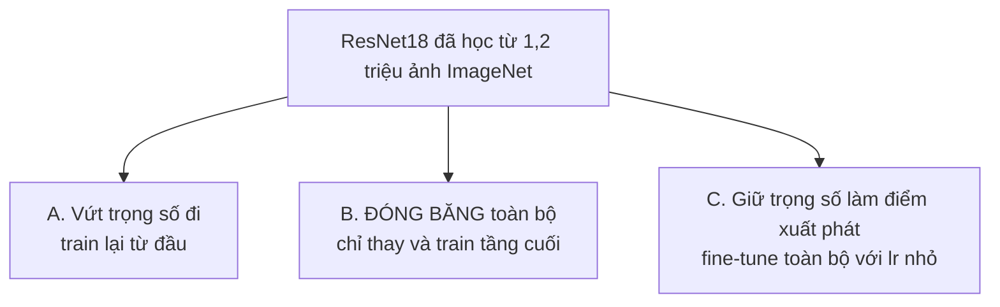

> **Mục tiêu bài học:** Sau bài này, bạn sẽ hiểu vì sao đặc trưng học từ bài toán này dùng lại được cho bài toán khác, phân biệt được hai cách dùng lại - đóng băng và fine-tune - và biết chọn cái nào theo lượng dữ liệu bạn có.

## 1. Bài toán mà mười bài trước chưa giải được

Mọi thí nghiệm từ đầu chương đến giờ đều có 60.000 ảnh train. Đó là điều kiện xa xỉ. Dự án thật thường bắt đầu bằng vài trăm tới vài nghìn ảnh: một dây chuyền phân loại sản phẩm lỗi, một ứng dụng nhận diện giống cây, một hệ thống đọc biểu mẫu nội bộ.

Bài 06 và 07 đã cho thấy chuyện gì xảy ra khi dữ liệu ít: mạng lớn thuộc lòng ngay, validation loss quay đầu từ epoch 6, và cả ba kỹ thuật chống overfitting cộng lại cũng chỉ vá víu chứ không chữa gốc. Gốc bệnh là **thiếu thông tin**, và không kỹ thuật nào tạo ra thông tin từ hư không.

Nhưng có một chỗ để mượn thông tin. Bài 03 đã nêu: nếu các tầng đầu của một mạng thị giác học những thứ chung chung - cạnh, góc, họa tiết, mảng màu - thì chúng **không phụ thuộc bài toán cụ thể**. Cái cạnh trong ảnh chó cũng là cái cạnh trong ảnh áo sơ mi.

Vậy thì thay vì bắt mạng của bạn học lại "thế nào là một cái cạnh" từ 2.000 tấm ảnh, hãy lấy một mạng đã học điều đó từ **1,2 triệu ảnh** rồi dùng lại. Đó là **transfer learning (học chuyển giao)**.

## 2. Ba cách dùng một mạng đã huấn luyện

Ta dùng **ResNet18** đã huấn luyện trên ImageNet - 1,2 triệu ảnh, 1.000 lớp - và đem sang phân loại FashionMNIST với **chỉ 2.000 ảnh train**.



Điểm chung của cả ba: tầng cuối của ResNet18 xuất ra 1.000 lớp ImageNet, mà ta cần 10 lớp, nên tầng ấy luôn phải thay:

```python
weights = models.ResNet18_Weights.IMAGENET1K_V1
model = models.resnet18(weights=weights)
model.fc = nn.Linear(512, 10)      # thay tầng cuối
```

**Cách B - đóng băng.** Khóa mọi trọng số cũ, chỉ cho tầng cuối được học:

```python
for p in model.parameters():
    p.requires_grad = False        # đóng băng
model.fc = nn.Linear(512, 10)      # tầng mới, mặc định requires_grad=True
opt = torch.optim.Adam([p for p in model.parameters() if p.requires_grad], lr=1e-3)
```

Cách này biến ResNet18 thành một **bộ rút đặc trưng cố định**: nó biến mỗi ảnh thành 512 con số, và bạn chỉ train một hồi quy softmax trên 512 con số ấy. Nghe quen - đó đúng là cách đọc mạng nơ-ron mà bài 03 đã dựng.

**Cách C - fine-tune.** Không khóa gì cả, nhưng dùng learning rate **nhỏ hơn nhiều** (1e-4 thay vì 1e-3), vì ta không muốn phá hỏng thứ mạng đã học được - chỉ muốn chỉnh nhẹ cho hợp bài toán mới.

## 3. Ba cách, đo trên 2.000 ảnh

2.000 ảnh train, 1.000 ảnh validation, 3 epoch, chạy trên CPU:

| Cách | Tham số được train | Accuracy validation | Thời gian |
|---|---|---|---|
| **A.** Train từ đầu, trọng số ngẫu nhiên | 11.181.642 | 0,7840 | 661 giây |
| **B.** Đóng băng, chỉ train tầng cuối | **5.130** | 0,7870 | **266 giây** |
| **C.** Fine-tune toàn bộ (lr = 1e-4) | 11.181.642 | **0,8990** | 527 giây |

Đọc bảng theo hai nhịp.

**Nhịp một - dòng B là dòng gây choáng.** Nó train **5.130 tham số**, tức 0,05% số tham số của mạng, trong 266 giây, và vẫn nhỉnh hơn cách A vốn train đủ 11,2 triệu tham số trong 661 giây. Toàn bộ phần "biết nhìn" được lấy sẵn; bạn chỉ dạy nó gọi tên mười loại quần áo.

**Nhịp hai - fine-tune thắng đậm.** 0,8990 so với 0,7840, hơn **11,5 điểm**. Cho phép các tầng đầu chỉnh lại một chút để hợp với ảnh xám 28×28 phóng to - vốn rất khác ảnh màu chụp đời thường của ImageNet - là đáng giá.

Đáng chú ý là điều kiện của thí nghiệm này khá bất lợi cho transfer learning: FashionMNIST là ảnh **xám**, độ phân giải **28×28** phóng lên 224, trong khi ImageNet là ảnh màu chụp thật. Nếu đặc trưng còn chuyển giao được trong hoàn cảnh chênh lệch đến thế, thì với một bài toán ảnh màu tự nhiên - sản phẩm lỗi trên dây chuyền, giống cây, ảnh y tế - mức lợi thường còn rõ hơn.

## 4. Khi nào đóng băng, khi nào fine-tune

Quy tắc thực dụng dựa trên hai câu hỏi: bạn có **bao nhiêu dữ liệu**, và dữ liệu của bạn **giống ImageNet đến đâu**.

| Tình huống | Nên làm |
|---|---|
| Rất ít dữ liệu (vài trăm ảnh), giống ImageNet | Đóng băng, chỉ train tầng cuối |
| Ít dữ liệu, khác ImageNet | Đóng băng các tầng đầu, fine-tune vài tầng cuối |
| Kha khá dữ liệu (vài nghìn trở lên) | Fine-tune toàn bộ với learning rate nhỏ |
| Rất nhiều dữ liệu và rất khác ImageNet | Fine-tune toàn bộ, hoặc cân nhắc train từ đầu |

Lý do của dòng đầu: càng ít dữ liệu thì càng dễ overfit, mà đóng băng là cách hạn chế capacity rất mạnh - bạn chỉ còn 5.130 tham số để mà overfit thay vì 11 triệu. Đây là chính đánh đổi bias-variance của Foundations · Bài 14, xuất hiện dưới một hình dạng mới.

Lý do của dòng ba: nhiều dữ liệu hơn thì đủ tín hiệu để chỉnh cả mạng mà không học tủ, và ta thu được phần lợi 11,5 điểm ở bảng trên.

> ⚠️ **Lưu ý nhỏ:** khi fine-tune, phải dùng **đúng phép tiền xử lý mà mô hình gốc đã dùng lúc huấn luyện**. ResNet18 của torchvision chờ ảnh 3 kênh màu, kích thước 224×224, đã chuẩn hóa theo trung bình và độ lệch chuẩn của ImageNet. Không cần chép tay bộ số ấy - mỗi bộ trọng số của torchvision mang sẵn phép tiền xử lý của chính nó:
>
> ```python
> weights = models.ResNet18_Weights.IMAGENET1K_V1
> prep = transforms.Compose([
>     transforms.Grayscale(num_output_channels=3),   # 1 kênh → 3 kênh
>     weights.transforms(),                          # resize, cắt giữa, chuẩn hóa
> ])
> ```
>
> Dòng `Grayscale(3)` là chỗ hay bị quên. FashionMNIST là ảnh xám một kênh, còn tầng tích chập đầu của ResNet18 có đúng ba kênh đầu vào vì nó sinh ra cho ảnh màu; đưa một kênh vào là lỗi ngay tại tầng đầu. Cách chữa rẻ nhất là chép kênh xám ấy ra ba lần - ba kênh giống hệt nhau. Nghe phí, và đúng là phí thật, nhưng nó giữ nguyên được cấu trúc mà mạng đã học, còn cách kia là sửa tầng đầu và mất luôn trọng số đã học ở đó.
>
> Còn `weights.transforms()` thì đọc bộ số chuẩn hóa ra từ chính bộ trọng số, nên không có chuyện chép nhầm hay dùng sót khi đổi sang mô hình khác. Đưa ảnh vào với thang giá trị khác thì mọi đặc trưng đã học đều lệch, và bạn mất phần lớn lợi ích mà không nhận được cảnh báo nào. Đây đúng là nguyên tắc "fit trên train, transform cho phần còn lại" của chương Machine Learning · Bài 11, mở rộng ra: thống kê chuẩn hóa thuộc về *mô hình*, phải đi kèm mô hình.

> 🔧 **Thử ngay:** cách B train đúng 5.130 tham số. Con số ấy từ đâu ra?
> Tầng cuối là `nn.Linear(512, 10)`: mỗi lớp trong 10 lớp có 512 trọng số cộng 1 hệ số chặn, tức $513 \times 10 = 5.130$. Toàn bộ phần còn lại của ResNet18 - 11,18 triệu tham số - bị đóng băng. Nói cách khác, cách B chính là lấy ResNet18 làm máy rút đặc trưng rồi chạy đúng một hồi quy softmax của chương Machine Learning · Bài 03 lên 512 đặc trưng ấy.

## 5. Vì sao chuyện này quan trọng hơn vẻ ngoài của nó

Transfer learning không phải một mẹo tiết kiệm. Nó là cách phần lớn deep learning được làm trong thực tế ngày nay.

Rất ít nhóm huấn luyện một mạng thị giác từ đầu, vì cần hàng triệu ảnh có nhãn cùng hàng nghìn giờ GPU. Cái người ta làm là lấy một mô hình đã huấn luyện sẵn rồi thích nghi nó - và bảng ở mục 3 giải thích vì sao: cách C cho kết quả tốt hơn 11,5 điểm so với train từ đầu, trong khi tốn ít thời gian hơn.

Ý tưởng ấy còn đi xa hơn ảnh. Khi bạn nghe "fine-tune một mô hình ngôn ngữ" trong chương Generative AI, đó là chính cơ chế của bài này: một mô hình đã học từ khối lượng dữ liệu khổng lồ, rồi được chỉnh nhẹ cho một việc cụ thể với ít dữ liệu. Chỉ khác quy mô - và khác ở chỗ với mô hình ngôn ngữ, thứ được "học sẵn" không phải cạnh và góc, mà là cấu trúc của ngôn ngữ.

## Tóm tắt bài học

- Dự án thật thường chỉ có vài trăm tới vài nghìn mẫu; regularization của bài 07 vá víu được nhưng không chữa gốc, vì gốc bệnh là thiếu thông tin.
- Các tầng đầu của mạng thị giác học những thứ chung chung (cạnh, góc, họa tiết) nên dùng lại được cho bài toán khác - đó là cơ sở của transfer learning.
- **Đóng băng** biến mạng đã train thành bộ rút đặc trưng cố định, chỉ train tầng cuối; **fine-tune** giữ trọng số cũ làm điểm xuất phát rồi chỉnh nhẹ toàn bộ với learning rate nhỏ.
- Trên 2.000 ảnh: train từ đầu cho 0,7840; đóng băng cho 0,7870 khi chỉ train **5.130 tham số** (0,05% mạng) trong 40% thời gian; fine-tune cho **0,8990**.
- Chọn cách theo lượng dữ liệu: rất ít thì đóng băng (hạn chế capacity, chống overfit), kha khá thì fine-tune toàn bộ.
- Phải dùng đúng phép tiền xử lý của mô hình gốc - thống kê chuẩn hóa thuộc về mô hình và phải đi kèm nó.
- Đây là cách phần lớn deep learning được làm trong thực tế, và cùng cơ chế ấy quay lại với mô hình ngôn ngữ ở chương Generative AI.

## Câu hỏi tự kiểm tra

1. Vì sao đặc trưng học từ ảnh ImageNet lại dùng được cho ảnh quần áo xám 28×28? Tầng nào của mạng chuyển giao tốt nhất, và vì sao?
2. Cách B train 5.130 tham số. Tính ra con số đó, và nói xem nó tương đương với mô hình nào của chương Machine Learning.
3. Vì sao fine-tune phải dùng learning rate nhỏ hơn train từ đầu?
4. Bạn có 300 ảnh sản phẩm lỗi trên dây chuyền. Chọn cách nào trong ba cách, và vì sao?
5. Bạn quên áp phép chuẩn hóa của ImageNet khi fine-tune. Triệu chứng sẽ là gì, và vì sao nó khó phát hiện?
6. Cách B nhỉnh hơn cách A một chút (0,7870 so với 0,7840) nhưng train ít hơn 2.000 lần số tham số. Nếu bạn phải bảo vệ lựa chọn cách B trước một đồng nghiệp chuộng cách A, bạn nêu những lý do gì ngoài accuracy?

## Đọc thêm

**Nguồn nền tảng của bài:**

| Nguồn | Đọc phần nào |
|---|---|
| **Dive into Deep Learning (d2l.ai)** | Chương 14.2 *Fine-Tuning* - đúng ba cách ở mục 2, kèm hình minh họa và lời khuyên về learning rate cho tầng mới so với tầng cũ |
| **Bài 03 của chương này** | Mục 4 - vì sao tầng đầu học thứ chung chung, cơ sở lý thuyết của cả bài này |
| **Foundations · Bài 14** | Bias-variance - nền của quy tắc chọn cách ở mục 4 |

**Nguồn online bổ sung (miễn phí):**

- [Transfer Learning for Computer Vision Tutorial - PyTorch](https://pytorch.org/tutorials/beginner/transfer_learning_tutorial.html) - hướng dẫn chính thức, chạy đúng hai cách B và C.
- [`torchvision.models` - danh sách mô hình có sẵn](https://pytorch.org/vision/stable/models.html) - kèm accuracy trên ImageNet và phép tiền xử lý bắt buộc của từng mô hình.
- [Yosinski và cộng sự - How transferable are features in deep neural networks? (NeurIPS 2014)](https://arxiv.org/abs/1411.1792) - đo cụ thể tầng nào chuyển giao tốt tới đâu, nguồn cho câu hỏi 1.
- [Kornblith, Shlens, Le - Do Better ImageNet Models Transfer Better? (CVPR 2019)](https://arxiv.org/abs/1805.08974) - khảo sát trên nhiều mô hình và nhiều bài toán đích.

> **Bài tiếp theo:** [Project end-to-end: từ dữ liệu thô tới mô hình bàn giao được](../end-to-end-project-raw-data-to-a-model-you-can-hand-over-vi/) - mười một bài đã dựng đủ mảnh. Bài cuối ghép tất cả thành một quy trình chạy từ dữ liệu thô tới mô hình bàn giao được - và soi xem mô hình cuối cùng còn nhầm ở đâu.
