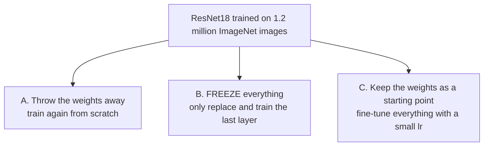

> **Learning objectives:** After this lesson, you will understand why features learned on one task can be reused on another, be able to tell apart the two ways of reusing them - freezing and fine-tuning - and know how to choose between them based on how much data you have.

## 1. The problem the previous ten lessons have not solved

Every experiment since the start of this chapter has had 60,000 training images. That is a luxury. Real projects usually start with a few hundred to a few thousand images: a production line sorting defective products, an app that identifies plant species, a system that reads internal forms.

Lessons 06 and 07 showed what happens when data is scarce: a large network memorizes right away, validation loss turns around at epoch 6, and even all three anti-overfitting techniques together only patch things up without curing the root. The root of the problem is **a lack of information**, and no technique creates information out of thin air.

But there is somewhere to borrow information from. Lesson 03 pointed out: if the early layers of a vision network learn generic things - edges, corners, textures, patches of color - then they **do not depend on the specific task**. An edge in a photo of a dog is also an edge in a photo of a shirt.

So instead of making your network relearn "what an edge is" from 2,000 images, take a network that has already learned it from **1.2 million images** and reuse it. That is **transfer learning**.

## 2. Three ways to use a trained network

We use **ResNet18** trained on ImageNet - 1.2 million images, 1,000 classes - and carry it over to classifying FashionMNIST with **only 2,000 training images**.



What all three have in common: the last layer of ResNet18 outputs 1,000 ImageNet classes, but we need 10 classes, so that layer always has to be replaced:

```python
weights = models.ResNet18_Weights.IMAGENET1K_V1
model = models.resnet18(weights=weights)
model.fc = nn.Linear(512, 10)      # replace the last layer
```

**Approach B - freezing.** Lock all the old weights and let only the last layer learn:

```python
for p in model.parameters():
    p.requires_grad = False        # freeze
model.fc = nn.Linear(512, 10)      # new layer, requires_grad=True by default
opt = torch.optim.Adam([p for p in model.parameters() if p.requires_grad], lr=1e-3)
```

This approach turns ResNet18 into a **fixed feature extractor**: it turns each image into 512 numbers, and you only train a softmax regression on those 512 numbers. Sounds familiar - that is exactly the way of reading a neural network that Lesson 03 set up.

**Approach C - fine-tuning.** Lock nothing, but use a **much smaller** learning rate (1e-4 instead of 1e-3), because we do not want to wreck what the network has already learned - only to adjust it gently to fit the new task.

## 3. Three approaches, measured on 2,000 images

2,000 training images, 1,000 validation images, 3 epochs, running on CPU:

| Approach | Trained parameters | Validation accuracy | Time |
|---|---|---|---|
| **A.** Train from scratch, random weights | 11,181,642 | 0.7840 | 661 seconds |
| **B.** Freeze, train only the last layer | **5,130** | 0.7870 | **266 seconds** |
| **C.** Fine-tune everything (lr = 1e-4) | 11,181,642 | **0.8990** | 527 seconds |

Read the table in two beats.

**Beat one - row B is the stunning row.** It trains **5,130 parameters**, that is, 0.05% of the network's parameters, in 266 seconds, and still edges out approach A, which trains all 11.2 million parameters in 661 seconds. The whole "knowing how to see" part comes ready-made; you only teach it to name ten kinds of clothing.

**Beat two - fine-tuning wins big.** 0.8990 versus 0.7840, **11.5 points** higher. Letting the early layers adjust a little to fit upscaled 28×28 grayscale images - very different from ImageNet's everyday color photos - is well worth it.

It is worth noting that the conditions of this experiment are rather unfavorable to transfer learning: FashionMNIST images are **grayscale**, with a resolution of **28×28** upscaled to 224, while ImageNet consists of real color photos. If features still transfer under such a mismatch, then for a natural color image problem - defective products on a production line, plant species, medical images - the benefit is usually even clearer.

## 4. When to freeze, when to fine-tune

A practical rule based on two questions: **how much data** do you have, and **how similar** is your data to ImageNet?

| Situation | What to do |
|---|---|
| Very little data (a few hundred images), similar to ImageNet | Freeze, train only the last layer |
| Little data, different from ImageNet | Freeze the early layers, fine-tune the last few layers |
| A fair amount of data (a few thousand or more) | Fine-tune everything with a small learning rate |
| A lot of data and very different from ImageNet | Fine-tune everything, or consider training from scratch |

The reason for the first row: the less data you have, the easier it is to overfit, and freezing is a very strong way to restrict capacity - you only have 5,130 parameters left to overfit with instead of 11 million. This is the very bias-variance trade-off from Foundations · Lesson 14, appearing in a new form.

The reason for the third row: with more data there is enough signal to adjust the whole network without memorizing, and we collect the 11.5-point gain from the table above.

> ⚠️ **A small note:** when fine-tuning, you must use **exactly the preprocessing the original model used during training**. torchvision's ResNet18 expects 3-channel color images, sized 224×224, normalized by ImageNet's mean and standard deviation. There is no need to copy those numbers by hand - every set of torchvision weights carries its own preprocessing:
>
> ```python
> weights = models.ResNet18_Weights.IMAGENET1K_V1
> prep = transforms.Compose([
>     transforms.Grayscale(num_output_channels=3),   # 1 channel → 3 channels
>     weights.transforms(),                          # resize, center crop, normalize
> ])
> ```
>
> The `Grayscale(3)` line is the one people often forget. FashionMNIST images are single-channel grayscale, while the first convolutional layer of ResNet18 has exactly three input channels because it was built for color images; feeding in one channel throws an error right at the first layer. The cheapest fix is to copy that gray channel three times - three identical channels. It sounds wasteful, and it really is wasteful, but it preserves the structure the network has learned, whereas the alternative is to modify the first layer and lose the weights learned there.
>
> As for `weights.transforms()`, it reads the normalization numbers straight from the weights themselves, so there is no risk of copying them wrong or forgetting them when you switch to another model. Feed in images on a different value scale and every learned feature is off, and you lose most of the benefit without receiving any warning. This is exactly the "fit on train, transform the rest" principle from Machine Learning · Lesson 11, extended: normalization statistics belong to the *model* and must travel with the model.

> 🔧 **Try it now:** approach B trains exactly 5,130 parameters. Where does that number come from?
> The last layer is `nn.Linear(512, 10)`: each of the 10 classes has 512 weights plus 1 intercept, giving $513 \times 10 = 5,130$. All the rest of ResNet18 - 11.18 million parameters - is frozen. In other words, approach B is simply using ResNet18 as a feature extractor and then running exactly the softmax regression from Machine Learning · Lesson 03 on those 512 features.

## 5. Why this matters more than it looks

Transfer learning is not a cost-saving trick. It is how most deep learning is done in practice today.

Very few teams train a vision network from scratch, because it takes millions of labeled images and thousands of GPU hours. What people do is take a pretrained model and adapt it - and the table in section 3 explains why: approach C gives a result 11.5 points better than training from scratch, while taking less time.

The idea goes beyond images, too. When you hear "fine-tune a language model" in the Generative AI chapter, it is exactly the mechanism of this lesson: a model that has learned from an enormous amount of data, then adjusted gently for a specific job with little data. Only the scale differs - and, for language models, what is "pre-learned" is not edges and corners but the structure of language.

## Lesson summary

- Real projects often have only a few hundred to a few thousand samples; the regularization from Lesson 07 can patch things up but does not cure the root, because the root of the problem is a lack of information.
- The early layers of a vision network learn generic things (edges, corners, textures), so they can be reused for other tasks - that is the basis of transfer learning.
- **Freezing** turns a trained network into a fixed feature extractor and trains only the last layer; **fine-tuning** keeps the old weights as a starting point and then gently adjusts everything with a small learning rate.
- On 2,000 images: training from scratch gives 0.7840; freezing gives 0.7870 while training only **5,130 parameters** (0.05% of the network) in 40% of the time; fine-tuning gives **0.8990**.
- Choose based on how much data you have: very little, freeze (restricting capacity, fighting overfitting); a fair amount, fine-tune everything.
- You must use the original model's exact preprocessing - normalization statistics belong to the model and must travel with it.
- This is how most deep learning is done in practice, and the same mechanism comes back with language models in the Generative AI chapter.

## Self-check questions

1. Why can features learned from ImageNet photos be used for 28×28 grayscale clothing images? Which layers of the network transfer best, and why?
2. Approach B trains 5,130 parameters. Work out that number, and say which model from the Machine Learning chapter it is equivalent to.
3. Why does fine-tuning need a smaller learning rate than training from scratch?
4. You have 300 images of defective products on a production line. Which of the three approaches do you choose, and why?
5. You forget to apply ImageNet normalization when fine-tuning. What will the symptoms be, and why is it hard to detect?
6. Approach B slightly beats approach A (0.7870 versus 0.7840) but trains 2,000 times fewer parameters. If you had to defend choosing approach B to a colleague who prefers approach A, what reasons besides accuracy would you give?

## Further reading

**Foundational sources for this lesson:**

| Source | What to read |
|---|---|
| **Dive into Deep Learning (d2l.ai)** | Chapter 14.2 *Fine-Tuning* - exactly the three approaches in section 2, with illustrations and advice on learning rates for new layers versus old layers |
| **Lesson 03 of this chapter** | Section 4 - why early layers learn generic things, the theoretical basis of this whole lesson |
| **Foundations · Lesson 14** | Bias-variance - the basis of the rule for choosing an approach in section 4 |

**Additional online sources (free):**

- [Transfer Learning for Computer Vision Tutorial - PyTorch](https://pytorch.org/tutorials/beginner/transfer_learning_tutorial.html) - the official tutorial, running exactly approaches B and C.
- [`torchvision.models` - list of available models](https://pytorch.org/vision/stable/models.html) - with ImageNet accuracy and the required preprocessing for each model.
- [Yosinski et al. - How transferable are features in deep neural networks? (NeurIPS 2014)](https://arxiv.org/abs/1411.1792) - measures concretely how well each layer transfers, the source for question 1.
- [Kornblith, Shlens, Le - Do Better ImageNet Models Transfer Better? (CVPR 2019)](https://arxiv.org/abs/1805.08974) - a survey across many models and many target tasks.

> **Next lesson:** [End-to-End Project: From Raw Data to a Model You Can Hand Over](../end-to-end-project-raw-data-to-a-model-you-can-hand-over/) - eleven lessons have built all the pieces. The final lesson assembles them into one workflow running from raw data to a model you can hand over - and examines where the final model still gets things wrong.
