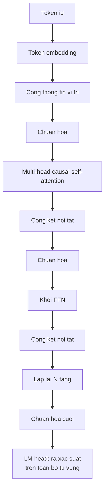

> **Mục tiêu bài học:** Sau bài này, bạn sẽ ráp được một Transformer đầy đủ từ những viên gạch rời, biết mỗi viên gạch giải quyết vấn đề gì, và có bảng đo **tháo từng viên ra thì hỏng đến mức nào** - trong đó có một kết quả đi ngược hẳn trực giác thông thường.

## 1. Attention không phải toàn bộ Transformer

Bài 03 dựng cơ chế attention và đó là mảnh nổi tiếng nhất. Nhưng một Transformer thật còn vài mảnh nữa, và bài này ráp đủ chúng.

Đi qua từng mảnh một.

**Token embedding.** Bảng tra biến mỗi token id thành một vector. Bài 10 sẽ mở nó ra kỹ hơn. Kích thước bảng là *từ vựng × số chiều*, nên bài 02 đã nói đúng: từ vựng lớn thì riêng bảng này đã nặng.

**Thông tin vị trí.** Bản thân phép attention **không có cách nào phân biệt vị trí**: nó chỉ so nội dung của token này với nội dung của token kia. Nói cho chính xác thì nó **hoán vị theo** (*permutation-equivariant*) - đảo thứ tự các token đầu vào thì các đầu ra tương ứng cũng đảo theo đúng thứ tự ấy, chứ không phải "đảo xong kết quả y hệt". Hệ quả vẫn là thảm họa cho ngôn ngữ: chưa có gì làm cho *"chó cắn người"* khác *"người cắn chó"*, vì mỗi token vẫn nhìn thấy đúng tập token cũ với đúng những điểm số cũ. Nên phải bơm thông tin vị trí vào. Có ba cách hay gặp:

- **Vị trí học được** - một bảng nữa, tra vị trí thành vector rồi cộng vào. Cách bài này dùng, đơn giản nhất.
- **Sin-cos cố định** - dùng hàm lượng giác nhiều tần số, không cần học, và ngoại suy được ra ngoài độ dài đã thấy.
- **RoPE (rotary position embedding)** - thay vì *cộng* vị trí vào vector, nó **xoay** vector truy vấn và khóa theo góc phụ thuộc vị trí. Nhờ đó **phần đóng góp của vị trí vào điểm số attention chỉ phụ thuộc khoảng cách tương đối** giữa hai vị trí - còn bản thân điểm số thì vẫn phụ thuộc rất mạnh vào nội dung của truy vấn và khóa. Đây là cách Qwen2.5 và phần lớn mô hình hiện đại dùng.

**Chuẩn hóa.** Chương Deep Learning · Bài 08 đã dựng BatchNorm cho ảnh. Với chuỗi thì người ta dùng **LayerNorm** - chuẩn hóa trên chiều đặc trưng của *từng token riêng*, **không dùng thống kê chung của cả lô**. Điều đó giúp việc tối ưu ổn định và làm đầu ra của một mẫu không phụ thuộc các mẫu tình cờ đi cùng lô, đúng vấn đề mà chương Deep Learning · Bài 08 đã nêu với BatchNorm ở chế độ `eval()`. (Chuyện các chuỗi trong lô dài ngắn khác nhau thì được xử lý bằng phần đệm và mặt nạ attention, không liên quan tới chọn kiểu chuẩn hóa.) Nhiều mô hình mới dùng **RMSNorm**, bản rút gọn bỏ phép trừ trung bình, rẻ hơn mà gần như không kém.

**Kết nối tắt.** Đúng thứ chương Computer Vision · Bài 03 đã đo trên ảnh: $y = F(x) + x$. Ở đây nó còn quan trọng hơn, vì mô hình ngôn ngữ thường sâu hàng chục tầng - Qwen2.5-0.5B có 24 tầng.

**Khối FFN.** Sau attention, mỗi vị trí đi qua một mạng hai tầng **độc lập với các vị trí khác**:

$$\text{FFN}(x) = W_2\,\sigma(W_1 x)$$

thường với chiều giữa gấp bốn. Phân vai: **attention lo phần trộn thông tin giữa các vị trí, FFN lo phần biến đổi phi tuyến tại từng vị trí.** Nói cho chặt thì attention cũng có các phép chiếu truy vấn, khóa, giá trị và đầu ra, nên nó cũng biến đổi biểu diễn; cái riêng của FFN là **biến đổi phi tuyến độc lập theo từng vị trí**, và đó là nơi chứa phần lớn tham số của mỗi tầng. Các mô hình mới hay dùng **SwiGLU** thay cho ReLU/GELU ở đây.

**LM head.** Tầng tuyến tính cuối chiếu vector về kích thước từ vựng, cho ra điểm số cho từng token - rồi softmax thành phân bố xác suất mà bài 01 đã nhìn thấy.

## 2. Tháo từng viên gạch ra

Ghép đủ thì được một mô hình chạy. Nhưng mỗi viên gạch đáng bao nhiêu?

Cách trả lời là **ablation**, đúng như chương Deep Learning · Bài 12 mô tả: giữ mọi thứ cố định, bỏ đúng một thứ, đo lại. Sáu cấu hình, mỗi cấu hình huấn luyện **1.200 bước** trên cùng corpus 51 bài của bài 01, cùng seed, cùng learning rate. Một lần chạy minh họa.

| Cấu hình | bit/ký tự | Chênh với bản đủ | Tham số | Thời gian |
|---|---|---|---|---|
| **Đầy đủ** (6 đầu, 4 tầng) | **2,371** | - | 1.924.536 | 540 s |
| 1 đầu thay vì 6 | 2,377 | **+0,006** | 1.924.536 | 531 s |
| Bỏ thông tin vị trí | 2,434 | +0,063 | 1.899.960 | 519 s |
| 2 tầng thay vì 4 | 2,483 | +0,112 | 1.034.808 | 158 s |
| Bỏ khối FFN | 2,658 | +0,287 | 741.048 | 173 s |
| **Bỏ kết nối tắt** | **5,511** | **+3,140** | 1.924.536 | 373 s |

Bảng này có ba chuyện, và hai trong ba đi ngược điều người ta hay kể.

## 3. Kết nối tắt là viên gạch gần như bắt buộc của Transformer sâu

Bỏ kết nối tắt làm mô hình đi từ **2,371 lên 5,511 bit/ký tự** - tệ hơn hơn ba bit, trong khi số tham số **không đổi một chút nào**. Để so: mức đoán đều trên 312 ký tự là 8,29 bit, nên mô hình không kết nối tắt chỉ tốt hơn đoán mò một chút.

Đây là kết quả mạnh nhất bảng, và nó khớp chính xác với chương Computer Vision · Bài 03, nơi mạng phẳng 44 tầng tụt xuống 0,2003 accuracy trong khi ResNet cùng độ sâu đạt 0,3740. Cùng một cơ chế, hai loại dữ liệu khác nhau: **đường cộng cho gradient một lối đi thẳng, và thiếu nó thì mạng sâu không huấn luyện nổi.**

Điều đáng chú ý: mô hình ở đây chỉ **4 tầng**. Vậy mà đã hỏng nặng. Với mạng sâu hàng chục tầng như 24 tầng của Qwen2.5, bỏ kết nối tắt trong một khối Transformer thông thường sẽ khó tới mức không còn là một thiết kế thực tế. Bảng này không chứng minh điều đó - nó chỉ cho thấy ngay ở 4 tầng chất lượng đã sụp, và độ sâu chỉ làm vấn đề nặng thêm.

## 4. Hai kết quả đi ngược trực giác

**Một đầu gần như bằng sáu đầu.** Chênh lệch chỉ 0,006 bit trong lần chạy này. Nói "nhỏ hơn nhiễu" thì chưa được phép: muốn biết 0,006 có lớn hơn biến thiên giữa các seed hay không thì phải chạy lại nhiều seed, mà bảng này chỉ có một. Điều nói được là nó **rất nhỏ so với 3,14 bit** mà kết nối tắt tạo ra ở cùng bảng. Trong khi bài 03 vừa cho thấy các đầu trong Qwen thật sự hành xử rất khác nhau.

Không mâu thuẫn, nhưng phải đọc cho đúng phạm vi. Mô hình ở đây có **192 chiều**; chia cho 6 đầu thì mỗi đầu chỉ 32 chiều. Ở quy mô nhỏ như vậy, việc chia nhỏ có thể mất nhiều hơn được. Bài toán cũng dễ - dự đoán ký tự tiếp theo trong một corpus rất đồng nhất về văn phong - nên có lẽ chưa cần nhiều kiểu quan hệ song song. Kết luận đúng là: **ở quy mô này, trên bài toán này, nhiều đầu chưa mua được gì** - không phải "nhiều đầu vô dụng".

**Bỏ thông tin vị trí chỉ mất 0,063 bit.** Cái này còn bất ngờ hơn, vì mục 1 vừa nói attention không tự phân biệt được vị trí.

Lời giải thích hợp lý nhất nằm ở một chi tiết mục 1 chưa nói hết: **mặt nạ nhân quả đã phá vỡ tính hoán-vị-theo ấy rồi.** Mặt nạ phụ thuộc vị trí chứ không phụ thuộc nội dung, nên attention nhân quả *không* còn hoán vị theo - nó đã mang sẵn một phần thông tin thứ tự - vị trí $i$ chỉ nhìn được $i$ token đầu, nên *số lượng* token nhìn thấy đã là một tín hiệu vị trí. Cộng thêm việc dự đoán ký tự kế tiếp phụ thuộc rất mạnh vào vài ký tự ngay trước, thứ mà attention cục bộ bắt được mà không cần tọa độ tuyệt đối.

Nhưng đó là **giả thuyết**, không phải thứ bảng này chứng minh. Muốn kiểm thì phải chạy cùng ablation ở mức token và với chuỗi dài hơn - việc chương này không làm.

> ⚠️ **Lưu ý nhỏ:** bảng mục 2 là **một lần chạy, một seed, 1.200 bước, mức ký tự, corpus 886 nghìn ký tự**. Nó đo *sáu cấu hình cụ thể trên bài toán cụ thể này*. Đừng mang con số "+0,006 cho multi-head" đi nói về mô hình thật - chúng khác ở mọi chiều: quy mô, loại token, độ dài ngữ cảnh, độ đa dạng dữ liệu. Cái mang đi được chỉ là chuyện này: **kết nối tắt quan trọng ở mức không thể nhầm** - 3,14 bit thì một seed cũng đủ kết luận. Còn các chênh lệch nhỏ hơn trong bảng thì **chưa đủ để xếp hạng**, kể cả xếp hạng thô.

## 5. Mô hình thật thay những viên gạch nào

Sau khi tự ráp một Transformer cổ điển, mở thông số một mô hình đời mới ra sẽ thấy cùng bộ khung nhưng vài viên gạch đã bị thay:

| Viên gạch | Bản cổ điển (2017) | Qwen2.5 và nhiều mô hình hiện đại |
|---|---|---|
| Thông tin vị trí | Sin-cos cộng vào đầu vào | **RoPE** - xoay truy vấn/khóa theo vị trí |
| Chuẩn hóa | LayerNorm, đặt **sau** khối | **RMSNorm**, đặt **trước** khối |
| Phi tuyến trong FFN | ReLU | **SwiGLU** |
| Attention | Mọi đầu có khóa/giá trị riêng | Nhiều đầu **dùng chung** khóa/giá trị |

Không viên nào trong số đó đổi **ý tưởng** - vẫn là trộn thông tin bằng attention rồi biến đổi bằng FFN, xếp nhiều tầng, có kết nối tắt. Chúng đổi **chi tiết kỹ thuật**, và mỗi thay đổi giải một vấn đề cụ thể: RoPE để xử lý ngữ cảnh dài tốt hơn, chuẩn hóa đặt trước để huấn luyện ổn định hơn, dùng chung khóa/giá trị để giảm bộ nhớ lúc suy luận.

Điều đó nghĩa là: **hiểu bộ khung ở mục 1 là đủ để đọc phần lớn mô hình trong họ Transformer mà bạn gặp.** Các biến thể là chuyện đọc thêm, không phải học lại.

> 🔧 **Thử ngay:** bạn đọc mô tả một mô hình mới và thấy dòng "we replace LayerNorm with RMSNorm". Bạn cần đọc lại cả kiến trúc không?
> Không. RMSNorm là LayerNorm bỏ bước trừ trung bình - **cùng vai trò chuẩn hóa**, chỉ rẻ hơn một chút. Nhưng đừng suy ra là cùng vị trí: bảng ngay trên cho thấy Transformer gốc đặt LayerNorm **sau** khối còn Qwen đặt RMSNorm **trước**, và đó là hai lựa chọn tách rời nhau, phải đọc riêng. Câu hỏi đáng hỏi khi gặp một mô hình lạ là bốn câu: **thông tin vị trí kiểu gì** (quyết định nó xử lý ngữ cảnh dài ra sao), **chuẩn hóa đặt trước hay sau khối** (ảnh hưởng độ ổn định lúc huấn luyện), **FFN dùng phi tuyến gì và chiều giữa gấp mấy** (quyết định phần lớn số tham số), và **attention có chia sẻ khóa/giá trị không** (quyết định bộ nhớ lúc suy luận). Trả lời được bốn câu ấy là đọc được kiến trúc, dù bạn chưa từng nghe tên nó.

## Tóm tắt bài học

- Một Transformer gồm: token embedding → thông tin vị trí → **chuẩn hóa → attention → kết nối tắt → chuẩn hóa → FFN → kết nối tắt** lặp N tầng → chuẩn hóa cuối → LM head.
- Attention thuần **không phân biệt được vị trí bằng nội dung** - hoán vị đầu vào thì đầu ra hoán vị theo - nên phải bơm thông tin vị trí vào; RoPE làm điều đó bằng cách **xoay** truy vấn và khóa, nên phần đóng góp của vị trí vào điểm số chỉ phụ thuộc khoảng cách tương đối.
- Phân vai: **attention nổi bật ở việc trộn thông tin giữa các vị trí; FFN là phép biến đổi phi tuyến độc lập theo từng vị trí** và chứa phần lớn tham số mỗi tầng. Attention cũng có các phép chiếu riêng nên nó không chỉ trộn.
- Ablation 1.200 bước trên corpus 51 bài: **bỏ kết nối tắt là thảm họa** - 2,371 lên **5,511 bit/ký tự** mà số tham số không đổi, gần chạm mức đoán đều 8,29.
- Kết quả ấy khớp chính xác chương Computer Vision · Bài 03 trên ảnh: cùng cơ chế, hai loại dữ liệu.
- Hai kết quả đi ngược trực giác: **1 đầu gần bằng 6 đầu** (+0,006) và **bỏ thông tin vị trí chỉ mất 0,063 bit** - nhưng cả hai chỉ đúng *ở quy mô này, trên bài toán mức ký tự này*.
- Mô hình hiện đại giữ nguyên bộ khung, chỉ thay chi tiết: RoPE thay sin-cos, RMSNorm đặt trước thay LayerNorm đặt sau, SwiGLU thay ReLU, nhiều đầu dùng chung khóa/giá trị.
- Bốn câu hỏi giúp đọc được phần lớn kiến trúc lạ trong họ Transformer: vị trí kiểu gì, chuẩn hóa đặt đâu, FFN ra sao, attention có chia sẻ khóa/giá trị không.

## Câu hỏi tự kiểm tra

1. Vì sao attention bắt buộc phải có thông tin vị trí? Cho ví dụ hai câu cùng tập từ nhưng khác nghĩa.
2. RoPE khác cách cộng vector vị trí ở chỗ nào, và điều đó mang lại lợi ích gì với ngữ cảnh dài?
3. Vì sao mô hình chuỗi dùng LayerNorm chứ không dùng BatchNorm? Nêu lý do đúng, và vì sao "vì chuỗi dài ngắn khác nhau" **không** phải lý do chính.
4. Phân vai giữa attention và FFN là gì? Bỏ FFN thì mô hình mất khả năng nào?
5. Bỏ kết nối tắt làm bit/ký tự tăng 3,14 mà số tham số không đổi. Điều đó nói gì về nguồn gốc của lợi ích?
6. Ablation cho thấy 1 đầu gần bằng 6 đầu, nhưng bài 03 cho thấy các đầu trong mô hình thật rất khác nhau. Hai kết quả này có mâu thuẫn không? Giải thích.
7. Nêu giả thuyết vì sao bỏ thông tin vị trí lại ít hại ở mô hình mức ký tự, và thiết kế thí nghiệm kiểm chứng nó.
8. Bạn gặp một kiến trúc lạ. Nêu bốn câu hỏi cần trả lời để đọc được nó, và mỗi câu quyết định điều gì.

## Đọc thêm

**Nguồn nền tảng của bài:**

| Nguồn | Đọc phần nào |
|---|---|
| **Bài 03 của chương này** | Cơ chế attention, nhiều đầu, mặt nạ nhân quả |
| **Chương Computer Vision · Bài 03** | Kết nối tắt đo trên ảnh - cùng kết luận, khác loại dữ liệu |
| **Chương Deep Learning · Bài 08** | Vì sao mạng sâu khó huấn luyện; BatchNorm và chỗ khác LayerNorm |
| **Chương Deep Learning · Bài 12** | Ablation là gì và vì sao phải đổi một biến mỗi lần |

**Nguồn online bổ sung (miễn phí):**

- [Vaswani và cộng sự - Attention Is All You Need (2017)](https://arxiv.org/abs/1706.03762) - kiến trúc gốc, gồm sin-cos và LayerNorm đặt sau khối.
- [Su và cộng sự - RoFormer: Enhanced Transformer with Rotary Position Embedding (2021)](https://arxiv.org/abs/2104.09864) - RoPE, thứ Qwen2.5 dùng.
- [Zhang & Sennrich - Root Mean Square Layer Normalization (NeurIPS 2019)](https://arxiv.org/abs/1910.07467) - RMSNorm.
- [Shazeer - GLU Variants Improve Transformer (2020)](https://arxiv.org/abs/2002.05202) - SwiGLU và các biến thể cổng trong FFN.
- [Xiong và cộng sự - On Layer Normalization in the Transformer Architecture (ICML 2020)](https://arxiv.org/abs/2002.04745) - vì sao đặt chuẩn hóa **trước** khối lại ổn định hơn.

> **Bài tiếp theo:** [Sinh văn bản: các núm vặn](../text-generation-the-knobs-vi/) - bốn bài đầu dựng xong một mô hình biết trả về phân bố xác suất cho token kế tiếp. Nhưng từ phân bố tới văn bản còn một bước nữa - **chọn** token nào. Bài sau đo xem các cách chọn khác nhau đổi đầu ra tới mức nào, và vì sao có những chỗ chúng chẳng đổi gì.
