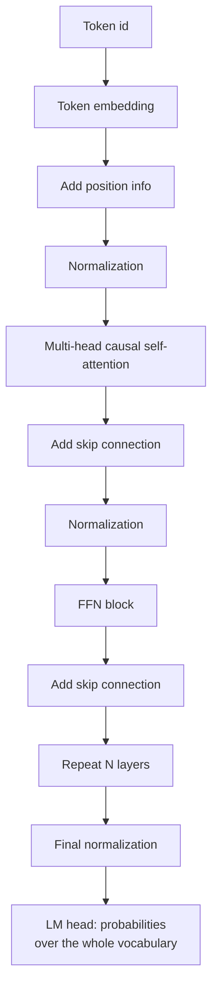

> **Learning objectives:** After this lesson, you will be able to assemble a full Transformer from separate building blocks, know which problem each block solves, and have a table measuring **how badly things break when each block is removed** - including one result that runs directly against common intuition.

## 1. Attention is not the whole Transformer

Lesson 03 built the attention mechanism, and it is the most famous piece. But a real Transformer has a few more pieces, and this lesson assembles all of them.

Let us go through the pieces one by one.

**Token embedding.** A lookup table that turns each token id into a vector. Lesson 10 will open it up in more detail. The table's size is *vocabulary × dimensions*, so Lesson 02 was right: with a large vocabulary, this table alone is already heavy.

**Position information.** The attention operation itself **has no way to tell positions apart**: it only compares the content of one token with the content of another. Stated precisely, it is **permutation-equivariant** - reorder the input tokens and the corresponding outputs are reordered in exactly the same way, rather than "reorder them and the result is identical". The consequence is still a disaster for language: nothing yet makes *"dog bites man"* different from *"man bites dog"*, because each token still sees exactly the same set of tokens with exactly the same scores. So position information has to be injected. There are three common ways:

- **Learned positions** - one more table, looking up each position as a vector and adding it in. This is what this lesson uses, the simplest option.
- **Fixed sin-cos** - uses trigonometric functions at many frequencies, needs no learning, and can extrapolate beyond the lengths seen.
- **RoPE (rotary position embedding)** - instead of *adding* position to the vector, it **rotates** the query and key vectors by an angle that depends on position. As a result, **the contribution of position to the attention score depends only on the relative distance** between the two positions - while the score itself still depends very strongly on the content of the query and key. This is what Qwen2.5 and most modern models use.

**Normalization.** Deep Learning · Lesson 08 built BatchNorm for images. For sequences, people use **LayerNorm** - normalizing over the feature dimension of *each token separately*, **without using statistics shared across the batch**. That keeps optimization stable and makes a sample's output independent of whatever samples happen to share its batch, exactly the problem Deep Learning · Lesson 08 raised with BatchNorm in `eval()` mode. (Sequences of different lengths within a batch are handled with padding and attention masks, which has nothing to do with the choice of normalization.) Many newer models use **RMSNorm**, a simplified version that drops the mean subtraction, cheaper and almost as good.

**Skip connections.** Exactly what Computer Vision · Lesson 03 measured on images: $y = F(x) + x$. Here they matter even more, because language models are often dozens of layers deep - Qwen2.5-0.5B has 24 layers.

**The FFN block.** After attention, each position passes through a two-layer network **independently of the other positions**:

$$\text{FFN}(x) = W_2\,\sigma(W_1 x)$$

usually with a middle dimension four times larger. Division of roles: **attention handles mixing information across positions, the FFN handles the nonlinear transformation at each position.** Strictly speaking, attention also has query, key, value and output projections, so it transforms representations too; what is specific to the FFN is **a nonlinear transformation applied independently at each position**, and it is where most of each layer's parameters live. Newer models often use **SwiGLU** here instead of ReLU/GELU.

**LM head.** The final linear layer projects the vector to the size of the vocabulary, producing a score for each token - then softmax turns them into the probability distribution that Lesson 01 looked at.

## 2. Pulling out each brick

Put everything together and you get a working model. But how much is each brick worth?

The way to answer is **ablation**, exactly as Deep Learning · Lesson 12 describes: keep everything fixed, remove exactly one thing, measure again. Six configurations, each trained for **1,200 steps** on the same 51-lesson corpus as Lesson 01, with the same seed and the same learning rate. A single illustrative run.

| Configuration | bits/character | Difference from full | Parameters | Time |
|---|---|---|---|---|
| **Full** (6 heads, 4 layers) | **2.371** | - | 1,924,536 | 540 s |
| 1 head instead of 6 | 2.377 | **+0.006** | 1,924,536 | 531 s |
| No position information | 2.434 | +0.063 | 1,899,960 | 519 s |
| 2 layers instead of 4 | 2.483 | +0.112 | 1,034,808 | 158 s |
| No FFN block | 2.658 | +0.287 | 741,048 | 173 s |
| **No skip connections** | **5.511** | **+3.140** | 1,924,536 | 373 s |

This table tells three stories, and two of the three run against what people usually say.

## 3. Skip connections are a nearly mandatory brick of a deep Transformer

Removing skip connections takes the model from **2.371 to 5.511 bits/character** - more than three bits worse, while the number of parameters **does not change at all**. For comparison: a uniform guess over 312 characters is 8.29 bits, so the model without skip connections is only a little better than a blind guess.

This is the strongest result in the table, and it matches Computer Vision · Lesson 03 exactly, where a plain 44-layer network dropped to 0.2003 accuracy while a ResNet of the same depth reached 0.3740. The same mechanism, two different kinds of data: **the addition path gives the gradient a straight route, and without it a deep network cannot be trained.**

What is notable: the model here has only **4 layers**. And it already breaks badly. For networks dozens of layers deep, like Qwen2.5's 24 layers, removing skip connections from an ordinary Transformer block would be so hard that it is no longer a practical design. This table does not prove that - it only shows that quality already collapses at 4 layers, and depth only makes the problem worse.

## 4. Two counter-intuitive results

**One head is almost as good as six.** The difference is only 0.006 bits in this run. Calling it "smaller than noise" is not yet justified: to know whether 0.006 is larger than the variation between seeds, we would have to rerun with many seeds, and this table has only one. What we can say is that it is **very small compared with the 3.14 bits** that skip connections account for in the same table. And yet Lesson 03 just showed that the heads in Qwen really do behave very differently.

There is no contradiction, but the scope must be read correctly. The model here has **192 dimensions**; split across 6 heads, each head has only 32 dimensions. At such a small scale, splitting can lose more than it gains. The task is also easy - predicting the next character in a corpus with a very uniform writing style - so perhaps many kinds of relationships in parallel are not yet needed. The correct conclusion is: **at this scale, on this task, multiple heads have not bought anything yet** - not "multiple heads are useless".

**Removing position information costs only 0.063 bits.** This is even more surprising, since section 1 just said attention cannot tell positions apart on its own.

The most plausible explanation lies in a detail section 1 did not fully spell out: **the causal mask has already broken that permutation equivariance.** The mask depends on position, not on content, so causal attention is *no longer* permutation-equivariant - it already carries some ordering information - position $i$ can only see the first $i$ tokens, so the *number* of tokens it sees is already a position signal. Add to that the fact that predicting the next character depends very strongly on the few characters just before it, which local attention can capture without absolute coordinates.

But that is a **hypothesis**, not something this table proves. Testing it would require running the same ablation at the token level and with longer sequences - which this chapter does not do.

> ⚠️ **A small note:** the table in section 2 is **one run, one seed, 1,200 steps, character level, a corpus of 886 thousand characters**. It measures *six specific configurations on this specific task*. Do not take the figure "+0.006 for multi-head" and apply it to real models - they differ in every dimension: scale, token type, context length, data diversity. The only thing that transfers is this: **skip connections matter to an unmistakable degree** - at 3.14 bits, even one seed is enough to conclude. The smaller differences in the table are **not enough to rank**, not even roughly.

## 5. Which bricks real models replace

After assembling a classic Transformer yourself, opening the specifications of a new-generation model shows the same skeleton with a few bricks replaced:

| Brick | Classic version (2017) | Qwen2.5 and many modern models |
|---|---|---|
| Position information | Sin-cos added to the input | **RoPE** - rotates queries/keys by position |
| Normalization | LayerNorm, placed **after** the block | **RMSNorm**, placed **before** the block |
| FFN nonlinearity | ReLU | **SwiGLU** |
| Attention | Every head has its own keys/values | Many heads **share** keys/values |

None of these changes the **idea** - it is still mixing information with attention and then transforming with the FFN, stacking many layers, with skip connections. They change **technical details**, and each change solves a specific problem: RoPE to handle long contexts better, normalization placed before the block for more stable training, shared keys/values to reduce memory at inference time.

That means: **understanding the skeleton in section 1 is enough to read most of the models in the Transformer family you will meet.** The variants are extra reading, not relearning.

> 🔧 **Try it now:** you read the description of a new model and see the line "we replace LayerNorm with RMSNorm". Do you need to reread the whole architecture?
> No. RMSNorm is LayerNorm without the mean subtraction step - **the same normalization role**, just slightly cheaper. But do not infer the same placement: the table just above shows the original Transformer places LayerNorm **after** the block while Qwen places RMSNorm **before** it, and those are two separate choices that must be read separately. The questions worth asking when you meet an unfamiliar model are four: **what kind of position information** (determines how it handles long contexts), **is normalization placed before or after the block** (affects training stability), **what nonlinearity does the FFN use and how much larger is its middle dimension** (determines most of the parameter count), and **does attention share keys/values** (determines memory at inference time). If you can answer those four questions, you can read the architecture, even if you have never heard its name.

## Lesson summary

- A Transformer consists of: token embedding → position information → **normalization → attention → skip connection → normalization → FFN → skip connection** repeated for N layers → final normalization → LM head.
- Pure attention **cannot tell positions apart from content alone** - permute the input and the output is permuted the same way - so position information must be injected; RoPE does this by **rotating** queries and keys, so the contribution of position to the score depends only on the relative distance.
- Division of roles: **attention stands out at mixing information across positions; the FFN is a nonlinear transformation applied independently at each position** and holds most of each layer's parameters. Attention has its own projections too, so it does not only mix.
- Ablation over 1,200 steps on the 51-lesson corpus: **removing skip connections is a disaster** - 2.371 up to **5.511 bits/character** with the parameter count unchanged, close to the uniform-guess level of 8.29.
- That result matches Computer Vision · Lesson 03 on images exactly: the same mechanism, two kinds of data.
- Two counter-intuitive results: **1 head is nearly as good as 6 heads** (+0.006) and **removing position information costs only 0.063 bits** - but both hold only *at this scale, on this character-level task*.
- Modern models keep the skeleton and only change details: RoPE instead of sin-cos, RMSNorm placed before instead of LayerNorm placed after, SwiGLU instead of ReLU, many heads sharing keys/values.
- Four questions let you read most unfamiliar architectures in the Transformer family: what kind of positions, where normalization is placed, what the FFN looks like, whether attention shares keys/values.

## Self-check questions

1. Why does attention absolutely need position information? Give an example of two sentences with the same set of words but different meanings.
2. How does RoPE differ from adding position vectors, and what benefit does that bring for long contexts?
3. Why do sequence models use LayerNorm rather than BatchNorm? Give the correct reason, and explain why "because sequences have different lengths" is **not** the main reason.
4. What is the division of roles between attention and the FFN? What ability does the model lose without the FFN?
5. Removing skip connections raises bits/character by 3.14 while the parameter count stays the same. What does that say about where the benefit comes from?
6. The ablation shows 1 head is nearly as good as 6 heads, but Lesson 03 showed that heads in a real model are very different. Do these two results contradict each other? Explain.
7. State a hypothesis for why removing position information does little harm in a character-level model, and design an experiment to test it.
8. You meet an unfamiliar architecture. State the four questions you need to answer to read it, and what each one determines.

## Further reading

**Foundational sources for this lesson:**

| Source | Which part to read |
|---|---|
| **Lesson 03 of this chapter** | The attention mechanism, multiple heads, the causal mask |
| **Computer Vision · Lesson 03** | Skip connections measured on images - the same conclusion, a different kind of data |
| **Deep Learning · Lesson 08** | Why deep networks are hard to train; BatchNorm and how it differs from LayerNorm |
| **Deep Learning · Lesson 12** | What ablation is and why you change one variable at a time |

**Additional online sources (free):**

- [Vaswani et al. - Attention Is All You Need (2017)](https://arxiv.org/abs/1706.03762) - the original architecture, with sin-cos and LayerNorm placed after the block.
- [Su et al. - RoFormer: Enhanced Transformer with Rotary Position Embedding (2021)](https://arxiv.org/abs/2104.09864) - RoPE, which Qwen2.5 uses.
- [Zhang & Sennrich - Root Mean Square Layer Normalization (NeurIPS 2019)](https://arxiv.org/abs/1910.07467) - RMSNorm.
- [Shazeer - GLU Variants Improve Transformer (2020)](https://arxiv.org/abs/2002.05202) - SwiGLU and the gated variants in the FFN.
- [Xiong et al. - On Layer Normalization in the Transformer Architecture (ICML 2020)](https://arxiv.org/abs/2002.04745) - why placing normalization **before** the block is more stable.

> **Next lesson:** [Text Generation: The Knobs](../text-generation-the-knobs/) - the first four lessons built a model that returns a probability distribution for the next token. But from distribution to text there is one more step - **choosing** which token. The next lesson measures how much different ways of choosing change the output, and why in some places they change nothing at all.
