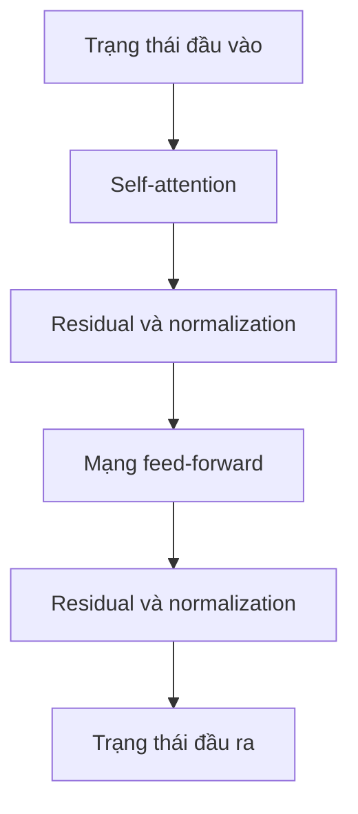
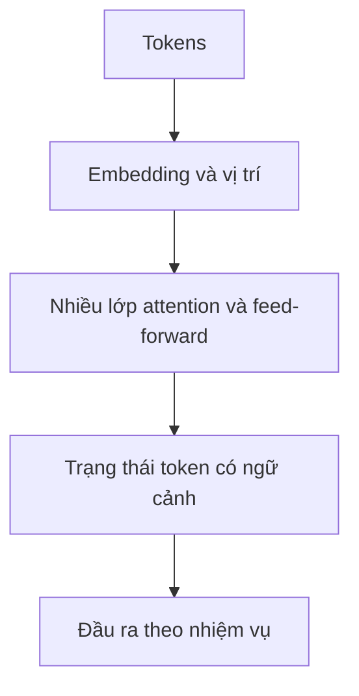

Transformer không phải một phép tính đơn lẻ. Đó là kiến trúc lặp lại nhiều lớp để biến biểu diễn của token thành những biểu diễn ngày càng giàu ngữ cảnh.

## Bắt đầu từ biểu diễn token

Các ID token được ánh xạ thành **embedding**. Model còn cần thông tin vị trí, vì attention thuần túy không tự biết thứ tự các token.

Kết quả là một chuỗi vector, mỗi token có một biểu diễn riêng.

## Một block transformer có hai phép tính chính

Có thể hình dung một block đơn giản như sau:

Chi tiết triển khai có thể khác nhau, nhất là vị trí đặt normalization, nhưng vai trò của các phần vẫn tương tự.

## Attention trộn thông tin giữa các vị trí

Self-attention cho mỗi vị trí token thu thập context từ những vị trí khác.

Đây là bước để các phần của chuỗi trao đổi thông tin với nhau.

## Feed-forward biến đổi từng vị trí

Sau khi các token trao đổi thông tin qua attention, một mạng neural nhỏ được áp dụng **độc lập ở từng vị trí**.

Có thể xem bước này là phép biến đổi phi tuyến làm biểu diễn của mỗi token giàu hơn sau khi đã nhận thông tin ngữ cảnh.

## Residual connection giữ đường đi cho thông tin

Thay vì thay thế hoàn toàn biểu diễn cũ, đường residual cộng phần thông tin đã biến đổi trở lại state trước đó.

Điều này giúp mạng sâu dễ tối ưu hơn và cho phép từng lớp tinh chỉnh biểu diễn, thay vì phải dựng lại từ đầu.

## Normalization ổn định phép tính

Normalization giúp activation nằm trong phạm vi dễ xử lý và cải thiện quá trình huấn luyện. Các biến thể transformer hiện đại khác nhau ở chiến lược normalization cụ thể, nhưng nó vẫn là thành phần quan trọng để huấn luyện mạng sâu ổn định.

## Xếp chồng nhiều block

Một model transformer lặp lại block này nhiều lần.

Các lớp đầu có thể học pattern cục bộ hoặc cú pháp; lớp sâu hơn có thể xây dựng biểu diễn liên quan tới nhiệm vụ hoặc ngữ nghĩa. Tuy nhiên, hành vi thực tế phân tán trong toàn mạng, không được chia gọn thành "mỗi lớp phụ trách một khái niệm".

## Biến thể encoder, decoder và decoder-only

Kiến trúc transformer ban đầu có cả encoder và decoder. Nhiều LLM hiện đại dùng dạng decoder-only vì việc sinh token tiếp theo phù hợp với causal self-attention.

Những nhiệm vụ khác vẫn dùng encoder-only hoặc encoder-decoder.

Nền tảng chung là tạo biểu diễn có ngữ cảnh dựa trên attention.

## Vì sao transformer mở rộng quy mô tốt?

Một số đặc điểm khiến transformer hấp dẫn:

- xử lý song song các token khi huấn luyện tốt hơn model hồi quy;
- tương tác linh hoạt giữa những vị trí xa nhau;
- kiến trúc có thể mở rộng theo dữ liệu và tài nguyên tính toán;
- pretraining có thể tái sử dụng cho nhiều nhiệm vụ phía sau.

Transformer cũng có giới hạn: chi phí attention tăng nhanh theo độ dài chuỗi, context hữu hạn và inference có thể tốn kém.

## Sơ đồ cần nhớ

Đó là bộ khung nằm dưới nhiều model ngôn ngữ hiện đại.
