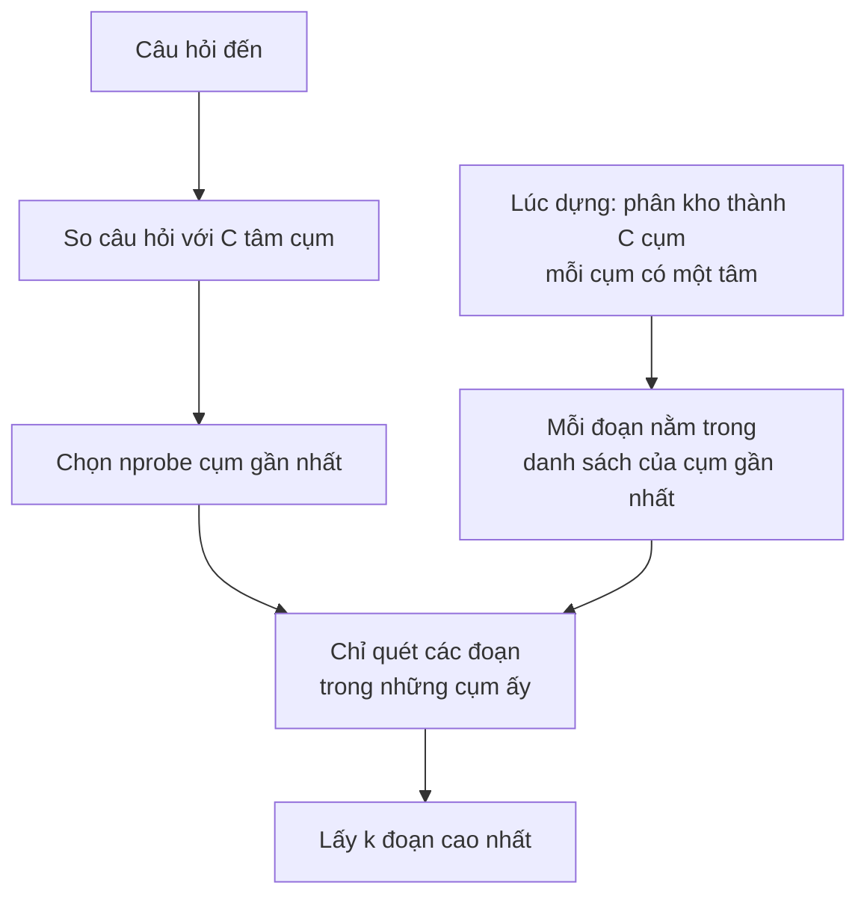
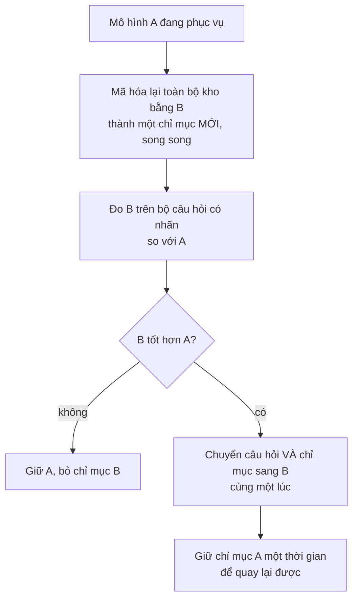

> **Mục tiêu bài học:** Sau bài này, bạn sẽ biết khi nào tìm kiếm chính xác là đủ và khi nào mới cần chỉ mục gần đúng, đo được cái giá về độ phủ của chỉ mục ấy, và nắm được ba việc vận hành mà chương Generative AI · Bài 12 đã lờ đi: thêm tài liệu mới, xóa tài liệu, và **đổi mô hình embedding** - việc có thể làm hỏng cả hệ mà không để lại một dòng lỗi nào.

Chương Generative AI · Bài 12 dựng một hệ hỏi đáp trên chính loạt bài này: cắt đoạn, mã hóa, tìm bằng cosine. Nó chạy được vì kho nhỏ và **không bao giờ đổi**. Hệ thật thì kho lớn lên mỗi ngày, tài liệu cũ bị gỡ xuống, và một ngày ai đó đề xuất "đổi sang mô hình embedding mới, nghe nói tốt hơn".

Bài này đo cả ba chuyện ấy.

> ⚠️ **Tất cả phép đo trong bài chạy trên CPU của máy cá nhân** (PyTorch 4 luồng, NumPy), không trên GPU. Tìm kiếm vector ở quy mô này là việc của CPU, và máy cá nhân cho số đo sạch hơn máy chủ dùng chung.

## 1. Khi nào quét toàn bộ là đủ

Tìm chính xác nghĩa là tính cosine giữa câu hỏi với **mọi** đoạn trong kho, rồi lấy $k$ đoạn cao nhất. Chi phí tỉ lệ với số đoạn nhân số chiều.

Trên kho thật - toàn bộ loạt bài lúc chạy thí nghiệm, **1.861 đoạn**, mỗi đoạn 384 chiều:

| | Giá trị |
|---|---|
| Thời gian quét toàn bộ cho một câu hỏi | **0,015 ms** |
| Article hit@5 trên 28 câu hỏi có nhãn | **0,964** |

Không phần nghìn giây nào để tiết kiệm. **Ở quy mô này, chỉ mục gần đúng là thừa**, và bài 12 chương trước dùng quét toàn bộ là đúng.

Trên một kho tổng hợp **100.000 vector** cùng 384 chiều, quét toàn bộ mất **6,51 ms** mỗi câu hỏi (p95: 11,85 ms). Vẫn nhanh - nhưng giờ con số ấy nhân theo số câu hỏi mỗi giây, và nhân theo kích thước kho.

Có một chi tiết nối thẳng về bài 01. Quét toàn bộ 100.000 vector float32 là đọc **153,6 MB** cho mỗi câu hỏi. Chia cho 6,51 ms được khoảng **23,6 GB/s** - đúng cỡ băng thông đọc bộ nhớ mà bài 01 đo được trên chính máy này khi sinh token trên CPU (21,3 GB/s). Tìm chính xác là **một phép đọc bộ nhớ**, và ở mức này nó chạy ở cỡ băng thông đọc của máy - cùng chỗ với pha sinh token. Bài không quét số nhân CPU, nên không nói được thêm nhân giúp bao nhiêu. Điều nói được là: **khi băng thông bộ nhớ đã bão hòa**, thêm nhân tính toán giúp rất ít; còn trước điểm ấy, thêm nhân có thể kéo được nhiều băng thông hơn. Cách trực tiếp nhất để nhanh hơn là **đọc ít đi**.

## 2. Chỉ mục phân cụm: đọc ít đi

Ý tưởng đơn giản nhất để đọc ít đi: chia kho thành các cụm từ trước, rồi mỗi câu hỏi chỉ quét vài cụm gần nó nhất.

Đây là cấu trúc tên **IVF** (*inverted file index*). Bài này dùng một bản **viết tay, tối giản** - một vòng k-means trên mẫu 20.000 vector, rồi tìm trong các danh sách - để thấy rõ cơ chế. Nó không phải một kho vector dùng cho sản phẩm; các thư viện thật còn nén vector, tối ưu bộ nhớ, và tìm song song.

Trên kho tổng hợp 100.000 vector, 316 cụm:

| `nprobe` | ms / câu hỏi (p50) | % kho phải quét |
|---|---|---|
| quét toàn bộ | 6,51 | 100% |
| 1 | **0,067** | 0,35% |
| 4 | 0,151 | 1,32% |
| 16 | 0,537 | 5,11% |
| 64 | 1,972 | 20,29% |

Ở `nprobe = 1`, câu hỏi chỉ quét **0,35%** kho và nhanh hơn **97 lần**.

Còn **độ phủ** - trong 10 đoạn chỉ mục trả về, bao nhiêu đoạn trùng với 10 đoạn mà quét toàn bộ trả về? Đây là chỗ phải cẩn thận nhất bài. Tôi sinh dữ liệu tổng hợp ở ba mức "cụm chồng lên nhau":

| Mức chồng lấn của cụm | Độ phủ@10 ở `nprobe` 1 | ở `nprobe` 4 | ở `nprobe` 32 |
|---|---|---|---|
| Cụm tách rời | **1,000** | 1,000 | 1,000 |
| Chồng lấn vừa | 0,994 | 0,998 | 0,999 |
| Chồng lấn nhiều | 0,934 | 0,960 | 0,980 |

Hàng đầu là cái bẫy. Với cụm tách rời, chỉ mục đạt độ phủ **hoàn hảo ở mọi mức** - kể cả khi chỉ quét 0,35% kho. Không phải chỉ mục giỏi. Mà là dữ liệu quá dễ: 10 láng giềng gần nhất của mọi câu hỏi luôn nằm trọn trong một cụm, nên quét đúng một cụm là đủ.

> ⚠️ **Độ phủ đo trên dữ liệu tổng hợp nói nhiều về cách bạn sinh dữ liệu hơn là về chỉ mục.** Cùng một chỉ mục cho độ phủ từ 0,934 tới 1,000 ở `nprobe` 1 chỉ tùy vào một tham số lúc sinh dữ liệu. Nên phần tổng hợp của bài chỉ dùng để đo **độ trễ** - thứ không phụ thuộc dữ liệu có cụm hay không. Độ phủ thì phải đo trên dữ liệu thật, ở mục 3.

## 3. Trên kho thật, đánh đổi mới lộ ra

Cùng chỉ mục ấy trên kho thật 1.861 đoạn, 43 cụm, với 28 câu hỏi có nhãn:

| `nprobe` | Độ phủ@5 so với quét toàn bộ | Article hit@5 |
|---|---|---|
| 1 | **0,421** | 0,714 |
| 2 | 0,636 | 0,857 |
| 4 | 0,786 | 0,929 |
| 8 | 0,879 | 0,929 |
| quét toàn bộ | 1,000 | **0,964** |

Ở `nprobe` 1, chỉ mục trả về trung bình **chưa tới một nửa** số đoạn mà quét toàn bộ trả về, và article hit@5 tụt từ 0,964 xuống 0,714. So với **0,934** ở mức tổng hợp khó nhất trong mục 2: embedding thật của văn bản thật **khó hơn hẳn** dữ liệu tổng hợp mà tôi nghĩ là khó.

Và toàn bộ cái giá ấy mua được… không gì cả, vì quét toàn bộ kho này chỉ mất 0,015 ms. Kết luận của mục 1 được củng cố: **chỉ dùng chỉ mục gần đúng khi quét toàn bộ thật sự quá chậm**, và khi dùng thì phải đo độ phủ trên chính dữ liệu của mình.

## 4. Vận hành: thêm tài liệu

Chỉ mục phân cụm có một giả định ngầm: **tâm cụm được học từ dữ liệu lúc dựng**. Tài liệu mới được nhét vào cụm gần nhất trong số các cụm cũ - dù chúng có thể thuộc một chủ đề mà lúc dựng chưa hề tồn tại.

Tôi mô phỏng đúng chuyện đó: dựng chỉ mục từ năm chương đầu, **rồi thêm chương AI Systems vào sau mà không học lại tâm cụm**. So với việc học lại tâm cụm trên toàn bộ kho:

| | Không học lại | Học lại trên toàn bộ kho |
|---|---|---|
| 81 đoạn mới rơi vào | 16 trong 43 cụm | - |
| Danh sách lớn nhất ÷ trung bình | 2,5 lần | - |
| Độ phủ@5 trên 8 câu hỏi về chương mới, `nprobe` 1 | **0,300** | 0,525 |
| như trên, `nprobe` 2 | **0,450** | 0,825 |

Tài liệu mới bị nhét vào những cụm vốn không dành cho chúng, và câu hỏi về chúng mất gần nửa độ phủ cho tới khi học lại. Chú ý cỡ mẫu: **8 câu hỏi, 81 đoạn** - đủ để thấy hướng, không đủ để đọc chính xác từng con số.

Hệ quả vận hành: một kho vector dùng chỉ mục phân cụm cần một **lịch học lại**, và cần một phép đo độ phủ chạy định kỳ trên một bộ câu hỏi có nhãn, **tách riêng phần câu hỏi về tài liệu mới** - vì con số trung bình của cả kho sẽ che đi đúng chỗ đang xấu dần.

## 5. Vận hành: xóa tài liệu

Gỡ một đoạn khỏi chỉ mục phân cụm thì đơn giản nhất là **đánh dấu mộ** (*tombstone*): giữ nguyên vector, chỉ ghi "đoạn này đã xóa", rồi lọc nó khỏi kết quả lúc trả về.

Nghe vô hại. Đo thử: đánh dấu xóa ngẫu nhiên **30%** kho, rồi tìm 5 đoạn và lọc bỏ đoạn đã xóa.

| Cách lấy | Số câu hỏi (trên 28) nhận về **ít hơn 5** đoạn |
|---|---|
| Lấy đúng 5 rồi lọc | **23** |
| Lấy 10 rồi lọc | 0 |
| Lấy 20 rồi lọc | 0 |

Con số 23 không bất ngờ nếu tính trước: xác suất cả 5 đoạn đều còn sống là $0{,}7^5 \approx 0{,}17$, tức khoảng **83%** câu hỏi sẽ nhận thiếu - 23 trên 28 là đúng cỡ đó. Nghĩa là nếu kho có nhiều tài liệu bị gỡ mà bạn không **lấy dư** trước khi lọc, người dùng sẽ lặng lẽ nhận ít ngữ cảnh hơn, và tầng sinh ở chương Generative AI · Bài 12 sẽ trả lời kém đi mà không ai biết vì sao.

Lấy dư 10 thì cả 28 câu của phép thử đều đủ 5 đoạn. Nhưng đừng đọc thành "lấy dư 10 là đủ": nếu 30% bị xóa và việc xóa độc lập với nhau, xác suất 10 đoạn chỉ còn **dưới 5** đoạn sống vẫn khoảng **4,7%** - gần một câu trong hai mươi. 28 câu không thiếu lần nào là chuyện hoàn toàn có thể xảy ra với xác suất ấy. Mức lấy dư phải chọn theo **tỉ lệ đã xóa**, **cách việc xóa phân bố** - xóa cả một tài liệu thì các đoạn của nó biến mất cùng lúc, tệ hơn nhiều so với xóa ngẫu nhiên - **số đoạn cần**, và **xác suất thiếu chấp nhận được**.

Còn một vấn đề mà phép đo này không thấy: vector đã xóa **vẫn nằm trong kho** và vẫn bị quét. Đến một mức nào đó phải dựng lại chỉ mục cho sạch - lại là một việc cần lên lịch.

## 6. Đổi mô hình embedding

Đây là phần nguy hiểm nhất, và là lý do bài này tồn tại.

Giả sử kho đang dùng mô hình A (`multilingual-e5-small`, 384 chiều). Có người đề xuất đổi sang mô hình B (`paraphrase-multilingual-MiniLM-L12-v2`, **cũng 384 chiều**). Đổi xong phần mã hóa câu hỏi, nhưng quên - hoặc chưa kịp - mã hóa lại toàn bộ kho.

| Câu hỏi mã hóa bằng | Kho mã hóa bằng | Article hit@5 | Cosine trung bình của kết quả đầu |
|---|---|---|---|
| A | A | **0,964** | 0,878 |
| B | B | 0,786 | - |
| **B** | **A** | **0,036** | **0,120** |
| A | B | 0,250 | - |

Đọc dòng in đậm. Chất lượng rơi từ **0,964 xuống 0,036**. Để so: chọn bừa 5 đoạn thì xác suất trúng đúng bài là khoảng **0,066**. Tức hệ tệ **ngang mức đoán mò**.

Và **không có dòng lỗi nào**. Hai mô hình cùng 384 chiều, nên phép nhân ma trận chạy trơn tru, hệ vẫn trả về đúng 5 đoạn cho mỗi câu hỏi, tầng sinh vẫn nhận ngữ cảnh và vẫn viết ra câu trả lời trôi chảy. Nếu hai mô hình khác số chiều, chương trình sẽ đổ ngay và bạn biết liền. Cùng số chiều thì **phép kiểm hình dạng không cứu được bạn**: phép tính có thể chạy trơn tru nhưng chất lượng truy hồi vẫn có thể rơi rất mạnh - như từ 0,964 xuống 0,036 trong phép thử này.

Trong những gì phép thử này ghi lại, có đúng một dấu hiệu nhìn thấy được: **cosine của kết quả đầu** tụt từ khoảng 0,878 xuống 0,120. Nên một việc vận hành rẻ mà đáng giá là **theo dõi phân bố điểm của kết quả truy hồi theo thời gian**. Nó không nói kết quả có đúng không, nhưng một cú tụt đột ngột như thế này là tín hiệu rằng có thứ gì đó đã đổi.

Bảng còn hai điều nữa.

**Mô hình mới không tự động tốt hơn.** B trên chính kho của B chỉ đạt **0,786**, so với 0,964 của A. Nếu đổi chỉ vì "nghe nói tốt hơn", hệ sẽ xấu đi dù làm đúng mọi bước. Đổi mô hình embedding là một quyết định phải **đo trên bộ câu hỏi của chính mình** trước.

**Chỗ lệch không đối xứng.** Câu hỏi A trên kho B được 0,250 - cao hơn hẳn mức đoán mò - trong khi chiều ngược lại chỉ 0,036. Bài không đủ dữ liệu để giải thích vì sao; điều nó cho thấy chắc chắn là **không thể đoán trước** hai không gian embedding khác nhau "tương thích" tới đâu.

**Mã hóa lại tốn bao nhiêu.** Trên máy này, mã hóa toàn bộ 1.861 đoạn mất khoảng **125 giây** với mỗi mô hình - khoảng **15 đoạn mỗi giây** trên CPU. Nhân lên một kho một triệu đoạn là khoảng **18,5 giờ** ở cùng tốc độ. GPU nhanh hơn nhiều, nhưng điều không đổi là: **đổi mô hình embedding nghĩa là mã hóa lại toàn bộ kho**, và việc ấy phải được lên kế hoạch như một lần di trú dữ liệu.

Nguyên tắc cốt lõi, **trong setup của bài này**: câu hỏi và kho phải được mã hóa bằng **đúng cùng một phiên bản** mô hình embedding và cùng quy trình - cùng checkpoint e5, cùng tiền tố `query:` và `passage:`, cùng cách chuẩn hóa - và chuyển cả hai trong cùng một bước. Tổng quát hơn, có những hệ truy hồi cố ý dùng **hai bộ mã hóa khác nhau** cho câu hỏi và cho tài liệu, được huấn luyện cùng nhau để cho ra cùng một không gian. Điều bất biến là câu hỏi và chỉ mục phải thuộc **một cặp mã hóa tương thích, đúng phiên bản** - không bao giờ đổi riêng một phía. Mọi trạng thái trung gian - câu hỏi đã sang B mà kho còn ở A - chính là dòng 0,036 trong bảng.

> 🔧 **Thử ngay:** hệ hỏi đáp nội bộ đột nhiên trả lời lạc đề từ sáng thứ hai. Không có lỗi nào trong log, độ trễ bình thường, tầng sinh không đổi. Bạn kiểm gì đầu tiên?
> Kiểm **phân bố điểm của kết quả truy hồi** trước và sau sáng thứ hai. Nếu cosine của kết quả đầu tụt hẳn - như từ 0,88 xuống 0,12 trong bảng - thì gần như chắc có một thay đổi, lỗi hoặc dịch chuyển workload ảnh hưởng tới **phía truy hồi**; đó là tín hiệu để khoanh vùng, chưa phải chẩn đoán. Kiểm lần lượt phần mã hóa - mô hình, phiên bản, tiền tố như `query:`, chuẩn hóa - rồi phiên bản và quá trình dựng chỉ mục, corpus, ingestion, bộ lọc, và cả phân bố câu hỏi người dùng. Đồng thời xác nhận bộ mã hóa câu hỏi và chỉ mục vẫn thuộc **một cặp phiên bản tương thích**. Lỗi kiểu này có thể không tự báo ra, vì với máy, 5 đoạn rác và 5 đoạn đúng có cùng hình dạng.

## Tóm tắt bài học

- Ở quy mô vài nghìn đoạn, **tìm chính xác là đủ**: 1.861 đoạn quét hết trong **0,015 ms**, article hit@5 **0,964**. Chỉ mục gần đúng ở đây chỉ làm mất chất lượng.
- Tìm chính xác là một **phép đọc bộ nhớ**: 100.000 vector là 153,6 MB mỗi câu hỏi, chạy ở khoảng 23,6 GB/s - đúng cỡ băng thông đọc của máy này ở bài 01. Khi băng thông bộ nhớ đã bão hòa, thêm nhân tính toán giúp ít; cách trực tiếp nhất để giảm chi phí là **đọc ít vector hơn**.
- Chỉ mục phân cụm (IVF) chỉ quét vài cụm gần câu hỏi: trên 100.000 vector, `nprobe` 1 quét **0,35%** kho, nhanh hơn **97 lần**.
- **Độ phủ đo trên dữ liệu tổng hợp nói về cách sinh dữ liệu hơn là về chỉ mục**: cùng một chỉ mục cho 0,934 tới 1,000 tùy độ chồng lấn của cụm. Trên kho thật, `nprobe` 1 chỉ đạt **0,421**.
- **Thêm tài liệu** mà không học lại tâm cụm làm độ phủ trên tài liệu mới tụt (0,300 so với 0,525 ở `nprobe` 1, trên 8 câu hỏi). Cần lịch học lại và phép đo tách riêng phần tài liệu mới.
- **Xóa bằng dấu mộ** mà không lấy dư: xóa 30% kho thì **23/28** câu hỏi nhận thiếu đoạn - khớp với $1 - 0{,}7^5 \approx 83\%$. Lấy dư 10 thì 28/28 câu đủ, nhưng theo mô hình xóa ngẫu nhiên xác suất thiếu vẫn khoảng **4,7%**; mức lấy dư phải chọn theo tỉ lệ xóa và xác suất thiếu chấp nhận được.
- **Đổi mô hình embedding** cùng số chiều mà quên mã hóa lại kho: chất lượng rơi từ **0,964 xuống 0,036**, dưới mức đoán mò 0,066, **không có dòng lỗi nào**. Trong những gì phép thử này ghi lại, dấu hiệu trực tiếp là cosine kết quả đầu tụt từ 0,878 xuống 0,120.
- Mô hình mới không tự động tốt hơn (0,786 so với 0,964). Đổi mô hình là một lần **di trú dữ liệu**: mã hóa lại song song, đo, chuyển câu hỏi và kho cùng lúc, giữ bản cũ để quay lại.

## Câu hỏi tự kiểm tra

1. Với kho bao nhiêu đoạn thì bạn bắt đầu cân nhắc chỉ mục gần đúng? Lập luận bằng thời gian quét toàn bộ và số câu hỏi mỗi giây, đừng bằng một con số cảm tính.
2. Khi nào thêm nhân CPU gần như không làm tìm chính xác nhanh hơn, và khi nào thì có? Dùng số ở mục 1 và bài 01.
3. Chỉ mục đạt độ phủ 1,000 ở mọi `nprobe` trên dữ liệu tổng hợp. Vì sao đó không phải tin tốt?
4. Trên kho thật, `nprobe` 1 cho độ phủ 0,421 nhưng article hit@5 lại 0,714. Giải thích vì sao hai con số này khác nhau nhiều như vậy.
5. Vì sao tài liệu mới thêm vào chỉ mục cũ lại bị tìm kém hơn tài liệu cũ? Đề xuất một cách phát hiện hiện tượng này trước khi người dùng phàn nàn.
6. Kho có 20% tài liệu bị đánh dấu xóa và bạn cần 8 đoạn cho mỗi câu hỏi. Nếu các đoạn bị xóa độc lập nhau, nên lấy bao nhiêu đoạn trước khi lọc để xác suất một câu nhận thiếu dưới 1%? Tính ra, rồi nói con số ấy đổi thế nào nếu việc xóa theo cả tài liệu.
7. Trong một lần di trú mà bộ mã hóa câu hỏi và chỉ mục vô tình lệch phiên bản, vì sao hai mô hình **khác số chiều** thường làm lỗi lộ ra sớm hơn hai mô hình **cùng số chiều**? Việc cùng số chiều không nói được điều gì về tính tương thích?
8. Thiết kế quy trình đổi mô hình embedding cho một kho 5 triệu đoạn đang phục vụ người dùng, sao cho không lúc nào bộ mã hóa câu hỏi và chỉ mục thuộc hai phiên bản không tương thích.

## Đọc thêm

**Nguồn nền tảng của bài:**

| Nguồn | Đọc phần nào |
|---|---|
| **Chương Generative AI · Bài 10** | Sentence embedding, cosine, và vì sao ngưỡng không mang từ bộ này sang bộ khác được |
| **Chương Generative AI · Bài 12** | Hệ hỏi đáp mà bài này đưa vào vận hành, và article hit@k |
| **Chương Machine Learning · Bài 09** | k-means - thuật toán dựng tâm cụm cho chỉ mục ở mục 2 |
| **Bài 01 của chương này** | Băng thông đọc bộ nhớ của máy - lý do tìm chính xác nghẽn |

**Đi sâu hơn:**

- [Jégou, Douze & Schmid - Product Quantization for Nearest Neighbor Search (TPAMI 2011)](https://ieeexplore.ieee.org/document/5432202) - nền của chỉ mục IVF kèm nén vector mà các thư viện thật dùng.
- [Johnson, Douze & Jégou - Billion-scale similarity search with GPUs (2017)](https://arxiv.org/abs/1702.08734) - bài báo của thư viện FAISS; cách làm những gì mục 2 làm bằng tay ở quy mô tỉ vector.
- [Malkov & Yashunin - HNSW (TPAMI 2018)](https://arxiv.org/abs/1603.09320) - họ chỉ mục gần đúng phổ biến thứ hai, dựa trên đồ thị thay vì phân cụm.

**Mã nguồn của bài:** [`code/b10_vector.py`](../../code/ai-systems/b10_vector.py) - chỉ mục viết tay, kho thật, thêm, xóa, đổi mô hình; [`code/b10b_tonghop.py`](../../code/ai-systems/b10b_tonghop.py) - cùng chỉ mục trên ba mức chồng lấn của dữ liệu tổng hợp.

> **Bài tiếp theo:** [Quan trắc hệ phục vụ](../observability-vi/) - bài này kết thúc bằng một lỗi không để lại dòng log nào - chỉ có phân bố điểm lệch đi. Bài sau hệ thống hóa điều đó cho cả hệ: ghi gì cho mỗi yêu cầu, và từ một triệu chứng người dùng phàn nàn thì đại lượng nào chỉ ra chỗ hỏng.
