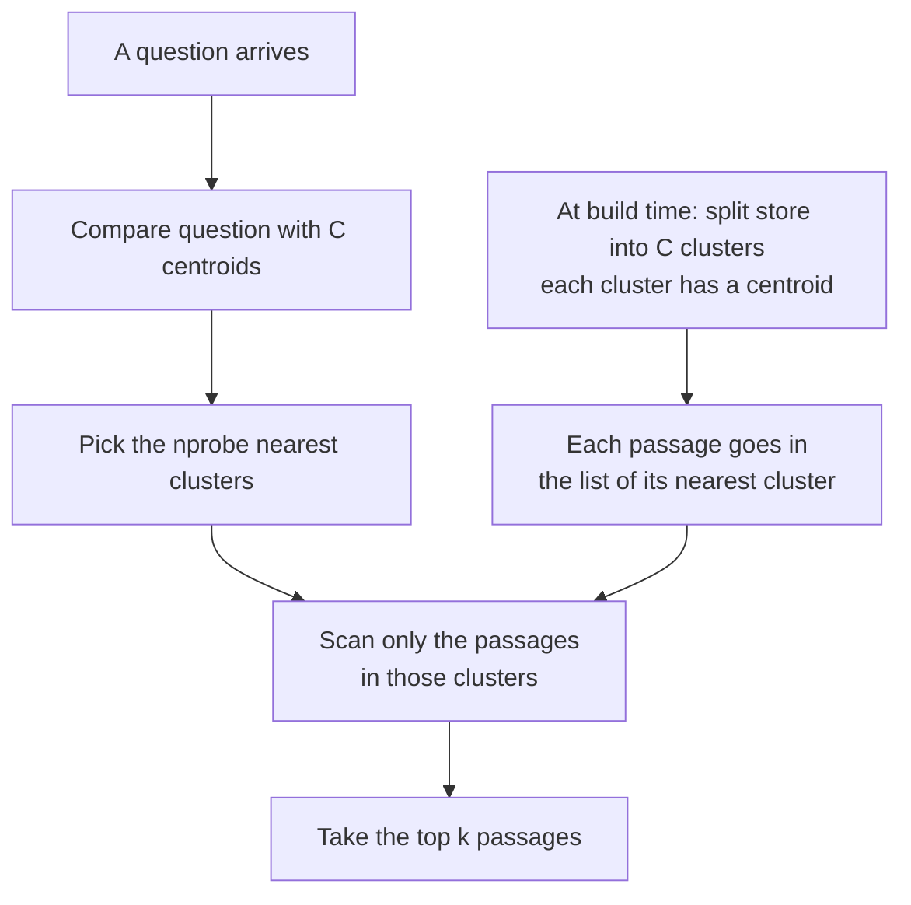
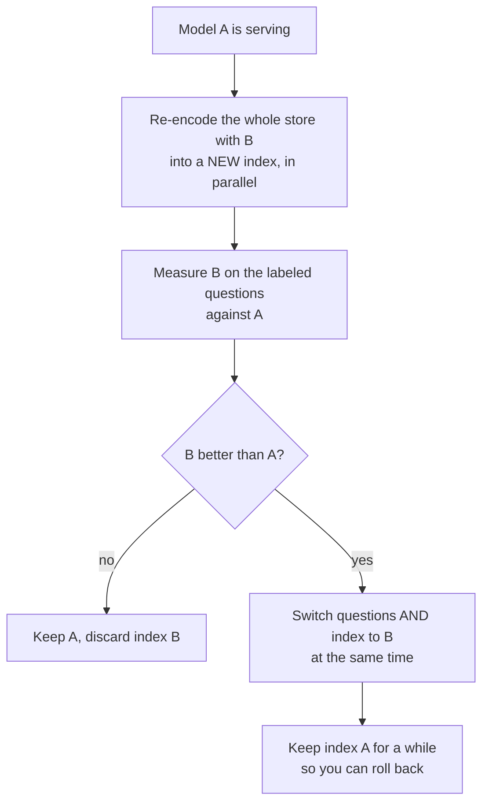

> **Learning objectives:** After this lesson, you will know when exact search is enough and when you actually need an approximate index, be able to measure that index's cost in recall, and understand three operational jobs that Generative AI · Lesson 12 ignored: adding new documents, deleting documents, and **changing the embedding model** - a job that can break the whole system without leaving a single error line.

Generative AI · Lesson 12 built a question answering system over this very series: split into passages, encode, search by cosine. It works because the store is small and **never changes**. In a real system the store grows every day, old documents are taken down, and one day someone proposes "switch to the new embedding model, I hear it's better".

This lesson measures all three.

> ⚠️ **All measurements in this lesson run on a personal computer's CPU** (PyTorch with 4 threads, NumPy), not on a GPU. Vector search at this scale is CPU work, and a personal machine gives cleaner measurements than a shared server.

## 1. When a full scan is enough

Exact search means computing the cosine between the question and **every** passage in the store, then taking the top $k$ passages. The cost is proportional to the number of passages times the number of dimensions.

On the real store - the whole series at the time of the experiment, **1,861 passages**, each with 384 dimensions:

| | Value |
|---|---|
| Full scan time for one question | **0.015 ms** |
| Article hit@5 on 28 labeled questions | **0.964** |

There is not a millisecond to save. **At this scale an approximate index is unnecessary**, and lesson 12 of the previous chapter was right to use a full scan.

On a synthetic store of **100,000 vectors** with the same 384 dimensions, a full scan takes **6.51 ms** per question (p95: 11.85 ms). Still fast - but now that number multiplies with the questions per second, and with the size of the store.

There is a detail that connects straight back to lesson 01. A full scan of 100,000 float32 vectors means reading **153.6 MB** for every question. Divided by 6.51 ms, that is about **23.6 GB/s** - right around the memory read bandwidth that lesson 01 measured on this same machine when generating tokens on the CPU (21.3 GB/s). Exact search is **a memory read**, and at this level it runs at about the machine's read bandwidth - the same place as the token generation phase. The lesson did not sweep the number of CPU cores, so it cannot say how much more cores would help. What it can say is: **once memory bandwidth is saturated**, adding compute cores helps very little; before that point, more cores may pull more bandwidth. The most direct way to go faster is to **read less**.

## 2. A clustered index: reading less

The simplest idea for reading less: split the store into clusters ahead of time, then have each question scan only the few clusters nearest to it.

This structure is called **IVF** (*inverted file index*). This lesson uses a **hand-written, minimal** version - one round of k-means on a sample of 20,000 vectors, then search within the lists - to show the mechanism clearly. It is not a production vector store; real libraries also compress vectors, optimize memory and search in parallel.

On the synthetic store of 100,000 vectors, 316 clusters:

| `nprobe` | ms / question (p50) | % of store scanned |
|---|---|---|
| full scan | 6.51 | 100% |
| 1 | **0.067** | 0.35% |
| 4 | 0.151 | 1.32% |
| 16 | 0.537 | 5.11% |
| 64 | 1.972 | 20.29% |

At `nprobe = 1`, a question scans only **0.35%** of the store and is **97 times** faster.

Now **recall** - of the 10 passages the index returns, how many match the 10 passages a full scan returns? This is the part of the lesson that needs the most care. I generated synthetic data at three levels of "cluster overlap":

| Cluster overlap level | Recall@10 at `nprobe` 1 | at `nprobe` 4 | at `nprobe` 32 |
|---|---|---|---|
| Separated clusters | **1.000** | 1.000 | 1.000 |
| Moderate overlap | 0.994 | 0.998 | 0.999 |
| Heavy overlap | 0.934 | 0.960 | 0.980 |

The first row is the trap. With separated clusters, the index reaches **perfect recall at every level** - even when scanning only 0.35% of the store. That is not because the index is good. It is because the data is too easy: the 10 nearest neighbors of every question always lie entirely within one cluster, so scanning exactly one cluster is enough.

> ⚠️ **Recall measured on synthetic data says more about how you generated the data than about the index.** The same index gives recall from 0.934 to 1.000 at `nprobe` 1 depending only on one parameter at data generation time. So the synthetic part of this lesson is used only to measure **latency** - something that does not depend on whether the data has clusters. Recall has to be measured on real data, in section 3.

## 3. On the real store, a new trade-off appears

The same index on the real store of 1,861 passages, 43 clusters, with 28 labeled questions:

| `nprobe` | Recall@5 vs full scan | Article hit@5 |
|---|---|---|
| 1 | **0.421** | 0.714 |
| 2 | 0.636 | 0.857 |
| 4 | 0.786 | 0.929 |
| 8 | 0.879 | 0.929 |
| full scan | 1.000 | **0.964** |

At `nprobe` 1, the index returns on average **fewer than half** of the passages a full scan returns, and article hit@5 drops from 0.964 to 0.714. Compare that with **0.934** at the hardest synthetic level in section 2: real embeddings of real text are **far harder** than the synthetic data I thought was hard.

And all that cost buys… nothing, because a full scan of this store takes only 0.015 ms. The conclusion of section 1 is reinforced: **use an approximate index only when a full scan is genuinely too slow**, and when you do, measure recall on your own data.

## 4. Operations: adding documents

A clustered index has a hidden assumption: **the centroids are learned from the data at build time**. New documents are pushed into the nearest of the old clusters - even though they may belong to a topic that did not exist at build time.

I simulated exactly that: build the index from the first five chapters, **then add the AI Systems chapter afterwards without relearning the centroids**. Compared with relearning the centroids on the whole store:

| | Not relearned | Relearned on the whole store |
|---|---|---|
| The 81 new passages land in | 16 of 43 clusters | - |
| Largest list ÷ average | 2.5 times | - |
| Recall@5 on 8 questions about the new chapter, `nprobe` 1 | **0.300** | 0.525 |
| same as above, `nprobe` 2 | **0.450** | 0.825 |

New documents are pushed into clusters that were never meant for them, and questions about them lose nearly half their recall until relearning. Note the sample size: **8 questions, 81 passages** - enough to see the direction, not enough to read each number precisely.

The operational consequence: a vector store using a clustered index needs a **relearning schedule**, and a recall measurement that runs periodically on a labeled question set, **with the questions about new documents reported separately** - because the average for the whole store will hide exactly the spot that is getting worse.

## 5. Operations: deleting documents

The simplest way to remove a passage from a clustered index is a **tombstone**: keep the vector, just record "this passage is deleted", then filter it out of the results when returning them.

Sounds harmless. Let's measure: mark a random **30%** of the store as deleted, then search for 5 passages and filter out the deleted ones.

| How we fetch | Questions (out of 28) that receive **fewer than 5** passages |
|---|---|
| Fetch exactly 5, then filter | **23** |
| Fetch 10, then filter | 0 |
| Fetch 20, then filter | 0 |

The number 23 is no surprise if you compute it first: the probability that all 5 passages are still alive is $0.7^5 \approx 0.17$, so about **83%** of questions will come up short - 23 out of 28 is right around that. This means that if the store has many removed documents and you do not **over-fetch** before filtering, users will quietly receive less context, and the generation layer from Generative AI · Lesson 12 will answer worse without anyone knowing why.

Over-fetching 10 gave all 28 questions in the test their full 5 passages. But do not read that as "over-fetching 10 is enough": if 30% are deleted and deletions are independent, the probability that 10 passages leave **fewer than 5** alive is still about **4.7%** - nearly one question in twenty. 28 questions with no shortfall is entirely possible at that probability. The over-fetch amount has to be chosen based on **the deleted fraction**, **how deletions are distributed** - deleting a whole document makes all its passages disappear at once, which is much worse than random deletion - **the number of passages needed**, and **the acceptable probability of a shortfall**.

There is one more problem this measurement does not see: deleted vectors **are still in the store** and still get scanned. At some point the index has to be rebuilt clean - another job that needs to be scheduled.

## 6. Changing the embedding model

This is the most dangerous part, and the reason this lesson exists.

Suppose the store currently uses model A (`multilingual-e5-small`, 384 dimensions). Someone proposes switching to model B (`paraphrase-multilingual-MiniLM-L12-v2`, **also 384 dimensions**). The question encoding is switched, but someone forgets - or has not yet gotten around - to re-encode the whole store.

| Questions encoded with | Store encoded with | Article hit@5 | Mean cosine of the top result |
|---|---|---|---|
| A | A | **0.964** | 0.878 |
| B | B | 0.786 | - |
| **B** | **A** | **0.036** | **0.120** |
| A | B | 0.250 | - |

Read the bold row. Quality falls from **0.964 to 0.036**. For comparison: picking 5 passages at random hits the right article with probability about **0.066**. So the system is as bad as **random guessing**.

And **there is no error line**. Both models have 384 dimensions, so the matrix multiplication runs smoothly, the system still returns exactly 5 passages for each question, and the generation layer still receives context and still writes a fluent answer. If the two models had different numbers of dimensions, the program would crash immediately and you would know right away. With the same number of dimensions, **a shape check cannot save you**: the computation can run smoothly while retrieval quality still falls sharply - like from 0.964 to 0.036 in this test.

Among the things this test recorded, there is exactly one visible sign: **the cosine of the top result** drops from about 0.878 to 0.120. So one cheap but valuable operational job is to **track the distribution of retrieval result scores over time**. It does not tell you whether the results are correct, but a sudden drop like this is a signal that something has changed.

The table says two more things.

**A new model is not automatically better.** B on its own store reaches only **0.786**, versus A's 0.964. If you switch just because "I hear it's better", the system gets worse even if every step is done correctly. Changing the embedding model is a decision that must first be **measured on your own question set**.

**The mismatch is not symmetric.** Questions from A on store B get 0.250 - well above random guessing - while the opposite direction gets only 0.036. The lesson does not have enough data to explain why; what it shows for certain is that **you cannot predict in advance** how "compatible" two different embedding spaces will be.

**How much re-encoding costs.** On this machine, encoding all 1,861 passages takes about **125 seconds** with each model - about **15 passages per second** on the CPU. Scaled up to a store of one million passages, that is about **18.5 hours** at the same speed. A GPU is much faster, but what does not change is this: **changing the embedding model means re-encoding the whole store**, and that has to be planned like a data migration.

The core principle, **in this lesson's setup**: questions and store must be encoded with **exactly the same version** of the embedding model and the same procedure - the same e5 checkpoint, the same `query:` and `passage:` prefixes, the same normalization - and both switched in a single step. More generally, some retrieval systems deliberately use **two different encoders** for questions and for documents, trained together to produce the same space. The invariant is that questions and index must belong to **one compatible encoder pair, at the right version** - never change only one side. Every intermediate state - questions already on B while the store is still on A - is exactly the 0.036 row in the table.

> 🔧 **Try it now:** an internal question answering system suddenly starts giving off-topic answers from Monday morning. No errors in the log, latency is normal, the generation layer has not changed. What do you check first?
> Check **the distribution of retrieval result scores** before and after Monday morning. If the cosine of the top result has dropped sharply - like from 0.88 to 0.12 in the table - then there is almost certainly a change, bug or workload shift affecting **the retrieval side**; that is a signal to narrow things down, not yet a diagnosis. Check in turn the encoding - the model, the version, prefixes such as `query:`, normalization - then the index version and build process, the corpus, ingestion, filters, and also the distribution of user questions. At the same time, confirm that the question encoder and the index still belong to **one compatible version pair**. Errors like this may not announce themselves, because to the machine, 5 junk passages and 5 correct passages have the same shape.

## Lesson summary

- At the scale of a few thousand passages, **exact search is enough**: 1,861 passages are fully scanned in **0.015 ms**, article hit@5 **0.964**. An approximate index here only loses quality.
- Exact search is **a memory read**: 100,000 vectors are 153.6 MB per question, running at about 23.6 GB/s - right around this machine's read bandwidth in lesson 01. Once memory bandwidth is saturated, more compute cores help little; the most direct way to cut the cost is to **read fewer vectors**.
- A clustered index (IVF) scans only the few clusters nearest to the question: on 100,000 vectors, `nprobe` 1 scans **0.35%** of the store and is **97 times** faster.
- **Recall measured on synthetic data says more about how the data was generated than about the index**: the same index gives 0.934 to 1.000 depending on cluster overlap. On the real store, `nprobe` 1 reaches only **0.421**.
- **Adding documents** without relearning the centroids makes recall on the new documents drop (0.300 versus 0.525 at `nprobe` 1, on 8 questions). You need a relearning schedule and a measurement that reports the new documents separately.
- **Deleting with tombstones** without over-fetching: with 30% of the store deleted, **23/28** questions come up short of passages - matching $1 - 0.7^5 \approx 83\%$. Over-fetching 10 gave 28/28 questions their full count, but under a random deletion model the probability of a shortfall is still about **4.7%**; the over-fetch amount must be chosen from the deletion rate and the acceptable shortfall probability.
- **Changing the embedding model** to one with the same number of dimensions and forgetting to re-encode the store: quality falls from **0.964 to 0.036**, below the random-guessing level of 0.066, with **no error line**. Among what this test recorded, the direct sign is the top result's cosine dropping from 0.878 to 0.120.
- A new model is not automatically better (0.786 versus 0.964). Changing models is a **data migration**: re-encode in parallel, measure, switch questions and store together, keep the old version to roll back.

## Self-check questions

1. At how many passages would you start considering an approximate index? Argue with the full scan time and the number of questions per second, not with a gut-feeling number.
2. When does adding CPU cores barely make exact search faster, and when does it help? Use the numbers in section 1 and lesson 01.
3. The index reaches recall 1.000 at every `nprobe` on synthetic data. Why is that not good news?
4. On the real store, `nprobe` 1 gives recall 0.421 but article hit@5 of 0.714. Explain why these two numbers differ so much.
5. Why are new documents added to an old index found less well than old documents? Propose a way to detect this before users complain.
6. A store has 20% of its documents marked as deleted and you need 8 passages per question. If passages are deleted independently, how many passages should you fetch before filtering so that the probability of a question coming up short is below 1%? Compute it, then say how that number changes if deletion happens by whole document.
7. In a migration where the question encoder and the index accidentally end up on different versions, why do two models with **different numbers of dimensions** usually expose the error sooner than two models with **the same number of dimensions**? What does having the same number of dimensions fail to tell you about compatibility?
8. Design a procedure for changing the embedding model of a 5-million-passage store that is serving users, such that at no moment do the question encoder and the index belong to two incompatible versions.

## Further reading

**Foundational sources for this lesson:**

| Source | What to read |
|---|---|
| **Generative AI · Lesson 10** | Sentence embeddings, cosine, and why a threshold does not carry over from one dataset to another |
| **Generative AI · Lesson 12** | The question answering system this lesson puts into production, and article hit@k |
| **Machine Learning · Lesson 09** | k-means - the algorithm that builds the centroids for the index in section 2 |
| **Lesson 01 of this chapter** | The machine's memory read bandwidth - why exact search is bottlenecked |

**Going further:**

- [Jégou, Douze & Schmid - Product Quantization for Nearest Neighbor Search (TPAMI 2011)](https://ieeexplore.ieee.org/document/5432202) - the basis of the IVF index with vector compression that real libraries use.
- [Johnson, Douze & Jégou - Billion-scale similarity search with GPUs (2017)](https://arxiv.org/abs/1702.08734) - the FAISS library paper; how to do what section 2 does by hand at the scale of billions of vectors.
- [Malkov & Yashunin - HNSW (TPAMI 2018)](https://arxiv.org/abs/1603.09320) - the second most common family of approximate indexes, based on graphs instead of clustering.

**Source code for this lesson:** [`code/b10_vector.py`](../../code/ai-systems/b10_vector.py) - the hand-written index, real store, adding, deleting, changing models; [`code/b10b_tonghop.py`](../../code/ai-systems/b10b_tonghop.py) - the same index on three overlap levels of synthetic data.

> **Next lesson:** [Observability for Serving Systems](../observability/) - this lesson ended with an error that left no log line - only a shifted score distribution. The next lesson systematizes that for the whole system: what to record for each request, and, starting from a symptom users complain about, which quantity points to what is broken.
