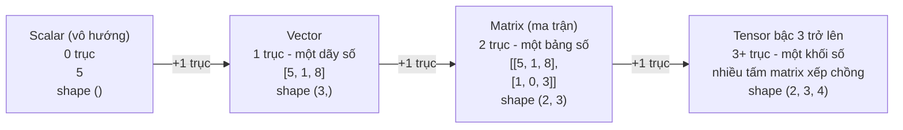
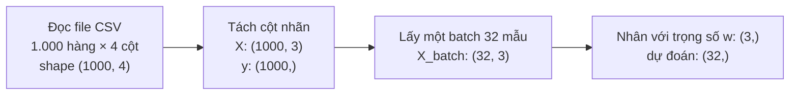

> **Mục tiêu bài học:** Sau bài này, bạn sẽ hiểu scalar, vector, matrix và tensor là gì, vì sao dữ liệu trong ML luôn được đóng gói thành các "khối số" như vậy, và tự tay làm được các phép toán cơ bản (cộng, nhân vô hướng, nhân ma trận) trên giấy lẫn trong NumPy.

## 1. Máy tính nhìn thế giới bằng những khối số

Nhiệt độ hôm nay ở Hà Nội. Một căn nhà trong bảng giá nhà mini. Cả bảng 6 căn. Một bức ảnh mèo. Máy tính thấy bốn thứ này *giống nhau* ở điểm nào?

Ở Bài 03, bạn đã thấy: muốn máy học được, mọi thứ đều phải được mô tả bằng **các con số (features)**. Bài này trả lời câu hỏi tiếp theo: *những con số đó được xếp lại thành hình thù gì để máy tính xử lý?*

Câu trả lời là bốn "kiểu hộp đựng số" bạn sẽ gặp đi gặp lại trong suốt loạt bài này: **scalar, vector, matrix, tensor**. Chúng không phải bốn khái niệm rời rạc, mà là **một chiếc thang** - mỗi bậc chỉ đơn giản là thêm một trục (axis) so với bậc trước. Bốn thứ ở câu hỏi mở đầu chính là bốn bậc của chiếc thang đó.

Tin tốt: để đọc hiểu phần lớn tài liệu ML nhập môn, bạn không cần cả một học phần đại số tuyến tính. Bạn cần nắm chắc chiếc thang này, vài phép toán cơ bản, và một trực giác tốt về "shape". Đó chính xác là nội dung bài hôm nay.

## 2. Chiếc thang bốn bậc: scalar → vector → matrix → tensor



- **Vô hướng (scalar):** một con số đơn lẻ. Nhiệt độ 28°C, giá 5 triệu - đều là scalar.
- **Vector:** một **dãy số có thứ tự** - bạn có thể coi nó như *một mảng số có độ dài cố định*. Số phần tử của vector gọi là **số chiều (dimensionality)** - vector `[5, 1, 8]` là vector 3 chiều.
- **Ma trận (matrix):** một **bảng số** gồm các hàng và cột. Ma trận có 2 hàng, 3 cột được gọi là ma trận 2×3.
- **Tensor:** tên gọi chung cho "hộp đựng số **với số trục bất kỳ**". Scalar là tensor bậc 0, vector là tensor bậc 1, matrix là tensor bậc 2; từ 3 trục trở lên ta thường gọi thẳng là tensor.

Chi tiết bất ngờ: cái tên **TensorFlow** (thư viện deep learning của Google) và lớp `Tensor` (đối tượng dữ liệu trung tâm của PyTorch) đều đến từ đây - cả hai thư viện làm việc bằng cách cho tensor "chảy" qua các phép tính.

> 💡 **Lưu ý thuật ngữ:** chữ "chiều" trong tiếng Việt (và "dimension" trong tiếng Anh) bị dùng lẫn cho hai thứ khác nhau: (1) **số trục** của khối số, và (2) **số phần tử** của một vector. Sách *Dive into Deep Learning* đề xuất cách gọi tách bạch: dùng **bậc (order)** cho số trục, và **số chiều (dimensionality)** cho số phần tử của vector. Ví dụ: ảnh màu là tensor *bậc 3*; vector mô tả một căn nhà bằng 3 con số là vector *3 chiều*.

> ⚠️ **Lưu ý nhỏ:** trong các framework ML, chữ "tensor" được dùng theo nghĩa "mảng n chiều"; tensor trong toán học có định nghĩa chặt chẽ hơn - bạn chưa cần bận tâm ở giai đoạn này.

## 3. Ba cách nhìn một vector

Cùng một vector `[3, 2]`, lập trình viên thấy một mảng hai phần tử, nhà hình học thấy một mũi tên, nhà đại số thấy... một thứ "cộng được và co giãn được". Vector là nhân vật chính của cả bài, nên đáng để nhìn nó từ cả ba góc (cách trình bày này theo tinh thần của sách *Mathematics for Machine Learning*).

**Góc nhìn 1 - mảng số (góc nhìn của máy tính).** Vector là một dãy số: `[30, 1, 5]`. Đây là cách vector tồn tại trong bộ nhớ máy tính, và là dạng bạn thao tác hằng ngày với NumPy.

**Góc nhìn 2 - mũi tên (góc nhìn hình học).** Vector 2 chiều `[3, 2]` là **một mũi tên** xuất phát từ gốc tọa độ, đi 3 đơn vị sang phải và 2 đơn vị lên trên. Mũi tên có **hướng** và **độ dài** - hai đặc điểm sẽ trở thành trung tâm của Bài 07:

```
      ↑
    2 ┤        ● (3, 2)
      │      ╱
      │    ╱      ← vector [3, 2] là mũi tên này
      │  ╱
      └─────────┬──→
                3
```

Với vector 3 chiều, mũi tên nằm trong không gian 3D. Từ 4 chiều trở lên thì không vẽ nổi nữa - nhưng trực giác "mũi tên có hướng và độ dài" vẫn dùng được, và dân ML dùng nó hằng ngày cho vector hàng trăm chiều.

**Góc nhìn 3 - đối tượng đại số (góc nhìn trừu tượng).** Sách *Mathematics for Machine Learning* định nghĩa: bất cứ thứ gì **cộng được với nhau** và **nhân được với một con số** mà kết quả vẫn cùng loại - thứ đó là vector. Điều bất ngờ theo định nghĩa này: đa thức hay **tín hiệu âm thanh cũng là vector** - cộng hai đoạn âm thanh ra một đoạn âm thanh; khuếch đại một đoạn âm thanh vẫn ra âm thanh. Bạn chưa cần dùng góc nhìn này ngay, nhưng biết nó tồn tại sẽ giúp bạn đỡ ngỡ ngàng khi gặp lại ở các tài liệu sâu hơn.

Ba góc nhìn - **một dãy số, một mũi tên, một đối tượng cộng-và-co-giãn được** - là cùng một thứ. Chuyển qua lại linh hoạt giữa chúng chính là "khả năng đọc hiểu" toán của người làm ML.

## 4. Dữ liệu ML nằm ở bậc thang nào?

Quay lại bảng giá nhà mini của Bài 02-03 và đặt từng thứ lên chiếc thang.

**Một mẫu dữ liệu = một vector.** Căn nhà số 1 được mô tả bằng 3 features (diện tích m², số phòng ngủ, km đến trung tâm) trở thành vector 3 chiều:

```
căn nhà 1  →  x = [30, 1, 5]
```

Tương tự, mỗi người nộp hồ sơ vay tiền có thể được mô tả bằng một vector gồm thu nhập, thâm niên làm việc, số lần trễ hạn trước đây...

**Cả bảng dữ liệu = một matrix.** Xếp 6 căn nhà chồng lên nhau, ta được ma trận dữ liệu - đúng quy ước bạn đã gặp ở Bài 03: **mỗi hàng là một mẫu, mỗi cột là một feature**:

```
              diện tích   phòng ngủ   km trung tâm
căn nhà 1   ┌    30           1            5       ┐
căn nhà 2   │    45           2            3       │
căn nhà 3   │    60           2            7       │   ← matrix X, shape (6, 3)
căn nhà 4   │    80           3            2       │
căn nhà 5   │   100           3           10       │
căn nhà 6   └    55           2            4       ┘
```

Bảng 1.000 căn nhà × 3 features là ma trận shape `(1000, 3)`. Khi tài liệu ML viết "ma trận dữ liệu X", đó chính là cái bảng này.

**Ảnh màu = tensor bậc 3.** Một ảnh màu gồm ba "tấm" số xếp chồng: tấm đỏ (R), tấm lục (G), tấm lam (B) - mỗi tấm là một ma trận cao × rộng ghi cường độ màu tại từng điểm ảnh:

```
                ┌────────────┐
             ┌──┤  kênh B    │
          ┌──┤  │  (lam)     │
  ảnh  =  │  │  ├────────────┘      shape = (200, 300, 3)
  màu     │  │ kênh G (lục)          cao × rộng × số kênh màu
          │  ├──────────────┘
          │ kênh R (đỏ)
          └─────────────────┘
```

Còn nhớ Bài 01 từng nói ảnh màu 200×200 là 120.000 con số? Giờ bạn biết chính xác 120.000 con số đó được xếp thế nào: tensor shape `(200, 200, 3)`.

Và khi huấn luyện, mô hình thường xử lý **một lô (batch)** nhiều ảnh cùng lúc: 32 ảnh màu 200×300 là tensor **bậc 4**, shape `(32, 200, 300, 3)`. Cứ thêm một cấp "gom nhóm" là thêm một trục - chiếc thang cứ thế nối dài.

| Dữ liệu | Đối tượng | Shape ví dụ |
|---|---|---|
| Giá một căn nhà | scalar | `()` |
| Một căn nhà (3 features) | vector | `(3,)` |
| Bảng giá nhà mini (6 căn) | matrix | `(6, 3)` |
| Bảng 1.000 căn nhà | matrix | `(1000, 3)` |
| Một ảnh màu 200×300 | tensor bậc 3 | `(200, 300, 3)` |
| Batch 32 ảnh màu | tensor bậc 4 | `(32, 200, 300, 3)` |

> 🔧 **Thử ngay (NumPy):** dựng bảng nhà mini rồi hỏi shape và đếm số:
> ```python
> import numpy as np
> X = np.array([[30, 1, 5], [45, 2, 3], [60, 2, 7], [80, 3, 2], [100, 3, 10], [55, 2, 4]])
> X.shape, X[0], X[:, 0]                # shape / hàng đầu / cột đầu
> np.zeros((32, 200, 300, 3)).size      # batch 32 ảnh chứa bao nhiêu con số?
> ```
> *Đáp số:* `(6, 3)`, `[30, 1, 5]` (căn nhà 1), `[30, 45, 60, 80, 100, 55]` (cột diện tích) - và một batch 32 ảnh "nhỏ" đã là **5.760.000** con số.

> ⚠️ **Lưu ý nhỏ:** thứ tự các trục là quy ước của từng thư viện: nhiều thư viện ảnh xếp (cao, rộng, kênh) như trên, còn PyTorch thường xếp (kênh, cao, rộng) - thêm một lý do để luôn kiểm tra shape.

## 5. Phép toán cơ bản: cộng, nhân vô hướng và nhân ma trận

### 5.1. Cộng vector: cộng từng vị trí

Hai vector **cùng số chiều** cộng với nhau bằng cách cộng từng cặp phần tử:

```
[2, 1] + [1, 3] = [3, 4]
```

Về hình học, đó là "đi hết mũi tên thứ nhất rồi đi tiếp mũi tên thứ hai". Cộng ma trận cũng vậy - cộng từng ô của hai bảng cùng kích thước.

### 5.2. Nhân vô hướng: co giãn mũi tên

Nhân vector với một con số = nhân số đó vào **từng phần tử**:

```
3 × [2, 1] = [6, 3]
```

Mũi tên được kéo dài gấp 3, **hướng giữ nguyên**. Nhân với 0,5 là co ngắn một nửa; nhân với −1 là quay ngược hướng; nhân với 0 thì mọi vector đều về vector 0. Chi tiết "hướng giữ nguyên" nghe qua thì nhỏ, nhưng là chìa khóa của cosine similarity ở Bài 07.

### 5.3. Nhân ma trận-vector: nhiều "tổng có trọng số" cùng lúc

Người thợ ống nước của Bài 01 có 3 ca làm: 2, 3 và 4 giờ. Tính từng hóa đơn `100 × giờ + 50` là ba phép tính. Nhân ma trận cho phép làm **cả ba trong một phát tính** - đó là phép toán quan trọng nhất bài.

Trước hết là **quy tắc cơ học**: lấy **từng hàng** của ma trận, nhân từng cặp phần tử với vector rồi cộng lại:

```
┌ 1  2 ┐             ┌ 1×2 + 2×1 ┐   ┌ 4 ┐
│ 3  0 │ × [2, 1] =  │ 3×2 + 0×1 │ = │ 6 │
└ 0  1 ┘             └ 0×2 + 1×1 ┘   └ 1 ┘
 (3×2)     (2,)                       (3,)
```

Mỗi phần tử kết quả là một **tổng có trọng số (weighted sum)**: "nhân từng cặp rồi cộng dồn". Phép này quen đến bất ngờ: công thức `tiền = 100 × giờ + 50 × 1` chính là tổng có trọng số của vector `[giờ, 1]` với trọng số `[100, 50]`. Nhân **ma trận dữ liệu** với **vector trọng số** nghĩa là: làm phép dự đoán đó cho **mọi hàng - mọi căn nhà, mọi khách hàng - trong một phát tính duy nhất**. Đó là lý do ML "nghiện" nhân ma trận.

> 🔧 **Thử ngay (tính tay rồi kiểm bằng NumPy):** `B = [[2, 0], [1, 1], [0, 3]]`, `v = [1, 2]`. Tính `B @ v` theo hàng.
> ```python
> B = np.array([[2, 0], [1, 1], [0, 3]])
> v = np.array([1, 2])
> B @ v
> ```
> *Đáp số:* `[2, 3, 6]` - hàng 1: 2×1 + 0×2 = 2; hàng 2: 1×1 + 1×2 = 3; hàng 3: 0×1 + 3×2 = 6.

Còn một cách nhìn thứ hai, rất đáng biết (theo sách *Mathematics for Machine Learning*): kết quả trên cũng chính là **tổ hợp các cột** của ma trận - lấy 2 phần cột thứ nhất cộng 1 phần cột thứ hai:

```
    ┌ 1 ┐       ┌ 2 ┐   ┌ 4 ┐
2 × │ 3 │ + 1 × │ 0 │ = │ 6 │   ← đúng kết quả ở trên
    └ 0 ┘       └ 1 ┘   └ 1 ┘
```

Hai cách nhìn cho cùng đáp số: **nhìn theo hàng** = nhiều tổng có trọng số; **nhìn theo cột** = pha trộn các cột theo tỷ lệ mà vector chỉ ra. (Kiểm lại với ví dụ "Thử ngay": 1 × [2, 1, 0] + 2 × [0, 1, 3] = [2, 3, 6].) Cách nhìn thứ hai còn gợi ý một trực giác lớn hơn: nhân với ma trận là **một phép biến đổi** - nhận vector 2 chiều, trả về vector 3 chiều. Chuỗi video *Essence of Linear Algebra* của 3Blue1Brown (mục Đọc thêm) minh họa trực giác "ma trận = phép biến đổi không gian" này bằng hình động rất đẹp.

Nhân **ma trận với ma trận** chỉ là mở rộng tự nhiên: nhân ma trận bên trái với từng cột của ma trận bên phải, rồi ghép các cột kết quả lại.

<details>
<summary>Chi tiết thêm: nhân ma trận không giao hoán, và "nhân từng ô" là phép khác</summary>

- Thứ tự nhân ma trận **quan trọng**: nói chung `A @ B` khác `B @ A` (thậm chí một bên tính được còn bên kia thì không, do lệch shape). Sách *Mathematics for Machine Learning* (mục 2.2) có ví dụ số cụ thể cho điều này.
- Nhân ma trận **không phải** là "nhân từng ô tương ứng". Phép nhân từng ô có tên riêng - **tích Hadamard (Hadamard product)** - và trong NumPy nó là `A * B`, còn nhân ma trận thật là `A @ B`. Gõ nhầm `*` thay vì `@` là lỗi kinh điển của người mới.

</details>

> ⚠️ **Lưu ý nhỏ:** trong mạng nơ-ron, phần tuyến tính của một tầng kết nối đầy đủ cũng dựa trên phép nhân ma trận này - sau đó thường cộng thêm bias và đi qua một hàm kích hoạt. Khi xử lý cả batch, phép tính trở thành nhân ma trận với ma trận.

## 6. Shape - và vì sao lỗi shape "ám" người mới

Dòng chữ đỏ đầu tiên bạn gặp khi viết code ML nhiều khả năng là một lỗi shape. **Shape** cho biết kích thước của từng trục: ma trận 3 hàng 2 cột có shape `(3, 2)`; batch ảnh có shape `(32, 200, 300, 3)`. Đây là thông tin bạn sẽ kiểm tra nhiều nhất khi viết code ML, vì các phép toán chỉ chạy khi shape **khớp nhau đúng quy tắc**:

- **Cộng / nhân từng phần tử:** hai bên phải cùng shape (hoặc "khớp" theo cơ chế broadcasting của NumPy - Bài 02 đã chạm qua).
- **Nhân ma trận:** hai **chiều giáp nhau phải bằng nhau** - số cột bên trái = số hàng bên phải:

```
(3 × 2) @ (2 × 5)  →  OK, kết quả (3 × 5)     "2 giáp 2 - khớp, hai đầu còn lại ra kết quả"
   └──┘    └──┘
(3 × 2) @ (3 × 2)  →  LỖI                      "2 giáp 3 - lệch"
```

Vì sao lỗi shape hay gặp đến vậy? Vì trong một pipeline ML thật, dữ liệu bị **biến hình liên tục** - chỉ cần một bước tạo ra shape ngoài dự kiến là bước nhân phía sau báo lỗi ngay. Ví dụ với 1.000 căn nhà:



Quên tách cột nhãn ở bước 2 thì phép nhân thành `(32, 4) @ (3,)` - 4 giáp 3, lệch - và NumPy báo:

```
matmul: Input operand 1 has a mismatch in its core dimension 0 ... (size 3 is different from 4)
```

(Hàm `np.dot` cũ hơn nói dễ hiểu hơn: `shapes (32,4) and (3,) not aligned`.) Người có kinh nghiệm không giỏi *tránh* lỗi này hơn bạn bao nhiêu - họ chỉ **kiểm tra `.shape` sớm và thường xuyên hơn**, và đọc thông báo lỗi shape như đọc một câu tiếng Việt: "chiều giáp nhau đang lệch ở đâu?".

> 🔧 **Thử ngay (đoán trước rồi chạy):** đoán shape kết quả của từng dòng trước khi bấm chạy.
> ```python
> (np.ones((4, 3)) @ np.ones((3, 2))).shape
> (np.ones((4, 3)) @ np.ones((4, 3))).shape
> ```
> *Đáp số:* dòng 1 → `(4, 2)` (3 giáp 3, khớp; hai đầu còn lại 4 và 2). Dòng 2 → **lỗi** (3 giáp 4, lệch).

> 💡 **Thói quen đáng giá:** trước mỗi phép `@`, tự hỏi "shape hai bên là gì, chiều giáp nhau có khớp không, kết quả sẽ có shape gì?". Trả lời được ba câu này trước khi bấm chạy là bạn đã chặn được phần lớn lỗi shape.

## 7. Vào code: NumPy trong 10 dòng

Toàn bộ bài học gói lại trong đoạn NumPy sau (chạy được ngay trong môi trường Python của Bài 02):

```python
import numpy as np

x = np.array([2, 1])              # vector, shape (2,)
y = np.array([1, 3])

x + y                             # array([3, 4])   - cộng từng phần tử
3 * x                             # array([6, 3])   - nhân vô hướng

A = np.array([[1, 2],
              [3, 0],
              [0, 1]])            # matrix, shape (3, 2)
A.shape                           # (3, 2)

A @ x                             # array([4, 6, 1]) - nhân ma trận-vector, đúng ví dụ tính tay
A * A                             # nhân TỪNG Ô (Hadamard) - đừng nhầm với @

image = np.zeros((200, 300, 3))     # "ảnh" màu 200×300 toàn số 0, tensor bậc 3
image.shape                         # (200, 300, 3)
```

Hãy thử tự sửa: đổi `A @ x` thành `A @ np.array([2, 1, 5])` và đọc thông báo lỗi - NumPy sẽ phàn nàn `size 3 is different from 2`: đúng chuyện "chiều giáp nhau" vừa học ở mục 6 (2 cột của `A` giáp 3 phần tử của vector).

## Tóm tắt bài học

- **Scalar → vector → matrix → tensor** là chiếc thang tăng dần số trục: một số → dãy số → bảng số → khối số. Tensor là tên gọi chung; "bậc (order)" = số trục, "số chiều (dimensionality)" = số phần tử của một vector.
- Trong ML: **một mẫu = một vector**; **bảng dữ liệu = matrix** với hàng = mẫu, cột = feature (đúng quy ước Bài 03); **ảnh màu = tensor bậc 3** (cao × rộng × 3 kênh màu); **batch ảnh = tensor bậc 4**.
- Vector có **ba cách nhìn** tương đương: mảng số (máy tính), mũi tên có hướng và độ dài (hình học), đối tượng cộng-và-co-giãn được (đại số) - theo sách *Mathematics for Machine Learning*.
- **Cộng vector** = cộng từng vị trí; **nhân vô hướng** = co giãn độ dài - nhân số dương thì giữ hướng, số âm thì quay ngược, nhân 0 thì về vector 0.
- **Nhân ma trận-vector** = nhiều tổng có trọng số cùng lúc (nhìn theo hàng) = tổ hợp các cột (nhìn theo cột); đây là phép tính lõi trong dự đoán hàng loạt và trong phần tuyến tính của các tầng mạng nơ-ron.
- Nhân ma trận đòi hỏi **hai chiều giáp nhau phải bằng nhau**: `(m×n) @ (n×k) → (m×k)`. Kiểm tra `.shape` sớm là cách phòng lỗi hiệu quả; và `*` (nhân từng ô) khác `@` (nhân ma trận).

## Câu hỏi tự kiểm tra

1. Xếp các dữ liệu sau vào đúng bậc thang (scalar / vector / matrix / tensor bậc mấy?) và đoán shape: (a) ảnh xám 28×28; (b) bảng điểm 40 học sinh × 5 môn; (c) một batch 16 ảnh màu 100×100; (d) nhiệt độ hôm nay ở Hà Nội.
2. Tính tay: `[1, 4] + [2, −1] = ?` và `3 × [2, 0, 1] = ?`
3. Tính tay `A @ x` với `A = [[1, 0], [2, 3]]` và `x = [2, 1]`. Sau đó kiểm tra lại đáp số bằng cách nhìn theo cột: `2 × (cột 1) + 1 × (cột 2)`.
4. Ma trận `A` có shape `(4, 3)`, vector `x` có shape `(3,)`. Phép `A @ x` có hợp lệ không? Nếu có, kết quả shape gì? Còn `x @ A` thì sao?
5. Bảng dữ liệu 500 khách hàng, mỗi khách 6 features. Ma trận dữ liệu có shape gì? Hàng thứ 10 và cột thứ 2 của nó lần lượt mang ý nghĩa gì (liên hệ Bài 03)?
6. Vì sao nhân **một ma trận dữ liệu** với **một vector trọng số** lại được mô tả là "dự đoán cho mọi mẫu trong một phát tính"? Lấy ví dụ tiền công thợ ở Bài 01 (100 nghìn/giờ + 50 nghìn phí đến nhà) với 3 ca làm 2, 3 và 4 giờ để minh họa.

## Đọc thêm

**Nguồn nền tảng của bài:**

| Nguồn | Đọc phần nào |
|---|---|
| **Sách *Dive into Deep Learning*** (bản online tại d2l.ai) | Chương 2 - *Preliminaries*: mục 2.1 *Data Manipulation* (tensor, shape, reshape) và mục 2.3 *Linear Algebra* (scalar → tensor, các phép toán, nhân ma trận) |
| **Sách *Mathematics for Machine Learning*** | Chương 2 - *Linear Algebra*: mục 2.1-2.2 (vector là gì, ma trận, nhân ma trận, Ax là tổ hợp các cột) |

**Nguồn online bổ sung (miễn phí):**

- [Essence of Linear Algebra - 3Blue1Brown](https://www.3blue1brown.com/topics/linear-algebra) - chuỗi video trực quan hóa đại số tuyến tính bằng hình động; riêng [chương 1: "Vectors, what even are they?"](https://www.youtube.com/watch?v=fNk_zzaMoSs) minh họa đúng "ba cách nhìn một vector" của bài này.
- [NumPy: the absolute basics for beginners](https://numpy.org/doc/stable/user/absolute_beginners.html) - tài liệu chính thức của NumPy về array, shape và các phép toán.
- [Machine Learning cơ bản - phần Toán](https://machinelearningcoban.com/math/) - trang ôn tập đại số tuyến tính bằng tiếng Việt của blog Machine Learning cơ bản.

> **Bài tiếp theo:** [Độ tương đồng, khoảng cách và tích vô hướng](../similarity-distance-the-dot-product-vi/) - đã biến mọi thứ thành vector rồi, giờ ta học cách **đo** trên chúng - hai vector cách nhau bao xa, giống nhau đến đâu, và vì sao tích vô hướng là phép đo trung tâm của cả ML hiện đại.
