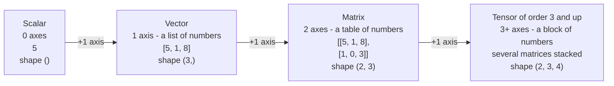
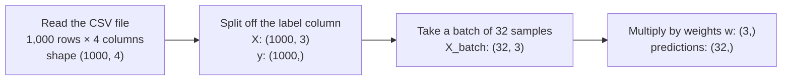

> **Learning objectives:** After this lesson, you will understand what a scalar, vector, matrix and tensor are, why data in ML is always packaged into "blocks of numbers" like these, and be able to carry out the basic operations (addition, scalar multiplication, matrix multiplication) by hand on paper and in NumPy.

## 1. Computers see the world as blocks of numbers

Today's temperature in Hanoi. One house in the mini house-price table. The whole table of 6 houses. A photo of a cat. In what way does a computer see these four things as *the same*?

In Lesson 03, you saw that for a machine to learn, everything must be described by **numbers (features)**. This lesson answers the next question: *what shape are those numbers arranged into for the computer to process?*

The answer is four "kinds of boxes for numbers" that you will meet again and again throughout this series: **scalar, vector, matrix, tensor**. They are not four separate concepts, but **one ladder** - each rung simply adds one more axis compared with the rung before. The four things in the opening question are exactly the four rungs of that ladder.

The good news: to read and understand most introductory ML material, you do not need an entire linear algebra course. You need a firm grip on this ladder, a few basic operations, and good intuition about "shape". That is exactly what today's lesson covers.

## 2. The four-rung ladder: scalar → vector → matrix → tensor



- **Scalar:** a single number. A temperature of 28°C, a price of 5 million VND - both are scalars.
- **Vector:** an **ordered list of numbers** - you can think of it as *an array of numbers with a fixed length*. The number of elements in a vector is called its **dimensionality** - the vector `[5, 1, 8]` is a 3-dimensional vector.
- **Matrix:** a **table of numbers** made of rows and columns. A matrix with 2 rows and 3 columns is called a 2×3 matrix.
- **Tensor:** the general name for "a box of numbers **with any number of axes**". A scalar is a tensor of order 0, a vector a tensor of order 1, a matrix a tensor of order 2; from 3 axes upward we usually just say tensor.

A surprising detail: the name **TensorFlow** (Google's deep learning library) and the `Tensor` class (the central data object of PyTorch) both come from here - both libraries work by letting tensors "flow" through computations.

> 💡 **A note on terminology:** the word "dimension" gets used for two different things: (1) the **number of axes** of a block of numbers, and (2) the **number of elements** of a vector. The book *Dive into Deep Learning* proposes keeping them apart: use **order** for the number of axes, and **dimensionality** for the number of elements of a vector. For example: a color image is a tensor of *order 3*; a vector describing a house with 3 numbers is a *3-dimensional* vector.

> ⚠️ **A small note:** in ML frameworks, the word "tensor" is used in the sense of "n-dimensional array"; a tensor in mathematics has a stricter definition - you need not worry about that at this stage.

## 3. Three ways to look at a vector

The same vector `[3, 2]`: a programmer sees an array with two elements, a geometer sees an arrow, an algebraist sees... a thing that "can be added and scaled". The vector is the main character of this whole lesson, so it is worth looking at it from all three angles (this presentation follows the spirit of the book *Mathematics for Machine Learning*).

**View 1 - an array of numbers (the computer's view).** A vector is a list of numbers: `[30, 1, 5]`. This is how a vector exists in the computer's memory, and the form you manipulate every day with NumPy.

**View 2 - an arrow (the geometric view).** The 2-dimensional vector `[3, 2]` is **an arrow** starting at the origin, going 3 units to the right and 2 units up. The arrow has a **direction** and a **length** - two properties that will become the center of Lesson 07:

```
      ↑
    2 ┤        ● (3, 2)
      │      ╱
      │    ╱      ← the vector [3, 2] is this arrow
      │  ╱
      └─────────┬──→
                3
```

With a 3-dimensional vector, the arrow lives in 3D space. From 4 dimensions upward it can no longer be drawn - but the intuition "an arrow with a direction and a length" still works, and ML people use it every day for vectors with hundreds of dimensions.

**View 3 - an algebraic object (the abstract view).** The book *Mathematics for Machine Learning* defines it this way: anything that **can be added together** and **multiplied by a number** with the result staying the same kind of thing - that thing is a vector. The surprise of this definition: polynomials and even **audio signals are vectors** - adding two audio clips gives an audio clip; amplifying an audio clip still gives audio. You need not use this view right away, but knowing it exists will spare you some bewilderment when you meet it again in more advanced material.

The three views - **a list of numbers, an arrow, an object that can be added and scaled** - are the same thing. Switching flexibly between them is precisely the mathematical "reading ability" of an ML practitioner.

## 4. Which rung of the ladder does ML data sit on?

Back to the mini house-price table from Lessons 02-03, putting each thing onto the ladder.

**One data sample = one vector.** House number 1, described by 3 features (area in m², number of bedrooms, km to the city center), becomes a 3-dimensional vector:

```
house 1  →  x = [30, 1, 5]
```

Likewise, each loan applicant can be described by a vector of income, years of employment, number of previous late payments...

**The whole data table = one matrix.** Stack the 6 houses on top of each other and we get the data matrix - exactly the convention you met in Lesson 03: **each row is a sample, each column is a feature**:

```
              area       bedrooms    km to center
house 1     ┌    30           1            5       ┐
house 2     │    45           2            3       │
house 3     │    60           2            7       │   ← matrix X, shape (6, 3)
house 4     │    80           3            2       │
house 5     │   100           3           10       │
house 6     └    55           2            4       ┘
```

A table of 1,000 houses × 3 features is a matrix of shape `(1000, 3)`. When ML material writes "the data matrix X", it is talking about exactly this table.

**A color image = a tensor of order 3.** A color image consists of three "sheets" of numbers stacked together: the red sheet (R), the green sheet (G), the blue sheet (B) - each sheet is a height × width matrix recording the color intensity at each pixel:

```
                ┌────────────┐
             ┌──┤  channel B │
          ┌──┤  │  (blue)    │
  color = │  │  ├────────────┘      shape = (200, 300, 3)
  image   │  │ channel G (green)    height × width × number of color channels
          │  ├──────────────┘
          │ channel R (red)
          └─────────────────┘
```

Remember Lesson 01 saying that a 200×200 color image is 120,000 numbers? Now you know exactly how those 120,000 numbers are arranged: a tensor of shape `(200, 200, 3)`.

And during training, the model usually processes **a batch** of many images at once: 32 color images of 200×300 form a tensor of **order 4**, shape `(32, 200, 300, 3)`. Each extra level of "grouping" adds one axis - and the ladder keeps extending.

| Data | Object | Example shape |
|---|---|---|
| The price of one house | scalar | `()` |
| One house (3 features) | vector | `(3,)` |
| The mini house-price table (6 houses) | matrix | `(6, 3)` |
| A table of 1,000 houses | matrix | `(1000, 3)` |
| One 200×300 color image | tensor of order 3 | `(200, 300, 3)` |
| A batch of 32 color images | tensor of order 4 | `(32, 200, 300, 3)` |

> 🔧 **Try it now (NumPy):** build the mini house table, then ask for its shape and count the numbers:
> ```python
> import numpy as np
> X = np.array([[30, 1, 5], [45, 2, 3], [60, 2, 7], [80, 3, 2], [100, 3, 10], [55, 2, 4]])
> X.shape, X[0], X[:, 0]                # shape / first row / first column
> np.zeros((32, 200, 300, 3)).size      # how many numbers does a batch of 32 images hold?
> ```
> *Answer:* `(6, 3)`, `[30, 1, 5]` (house 1), `[30, 45, 60, 80, 100, 55]` (the area column) - and one "small" batch of 32 images is already **5,760,000** numbers.

> ⚠️ **A small note:** the order of the axes is a convention of each library: many image libraries arrange (height, width, channels) as above, while PyTorch usually arranges (channels, height, width) - one more reason to always check the shape.

## 5. Basic operations: addition, scalar multiplication and matrix multiplication

### 5.1. Vector addition: add position by position

Two vectors **of the same dimensionality** are added by adding each pair of elements:

```
[2, 1] + [1, 3] = [3, 4]
```

Geometrically, that is "walk along the first arrow, then continue along the second". Matrix addition works the same way - add each cell of two tables of the same size.

### 5.2. Scalar multiplication: stretching the arrow

Multiplying a vector by a number = multiplying that number into **every element**:

```
3 × [2, 1] = [6, 3]
```

The arrow is stretched 3 times longer, **direction unchanged**. Multiplying by 0.5 shrinks it by half; multiplying by −1 flips its direction; multiplying by 0 sends every vector to the zero vector. The detail "direction unchanged" sounds small, but it is the key to cosine similarity in Lesson 07.

### 5.3. Matrix-vector multiplication: many "weighted sums" at once

The plumber from Lesson 01 has 3 jobs: 2, 3 and 4 hours. Computing each bill as `100 × hours + 50` is three calculations. Matrix multiplication lets you do **all three in a single computation** - it is the most important operation in this lesson.

First, the **mechanical rule**: take **each row** of the matrix, multiply it element by element with the vector, then add up:

```
┌ 1  2 ┐             ┌ 1×2 + 2×1 ┐   ┌ 4 ┐
│ 3  0 │ × [2, 1] =  │ 3×2 + 0×1 │ = │ 6 │
└ 0  1 ┘             └ 0×2 + 1×1 ┘   └ 1 ┘
 (3×2)     (2,)                       (3,)
```

Each element of the result is a **weighted sum**: "multiply each pair, then accumulate". This operation is surprisingly familiar: the formula `bill = 100 × hours + 50 × 1` is exactly the weighted sum of the vector `[hours, 1]` with weights `[100, 50]`. Multiplying the **data matrix** by the **weight vector** means: performing that prediction for **every row - every house, every customer - in one single computation**. That is why ML is "addicted" to matrix multiplication.

> 🔧 **Try it now (by hand, then check with NumPy):** `B = [[2, 0], [1, 1], [0, 3]]`, `v = [1, 2]`. Compute `B @ v` row by row.
> ```python
> B = np.array([[2, 0], [1, 1], [0, 3]])
> v = np.array([1, 2])
> B @ v
> ```
> *Answer:* `[2, 3, 6]` - row 1: 2×1 + 0×2 = 2; row 2: 1×1 + 1×2 = 3; row 3: 0×1 + 3×2 = 6.

There is also a second view, well worth knowing (from the book *Mathematics for Machine Learning*): the result above is also a **combination of the columns** of the matrix - take 2 parts of the first column plus 1 part of the second:

```
    ┌ 1 ┐       ┌ 2 ┐   ┌ 4 ┐
2 × │ 3 │ + 1 × │ 0 │ = │ 6 │   ← the same result as above
    └ 0 ┘       └ 1 ┘   └ 1 ┘
```

Both views give the same answer: **the row view** = many weighted sums; **the column view** = blending the columns in proportions given by the vector. (Check with the "Try it now" example: 1 × [2, 1, 0] + 2 × [0, 1, 3] = [2, 3, 6].) The second view also hints at a bigger intuition: multiplying by a matrix is **a transformation** - it takes a 2-dimensional vector and returns a 3-dimensional one. The video series *Essence of Linear Algebra* by 3Blue1Brown (see Further reading) illustrates this "matrix = a transformation of space" intuition with beautiful animations.

**Matrix-matrix** multiplication is just the natural extension: multiply the left matrix by each column of the right matrix, then put the resulting columns side by side.

<details>
<summary>More detail: matrix multiplication is not commutative, and "cell-by-cell multiplication" is a different operation</summary>

- The order of matrix multiplication **matters**: in general `A @ B` differs from `B @ A` (one side may even be computable while the other is not, because of mismatched shapes). The book *Mathematics for Machine Learning* (Section 2.2) has a concrete numerical example of this.
- Matrix multiplication is **not** "multiplying corresponding cells". Cell-by-cell multiplication has its own name - the **Hadamard product** - and in NumPy it is `A * B`, while true matrix multiplication is `A @ B`. Typing `*` instead of `@` is the classic beginner's mistake.

</details>

> ⚠️ **A small note:** in a neural network, the linear part of a fully connected layer is also based on this matrix multiplication - usually followed by adding a bias and passing through an activation function. When processing a whole batch, the computation becomes a matrix-matrix multiplication.

## 6. Shape - and why shape errors "haunt" beginners

The first red line you meet when writing ML code is most likely a shape error. **Shape** tells you the size of each axis: a matrix with 3 rows and 2 columns has shape `(3, 2)`; a batch of images has shape `(32, 200, 300, 3)`. This is the piece of information you will check most often when writing ML code, because operations only run when the shapes **match according to the rules**:

- **Addition / element-wise multiplication:** both sides must have the same shape (or "match" via NumPy's broadcasting mechanism - Lesson 02 touched on it).
- **Matrix multiplication:** the two **adjacent dimensions must be equal** - the number of columns on the left = the number of rows on the right:

```
(3 × 2) @ (2 × 5)  →  OK, result (3 × 5)      "2 meets 2 - match; the two outer ends give the result"
   └──┘    └──┘
(3 × 2) @ (3 × 2)  →  ERROR                    "2 meets 3 - mismatch"
```

Why are shape errors so common? Because in a real ML pipeline, data **keeps changing form** - it only takes one step producing an unexpected shape for the multiplication after it to throw an error right away. For example, with 1,000 houses:



Forget to split off the label column in step 2 and you get `(32, 4) @ (3,)` - 4 meets 3, mismatch - and NumPy reports:

```
matmul: Input operand 1 has a mismatch in its core dimension 0 ... (size 3 is different from 4)
```

(The older `np.dot` function says it more plainly: `shapes (32,4) and (3,) not aligned`.) Experienced people are not that much better than you at *avoiding* this error - they simply **check `.shape` earlier and more often**, and read a shape error message like a plain English sentence: "where are the adjacent dimensions mismatched?".

> 🔧 **Try it now (predict first, then run):** guess the resulting shape of each line before you hit run.
> ```python
> (np.ones((4, 3)) @ np.ones((3, 2))).shape
> (np.ones((4, 3)) @ np.ones((4, 3))).shape
> ```
> *Answer:* line 1 → `(4, 2)` (3 meets 3, match; the two outer ends are 4 and 2). Line 2 → **error** (3 meets 4, mismatch).

> 💡 **A habit worth its weight in gold:** before every `@`, ask yourself "what are the shapes on both sides, do the adjacent dimensions match, and what shape will the result have?". Being able to answer these three questions before hitting run means you have already headed off most shape errors.

## 7. Into code: NumPy in 10 lines

The whole lesson packed into the following NumPy snippet (runs right away in the Python environment from Lesson 02):

```python
import numpy as np

x = np.array([2, 1])              # vector, shape (2,)
y = np.array([1, 3])

x + y                             # array([3, 4])   - element-wise addition
3 * x                             # array([6, 3])   - scalar multiplication

A = np.array([[1, 2],
              [3, 0],
              [0, 1]])            # matrix, shape (3, 2)
A.shape                           # (3, 2)

A @ x                             # array([4, 6, 1]) - matrix-vector multiplication, same as the hand-worked example
A * A                             # CELL-BY-CELL multiplication (Hadamard) - don't confuse with @

image = np.zeros((200, 300, 3))     # a 200×300 color "image" of all zeros, tensor of order 3
image.shape                         # (200, 300, 3)
```

Try modifying it yourself: change `A @ x` to `A @ np.array([2, 1, 5])` and read the error message - NumPy will complain `size 3 is different from 2`: exactly the "adjacent dimensions" story you just learned in Section 6 (the 2 columns of `A` meet the 3 elements of the vector).

## Lesson summary

- **Scalar → vector → matrix → tensor** is a ladder of increasing numbers of axes: a number → a list of numbers → a table of numbers → a block of numbers. Tensor is the general name; "order" = number of axes, "dimensionality" = number of elements of a vector.
- In ML: **one sample = one vector**; **the data table = a matrix** with rows = samples, columns = features (the convention from Lesson 03); **a color image = a tensor of order 3** (height × width × 3 color channels); **a batch of images = a tensor of order 4**.
- A vector has **three equivalent views**: an array of numbers (computer), an arrow with a direction and a length (geometry), an object that can be added and scaled (algebra) - following the book *Mathematics for Machine Learning*.
- **Vector addition** = add position by position; **scalar multiplication** = stretch or shrink the length - multiplying by a positive number keeps the direction, by a negative number flips it, and by 0 gives the zero vector.
- **Matrix-vector multiplication** = many weighted sums at once (row view) = a combination of the columns (column view); this is the core computation in batch prediction and in the linear part of neural network layers.
- Matrix multiplication requires the **adjacent dimensions to match**: `(m×n) @ (n×k) → (m×k)`. Checking `.shape` early is an effective way to prevent errors; and `*` (cell-by-cell multiplication) differs from `@` (matrix multiplication).

## Self-check questions

1. Place the following data on the right rung of the ladder (scalar / vector / matrix / tensor of what order?) and guess the shape: (a) a 28×28 grayscale image; (b) a grade table of 40 students × 5 subjects; (c) a batch of 16 color images of 100×100; (d) today's temperature in Hanoi.
2. By hand: `[1, 4] + [2, −1] = ?` and `3 × [2, 0, 1] = ?`
3. Compute `A @ x` by hand with `A = [[1, 0], [2, 3]]` and `x = [2, 1]`. Then verify the answer using the column view: `2 × (column 1) + 1 × (column 2)`.
4. Matrix `A` has shape `(4, 3)`, vector `x` has shape `(3,)`. Is `A @ x` valid? If so, what is the result's shape? What about `x @ A`?
5. A data table of 500 customers, each with 6 features. What is the shape of the data matrix? What do its 10th row and 2nd column each mean (relate to Lesson 03)?
6. Why is multiplying **a data matrix** by **a weight vector** described as "predicting for every sample in a single computation"? Use the plumber's bill from Lesson 01 (100,000 VND/hour + a 50,000 VND call-out fee) with 3 jobs of 2, 3 and 4 hours to illustrate.

## Further reading

**Primary sources for this lesson:**

| Source | Which part to read |
|---|---|
| **The book *Dive into Deep Learning*** (online edition at d2l.ai) | Chapter 2 - *Preliminaries*: Section 2.1 *Data Manipulation* (tensors, shape, reshape) and Section 2.3 *Linear Algebra* (scalar → tensor, the operations, matrix multiplication) |
| **The book *Mathematics for Machine Learning*** | Chapter 2 - *Linear Algebra*: Sections 2.1-2.2 (what a vector is, matrices, matrix multiplication, Ax as a combination of the columns) |

**Additional free online sources:**

- [Essence of Linear Algebra - 3Blue1Brown](https://www.3blue1brown.com/topics/linear-algebra) - a video series visualizing linear algebra with animations; in particular [chapter 1: "Vectors, what even are they?"](https://www.youtube.com/watch?v=fNk_zzaMoSs) illustrates exactly the "three ways to look at a vector" of this lesson.
- [NumPy: the absolute basics for beginners](https://numpy.org/doc/stable/user/absolute_beginners.html) - NumPy's official documentation on arrays, shape and the operations.
- [Machine Learning cơ bản - Math section](https://machinelearningcoban.com/math/) - a Vietnamese-language linear algebra refresher page from the blog Machine Learning cơ bản.

> **Next lesson:** [Similarity, Distance & the Dot Product](../similarity-distance-the-dot-product/) - having turned everything into vectors, we now learn how to **measure** on them - how far apart two vectors are, how similar they are, and why the dot product is the central measurement of all of modern ML.
