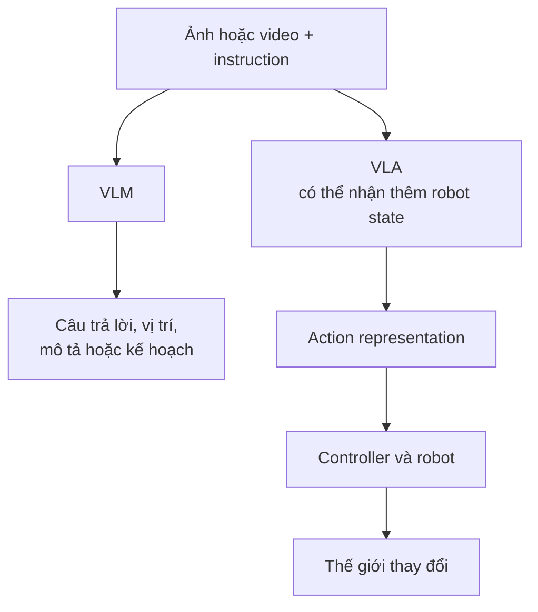
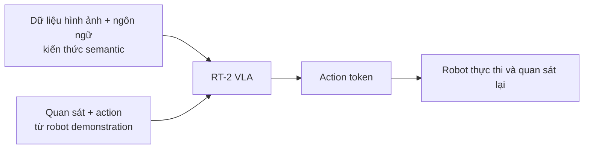
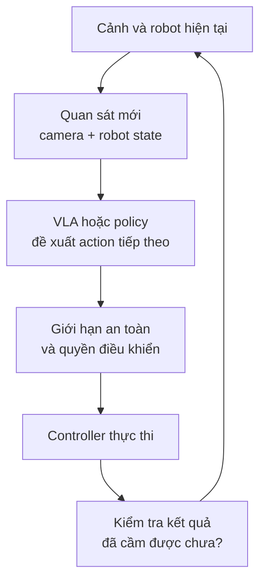
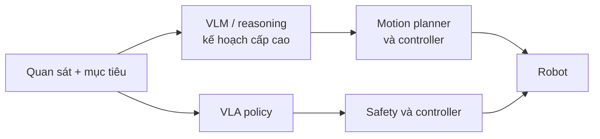

Một camera nhìn chiếc cốc đỏ sát mép bàn. Bạn hỏi: "Chiếc cốc nào có thể bị rơi?" AI trả lời: "Chiếc cốc đỏ ở bên phải, gần mép bàn." Hữu ích. Nhưng nếu đổi yêu cầu thành "Đặt chiếc cốc đó vào khay", câu trả lời hay chưa đủ nữa. Robot phải tiếp cận đúng vật, cầm nó, di chuyển, thả ra và kiểm tra xem đã thành công chưa.

[Bài trước](../computer-vision-from-seeing-to-acting-vi/) nhìn toàn cảnh bước chuyển từ perception sang hành động. Bài này zoom vào ranh giới ở giữa: **Vision-Language Model (VLM)** và **Vision-Language-Action Model (VLA)** khác nhau ở output nào, cần dữ liệu gì, và vì sao chữ "Action" làm bài toán khó hơn nhiều.

## 1. VLM biến hình ảnh thành thứ ta có thể hỏi bằng ngôn ngữ

Object detector có thể trả về `cup`, tọa độ và confidence. Segmentation model trả về vùng pixel. VLM nhận ảnh hoặc video **cùng một câu hỏi hay instruction**, rồi trả lời bằng ngôn ngữ hoặc một dạng thông tin có cấu trúc.

Với cùng một ảnh, ta có thể hỏi "Có gì trên bàn?", "Chiếc cốc nào gần mép?" hoặc "Cần kiểm tra điều gì?". Ngôn ngữ giúp dùng cùng visual input cho nhiều câu hỏi mà không nhất thiết xây một model phân loại riêng cho từng câu.

Nhưng cần thận trọng với chữ **"hiểu"**. VLM có thể mô tả sai vật thể hoặc quan hệ không gian. Một câu như "Chiếc cốc có nguy cơ rơi" là **nhận định dựa trên bằng chứng thị giác**, không phải phép đo chắc chắn về khoảng cách 3D, lực ma sát hay chuyển động tương lai. Nó có thể cần thêm camera, depth sensor hoặc xác nhận của người dùng.

Output của VLM chủ yếu là **thông tin để một hệ thống khác sử dụng**. Bản thân câu "Nên đưa cốc vào trong" không phải lệnh motor có thể thực thi an toàn.

## 2. VLA tạo action representation, không chỉ câu trả lời

Vision-Language-Action Model nhận quan sát thị giác và instruction, rồi tạo một **biểu diễn hành động** gắn với robot. Tùy model và robot, output có thể là action token, giá trị điều khiển số hoặc một chuỗi action cần controller thực thi.

[Google DeepMind mô tả Gemini Robotics](https://deepmind.google/blog/gemini-robotics-brings-ai-into-the-physical-world/) là VLA dùng vision và language để tạo motor control cho robot. Sự khác biệt không chỉ nằm ở tên gọi. Nếu VLM trả lời sai "cốc ở bên trái", người dùng nhận một thông tin sai. Nếu robot thực hiện một action sai theo vị trí đó, nó có thể va vào người hoặc đồ vật.

Vì vậy, ta nên nhớ **VLM thường giúp hệ thống quyết định *điều gì đang xảy ra hoặc nên làm*, còn VLA cố biến mục tiêu thành action cho một cơ thể robot**. Đây là phân biệt theo vai trò, không phải quy tắc mọi VLM chỉ được viết text hoặc mọi VLA tự làm trọn cả task.

## 3. RT-2: Kết hợp kiến thức web với dữ liệu robot

Một robot rất khó học mọi khái niệm chỉ từ số lần nó thao tác trực tiếp. VLM được pretrain trên dữ liệu hình ảnh-ngôn ngữ đã có kiến thức semantic: đồ vật trông ra sao, tên gọi gì và một số quan hệ giữa chúng. Nhưng knowledge đó **chưa** nói tay robot phải di chuyển thế nào.

[RT-2 của Google DeepMind](https://deepmind.google/blog/rt-2-new-model-translates-vision-and-language-into-action/) là ví dụ nổi bật. Nhóm nghiên cứu kết hợp pretraining vision-language với dữ liệu demonstration của robot, rồi biểu diễn robot action thành token để model có thể dự đoán chúng như một loại output.

Ví dụ nổi tiếng từ RT-2: nếu được yêu cầu lấy "thứ có thể dùng làm búa" trong một cảnh không có vật gắn nhãn *hammer*, model có thể chọn hòn đá. [DeepMind dùng ví dụ này](https://deepmind.google/blog/rt-2-new-model-translates-vision-and-language-into-action/) để minh họa kiến thức semantic có thể giúp chọn mục tiêu hành động mới. Nó **không chứng minh** robot luôn nắm được hòn đá, dùng lực đúng hoặc thao tác an toàn trong mọi môi trường. Chọn đúng *vật* và làm đúng *động tác* vẫn là hai bài test khác nhau.

## 4. Robot còn phải biết trạng thái của chính nó

Cùng một chiếc cốc và instruction "Cầm lên", action hợp lý sẽ khác nếu gripper đã ở ngay trên cốc so với khi cánh tay đang ở bên kia bàn. Robot cần biết không chỉ **mình thấy gì** và **người dùng muốn gì**, mà cả **cơ thể mình đang ở trạng thái nào**.

Thông tin về trạng thái bên trong cơ thể robot thường được gọi là **proprioception**: ví dụ vị trí khớp, tư thế end-effector hoặc trạng thái gripper. Không phải mọi VLA đều nhận đúng cùng tập input. Nhưng [model card Gemini Robotics On-Device 2](https://deepmind.google/models/model-cards/gemini-robotics-on-device-2/) ghi rõ model này nhận text, images và proprioception dạng số, rồi tạo robot actions dạng giá trị số. Tài liệu cũng nói dữ liệu train có ảnh, text, sensor và action của robot.

| Loại thông tin | Nó trả lời câu hỏi nào? |
| --- | --- |
| Camera và sensor ngoài | Vật ở đâu, scene đã thay đổi chưa? |
| Instruction | User muốn kết quả gì? |
| Proprioception | Robot hiện đang ở tư thế nào? |
| Action output | Robot cần thay đổi trạng thái ra sao? |

Đây là lý do VLA là một phần của **embodied AI**: action phải phù hợp với cả thế giới bên ngoài lẫn cơ thể robot đang thực hiện nó.

## 5. Một action đúng phải được kiểm tra sau khi thực hiện

Một cách điều khiển mong manh là nhìn một lần, sinh toàn bộ chuỗi action rồi chạy mù đến cuối. Nhưng cốc có thể trượt khỏi gripper, người có thể đi vào vùng thao tác, hoặc tray đã bị di chuyển. Hệ thống phải nhận quan sát mới và điều chỉnh.

[DeepMind mô tả RT-2](https://deepmind.google/blog/rt-2-new-model-translates-vision-and-language-into-action/) được dùng cho các task closed-loop, nơi quan sát mới tiếp tục ảnh hưởng tới action. Điều quan trọng là **action không kết thúc câu chuyện**: robot phải phát hiện thất bại, dừng khi cần và thử cách khác trong giới hạn an toàn.

Một chatbot trả lời sai có thể được sửa bằng câu trả lời mới. Với robot, sai lầm đã làm thế giới thay đổi. Đó là lý do safety không thể chỉ là một câu trong prompt; nó cần ràng buộc ở hệ thống điều khiển, theo dõi người và vật cản, cùng cách đưa robot về trạng thái an toàn. [DeepMind trình bày cách tiếp cận an toàn nhiều lớp](https://deepmind.google/models/gemini-robotics/responsibly-advancing-ai-and-robotics/) cho robotics, bên cạnh năng lực của model.

## 6. VLA không bắt buộc thay planner và controller truyền thống

Có ít nhất hai kiểu tổ chức hệ thống có thể hợp lý:

Sơ đồ này là **hai lựa chọn minh họa**, không phải khẳng định mọi hệ thống chỉ chọn đúng một nhánh. [Gemini Robotics ER 2](https://deepmind.google/models/gemini-robotics/embodied-reasoning/) là ví dụ một model reasoning cấp cao lập kế hoạch và giao phần motor execution cho VLA phía dưới. Một sản phẩm khác có thể dùng planner hình học, controller truyền thống hoặc policy chuyên biệt.

Nói "VLA tạo action" cũng không có nghĩa model được phép bỏ qua giới hạn chuyển động, collision check hoặc emergency stop. Foundation model và robotics engineering vẫn phải phối hợp.

## 7. VLM hay VLA: chọn theo công việc, không theo độ mới

| Công việc | Hướng thường đủ phù hợp |
| --- | --- |
| Mô tả ảnh, trả lời câu hỏi về video | VLM hoặc CV chuyên biệt |
| Xác định vật nào nên được kiểm tra | VLM + rule/human review |
| Robot nhặt vật trong scene thay đổi | VLA hoặc perception + planner + controller |
| Robot lặp thao tác cố định với tọa độ ổn định | Controller hoặc policy chuyên biệt có thể đơn giản hơn |

VLA không phải "VLM phiên bản tốt hơn". Nó giải một bài toán khác, cần dữ liệu robot, action space phù hợp với embodiment, controller và đánh giá trên outcome thật. [Model card On-Device 2](https://deepmind.google/models/model-cards/gemini-robotics-on-device-2/) cũng nêu giới hạn với task ngoài phân phối train và robot có nhiều bậc tự do. Vì vậy demo thành công không đồng nghĩa một VLA dùng được cho mọi robot và mọi tình huống.

Với task lặp lại, môi trường ít thay đổi và yêu cầu precision cao, hệ thống deterministic hoặc policy hẹp có thể dễ kiểm chứng hơn. VLA trở nên hấp dẫn khi instruction, vật thể và scene thay đổi nhiều, khiến việc viết tay mọi rule trở nên khó khăn.

## Khác biệt lớn nhất nằm ở kết quả phải chịu trách nhiệm

VLM giúp AI **nói về** thế giới nó nhìn thấy. VLA cố tạo action để robot **tác động lên** thế giới đó. Nhưng câu "Tôi biết nên cầm chiếc cốc" và sự kiện "Chiếc cốc đã nằm an toàn trong khay" vẫn cách nhau bởi perception, robot state, control, feedback và safety.

Vì vậy, khi đánh giá VLA, đừng chỉ hỏi "Model đề xuất action có hợp lý không?" Hãy hỏi **"Robot có hoàn thành task, không gây hại và nhận ra khi thất bại không?"** Đó là nơi multimodal AI thực sự chạm vào Physical AI.

## Nguồn tham khảo

- [RT-2: New model translates vision and language into action - Google DeepMind](https://deepmind.google/blog/rt-2-new-model-translates-vision-and-language-into-action/)
- [Gemini Robotics brings AI into the physical world - Google DeepMind](https://deepmind.google/blog/gemini-robotics-brings-ai-into-the-physical-world/)
- [Gemini Robotics On-Device 2 - Google DeepMind model card](https://deepmind.google/models/model-cards/gemini-robotics-on-device-2/)
- [Gemini Robotics ER 2 - Google DeepMind](https://deepmind.google/models/gemini-robotics/embodied-reasoning/)
- [Responsibly advancing AI and robotics - Google DeepMind](https://deepmind.google/models/gemini-robotics/responsibly-advancing-ai-and-robotics/)
