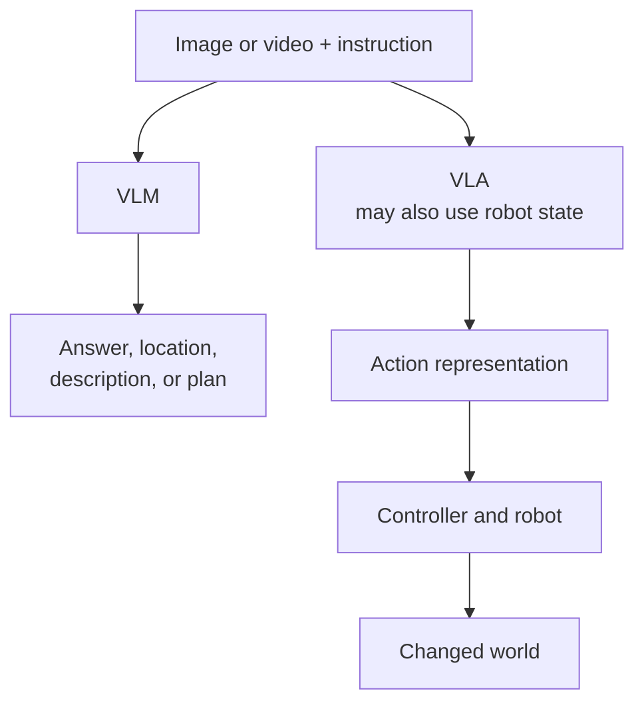
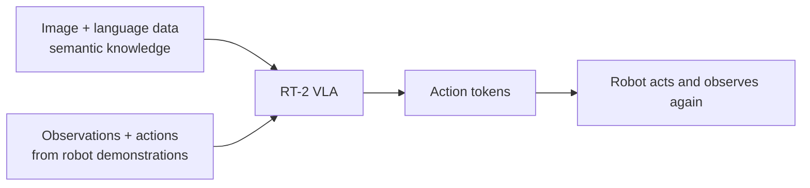
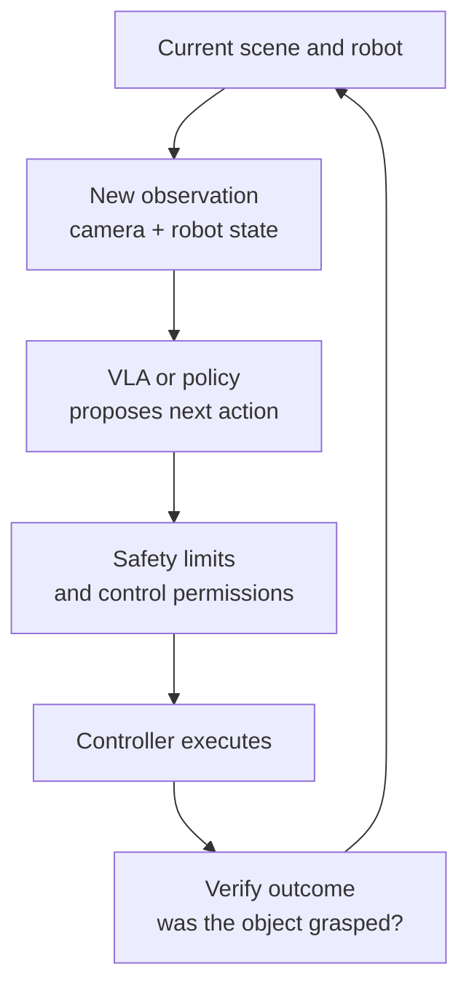
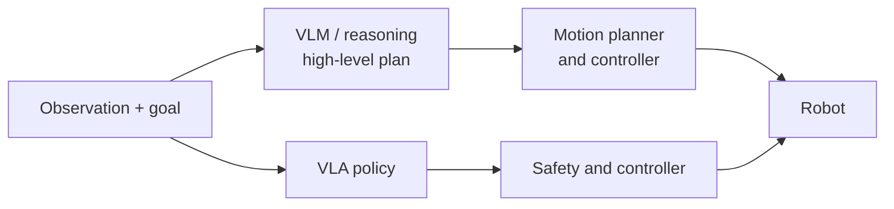

A camera sees a red cup near the table edge. You ask, "Which cup might fall?" The AI answers, "The red cup on the right, close to the edge." Useful. But change the request to "Put that cup in the tray," and a good answer is no longer enough. A robot has to approach the right object, grasp it, move it, release it, and check whether it succeeded.

The [previous article](../computer-vision-from-seeing-to-acting/) explored the broader shift from perception to action. This one zooms in on the boundary: **How do Vision-Language Models (VLMs) and Vision-Language-Action Models (VLAs) differ in their outputs, training data, and responsibilities?**

## 1. A VLM makes visual input accessible through language

An object detector can return `cup`, coordinates, and confidence. A segmentation model returns pixel regions. A VLM takes an image or video **together with a question or instruction** and returns a language answer or other structured information.

For the same image, we might ask "What is on the table?", "Which cup is near the edge?", or "What should someone inspect?" Language lets us use one visual input for many questions without necessarily training a separate classifier for each one.

We should be careful with the word **"understand,"** though. A VLM can misidentify objects or spatial relationships. "The cup might fall" is an **inference from visual evidence**, not a certain measurement of 3D distance, friction, or future motion. The system may need another camera, depth data, or human confirmation.

A VLM primarily provides **information another system can use**. The sentence "Move the cup inward" is not, by itself, a safe executable motor command.

## 2. A VLA produces an action representation, not just an answer

A Vision-Language-Action Model takes visual observations and an instruction and produces an **action representation** tied to a robot. Depending on the model and embodiment, that output might be action tokens, numerical control values, or a sequence that a controller must execute.

[Google DeepMind describes Gemini Robotics](https://deepmind.google/blog/gemini-robotics-brings-ai-into-the-physical-world/) as a VLA that uses vision and language to produce motor control for a robot. The distinction is more than a name. If a VLM incorrectly says "the cup is on the left," someone receives wrong information. If a robot takes a wrong action based on that position, it could collide with a person or an object.

In short, **a VLM often helps a system decide *what is happening or what ought to happen*, while a VLA tries to turn a goal into an action for a robot body**. This is a distinction between roles, not a rule that every VLM only writes text or every VLA handles an entire task by itself.

## 3. RT-2: Web knowledge meets robot data

It is difficult for a robot to learn every concept only from tasks it performs directly. A VLM pretrained on image-language data has semantic knowledge: what objects look like, what they are called, and some relationships between them. But that knowledge does **not yet** specify how a particular robot arm should move.

[Google DeepMind's RT-2](https://deepmind.google/blog/rt-2-new-model-translates-vision-and-language-into-action/) is an influential example. The researchers combined vision-language pretraining with robot demonstration data and represented robot actions as tokens that the model could predict as another kind of output.

One RT-2 example asks a robot to pick up "something that can be used as a hammer" in a scene without an object labeled *hammer*. It may choose a rock. [DeepMind uses the example](https://deepmind.google/blog/rt-2-new-model-translates-vision-and-language-into-action/) to show how semantic knowledge can help select a new action target. It does **not prove** the robot can always grasp that rock, apply appropriate force, or operate safely in every environment. Choosing the right *object* and executing the right *movement* remain different tests.

## 4. A robot also needs to know its own state

For the same cup and instruction "Pick it up," a sensible action differs when the gripper is already above the cup versus across the table. A robot needs to know not just **what it sees** and **what the user wants**, but also **where its body is now**.

Information about the robot's internal physical state is often called **proprioception**: for example, joint positions, end-effector pose, or gripper state. Not all VLAs use exactly the same inputs. But the [Gemini Robotics On-Device 2 model card](https://deepmind.google/models/model-cards/gemini-robotics-on-device-2/) explicitly lists text, images, and numerical proprioception as inputs, and numerical robot actions as outputs. It also describes training data that includes images, text, and robot sensor and action data.

| Information | Question it answers |
| --- | --- |
| Camera and external sensors | Where are objects, and has the scene changed? |
| Instruction | What result does the user want? |
| Proprioception | What pose is the robot in now? |
| Action output | How should the robot change its state? |

That is why a VLA belongs to **embodied AI**: its action must fit both the world outside and the robot body carrying it out.

## 5. An action must be checked after execution

A brittle controller looks once, generates a complete sequence, then runs it blindly. But the cup might slip from the gripper, a person might enter the workspace, or the tray might move. The system needs a fresh observation and a chance to adjust.

[DeepMind describes RT-2](https://deepmind.google/blog/rt-2-new-model-translates-vision-and-language-into-action/) in closed-loop tasks where new observations continue to affect actions. The essential point is that **an action is not the end of the story**: the robot must recognize failures, stop when needed, and recover within safe limits.

A chatbot can correct a wrong answer with another answer. A robot may already have changed the world. That is why safety cannot be only a sentence in a prompt; it also needs control-system constraints, tracking of people and obstacles, and a way to bring the robot to a safe state. [DeepMind outlines a layered safety approach](https://deepmind.google/models/gemini-robotics/responsibly-advancing-ai-and-robotics/) for robotics alongside model capability.

## 6. A VLA need not replace traditional planners and controllers

At least two broad system designs can be reasonable:

The diagram shows **illustrative options**, not a claim that every system must pick exactly one branch. [Gemini Robotics ER 2](https://deepmind.google/models/gemini-robotics/embodied-reasoning/) is an example of a high-level reasoning model that plans and hands motor execution to a lower-level VLA. Another product might use a geometric planner, traditional controller, or narrow policy.

"A VLA produces actions" does not mean it may ignore motion limits, collision checks, or emergency stops. Foundation models and robotics engineering still have to work together.

## 7. VLM or VLA: choose by the job, not by novelty

| Task | Often-suitable approach |
| --- | --- |
| Describe an image or answer questions about video | VLM or specialized CV |
| Identify an object a person should inspect | VLM + rules/human review |
| Pick objects as the scene changes | VLA or perception + planner + controller |
| Repeat a fixed manipulation at stable coordinates | A specialized policy or controller may be simpler |

A VLA is not a "better VLM." It solves a different problem, needing robot data, an action space matched to its embodiment, controllers, and evaluation on real outcomes. The [On-Device 2 model card](https://deepmind.google/models/model-cards/gemini-robotics-on-device-2/) also names limits on out-of-distribution tasks and high-degree-of-freedom robots. A successful demo does not mean one VLA works on every robot in every setting.

For repetitive tasks in stable environments with strict precision requirements, a deterministic system or narrow policy may be easier to validate. VLAs become especially interesting when instructions, objects, and scenes vary enough that hand-writing every rule becomes difficult.

## The biggest difference is what the output must be accountable for

A VLM helps AI **talk about** the world it sees. A VLA tries to produce actions that let a robot **affect** that world. But "I know I should pick up the cup" and "The cup is now safely in the tray" remain separated by perception, robot state, control, feedback, and safety.

So, when evaluating a VLA, do not only ask "Did the model propose a plausible action?" Ask **"Did the robot complete the task, avoid harm, and notice when it failed?"** That is where multimodal AI meets Physical AI.

## References

- [RT-2: New model translates vision and language into action - Google DeepMind](https://deepmind.google/blog/rt-2-new-model-translates-vision-and-language-into-action/)
- [Gemini Robotics brings AI into the physical world - Google DeepMind](https://deepmind.google/blog/gemini-robotics-brings-ai-into-the-physical-world/)
- [Gemini Robotics On-Device 2 - Google DeepMind model card](https://deepmind.google/models/model-cards/gemini-robotics-on-device-2/)
- [Gemini Robotics ER 2 - Google DeepMind](https://deepmind.google/models/gemini-robotics/embodied-reasoning/)
- [Responsibly advancing AI and robotics - Google DeepMind](https://deepmind.google/models/gemini-robotics/responsibly-advancing-ai-and-robotics/)
