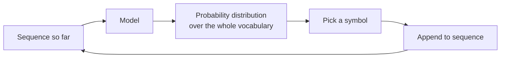

> **Learning objectives:** After this lesson, you will know that a language model is trained to do exactly **one** very small thing, understand why repeating that small thing is enough to produce text, and see with your own eyes a model going from random characters to Vietnamese sentences - using a transformer we train ourselves on the 51 lessons already written in this series.

## 1. A single task

Deep Learning · Lesson 10 stopped just before attention, after showing that recurrent networks cannot cope with long sequences. Computer Vision · Lesson 10 opened the part of attention devoted to images and left the language part aside. This chapter starts from there.

But before touching attention, we need to answer a more basic question: **what is a language model trained to do?**

The answer is so small it is almost disappointing: **guess the next symbol.**

(More precisely: this is the **causal autoregressive** family of models - the kind this whole chapter discusses, and the kind behind every assistant you use daily. Other families of language models are trained differently, for example by guessing tokens masked out in the middle of a sentence; they are outside the scope of this chapter.)

Given a sequence of symbols so far, the model returns a **probability distribution** over the whole vocabulary for the next symbol. That is all. There is no "understanding" module, no store of facts, no planning step. Everything that looks like understanding has to fall out of doing that guess well.

And generating text is simply **repeating that guess**: guess a symbol, append it to the sequence, guess again, append it, and so on.



This lesson demonstrates it by **building such a model ourselves from scratch** - not using anyone's ready-made model - and then looking at what it learns.

## 2. Characters instead of words

Real models split text into **tokens**, and the way they split is complicated enough to fill all of Lesson 02. So this lesson uses the simplest possible split: **each character is one symbol.**

It is not efficient - the model has to learn spelling too instead of being handed a vocabulary - but it lets us skip the tokenizer and look straight at the mechanism.

The data is the **51 lessons already written** in the four previous chapters: Foundations, Machine Learning, Deep Learning, Computer Vision.

| | |
|---|---|
| Corpus | **886,007 characters** |
| Vocabulary | **312 distinct characters** |
| Split | 90% train / 10% validation |
| Model | 4 layers, 6 heads, 192 dimensions, 128-character context |
| Parameters | **1,924,536** |

There is a reason for using the book itself as data: you know exactly what the model has read, so you can judge its output instead of guessing. The figure of 312 characters is also worth noting - Vietnamese has a great many combinations of diacritics, plus the mathematical symbols and emoji in the lessons.

## 3. The measure: how surprised the model still is

The loss of a language model is cross-entropy, which Machine Learning · Lesson 03 built. But here there is a more compact reading: divide by $\ln 2$ to get **bits per character**.

$$\text{bits/character} = \frac{\text{cross-entropy}}{\ln 2}$$

This number answers: *on average, how many bits are needed to encode the next character if the model's own prediction is used as the code table.* It has two very intuitive reference points:

- **Guessing uniformly over 312 characters** needs $\log_2 312 = 8.29$ bits
- **Knowing for certain** needs 0 bits

So bits per character directly measures how much **less surprised** the model is than a blind guess.

## 4. Four thousand steps, five snapshots

We train for 4,000 steps, stopping at a few checkpoints to measure and to let the model continue the text *"Mô hình "* ("The model "):

| Step | Loss | bits/character | Time |
|---|---|---|---|
| 0 | 5.8921 | **8.501** | 3 s |
| 100 | 3.9686 | 5.725 | 34 s |
| 500 | 2.6198 | 3.780 | 146 s |
| 1,500 | 1.6644 | 2.401 | 422 s |
| 4,000 | **1.5451** | **2.229** | 1,364 s |

And here is what the model writes at each checkpoint.

**Step 0** - random weights:

```
Mô hình ₙ(-ệỚöÀ¹┴╱Ự³(l─M╭ỗ-ỉ√ρỖBởểỂ⁻ẺƠö≠ậ'±₇λưq┐jMả&V⁰ỡŨỂ✅a?✗ₜ…ố✓🔧ε📄Ừ◎⁸ỢUy█
```

Note the figure of **8.501 bits/character** - *higher* than the uniform guess of 8.29. A randomly initialized model is worse than a blind guess, because it is confident in the wrong places. The output is rare symbols drawn evenly: emoji, math characters, box-drawing characters.

**Step 100** - it has learned frequencies:

```
Mô hình ch λ  t nỏỳth  | h n‖ Àệ   ₅h n tn Ỉớ 2 jơ2o  g  ti ö] bh x c    t nh noab M u
```

Spaces appear at the right density, and ordinary letters crowd out rare symbols. The model does not know any words yet, but it already knows **which characters are common**.

**Step 500** - it starts to look like Vietnamese:

```
Mô hình hì chim vớcầdo m n miết khôn thỉ ca tru chìn trêng cọn đá 1. g chông ta kkhìn
```

This is the most interesting checkpoint. "chim", "khôn", "chông ta", "trêng" - they **look like Vietnamese** even though most of them are not real words. The model has learned the *combination* rules of Vietnamese: which initial consonants go with which vowels, and where the diacritics sit.

**Step 1,500** - real words, broken grammar:

```
Mô hình tho hơn để cách cột điển thể bắt bệnh thợ lệ trường được khi nào, và mà tầng vào
```

Almost every word is a real Vietnamese word. But strung together they mean nothing.

**Step 4,000** - and this is where the surprise comes:

```
Mô hình học.

---

## Tóm tắt bài học

- PCA trên dữ liệu mới PCA thì hàm kích hoạt. Con số thêm cứ tham số nhất chương Machine Learning
```

The model has learned **the markdown structure of the book itself**: it knows that a paragraph is followed by a line break, a horizontal rule, then the heading `## Tóm tắt bài học` ("Lesson summary"), then a bulleted list. It also uses the right technical terms - PCA, hàm kích hoạt (activation function), tham số (parameters), "chương Machine Learning" (the Machine Learning chapter).

But **the content is still meaningless**. "PCA trên dữ liệu mới PCA thì hàm kích hoạt" (roughly "PCA on new data PCA then activation function") is a sentence with correct grammar, correct vocabulary, the right style, and completely wrong.

That is the main lesson of this section: **form is learned before content.** A model with 1.9 million parameters reading 886 thousand characters is enough to imitate the *look* of Vietnamese technical writing, but not enough to say correct things. Remember this feeling - Lesson 09 will meet it again in far larger models, under the name **hallucination**.

> ⚠️ **A small note:** do not read the table above as "train longer and it keeps getting better evenly". From step 1,500 to 4,000 - 2,500 more steps, three times the time - bought only 0.17 bits/character, while the first 500 steps bought 4.7 bits. The benefit curve flattens very quickly, exactly as everything in Deep Learning · Lesson 06 described. And this is **a single illustrative run** with one seed, so the specific numbers will differ in another run. The order of the stages matches what people commonly describe for character-level language models - see Karpathy's post in Further reading - but one run is not enough to call it a law.

## 5. Measuring quality with an answerable question

"Looks better" is not a measure. There is a cheap and objective question: **of the "words" the model writes, what fraction are real words in the corpus?**

We let the model at step 4,000 write a 1,200-character passage and split it into words:

| | |
|---|---|
| "Words" generated | 224 |
| Found in corpus | **221** |
| Rate | **98.66%** |

Almost every word is a real one. For a model working at the **character** level - it has to assemble every letter itself and is never given a word list - that is a notable result.

But this measure also shows its own limit: 98.66% real words, and the sentences are still meaningless. **Spelling is not meaning.** This is why evaluating a language model is much harder than evaluating the classification models of the four previous chapters - there, a correct label existed to compare against; here, it does not.

## 6. Looking straight at the distribution

Now we can lift the lid and see what section 1 called "a probability distribution over the vocabulary" actually looks like. We give the model three unfinished fragments and see how it bets on the next character:

| Sequence so far | Next character, top five candidates |
|---|---|
| `Mô hình tuyến tí` | **`n` 0.9989** · `c` 0.0007 · `␣` 0.0001 · `ợ` 0.0001 |
| `gradient desc` | **`e` 0.9790** · `o` 0.0077 · `r` 0.0032 · `l` 0.0024 |
| `Học sâu là m` | **`ộ` 0.4663** · `ô` 0.1453 · `ạ` 0.0490 · `a` 0.0456 · `ấ` 0.0358 |

These three rows say three different things, and all three matter.

**The first two rows are nearly certain.** After "tuyến tí", the candidate is almost certainly "tuyến tính" ("linear"); after "gradient desc" it is almost certainly "descent" - the table still leaves a very small share of probability to other characters. The model puts 99.89% and 97.90% on a single character. In places like these **there is almost nothing to choose**: taking the highest-scoring character or sampling at random from the distribution gives the same character on nearly every draw - at 0.9989, only about one draw in close to a thousand lands on another candidate on average. The difference between ways of generating text lies elsewhere.

**The third row is genuinely undecided.** After "Học sâu là m" ("Deep learning is m...") the continuation could be "một" ("a/one"), "mô hình" ("model"), "mạnh" ("powerful"), "màn"… and the model spreads its probability: 0.4663 for `ộ`, 0.1453 for `ô`, then a long tail. This is where the way characters are chosen decides where the text goes.

And that is exactly where Lesson 05 begins: when the distribution is as blurry as in the third row, **taking the most probable character** and **sampling at random from the distribution** produce two very different kinds of text.

> 🔧 **Try it now:** the model puts 0.9989 on the character `n` after "tuyến tí". Does that number mean the model *understands* the phrase "tuyến tính" ("linear")?
> No. That number is **the model's belief**, not a frequency counted in the corpus - the two only roughly coincide where the model has learned well. What it reflects is this: from 886 thousand characters of corpus, the model has extracted a very strong statistical regularity - after "tuyến tí" it is almost always `n` - and put nearly all of its probability mass on that very character. That regularity is enough to guess correctly - but it does not imply the model knows what "tuyến tính" means. The evidence is right in section 4: the same model wrote the sentence "PCA trên dữ liệu mới PCA thì hàm kích hoạt" - every word spelled correctly, the right style, completely meaningless. Telling *guessing the next character correctly* apart from *understanding* is a theme that returns throughout this chapter, and most heavily in Lesson 09.

## Lesson summary

- A **causal autoregressive** language model - the kind this whole chapter discusses - is trained to do exactly **one** thing: return a **probability distribution** for the next symbol. Generating text is repeating that.
- This lesson builds a transformer with **1,924,536 parameters** from scratch, trained on **886,007 characters** of the 51 lessons already written, with a vocabulary of **312 characters**.
- **bits/character** = cross-entropy divided by $\ln 2$, measuring how much less surprised the model is: a uniform guess over 312 characters needs **8.29 bits**, the model reaches **2.229**.
- At random initialization, the model scores **8.501 bits/character** - *worse* than a uniform guess, because it is confident in the wrong places.
- Four very clear learning stages **in this run**: character frequencies (step 100) → Vietnamese combination rules (500) → real words (1,500) → **the markdown structure of the book itself** (4,000).
- **Form is learned before content**: at step 4,000 the model writes the heading `## Tóm tắt bài học` correctly and uses the right technical terms, but the sentences are still meaningless.
- **98.66%** of the generated "words" are real words in the corpus - but spelling is not meaning.
- The next-token distribution is **sharp or blurry depending on context**: 0.9989 after "tuyến tí", but only 0.4663 after "Học sâu là m". The blurry places are where the way text is generated makes a difference.
- The benefit falls off very quickly with the number of steps: the first 500 steps bought 4.7 bits, the last 2,500 steps only 0.17 bits more.

## Self-check questions

1. What is a language model trained to do? State precisely the input and output of a single call to the model.
2. Why does the randomly initialized model score 8.501 bits/character, higher than the uniform guess of 8.29?
3. The vocabulary has 312 characters. If the vocabulary had 1,000 characters, how many bits would the "uniform guess" reference point be?
4. At step 500 the model writes "chông ta", "trêng" - not real words, but very Vietnamese-looking. What had it learned at that stage?
5. At step 4,000 the model writes correct markdown structure but meaningless content. Explain why form is learned first.
6. 98.66% of the generated words are real words. Why does that high number still not show that the model writes meaningfully?
7. The distribution after "tuyến tí" is 0.9989, while after "Học sâu là m" it is only 0.4663. How does that affect the choice of text generation method?
8. The model puts 0.9989 on one character. Give two different explanations for that number, and state which evidence in the lesson tells them apart.

## Further reading

**Foundational sources for this lesson:**

| Source | Which part to read |
|---|---|
| **Deep Learning · Lesson 10** | Sequence data, RNNs and where they run out of breath - this lesson follows right after it |
| **Deep Learning · Lesson 06** | Reading training curves; diminishing returns with the number of steps |
| **Machine Learning · Lesson 03** | Cross-entropy - the measure converted into bits in section 3 |
| **Dive into Deep Learning (d2l.ai)** | Chapter 9.3 *Language Models* - the formal definition and how to measure perplexity |

**Additional online sources (free):**

- [Karpathy - The Unreasonable Effectiveness of Recurrent Neural Networks](https://karpathy.github.io/2015/05/21/rnn-effectiveness/) - the classic post on character-level language models, with exactly the kind of learning progression in section 4.
- [Karpathy - Let's build GPT: from scratch, in code, spelled out](https://www.youtube.com/watch?v=kCc8FmEb1nY) - rebuilds a model like the one in this lesson, line by line.
- [Shannon - Prediction and Entropy of Printed English (1951)](https://www.princeton.edu/~wbialek/rome/refs/shannon_51.pdf) - the origin of measuring bits per character, with an estimate for English.
- [nanoGPT](https://github.com/karpathy/nanoGPT) - a compact implementation of the same idea that runs on a personal machine.

> **Next lesson:** [Tokenizers and the Cost of Vietnamese](../tokenizers-and-the-cost-of-vietnamese/) - this lesson deliberately used the simplest split - one symbol per character - to look straight at the mechanism. Real models do not do that, and the way they split text has a very concrete consequence for Vietnamese users: for the same content, Vietnamese costs more tokens than English. The next lesson measures how many more, and why.
