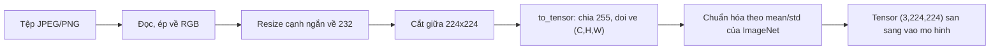

> **Mục tiêu bài học:** Sau bài này, bạn sẽ biết một tấm ảnh biến thành tensor như thế nào trước khi vào mô hình, đọc được bốn con số quyết định (hình dạng, kiểu dữ liệu, thang giá trị, thứ tự kênh màu), và thấy bằng số liệu rằng vài lỗi tiền xử lý - thứ mắt người không nhìn ra - có thể làm mô hình tụt từ gần như hoàn hảo xuống mức đoán bừa mà không báo lỗi một dòng nào.

## 1. Chương này bắt đầu từ đâu

Chương Deep Learning đã dạy mạng tích chập ở bài 09, nhưng dạy trên FashionMNIST: ảnh xám, 28×28, đã chuẩn hóa sẵn, nằm gọn trong một dòng `datasets.FashionMNIST(...)`. Mọi thứ khó chịu của dữ liệu ảnh thật đã được ai đó dọn dẹp từ trước.

Chương này gỡ lớp dọn dẹp ấy ra. Ảnh thật có ba kênh màu chứ không phải một, kích thước mỗi tấm một khác, nằm trong tệp JPEG hoặc PNG với đủ kiểu nén và xoay, và trước khi vào mô hình phải đi qua một chuỗi biến đổi mà **mỗi bước đều có chỗ để sai**.

Điều đáng nói: **những lỗi nguy hiểm nhất lại là những lỗi không ném ra exception.** Có lỗi làm chương trình chết ngay - đưa nhầm số kênh hay sai hình dạng thì PyTorch báo lỗi lập tức, và đó là loại lỗi dễ chịu vì nó tự lộ ra. Loại còn lại thì chương trình chạy trơn, mô hình trả về dự đoán trông bình thường, chỉ có chất lượng là âm thầm hỏng. Bài này đi tìm đúng loại thứ hai. Bài này dựng chuỗi biến đổi đó ra cho rõ, rồi cố tình phá từng bước một để đo xem mỗi lỗi đắt bao nhiêu.

## 2. Bốn con số quyết định

Với mô hình, một tấm ảnh là một **tensor**. Bốn thuộc tính của tensor ấy quyết định nó có dùng được hay không:

```python
from PIL import Image
from torchvision.transforms import functional as TF

img = Image.open("anh.jpg").convert("RGB")   # PIL Image, kích thước tùy tệp
x = TF.to_tensor(img)                        # tensor float32

print(x.shape)   # torch.Size([3, H, W]) - kênh ĐỨNG TRƯỚC
print(x.dtype)   # torch.float32
print(x.min(), x.max())                      # 0.0 và 1.0
```

**Hình dạng `(C, H, W)`.** PyTorch để kênh màu ở *trước*: 3 kênh, cao H, rộng W. Thư viện ảnh thì thường ngược lại - OpenCV trả về mảng `(H, W, C)`. Đưa nhầm thứ tự vào mô hình thì hoặc lỗi hình dạng, hoặc tệ hơn, chạy được nhưng vô nghĩa.

**Kiểu dữ liệu.** Tệp ảnh chứa số nguyên 0-255 mỗi kênh. Mô hình cần số thực. `to_tensor` làm cả hai việc: đổi kiểu và **chia cho 255**.

**Thang giá trị.** Sau `to_tensor` là [0, 1]. Sau chuẩn hóa thì không còn nữa - nó thành một dải quanh 0, thường từ khoảng −2,1 đến +2,6 với thống kê ImageNet.

**Thứ tự kênh.** `RGB` hay `BGR`. PIL và torchvision dùng RGB; OpenCV đọc tệp ra BGR. Đây là cái bẫy kinh điển nhất, vì hai thứ tự cho ra tensor *hợp lệ như nhau* - không có gì để báo lỗi.

Chuỗi đầy đủ mà một mô hình phân loại ảnh chờ đợi:



Không cần chép tay chuỗi này. Mỗi bộ trọng số của torchvision mang sẵn phép tiền xử lý của chính nó, đúng như chương Deep Learning · Bài 11 đã dùng:

```python
from torchvision.models import resnet50, ResNet50_Weights

weights = ResNet50_Weights.IMAGENET1K_V2
prep  = weights.transforms()     # đúng resize, đúng crop, đúng mean/std
model = resnet50(weights=weights).eval()
```

Phần còn lại của bài trả lời một câu hỏi: nếu bạn *không* dùng `weights.transforms()` mà tự dựng lại và sai một bước, thì đắt bao nhiêu?

## 3. Một tấm ảnh, năm cách đưa vào

Lấy đúng một tấm: `ILSVRC2012_val_00009111.JPEG`, 426×320, nhãn thật là **tench** (một loài cá nước ngọt). Đưa nó qua ResNet-50 năm lần, mỗi lần hỏng một bước khác nhau.

| Cách đưa vào | Thang giá trị tensor | Ba dự đoán cao nhất |
|---|---|---|
| **Đúng quy trình** | −2,12 … 2,64 | **tench 0,672** · barracouta 0,007 · reel 0,004 |
| Quên chuẩn hóa | 0,00 … 1,00 | **tench 0,735** · reel 0,007 · barracouta 0,006 |
| Để thang 0-255 | −2,12 … **1136,36** | **wall clock 1,000** · goldfish 0,000 · tench 0,000 |
| Đảo RGB thành BGR | −2,12 … 2,64 | **barracouta 0,248** · gar 0,120 · coho 0,084 |
| Resize bóp méo 224×224 | −2,10 … 2,64 | **tench 0,632** · reel 0,006 · barracouta 0,004 |

Bốn điều đọc ra từ bảng này, và không cái nào hiển nhiên.

**Dòng thứ ba là dòng đáng sợ nhất.** Để nguyên thang 0-255 rồi vẫn trừ mean chia std của ImageNet cho ra tensor có giá trị lên tới 1136 - cách xa mọi thứ mô hình từng thấy lúc train. Nó đoán **"đồng hồ treo tường"**, và đoán với xác suất **1,000**. Không phải 0,6 hay 0,8 mà tròn 1,000. Đây là bài học đầu tiên của chương, và nó sẽ quay lại ở bài 12 khi OCR đọc "đồng" thành "đổng" với confidence 0,982: **độ tự tin của mô hình không phải xác suất nó đúng.** Mô hình chỉ biết trả lời câu hỏi bạn đưa; nó không có cách nào biết đầu vào đã hỏng.

**Dòng thứ tư nguy hiểm theo kiểu khác.** Đảo RGB thành BGR cho ra tensor có thang giá trị **giống hệt** dòng đúng - cũng −2,12 đến 2,64. Nhìn vào thống kê tensor thì không tài nào phát hiện. Chỉ có kết quả là sai: mô hình vẫn nhận ra "đây là một con cá" (barracouta, gar, coho đều là cá) nhưng không còn nhận ra *cá gì*, vì màu đã bị hoán đổi. Hình dạng còn nguyên, màu thì không.

**Dòng thứ hai đi ngược trực giác.** Quên chuẩn hóa mà mô hình vẫn đoán đúng, thậm chí *tự tin hơn* dòng đúng quy trình - 0,735 so với 0,672. Đừng vội kết luận gì từ một tấm ảnh; mục 4 sẽ đo trên gần bốn nghìn tấm.

**Dòng cuối gần như không hại gì.** Bóp ảnh 426×320 thành vuông 224×224 làm biến dạng tỉ lệ, nhưng con cá vẫn là con cá.

> 🔧 **Thử ngay:** trong năm dòng trên, dòng nào bạn có thể phát hiện *chỉ bằng cách in `x.min()` và `x.max()`* trước khi gọi mô hình?
> Chỉ dòng thứ ba. Thang 0-255 đẩy giá trị lên 1136, lệch hẳn khỏi khoảng quen thuộc −2,1 … 2,6, nên một dòng `print(x.min(), x.max())` là bắt được. Quên chuẩn hóa cho ra [0, 1] - cũng nhận ra được nếu bạn biết mình đang chờ dải nào. Còn đảo RGB/BGR và bóp méo tỉ lệ thì thống kê tensor **không hé lộ gì cả**: muốn bắt chúng phải nhìn chính tấm ảnh, hoặc so kết quả với một tập có nhãn.

## 4. Một tấm ảnh không đủ để kết luận

Một ảnh chỉ cho biết đúng hay sai - nó không nói cho bạn *đắt bao nhiêu*. Nên đo lại cả năm cách trên **3.925 ảnh** của tập validation Imagenette, với cùng ResNet-50.

| Cách đưa vào | Thang giá trị tensor | Top-1 | So với đúng |
|---|---|---|---|
| **Đúng quy trình** | −2,12 … 2,64 | **0,8718** | - |
| Resize bóp méo 224×224 | −2,10 … 2,64 | 0,8757 | +0,4 |
| Quên chuẩn hóa | 0,00 … 1,00 | 0,8627 | −0,9 |
| Đảo RGB thành BGR | −2,12 … 2,64 | 0,8201 | **−5,2** |
| Để thang 0-255 | −2,12 … 1136,36 | **0,0000** | **−87,2** |

Bảng này xếp theo mức thiệt hại, và khoảng cách giữa các dòng mới là thứ đáng nhớ.

**Không phải sai sót nào cũng đắt như nhau.** Ba nhóm rất khác biệt: một nhóm gần như miễn phí, một nhóm mất vài điểm, và một nhóm xóa sổ mô hình. Người mới thường lo lắng đều tay cho cả năm; số liệu nói nên lo có trọng số.

**0,0000 chứ không phải "kém đi".** Không một ảnh nào trong 3.925 ảnh được đoán đúng. Đoán bừa trên 1.000 lớp còn cho khoảng 0,1%. Mô hình không "tệ đi" - nó bị đưa vào một vùng số hoàn toàn xa lạ và trả về rác một cách nhất quán.

**Đảo kênh màu mất 5,2 điểm - và đây là lỗi khó bắt nhất.** Nó không làm chương trình chậm đi, không đổi thang giá trị, không báo lỗi. Nếu bạn đọc ảnh bằng OpenCV (`cv2.imread` trả BGR) rồi quên `cv2.cvtColor`, mô hình của bạn cứ âm thầm kém đi 5 điểm mãi mãi.

> ⚠️ **Lưu ý nhỏ:** đừng đọc dòng "resize bóp méo" thành *"bóp méo tốt hơn"*. Chênh lệch 0,4 điểm là **quá nhỏ để đọc thành gì**: với 3.925 ảnh, riêng sai số lấy mẫu của một con số accuracy quanh 0,87 đã vào khoảng nửa điểm. (Nói cho chặt thì con số ấy chưa phải sai số của *hiệu* hai kết quả - năm biến thể được chấm trên cùng những tấm ảnh nên chúng tương quan với nhau, và một phép so đúng cách phải tính theo từng ảnh. Ở đây chỉ cần biết 0,4 điểm nằm dưới ngưỡng đọc được là đủ.) Có một lý do hợp lý để nó không tệ đi: cắt giữa 224×224 *vứt bỏ* phần rìa ảnh, còn bóp méo thì giữ lại toàn bộ khung hình. Hai cái đánh đổi khác nhau và hòa nhau ở bộ này. Chênh lệch 5,2 điểm của dòng RGB/BGR thì lớn hơn hẳn, nên đó mới là con số đáng đọc.

## 5. Cùng một mô hình, hai con số rất khác nhau

Có một chi tiết trong bảng trên đáng dừng lại. Dòng "đúng quy trình" được **0,8718**. Nhưng Imagenette chỉ có **10 lớp** - nếu đoán bừa đã được 0,1, thì một mô hình tốt lẽ ra phải gần 1,0 chứ?

Hóa ra vấn đề nằm ở *câu hỏi ta đang hỏi*. ResNet-50 này được huấn luyện trên ImageNet với **1.000 lớp**, và `argmax` của nó chọn trong cả 1.000. Đo lại đúng những dự đoán ấy nhưng chỉ cho phép chọn trong 10 lớp của Imagenette:

| Cách chấm | Top-1 |
|---|---|
| `argmax` trên cả 1.000 lớp | 0,8718 |
| `argmax` giới hạn trong 10 lớp Imagenette | **0,9985** |

Cùng một mô hình, cùng những tấm ảnh, cùng những logit - chênh nhau **12,7 điểm**, chỉ vì đổi cách chấm.

Nhìn vào những ca sai thì rõ ngay mô hình sai kiểu gì:

| Nhãn thật | Bị đoán thành | Số lần |
|---|---|---|
| cassette player | tape player | **92** |
| church | bell cote | 58 |
| church | monastery | 49 |
| church | vault | 23 |
| cassette player | cassette | 22 |
| cassette player | CD player | 20 |

Không có ca nào là "cá thành đồng hồ". Mô hình đoán *máy chạy băng* thay vì *máy cassette*, đoán *tu viện* hay *tháp chuông* thay vì *nhà thờ* - những lớp ImageNet nằm sát nhau tới mức nhiều người cũng gọi nhầm. Nó đã nhìn đúng thứ trong ảnh; chỉ là ImageNet có sẵn vài cái tên hàng xóm và nó chọn cái bên cạnh.

Chuyện này dẫn tới một quy ước mà **cả chương sẽ dùng**. Computer Vision có rất nhiều mô hình dựng sẵn kèm số liệu công bố, và ba loại con số dưới đây rất dễ bị trộn lẫn:

| Loại | Nghĩa | Ví dụ trong bài này |
|---|---|---|
| **Đo trên máy này** | Tôi chạy, trên phần cứng và dữ liệu ghi rõ trong bài | 0,8718 trên 3.925 ảnh Imagenette |
| **Số công bố** | Do torchvision hoặc bài báo công bố, trên tập chuẩn của họ | ResNet-50 (`IMAGENET1K_V2`): **80,858%** top-1 trên tập validation ImageNet 1.000 lớp |
| **Ví dụ minh họa** | Con số dựng ra để giải thích một khái niệm | các ví dụ IoU tính tay ở bài 07 |

Ba loại này **không so được với nhau**. Cụ thể: 0,8718 và 80,858% trông gần nhau đến mức dễ tưởng là một, nhưng chúng đo trên hai bộ dữ liệu khác nhau, hai độ khó khác nhau. Từ bài này trở đi, mỗi bảng số đều nói rõ nó thuộc loại nào.

> ⚠️ **Lưu ý nhỏ:** đây không phải chuyện hình thức. Cách nhanh nhất để một báo cáo mất uy tín là ghép con số mình tự đo cạnh con số của bài báo rồi kết luận "mô hình của tôi hơn". Muốn so thì phải cùng tập dữ liệu, cùng cách chấm, cùng phép tiền xử lý - mà bốn mục vừa rồi cho thấy chỉ riêng phép tiền xử lý đã đủ dịch chuyển kết quả **87 điểm**.

## 6. Rút ra được gì cho việc thật

Ba việc, xếp theo mức đáng làm.

**Dùng phép tiền xử lý đi kèm mô hình.** `weights.transforms()` loại bỏ hẳn ba trong năm lỗi ở mục 4. Chỉ tự dựng khi thật sự phải làm - và khi ấy, chép mean/std từ chính bộ trọng số chứ đừng gõ tay.

**In thang giá trị của tensor đầu tiên.** Một dòng `print(x.shape, x.dtype, x.min(), x.max())` trước lần gọi mô hình đầu tiên bắt được lỗi đắt nhất trong bảng. Rẻ đến mức không có lý do gì để bỏ.

**Kiểm bằng ảnh có nhãn, đừng kiểm bằng mắt.** Hai lỗi còn lại - đảo kênh màu và bóp méo tỉ lệ - không lộ ra ở thống kê tensor, và mắt người nhìn ảnh BGR vẫn thấy "một con cá bình thường, hơi lạ màu". Chỉ một tập nhỏ có nhãn mới nói được cái giá thật.

> 🔧 **Thử ngay:** đồng nghiệp báo mô hình chạy tốt trên máy họ nhưng kém hẳn khi đưa vào hệ thống. Hệ thống đọc ảnh bằng OpenCV. Bạn kiểm gì đầu tiên?
> Thứ tự kênh màu. `cv2.imread` trả về **BGR** còn mô hình torchvision chờ **RGB** - đúng dòng mất 5,2 điểm ở mục 4, và là lỗi không để lại dấu vết nào trong thống kê tensor. Cách kiểm nhanh: chạy cùng một ảnh qua cả hai đường đọc rồi so vector dự đoán; nếu chúng khác nhau thì có một đường đang sai. Sau đó mới tới thang giá trị (`cv2` trả mảng `uint8` 0-255, cần chia 255) và thứ tự chiều (`(H, W, C)` chứ không phải `(C, H, W)`).

## Tóm tắt bài học

- Với mô hình, ảnh là một tensor `(C, H, W)` kiểu `float32`. Bốn thứ quyết định nó dùng được hay không: hình dạng, kiểu dữ liệu, thang giá trị, và thứ tự kênh màu.
- Lỗi tiền xử lý nguy hiểm nhất là loại **không** ném ra exception: chương trình chạy trơn, mô hình vẫn trả lời, chỉ có chất lượng âm thầm hỏng. (Có lỗi vẫn làm chương trình chết ngay - sai số kênh, sai hình dạng - và đó là loại dễ chịu hơn nhiều.)
- Không phải lỗi nào cũng đắt như nhau: để nguyên thang 0-255 làm top-1 tụt từ 0,8718 xuống **0,0000**; đảo RGB thành BGR mất 5,2 điểm; quên chuẩn hóa mất 0,9 điểm; bóp méo tỉ lệ nằm trong nhiễu.
- Một tensor thang 0-255 khiến mô hình đoán "wall clock" cho ảnh con cá với xác suất **1,000**. Độ tự tin của mô hình không phải xác suất nó đúng - chuyện này còn quay lại ở bài 12.
- Lỗi đảo kênh màu **không lộ ra ở thống kê tensor**: thang giá trị giống hệt bản đúng. Mô hình vẫn biết "đây là cá" nhưng không còn biết cá gì - hình dạng còn nguyên, màu thì không.
- `weights.transforms()` loại bỏ ba trong năm lỗi ấy, vì phép tiền xử lý thuộc về mô hình và phải đi kèm mô hình.
- Cùng những dự đoán ấy, chấm trên 1.000 lớp được 0,8718 còn chấm trong 10 lớp được 0,9985. Một con số accuracy không có nghĩa gì nếu không kèm câu hỏi mà nó trả lời.
- Cả chương phân biệt ba loại con số: **đo trên máy này**, **số công bố**, và **ví dụ minh họa**. Chúng không so được với nhau.

## Câu hỏi tự kiểm tra

1. Nêu bốn thuộc tính của tensor ảnh quyết định nó có dùng được với một mô hình pretrained hay không, và cái nào trong bốn cái ấy không thể phát hiện bằng `print(x.min(), x.max())`.
2. Vì sao để nguyên thang 0-255 lại cho top-1 bằng đúng 0,0000, thấp hơn cả mức đoán bừa trên 1.000 lớp?
3. Mô hình đoán "wall clock" với xác suất 1,000 cho một tấm ảnh con cá. Con số 1,000 ấy nói lên điều gì và không nói lên điều gì?
4. Đảo RGB thành BGR làm mất 5,2 điểm nhưng mô hình vẫn đoán ra các loài cá khác. Giải thích vì sao, dựa vào thứ mà phép đảo kênh phá hỏng và thứ nó giữ nguyên.
5. Bóp méo tỉ lệ cho 0,8757 còn quy trình đúng cho 0,8718. Vì sao không được kết luận bóp méo tốt hơn?
6. Cùng một mô hình, cùng những tấm ảnh: 0,8718 và 0,9985. Điều gì đã đổi, và bài học rút ra khi đọc bất kỳ con số accuracy nào?
7. Bạn đọc một bài blog nói mô hình của họ đạt 0,92 trên "bộ dữ liệu chó mèo". Liệt kê ba câu hỏi phải trả lời trước khi so con số ấy với 0,8718 của bài này.

## Đọc thêm

**Nguồn nền tảng của bài:**

| Nguồn | Đọc phần nào |
|---|---|
| **Chương Deep Learning · Bài 09** | Mạng tích chập trên FashionMNIST - chỗ ảnh còn được dọn sẵn, để thấy bài này gỡ ra những gì |
| **Chương Deep Learning · Bài 11** | `weights.transforms()` và nguyên tắc phép tiền xử lý thuộc về mô hình |
| **Chương Machine Learning · Bài 11** | "Fit trên train, transform cho phần còn lại" - cùng một nguyên tắc, ở dạng ảnh |
| **Dive into Deep Learning (d2l.ai)** | Chương 14.1 *Image Augmentation* - phần mở đầu về các phép biến đổi ảnh và thứ tự áp dụng |

**Nguồn online bổ sung (miễn phí):**

- [Transforming and augmenting images - tài liệu torchvision](https://pytorch.org/vision/stable/transforms.html) - danh sách đầy đủ các phép biến đổi, và mục nói rõ thứ tự nên áp dụng.
- [Models and pre-trained weights - tài liệu torchvision](https://pytorch.org/vision/stable/models.html) - bảng accuracy công bố của từng bộ trọng số, và cách lấy phép tiền xử lý đi kèm bằng `weights.transforms()`.
- [Imagenette - kho dữ liệu gốc](https://github.com/fastai/imagenette) - bộ 10 lớp trích từ ImageNet dùng trong bài, kèm lý do nó được tạo ra.
- [Concepts - tài liệu Pillow](https://pillow.readthedocs.io/en/stable/handbook/concepts.html) - chế độ ảnh (`RGB`, `L`, `CMYK`) và ý nghĩa của từng cái khi bạn gọi `convert`.
- [Wightman, Touvron, Jégou - ResNet strikes back (2021)](https://arxiv.org/abs/2110.00476) - công thức huấn luyện đằng sau bộ trọng số `IMAGENET1K_V2` dùng trong bài, và ví dụ rất rõ về chuyện cùng một kiến trúc cho ra accuracy rất khác nhau tùy quy trình.

> **Bài tiếp theo:** [Từ tích chập tới LeNet, AlexNet và VGG](../from-convolution-to-lenet-alexnet-vgg-vi/) - bài này lo phần đưa ảnh vào cho đúng. Bài sau đi vào bên trong mạng - bù hai khái niệm mà chương Deep Learning chưa dựng đủ là **stride** và **trường tiếp nhận**, rồi dùng chúng để đọc ba kiến trúc kinh điển và trả lời vì sao các bộ lọc nhỏ xếp sâu lại trở thành lựa chọn phổ biến.
