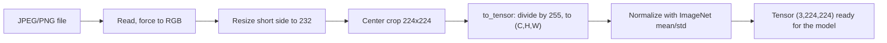

> **Learning objectives:** After this lesson, you will know how an image turns into a tensor before it reaches the model, be able to read the four numbers that decide everything (shape, dtype, value range, channel order), and see with real measurements that a few preprocessing mistakes - things the human eye cannot spot - can drop a model from near perfect to guessing without raising a single error.

## 1. Where this chapter starts

The Deep Learning chapter taught convolutional networks in lesson 09, but it taught them on FashionMNIST: grayscale, 28×28, already normalized, all wrapped up in a single line `datasets.FashionMNIST(...)`. Everything unpleasant about real image data had been cleaned up by someone beforehand.

This chapter peels that cleanup layer away. Real images have three color channels rather than one, every image has a different size, they live in JPEG or PNG files with all kinds of compression and rotation, and before reaching the model they must pass through a chain of transformations where **every step has room to go wrong**.

The point worth stressing: **the most dangerous bugs are the ones that do not throw an exception.** Some bugs kill the program immediately - pass the wrong number of channels or the wrong shape and PyTorch complains at once, and that is the pleasant kind because it reveals itself. The other kind lets the program run smoothly, the model returns predictions that look normal, and only the quality is silently broken. This lesson hunts for exactly that second kind. It lays out the transformation chain clearly, then deliberately breaks each step one at a time to measure how expensive each mistake is.

## 2. The four numbers that decide everything

To a model, an image is a **tensor**. Four properties of that tensor decide whether it is usable:

```python
from PIL import Image
from torchvision.transforms import functional as TF

img = Image.open("anh.jpg").convert("RGB")   # PIL Image, size depends on the file
x = TF.to_tensor(img)                        # float32 tensor

print(x.shape)   # torch.Size([3, H, W]) - channels come FIRST
print(x.dtype)   # torch.float32
print(x.min(), x.max())                      # 0.0 and 1.0
```

**Shape `(C, H, W)`.** PyTorch puts the color channels *first*: 3 channels, height H, width W. Image libraries often do the opposite - OpenCV returns an `(H, W, C)` array. Feed the wrong order to the model and you get either a shape error or, worse, something that runs but is meaningless.

**Data type.** An image file stores integers 0-255 per channel. The model needs floating-point numbers. `to_tensor` does both jobs: it converts the type and **divides by 255**.

**Value range.** After `to_tensor` it is [0, 1]. After normalization it no longer is - it becomes a range around 0, typically from about −2.1 to +2.6 with ImageNet statistics.

**Channel order.** `RGB` or `BGR`. PIL and torchvision use RGB; OpenCV reads files as BGR. This is the most classic trap, because both orders produce *equally valid* tensors - there is nothing to raise an error.

The full chain that an image classification model expects:



There is no need to write this chain by hand. Every set of torchvision weights carries its own preprocessing, exactly as Deep Learning · Lesson 11 used it:

```python
from torchvision.models import resnet50, ResNet50_Weights

weights = ResNet50_Weights.IMAGENET1K_V2
prep  = weights.transforms()     # correct resize, correct crop, correct mean/std
model = resnet50(weights=weights).eval()
```

The rest of the lesson answers one question: if you do *not* use `weights.transforms()` but rebuild it yourself and get one step wrong, how expensive is it?

## 3. One image, five ways to feed it in

Take exactly one image: `ILSVRC2012_val_00009111.JPEG`, 426×320, ground truth **tench** (a freshwater fish). Pass it through ResNet-50 five times, each time breaking a different step.

| How it is fed in | Tensor value range | Top three predictions |
|---|---|---|
| **Correct pipeline** | −2.12 … 2.64 | **tench 0.672** · barracouta 0.007 · reel 0.004 |
| Forgot to normalize | 0.00 … 1.00 | **tench 0.735** · reel 0.007 · barracouta 0.006 |
| Left on the 0-255 scale | −2.12 … **1136.36** | **wall clock 1.000** · goldfish 0.000 · tench 0.000 |
| Swapped RGB to BGR | −2.12 … 2.64 | **barracouta 0.248** · gar 0.120 · coho 0.084 |
| Distorting resize to 224×224 | −2.10 … 2.64 | **tench 0.632** · reel 0.006 · barracouta 0.004 |

Four things can be read from this table, and none of them is obvious.

**The third row is the scariest.** Keeping the 0-255 scale and still subtracting the ImageNet mean and dividing by the std produces a tensor with values up to 1136 - far from anything the model saw during training. It predicts **"wall clock"**, and it does so with probability **1.000**. Not 0.6 or 0.8 but a round 1.000. This is the first lesson of the chapter, and it will come back in lesson 12 when OCR reads "đồng" as "đổng" with confidence 0.982: **a model's confidence is not the probability that it is right.** The model only knows how to answer the question you give it; it has no way of knowing the input is broken.

**The fourth row is dangerous in a different way.** Swapping RGB to BGR produces a tensor with a value range **identical** to the correct row - also −2.12 to 2.64. Looking at the tensor statistics, there is no way to detect it. Only the result is wrong: the model still recognizes "this is a fish" (barracouta, gar and coho are all fish) but no longer recognizes *which fish*, because the colors have been swapped. The shape survives, the color does not.

**The second row runs against intuition.** Forgetting to normalize still gives a correct prediction, even *more confident* than the correct pipeline - 0.735 versus 0.672. Do not rush to conclude anything from a single image; section 4 measures it on nearly four thousand images.

**The last row does almost no harm.** Squeezing a 426×320 image into a 224×224 square distorts the aspect ratio, but the fish is still a fish.

> 🔧 **Try it now:** of the five rows above, which one could you detect *just by printing `x.min()` and `x.max()`* before calling the model?
> Only the third row. The 0-255 scale pushes values up to 1136, far outside the familiar range −2.1 … 2.6, so a single `print(x.min(), x.max())` catches it. Forgetting to normalize gives [0, 1] - also recognizable if you know which range you are expecting. But swapping RGB/BGR and distorting the aspect ratio **reveal nothing at all** in the tensor statistics: to catch them you have to look at the image itself, or compare results against a labeled set.

## 4. One image is not enough to conclude anything

A single image only tells you right or wrong - it does not tell you *how expensive* a mistake is. So measure all five ways again on **3,925 images** from the Imagenette validation set, with the same ResNet-50.

| How it is fed in | Tensor value range | Top-1 | Versus correct |
|---|---|---|---|
| **Correct pipeline** | −2.12 … 2.64 | **0.8718** | - |
| Distorting resize to 224×224 | −2.10 … 2.64 | 0.8757 | +0.4 |
| Forgot to normalize | 0.00 … 1.00 | 0.8627 | −0.9 |
| Swapped RGB to BGR | −2.12 … 2.64 | 0.8201 | **−5.2** |
| Left on the 0-255 scale | −2.12 … 1136.36 | **0.0000** | **−87.2** |

This table is sorted by damage, and the gaps between rows are what is worth remembering.

**Not every mistake is equally expensive.** There are three very different groups: one that is almost free, one that costs a few points, and one that wipes the model out. Beginners tend to worry equally about all five; the numbers say to worry in proportion.

**0.0000, not "somewhat worse".** Not a single one of the 3,925 images is predicted correctly. Guessing at random over 1,000 classes would still give about 0.1%. The model does not "get worse" - it is pushed into a completely unfamiliar numeric region and returns garbage consistently.

**Swapping color channels costs 5.2 points - and it is the hardest bug to catch.** It does not slow the program down, does not change the value range, does not raise an error. If you read images with OpenCV (`cv2.imread` returns BGR) and forget `cv2.cvtColor`, your model is silently 5 points worse forever.

> ⚠️ **A small note:** do not read the "distorting resize" row as *"distorting is better"*. A 0.4-point difference is **too small to read anything into**: with 3,925 images, the sampling error of a single accuracy figure around 0.87 alone is about half a point. (Strictly speaking, that figure is not yet the error of the *difference* between two results - the five variants are scored on the same images so they are correlated, and a proper comparison has to be done per image. Here it is enough to know that 0.4 points is below the readable threshold.) There is a reasonable explanation for why it is not worse: a 224×224 center crop *throws away* the edges of the image, while distortion keeps the whole frame. The two are different trade-offs and they tie on this dataset. The 5.2-point gap of the RGB/BGR row is far larger, so that is the number worth reading.

## 5. The same model, two very different numbers

There is a detail in the table above worth pausing on. The "correct pipeline" row scores **0.8718**. But Imagenette has only **10 classes** - if random guessing already gives 0.1, shouldn't a good model be close to 1.0?

It turns out the issue lies in *the question we are asking*. This ResNet-50 was trained on ImageNet with **1,000 classes**, and its `argmax` chooses among all 1,000. Re-score exactly those predictions but only allow a choice among the 10 Imagenette classes:

| Scoring method | Top-1 |
|---|---|
| `argmax` over all 1,000 classes | 0.8718 |
| `argmax` restricted to the 10 Imagenette classes | **0.9985** |

The same model, the same images, the same logits - a difference of **12.7 points**, purely from changing how it is scored.

Looking at the errors makes it clear what kind of mistakes the model makes:

| Ground truth | Predicted as | Count |
|---|---|---|
| cassette player | tape player | **92** |
| church | bell cote | 58 |
| church | monastery | 49 |
| church | vault | 23 |
| cassette player | cassette | 22 |
| cassette player | CD player | 20 |

There is no case of "fish becomes clock". The model predicts *tape player* instead of *cassette player*, *monastery* or *bell cote* instead of *church* - ImageNet classes so close to each other that many people would mix them up too. It saw the right thing in the image; ImageNet simply has a few neighboring names available and it picked the one next door.

This leads to a convention that **the whole chapter will use**. Computer Vision has a great many prebuilt models with published figures, and the three kinds of numbers below are very easy to mix up:

| Kind | Meaning | Example in this lesson |
|---|---|---|
| **Measured on this machine** | I ran it, on the hardware and data stated in the lesson | 0.8718 on 3,925 Imagenette images |
| **Published figure** | Published by torchvision or a paper, on their standard benchmark | ResNet-50 (`IMAGENET1K_V2`): **80.858%** top-1 on the 1,000-class ImageNet validation set |
| **Illustrative example** | A number constructed to explain a concept | the hand-computed IoU examples in lesson 07 |

These three kinds **cannot be compared with each other**. Concretely: 0.8718 and 80.858% look so close that it is easy to think they are the same, but they are measured on two different datasets, at two different levels of difficulty. From this lesson on, every table of numbers states which kind it is.

> ⚠️ **A small note:** this is not a formality. The fastest way for a report to lose credibility is to put a number you measured yourself next to a number from a paper and conclude "my model is better". To compare, you need the same dataset, the same scoring method, the same preprocessing - and the last four sections showed that preprocessing alone is enough to shift the result by **87 points**.

## 6. What this means for real work

Three things, ordered by how worthwhile they are.

**Use the preprocessing that comes with the model.** `weights.transforms()` eliminates three of the five mistakes in section 4 outright. Only build it yourself when you truly have to - and then copy the mean/std from the weights themselves rather than typing them by hand.

**Print the value range of the first tensor.** A single `print(x.shape, x.dtype, x.min(), x.max())` before the first model call catches the most expensive mistake in the table. It is so cheap there is no reason to skip it.

**Check with labeled images, not with your eyes.** The two remaining mistakes - swapped color channels and distorted aspect ratio - do not show up in the tensor statistics, and a human looking at a BGR image still sees "a normal fish, slightly odd colors". Only a small labeled set can tell you the real cost.

> 🔧 **Try it now:** a colleague reports that the model works well on their machine but much worse once it is put into the system. The system reads images with OpenCV. What do you check first?
> The channel order. `cv2.imread` returns **BGR** while torchvision models expect **RGB** - exactly the row that costs 5.2 points in section 4, and a bug that leaves no trace in the tensor statistics. A quick check: run the same image through both reading paths and compare the prediction vectors; if they differ, one path is wrong. Only after that come the value range (`cv2` returns a `uint8` array 0-255, which needs dividing by 255) and the dimension order (`(H, W, C)` rather than `(C, H, W)`).

## Lesson summary

- To a model, an image is a `float32` tensor `(C, H, W)`. Four things decide whether it is usable: shape, data type, value range, and channel order.
- The most dangerous preprocessing bugs are the kind that do **not** throw an exception: the program runs smoothly, the model still answers, and only the quality is silently broken. (Some bugs do kill the program immediately - wrong number of channels, wrong shape - and those are the much more pleasant kind.)
- Not every mistake is equally expensive: keeping the 0-255 scale drops top-1 from 0.8718 to **0.0000**; swapping RGB to BGR costs 5.2 points; forgetting to normalize costs 0.9 points; distorting the aspect ratio is within the noise.
- A tensor on the 0-255 scale makes the model predict "wall clock" for a picture of a fish with probability **1.000**. A model's confidence is not the probability that it is right - this comes back in lesson 12.
- A channel swap **does not show up in the tensor statistics**: the value range is identical to the correct version. The model still knows "this is a fish" but no longer knows which fish - the shape survives, the color does not.
- `weights.transforms()` eliminates three of those five mistakes, because preprocessing belongs to the model and must travel with the model.
- The same predictions score 0.8718 over 1,000 classes and 0.9985 within 10 classes. An accuracy number means nothing without the question it answers.
- The whole chapter distinguishes three kinds of numbers: **measured on this machine**, **published figures**, and **illustrative examples**. They cannot be compared with each other.

## Self-check questions

1. Name the four properties of an image tensor that decide whether it is usable with a pretrained model, and which of the four cannot be detected with `print(x.min(), x.max())`.
2. Why does keeping the 0-255 scale give a top-1 of exactly 0.0000, lower even than random guessing over 1,000 classes?
3. The model predicts "wall clock" with probability 1.000 for a picture of a fish. What does that 1.000 tell you and what does it not tell you?
4. Swapping RGB to BGR costs 5.2 points, but the model still predicts other fish species. Explain why, based on what the channel swap destroys and what it leaves intact.
5. Distorting the aspect ratio gives 0.8757 while the correct pipeline gives 0.8718. Why can you not conclude that distortion is better?
6. The same model, the same images: 0.8718 and 0.9985. What changed, and what is the lesson for reading any accuracy number?
7. You read a blog post saying their model reaches 0.92 on "a cats and dogs dataset". List three questions you must answer before comparing that number with the 0.8718 in this lesson.

## Further reading

**Foundational sources for this lesson:**

| Source | What to read |
|---|---|
| **Deep Learning · Lesson 09** | Convolutional networks on FashionMNIST - where the images are still pre-cleaned, to see what this lesson strips away |
| **Deep Learning · Lesson 11** | `weights.transforms()` and the principle that preprocessing belongs to the model |
| **Machine Learning · Lesson 11** | "Fit on train, transform the rest" - the same principle, in image form |
| **Dive into Deep Learning (d2l.ai)** | Chapter 14.1 *Image Augmentation* - the introduction to image transformations and the order they are applied in |

**Additional online sources (free):**

- [Transforming and augmenting images - torchvision documentation](https://pytorch.org/vision/stable/transforms.html) - the full list of transformations, and a section that spells out the order to apply them in.
- [Models and pre-trained weights - torchvision documentation](https://pytorch.org/vision/stable/models.html) - the table of published accuracy for each set of weights, and how to get the matching preprocessing with `weights.transforms()`.
- [Imagenette - the original repository](https://github.com/fastai/imagenette) - the 10-class subset of ImageNet used in this lesson, with the reason it was created.
- [Concepts - Pillow documentation](https://pillow.readthedocs.io/en/stable/handbook/concepts.html) - image modes (`RGB`, `L`, `CMYK`) and what each one means when you call `convert`.
- [Wightman, Touvron, Jégou - ResNet strikes back (2021)](https://arxiv.org/abs/2110.00476) - the training recipe behind the `IMAGENET1K_V2` weights used in this lesson, and a very clear example of the same architecture giving very different accuracy depending on the recipe.

> **Next lesson:** [From Convolution to LeNet, AlexNet and VGG](../from-convolution-to-lenet-alexnet-vgg/) - this lesson took care of feeding images in correctly. The next one goes inside the network - filling in two concepts the Deep Learning chapter did not fully build, **stride** and **receptive field**, then using them to read three classic architectures and answer why small filters stacked deep became the popular choice.
