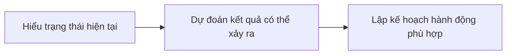
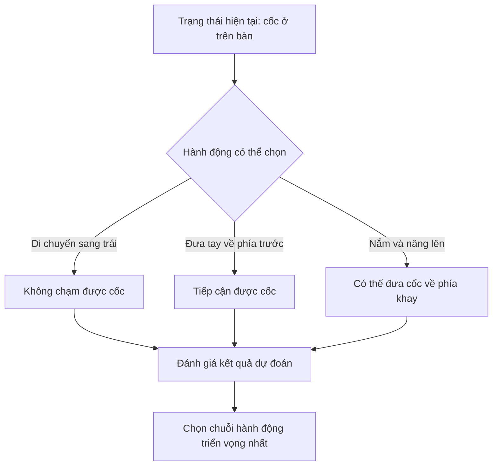
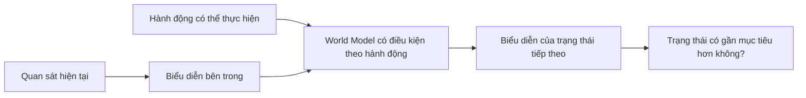
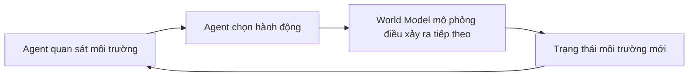
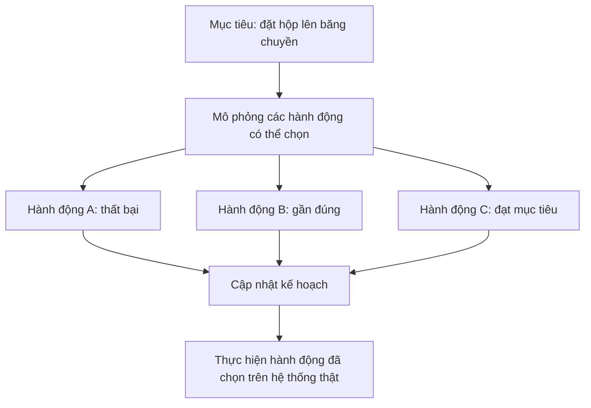
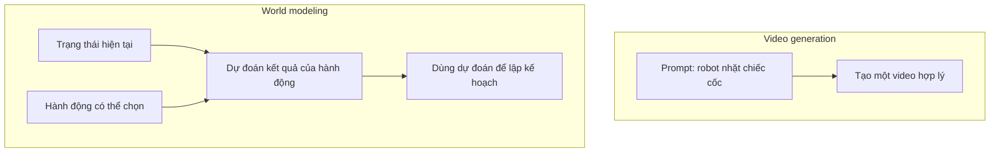
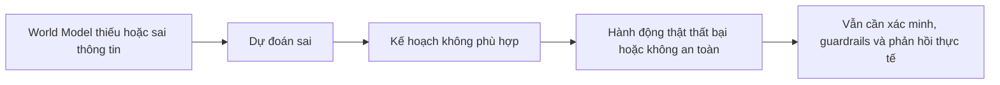
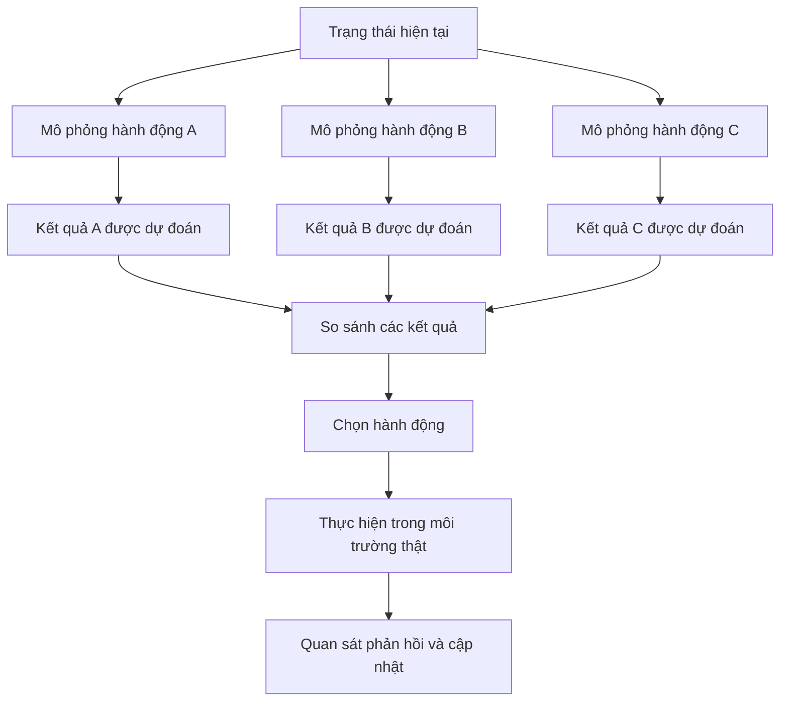

Hãy tưởng tượng một robot đang đứng trước một chiếc cốc ở mép bàn.

Robot có vài lựa chọn:

- đẩy chiếc cốc;
- cầm nó lên;
- kéo nó về phía mình;
- không làm gì cả.

Trước khi hành động, nếu robot có thể ước lượng:

> "Nếu mình đẩy theo hướng này, chiếc cốc có thể rơi xuống."

> "Nếu mình nắm ở vị trí kia, chiếc cốc có thể được nhấc lên."

thì nó sẽ có cơ hội chọn một hành động tốt hơn trước khi chạm vào bất cứ thứ gì.

Con người làm điều tương tự gần như tự nhiên. Chúng ta nhìn một quả bóng được tung lên và biết nó sẽ rơi xuống. Nhìn một cốc nước nghiêng quá nhiều và đoán nó sắp đổ. Chúng ta không cần thử mọi khả năng ngoài đời thật rồi mới nhận ra hậu quả có thể xảy ra.

Vậy nếu một hệ thống AI cũng học được một phiên bản hữu ích của khả năng đó thì sao?

Đó là trực giác phía sau **World Model**.

## 1. World Model là gì?

Có thể hiểu đơn giản:

> **World Model giúp một hệ thống AI biểu diễn cách môi trường thay đổi và dự đoán điều gì có thể xảy ra tiếp theo, đặc biệt sau khi một hành động được thực hiện.**

"World" ở đây không nhất thiết là toàn bộ thế giới. Nó có thể là một căn phòng, khu vực làm việc của robot, khung cảnh trên đường, trò chơi hoặc bất kỳ môi trường nào có trạng thái thay đổi theo thời gian.

Meta mô tả mục tiêu phía sau V-JEPA 2 qua ba khả năng:



Giả sử robot nhìn thấy một chiếc cốc và có mục tiêu đặt nó vào khay. Hệ thống lập kế hoạch có thể so sánh các hành động:



Model không cần biết tương lai với độ chắc chắn tuyệt đối. Nó cần những dự đoán đủ hữu ích để phân biệt hành động nào có triển vọng hơn.

## 2. "Tưởng tượng" là phép ví von, không có nghĩa AI suy nghĩ như con người

Khi nói AI có thể "tưởng tượng tương lai", chúng ta đang dùng cách nói dễ hiểu cho một quá trình kỹ thuật.

Hệ thống không nhất thiết nhìn thấy một đoạn phim trong đầu. Một số World Model tạo ra hình ảnh hoặc video mà con người có thể quan sát, nhưng những model khác dự đoán trong một không gian biểu diễn bên trong.

V-JEPA 2 là ví dụ cho hướng thứ hai. Thay vì cố tái tạo từng pixel của video tương lai, cách tiếp cận JEPA dự đoán những đặc trưng quan trọng trong một representation space đã được học.



Tại sao không dự đoán mọi pixel? Nhiều chi tiết hình ảnh rất khó dự đoán nhưng không quan trọng với task. Chuyển động chính xác của một chiếc bóng có thể ít quan trọng hơn việc tay robot có đang tiến về phía chiếc cốc hay không.

Trong nghiên cứu V-JEPA 2, model nền được học từ hơn một triệu giờ video. Phiên bản có điều kiện theo hành động, V-JEPA 2-AC, sau đó được huấn luyện với chưa đến 62 giờ video robot không gắn nhãn và được dùng để lập kế hoạch pick-and-place zero-shot cho cánh tay robot trong những phòng thí nghiệm mới.

Đây là kết quả nghiên cứu đáng chú ý, nhưng vẫn là thử nghiệm trong môi trường có kiểm soát, không phải bằng chứng rằng model hiểu mọi tình huống vật lý.

## 3. Một loại World Model khác tạo ra môi trường mà AI có thể bước vào

**Genie 3** của Google DeepMind giúp ý tưởng World Model trở nên rất trực quan.

Genie 3 có thể tạo một môi trường tương tác từ mô tả bằng text. Người dùng hoặc Agent có thể di chuyển bên trong, còn model tiếp tục sinh ra thế giới dựa trên những hành động đó.

Ví dụ, prompt có thể mô tả:

> "Một con đường phủ đầy tuyết giữa vùng núi."

Model tạo ra môi trường. Khi người dùng di chuyển về phía trước, nó sinh ra phần tiếp theo trong khi cố duy trì trạng thái và tính nhất quán về hình ảnh của thế giới.



DeepMind mô tả World Model là hệ thống mô phỏng các khía cạnh của môi trường để Agent có thể dự đoán thế giới sẽ phát triển thế nào và hành động của nó có thể ảnh hưởng tới môi trường ra sao.

Genie 3 hiện tạo môi trường 720p ở tốc độ khoảng 20 đến 24 khung hình mỗi giây và có thể duy trì tương tác liên tục trong vài phút. Điều đó khiến nó khác một video cố định, nhưng chưa biến nó thành bản mô phỏng chính xác và tồn tại lâu dài của thế giới thật.

## 4. Tại sao cần mô phỏng thay vì chỉ thử ngoài đời thật?

Hãy tưởng tượng chúng ta đang huấn luyện một robot trong nhà máy cầm chiếc hộp, xoay nó rồi đặt lên băng chuyền.

Nếu mỗi lần thử sai đều xảy ra ngoài đời, robot có thể làm rơi hàng, làm hỏng thiết bị, mất thời gian hoặc gây nguy hiểm.

Môi trường mô phỏng có thể giúp Agent thử các khả năng trước khi thực hiện hành động vật lý:



Simulation đã được dùng trong robotics và reinforcement learning từ lâu. Hướng đi mới hơn là học những biểu diễn rộng về môi trường từ lượng dữ liệu lớn như video, thay vì phải lập trình thủ công mọi vật thể và quy luật vật lý cho từng tình huống.

Điều này không loại bỏ nhu cầu kiểm thử ngoài đời thật. Nó có thể giúp giảm lượng thử sai mù quáng trong những môi trường đắt đỏ hoặc nguy hiểm.

## 5. World Model có phải chỉ dành cho robot?

Không. Robotics chỉ là ví dụ dễ hình dung nhất vì quan hệ giữa **hành động và hậu quả** hiện ra rất rõ.

World Model có thể hữu ích ở bất cứ nơi nào hệ thống AI cần suy luận về cách môi trường thay đổi, chẳng hạn:

- robot;
- hệ thống tự động;
- game;
- môi trường tương tác mô phỏng;
- huấn luyện và đánh giá Agent;
- lập kế hoạch trong thế giới vật lý.

Môi trường được tạo ra cũng có thể đặt Agent vào nhiều tình huống rất tốn kém, hiếm gặp hoặc nguy hiểm nếu phải dựng lại ngoài đời thật.

Mỗi lĩnh vực có yêu cầu khác nhau. Một game có thể ưu tiên tính nhất quán về hình ảnh và khả năng điều khiển. Một robot planner có thể quan tâm nhiều hơn tới chuyển động của vật thể, tiếp xúc vật lý và khả năng đạt mục tiêu. Không có một World Model duy nhất tự động giải quyết mọi loại môi trường.

## 6. World Model có giống video generator không?

Không hẳn.

Hai hướng có thể giao nhau vì đều có khả năng tạo hình ảnh về điều xảy ra tiếp theo. Tuy nhiên, mục tiêu chính có thể khác nhau.

| | Video generator | World Model dùng cho planning |
| --- | --- | --- |
| Đầu vào thường gặp | Text, hình ảnh hoặc video prompt | Trạng thái hiện tại, hành động có thể chọn và đôi khi có cả mục tiêu |
| Mục tiêu chính | Tạo ra video hợp lý | Dự đoán trạng thái thay đổi thế nào sau một hành động |
| Tính chất quan trọng | Chất lượng hình ảnh và mức độ bám prompt | Tính nhất quán theo hành động và khả năng hỗ trợ quyết định |
| Đầu ra thường gặp | Một chuỗi video | Trạng thái tương lai, representation, trajectory hoặc môi trường mô phỏng |



Một hệ thống như Genie 3 nằm gần vùng giao nhau: nó tạo môi trường hình ảnh nhưng đồng thời khiến môi trường có thể được điều khiển và phản hồi theo hành động.

Điểm phân biệt quan trọng không chỉ là model có sinh video hay không. Điều cần hỏi là model có cung cấp sự chuyển đổi trạng thái đủ hữu ích để Agent tương tác, học, đánh giá hoặc lập kế hoạch hay không.

## 7. World Model vẫn chỉ là một model, không phải bản sao hoàn hảo của thế giới

Chúng ta rất dễ hình dung một AI có thể mô phỏng hoàn hảo thế giới trước khi hành động. Các hệ thống hiện tại vẫn còn rất xa khả năng đó.

DeepMind công bố một số giới hạn của Genie 3:

- phạm vi hành động dành cho Agent còn hạn chế;
- việc mô phỏng tương tác giữa nhiều Agent độc lập vẫn khó;
- các địa điểm thật không được tái tạo với độ chính xác hoàn hảo;
- text rõ ràng vẫn khó sinh nếu không có trong prompt;
- thời gian tương tác liên tục mới kéo dài vài phút thay vì nhiều giờ.

Nhìn rộng hơn, bất kỳ World Model nào cũng có thể thất bại khi gặp vật thể lạ, sự kiện hiếm, biến số bị ẩn hoặc tương tác vật lý mà representation của nó không nắm bắt được.



Nếu model dự đoán hành động A an toàn trong khi ngoài đời nó nguy hiểm, Agent vẫn có thể mắc lỗi.

Vì vậy, World Model không nên được xem như một cỗ máy biết trước tương lai. Nó là cơ chế dự đoán có phạm vi, sai số và những giả định cần được kiểm thử.

## 8. Từ phản ứng sau khi hành động tới dự đoán trước khi hành động

Nhiều Agent đơn giản hoạt động theo kiểu phản ứng:

```text
Hành động -> quan sát kết quả -> điều chỉnh
```

World Model có thể thêm một bước lập kế hoạch trước khi hành động bên ngoài:



Thay đổi ở đây là từ việc luôn phải **làm rồi mới biết** sang khả năng **dự đoán trước rồi mới làm**.

Đó là lý do World Model nhận được nhiều sự quan tâm trong robotics và embodied AI. Một Agent hoạt động trong thế giới không chỉ cần nhận ra điều gì đang xảy ra. Nó còn có lợi khi ước lượng được điều gì có thể xảy ra tiếp theo.

Điều này không có nghĩa AI đã sở hữu trí tưởng tượng giống con người. Nó có nghĩa hệ thống có thể học được cấu trúc dự đoán hữu ích cho việc ra quyết định.

Qua các bài trước, chúng ta đã thấy những thành phần khác nhau đảm nhận các vai trò khác nhau:

- reasoning model phân tích những vấn đề khó;
- [model System-1-like](../system-1-vs-system-2-in-ai-vi/) đưa ra quyết định nhanh và có phạm vi hẹp;
- Agent chọn hành động và sử dụng tool;
- [memory](../why-ai-forgets-memory-vi/) mang thông tin liên quan đi qua thời gian;
- World Model ước lượng môi trường có thể thay đổi như thế nào.

Từ đó xuất hiện một câu hỏi khác:

> **Tương lai sẽ dùng một model khổng lồ để làm tất cả những việc này, hay mỗi loại model sẽ chuyên trách một phần trong hệ thống?**

Đó là câu chuyện tiếp theo.

## Nguồn tham khảo

- [Meta AI - Introducing V-JEPA 2](https://ai.meta.com/research/vjepa/)
- [V-JEPA 2 research paper](https://arxiv.org/abs/2506.09985)
- [Google DeepMind - Genie 3](https://deepmind.google/models/genie/)
- [Google DeepMind - Genie 3: A new frontier for world models](https://deepmind.google/blog/genie-3-a-new-frontier-for-world-models/)
- [World Models research paper](https://arxiv.org/abs/1803.10122)
